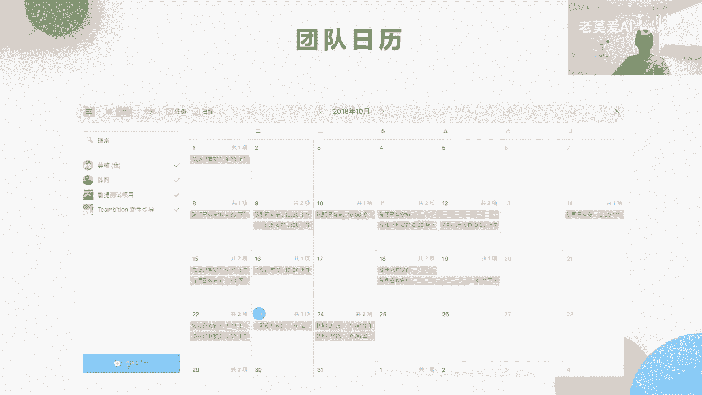
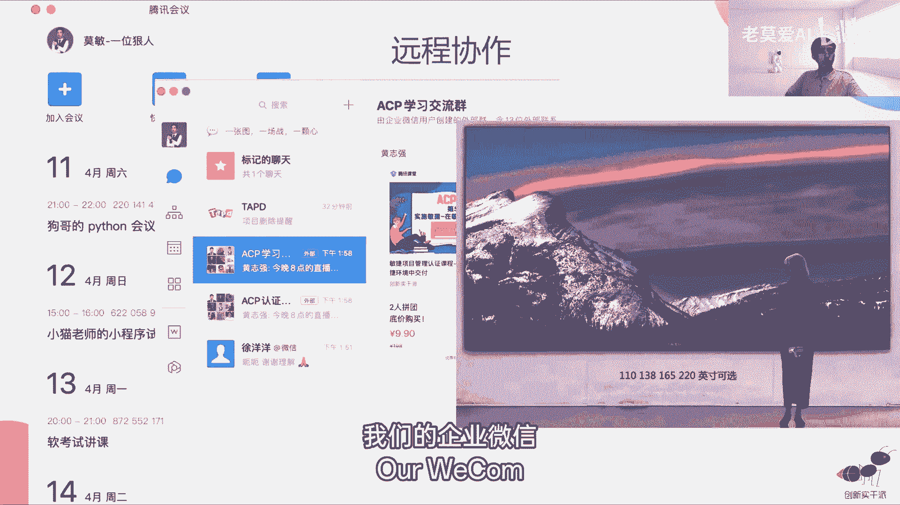
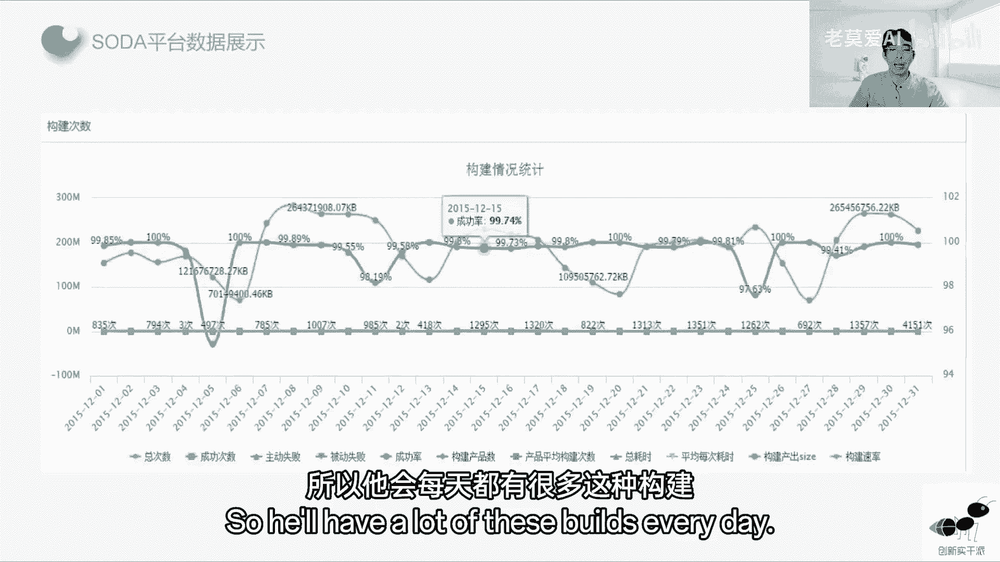
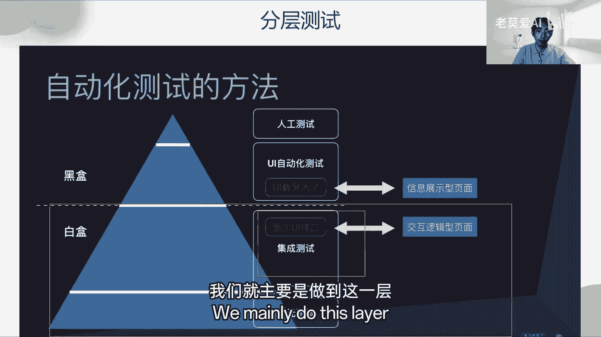
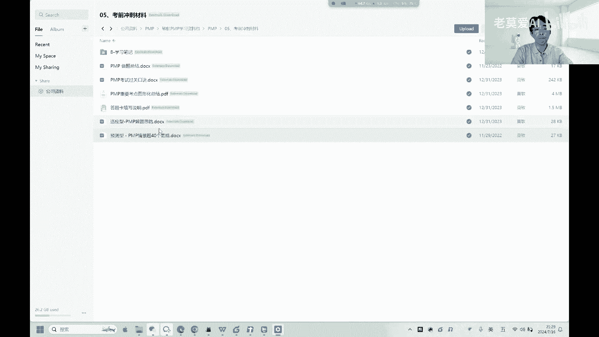

# 【最好的PMP课程】PMBOK7精华讲解2-3 - P1 - 老莫爱AI - BV1rw4m1r7Ag

项目经理要记下来以后去跟进，这个问题有没有得到解决，是这样的，展会团队集合猪的故事其实说的是什么，有一只鸡，也就是说团队之外的人，或者是一个领导或者客户，他就跟一只猪说，我们最近火腿和鸡蛋卖的比较火。

我们去开一家这样的店，猪就说不要了，因为火腿卖的是我的腿，鸡蛋，你每天都可以产生，就是说这个事情这个利益跟你来说，你是间接利益者，你是间接提供的，但是我是指直接利益者，你在不知情的时候。

你不要去怎么样去指挥我，因为我很知道这个事情对我来说意味着什么，这个就是鸡和猪的故事，OK进度同步，我们这里展示了一个进度同步的，一个项目管理工具，可账会纪要那章要你肯定要是要记，那谁来记账会纪要。

正确答案是他master或者做项目经理来记记，但会它需要有一个发射源，比如说环境图，它其实是预测产品发布趋势的一个图，它的曲线它是一条斜向45度的一个线，它里面展示的是什么东西啊。

它里面横坐标它展示的是时间，纵坐标展示的是完成的功能，或者是说任务都可以，他意思就是说随着这个时间的结束，这个任务肯定会被慢慢的去减少，曲线是它本应该线性地减少这么多，上面的实现。

折现一下上一下下的这个意思，就是说它实际上每天它所减少的这个功能，或者是说所减少的任务，就是做完的任务，它关注于剩余的任务量，如果你的这个折线是在这个虚线之上，说明什么，今天的进度有点慢。

如果这个实现在这个虚线之下，说明今天的进度我们慢慢赶上来了，会比较快，所以他为什么能够预测发布趋势，你要看最后快到终点的时候，他收不收敛，如果快到终点的时候，它这个实线还一直在虚线的上面。

就证明很可能这个项目完不成，这个报告，就一眼能够看出来这个是燃尽图的东西，还有一个是燃起图，燃起图跟燃尽图刚好相反，横坐标它是时间，那么它的纵坐标它是怎么样每天完成的功能。

那么这个他关注的角度不是剩余公认的，他是完成情况的波动，也就是说他能够看到团队的这个静态状况，是团队每天完成的多和少，他关注的是完成的多少，比如说开发完成是快还是慢，测试完成是快还是慢。

他是关注着这个东西，所以他关注点是不一样的，那燃尽图和燃起图谁来去做，其实燃尽图和燃起图，如果有项目管理的这个系统的，只要团队更新就可以了，但是如果没有这个系统，那是谁来做还是他来做，因为他是专业的。

项目经理，是专业的，再来是团队的节奏，他里面就会有说，比如说每天我们要开晨会，周五的时候我们要开周会啊，还有下一个迭代的评审会议啊，另外第二个周五我们有需求评审会议，那么这个里面它会有什么东西。

为什么需要有团队节奏，团队节奏，是让团队能够保持我们的周期性的一个东西，那么也就是说团队当有了这个团队的节奏，这个表之后，团队的每个人，比如说你要请试驾，你肯定会避开什么周五，因为你知道大家周五都很忙。

会开很多会议，周五的时候没什么事的时候，大家一定要参加，这个就是一个团队节奏的东西啊，O好，这个是团队日历，团队对日历是用来团同步，团队和团队之间的进展的东西和团队日历。

好在团队的过程当中，我我们进行远程协作，那么远程协作就不说了，很多工具啊，什么腾讯会议，什么视频的这个东西，这个东西都会有我们的企业微信。

它也是一种一个团队协作的一个工具，OK测试用例我们就不说了，因为测试用例这个不考需要变更，一定会考，那变更的来源一般是第一个市场的变化，因为敏捷，第二个是老板的需求，第三个是线上紧急问题处理。

这个很多紧急的事情插过来，我们都需要去变更，那么变更的处理的建议，第一个是调整团队的心态，也就是说在敏捷的过程当中，我们认为拥抱变化是更重要的，也就是说团队应该积极的去用应对变更。

有了这个积极的心态以后，我们需要去分析变更，分析变更完了之后，我们需要去应对变更，重新制定计划，最后再变更回馈，那变更回馈其实是更重要的，我们做了这个变更以后，团队肯定会士气下降。

但是如果你的产品告诉大家，我们做完这个变更以后，我们的收入得到提升了，大家其实怎么样，就会很有信心去接受下一次的变更啊，所以这个其实是更加重要一些，在整个需求变更的上面，这个跟谷老师说的。

我们的传统的项目管理不一样的，是在敏捷的项目管理里面，他需求变更，大家还记得以前在项目管理的时候，我们在传统项目管理的时候变更，他有一个变更委员会是吧，叫做CCB的成员，为什么会成立一个变更委员会呢。

是因为其实传统的项目管理里面，是不那么欢迎变更的，所以敏捷里面就正好相反，所以CCB这个时候去哪了呀，cc b其实就已经下饭了，ACB的所有的功能都放给了授权，给了团队。

就团队来决定这个变更怎么变变到哪里，现在是下凡的地方，就变成了一个这样的东西了，这个是最大的区别，每日章会执行过程当中，我们已经说完了，最后就说一下项目收尾，我们先首先搜一下结果的收尾，其实有两个。

一个叫修case，一个叫评审，那么修case跟评审最大区别是修case，它其实你还记得我们前面说的那个验收条件吗，对于每一个用户故事的验收条件的验收，这个叫修case，每一个用户故事单独去验收。

因为用户故事他都可以单独验收的，这个叫修case，那么评审他是对整个迭代，就比如说我们之前说了，我们这个迭代要做五个用户故事，那么这一个小用户故事的验收，我们叫修case，五个功能的一起的验收。

我们叫做什么事，就case它的目的跟那个评审不太一样，修q case的目的第一个是加强开发自测，因为开发它要让产品的验收他必须要自测，第二个是降低修复成本，他验收这个功能的时候。

你如果当时就能提出来这个功能不是这样的，那么它修复的成本就越小，比你最后五个功能全部集成出来，然后再修复它的难度要大很多，因为这五个功能是由五，可能是有十个人一起写出来的，那么是谁写出来的问题，对不对。

所以要排查什么东西就一大堆，要定义问题，所以他修复的成本比较高，但是你这个用户故事产品验收了以后，就是验收开发写的这功能，他立马就知道这是我自己写的，有问题是吧，那么它修复成本就越低啊。

修复case其实是做这个事情，所以参加修case的人员，一般修case3到5分钟就搞完了很快，所以开发人员发起产品经理，测试人员，项目经理参与就行了，修case的步骤，第一个就是代码完成，开发完成了。

按产品来验收，验收完了之后，开发立马修复代码团队再次验收，验收完成，在验收完成之后，这个功能才可以转测试，所以修case在测试前做，是在测试的测试前做集成测试之前。

所以修case他只要在开发的环境就可以了，23分钟搞定评审，评审的目的，因为评审会有客户参加，所以第一个目的是由客户更加满意，第二个产品开发更加清晰，第三个防止团队方向错误，第四个团队得到及时反馈。

你也可以把评审会，当做一个产品的内部发布会议，就像雷军发布小米一样，雷军发布小米手机什么东西，那外部发布对不对，对于全网的人民发布，其实在公司内部，他每一次都会有一个公司内部的一次发布，这个就叫评审。

参加评审的人也有这些产品经理，有些有客户评审的目步骤，因为评审是一次性评审，很多功功能，要把这些功能集成放在某一个环境里面，所以有一个叫做平整环境的东西，去邀请人员参加，第三步，我们要做演示。

就像那个小米演示那个小米14pro抖机一样的，要实际去演示一下了，大家提出一些评审的问题，最后就是产品经理站出来，产品我们叫做产品负责人站出来，Product owner。

他说这一次功能这五个功能我验不验收，或者这五个功能我觉得做的不好，我拒绝验收，他可以做出这样的决定，PO在会议上做出这样的决定，最后一步是探讨我们下一轮迭代的内容，其实就画个饼。

说我们这一次我们做成什么样子，下一次我们预计做成什么样子，这个是给大家一个预期，因为有客户在，你必须要给大家一个预期，对不对，做评审，所以评审的要点，第一个是探讨下个迭代的工作，就是预期的画饼的东西。

第二个是评审他两个小时，如果是两周一个迭代就两个小时，有一些是说我们一个月一个迭代，那就是四个小时评审的要点O，那这个东西我们就先跳过了，先讲一下回顾，那么回顾性的目的是什么。

回顾的目的是我们帮助团队去不断的提升，因为团队要不断的去审视自己，做事的这样一个过程，做事的流程，然后不断的去优化我们的流程才能够提升，所以敏捷宣言它有一个背后的原则，是团队要定期反省如何能够更加有效。

并且相应的调整团队的行为，这样一个过程，回顾会的时机，他有几个啊，这个东西曾经考过，大家可以记一下，当团队完成一个发布或者加入一些功能时，它可以是任何发布，比如说一个小的功能的发布。

但是我们认为它很重要，我们就开一次回复会，第二个是团队上次回顾完以后，过了几周时间，我们一直没有开会了，定时可以开一个会议，第三个是当团队出现问题的时候，比如说我们团队协作不流畅的时候。

我们可以开支会议，第四个是团队打到任何里程碑的时候，比如说我从300万这个用户，到400万用户的时候，我们这个时候我们可以总结一下，说我们到达400万用户的时候，我们做对了哪些事情。

导致我们能够有这么多用户，这个是一个里程碑，或者是说我们在做手机或者做什么东西的时候，我们在做完样品以后，我们开始量产，在量产之前我们可以去做一个回顾，会说我们之前量产的时候，在量产之前我们做对了什么。

这个过程我们做对了什么东西啊，我们做错了什么东西，怎么样让我们后面做的更好，这个是我们要去思考的问题，好第五个就是当出现外网故障的时候，我们就会需要去做回顾回顾，有专门的一本书要复盘，大家如果有空。

如果你想夯实你的项目管理的经验的时候，你们可以看一下这本书，回顾会的过程，第一个是展示数据，不管是结果数据也好，还是过程数据也好，什么叫结果数据，就是你的这一次我的用户有没有增加，我们的收入。

有没有增加，这个东西是接口数据，过程数据是哎，我们写出了我们交付了这个功能，我们这一次交付了多少功能，而这些功能的它的质量怎么样，它的bug率怎么样，有没有出现一些外网的故障，那外网故障的时间。

这些东西它都是一些过程的数据的东西，那么这些数据都要去展示出来，然后第二个环节，就是哪些做得好和哪些做的不好的，那么做的好的就应该去保持，我们就会有一个笑脸，做的不好的点，我们可以改进的。

我们就是一个哭脸，可以贴在我们的便利贴上面，那么我建议是工作做得好的，我们每一个做得好，我们有十个点，这个点每一个点用单独一张纸，不要把十个点写在一张纸上，那么做的不好的也是一样的。

就是说做的不好的有十个点，那么每一点就写在一张纸上，而且每一个人都至少要写一个，这样我们就可以去做归类，可以做归类，我们可以选出大家共性的top3的问题，因为归类完了之后，你会发现。

比如说大家都觉得这一次测试做的不好，那么如果我们团队有十个人，每个人都觉得测试做的不好的时候，那么这是这个问题，就是团队目前最大的问题就是top3的问题，我们要有待去解决的，所以在每一次回顾会上。

不是一定说回顾会我们要解决所有的问题，我们也解决不了所有问题，我们只是抓大放小，把最优先级的top3的问题去解决了，下一个回顾会又会产生top3的问题，又慢慢去解决就OK了。

这个里面就是回顾的一些中间的过程东西啊，还有团队的速率，也是在回顾社会上我们要去总结的，比如说一个迭代的所有的故事点之和，其实就是我们的团队的速率，要记得是完成的所有的故事点之和，打个比方。

我们理解我们需求池，它有这么多个功能，这么多需求，我们这一次迭代，我们挑出了四个需求，这个需求四个需求，但是这四个需求我们只完成了三个，还有一个没完成，那么我们当时估算的，我们团队的速率应该是18是吧。

8+5加3+2，但是实际我们团队完成的速率，其实是多少呢，就是8+5加三等于16，有两个没完成，那么下一个迭代，我们应该选多少的用户故事点的功能去做的，答案是16，以我们实际能完成的物为准。

就这个意思回顾最大的这个要点，就是问题要去闭环，问题怎么去闭环，top3的问题分析出来以后，要有问题解决的方案，要有方案的负责人，要有负责人，最后他估算的要去解决的时间，在他这个要完成的时间里面。

每周要进行汇报，他五它解决了哪些部分，什么时候能彻底完成，就是要闭环，如果问题不会闭，不闭环就变成了周，而复始的提问题，问题又不又没有解决，那么团队的士气就会很低。

而且团队也没有办法通过回不会不断的去提升，那回顾G2的表格，一般是这样的，做得好的地方，序号事项说明，做的不好的地方就是什么虚好事项，负责人和完成时间，这个要跟进起来，这个就不说了。

常见的敏捷实践里面有基于迭代的敏捷，交付价值的实践和增量反馈，基于迭代的敏捷，这里面其实就是什么去思考一个问题，这第一个就是A团队和B团队，哪个团队效率很高，比如说A团队一个迭代两周完成五个故事点。

B团队一个迭代两周完成七个故事点是吧，那是A高还是B高，你们觉得呢正确答案是不知道，因为我们前面说了，每一个团队他估算故事点的基准是不一样的，迭代速度它能够做成对比指标吗，谁完成的速度越快。

就一定证明它这个A团队比B团队优秀嘛，也不一定，为什么不一定，比如A团队他虽然速度慢，但是他攻坚团队他做的功能都很难很大，B团队他不是攻坚团队，他做的东西功能都比较简单，比如说一些登录啊，一些支付啊。

这些东西相对比较简单一点的东西，所以你完成数字化又能代表什么东西呢，所以这个东西不能够很直观的这样去比较啊，如果你的问题来了，如果你的领导让你去度量团队的绩效，应该怎么去度量，从几个方面。

第一个是从速度，第二个是从质量，第三个是从价值，每一个部分你给出一定的权重就可以了，就看领导重视什么东西，第一个是需求的响应能力，A团队和B团队他对于业务需求的响应的能力，第一个是业务需求的前置周期。

也就是说这个需求从提出来到被列到，丢到需求池里面，它的时间啊，第二个是用户故事的交付时，交付周期就是这个需求从需求池拿出来，到最后完成交付发布的这个时间，这个都代表了需求响应能力，第二个是发布能力。

发布能力，就比如说A团队它的集成测试周期周周期越短，证明他团队的这个能力越强，第三个是发布频率，发布频率越快，当然越好，解决发布问题的平均时长越短越好，内部质量，比如说缺陷引流数啊。

第二个是用户故事的缺陷数，也就是说你写出来的bug越少越好，开网质量就是年平均故障率，你的app在外面去跑，你单机的这样一个时间越短越好，对啊，这个是外网资料，那就看看你的团队。

是看做外网质量还是内网质量，对不对，所以第三个就是价值价值体现了两点，第一个需求吞吐量，单位时间内交付的业务需求数，只是说A团队他一个月做了十个需求对吧，B团队一个月做了多少个需求。

不仅仅是比需求的这个数量，而且要比一个交付的有效性，也就是说需求的业务价值，只有当业务价值去乘以这个数量之后，我们才能比较AB两个团队，所以他们是这样的一个多种维度的去判断，就像说我们评一个打分一样。

我们评一个奥运会跳水项目的打分，一定不是说我们某一个动作做得好，我们就打分了，而是说他这个动作它的技术难度有多大，对不对，它整体的比如说他是双人跳水，它整体的A和B两个人的默契度，他一致性有多强。

他们一起落水，他这水花压的怎么样，他从多个维度去判断，那么判断A和B团队他的不同的这个团队绩效，他也是从多个维度去判断，多个维度去打分，给一个参考值，参考值就可以了，下一个迭代的重力值，这个已经说过了。

就不说了，常见的敏捷的反模式，反模式就是你看起来敏捷，其实不敏捷，第一个是完成专注于交付任务，而不是交付价值，这个就是传统的项目管理，第二个我们已经足够敏捷，放任美放弃每日战。

会在这个我们做题里面一定不要去放弃，不做回顾，这个是不对的，一定回顾，所以一定是要做的，会议不尊重时间和的原则，时间和在敏捷里面是一个非常被提及，最多的一个概念，也是最好的一个东西啊。

就叫在这个敏捷里面叫做time box，结合时间和体现在哪点，每一次开会的时候，它会有一个截止日期，这个一般是定时的，每一个迭代，比如说一周他如果两周迭代，那下一次又是两周迭代，它就是烧了时间。

一定要发布时间和，所以在敏捷里面有非常多的时间和的，一些时间啊，团队以仅以速度作为衡量标准，这个是不对的，前面已经说过了，要多个维度，第二个是交付价值的实践，就比如说第一个是持续集成。

他这个也是交付价值，因为我之前做过持续集成，其实很清楚持续集成就是什么，从代码提交开始，它能够自动构建，自动测试，自动发布，这个叫持续集成，这是第一个持续集成，我们以前也在做游戏的。

我们当时做了整个腾讯所有游戏的这样一个，发布了持续集成的平台，就所有的游戏它只要提交代码，这个代码合不合格是吧，代码有什么问题，没有再走到他的构建完了之后再发布，在最后再去进行测试，测试完了。

结果再反通过平台反馈给游戏的开发者，项目组告诉你，告诉他这个结果怎么样，所以他会每天都有很多这种构建的。

详细的数据展示，这里好分层测试就是自动化测试，自动化测试其实在很多公司里面，特别是在像这种游戏公司，特别是我们腾讯做游戏的这个公司，因为它UI变化很快，他就没有办法去做很多UI的测试。

但是它可以最大程度的去做这种接口测试，我们也就主要是做到这一层，接口测试的这样一个层面，UI自动化测试其实很难去做，OK我们就主要是做到这一层TDD与为TTD。

这个里面现在已经不考了，但是这个概念大家要知道一下，一个是测试驱动开发，一个是验收测试驱动开发啊，验收测试是面对集体的方法，大家一起去验收，但是测试驱动开发，这主要是面向个体，特别是面向开发的方法。

就是开发人员去用的，OK这个是整个团队去用的，这不是业不一样，但是共同的点都是使得提前定好标准，让团队往正确的方向去走，最后就是增量和反馈，增量和反馈我们可以反复去提到这个东西，就是迭代和增量的概念。

其实反馈它就是迭代，你就像这个IPHONE4跟IPHONE4S以前，IPHONE的命名是这样的，就是不像现在什么十四十五十六，他以前是IPHONE4以后有个4S，四五以后有个5S。

每一个S其实是对于之前的那一部分，它外表上几乎没有变化，它是对之前的功能的完善，所以当年的苹果是每两代出一个新的外观，当然现在的苹果已经很久没有更新新的外观，自从IPHONE10的以后。

已经没有新的外观了，就这个全面屏的样子，在13的时候有一个我们在十十四的时候是吧，14的时候又增加了一个零，14pro的时候增加一个灵动档，到15到现在也没什么变化，也不如直角变圆一点。

也没有什么去变化，那更多的就是不断的去反馈迭代的东西，所以我们可以认为在苹果苹果14之后到15，它几乎就是14，15其实就是14的迭代版本，回评审与回顾的作用，这个是反复在提，这个一定会考评审。

他评审的是结果，评审对应的是结果，我们去验收这个结果，回顾它是一个关门会议，是团队，其他成员就是团队以外的人员一般不会参加，他回顾的是过程，我们团队内部我们做的好的地方，做的不好的地方有哪些啊。

这个OK好，那今天的分享就已经完了，下一次我们分享的时候是敏捷串讲三，敏捷串讲三其实是跟考题更接近一些，它我们现在做的事情更多的是335，五当中的五就是整个会议他怎么开，整个会议。

他的那些开的这个人是怎么样的，他每一个人的职责是什么，在会议当中他承担一个什么角色，那么敏捷串联三里面更多的是讲的，在实际的我们怎么去运用这些会议的题目的，这些场景，他应该是怎么样去运作啊。

那么下一次我们就是敏捷串讲，三会跟大家再去讲，除此之外，我今天前面跟大家讲的这三个文件，大家真的要好好看一下，我给大家再来。

最后看一眼这个东西，就这三个文件，PMP重要考点图形化总结，然后适应型解题思路和预测型，这三个就是敏捷PMP学习资料包，这三个文件大家一定要好好看看，对你提分非常有帮助，至少是15分，OK好。

那今天的直播就到这里。

