# 【最好的PMP课程】PMP高频错题讲解1-2 - P1 - 老莫爱AI - BV1fjsjeYErM

是根本原因分析，所以考的就是根本原因分析的工具好，第169题，一个项目经理正在和三个虚拟团队一起做项目，团队A与团队B和团队C处于不同的时区，项目进行的很顺利，但最近A团队开始觉得自己被冷落了。

项目信息到达A团队的时间较晚，或者有时候会错过B和C团队，会优先考虑彼此的问题，而不是A团队，项目经理已经设定了项目指导方针，但意识到需要改进，那么项目经理应该做什么，做哪两件事情来协作。

这个考的是什么，你看一看一看虚拟团队，那么就是考的虚拟团队嘛，虚拟团队在不同的时区，那么虚拟团队怎么做沟通和改进等，那么这两个团队是是怎么回事，B和C团队我估计是这两个时空可能隔的比较。

就这两个团队可能时区隔的比较近，所以他们彼此都会多考虑自己的问题，那A团队可能它的时区比较，跟大家可能不太一样，差距比较大，所以大家其实在A团队开会的时候，可能经常来不了，或者是什么的，什么原因。

原因我们不得而知，但是我们知道，就是说如果遇到虚拟团队的这样的杰作的问题，我们应该做什么事情，应该什么样，每周进度会让他们轮流担任关论关键角色，这样的你轮流担任，会使得说大家都轮流坐庄。

不会是说某一个人他总是跟另外一个人玩，对不对，所以正确答案是A，那么C是什么，格温进行沟通管理计划，我说过虚拟团队最大的问题是沟通，就是他比面对面的这些团队需要的沟通计划，他要更详细啊，因为它更难沟通。

因为他大家都不在一个时区，所以他要做事无巨细的沟通计划，所以沟通管理计划，它是要做这种高层级的这样的沟通管理，比如说使用什么样的工具啊，使用什么样的邮件啊，在哪个时区，我们以哪个时区为准，几点钟开会。

这些东西都是沟通管理计划里面，所要讲到的事情，大家积极的加以审查，说这个计划制定出来以后，大家有没有什么意见，有意见赶快提，就是这个啊，所以正确答案是AC好。

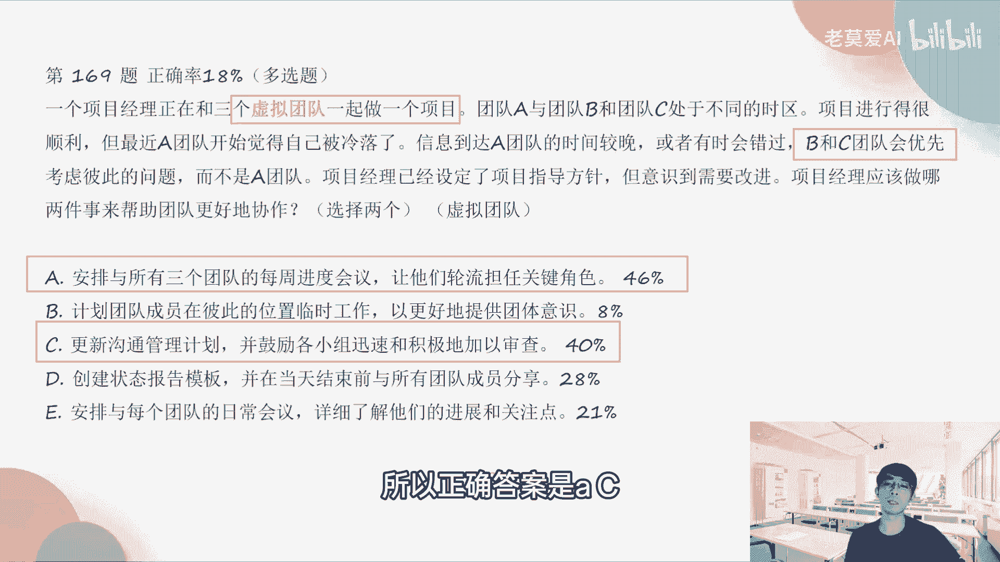

第178题，高地项目经理，正在与来自多个国家地区的众多相关方，一起开展一个工业产能扩展项目，相关方对几个项目组成员，对项目组成部分意见不一，相关方对几个项目组成部分意见不一，这正对项目进展产生的影响。

项目发起人已经要求项目经理解决这些分歧，项目经理可以采取以下是哪三项措施，来解决这个问题，那么哪三项，第一个是什么，这个是什么，相关方又是考试相关方，你看数学相关方对不对，那么这些相关方怎么去处理呢。

第一个是什么，积极倾听我们说了，就说如果你要做相关方管理的，你首先要听一下大家的一些声音，对不对，第二个是什么，进行相关方案的分析映射就是相关方分析，对不对，谁和谁，他是属于哪一类的，应该怎么样去管。

这个叫相关翻译者，也叫相关分分类，第一是什么，鼓励具备文化意识，就是大家要去融合，就是要做这种相关方的管理，所以这三个BDE是对的，创建团队章程，这个跟相关方管理参与没有太大的关系，编写精心组织的信息。

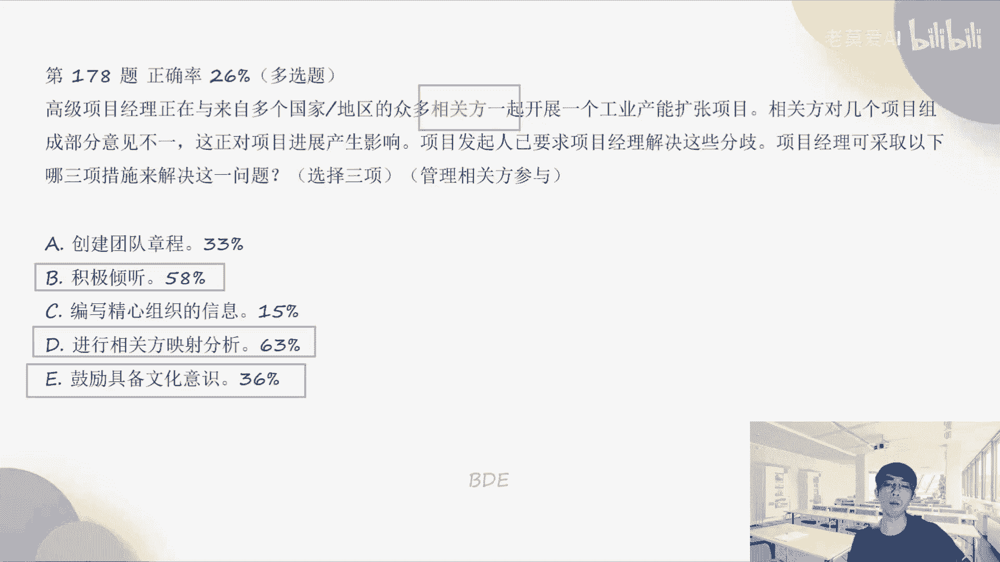

基本上没有说有这个东西，在项目管理里面没有说到这个东西，第170，第179题，正确率是23%，项目经理被指派负责的一个项目，正处于开发阶段，审查项目进展时，项目经理发现几项任务落后于进度计划，经过调查。

项目经理发现几名成员被抽调开展其他任务，使他们无法投入项目经理的项目，项目经理可以采取哪两种措施，这个一看抽调过去肯定是资源被抽走了嘛，所以资源管理了进度又落后了，对不对，所以这个里面它比较特殊。

因为它是多选题，所以它既报道了进度管理，又靠的资源管理，那么在进度管理上面我们能做什么东西呢，与团队一起确定可以交付项目的方案，在资源管理方面，我们可以与各个职能部门领导去商量这个事情。

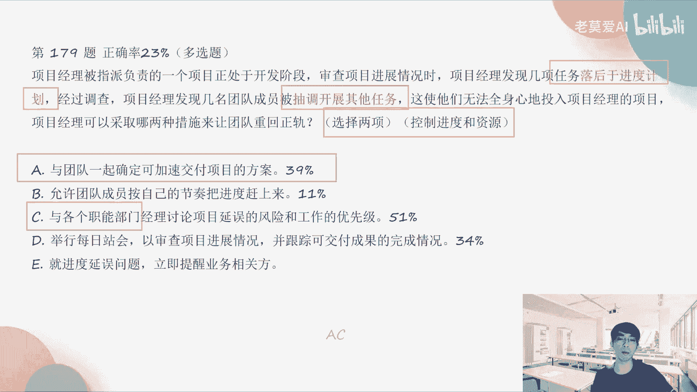

所以正确答案是ACIC好，第176题，由于方时间方面的制约因素，项目发起人通常会让项目经理，免去项目回顾会议，但项目经理会通过减少准备和讨论的时间，坚持保留这一重要会议，项目经理的这些措施。

可能会导致两个问题是什么，选择两项，那么这两项它代表了什么东西，其实是什么，我们考的是回顾会议，因为你看都是在回顾会议上去纠结，对不对，那么回顾会议，如果回顾会不做这些事情。

或者是说我们要减少准备的讨论时间，那么会出现什么问题，第一个会影响团队缺乏方向性和积极性，为什么大家没有准备就进来了，对不对，然后说今天我们讨论一个问题，今天开个回顾会议，那么回顾会议就会变成变成什么。

很没有效率，就是大家各自发散啊，最近好像我遇到这个事情啊，你应该是怎么样，我们在项目管理的过程当中，在SM进行项目管理的过程当中，我们就应该把项目当中的很多发生的这些经过，我们要记下来。

特别是发生问题的这个经过详细的记录下来，那么在回顾会议的时候，我们要拿出这些分析方，就是这些经过过程进行分析，所以需要我们由提前有一些准备，那这样的话我们的整个方向性，我们也能得到很大的这个提升对吧。

那么还有一个就是进行的讨论，要么无知无果而终，要么可能会形成太多结果，那什么就是说如果你准备，你把这个讨论的时间缩短了对吧，很多学生时会说啊，20分钟已经到了是吧，那我们就先结束这场会议了。

那很多事情我们就没有刨根问底得出一个结论。

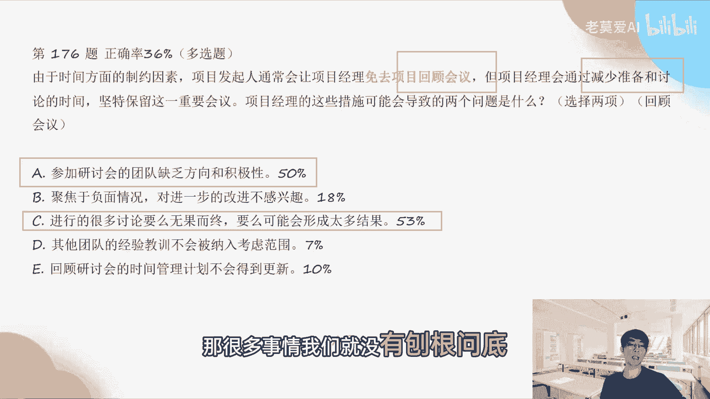

我们就草草结束了，这个肯定是不对的，好，第14题说，在某运营职能部门的一个项目执行期间，项目经理遇到范围变更和关键任务，交付延迟的问题，项目经理该如何应对这些问题，你看范围变更，这一看就是变更管理嘛。

对不对，关键任务交付延迟，这个对不对，这个是影响了基准了，就是进度基准对不对，那么一定要走什么变更流程了，那么即走变更流程就要什么，提出变更请求，已修改范围并调整时间表，对不对。

那么这个很多同学选这个选D进行影响分析，并将成果指导给给指导委员会，以待其审批好，那这个有两个问题，一些影响分析，你看以我们已经遇到范围变更和关键业务，交付延迟的问题，说明我们其实已经进进行过分析了。

我就是因为进行过分析，我才知道他是一个具体的范围变更，和这个关键业务交付延误的问题对吧，这个是第一的第一个错误，第二个错误并将成果提交给指导委员会，这个提交错了啊，变更的情况下。

我们要把成果提交给变更委员会ZCB。

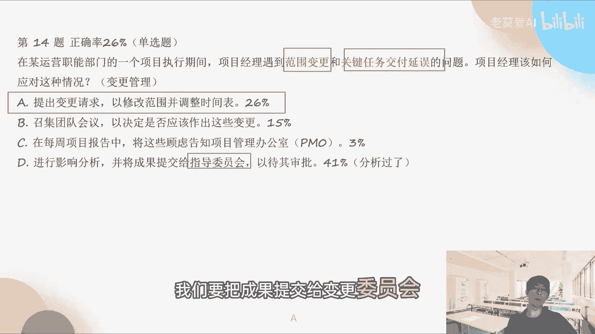

而不是指导委员会好，第18题，某供应商告知项目经理，一位关键资源将长时间休假，项目团队对该供应商持交付的哦，持交付的可交付成，而持待交付的可交付成果进行审查后，发现了一个替代解决方案。

但这会产生额外成本，该项目目前正在按计划进行预算，略微有富余，项目经理接下来该说什么东西，这个是做什么，你看产生额外成本，只要产生额外成本，这个叫什么成本基准的变动，成本基准的变动也会引发变更管理。

所以这个题目考的就是变更管理，所以变更管理什么成本效益分析，这个东西就不用做了，实施整体变更控制才才是王道，OK第24题。

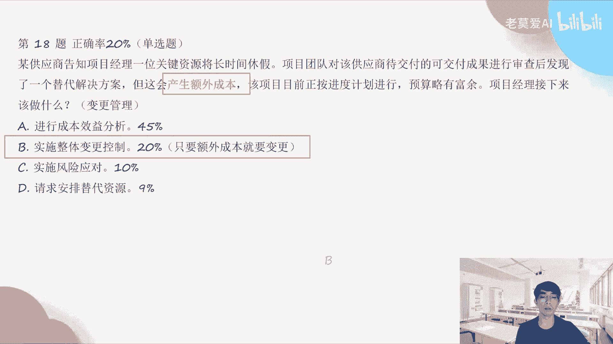

说一个正在进行的项目中，一位关键资源向项目经理询问项目的目的，并询问是否与组织的战略一致，项目经理应该向关键资源分享什么，这个事情考试是考虑的什么，组织的战略好，请问我们组织的战略是什么。

组织的战略无非就是在这个战略方向上，我们怎么样实现我们的商业模式，组织的战略一般是跟效益相关的啊，所以这个题目考的是项目的效益管理计划，所以这个题目大家要关注了，更新的效益管理计划。

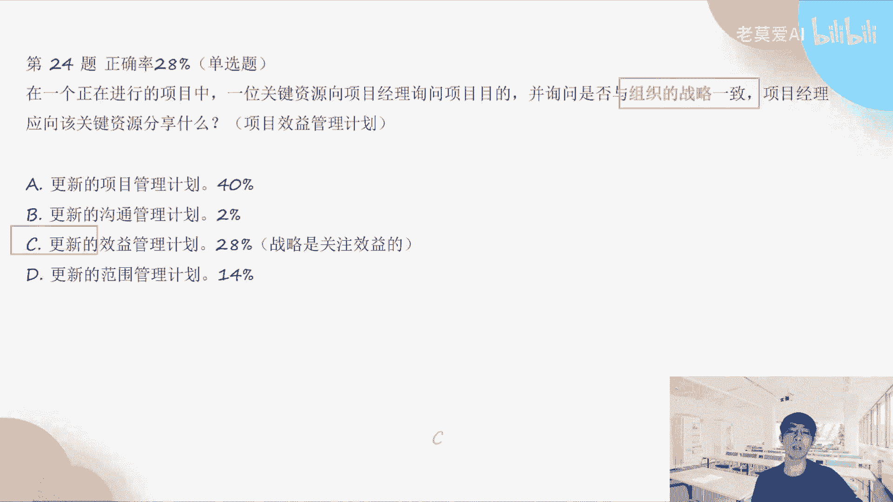

所以战略它其实是关注于效率，一位项目经理正在管理，一个处于启动阶段的网络项目，该项目注意到政府网络安全主任，最近发布的一项数据保护条例，项目经理应该做什么，这个其实是属于什么组织治理与项目经理。

为什么启动阶段我们关注到政府安全主任，就是我们关注到政府外部的一些信息，这个是叫什么事业环境因素，就是他是去影响我们的这个整个组织的，这个在pm不可六版就已经提到过了对吧，那么很多同学会选AA就很错了。

就是错的比较离谱了，为什么它是在什么阶段，你要看关键字启动阶段，启动阶段不用提变更，所以直接A就错了，纳入这一变更，启动阶段都还没有建立基准，基准是什么时候建立的，基准是在计划阶段建立的。

所以在执行阶段我们才需要提变更，对吧，你做完计划，然后执行阶段方案不一样了，所以变一下对不对，所以启动阶段完全不需要提变更，而是说我们只要对项目做出调整，将组织治理与项目治理联系起来就可以了。

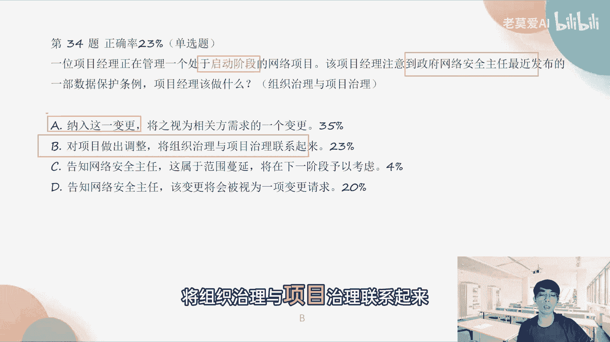

第62题，一个敏捷的团队正在头脑风暴，并根据严重程度对所有的风险进行优先级排序，团队应该如何处理已识别的风险，这个其实考的什么，考的是风险处理的方法，那么风险处理的方法为什么，因为所有都是在说风险风险。

那么风险一旦被识别，我们就要去处理，那么处理的方法有几种，减轻对吧，也是一种对吧，那么处理的方法里面就只有A选项对吧，其他的选项都不对，都不是风险处理的方法，具体方法。

第一所什么确认风险在相应的迭代中处理，说了等于没说一样，对不对，那识别已经风险了，完了以后，我接下来我就要做风险时，风险的这个减轻与规避，可能要做这些事情，所以要么就减轻，要么就是规避风险。

有一个什么东西对吧，转移也是一种，但是这里面它只有一个减轻。

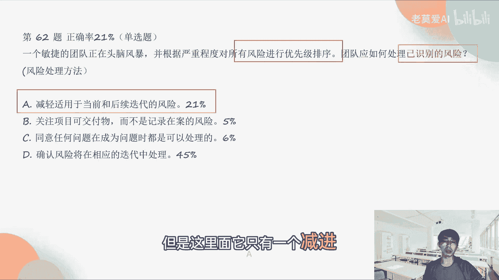

那么就选A好，第27题，哦不对，第128题，在一个新的产品改进项目启动过程中，项目经理发现历史数据表明，一个类似的项目曾招曾导致客户投诉，称之前先前的产品版本改进后的产品，用户体验更差。

项目经理如何才能防止新项目出现这种结果，这考的是什么，先前的产品改进后的体验更差，那么我们要做什么事情，就是客服查与嘛，对不对，所以敏捷宣言里面说了是吧，合同谈判不如这个客户参与对吧。

所以我们应该怎么样把客户拉进来，那么跟客户息息相关的是什么，焦点小组之前也说了，就是敏捷，我们在串讲一的时候，其实讲过用户的焦点小组，焦点小组就是这个小组的人分别代表一类用户，然后来进行讨论，对不对。

所以你能代表用户，那么你做出来的作用户体验就不会很差，其他的都没有把用户拉进来。

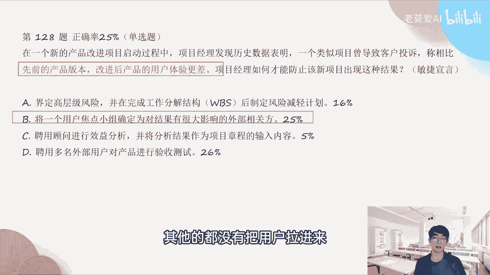

所以在敏捷里面我们需要把用户拉回来好，第140题，某公司的项目管理办公室，PO已经开始实施迭代工具，项目经理开始运作一个新的项目，并并已经发现了一个可以使用迭代工具的机会，其中一位高级项目经理。

对于修改过的框架有所顾虑，因为对他来说是一个非常新的行家，项目经理首先应该做什么，这个里面没有考这个这个干系人管理，为什么他没有阻碍他，只是有一点顾虑而已对吧，为了解决他的这些顾虑。

我们需要怎么样一个新的框架对吧，那对于这个新的框架我们要引入进来，我们需要做什么，做新的框架的能力的补齐，所以就是培训，了解是否有该新的框架的外部培训，如果可以的话，我们可以拉进来。

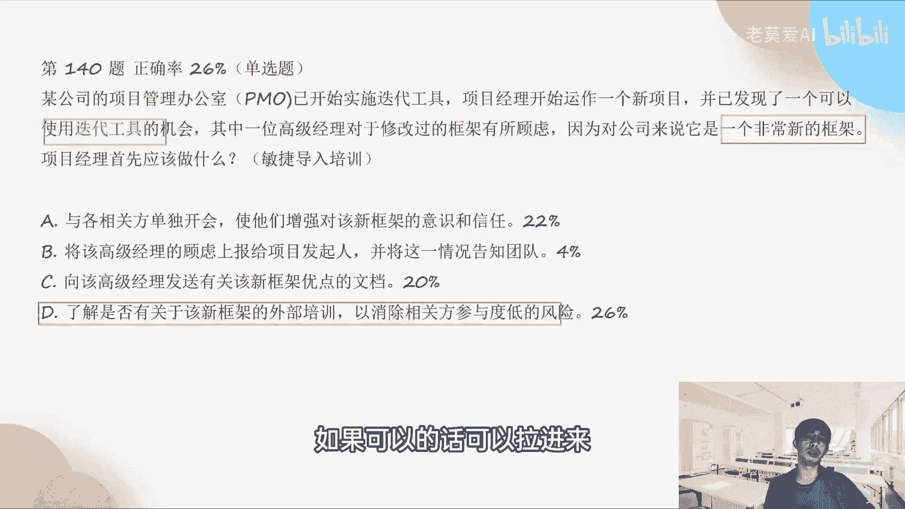

以消除相关方参与度低的风险，好第142题啊，说一个一位关键的项目相关方，即开即将离开组织，他始终非常支持项目团队的工作，也是项目团队的工作动力，项目团队现在士气低落，团队合作意识薄薄弱。

项目经理该做什么来提升士气，那提升士气，这个是考哪一章，考的是资源管理，跟团建士气有关，都是资源管理对吧，那么资源管理我们要做的是什么，他这个人走了对吧，团队士气低落了，合作有意识淡薄。

所以我们重新要把团队的期望和渴望，要确定出来，首先我们要确定这个东西，才能够做有针对性的团建，什么设计目标，你的目标团队的目标是啥呢对吧，如果你知道团队的目标，那么你可以说设定目标对推推荐团队时间目标。

所以首先我们要做这个啊，确定团队的渴望与希望，去确定团队的目标，然后我们再达成对吧，在达成的过程当中，我们可以做一些团队参与活动，比如说团建什么东西对吧，所以不要一上来就做团队。

团建这个建立团队的联系和纽带。

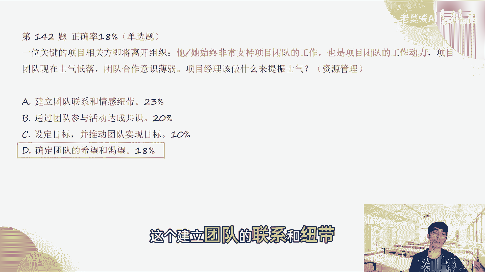

也是做团建，所以正确答案是第一啊，第146题，一份口头声明指出，专家注意到，某些团队成员，不确定团队动力会发生什么样的变化，敏捷专家应该做什么，这个里面考的是什么，不确定团队动力，大家如果不确定的话。

大家一起讨论就好了，这对吧，这个考的是自组织团队，所以正确答案是B，开会讨论团队将不得不做出哪些调整，就是大家要彼此间要开会，自己去讨论，这个是比较OK的，但是很多人说制定沟通管理计划。

在实况里面其实很少做这个沟通管理计划，这个东西，因为这个太费太耗时了。

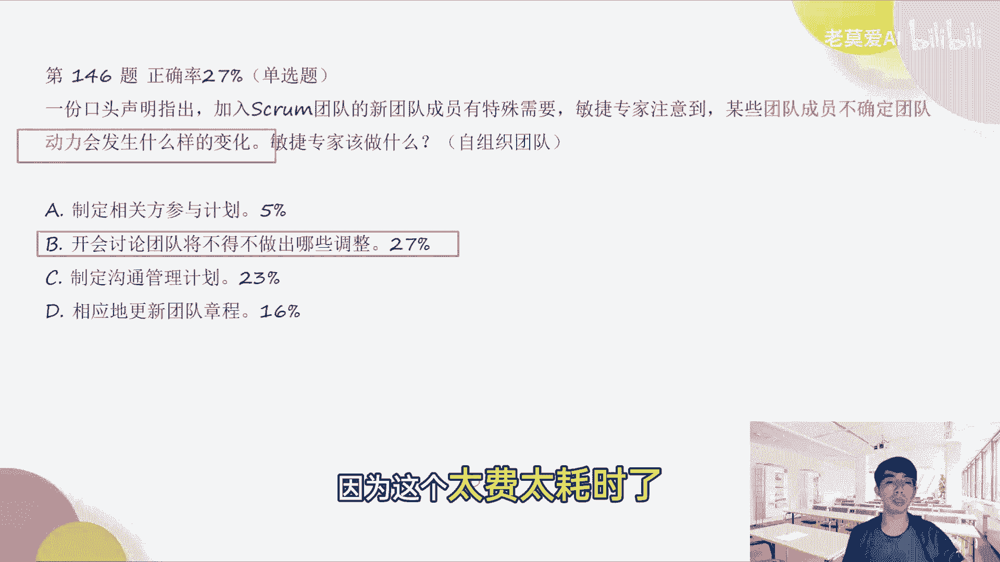

而且太大了，第151题，项目经理是评估敏捷交互方法，使用的组织的一部分，一位项目管理办公室成员PMO的新经理，曾有过使用SCORM方法的糟糕经历，所以他建议用预测的方法取代SQUAM啊。

这个项目经理应该怎么做，其实他考的是什么，就是敏捷转型的过程当中，我们怎么样去排除一些困难，这个正确答案是B审查收益实现情况，包括变更的成本，为什么呢，因为我们也不能光听这个新的经理的对吧。

也不能不听他的，所以你他提出一些这个方法，我们要考虑到我们实施的成本对吧，那如果说敏捷的方法以前他有过这个经历，可能他用的这个敏捷的方法，它的成本比预测型还高对吧，那这个就划不来。

但是我们的项目和之前的项目是一模一样吗，不一定不一定一模一样，所以说你说啊他这个叫一朝被蛇咬，10年怕井绳，对不对，这个合不合理，其实不合理，所以我们其实要还是要去评估一下。

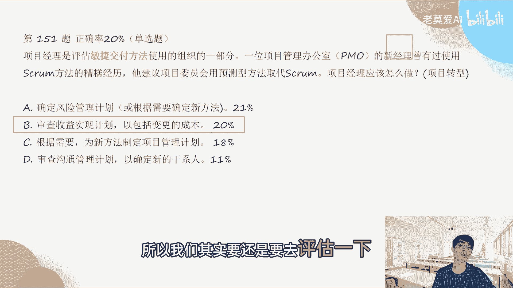

正确答案是B好，第163题，一位新的项目经理了解到分配给团队的工作，已经分解到最底层级，该项目经理审查了工作，感觉缺少某些额外的有用信息，项目经理应该审查哪一项额外的有限信息，然后又说什么。

分工作已经分解到最底层，我们在学pmbok new的时候，工界工作分解到最底层是什么，WBSWBS额外的信息放在哪里啊，它既然考到WBS额外的信息，就是卡WPS字典或者叫WBS词典，所以正确答案是C。

OK在敏捷团队中，是不是很大一部分分权都会放给团队，基本上是哪些权利会给团队去做p mo，是不是就做做变更登记之类的活儿，PMO在敏捷团队当中，PMO其实和传统的PO一样，他都是支持团队的。

他过过多的他注重的是流程PMO不是SM啊，就是这个事，这个事情我们要搞清楚团队，PMO的团队一般要做的事情是什么，就是比如说流程啊，模板是吧，你的团队要优化呀，或者某一个团队需要去重点去管理啊。

或者某些团队他要引入一些培训，比如说敏捷方面的一些培训，那么这些事情都是由PO来去去处理的对吧，那么具体的事物，比如说团队自己有SM对吧，那么你的SM就去就去跟进你的项目就好了，那SM如果有问题。

比如说SM的这个项目管理对吧，他有事情要请教PO，这个是PM必须要提出提供支持的。

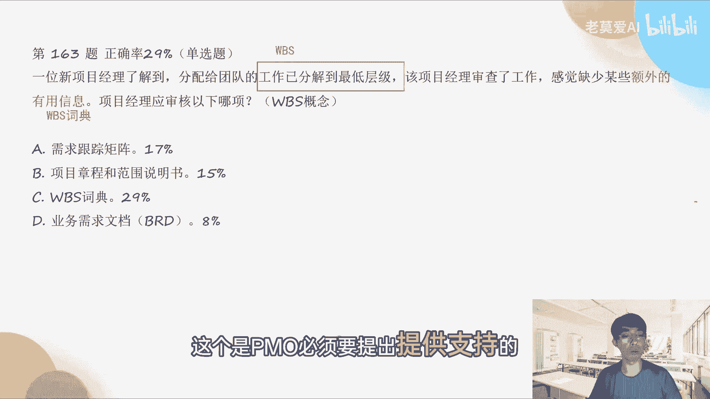

OK的正确答案是C，一个敏捷的项目经理，把需求文件转化成实施能力特性和故事，项目经理应该做在多少个迭代中，估算故事的持续时间，那么我们前面说了，就是我们开始做项目管理的时候，我们第一轮做敏捷的时候。

我们第一轮其实要做什么，我们其实第一轮要做这个分解，就是梳理这个blog对吧，叫做梳理这个product backlog，处理产品代办事项，梳理产品代办事项是我们第一个版本，前面就要去做的。

我们只有把这些史诗级，这些能这些故事我们分解出来，我们才知道我们下一个迭代做什么，所以在敏捷里面它有个概念叫做第零个迭代，第零个迭代其实就做这个事情，其实它不迭代，它就是把所有的这个需求分在一起。

然后把大的需求拆成小的，拆成一个一个用户故事，然后去讨论哪些用户故事先做，哪些用户说故事后做才能启动第一个迭代，第一个迭代就是这些东西，我们先做做十个需求再说，这个是第第一个迭代，所以这个是第零个迭代。

那么第零个迭代用一个迭代的时间去做，一般是这样的，有个同学说三个小时做得完吗，三个小时其实我们给大家的时间是三个半小时，因为因为考试的话大概是三小时50分，三小时50分，基本上我们会给我们在这个。

我们因为现在模拟考试，他不用填答题卡嘛，不用填答题卡的话，我们一般会留半个小时时间出来，就是三小时20分，然后半个小时就是考试时间会限定一下，让大家能够在这个三小时20分做完，那这样的话。

大家有半个小时时间填答题卡是足够的，所以要形成这样一集一种做题的，这样的叫做速度，你要把自己的速度练练出来，那么速度怎么练出来，还是一句话就是捕捉关键字，看他考的是哪一章。

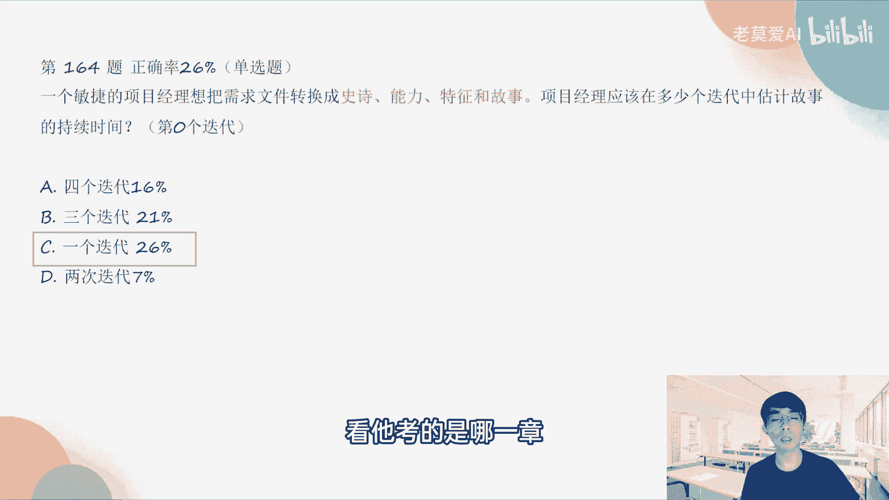

然后再得出这样的答案，OK那今天的这个直播就已经OK了，完了那我们下一下一个，下一周我们会再做一套试卷，然后再给大家一起去解答它的重难点，能带手表，电子表这种不能带，不能带你的电子表是不能戴传统手表。

也不能带，有些考场他会一刀切，就所有的手表都不能带，因为我现在已经很难分清哪些是电子表，哪些是这个这个传统的手表了，一般是直接不让带，因为每一个考场他的那个教室前都会挂一个钟，都会挂一个时钟。

然后在考试那个考试的开始的时候，老师会说多少个小时答完，然后会跟你说，还会说一件比较重要的话，就是在考试结束前半个小时，我们会提醒大家赶快把这个答题卡塔瓦答完，这个是监考老师必须要说的一句话。

所以大家可以放心，就会半个小时之后，就是考交卷前半个小时，老师一定会提醒说你考试结束还有半个小时，然后大家你在做题的时候，你时不时的可以去看一下，那个那个考试上面的那个时钟，这个是有的。

OK考试时间是九点到12。50分，所以大家其实要把握好这个时间，时间其实还是蛮长的，但是考的内容会比较多，所以大家要把速度练起来，OK那今天我们就先到这里，大家有什么问题。

我们可以在群里面去进行继续的交流好，OK也祝大家每一次都顺利通过。

