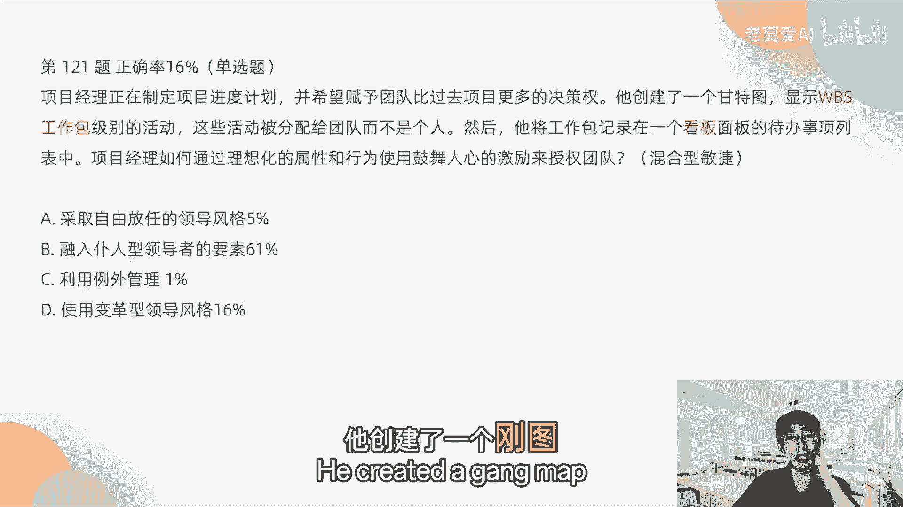
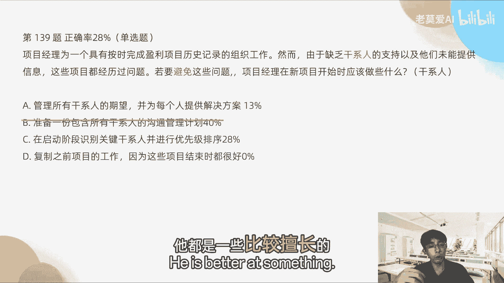
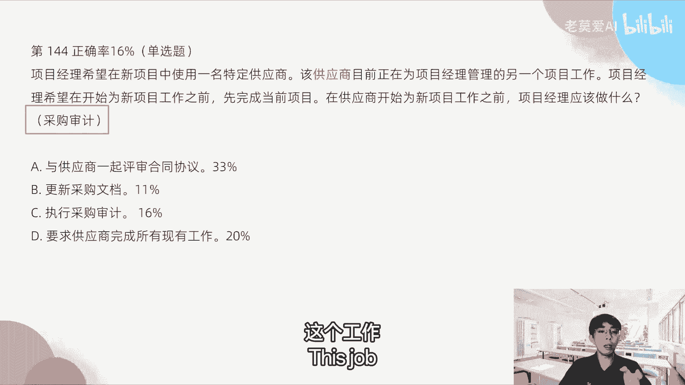
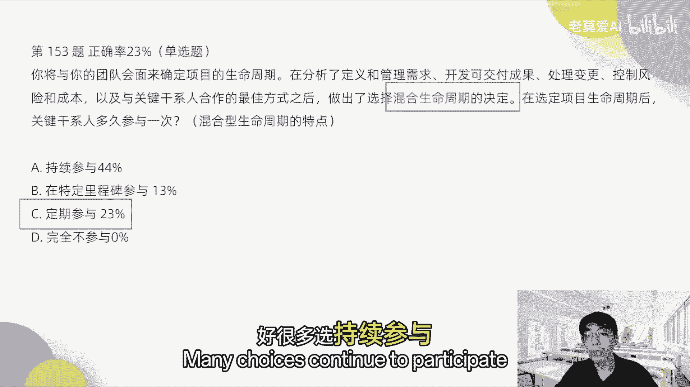
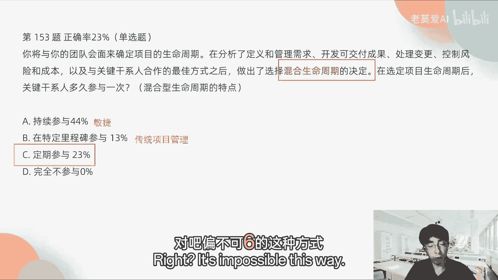
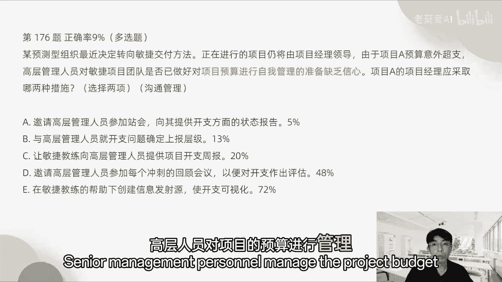
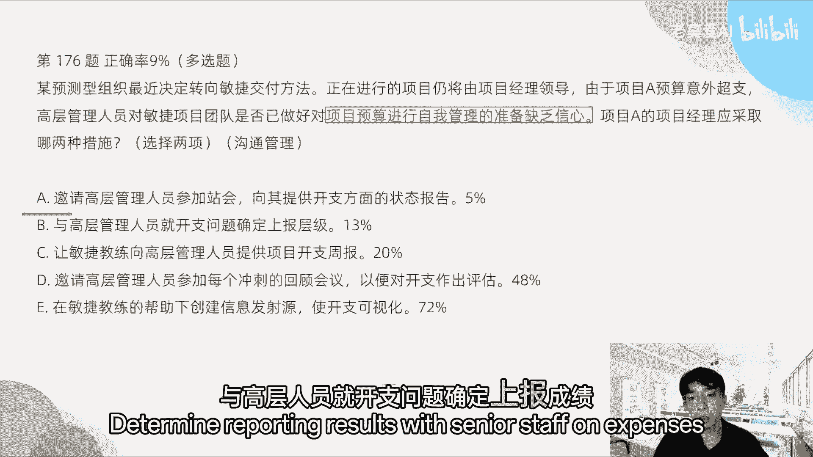
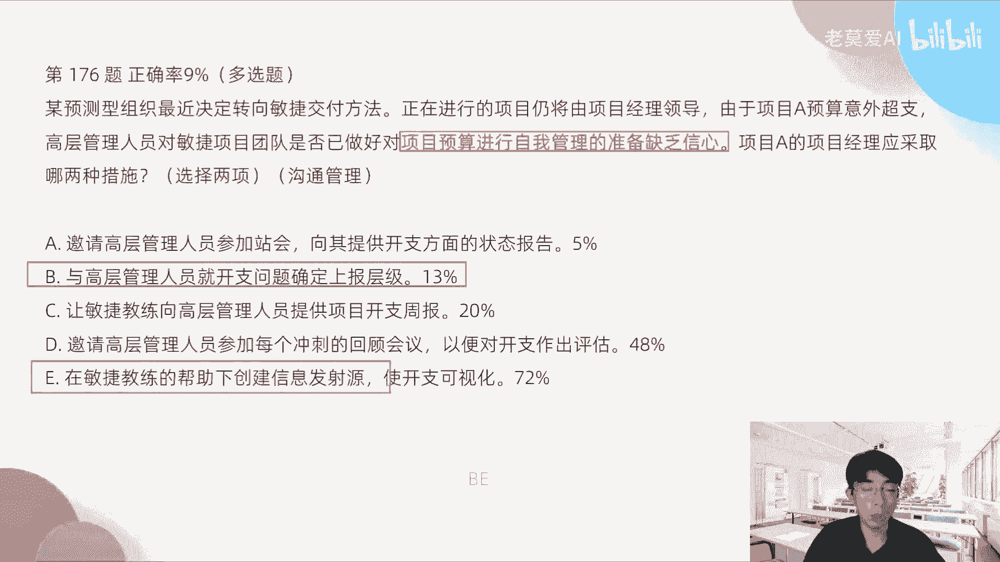
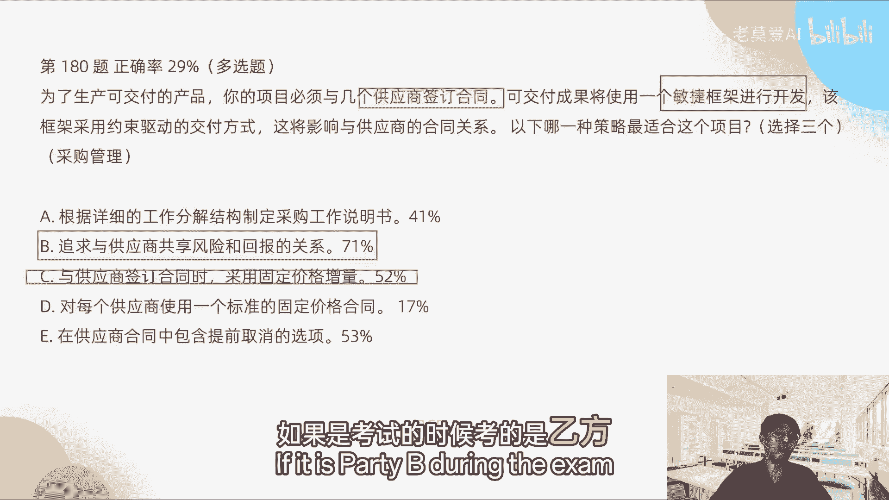

# 【最好的PMP课程】PMP高频错题讲解2-1 - P1 - 老莫爱AI - BV1zjsjeYEjg

现在是北京时间八点，我们正式开始了，这是我的介绍，今天第二个模拟题的解析还是一样的方法。

看到什么就想到了什么啊。

就是它主要你要把你的问题定义在哪一章。

哪一章节，这才是最重要的，好我们先开始吧，第102题，他说产品已经试验性地推出市场，但客户报告存在一些问题。

用于纠正这些问题的成本应该归于哪一类成本。

那么对于这一类题目，我们怎么分析呢，好我们首先看一下关键字啊。

第一个是客户报告，第二第二个是成本是吧，那么一想到客户报到存在一些问题，我们就想到质量对不对，质量出现问题，质量成本归属哪一边的成本。

我们自然而然的就会想到什么成本。

质量成本是反复去考的一个问题，这个这一知识点大家一定要记住了。

好，如果考到质量成本，我们想质量成本分为什么，分为一致性成本和非一致性成本，一致性成本有内部一致性和外部一致性。

非一致性成本，非一致性成本就是分为内部和外部，当然一致性成本都没有分。

但是刚刚说错了，所以这个里面客户报告存在一些问题。

那请问是外部的还是内部的，已经到客户了，那么肯定是外部的，所以质量成本它是属于外部的损失成本，这个是属于非一致性成本。

就是跟我们预期不一样的成本，一致性成本再重申一遍。

一致性成本是包括哪些东西，一致性成本包括了什么，我们比如说我们要去做测试。

做测试要钱吗，各种测试叫做一致性成本，各种检查审计这个东西是我们预期当中，我们要去做的，是跟我们预期保持一致的。

所以叫一致性成本，所以这一题的正确答案是D。

OK好，接下来121题，项目经理正在制定项目进度计划。

并希望赋予团队比过去项目更多的决策权，他创建了一个甘特图，显示WBSWBS工作包级别的活动。

这些活动被分配给团队，而不是个人，然后他将工作包记录在一个看板面板的，待办事项列表当中，项目经理如何通过理想化的属性和行为。

使用鼓舞人心的激励来授权团队，好，这个题目我看他们是考什么东西。

那么在这个关键字里面，我们首先要捕捉一下关键字啊，他创建了一个钢图。

显示了WBS工作包，如果题目当中出现了WBS，那么你可以定义为他是一个传统型的项目管理，他将工作包记录仪，在记录在一个看板面板的代码事件，那么如果出现看板的字样，我们知道就是敏捷。

那么在一个题目当中既出现看板。

又出现了WBS，那说明他是一个什么团队。

说明是一个使用混合型敏捷的团队，所以这道题考的是混合型敏捷，那么混合型敏捷它采用什么样的引导型风格。

这里请注意，混合性敏捷一般都是过渡阶段，所以自从传统项目管理转向敏捷。

项目管理的一个过渡阶段。

所以他使用的大部分是变革型领导风格，所以正确答案是D，那为什么不是B呢，如果他是只考敏捷型对吧，那么就是无人市领导135题。

在你的项目中镀金一直是反复出现的问题，因为团队一直在添加。

他们认为对客户有用的功能，尽管这些功能并没有包含在WBS中，变更请求是在事后提交的，并且一些功能最终被添加到项目范围。

你担心与计划的变偏差，你会怎么做。

才能更好地控制范围，防止进一步镀金好。

那这个题目出现了一个关键字叫镀金，我们想到是考什么，项目的范围管理，第四章项目范围管理里面的它是属于项目蔓延，我们知道镀金的事情，莫老师一直跟大家说，镀金的事情不要去做好。

那么这些镀金我们怎么去控制好镀金。

在敏捷当中他是怎么样，他是用账会来进行协调，因为镀金要及时发现，那而账汇他又是怎么及时去暴露问题的。

所以站会是最合适的。

所以正确答案是D好，正确答案是这个，那有些同学说为什么不是B提交变更请求。

他已经说了，变更请求是事后再提交的，那么如果总是事后提交，那么在这里提交变更请求也不对。

而且获取问题日志中的镀金问题。

他是说怎么样更好的控制范围，防止进一步镀金，你这个都是什么事后的一些策略。

对不对，所以正确答案是D是最好的选项，第138题，敏捷项目的第一次迭代即将开始。

那么发起人召集团队矿主管，产品负责人和其他项目干系人参加启动会议。

发起人强调，需要在尽可能早的时候。

以最小的成本识别和应对项目风险，与会与会者实现发起人要求的最佳方式是什么，那么如果我们看到最小什么东西，我们一定要反应过来，他是一个档位诶。

MVP那么他们考的就是MVP，那么MVP应该是怎么样去实现。

应该它如果是每次最小的成本去发发布的时候，应该让每一次发布的人员干系人，他们经常去参加，就每一次发布小量的增量的迭代的去发布。

干细人应该尽量的去频繁的去参加。

所以正确答案是A，所以答案是AOK而不是风险的刺探，因为这个MVP跟风险的刺探没有关系。

MVP他只是反复的去快速的去验证，所以你要看看清楚它的关键字好，139题，项目经理为一个具有按时完成盈利项目。

历史记录的组织工作，然而由于缺乏干系人的支持。

以及他们未能提供信息，这些项目都经历过问题。

若要避免这些问题，项目经理在新项目开始时应该做些什么东西好，这里面就回到了说如果要避免，那避免一时就是什么时间倒流。

现在已经出现问题，时间倒流，它应该做什么好。

题目当中考的是什么，由于缺乏干系人的什么什么干性能的知识，只要是提到干系人的知识，这些东西他一定是考的是干系人管理，所以考的是最后一章干系人管理的东西。

干细能管理里面跟干细轮相关的是什么，B直接排除很多人选B。

因为干系人的沟通计划这个肯定不对，这不是沟通管理的问题。

这是干系人的管理，你说我们可能未提供信息，这个东西是跟沟通相关吗，其实沟通管理计划它解决不了沟通的问题。

搞管理，我们一般说管理计划，它都是一些比较上层的一些指南的性的东西。

所以这个B就不对，所以正确答案是C。

如果要避免时光倒流的，应该是在启动阶段，我们现在是从项目，从启动计划到执行到监控到收尾是吧。

如果避免这些问题，应该是在最开始的时候，就在启动阶段识别干系人并进行优先级排序。

应该是这个问题好，143题，一位项目经理刚刚为一个387好吧。

38万7000美元的工程项目编制完。

风险应对计划，他下一步可能怎么去做啊，这个里面说考的是什么东西，考的其实是风险管理的流程，风险管理的流程是他做完计划以后，他下一步应对计划。

那么应对计划他一定会怎么样，会影响项目管理计划。

对不对，因为你风险一定要你，比如说我要应对一个风险。

对不对，那应对完风险以后，我可能会增加成本，可能会造成时间的调整是吧。

那这些东西都会导致什么，项目管理计划的一些更新。

所以他考的是这个流程好，那这个里面跟这个流程相关的是什么。

在项目的工作分解结构当中，增加工作包是什么意思，这些应对计划，他的任务一定要落到某个人的身上。

工作包所描述的就是工作任务分解嘛。

就是分解到哪个人身上，要做一些什么事情，所以正确答案是C而不是总体的风险级别。

确定总体的风险级别其实是什么。

其实是在风险应对计划之前，其实就已经做完了，正确答案是C好，144题。

项目经理希望在新项目当中，使用一名特定的供应商。

该供应商，目前正在为项目经理管理的另一个项目工作。

项目经理希望开始为新项目工作之前。

先完成当前的项目，在供应商开始为新项目工作之前。

项目经理应该做什么，这个里面反复出现了供应商。

对不对，好，只要是出现供应商这个关键字，大家一定要往什么地方去想。

采购采购，我们项目管理的一章里面就采购管理。

供应商的采购管理，这个其实考的是什么，采购流程。

采购流程里面有一个采购审计，那么采购审计是审计什么东西，这个工具供应商。

他以前已经在你的项目当中工作，新项目在启动之前。

我们其实在最后的供应商收尾工作里面，我们要去审计和评估他之前做的工作。

所以这个里面应该是执行采购审计，也就是说，我们要需要知道他在前一个项目做得怎么样，有没有一些违规的操作，如果这个供应商非常合格，没有什么违规操作，我们接下来我们要跟他去签另一个新的项目。

需要跟他去持续的去签合同。

而不是说与供应商一起评审合同的协议，还没有到这一步，评审合同协议是在C之后。

我们采购审计，觉得他在上一个项目做的没有任何问题之后，我们再同意说跟他一起审购新的合同协议。

签完合同之后，我们就正式开始项目了，是这样的，所以它的顺序不要搞反了。

好153题，你将与你的团队会面，来确定项目的生命周期。

再分析了定义和管理需求，开发和交付成果，处理变更，控制风险和成本，以及与关系干系人，以关键干系人合作的最佳方式。

之后做出了选择混合生命周期的决定。

在选定项目生命周期后，关系人关键该性能多久参与一次。

这个里面考的是什么，混合型生命周期的一些特点，那么混合型生命周期它有什么特点，因为这个关键字它里面是吧。

已经做出了这个决定，混合型生命周期的特点是定期参与。

大家这个强记就行了，好很多。

选持续参与，持续参与，他不是混合型的特点，它是敏捷的特点，混合型是介于敏捷和传统项目管理之间，所以A其实是什么敏捷敏捷的参与方式。

那么B是什么，参与方式。

是传统的项目管理方式是吧，偏不可new的这种方式。

然后C才是混合型的方式，所以正确答案是选C对好，第162题。

项目经理准备收尾一个项目的第四阶段，但是一位干系人拒绝向前推进项目。

除非增加一个范围之外的功能，项目经理下一步应该怎么做。

他这里虽然出现了一个干系人，但是它不是考的关系人感力。

因为他说了一个除非增加范围之外的功能，范围之外的功能是什么。

是范围管理范围变更。

所以范围变更就跟变更相关了，变更三大基准范围成本和时间。

他变更了范围，所以是变更管理，那么项目经理应该怎么做。

所以就开始提变更请求，所以这个题考的是变更，考试变更。

但是这个会面他是不能直接解决问题的选项，我们是不要去选择什么会面，怎么开会啊，什么东西，这个东西都没有体现你项目管理的技术。

没有体现项目的管理的技术，OK所以正确答案是A好。

第156题，一个沉浸在预测性项目管理方法中的组织。

决定采用混合方法，作为敏捷项目管理的过渡策略，优势混合方法。

所以它是一个过度敏捷转型的东西，已经特许了一个试点的SCP项目。

并分配了SCM角色和职责，那么象棋你希望确保向客户提供最优的价值。

项目经理接下来应该做什么。

这里考的是什么，考的是敏捷转型过渡阶段，已经有storm的角色和职责了是吧，那么在敏捷过渡的项目当中，我们以前聊过啊，最先应该做做什么事情，应该做培训，就是让大家的思想得到统一，做敏捷培训。

所以为产品负责人做SCM培训。

因为他是希望向客户提供最优的价值。

那这个价值是谁来把控，是产品负责人把控。

所以正确答案是C等好，第175题，一位项目经理正在为一家初创公司，领导一个敏捷的项目。

虽然这是该组织的第一个此类项目，但可能会有更多的类似的项目紧随其后。

因此项目经理希望确保在这个项目中。

获得的知识能够用于未来的项目，下列哪一种做法能够更好地支持知识转移。

以造福未来的项目。

选择三个，那么这个里面考的什么项目收尾，项目收尾，我们希望做什么事情。

就是知识转移，那么跟知识转移。

跟知识管理相关的是什么，第一个是记录在整个项目中学到的经验。

教训中获得的知识，这个是第一个好，第二个是什么。

确保经验教训登记册，最后定稿并转移到经验教训存储库当中。

这个都是属于知识转移的东西。

OK第三个是与项目团队和相关干系人，定期召开回顾会议啊。

这个是属于好，第四个，定期审查，作为项目管理组成部分的知识管理计划。

这个不对，没有知识管理计划这个东西。

我们的项目管理仔细划，大家看一下，pm不可六，项目管理师计划里面没有知识管理计划。

确保在配置管理计划中，将所学到的经验记录作为配置元素输出。

配置管理计划，我们在知识管理转移当中。

我们不会牵涉到配置管理计划，这个是大家要去注意的东西啊。

配置管理它是一个跟版本发布相关的东西，跟知识转移没有任何关系。

OK好，第128题，你的敏捷项目需要本地无法找到的专家。

你可以在全球各地找到所需的资源，但是由于各种限制。

不能在项目期间对专家进行配置，你认为推进项目的唯一的方法是。

在虚拟环境下建立团队启动会议，在几周后举行，要让团队参与会议的最佳行动方案是什么。

这个考的是什么，虚拟团队，因为人家已经讲了。

在虚拟环境下建立团队，对不对，关键字我们一捕捉。

我们就知道好多虚拟团队，虚拟团队嘛是讲了很多次，那么虚拟团队我们需要去做什么。

我们最开始的时候，最好是让虚拟团队怎么样亲自参与启动会议。

至少参加一次，他如果是全球各地的项目。

你至少大家要聚一次，如果有这个选项，优先选这个选项，如果没有B。

我们可以A啊选A，所以B是比A更优先的好。

第176题，某预测型组织最近决定转向敏捷交付方法。

正在进行的项目仍将由项目经理领导。

由于项目A预算意外超支，高层管理人员对敏捷项目团队是否已经做好。

对项目预算进行自我管理的准备。

缺乏信心，项目A的项目经理应采取哪两种措施。

选择两项，这个里面其实是考的什么，高层人员对项目的预算进行管理。

缺乏信心，那么缺乏信心，我们自然而然的就会想到什么。

缺乏信心的原因是由于沟通不足。

为什么缺乏信心，是因为你跟他沟通出现了问题。

所以他沟通缺乏信息，所以这个题目他其实考的是什么，考的是沟通管理好，那如果考的沟通管理，我们用什么方法进行沟通管理的这个调优。

我们应该是选B啊，与高层人员就开支问题确定上报成绩。

他如果缺乏信心，你就跟他去商报，第二个是在敏捷教练的帮助下创建信息源，是开支可视化。

你要不断的去创建这个在因为是敏捷项目嘛，你要创建什么信息源。

以便可视化的东西，所以A1B1这两个选项是OK的，那么A明显不对，人员就是散会。

他不是高层人员参与的，所以A是不对的，让敏捷教练向高层人员提供项目开支的周报。

这个如果是传统项目管理，这个是对的，但是在敏捷里面这个不对，这个是针对于传统项目管理，邀请高层人员参加每一个冲刺的回顾会议。

以便对开支作为做出评估。

这个是不合适的，回顾会议是关门会议，这个是回忆的，是回顾的，是所回顾的是过程。

而不是结果，高层人员他没有时间看你的过程。

就项目当中到底发生了什么东西，要去分析，他没有时间去看你的那些东西，所以这个ACD都是不对的，所以正确答案是BE好。

第177题，一个组织建立了一个控制型项目管理办公室。

P m o，PMO的首项任务是更新组织中的项目。

合规性准则，那么PMO可以强制执行，执行下面哪一样，那么这道题反复出现PO，明眼人一看就知道，其实他考的就是PM，那么考的是PO，我们应该怎么样去选PMO。

它是如果是强制型的PO，他应该选择什么东西，第一个是特定项目管理方法的使用。

这个是项目管方法，这是偏某有义务去做的事情。

采用特定的模板，表单和工具，这个是标准打法。

第三个与治理框架保持一致，这三个就行了，那么C遵守当地卫生法规。

这个跟PO没关系，这个是项目管理因素哈。

这个叫做组织过程，资产和管事业环境因素。

这个是叫做事业环境因素了，PMO项目管理办公室指派的项目经理。

不需要强制，这个是不需要强制的，发放储备，管理储备不是PMO发放的。

管理储备，一般是高层高层管理或者发起人他们的操作的。

OK这个我已经说了啊。

一为什么不对，第178题，某项目团队在完成某任务时发生的延误。

而结果证明该任务比预估的更加复杂。

该任务非常重要，可能会对当前的迭代目标造成影响。

以下哪两个方案，将有助于团队最初克服该障碍的努力。

选择两项，OK这个里面他考的是什么。

你看项目又延误是吧，然后对迭代目标造成的影响。

我们在讨论方案，我们讨论方案，在项目过过程当中出现了延误问题，这个方案应该是在哪里去讨论，应该是在回顾会议上，所以这个题目考的其实是什么，回顾会议的克服障碍，所以他要进行什么，克服最初障碍。

我们需要在回顾会议进行根本原因分析，对不对，再创建什么呀，将上报给发起人。

发起人，那么很多人选审查并更新依赖关系。

这里面并没有提到因为依赖关系引起的问题。

所以这个B是不对的，创建风险管理计划，这个里面跟风险没有任何关系。

没有提到关于风险的东西，对不对，担心人这个不对，上报给官发起人，这个不对啊，因为我们是在回顾会议要进行的东西，应该是举行回顾会议一其实是什么，回顾会议如果得到什么样的结论。

你有必要的，你才上报给发起人，所以A一两个答案已经是什么最正确的答案。

也就是说他是最优的答案对吧，那第一肯定也正确。

但是其实它不是最优的，我们只能选择两项啊，如果上面写了三项，我认为D其实是可选的，但如果选择两项，其实是没有不需要选的好。

第180题说，为了生产可交付的产品。

你的项目必须与几个供应商签合同，可交付成果将使用一个敏捷框架进行开发。

该框架采用约束驱动的交互方式。

这将影响与供应商的合作关系，合同关系。

以下哪一种策略最适合这个项目，选择三项，这个里面讲的就是采购管理啊。

为什么要采购管理供应商嘛，对不对。

供应商，所以只要跟供应商相关的，就一定是采购管理。

那么采购管理的敏捷的框架，我们知道敏捷的框架一定是什么比较灵活的。

所以敏捷的框架我们反复再提，第一个是固定价格加上增量。

我们价格我们好商量，我们商量10万块钱，但是你多做多得。

我们就有一个增量，而不是完成完全的固定价格，我们一起要双赢。

所有的考到合同管理，你都一定要双赢，记住了，我反反复复讲过，一定不要说我如果风险大，我只管我的利益，我给你10万块钱。

我就给你10万块钱，风险大，由你承担，这个是不对的，这个一定是考虑风险共担和回报的关系。

这个一定是要考的，不管是传统项目经理管理的合同。

还是敏捷的合同，我们都需要去这样去做，如果我们是甲方。

我们一定要按这个东西去去约束自己，如果是乙方，我们可以，如果是考试的时候考的是乙方。

我们到倒不用这样去考虑，但是如果我们是甲方。

一定要考虑这个风险共担的东西，正确答案是BC，还有一在供应商合同中包含提前取消的选项。

这都是一种灵活的做法，所以这一项策略最合适。

第一是对每一个供应商，使用一个标准的固定价格合同。

这个是对甲方有利，只对甲方有利，这个一般不选在考试当中。

千万不要选这个A是根据详细的工作结构。

分解结构，制定采购说明书，这个也是传统的做法，而不是敏捷的做法。

