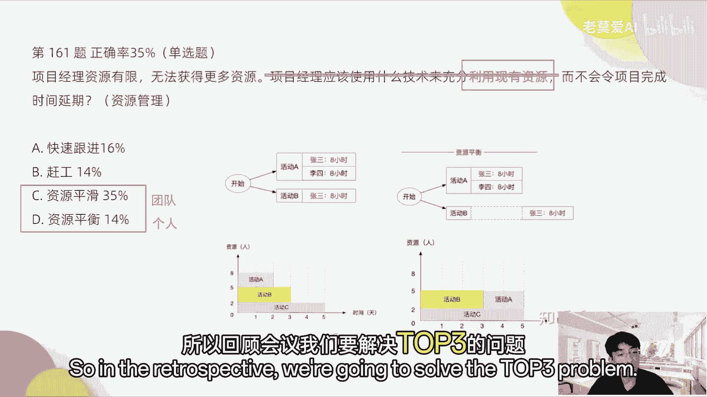

# 【最好的PMP课程】PMP高频错题讲解2-2 - P1 - 老莫爱AI - BV1fjsjeYEU8

CE好，第179题，在桥梁建设项目中，项目经理正在监督和控制项目构建的各种变化，下列哪一项最可能需要经过批准的变更请求，才能进行变更，选择四个，所以这个题目里面反复出现什么变更请求，这一看就是什么。

我们要考的是变管理，那是变更管理里面什么时候需要批准ACB的，批准好，第一个是将预测式开发改为混合式开发，这个时候我们是需要怎么样提变更的，因为你的方式都变了，有可能混合式开发它的成本需要很大的变化。

其次还是需要CCB，但是它成本会发生变化，所以这个里面只要成本会发生变化，那么一定要提什么变更请求，项目的运行超过了预算，需要修改成本极限，需要超过修改成本极限，一定要提变更好，C。

项目发起人想要向配置管理计划添加一个文档，那么添加一个文档，它属于什么范围变化范围的变化，明白吗，我们的工作包我们又多了一个任务，这个是范围的变化，所以这个是C这个是要提变更的第几项。

任务的修订状态需要反映在项目进度中，进度表中，这个不需要修订状态，这只是项目的这个附带产物，比如说你完成了你的任务，你要把你的任务从那个进行中变成已完成，这个要提变更吗，这个是你自己要处理的本来的事情。

这是你日常工作包当中的一部分，所以这个不需要提变更，一名高级主管建议更新项目周期描述，以增加一个阶段，那这样增加一个阶段，这属于什么，属于项目的，怎么样进度管理，增加一个阶段，在这个阶段里面。

我们这个进度计划要发生一些变化，我们要调整进这一个阶段，我们要调整项目进度计划，所以一需要提变更，刚刚确定了一个新的利益者，需要将其添加到利益相关者登记册，同这个东西，项目经理顺手就做了啊。

因为这个事本来是需要项目经理的工作，这个是本来是项目经理的工作，你自己的工作你还要提变更吗，项目经理本身的工作你还要提变更吗，记录风险，记录问题，这些东西都是你们日常要做的事情。

所以这个事情不需要提变更了，所以F也不对，所以正确答案是ABCE好。

第149，第49题，在获取完成项目的活动中，项目团队喜欢互互相互动和交流，项目执行的故事，此时团队处于什么样的阶段，这个考的是什么，塔克曼阶梯，这个是资源管理，资源管理里面我们有几个阶段。

一个是什么创建阶段是吧，第一个是初始的创建阶段，第二个是震荡阶段，创建阶段是团队互相认识嘛，第一次认识正当阶段就是团队开始看，互相在磨合当中是否出现很大问题，那么磨合当中出现了很多问题。

这个是很常见的啊，这个是第二个阶段震荡阶段，第三个是规范阶段，当误会慢慢被消除是吧，慢慢的趋向于正规的时候，它是规范阶段，最后是成熟阶段，所以这个里面喜欢互动和交流项目执行的故事，说明什么。

慢慢的已经趋于规范了啊，表达的一些意思就是，开始团队开始互相产生信任的时候，刚开始产生信任的时候，这是规范阶段，成熟阶段是什么，团队已经能够很好的进行协同了，像一家人一样很有默契了，是乘数间的。

所以塔克曼阶段里面考的最多的是规范阶段，因为规范阶段和成熟阶段同学们很容易搞混，但是他很多时候他考的都是规范阶段，大部分他考的都是规范阶段，不会考成熟阶段，它就是让你分清楚规范阶段和成熟阶段。

但是这个是最难分清的，所以它基本上大家都会错在这里，成熟阶段一般都是像一家人一样，已经慢慢的形成一种默契，相互之间能够更好的协同，就像一个磨合了很多年的团队，所以正确答案是D啊，好第12题。

在新目标国家推出产品，前不久，公司意识到，该产品并不完全符合当地的数据隐私法，由于预算限制，公司管理层要求，项目团队，将可能的罚款成本与返工成本进行比较，项目的一部分包括。

向产品代办事项列表中添加新需求，在这种情况下，下面哪个选项最可能帮到你好，这个里面考的是什么，你看罚款成本与返工成本进行比较，我们把成本进行比较，一般是成本和收益的比对是吧。

成本和收益的比对完了以后决定的，我们是不是往下一步走，这个一般叫做计算关口，就像我们腾讯他们做这个游戏的时候，它会分为pr1pr2pr三，P r4，那么每一个阶段它会有一个关口。

会有一个制作人团队来进行审核，这个游戏他应该要不要往下进行下一步，比如说PR1阶段它可能是一个demo，这个游戏是一个demo，那么这个demo设计的怎么样，他的目标客户是什么，将来是不是能够赚钱。

如果你能够过PR1阶段，那说明这个游戏的demo的设计是没有问题的，再往下走，第二阶段就要看游戏的一些数据，游戏运行的一些数据看有没有问题，如果游戏运行的数据它没有问题。

一些小规模适用的这个数据没有问题，再会走PR3阶段，慢慢的去，每一步都要去卡一下，以这样的方式去做精品游戏，所以阶段关口这个东西，如果你是一个成熟的规范的大公司，他基本上很多时候要走这个阶段关口的。

所以正确答案是C好。

第52题，项目团队由前军事和非军事小组成员组成，没有军事背景的团队，认为前军事团队在他们的项目方法中，过于结构化和僵化，前军事成员认为其他的团队成员更随意的方式。

表明他们对项目不太投入什么样的工具或技术，对于项目经理和团队成员进行有有效沟通，最有用呢，这个里面考的是什么好，这个里面其实考的是什么，资源管理里面的团队建设，那么如果团队建设里面其实提了什么。

前军事和非军事，说明他们的团队的文化组成是不一致的，所以我们应该怎么样做文化上的统一，所以这个题目其实更好的是考什么文化意识，这是更好的选项，冲突管理很多人选冲突管理。

但是这个题目里面并没有怎么样去出现，这个有关于冲突管理的选项，比如说出现一些矛盾，出现冲突，冲突管理它一般不会这样考，冲突管理一般考的是什么，冲突管理的解决方式，应对措施，一般考的是这个，比如说呃。

当冲突管理出现之后，我们要干什么，比如说可能规避强制达成一致这些东西好。

正确答案是D好，第61题，项目经理正在制定一个关键，项目的资源管理计划，那么该项目涉及位于不同国家，具有不同文化的资源，下列哪一项将帮助项目经理处理这种情况好，不同文化，不同国家的资源。

我们就自然而然的考虑到会什么，就是事业环境因素和组织过程资产，为什么呢，因为他在做项目资源管理计划，这个里面其实考的是什么，我们的项目的计划阶段的输入，是事业环境因素与组织过程资产。

这个东西我们要去考虑，我们在做计划的时候，我们要考虑到，有哪些外部因素会影响到我们的计划，所以这个里面就是考这个，那么帮助项目经理处理这种情况的，就是私有环境因素，因为这里面其实没有组织过程资产的东西。

A团队建设活动，这个东西它其实怎么样，这是后期的，我们做完资源管理计划的时候，我们再去考虑这个东西，已经后期了，虚拟团队具有不同国家不容不同文化的资源，我们如果是问，我们应该用什么技术去去应对这种情况。

去组织这种资源的，我们可以用虚拟团队，但是他是说帮助项目经理处理这种情况，他的是输入不是输出，不是这个是我，我备注一下，这个是输入，应对这种情况，他应该是输入帮助你去应对嘛，你肯定要有个东西去帮助。

这个是输出，也就是他的方案方案，这个是属于方案层面的，对不对，用什么样的方案去管理不同的文化资源，所以才是虚拟团队，这输入和输出大家要注意一下，所以正确答案是B好。

第71题，项目经理发现一个不可预料的高影响，风险已经成为项目的一个因素，团队成员之间的自身利益导致问题得不到解决，项目经理必须快速行动，让团队重新集中精力，以便恢复进度。

项目经理应该使用哪一种技术来解决问题好，这里面出现了一个关键字叫风险，又是说问题得不到解决，项目经理快速行动，所以最快的是什么方式，最快的是强迫，强迫的方式，其实是最快的。

你问题如果是说我们如果合作能达成一致，合作其实也快，但是这上面写的得不到解决，就发现这个问题没有办法，所以需要项目经理掌出来去强迫一方，所以是这种零和博弈，去强迫一方去解决这个问题。

所以这个是这答案就是C好，第91题，项目发起人通知项目经理，一项新的政府法律被批准了，该法律将影响项目的进度，计划和预算，这种可能性作为一种主动接受的威胁，包含在风险管理计划当中，项目经理应该做什么。

那么这个法律被批准了，主动的威胁，我们就想这个题目考的是风险，而且是风险的应对措施，主动接受，主动接受，我们一般使用应急储备，只要出现主动接受，就一定是应急储备，好这个大家记住了，只要看到主动接受。

主动接受，就一定选应急储备，这个是定时好，有些同学选这个23选23%的变革，原会每题目没有考到变更，这个里面没有考到变更的，你你要看那个关键字讲的是什么，他如果反复讲风险，他一定就不是变更。

所以每一个这个领域他只会考一个。

第171题，由于不同干系人在项目不同阶段，提出大量重大变更请求，项目发生延误，如果项目按继续按同一路径推进，所需时间和预算将达到原计划的两倍，项目经理可以采取哪两种措施，来提高项目的成本效益。

好选出两项，那么这个题考什么，你看不同干系人在项目过程中，提出重大的变更请求，所以这个地方是什么问题啊，是干系人的问题，对不对，那么干系人的问题我们应该怎么去解决，第一个进行干性能分析。

第二个我们要提高项目的成本收益什么，我们需要采用增量的方法，而且频繁就把干细人拉进来，频繁的使用这种增量的方法去解决问题，所以正确答案是AC，而不是新的时间表更新项目管理计划。

新的时间表更新项目管理计划，也没有办法去解决什么呀，项目发生延误的问题，没有办法去发生解决这个问题。

第36题，受一个PNT建筑公司雇佣一位造价工程师，在为该公司在中国的首个油田的管道建设项目，估算成本，但是没有得到任何的详细工程数据，这位工程师应该采用哪种费用估算方法。

为p and t公司提供初步的成本估算，最初的成本估算就是量级估算，它的量级估算的，它是从百分之负，25%到一直到75%，他会有这样的一个大的一些范围，那为什么选这个呢，很多的同学选近似估算。

但因为他没有其他的项目可以比较近似估算，又叫类比估算，它没有比较，所以没办法去选择个近似估算，它没有任何的工程数据，也没有任何相似的项目，如果他提到了有相似的项目。

那么我可以选A，所以这个题目选B好，166题，在项目开工会期间，一个干系人公开反对，项目在组织内的必要性和优先性，项目经理应该做什么，所以干系人公开反对属于干系人的问题，干系人管理的问题。

那么跟干系人相关的是什么，考虑该干系人立场，并制定该性能参与计划，所以正确答案是选D好，很多同学选C，了解刚干性的立场，并更新风险管理计划，开工会期间开始更新，公开反对，那么这个东西跟风险还没啥关系。

他没有明确指出他是一个风险，所以这个里面没有任何的关键字，指出它是一个风险的时候，我们暂时不考虑风险，所以C我们是不考虑的啊，所以做题的方式是这样的，不要想太多，就是你想太多。

这个东西可能会出现什么问题，但是题干当中并没有指出可能会出现什么问题，所以我们是想的多。

所以九不对，所以正确答案是D好，第164题，在项目实施期间，一些团队成员抱怨，他们说他们对项目的可交付成果不确定。

若要确保项目团队按照项目范围工作。

项目经理应该做什么啊，这个题目考的是什么，考的是范围管理，那么为什么考虑范围管理，他是说按照项目范围工作，对不对，如果他们的可交付成果不确定，我们要确保按照范围工作，就应该进行分解。

所以这个答案是将工作分解发给团队。

就工作分解的工作包一层层的发给团队，这些东西好，那很多同学选A为什么不选A，就是这种RICI矩阵，它是用在大家职责不清晰。

我们要划定职责要清晰的时候去做的，但是这个里面并没有说大家职责，现在分不清的问题，所以为什么不选这个A就是这种哦，公公沟通管理计划，这其实没有说出这个是一个沟通的东西，没有说他们是沟通不畅。

或者是说邮件电话，这个东西都是跟沟通意向相关的，但是没有提到这个东西沟通管理，所以这个题目跟沟通管理没有任何关系，所以我们不选沟通管理，所以正确答案是D讲我考试时目前刷的题，考试会重复率其实不高。

因为如果重复率高了，这属于考试泄题了啊，那这个是一个重大的事故，所以PMI它不会出现这样的事故。

我只能告诉你说，目前刷的题里面很多这个题型基本上都差不多。

但是不会说有一模一样的。

第161题说项目经理资源有限，无法获得更多的资源，项目经理应该使用什么样的技术，充分利有现有资源，而不会令项目完成时间延期，这个里面考的是什么，考的是资源管理，因为它里面其实出现了我们考试的题型。

也反复会出现这种东西，你要去捕捉关键字，利用现有的资源，他一定就是资源管理，它考的就是这些东西，资源管理，所以资源管理的它里面考的是什么，有两个东西，一个是资源平滑和资源平衡，这两个东西有啥区别。

资源平衡是针对个人。

这个资源平衡是针对团队的，那么我们可以看资源平衡的一个案例。

平衡就是个人需要平衡，对不对，张三比如说张三，他一个活动A8个小时，活动B他也花了八个小时，但是他一天当中不能做16小时的事情，所以资源平衡是把它另外八个小时放在后面，一天，这个是资源平衡啊。

那么资源平滑它所做的是什么，我们本来三件事情需要八个人去做，我们发现这个活动A他可以放到后面去做，跟这个活动C开始并行，这个活动A和活动C开始并行的时候，就是放在活动B后面。

这个时候他只需要五个人去做就好了，就做这个事情，所以边缘平滑可以进一步缩减人员，所以它里面充分利用资源这个关键词，其实说的就是资源平滑，所以正确答案是CD好。

32题，作为敏捷转变的一部分，一个组织为一个项目，选择一个试验团队来开发一个软件工具，一位敏捷教练被分配到团队当中，在整个过程过渡过程中。

指导他们在最初的几次接待中敏捷哦，教练与项目团队和领导团队一起。

指导他们进行敏捷实践。

并将任务分配给团队成员，团队教练采用什么样的最佳行动方案。

来确定团队是否获得了在没有教练的情况下，即将执行即将到来的迭代所需要的技能啊，这里面考的是什么，是使团队持续改善的方法。

所以这个正确答案应该是什么，持续改进的方法，还要获得这个方法，应该是迭代回顾，应该举行迭代回顾的会议，所以这个题目其实就是考的迭代回顾的东西，持续改进的方法，所以应急每日账户肯定是不对的。

好今天的持续改进，它里面讲了是没有教练的情况下，执行到来的迭代所需要的技能，这些获得所这个所需要的技能，不是在晨会里面去开，因为晨会只有15分钟，你持续改进它。

它主要是暴露问题和同步进展，做这两个事情，暴露问题和持续进展的时候，就可以做了啊，但是这个没有教练的情况下，紫金刀来的迭代所需要的技能，在15分钟里面是解决不了的。

资源平滑那个题可以选赶工吗，我们来看一下啊，资源平滑这个题目选赶工无法喝多更多的资源。

他是说应该用什么样的技术，来充分利用现有的资源，OK如果他现在提了，需要你利用现有的资源，那肯定是资源平滑，如果没有这句话，假如我这句话都没有，无法获得更多的资源好，他说接下来的项目经理应该怎么办。

如果他是一个多多选题，那么按公这个事情我们可以去选择这个事情，回顾会议会改进事项的排序，对会对改进事项肯定要排序，回顾会议我们也讲了，回顾会议我们一般是解决top3的问题。

因为所有的问题不能一次性。

在回顾会议里面全部解决，所以回顾会议我们要解决top3的问题的。

我们就一定要进行排序，你不能说我回顾会议，我发现了是现在有一百一一百个问题，或者说现在有十个问题，那么下个迭代，我们需要把十代十个问题一起解决，这个不太现实，因为你解决的问题很多，其实你哪样都没有解决。

按照价值来排序，改进事项对，所以top3的问题，也是根据我们大家的共识来去决定的，怎么叫共识，我们之前讲过，回顾会议的时候，我们要去做亲河图，我们要选出共性的问题，比如说我们认为项目的资源反复延期。

是因为项目的资源问题，这个问题被十个人，比如说我们整个团队，我们有十个人，十个人有八个人都提出了这个问题，是因为我们资源不足，那么这个资源不足，他会做一张清河图，那么这个清河图他资源不足的问题。

十个人提了八个人都哦，十个人有八个人提了，那么这个问题肯定会摆在第一位，所以我接下来我们最迫切的问题就是解决，这个它是按照自价值排序的，是按照过程的，不而不是按照什么需求的价值排序。

所以这个价值跟需求价值又不太一样，他是过程当中，我们需要亟待去解决的问题的价值，它的优先级要去这样去排序的去解决。

OK好大家提的问题都很好，说明大家其实在我在回答问，回答这个题目的时候，大家也是在跟上了，很好，大家接，接下来我们可以在群里面多多沟通，今天就先到这里，大家如果有问题，我们在群里面进行沟通就好了。

OK还有其他的问题，大家可以花几分钟时间来提一下，如果没有其他问题，我们今天就到此结束。

嗯感谢大家的到来。