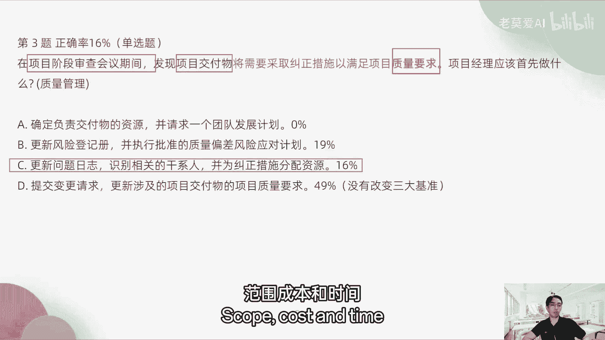
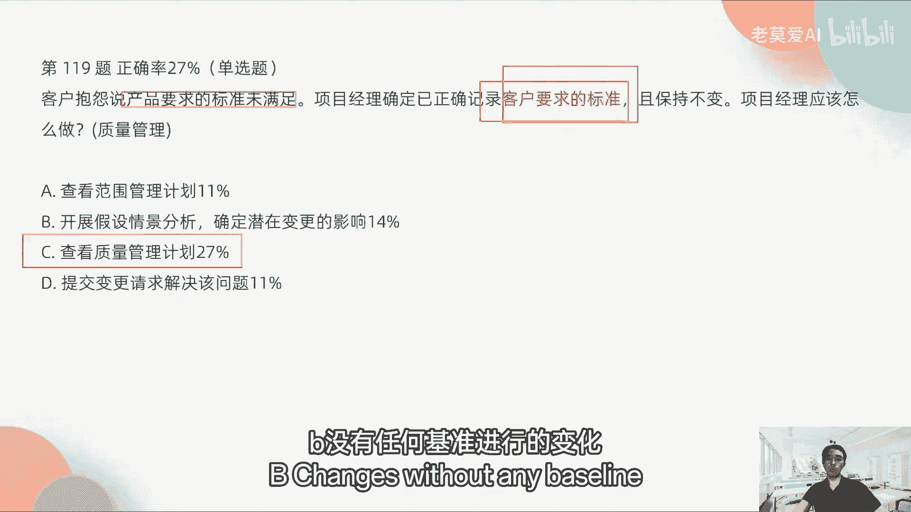
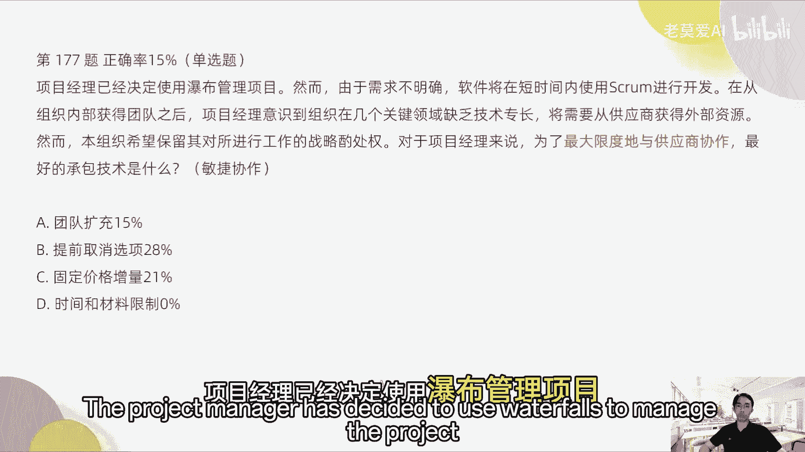
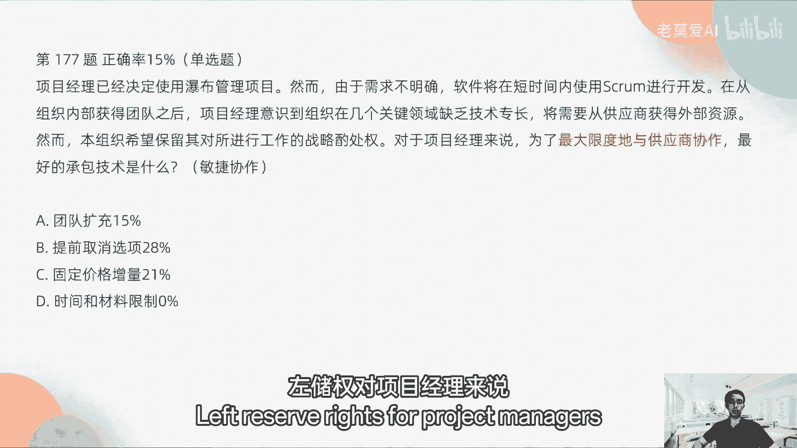
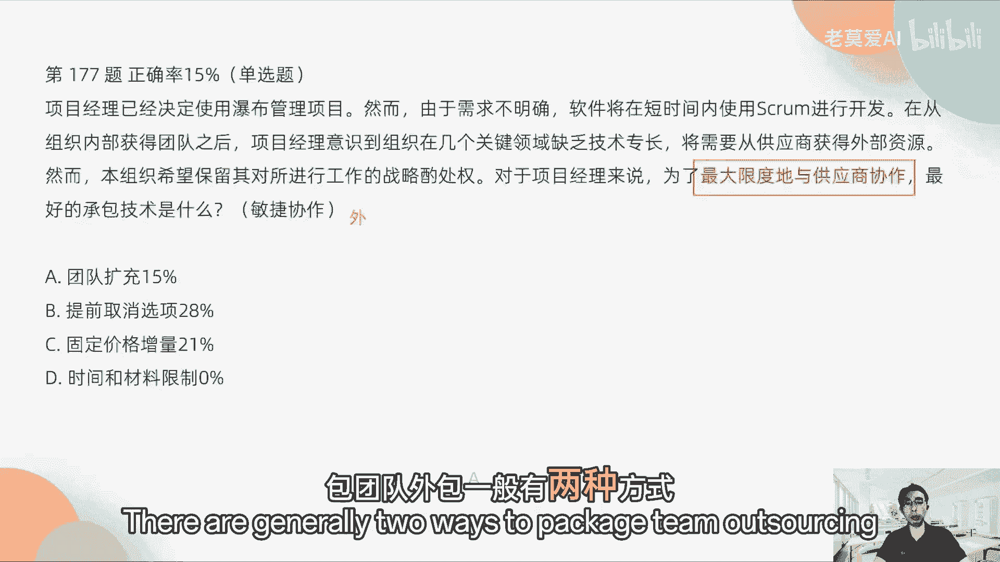
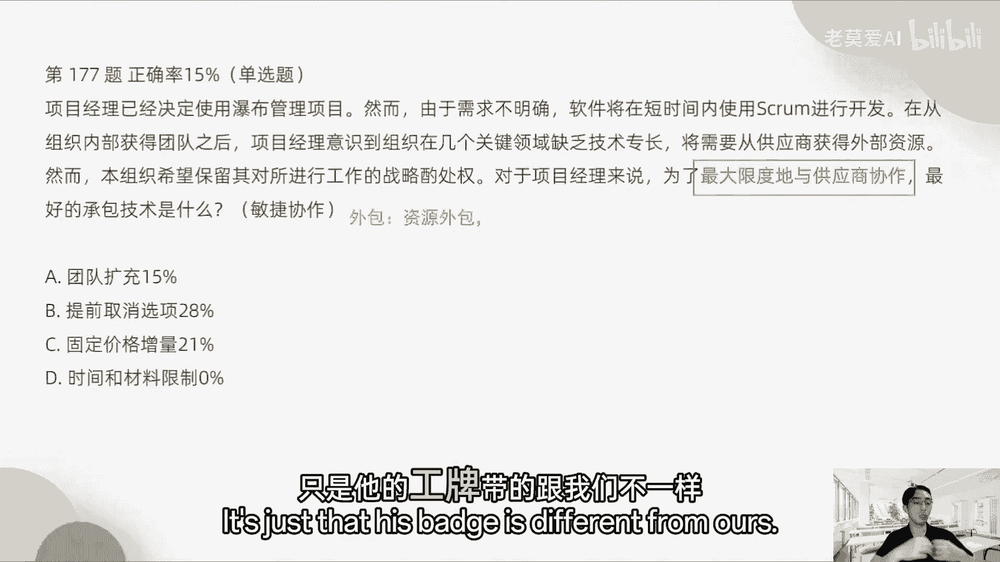
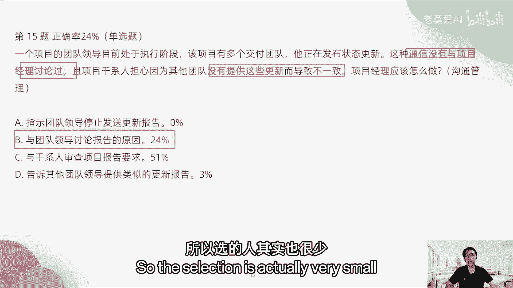
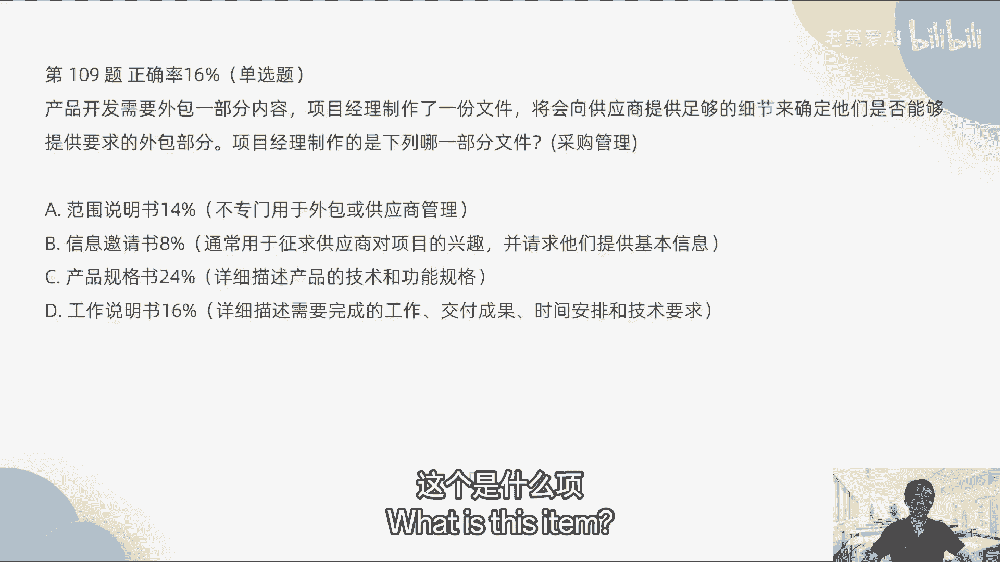
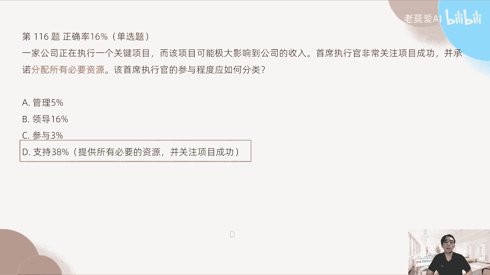

# 【最好的PMP课程】PMP高频错题讲解3-3 - P1 - 老莫爱AI - BV1zjsjeYEcA

选D好多人选D提交变更需求，更新项目的交付物的项目质量要求，项目的质量要求要不要提变更质量要求，我们没有说质量变更要提变更质量，没有三大基准是哪，三大基准范围。

成本和时间并没有提到质量，对不对，并没有说质量也是一个基准。

没有质量基准这一变更的说法，所以变更不涉及到质量基准的变更。

所以D是错的，所以正确答案是C，OKD129题，客户抱怨说产品要求的标准未满足，项目经理确定已正确计入客户要求的标准，且保持不变，项目经理应该怎么做，如果我们听说了标准客户要求的标准。

这个一定就是管理质量管理客户要求标准，比如说需要成本高多少，我需要一个多多多大的一个东西，需求里面别涉及到标准，就一定是质量。

对不对，OK那质量里面A直接排除是吧，范围管理计划跟质量有毛线关系。

没有假设情景分析跟质量有啥关系，没有查看质量管理计划标准在哪里，就在质量管理计划里面，因为它是一个什么呀。

高层级的一个东西，它是一个概述的东西，所以在质量管理计划里面，质量管理与计划里面有标准。

大家记住提交变更以请解决解决高问题。

为什么要提变更，为什么要提变更，不需要提变更，为什么有影响到三大标准吗，有有说吗，他是说要求并未满足。

你已经确定你记录了这个要求的标准了。

所以我们要去确认，需要去从管理计划里面去看，并没有任何基准进行的变化。

对不对，所以不需要提变更，所以这主要是C124题，在与项目团队成员的非正式谈话中，项目经理发现某一个关键部分的供应商，在执行一个已获批准的产品变更时有问题，那么项目经理应该接下来进行哪一项管理。

供应商对吧，然后执行一个批准的产品变更有问题。

所以涉及到的供应商，我们一般都是什么采购管理，那采购管理这里面我们应该选哪个，应该是C审查供应商的工作绩效，工作绩效就代表了什么工作的结果，我们发现他的这什么过程有问题，那过程有问题。

我们为什么要看结果呢，因为我们对供应商的过程不需要考核。

大家记住了，我们采购，比如说我们采购，我们还是拿苹果举例啊，我们去买苹果的这个屏幕。

我们去采购苹果的屏幕，比如说我不是一个苹果公司，我去采购第三方的屏幕的时候。

我会不会去看第三方的屏幕，的制作过程有多复杂，我需不需要事无巨细地考察它的制作过程，不需要，就像我们公司要采购一台电脑，我们需不需要去联想总部。

去看他制作电脑的过程，它的质量过不过硬，他是怎么做电脑的。

需不需要不需要我们在一次非正式谈话当中，我们发现它的过程有问题，这个时候我们应该怎么办，我们不是说唉，那我们发现联想，我们采购联想的时候，我发现联想的过程有问题，好。

我去你们公司看一看你们制作过程是怎么样的，不是这样的吧，你一定说哎，我发现你们的过程，可能我们谈话的时候，我发现联想公司的制作的这个电脑，举个例子，不是联想，是叉叉公司，它的质量过程有问题好。

那制作电脑的过程有问题，我们首先要看什么东西，我们首先要看这个东西拿出来这个电脑，它的结果怎么样，对不对，大家使用的过程，使用的时候怎么样是吧，它呈现出来的这个屏幕是怎么样的，对不对，符不符合我们标准。

所以我们能看到是结果，那么结果是什么，跟工作绩效相关，这个是结果，所以正确答案是C而不是A，不是说什么质量进行一次质量审计啊，对不对，也不是一次变更控制会议一样。

你变更那啥，你是一次非正式谈话当中发现人家的一些问题。

那么这个问题有没有得到确认，没有，这个是闲言碎语，这个并没有去影响你的最终的这个东西。

OK你也不需要马上与高级经理进行谈话，这个也许它是一个捕风捉影的东西。

对不对，第177题，项目经理已经决定使用瀑布管理项目。

然而由于项目不明确，需求不明确，软件将在短时间内使用SQUM进行开发，再从内部取得团队之后。

项目经理意识到，组织在几个关键领域缺乏技术专长。

将需要从供应商获得外部资源，然而本组织希望保留对其工作的战略。

所作所属权，对项目经理来说。

为了最大限度地与供应商协作，最好的承包技术什么，其实考的是什么，敏捷的协作最好的是什么。

我们考的是什么，客户参与赠与合同谈判，那么客户参与进来，也就是说我们外包的同学，大家记住了，我们外包其实有两种方式啊。

这个可能大家一般的如果没有外包，一般不了解。

但是我看平安的同学有很多外包团队啊，包团队外包一般有两种方式。

一种是什么资源外包，资源外包是什么意思，资源外包是外包的同学跟我们在一起办公，他跟我们的工作内容差不多，工作性质也差不多，他每天跟我们在一起，只是他的工牌带的跟我们不一样。

他不是直接跟我们公司签合同的。

他是跟另外一家公司签合同，这个是属于资源外包，那发工资的是另外一家外包公司给他们发工资，不是我们公司给他发工资。

这个叫资源外包，就我们统一战线。

我们每天在一起干活，享受的待遇是不一样的，这个是属于资源外包，还有一种外包是属于项目外包。

项目外包是什么意思，比如说供应商就是项目外包，我们把一个部分的工作包出去。

但是他没有跟我们在一起办公，他们只是在承担他们那一块的工作。

他们做完之后把结果给到我们啊，一般是这种叫项目外包，那很多时候项目外包是什么样的，比如说我们在做手机的时候，那么我们不自己生产屏幕，我们就把屏幕这个东西外包出去。

由别人来做屏幕，这个叫项目外包，要那很多新能源公司也是一样的。

他们公司本身不做电池，那电池他们是找的外包团队。

为他们量量身定做电池，比如说他们的底盘都已经固定好了。

我的底盘我需要一个这个形状的电池，你能不能满足我们这个公司进行招标，我们包给比如说宁德时代，宁德时代我们使用宁德时代的电池。

我们把电池全部包给他们，他们计算诶多少钱，那我们就采购他们的这个东西，这个叫项目外包，所以外包有两种，如果是说你希望保持对进行工作的战略所属权，意思就是什么，这个事情我希望参与进来，那我们再来一种方式。

我们刚才说的项目外包，那我们把这个电池包给宁德电时代。

并没有参与我们整个制作过程，整个新能源车的制作过程。

对不对，我们只是向他提供了一个我们的形状，你需要给到一个什么样的形状的电池包。

你给一个方案给到我们，我们有没有这个工作的战略着主权。

没有，因为电池的技术太在他们那边。

我们根本不知道电池的技术是怎么样的，所以项目外包有这样的一个坏处，就是战略所属权不在我们这边，那么怎么样需要战略总属权在我们这边，如果假设我们和宁德。

宁德这个时代一起去做一个项目。

这个项目是我们合伙去做一个新能源车，我们两个公司投入一些钱，做一个新的公司，做一个品牌，那大家一起投入，那这个团队就相当于资源外包，大家全部坐在一起，你和我不分彼此坐在一起，这个叫团队扩充。

团队扩充就这样来的，所以正确答案应该是怎么样，团队扩充，你从供应商获得外部资源，你这边也能够参与进去，它对你来说不是一个黑盒，我们前面说了，宁德时代，你只把电池包过去，包给他。

电池这一块的技术对于你来说是一个黑盒，如果你不需要。

你不想作为黑盒，你想做一个白盒，你也想知道了解电池这一块的东西。

这个叫团队扩充了，就大家一起去办公。

你才能了解他的细节，对不对，所以这个是资源外包和项目外包最大的区别。

所以这个叫做团队扩充，正确答案是这个A好。

第15题，一个项目团队的领导目前处于执行阶段。

该项目有多个交付团队，他们正在发布状态更新，这种通信没有与项目经理讨论过。

且项目干系人担心，因为其他团队没有提供这一更新而导致不一致。

项目经理应该做做怎么做，这个题目是典型的什么沟通管理，你看第一种信息没有讨论。

第二种信息没有更新，这个一看就沟通管理，这个是与干系人管理不一样的东西，有关于信息有没有传递好，有没有及时更新。

这些东西都是什么沟通管理的事情，那么跟沟通管理相关的应该是什么。

如果这个东西没有讨论过更新不一致，所以我们要讨论报告的原因与团队领导。

因为一个项目团队的领导目前处于执行阶段，他有多个团队，所以我们应该讨论报告，应该跟这个领导去讨论，很多人说与干系人审查项目报告的要求，审查这个项目报告的要求，这个不属于说我们沟通管理的事情。

审查报告是审查过程，一般是在质量管理里面，但是这个题目考的不是质量管理，所以不选C选项。

风险部分始终考的比较多，现在风险部门是考的会比较多的。

OK大家要分清楚风险管理，我今天说的这些，OK告诉其他领导提供类似的更新报告，并没有这个选项，所以选的人其实也很少正确答案是B。

上面提的很好啊，第160，第16题，说一个项目经理负责一个软件开发项目。

一个关键干系人抱怨他们从未收到功能。

这个测试报告，项目经理提供了报告，而干细人注意他们的隐喻的一个重要功能。

没有被测试过，好这个你看前面他其实虚晃了一枪啊，什么未收到什么东西，你看起来好像是什么沟通管理，其实这一枪回来说，最后一句话说功重要功能没有被测试到，说明什么重要功能功能，反复体验功能功能是什么范围。

所以考虑考虑的是范围管理，来防止这些事情发生，也就是说时光倒流，回到最开始的时候，我们应该看什么东西，应该看范围说明书，跟范围相关的，就只有这一个东西叫范围说明书。

OK啊，不要说你看到说未收到这个东西是沟通管理。

那么这个选项里面没有哪一项跟沟通管理相关。

跟登记社是干性能管理里面项目章程是什么，项目整合管理里面的东西，对不对，问题日志，这个是什么问题，管理问题管理跟质量相关，这个是质量管理的内容，所以我说了，每一次我们只要考看他考哪一个章节就行了。

这个是范围管理，所以正确答案是B好。

第25题，在与客户的每周状态会议中，项目经理要求每个团队成员介绍他们的交付物，如何影响客户的最终产品，要求项目经理正在使用哪种引导技能，这个哪一种引导技能，每他们的交互物如何影响最终的客户要求。

也就是说我们每一项的角的做的小的功能。

出来的成果，他跟最终产品上面有什么样的联系。

我们前面说了，如果要把这个东西联系起来。

我们需要有一个用户护士地图，那么用户故事地图其实就是什么系统化的视野。

对不对，就是你的小的交付物跟整体战略跟整体的产品。

他的关系用什么东西来说明。

那只有这个东西能够说明，而不是说案确保期望值清晰明了。

并不是用这种技能好，第29题，一个项目经理被分配到一个新的项目，那么项目的进度非常紧张。

在一个迭代评审会议当中，关键干系人提到他们的工作当中，工作流当中提到了一个低效的问题。

项目经理应该做什么事情。

那你要知道现在是一个什么样的会议，如果他在这个迭代评审会议上。

关系人提到他们的工作流程。

遇到了一些绩效问题，那么工作流程的问题是什么。

是在回顾会议上去提的对吧，那么项目经理应该做什么事情。

好多同学说与团队进行进度的影响分析。

这个题目其实就是给你挖坑的，也就是说你叠到评审会议，我我前面说了PMI，他要做的事情是什么，一个会议只能做一个主题，你不能说现在是一个迭代评审会议，我们说现在工作流程出现问题。

我们我们马上讨论工作流程的问题，这就违背了一个会议一个主题的思想，所以这是不对的，那么应该怎么去做，在这个迭代的评审会议上，我们只能做一件事情，就是审查可交互物，就说关键干性能。

你既然提到了工作流程当中，遇到一些低效的问题，那我们现在是一个迭代评审会，那么我们就讨论你这个工作流程的问题，有没有影响最后的结果，因为我们现在是在评审结果，所以我们要审查可交付物，是我们的结果。

也没受到什么影响，没有受到什么影响，或者是受到了什么影响，那都是跟评审会议相关，很多人选A团队进行进度影响，这个是在回顾会议上去做的是吧，如果在这里面前面加一句话，他就是对的，加一句什么话，停止此会议。

再与团队进行进度赢下分析一下，这个是对的，为什么呢，因为我们把这个专项会议停了，我们现在开回顾会议，那这个就是对的，对不对，所以A不对。

所以正确答案是C，第109题，产品开发需要外包一部分内容。

那么项目经理他制作了一份文件，将会向供应商提供足够的细节。

来确认他们是否能够提供外包的部分，那么项目经理制作的是哪一部文件。

我们看外包一部分内容，这个是什么项目外包。

记住了啊，这个是项目外包好，那我们牵涉到这个项目外包。

我们会采采用什么采购管理，那么你要向供应商提供足够的细节，就是说甲方你有很多细节去提供给乙方，说明什么呀，甲方很懂，在项目外包这一块，外包这一块的东西我很懂。

因为我知道细节，比如说我是一个做这个汽车的。

我要采购电池，我对这个电池很懂。

我对这个电池的技术很懂，那么我会提供啊很多这样的电池的需求细节。

比如说我需要采购，不不仅仅是说哎我需要这个形状的电池，我需要你的电池怎么样抗穿刺，对不对，使用的固态电池，那使用的是什么样的技术的性能的固态电池，我都很清楚，那这个时候其实是什么工作说明书了。

具体你要完成的一些工作。

你的交付成果和时间安排，技术要求我全部给你了，因为我对这个东西很懂，所以这个时候是工作说明书了，对不对，A范围说明书，这不是采购管理的东西，范围管理书是给自己用的信息邀请书是什么。

征求供应商对项目的兴趣，对于这个里面说这个是我们的甲方，对这个不太懂的事情，对这一块外包的工作我不太懂，我会写信息邀请书，对不对，那么产品规格说明书是给内部人员用的。

所以这个也不对，正确答案是D，OK第116题，一家公司正在执行一个关键项目。

而该项目可能极大影响到公司的收入。

那么首席执行官非常关注项目成功，并承诺分配所有的资源，该首席官的参与程度应该如何分配，因为他怎么样，他非常关注项目，关注项目成功，而且提供必要的资源，这个属于知识团队。

而不是说参与和领导，所以把D是对的，正确答案，OK那目前就到这里。

风险管理，有人说风险管理部门部分太难了啊，风险管理部分难是难在于哪里。

我们第一个我们要注意的是，风险是将要发生的事情，你要区分风险和问题的级别，风险是即将发生的，问题是已经发生的，这个是第一个我们要注意的，第二个风险的处理过程，大家一定要看书。

一定要把第六版的电子文档拿出来，去搜索风险的处理过程，比如说第一步识别风险，识别风险以后要进行分析，风险分析，先做定性分析，再做定量分析，而且你要搞清楚什么叫定性分析，有哪些技术，定量分析有哪些技术。

再是风险的应对策略，其实风险的处理过程其实非常简单，就这些你要分清楚分析风险的这个级别，风险管理它是怎么样去定义它的影响，就是他怎么排序的，很简单来说就是这么多风险，十个风险他怎么排序。

出现的概率和它的影响进行排序，对不对对吧，影响就是它的严重程度，概率乘以严重程度进行排序，就这样，所以风险管理你说太难了，难也难也不难，所以风险管理这一章啊，我刚才说了这么多，你去看一下。

再去好好的看一下这一章的书，你把书当做工具书去查啊，把它当做新华字典不，我不要求说大家能够把这一本书的东西背下来，这个几乎没有人能办得到，我也办不到，只是说你把这个书当做一个工序书。

当做一个新华字典去查，你觉得风险管理这一部分我觉得太难了，那我就好好看一下风险管理这一个章节的东西，我刚才说的这几个点是经常考的，这个点风险管理的这几个技术，对不对，一些什么蒙特卡罗的技术。

那个都不用记，为什么不用记那个东西，它考的不会考的很深，因为它是用计算机去建模的一些东西，他不可能说哎这个是怎么建模的，如果你模拟考试一百三一百二，那基本上没有任何问题，你考虑你考试百分之百能过。

如果你是一次考一次考完是一百二一百三啊，不是说我把那个错题全部看完了之后，我全部记住了，我再考一下还是一百二一百三，那这个可能就有点危险，但是你一次考完，比如说模拟三，我一次考完我就有120稳了。

就完全稳了，就没有任何问题了，对不对，你要有这个信心，这个是没有任何问题的，然后这一次我们因为实8月30号考试，我们本周末的时候还会有最后一套试卷，做完以后，我们再跟大家去讲一下。

基本上就不会有什么问题了，如果你的考试分数有这么高，那基本上不会有任何问题，你上战场的时候也是啊如愿以偿，能够肯定会通过的，大家放心，OK那今天的这个晚饭直播就到这里，考试的具体地址。

具体地址呢不会它会在你的准考证上会有体现，不会是我去发，而是坏放在你的准考证上，准考证什么时候发，是考试前三天，也就是说如果是8月31号，假如我们现在是8月31号确定，31号考试前三天就是三十二十九。

28就是28号会出准考证，你的准考证上会标识你的考考场的具体的位置，如果你在深圳，我就告诉你，深职院每一次都在升职院，就在西丽那个地方，就南山西丽那个地方，生殖院考试就可以了。

过上海的有很多考点在不同的地方进行考试，但是一般都是在联系的一些学校，北京他是比较特殊，北京是由北京他们TMI中国那边去呃。

基金会那边是安排的一些考点，具体是他们安排是什么，就在准考证上你会写明你的具体的地址。

而且准考证它是全英文的，最右下角它有一个二维码，你扫一下二维码，你也可以得到地址，你找到那个地址，你就可以找到学校，你找到那个学校之后，你进去考试的时候，那个学校门口一定会有一个大的公告牌。

公告公告牌会写明你的教室。

比如说我找到我的考号，他是按照准考证号去排的。

因为你的准考证上有你的准考证号，你的准考证号最后的本来是七位或者八位。

但是你有时候你拿到的就是新考的同学，可能是八位，但是你你看到你的准考证上是十位，十位有什么样的区别呢，它有一个一一，有一个121是exam，Exam，exam是考试的意思，一一就是你第一次考试。

假如你这是第一次报名一一，第二次报名是一二，就这样的，珠海我现在不太知道，但是你珠海我们其实准考证出来，你也可以知道账面，也可以看珠海具体在哪个位置就OK了，这个具体位置只要你到达那个位置。

你去看门口的公告牌。

根据卡号找到你的教师号。

你就安全了，找到教师号以后，你就把准考证给那个教室里面。

每一个教室都有两个监考老师，你给到其中一个老师说，你看我的位座位号是多少，监考老师师就会只是你的座位号在哪里，会安排你坐到你的那个座位号上面，那你就稳了，对不对，你就坐在你的座位号上来考试就行了。

考试是填指示的答题卡。

