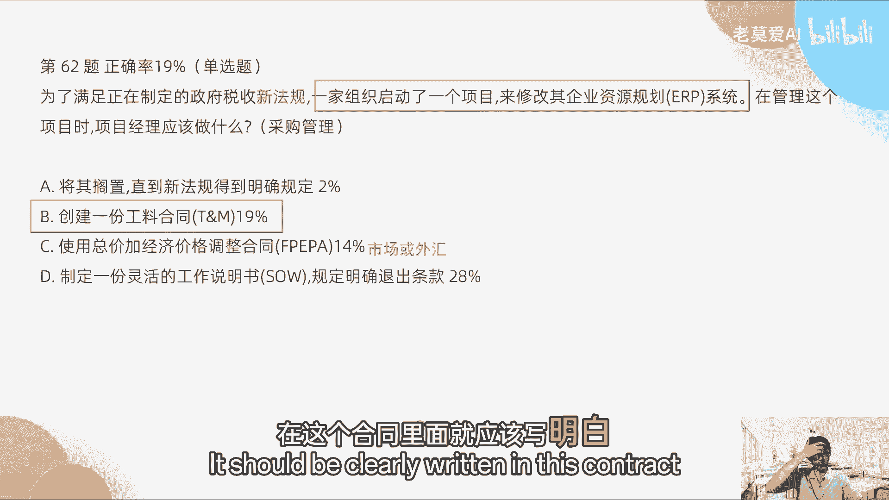
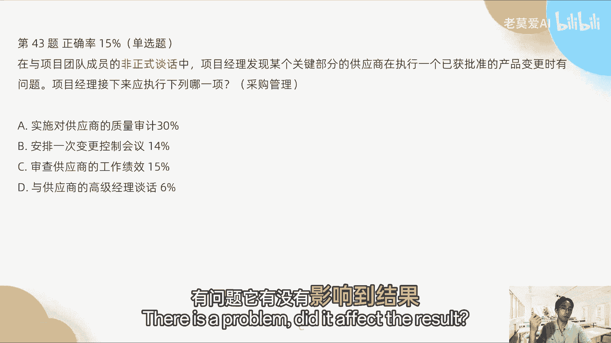
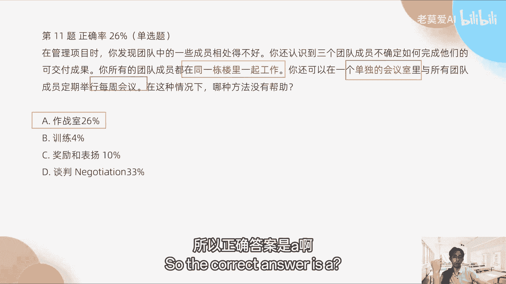
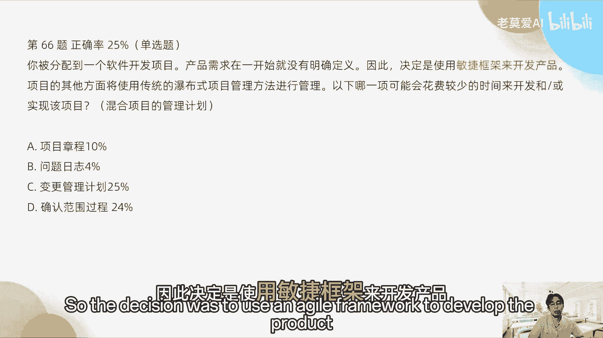

# 【最好的PMP课程】PMP高频错题讲解4-2 - P1 - 老莫爱AI - BV1zjsjeYEcC

这个是不对的，所以我要划掉A是不对的，所以正确答案是D，第81题，项目集经理要求定期更新计划下，项目的进展情况，除了一个项目外，所有的项目都使用传统方法进行管理，项目经理项目及经理指出。

在整个规划中有太多的范围变更，并希望看到这些变更，如何影响各个项目的总体进度，并希望看到某某他一般是希望有发射源，对于领导项目的QUAM主管来说，要满足进的需求，最好行动方案是什么，他是一个项目集经理。

他要看的是多个项目，那么你就给它发射源就好了，所以定期将发起发布燃尽图送给项目，请经理请注意项目及经理，他不看你的迭代拦截图，因为迭代是你管的是一个项目经理管的，不是项目集经理管的，项目经理。

基金理不可能管得那么细，所以他要看是多个项目如何配合起来，所以他要看的是发布蓝镜图，你什么时候发布，你什么时候迭代，跟我没关系，你什么时候发布就好了，所以正确答案是D，而不是C。

好多人说审查让他去审查迭代蓝镜图，项目及经理是不看迭代蓝镜图，迭代蓝镜图是团队内部或者项目经理去看的，但是在里面项目集经理他多了一个极致。

大家要记住啊，多了一个极致就不一样了，好第62题，为了满足正在制定的政府税收新法规，一家组织启动了一个项目，来修改其企业资源规划系统RP系统。

在管理这个项目时，项目经理应该做什么，这个题目属于什么采购管理的范畴，为什么是采购管理组织了，启动了一个项目修改其你看新法规，一家组织了一个项目去修改什么系统，我们为了应对金的法规。

我们应该使用一个合同，因为他提的那个选项里面都是找合同，说工作说明书，所以用什么样的合同，我们前面说过了，应对一样很未知的东西，风险很大的东西的时候，我们是用公料合同，就这个东西我不熟，政府的新法规。

我不熟，这是新法规，我们根据修新法规来修改这个东西，那我们肯定是请专家来修改，那请专家就是公料盒，而不是说总价加经济价格，我们前面说了啊，一定是说什么，比如说涉及到市场价格的波动或者外汇。

外汇才会选择市场或外汇，比如说我跟做外汇的生意，我才能考虑到经济价格，比如说那市场，比如说我买一些茅台，对不对，那今天是价格价格，明天是价格的时候，我们就按照当前的市场价格去收，这在经济价格调整里面。

在这个合同里面就应该写明白。

OK所以正确答案是P1好，在与项目团队的非正式谈话中，项目经理发现某个关键部分的供应商，正在执行一个已获批的产品变更时有问题，项目经理应该经哪一项执行哪一项，那么这个非正式谈话。

比如说我们在叫做非正式谈话语中，我们看到我是没有证据的，我只是说下闲聊的时候，可能喝咖啡的时候，有某一个人他们在做，说他们的有问题，那么读他们的东西有问题的时候，我们不应该去看他们的过程。

不应该去审计他们的过程，因为他们是供应商，而且你不能捕风捉影，对不对，所以我们只能审查供应商的工作，工作绩效，你看到结果是不是有问题，它的过程，你觉得他的过程有人汇报给你打小报告有问题。

它有没有影响到结果。

不影响到结果没问题，所以正确答案是C，这个也是属于采购管理的哦，第42题，敏捷教练协助团队召开会议，对团队刚刚完成的迭代进行反思和调整，那么教练和团队成员为讨论设置了阶段。

那么创建了迭代过程中发生的事情的共享图片，评估在前一步中生成的数据，并决定如何处理讨论过程中确定的问题，这次会议的下一步应该是什么，这个里面我们看到了啊，这个是回顾会，因为反思和调整，对不对。

那么这个回顾会议，我们应该想这个里面应该怎么去做，回顾会议的流程是什么，先是反思和调整，讨论如何处理确定的问题，处理完了以后，回顾会议其实就已经完整了，所以是结束会议，执行决策，很多同学选执行决策对啊。

回顾完成了不就结束了，执行决策，他不是在回顾会议里面去要做的事情，执行决策是回顾会议之后要做的事情，这是会议完成之后要去跟进，所以这个是结束，所以我们要看啊，这个是会议结束之后。

所以这个东西其实派那个不太合适好。

第24题，已经决定使用瀑布管理项目，然而由于需求不明确，软件将在短时间内使用SQUAM进行开发，再从组织内部获得团获得团队之后。

项目经理意识到，组织在几个关键领域缺乏技术专长啊。

这个其其实上一次直播的时候已经说过，将需要从外部供应商获得外部资源，本组希望对其进行工作的战略所属权，对项目经理来说，为了最大限度与供应商合作，最好的承包技术什么，这个已你上一节课已经说过了两个。

一个是我们要搞清楚，一个叫资源外包，一个叫做什么项目外包的区别，资源外包它其实说的是什么，是说的是我们团队和别的外包团队，一起去参加一个项目，这个要资源外包，就比如说我们和宁德时代上次举了个例子。

我们和宁德时代一起坐车，那么我们的电池的方案和我们的整机的方案，我们怎么样，我们都能够这个话语权拿在我们自己手里，这个就说明我们暂略了主权，那其实大家一起在工作，一起去做一台车，这个叫资源外包。

大家一起去共同去做项目外包是什么，不是一起去做，宁德时代是我们的供应商，我们需要电池的时候，他来提供就好了，所以它对我们来说是一个黑盒，我们不知道它电池技术是什么，我们完全不知道。

所以我们的电池得依赖它，所以就失去了我们的战略所属权，这个就相当于项目外包的什么东西，所以我们要在资源外包里面，我们团队招了外部团队一起进来，这个叫团队扩充，我们团队是一个团队。

外面的缓团队扩充进来算一个团队。

所以叫所以叫正确答案是A好，第11题，在管理项目时，你发现团队中的一些成员相处的不好，你还意识到三个成员，不确定他们如何完成可交付成果，你所有的成员都在同一栋楼一起工作，你还可以在一个单独的会议室。

属于所有的成员举行每周会议，这种情况下，哪种方式最没有帮助，其实这个里面我们已经看到了，我们的团队已经集中办公了，同一个栋楼里面一起工作，有单独的会议室，每周举行会议，那作战史其实对于我们来说帮助不大。

作战史它是什么，它其实更近一点吧，大家其实搬到一个办公室里面去办公，这个帮助是最小的，不是没有任何帮助，只是说他帮助的不多，但如果是你说最后我们的项目可能是分散的，项目不在一栋同一栋楼里面。

可能分开多个楼，或者不在不同城市作战室就很有必要是吧，那这些其实做到是没有太必要训练，他肯定是有必要的，奖励和表扬也是有关必要的，谈判也是有必要的，所以正确答案是A。

第27题，项目执行阶段，发现一个子团队没有为约定的项目工作，项目经理应该查阅哪份文件，只团队，那么子团队他没有去工作，所以说明什么资源没有利用上，这个是属于资源管理的问题。

资源管理的问题应该查过资源管理计划，为什么我们约定完了之后，后面商量，为什么我们约定完了之后，他没有按照这个项目目标工作，我们要查这个东西东西，因为资源管理计划里面会有它做什么事情好。

那为什么不是B如果他不是说一个团队，比如说团队A发现一个团队的一个小A，一个团队的角色，比如说项目经理啊，不是团队的开发人员或者测试人员，或者是某一个叫小A或者叫B，他没有按照原定的地方工作。

也不是按照原定的工作地方工作，他的工作职责职责不清的时候，我们办RBSRBS里面就会有小A的工作，他本来是什么，小B的工作是什么，对吧，那开发人员开发人员的工作是什么，测试人员小A小B的工作是什么。

这个是在资源管理计划里面，所以这个里面是团队的工作，这个里面是个人的工作，上一题谈判怎么理解啊，这个里面我先把这个题目做完，第一已经对了啊，就正确，正确答案是选第27题，然后这个里面谈谈判是怎么理解。

谈判在哪一章节。

谈判是在资源管理里面，你可以去看一下资源管理里面，资源管理里面做什么事情是有谈判的，比如说我们需要在资源管理里面去协调资源，对吧，协调资源，别说我们去找职能经理要资源，比如说这两个。

其实资源这个两个人处理的不好的时候，我们需要用到的技巧就是谈判，谈判是这个里面去的。

大家可以在资源管理那一章节去看谈判，第29题，一位项目经理被分配到一个大型银行公司，的敏捷软件开发项目，在项目刚开始的时候，项目经理已经了解了一些新的黑客技术，这么牛逼。

这些技战术对于项目的法规和合规性，构成了潜在的危险，然后项目经理来做什么，那说明什么，项目经理已经识别到危险了，你看已经了解到一些新的黑科技术，所以识别风险对吧，因为它里面有威胁对吧。

机会和威胁都属于风险管理，那么它已经识别到分析那个风险了，那么接下来就是分析，因为风险它的处理过程就是这样的，识别风险和应对识别，首先题干里面已经给了，接下来应该做分析，所以分析不合规的后果。

这个是对的，其他的什么制定累积流图，这个风险没有什么关系，提交变更请求，变更请求，我再再说一次，变更请求不更新风险管理计划，变更请求只更新基准。

只更新三大基准，OK所以这个谁是错的好，第30题，传统管理的项目使用chrome来开发项目可交付成果，然后敏捷发布规划，要求将最近完成的MVP部署到生产中，然而质量部门拒绝了MVP。

声称部门的政策和程序没有处理，中期可交付成果的实施，将问题记录在障碍板上，项目经理接下来应该做什么，这个里面考的是什么，其实在这句话里面，他为什么拒绝，是因为程序里面并没有支持MVP。

因为MVP就是中期可交付成果，中期可交付成果就是什么意思，就是在一个迭代当中就出现了可交付的成果，这个其实就是MVP对吧，MVP的定义，然后他们这个这个里面说，他的政策没有处理这个实施。

所以说政策不支持，所以我们要怎么办，我们就需要去找这个发起人寻求帮助对吧，那发起人要说我们我们的政策必须要加进去，去支持这个东西，支持这个玩意才可以，OK好，那很多同学选，为什么不对。

变更请求只处理三大基准，不不更新质量控制，测量的结果不空，不更新这些东西啊，所以这个是错的，所以再重申一次，所以很多题目都错在这里啊，就是变更请求只处理三大基准，哪三大基准，一个是范围，时间成本。

大家记住这个事情可以可以少走很多弯路啊，第35题，项目负责人反复抱怨称，开发团队开发的功能似乎与原始涉及不一致，什么做法有助于解决这个问题，这个考的是什么，回顾会议，回顾会议，那么回顾会议。

你说开发的功能与原始设计不一致，这个属于什么我们项目开发中的过程的问题，所以是回顾会，那么回顾会议应该是在下一次回顾当中，怎么样去安排讨论所有的纠正项，并要求负责人参加会议就好了。

OK然后这个里面A不对啊，A是负责下一次迭代审查会议。

迭代审查会议，这个是审查结果的对吧，审查结果的功能与原始设计不一致。

这个还没有涉及到结果，因为功能本身就是过程，功能是过程要求质量保证，团队识别与这个相比较，任何功能不匹配。

这个肯定不对，这个重写这个肯定不对，所以正确答案是D1好，第56题，你领导两个独立的团队在一个项目上工作，一个团队采用预测法，另一个团队使用SCM，说明他是一个混合型的项目，对不。

由于团队之间的依赖性和SCM输出的可变性质，预测团队要用尽可能短的时间，来确定他们对这个scorn活动的理解对吧，尽可能短的反馈应该是什么东西，应该是战会吧，最短的在敏捷里面，最短的反馈是战会散会。

他其实考的就是敏捷的战会，所以他是一个混合型敏捷的战会，那很多同学要选发射源，要求SCHROME团队使用信息发射源，OK发射源它只能看状态，能不能反馈，不能反馈，所以账会上他才能有更短的反馈。

就是我们可以讨论15分钟，站会有讨论，因为可以讨论15分钟，所以这个反馈循环在这个发射源里面，它即使swarm团队用了反馈循环，他也不能确定对活动的理解对吧，他以他看到的是只是只是一个死东西。

所以B固然正确，但是它不如D。

所以更适合的正确答案应该是D好，你被分配到一个软件开发项目。

产品需求在一开始就没有明确定义，因此决定是使用敏捷框架来开发产品。

那么项目其他的方面，使用传统的瀑布式项目进行管理，下列哪一，哪一项，可能会花费较少的时间来开发和实现该项目，那正确答案是什么，这是一个混合型的项目，因为敏捷框架来开发产品，其他的地方使用瀑布式是吧。

又出现敏捷，又此又出现了瀑布，所以说明他是一个混合的项目，那么如果在混合项目当中，我们考虑到花费较少的时间对吧，那其实是要偏瀑布的，因为瀑布项目它会比较少的时间来开发，为什么，因为他一开始就要设计好。

而且他不支持频繁的变更，所以我们需要花费较少的时间来实现，这个该项目变更管理计划，如果我们的变更管理计划做的比较好。

那么整个开发的时间会变得比较小。

因为它不允许你有频繁的变更，正确答案是C，第71题，作为一位矿主管，当两个开发人员开始，就应该分配给特定用户的故事点增，争论不休的时候，你正在领导一个用户故事的相对规模评估练习，在争执变成现实之前。

你把两个开发人员分开，考虑到这不是第一次发生这样的事情，你应该做一些什么来尝试解决冲突，这个里面考的是什么，冲突解决的方式，这是资源管理，那么我们上一个直播其实已经说了啊，真正答案是A呀，取消会议。

然后与开发人员会面，为什么要取消，因为上一个已经说了一件这个事情，叫做在PMP考试中，一个会议只能有一个主题，如果新增主题需要令起一个会，就说这个会议就讨论这一个事情。

你不能说这个事情突然发现另外一件事情了，比如说我们现在把另外一件事情讨论完，再来讨论这个事情不行，一个会议只能有一个主题，只能讨论一个事情，所以他们在一开始的时候，他本来是要怎么样，他们本来要评估故事。

但是他们又针对不争论不休的时候好，你要去解决这个冲突的时候，你必须要怎么样把他们拉拉到线下去解决，对不对，那拉到线下这次去解决的时候，你不可能让这个会还在这里存在吧，你不能把这个会议室挂起吧。

你说哎这个我我单独把这个两个人去拿，拿去开会了啊，你们十几个人在这等我一下，有没有可能是这样的，不可能会议里面不可能大家十几个人空在那里，等你们先两个人把这个事情处理完，对不对，所以A选项是正确的。

就是你作为项目经理，应该说因为这个事情不是第一次发生了，所以这个事情还比较严重，对不对，你应该这样去做，这个会议我们先取消，我先把他两个人的问题解决，那我们再找一个合适的时间来开这一次会议。

这个才是真正的解法，好C为什么不对，C，因为它不是第一次发生，如果没有这一句话，如果他是第一次发生，你可以让它自行去解决问题，但是这个题干里面已经说了，它不是第一次发生，所以不是B选项。

我从来没有教过大家这样做，平均故事点的估算值，故事点一定是要大家达成一致的，比如说我估我估五个故事点，你估十个复试点，我们平均一下说哎这个故事7。5个不是，而是我要去说服你，我为什么是五个。

你为什么要是十个，你来说服我，我说服你，或许我我我说服了你，然后这个故事点变成五个，或许你说服了我，这个故事点变成了十个，是这样的，就是故事点是需要我们达成一致的，而不是取抽取个平均数。

这不是这不是分钱，不是说我们我们在地上捡了，捡了100块钱，然后我们来分五五开，不是这个事情啊，所以不不存在，说我们的故事点估算是平均以下的，所以B是不对的，所以B是不是不B是不对的。

D使用理想的估算方法，不是故事。

也这个不是解决讨论的根本，所以D也不对的，正确答案是AK好，那今天的这个啊30道题目，我就跟大家呃解释到这里啊，然后我们下一周二下周二的时候，我们还会有最后一道题目，然后来解析。

我们周六周天的时候会给大家布置一道题目，然后大家尽量把这个题目做完，然后下周二的时候我们在评评这个题目之前，我会跟大家讲一下这个考试的过程啊，就是我们考试中间会经历什么事情。

