# 【最好的PMP课程】PMP高频错题讲解5-1 - P1 - 老莫爱AI - BV19usKetETC

那今天是在讲解之前，我先给大家说一下考试当天要注意哪些东西，我先解读一下，我们先切换到这个考试页面，先解读一下那个考试。

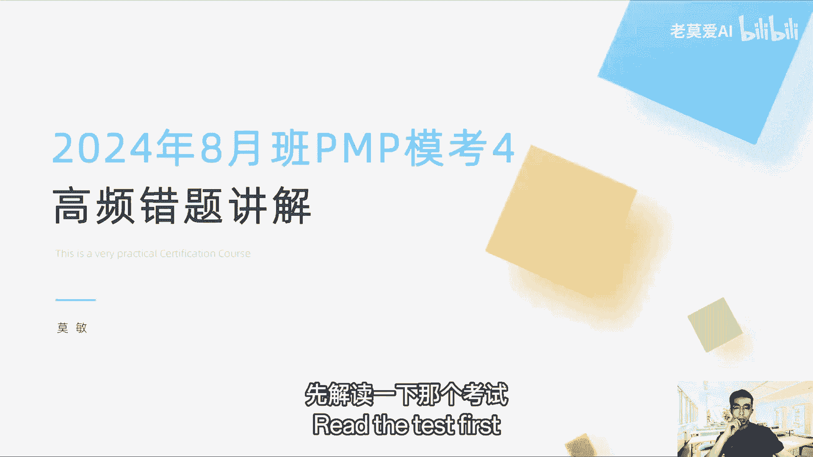

先开一下屏幕共享屏幕共享，打开这个大家能看到吗，最新发的通知，2月23号发的，今年8月27号说8月20，2024年8月31号考试的有关事项，其实每一年都差不多，8月27号到8月31号。

我们都可以打印准考证，那么这个准考证是在哪里啊，在我的考试里面，我们登录了以后，我在考试里面是有打印准考证这个选项的，大家可以去看一下，OK你的准考证其实是所有全英文的一个A4纸，你要把A4纸打印出来。

就一定要打印，你可以找楼下的一些打印社，他可能打印一块钱一张，你打一张就行了，就不用太那个了，你们那个公司什么东西，他有打印室，它也可以打印，它是一个下载完以后是一个PDF文件，大家打印也很快。

打印完了之后，准考证它上面就是右或者左下角，一般是右下角，它会有一个二维码，我们可以扫二维码，会有你的考场和座位信息。

那二维码在哪个地方，在这个地方。

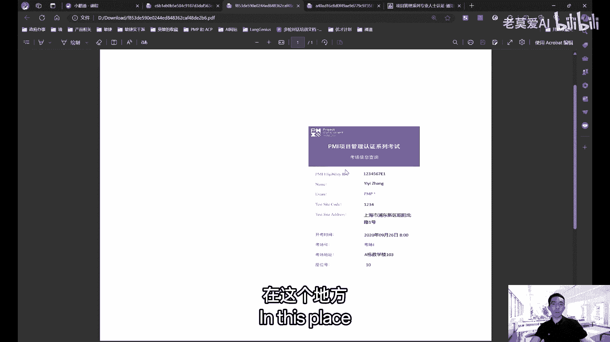

二维码扫完之后，它会跳一个这样的信息出来，就比如说你的p m i id是吧，这个id是其实这个叫做in，你仅比你提id，这个id跟你的PMIID有什么区别，它的最大的区别是加了一个一一的字母。

就加了一个这个1an就是考试的意思啊，第一次考试这个字代表什么，你第一次考试你的名字，你扫二维码以后会出现你的名字，你的考试的名称，你的这个是你的这个位置代码，这个是代表你的考点代码，你这个不用管。

这个是你的考试的地址，你到时候你打车过去找这个地址就行了，一般我们建议大家打车过去啊，为什么，因为考场一般来说它是不让开车进去的，就没有停车场，那么你到时候过去，你要找停车场，那么东西很花时间是吧。

你可能只能停在一些周边，但如果是一些繁华的地方，你找停车场就比较花时间，所以我们建议还是地铁加打车的，这种方式会比较好，这个是考场地址，你打的你就高德导航到这个地方就行了，开考的时间一般是九点钟。

它上面会写考场号，也会写考场地址，也会写，就几栋几号楼，你进去学校里问保安就知道了，几号座位号，这个怎么找这个座位号，它一般会告诉你教师号怎么找，你先去到教学楼，一般的考试的所有的教学楼。

它下面都有一个公告墙，公告墙会引导上面会贴满了，来考试的学生的口号，你通过这个考号来查到你的教师号，去到教师号以后，那个座位号你问老师呃，问教室里面的老师，你说老师我的座位号是10号，请问我坐哪里是吧。

他会告诉你你坐哪里，你就问老师就行了，那每一个桌子，他的考试的课桌，他每一个课桌的右上角会贴一个小纸条，那个小纸条上面有这些信息，有你的PMIID的信息对吧，也有你的名字信息，也有你的考场地址。

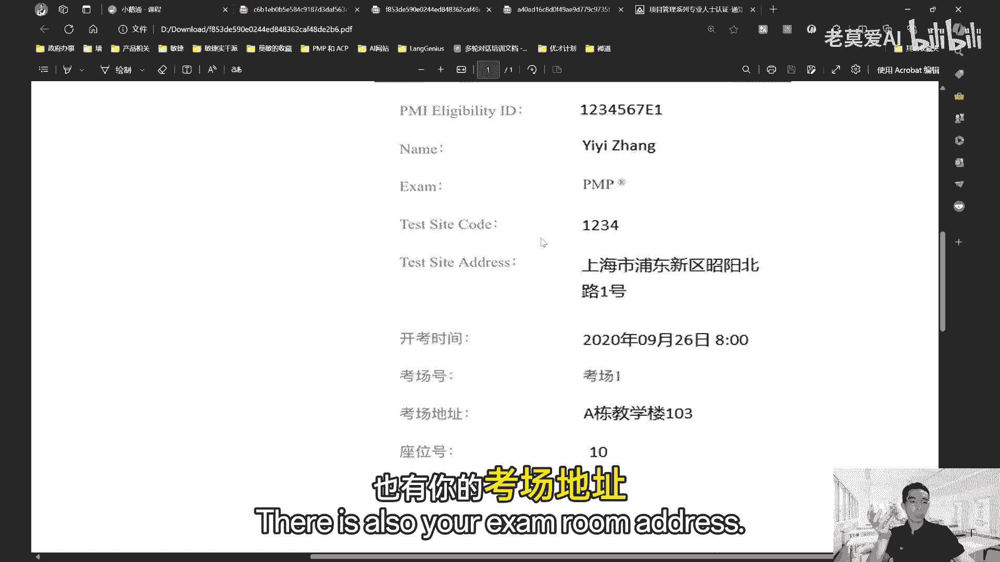

有这些信息，你核对一下，然后这个座位号是不是你的座位号，名字是不是你的名字，你核对完以后就可以了，就是代表你核对好以后，那个桌子就是你的了，那这一次考试你就在那个桌子上做就好了。

OK这个听明白的同学可以打个一好。

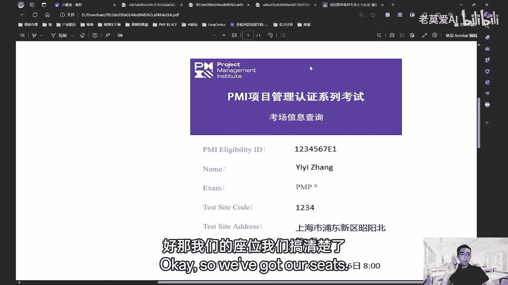

那我们的座位我们搞清楚了啊，我们来猜一下考场的规定，考试时间一般是8月31号，一般是早上九点天，mp是九点到12。53小时五十五十分，那我们大概什么时候，12。20的时候，老师会提示还剩最后半个小时了。

12。20，你如果还没填答题卡，你就赶紧要填答题卡了，半个小时你就要答题卡，一般我们建议是一总共180道题，一般我们会建议先做完100道题，先先把答题卡先填了啊，这样让自己的大脑休息一下。

因为你填答题卡的时候，你是不需要动脑子的，就劳逸结合，100道题填完了之后，再做后面的80道题会比较好，不然连续输出有些人会觉得很累，是这样的，那PMP基本上就是这样的啊，是9。9点到12。50对吧。

然后建议在开考一小时到达，为什么，因为考场他要排队就人很多，然后也要一个一个审核，然后进去了以后，提前20分钟还要去怎么样，还要去宣读考场规则，所以为什么要八点钟到，因为八点钟你到了之后，你排队。

你进场可能8。10对吧，8。10，然后在考场做好，找找考位号，做好以后可能08：30了，08：30完了之后，然后再坐一会，老师就会先说一下考试的指导了，他会老师就会开，考前20分钟。

老师会读一些考场的一些规矩，会告诉你怎么填答题卡呀，什么规矩什么东西，然后开考前15分钟考场停时间到，就是你如果考试开始考试，十五十五分钟之后，这个是属于说你如果你九点钟考试，你9。15。

那校门口是进不去了，那校门就关门了，9。15校门就会关了，所以你如果9。15才到的话，那个券算缺考，也就是说你没有参加这一次考试，那么这一次的考试费你就白交了啊，你下一次还得重重新交考试费啊，记得OK。

然后考试证件，有些学生说老师我的身份证，我当时报名的时候是用身份证，但是我身份证掉了怎么办，身份证掉了，因为这里有一条说的很很明显了，他说出厂时出示的身份证件，类型与报名时使用的证件要一致，这什么意思。

就是你如果是用身份证报名的，那么你考试的时候只能用身份证来核对，你不能说身份证我报名了，但是我身份证掉了，我考试的时候带个护照行不行不行，除非你一开始你就用护照报名，所以这个是不可以的啊。

所以临时如果临时遗失，你可以用临时身份证，就在派出所，当地的派出所去报就行了，这身份证你当时就可以补办的出来，临时身份证是可以的，考试它不允许你自带文具，比如说笔削铅笔刀，橡皮它都有，就你自己不需要带。

每一个人，老师会发一张草稿纸，铅笔那边有配2B的铅笔，橡皮，计算机和草稿纸它都有，铅笔完了之后要要回收，有些人问我考试的手机能不能带手机，你可以带，但是不要拿出来手机，你要把它静音或者关机。

放在口袋里面，你千万不要手机发出声音，你突然来一个微信或者短信，你这个算作弊，不要让老师听到你的手机声音，如果你带包，你把包放在教室就行了，教室的前面就是老师的讲台，前面他会摆很多桌子。

就专门让大家来放那个包的，你带的包就放在前面就好了，手表不用戴手表，你说我机械手表最好也不要戴，因为现在机械手表跟智能手表，其实区别不是很清楚，有些智能手表也会以上面有指针，然后伪装成机械手表。

所以老师就一刀切了，说学生都不能戴手表，智能手环这些东西都不能带，这个要注意了，自备文具，自备草稿纸，食品饮料等等，你自己可以带瓶水，但是那瓶水一定要透明的，比如说是康师傅那种的。

娃哈哈那种水透明的那种水，可以带其他的那种什么，像奶茶什么东西，它不允许带的那种东西是不能带了，好，如果发现老师就会违按违规处理。

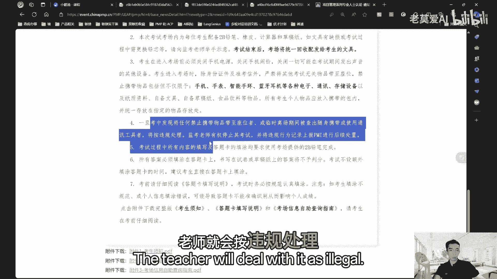

这个要大家要记得填答题卡，答题卡是这样的，填答题卡。

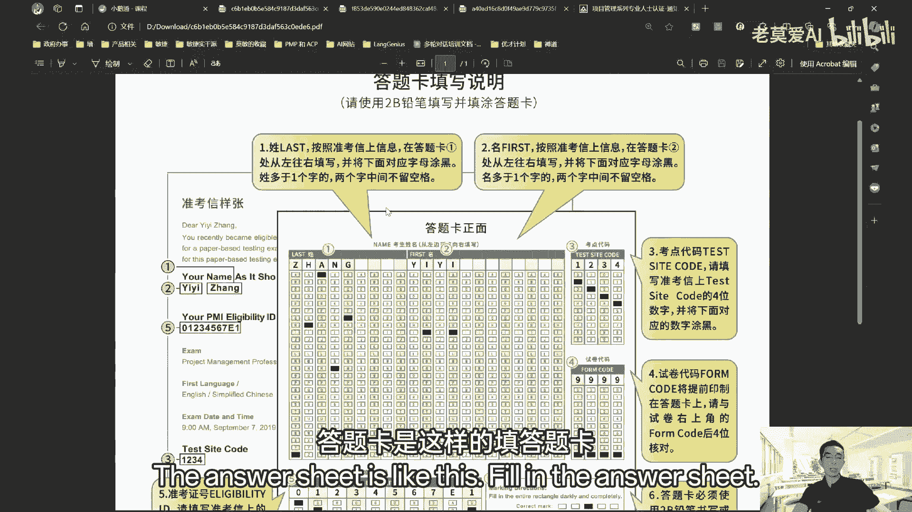

这个是你名字的答题卡，比如说你叫张依依是吧，所以你是C1就填这里去就填这里，你把你的名字在26个字母里面填了是吧，这个是考点代码在哪里，考点代码1234你就填在这里，试卷代码是因为我们考试有五套试卷。

就是ABCDE5套试卷，就你前对面的这个人，前后左右的考卷都跟你的是不一样的，所以你的为了防止作弊是这样的，所以你的试卷你发下来试卷代码是多少，你就填多少，不要填错了，你填错了就没分了，准考证号。

你看11121312就是第二次考试，一三就是第二次第三次考试。

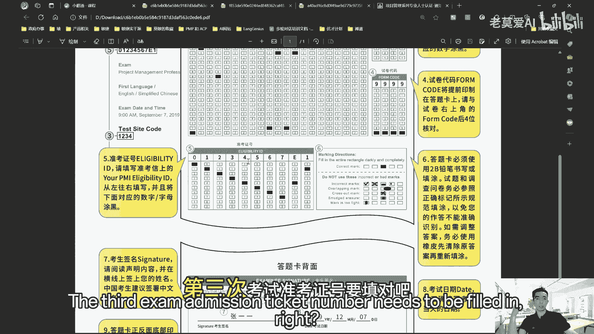

准考证号要填对吧，这个第六个就是这个是一个示例，答题卡背面的，你要签上自己的名字。

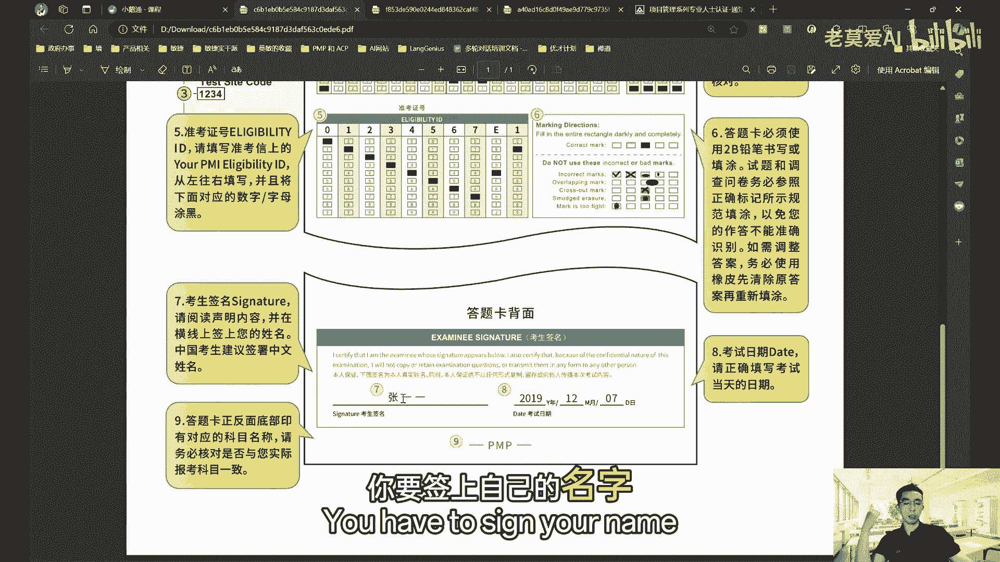

请签中文，一定要签中文，这个考试日期你就填当天的日期就行了，比如说8月31号，你就填8月31号就行了，这个是考试之这个是最后考生须知，考生须知，到时候老师会念，就监考老师会念你准考证啊。

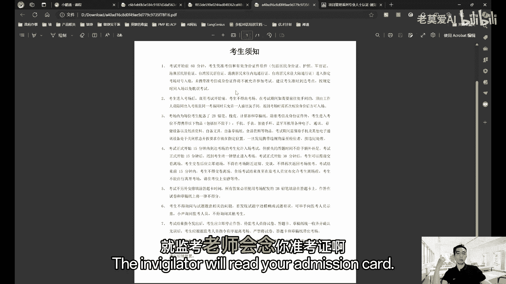

什么东西你要带考试，只要带什么东西，只要带身份证和准考证就行了，其他东西不用带了，顶多带瓶水啊，这个是考试的规则了，你中途你可以让你有些同学说，我能不能带点饼干，我肚子饿，因为12。50才下下烤。

对你可以带点饼干，你放在自己的衣服兜里面或者裤子兜里面，如果你想出去吃点东西，你跟老师说，你说我举个手，我要上个厕所，你在走廊上，你吃点饼干，老师也不会管，你就吃一点东西是不会管你的啊。

所以你这个东西你可以带实战，因为有些同学他可能自己有低血糖，有这种症状是吧，他是中途是要吃点东西，所以这些东西它是允许的，但你不要不要在考试的时候在桌子上吃，不是说大家都在考试，我一个人在吃饼干。

这个肯定不行，OK其他的就没有什么了，其他如果现场有有事的，有有一些情况你可以举手问老师就行了，基本上考试的问题我们现在就过了啊，如果没有问题的同学。

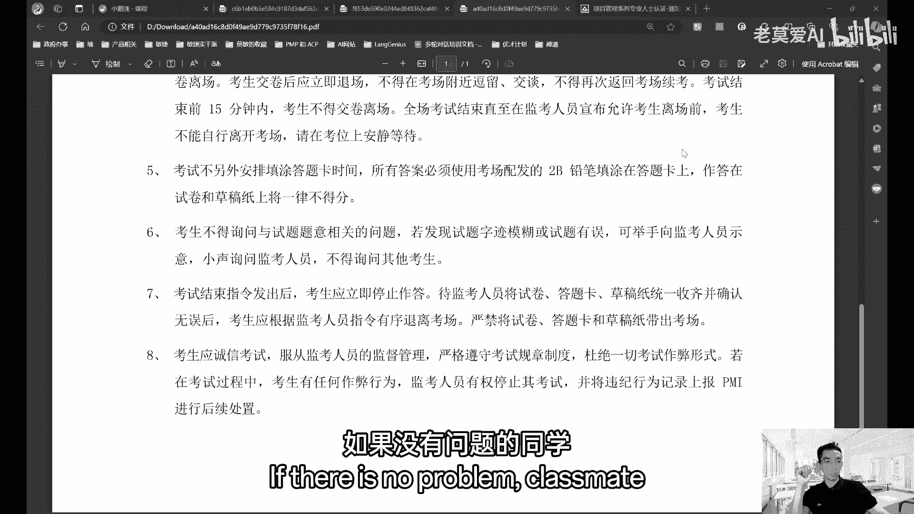

你可以打个六，我们就往下走，OK好，那我们就先回来讲那个考题，第四道考题，不知道大家做的怎么样，那我们就从错误率最高的开始吧，还是那个问题，快速抓题，抓住刚关键字，一道题只考一个章节。

你搞清楚考的是哪一章节就好了，OK如果大家对考试还有什么问题，可以在留言区去提问，我讲完题目的时候，我们再会跟大家说一下好，第178题，项目经理在启动一个新的虚拟团队的时候，应该考虑哪两个行动。

这个考的是什么，你看一看这上面写的虚拟团队就很明显，考的知识点就是虚拟团队是吧，那虚拟团队，我们之前说虚拟团队他最重要的是沟通，考虑哪两个行动呢，跟沟通相关的就是B。

第一个是B确定每个工作包所需要的资源类型，就是我们的每一个人的资源，我们要去分清楚，这样因为他的这个虚拟团队，他不是面对面沟通的，这是他最大的一个缺点，所以我们要把这个资源什么东西投，前面就安排到位。

工作尽量细分，就不要让大家再出现很多，像这种集中团队似的那种沟通问题，我们需要把这个工作包啊，什么东西要确定好，所以B是正确的啊，还有一开始就确定如何监控进展和沟通的，最佳手段。

就是我们前面要把沟通管理计划做好，所以这个东西就是我们的重点，虚拟团队还是落到沟通上面，对很多人可能体验，A评估自己作为虚拟团队领导的优势和劣势，以避免已确定可避免的陷阱。

就我们没有说虚拟团队一定要领导，要具备什么样的特质，从来没有这样说过，所以A不对啊，B是核实团队是否在一个以上的团队，是否能够为团队投入有效的时间，如果我们是在集中的团队，大家主要都在一个工作区。

那可能我们对这个东西很有要求会比较多一些，但如果你是虚拟团队，这个要求就是比较松一点了，对所以D1是不对的啊，所以正确答案是B1好，第155题，项目经理政管理的一个复杂的项目，存在很大的不确定性。

项目经理被要求实施一种机制，以便衡量可交付成果的质量，如果运用混合型方法，那么可以使用哪些技术来实现这一指标好，那这道题考的是什么呢，我们一看本两可交付成果的质量，还有运用混合型方法，所以混合型方法。

我们就想我们这个考的其实是混合型敏捷，那混合型的敏捷的质量如何去保证，那么诶质量保证方法我之前跟大家说过啊，直播的时候，第一课我们学了IP极限，编程里面讲了一个结的工作，就是一个人在写代码。

一个人在旁边看，过一段时间，我们换一下这个写写代码的人后面去看啊，这个看的人去写代码，这样的交叉去消灭这种不不确定性，这样有人员就会有双备份，客户决策法也是敏捷的一个提升质量的方法，它是代表用户啊。

我代表客户或者用户，我们说是焦点小组，每一个小组成员经过反弹以后，他代表小组来这个会议上发表意见，这个叫客户决策法，也叫焦点小组法，所以正确答案是A，正确答案是A，OK好，那很多同学选C，为什么不是C。

C是什么，它是衡量可交付成果的质量，可交付成果质量是结果质量，但敏捷专家审查和质量看板方法，这个只是用来做什么质量看板的方法，这个只是用来做过程质量，大家要记住审查和检查的区别，审查的是过程。

检查检查的是结果，这里面说的是过程，所以C错了啊，好第112题，项目章程已经获批准，项目经理已被指派到该项目，项目经理，目前正与项目组一起对项目工作包进行细分，项目经理在做什么，好工作包细分。

我们在哪一章节可以看到，我们在进度管理那一章节，那么进工作包细分细分的结果叫WPS，所以这个C是结果，但是人家说项目经理在做什么，他问的是结果还是过程，他问的是过程，他问的是过程，所以我们要回答过程。

这个过程叫做分解，所以正确答案是B有什么东西，工作任务分解结构是每一个任务，他就把任务分开，比如说你做一道菜，你要去做一个西红柿炒蛋，那你首先你要打蛋，打蛋就是一个工作任务，挤西红柿也是一个工作任务。

切西红柿也是一个工作任务，下锅这个是这个工作任务分解里面，WPS里面的东西就是一个一个任务，打蛋算是一个任务，这个这个是传统项目管理的，对WBS是传统项目，只要涉及到说工作包或者是WPS。

这里面一定是传统项目管理的东西，PS里面的东西就一个一个任务，打蛋算是一个任务，这个这个是传统项目管理的，对WBS是传统项目，只要涉及到说工作包或者是WPS，这里面一定是传统项目管理的东西好，第24题。

项目团队外部的主题专家叫SMM1，提出了节省项目交付时间的建议，该SM1有时间支持在该项目，但没有计划参与当前的敏捷迭代，那么项目经理应该你怎么做，他有时间支持，但是没有计划参与。

其实在敏捷里面不需要计划参与，我们敏捷讲究的是什么，客户参与胜过合同谈判，也就是说如果你有时间，你就参与进来，参与到一些变更，一些平常我们要做的一些事项，所以正确的答案是应该立即让他参与啊。

稍后再讨论有关影响，你既然提出了这个建议，我不希望你作为我们以前敏捷里面，我们说的鸡和猪，我不希望叫你作为一个鸡在外面指指点点，我希望你作为一个植物参与到我们的团队进来，这个是对的啊。

很多同学说要求现有的团队与SM1合作，完成活动啊，这个把自己鸡的和租的这个角色搞混了，你不是需要去配合他，而是让他一起参与进来，所以参与在敏捷里面它是一个很大的关键词，不是配合，所以正确答案是A36。

项目经理被指派交付某组织旗舰产品，的一个关键解决方案，重要的成果因素包括敏捷性，市场适应能力和，对市场上产品服务的快速响应能力，为了确保公司取得成功，项目经理应该采取的其中一项关键活动是什么。

这个里面想的是什么，为了确保公司取得成功，这里面讲的是一个结果，我们要取得这样的结果，我们需要去做一些什么事情，所以在这个里面一个关键解决方案里面，我们什么最重要，什么最重要，就是我们的目标。

以及达到目标的这样一个可实现的，这样的交付方式和交付成果杂叫鸡和猪，你可以看我以前的直播，我在敏捷的这个串讲里面，敏捷串讲第二次串讲的时候，我们讲了这个东西啊，敏捷里面它有一个典故，一个猪和一个鸡。

他们要开一家餐店，卖鸡蛋和火腿的鸡，就说我们一起干吧了，猪就不说不干了是吧，卖鸡蛋，你天天可以产鸡蛋，这个事跟你的关系不大，但是火腿对于我来说，我只有四条腿，我牵完一条腿就没有一条腿了，这个是我的。

我说明我是什么利益干系者，第一利益人，所以你不要去指导我去做一些这个事情，你是局外人啊，是这个意思，卡住了，你可以重新退出，再进去一下，OK所以这这个题目啊，36题正确答案是A。

这个里面定期审查项目的计划目标成果，以确保获取所有的数据，从而继续进行明确的项目决策，这个东西如果我们的项目目标就错了，一开始我们的项目目标就错了，你定期审查其实也是错的，C也是审。

所以最开始的这个东西最重要，这个其实考的是价值交付的事情，第64题，提出了一份障碍因素清单，并要求项目负责人帮助确定他们的优先次序，有一些复杂的待办事项中的事项。

一些新的初始人员已经发现了一些合规性缺陷，产品负责人和几个开发人员将离开团队，他说的其实是项目的问题，我们可以看项目有很多的问题啊，与测试和生产合作伙伴的合同在不再续签，他应该首先关注哪个问题。

这个跟以前的那个题目不一样，以前的题目是说遇到这些问题的时候怎么办，他们一般是我们按照这个排序，然后一个一个去解答个问题，但是这里他问的是你首先应该关注哪个问题，那么如果我们在价值交付这个项目当中。

我们来去思考问题的时候，我们一定是从我们的整个效益上面去考虑，就这个项目一旦有一个环节出作败了，它会造成项目的什么样的影响，来思考这个题目的是什么，最大的问题其实是C，就所有的问题其实都不是问题。

人员离职也不是最大的问题，最大的问题是我们应对合规的检查的问题，也就是说政府的力力量合规一般是政府的力量，来自政府的力量是不可抗力，也就是说政府要求你这样做，你是在政府的这个管辖内，你必须要去这样做。

到如果不做到你所有的努力都白费，对你甭管你的人招聘来，你人员流失了，你就招100个人，你也没办法去解决这个问题，那首先解决的就是你政府法规，你要去合规的问题，所以这个是第一个，所以C是最优先级的。

而不是说我要找到一个新的产品负责人，来去确定产品事项的优先级啊，所以招这个里面说的是进招聘，不是这个里面的最大的问题，OK先解决合规的问题好，第66题，一个大型的举证组织，正在采用一种新的沟通方法。

这不是必要的，因为他们的项目往往需要从各个部门和部门的，专家那里去获得的呃，专家知识的资源，项目经理应该做什么来建立有效的沟通，这个里面考的是什么，考的是我们的沟通管理，因为我们讲的是什么沟通的方法。

这个关键字是一些沟通的方法了，建立什么做什么来建立有效的沟通，他问的也是沟通，所以我们这个里面考的就是沟通管理，那么沟通管理最重要的是什么，我们前面讲沟通管理要排除噪音。

也就是说我们重视的是表达我的表达，被接收人接收，他是不是完整接收到了，所以他要提出反馈，所以沟通它不是单向的，它是双向的，我收到发这个东西以后，你是不是收到了，你收到的信息是不是正确的。

对你要告诉我你收到了什么样的，所以这个地方比较重要的，所以我们最重要的是注重收件人的需求需要，而不是信息本身，这个是沟通最需要注意的事情，而不是以易于理解的方式传达传递信息，易于理解，这个也不一定啊。

有一些专业领域，比如说医学领域里面我们传达的这个东西，它本身就是比较专业的，不是每一个团信息传达，都需要把它化成易于理解的，除非你是跟小白去说，跟那些非专业的人去说，所以这个A有点以偏概全了啊。

第75题，某项目处于知识转移阶段，几名主题专家又是主题专家，前往客户开展知识转移活动，SM捕捉到不是SM，一捕捉到各种构成方面的偏差，但与未与团队分享这些信息，这个说的是什么谓语团队分享信息说的是什么。

沟通问题，沟通问题就是信息没有传达，信息没有传达的问题，跟信息传达，信息流转的问题都是沟通问题啊，所以项目经理如何能够确保在团队内完成知识，所以我们要解决的是沟通问题，所以在这个问题里面。

我们怎么去解决这个问题呢，我们需要在项目收尾的时候进行一次经验教训，将问题包含进来，这个是项目收尾，这个已经说了，知识转移阶段其实就是项目收尾，项目收尾我们就需要做这个事情，需要这个事情。

这样才能确保完成知识转移，因为你没有分享这些信息，说明这个知识收尾做的不好，所以要做这一步就会做的比较好，很多人说，知识转移上传是项目信息管理信息文档，从而向所有的成员分享这些文档，这个不一定。

如果你只是将文档上传，你不能保证每个人都能够阅读这个文档，你只是把信息上传了，你要保证每个人都阅读到，你这个东西是需要人工去干涉去做一些事情的，所以他这个D写的有点片面，78题。

某市场团队正在规划的一个为期多年的计划，将包含很多跨职能部门的干系人，项目经理已经指定，项目现在处于规划阶段，项目经理应该首先编制哪些文件好，这个里面考的是什么，很多跨职能部门的干系人是吧。

那这么多干系人肯定会带来什么问题，沟通问题，这个里面其实考的是沟通管理，有些人说刚系人在提了干系人，不是干系人管理以后，你如果觉得是干性能管理，你去看一下ABCD的选项，有没有跟肝性能相关的，没有。

那说明他考的不是干性能管理，但是有跟沟通相关的，那是沟通问题，那所以是D选项，只有D选项是沟通问题啊，你看商业论证和范围文档，这个里面没有说到专业论证和范围文档，这个事情，而且它是一个规划。

大家记得它是一个规划期的，我们五个领域是吧，五个或五大过程组有启动规划，执行监控收尾，正在规划的一个项目，是它是在规划阶段，那么商业论证和范围文档是哪个阶段，我想请问大家，商业论证和范围文档。

它是在启动阶段前面已经做了，对这个同学答的对啊，启动阶段前面已经有了，你不可能说，首先应该编制启动阶段的这些商业论证吧吧，因为现在是规划阶段，所以规划阶段我们应该做规划阶段的事情，所以D是对的。

A是错的啊，好第127题，董事会的一名成员，是一个对组织非常重要的项目发起人，该干系人有诸多其他优先事务，目前没有参与到活动当中，项目经理如何促使干系人参与到项目中，我们一看发起人什么干系人什么东西。

这个题目大概率是干系人管理，而且下面的选项里面基本上全是说干系人，所以这个题目就是考的干系人管理，怎么促使他参与到这个项目当中，我们看一下这个干系人很特殊，他是一个发起人，是在整个团队当中。

他项目团队当中发起的最最重要的一个角色，因为他是为团队提供资金的，所以他在团队当中他是做大量的决策的，所以B是对的，让干系人参与治理和决策的过程，这是对的，好多人选D让干干性能随时了解项目情况。

并根据其需要与其与其协商，这个项目随时了解相关的信息，并根据其需要与其协商，D其实也没错，B没错，那么说D没错，如果选项有选两个，肯定是B和D，但只有一个了，那干系人的最重要的事情。

他还是要参与治理和决策好，第137题，项目经理正在领导一个项目，该项目的几位干系人来自于其他的职能部门，其中一位干系人甘甘继承，为另一个部门的负责人，干部门也是项项目的一个干系人。

项目经理应该让团队更新哪些内容，来确保与干系人适当沟通，所以这里面提到又提到干系人，又提到沟通，那到底是考干系人还是沟通呢，我们要看最后一句话，与干系人保持适当沟通，它要更新哪些内容，保持适当沟通。

所以适当沟通它是一个沟通问题，它其实还是信息的问题，适当沟通是什么，沟通管理，沟通方法和沟通技术，那这个题目是考的是沟通，所以沟通管理计划是对的，有了沟通管理计划，我们就来能够确保他有适当沟通。

比如说跟发起人是吧，沟通管理计划里面会说我们跟发起人，我们是不是每周我们要跟发起人开一次周会，我们要把这个邮件要传送给几位重要的负责人，这个里面是在我们的沟通管理计划，里面去说到的。

所以每一类的干系人他有不同的这种沟通方式，这个都是在沟通管理计划里面的，OK所以正确答案是B计划，一般不是在规划阶段都是定好的吗，在执行过程当中可以更新的，你说什么，他没说这个是执行阶段。

因为刚刚晋升为部门的，该系人也是一个部门干系人，他没有说特定是在执行阶段，计划可以更新的话，每一次我们计划当然是可以更新的啊，比如说你可能项目怎么被砍掉几个人这样，那我们我们是不是要重新定计划呀。

那肯定是要你一般以前十个人做，你现在八个人，你计划不更新吗，那你八个人做十个人的活，那那那那不计划不更新怎么玩，所以计划是要更新的，在传统项目管理计划要更新计划会，就算CCB要走变更流程啊。

我比如说十个人有两个人离职了，我们现在是八个人，所以我们要提变更流程，提编个流程以后，我们就要把计划我们要重新排一下。

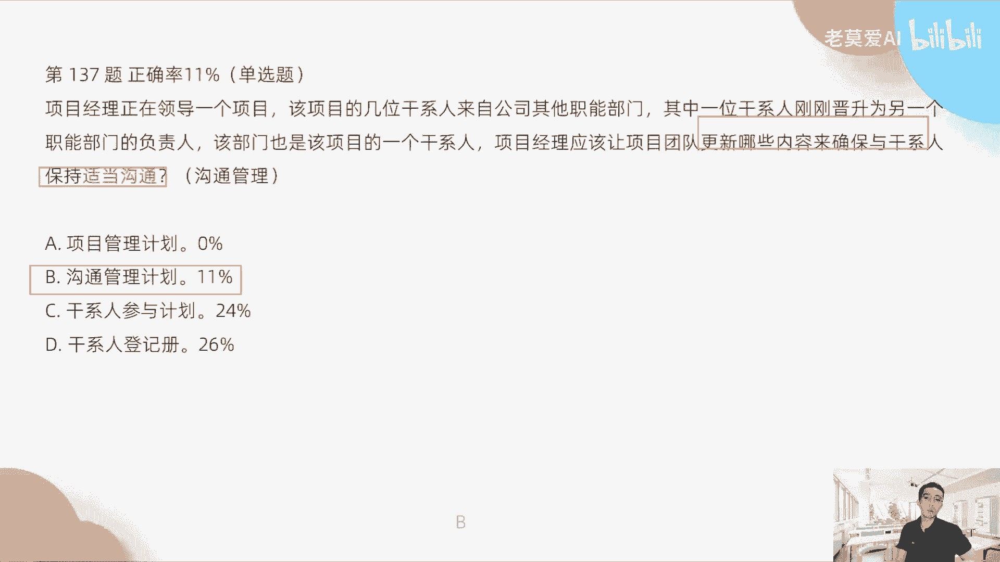