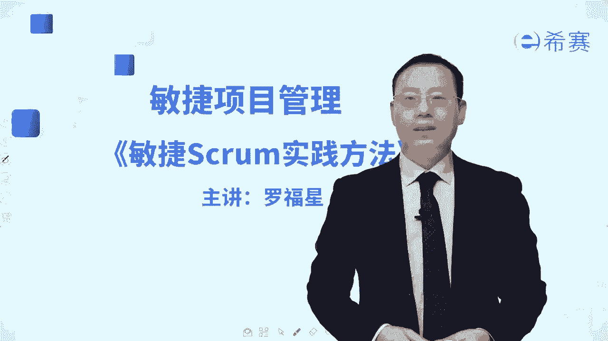
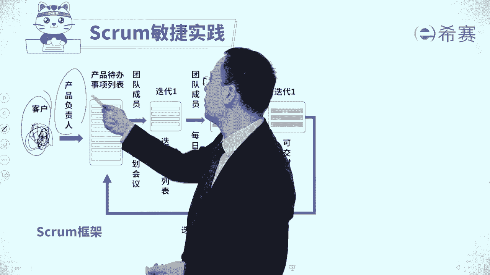
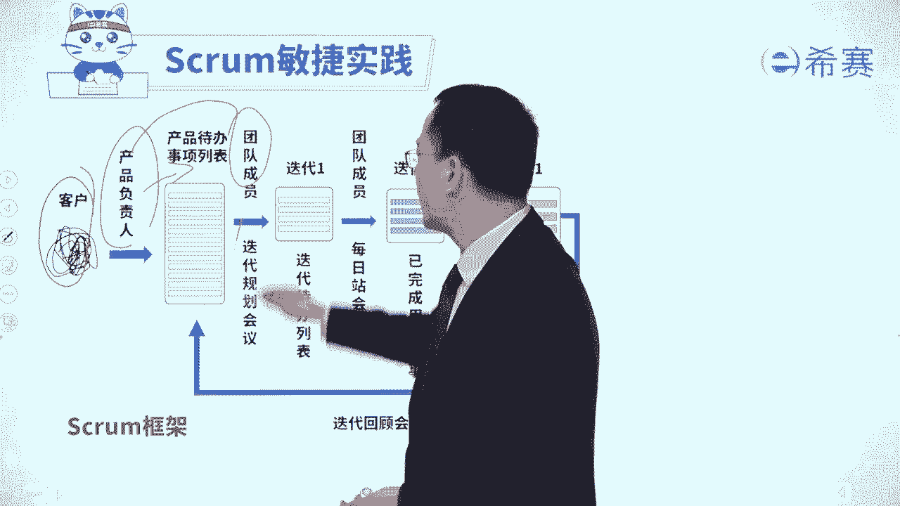
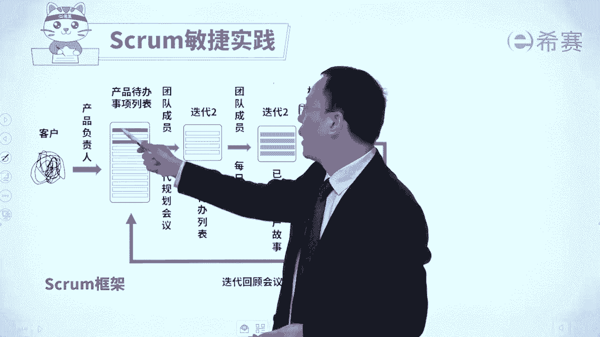

# 【最新零基础】2024年PMP认证考试课程-敏捷项目管理 - P23：23敏捷Scrum实践方法 - PMP项目管理 - BV11ce6ePEin

大家好，接下来我们一起分享的是敏捷项目管理中，很重要的一个内容，叫敏捷的crown实践方法，它其实它的这个名字起源是，来自于英式橄榄球中征求的这样一个活动，也就是我们在做一些事情的时候。

其实可能会需要一些灵活变通，随时去做调整和变换，我们前面已经认识到了啊，就整个敏捷呢它会有敏捷的宣言，有敏捷的这样一个四大价值观，有敏捷的12个原则，以及敏捷会有若干种实践，而这些若干种实践中。

对于在生活中用的最多的，也是咱们考试中考的最多的，就是这样一个SCM实践，那这样一个scrap实践，它为什么会这么有魅力呢，因为SCRAPT实践，它真的是一个敏捷项目管理方法，的一个玩完整体系。

你能够看到整个在这样一个结构中，它是一个完整的闭环，我们一起来简单给大家解读一下啊，这里面有几个重要角色，首先呢会是有一个叫产品负责人的，这样一个角色，他呢能够去从各种相关方那边去获取一些需求。

以及各相关方，他们对于需求的这样一个重视程度啊，觉得它的价值重要性啊之类的，了解了这些信息以后呢，他会去把这些需求整理成一个需求列表，而这个需求列表，它是用一种叫用户故事的方式来去整理。

那么这样一个整理东西呢，最后叫产品待办事项列表，而产品代办事项列表，Product backlog，它其实类似于一个需求池，那么也就是客户要做的事情都会把它列进来，我们说怎么样去拥抱变化呢。

就是客户又有一些新的变化过来的话，会透过产品负责人PO这个角色，来去加到这个p product backlog这里面，来加到这个需求池里面来好，我们在做事情的时候呢，是每一次我们分成很多轮对吧。

每一轮迭代，每一轮冲刺我们先做里面的一部分，所以这里面会有一个就是PO，和团队一起来共同开会讨论一些事情，讨论了以后决定选取哪一部分来进行，把选取的部分呢放到这里面的列表中来。

这个列表呢叫迭代待办事项列表，那迭代代办事项列表中，就列出了本轮迭代我们所要做的事情，而这个列出本轮迭代要做事情呢，这一次会议呢叫迭代的计划会议，或叫迭代的规划会议，而同时我们定好了这些事情以后。

接下来团队就开始去干事情，干事业，那么干事业的过程中呢，有一个很重要的角色叫敏捷教练，Screen master，这个角色他会来帮我们去做很多事情，其中包括确保大家都用敏捷的方式来行为，处事来去工作。

以及帮团队去清除障碍，但大家有不太会的地方，不太懂的地方，那他都可以去提供支持和帮助，那他能够去，相当于说是给我们做了很多的支撑和辅助，所以呢还有一个词叫仆人式领导，或叫服务式领导，后面会展开来讲。

好有他的支撑的情况下，团队一起来去做事情，做呀做呀，做每一天呢在敏捷中会特别强调是透明沟通，说我们每一个人都讲一讲昨天干了什么，我今天要干什么，遇到什么困难和挑战好，有了这样一些信息以后。

我们接下来就是一直去做啊做做，当然了，它里面其实不只是做事情，还包括说去做测试呀，然后去改bug呀，这些都是有的啊，终于做完了，做完了以后呢，这一轮迭代我们就想要去交付，交付出去的时候呢。

会开一个重要的会议，叫迭代评审会议，而这个迭代评审会议中，其实就是团队来去给领导们给PO，来去展现我这一轮迭代都做了哪些成果，然后给他去演示这个成果哪些是可以用的，然后他们来去做验收，验收通过的。

就是成为了一个叫潜在的可发布产品增量，如果验收没有通过的呢，那么不好意思，还要去打回去，又回到这个产品代办事项列表中来好，然后做完了东西以后，我们得到这个OK的，到了一个潜在的可发布产品增量。

我们在前面有讲过，说敏捷的方式，它是增量交付的方式，我每一轮增量都会交付其中一些些内容对吧，所以是依次交付一点，依次交付一点，不断的去交付，越来越多啊，你这一轮交付的东西搞完了以后呢。

我们自己内部还要再召开一个叫迭代回顾会议，那在这一个迭代回顾会议中，我们会列出说本轮迭代哪些地方做的比较不错，哪些地方呢可能还需要做一些改进，我们在下一轮迭代中要如何去做改进，优化好，列了这些信息以后。

接下来就开始在下一轮又开建一个，迭代计划会议，或者叫迭代规划会议，然后再拿出一部分东西来去完成，然后再又重新回到这样一个循环，所以敏捷的词库串实践，它其实真的是一个非常具体的这种方法论，它会告诉我们说。

做事情我们是哎一点一点的去做，1。1点去做，1。1点的去做，还记得吗，前面有画过这个图形的对吧，随着时间的推进，他是每一次做一点东西就交付，做一点东西就交付，当然了，有可能第一次迭代的时候呢。

我们没有去具体的做内容，那么把第一次迭代呢叫迭代零好啊，从第二个迭代开始就做事情，做事情做事情，每一轮迭代就做一些具体事情，就第一轮迭代的时候，我们可能就在做一些准备性的工作，做了一些准备性的工作以后。

开始去做事情交付，做事情交付这样子好，最后一轮迭代的时候呢，有可能也不在做事情，最后一轮迭代，我们可能会是去做一些收尾性的工作啊，这有叫叫迭代N啊，这个我们前面已经是简单认识过对吧啊。

这里还有另外一张图示来去展现，就是产品负责人从客户这边来去获取这些需求，把这些需求放到这个产品代办事项列表中来。

然后产品负责人和团队成员一起来召开，这样一个迭代规划会议。

然后把这些里面的重要的内容中的一部分，靠前的东西放进来，得到一个迭代待办事项列表，然后这个迭代代办事件列表，我们通过做事情的方式来，产生了这样一个完成的成果，其中呢我们在做事情的过程中。

我们会开一个迭代评审会议，来对这个结果进行评审，评审了以后，有一些东西是接受了，得到一个可交付的产品增量，那也有一些没有接受呢，就要回去又回到这个里面来好，再来到下一轮迭代。

回顾会议会考虑这一轮迭代哪些地方做得好，哪些地方做的不太够，我们下一轮可以怎么样去做优化改进，迭代好，就又开始下一轮，而在整个做事情的这样一个过程中呢，还有一个叫敏捷教练的角色。

他来去给我们我们提供支持，帮助辅导，以及帮我们去清除障碍，这就是整个敏捷思科实践，比方说这一轮做完以后，下一轮诶哪些东西是没有做完的，又回到这个里面来。

哪些做完了就是已经就不要了，好，下一次又从剩下的里面再挑一些东西出来去做，就这样一轮一轮的进行下来，那接下来呢我们就会重点去展开来讲一下，整个在敏捷施工ING框架中的，一个叫33355的这样一个结构。

一个是三个支柱，一个是三个角色，一个是三个弓箭，还有五五呢，一个是五个事件，还有呢五大价值观，我这里就不去给大家念了。

