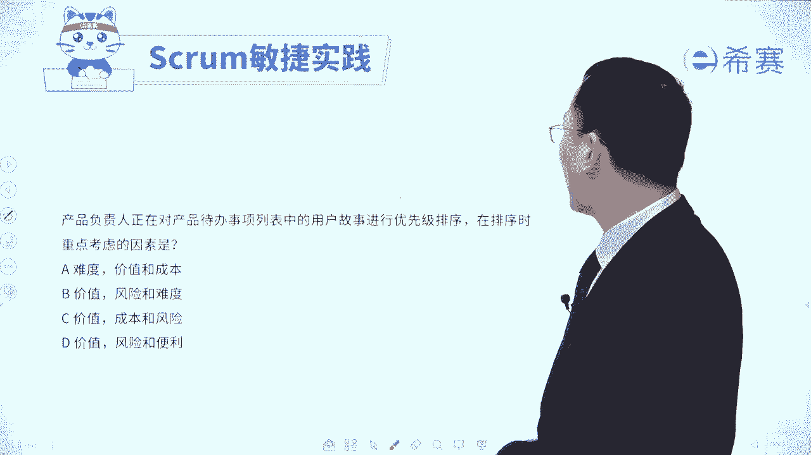
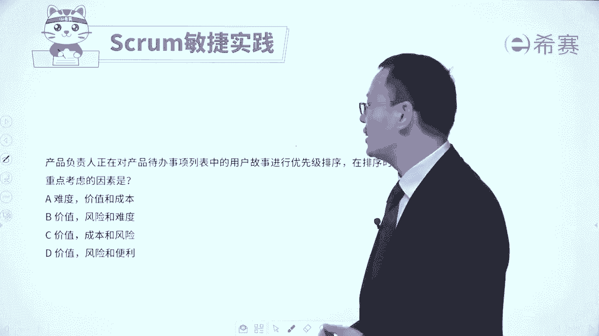
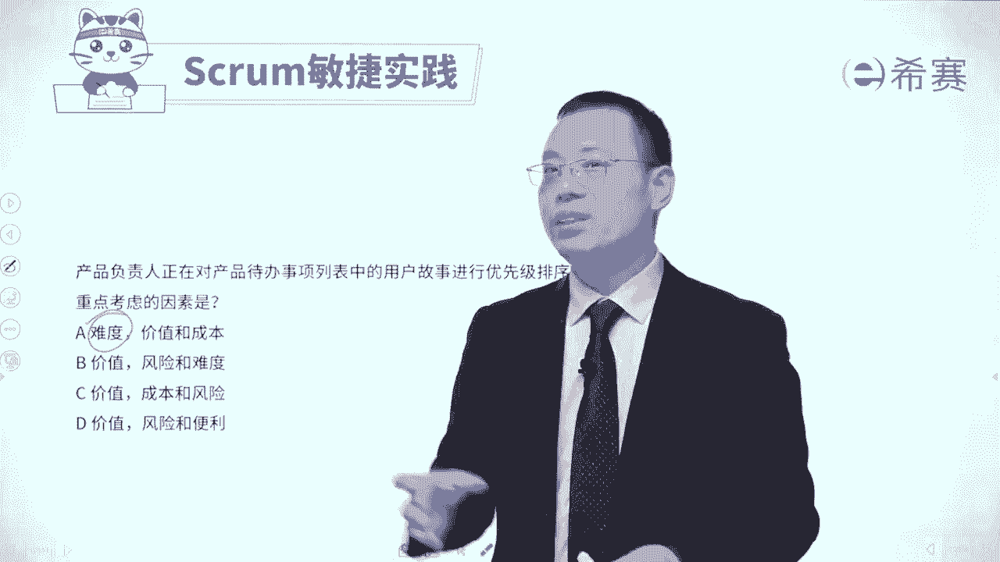
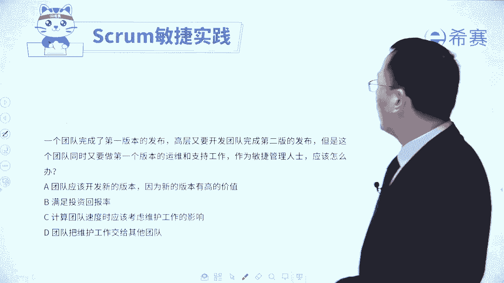
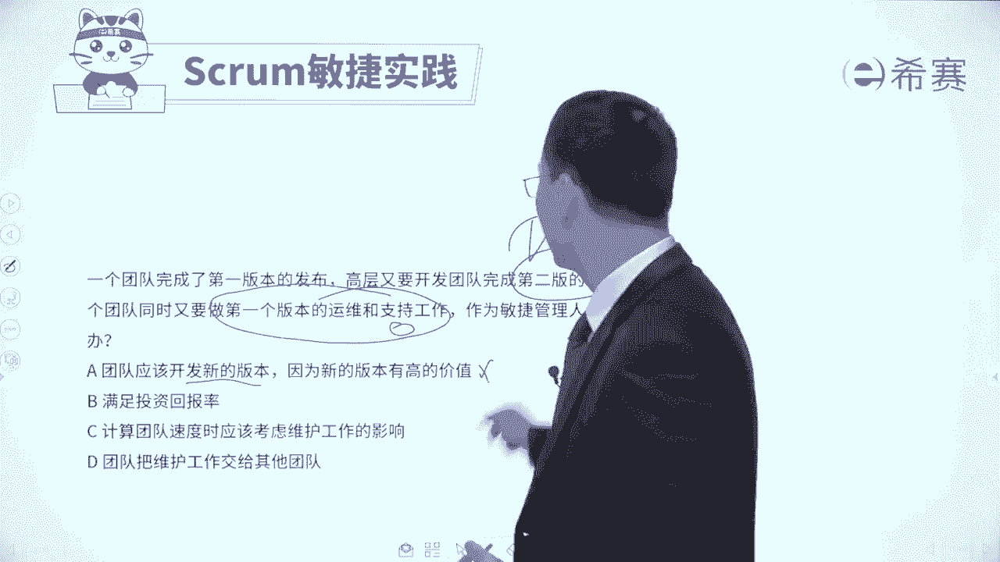
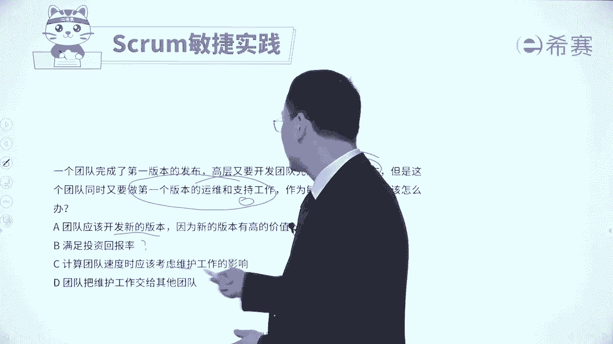

# 【最新零基础】2024年PMP认证考试课程-敏捷项目管理 - P32：32产品待办事项列表习题讲解 - PMP项目管理 - BV11ce6ePEin

大家好，我们刚刚已经是花了一些时间，看到了关于产品代办事项列表的，若干的知识点内容，接下来我们会通过几个题目，一个是来去巩固，关于产品代办事项列表的这个知识点，还有一方面呢是有一些东西。

可能会对它进行少量的补充，我们先来看一下这样一道试题，敏捷项目的项目经理，他被要求将预算呢减少30%，由于这是一个小型的项目团队，因此预算主要是分配给资源，项目经理应该使用什么策略。

才能够在受限环境中保持交付价值，请注意他是要去将预算减少30%，而这个预算都用来干什么呀，就是安排这个人工来做事情，其实也就是说你的工作量会减少30%，你的工作量减少30%的情况下。

怎么样能够去保证依然交付价值呢，那当然是优先做重要的事情嘛，应该是这个逻辑对吧，看一下四个选项，选项A平衡项目团队，以适应预算的挑战，并且呢能够去提供培训，以降低绩效的那个低下的风险。

这个有点强人所难吧，如果说真的可以这样的话，那说明这里面还有很多很多水分，对不对，所以这个有点太过于夸张了啊，就是减少了30%的这一个人时，依然可以把项目给完成，这个有点太夸张了，好第二个选项。

优先考虑产品待办事项，以寻找高业务价值和低工作量，能够去调整项目预算和人员配置，已完成，什么意思呢，就是优先找那些价值比较高，同时供应量比较低的东西，其实就是做一个这种排序，通过排序的方式。

把那些价值比较大的东西往上面去浮，价值又大，工作量又小的东西，重点往上面浮，那当然这是一个很好的一个逻辑，相对应的那种价值比较低一点的，并且还有是工作量又很大的东西，就往下面乘。

而我们用有有限的这个工作量，来去完成那些高价值的东西，所以它刚好就是一个极其好的一个选项啊，好第三个，将项目范围仅限于基本的关键功能，并且呢以当前人员配置水平来运行项目，直到完成所谓的预算，这什么意思。

很显然，这个基本的关键功能，和这里面说的是高价值的功能就不一样，我们在敏捷中其实会提倡的是，它是价值驱动的这种方式来做事情的，所以一定是要去交付价值，我们的敏捷团队也是要去交付价值，所以这个不匹配啊。

第三个不合适好，第四个，减少项目人员，并相应的去调整范围和时间表，以支持预算的削减，这个呢他其实说的方式你不能说他错，但是他没有讲出要点，要点一定是我们能够去优先考虑高价的东西，才能够真正的交付价值。

你怎么样才能够去交付价值，你要时刻记得题干中说的是，虽然人数减少了，或者是给你的工作量的时间减少了，但你依然能够去交付价值，怎么交付价值，优先把高价值东西先去完成，所以答案是选B选项。

这里面就告诉我们说整个产品代办事项列表，它就是一个有序的列表，是以价值为导向的，我们把那个高价值的，高业务价值的给挑出来找出来，我们再来看一道题目，公司正在进行敏捷开发。

新来的公司领导呢对于敏捷并不了解，他询问敏捷项目管理的专业人士，关于产品代办事项列表的这些事情，那么项目管理的这样一个专业人士，他应该如何去回复，关于这样一个产品待办事项列表项呢。

选项A应该对于该事项进行精细化的分解，并准确的估算啊，你一看到这个词肯定就不对啊，我们怎么会对它进行那么准确的估算呢，都是做着做着才去做的，它是一个渐进明细的过程，是一滚动式规划的过程。

好B选项应该对事项进行精细化的分解，并在冲刺计划中来去估算，呃，这个好像其实还可以，对不对，看上去好像还可以，如果是乍一看没有特别合适的话，你觉得可以留下来好，我们看一下C选项。

应该对于该事项进行逐步精细化，并且在迭代计划中来进行估算，哎你会发现什么，C和B说的好像非常相似啊，它唯一的差别是什么呢，唯一的差别，这个说是精细化的分解，这个是逐步精细化。

那我们知道敏捷他其实是渐进明细的过程，应该是逐步精细化，会比那个更好，所以有C以后把这个B给pk下去了，最后一个应该对该事项进行精细化分解啊，那这一看就是被pk下去对吧，所以呢答案只有C选项。

就是我们要对于这些个需求内容，对于这个产品代办事项列表的东西，应该是逐步的精细化呃，每一轮迭代我要去做什么事情，就去细化这些用户故事去讲一讲啊，然后再去拆解成任务好，到下一轮迭代时候。

我们又要做累一些这些用户故事，把它去精细化细化，然后去拆解成这些任务，1。1点来去进行一轮一轮去进行，所以整个产品代办事项列表中的，这些细化的这个梳理啊，它是一个渐进明细的过程。

每一轮迭代来去梳理一些东西，每一轮迭代去梳理一些东西，好，我们再来看一个题目，产品负责人正在努力为一个复杂功能来去编写，用户故事，若要处理这样一个问题的话，敏捷管理专业人士应该要怎么做。

那既然是一个复杂的功能，所以这个用户故事估计也是一个比较粗略的，或者比较大的一个东西，对不对，而咱们的敏捷中有一个叫deep法则或者叫deep模型，我们需要把它做了一个详略得当的做，能够估计的。

所以最好的方式应该是用一种分解的这个思路，来看一下四个选项，选项A与产品负责人合作分解故事，并且是专注于其最有价值的部分，A这刚好就符合，对不对，它就是正确答案呢，兄弟姐妹，她就是正确答案啊，好B选项。

增加迭代时间长度，确保能满足所有的需求，一般情况下我们不会去修改这个时间和，尤其不会让它那个时间变得更长，不会去拉长这个时间和好，C选项，将该故事与产品代办事项中的不同的故事，来进行交换。

你交换又有什么用，这颗粒太大的话，这一轮迭代都完不成，就不太好，我们应该是把它细化好，最后一个选项在下一次的回顾会议上，与产品负责人一起去评审故事内容，他没有抓住焦点，焦点是这是一个复杂的用户故事。

我们要去编用户故事的时候呢，我们可以把它分解成几个小的故事。

所以呢答案是选A选项，过大的用户故事我们需要去做拆分，你只有把它拆分成比较小的颗粒，才能够在每一轮迭代中就完完成它，好，我们再来看一个题目，产品负责人，他对于产品代办事项列表中的用户故事。

进行优先级排序。

那么在排序的时候重点考虑什么呀，重点考虑的首先一定是价值啊，第一位是价值。

所以这个先没干掉，然后其次呢还会有关于风险呐。

成本啊这些东西，所以这样看下来的话，你这个是你需要去稍微记一记的，就是重点考虑的是价值，其次是风险，除此以外呢还有包括成本啊，一些依赖关系啊，一些政治因素等，好，我们再来看最后一道题目。

关于这个板块的一个团队完成了第一版的发布，高层又要开发团队完成第二版的发布。

但是呢这个团队同时又要做第一版的这些，运维和知识的工作，那么作为敏捷管理的人士，你应该怎么做，其实它就是告诉你，我们现在既要去开发第二版的功能，同时又要做第一版的这些运维的一些工作，知识的工作。

那要做还是不做呢，都要做，你不能只做第一这个部分，你也不能只做这一部分，应该是两个部分都做，我们来看一下四个选项，选项A团队应该开发新的版本哈，这个本身没毛病，但是他好像说的是只开发新的版本。

这就有问题啊。

好第二个满足投资回报率，他没有讲一个清晰的一个一个具体操作，第三个计算团队速度时，应该要考虑到维护工作的影响，也就把这个既要考虑到做事情。

也要考虑到运维的事情，把两方面都考虑进来，这才是OK的啊，好最后一个团队把维护工作交给其他团队，这本来就是你该做的事情，你怎么能够把它假手于人呢啊，这就是你的事情了，所以只有C选项。

它列出的就是既包含的这种功能性的这些事情，也包含一些非功能性的事情，非功能性的事情就包括这些什么运维的工作呀，一些技术债务呀，风险应对呀等这些东西都包含进来，所以答案是选C，那整个关于产品待办事项列表。

product blog呢，我们就通过几道题目分享到这里，你是不是对它有更深的认识和了解了呢，我们接下来还会再讲。

