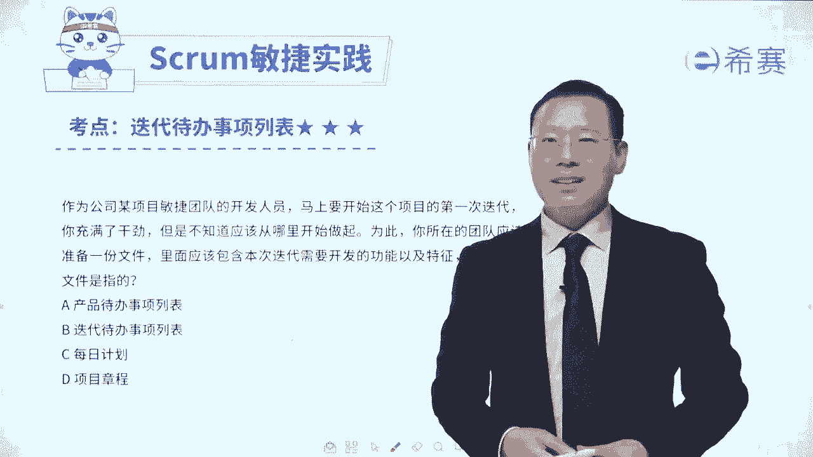
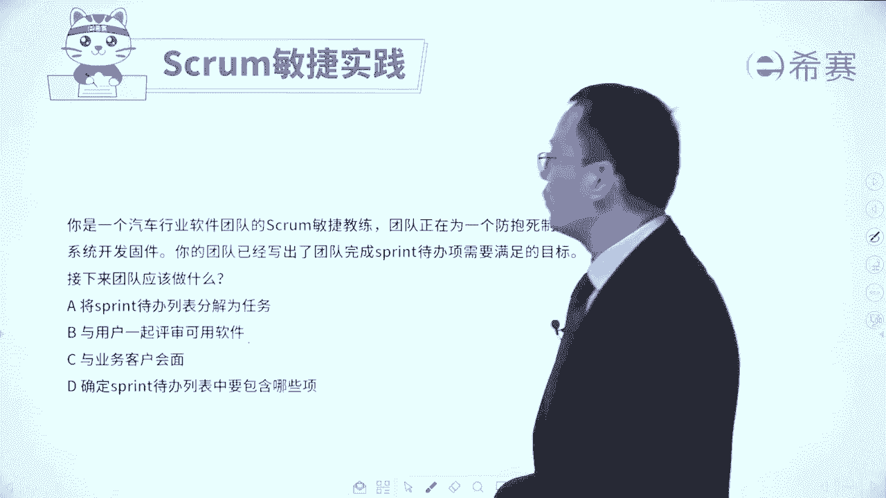
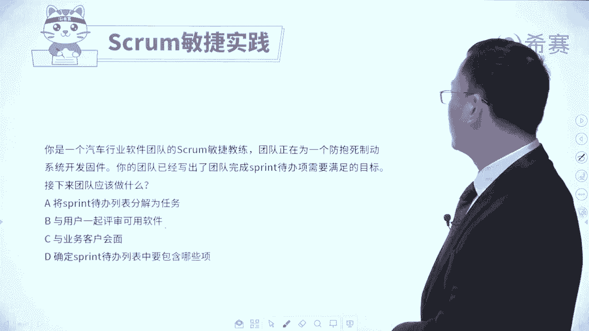
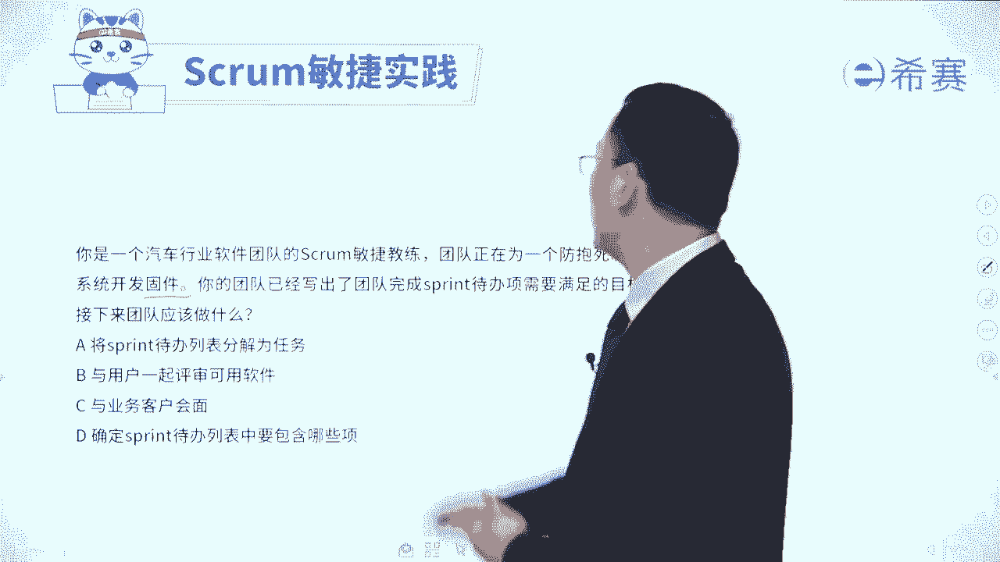
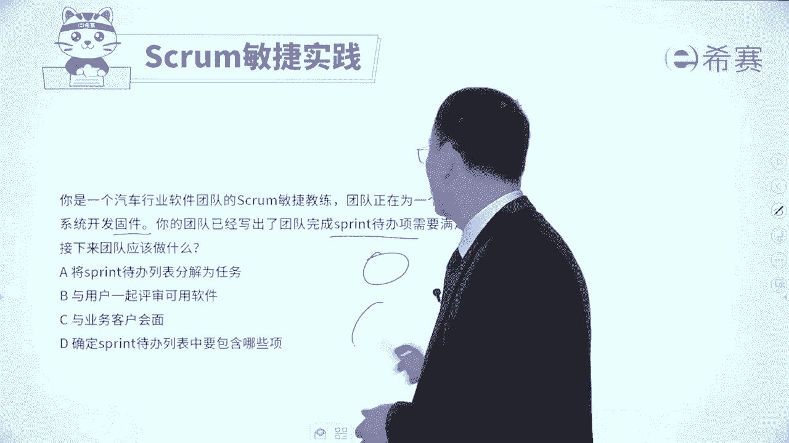
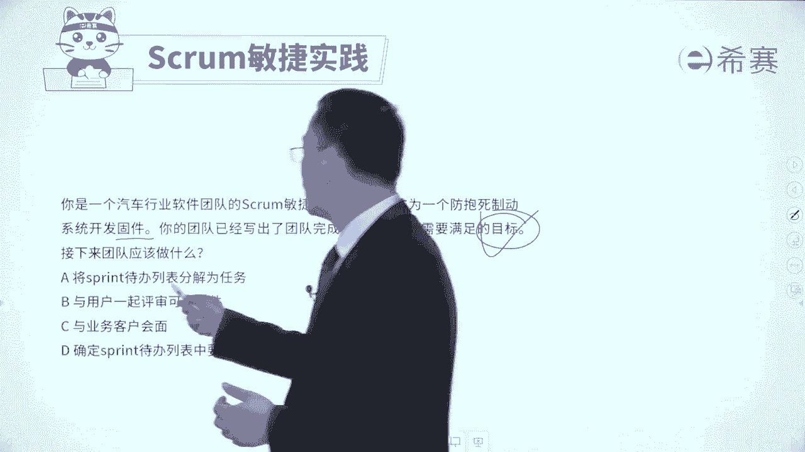
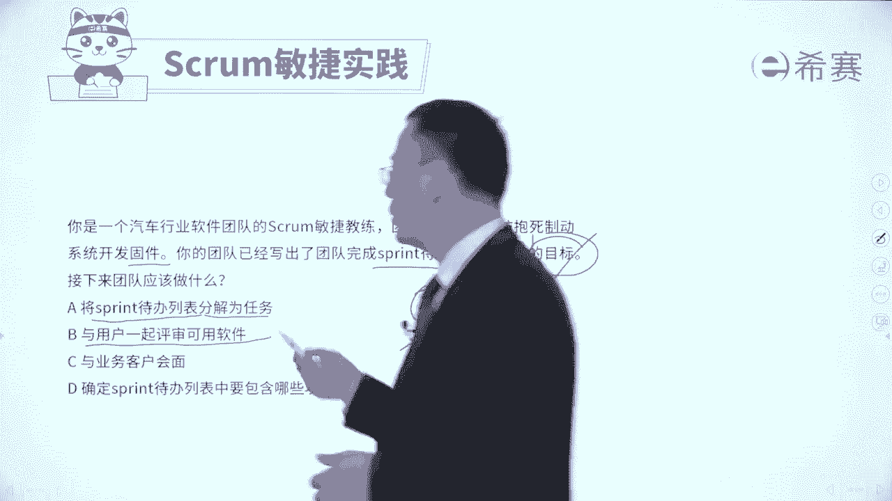

# 【最新零基础】2024年PMP认证考试课程-敏捷项目管理 - P34：34迭代待办事项列表习题讲解 - PMP项目管理 - BV11ce6ePEin

大家好，我们接下来呢通过几道题目，来对于迭代代办事项列表，它的这一考察方式，有一个更加清晰的认识和了解啊，都是一些很有代表性的题目啊，首先我们来看一下这样一道题目，作为公司某项目的这样一个。

敏捷团队的开发人员，马上要开始这个项目的第一次迭代，你充满了干劲，但是不知道应该从哪里开始做起，为此你所在的团队应该准备了一份文件，这份文件里面呢是包含了，本次迭代所需要开发的功能以及特性。

那么这一份文件是什么文件呢，这是一个概念性的一个说明对吧，那么这个文件呢它就是迭代待办事项列表，因为说的是本轮迭代，对不对，马上就要开启这一轮迭代，然后呢这一轮迭代中所包含的东西。

这就是迭代待办事项列表，至于其他几个选项呢，也可以稍微看一下啊，产品待办事项列表，是整个我们做这个项目所需要去做的，所有的这些信息内容都包含到里面，它是一个大的一个需求池。

而每日计划呢是计划我今天要干什么，是今天要干什么，项目章程，通常是这个还没有开展这些个具体的发布计划，之前，提前去拎出来，提前列了整个这个项目的一大的愿景啊，章程的这些内容，而至于说这个题目的这个内容。

其实就告诉你每一轮迭代它的目标是什么，然后先定好目标，然后再确定具体的这些任务项，然后定好任务项以后呢，再去做拆解，然后呢团队再去讨论，那这个就是迭代代班时间列表中的内容，好我们再来看一个题目。

你是一个汽车行业软件团队的敏捷教练，团队正在进行一个防抱死制动系统，的这样一个开发固件，你的团队已经写了一个团队完成的spring迭代，代办事项需要满足的这样一个目标。

那么接下来应该怎么办啊，这里面可能有一个陌生名词，稍微解释一下，这里有个词叫固件，你可能不知道固件是什么，但你可能听过一个词叫软件对吧，软件software呃，软件其实也就是说我们要去通过电脑的方式。

通过程序的方式来去开发了一些，这种能够运行的，在电脑上面呢，在手机上面呢，在移动终端上面可以去运行的这个东西叫软件，那固件呢你可以把它理解为就说是啊，像一个轮胎，一个方向盘啊，一个那个刹车啊。

这些东西是一个实体的东西，OK好你要去开发这个固件的时候，你的团队已经是已经写出了。

要完成这个待办事项，要满足一个目标，先给出说我们这一轮迭代要干什么事情对吧，大目标，那么接下来呢就列出具体要做哪些项，对不对，然后再来去说这一项该怎么样去分解成任务，它有个先和后，就是先有目标。

然后再有哪些项，然后呢再去分解成任务。

然后大家再认领任务，一般是这样一个逻辑，我们来看一下四个选项，A选项将迭代代帮列表分解为任务，那写首先得要有列表啊。

你要把那些要做哪些项给放进来，然后才会形成列表，形成列表以后再去做分解，所以这是下下部的事情好，第二个与用户一起去评估可用的软件，这个评估这是到了验收的时候。

到了验收的时候，这还早的很呢，这还没开始呢，第三个与业务客户来去会面，那么与业务客户会面去收集需求吗，这是更早前的事情好，第四个确定这轮迭代代办列表中要包含哪些项，所以是先有这个要做的目标。

然后再要包含哪些项，那类包含哪些项，列出来以后呢，再去把这些东西再分解成任务，分解成任务以后，大家再去认领任务，应该是这样的一个流程，所以这道题目的答案呢是选最后一个选项，也就是说整个迭代代办列表中。

它的本质是要完成的，工作项，先有目标，再有工作项，再去分解成任务，然后任务呢再去按人去认领，那这些信息都会列到这个迭代代办列表中来，好我们再来看一道题目，一个SCM团队的产品负责人。

发现利益相关者优先级有变化，他们还没有开始开发的一个可交付产品，现在呢比目前他们正在开发的一个工作，更加的重要，那么团队处理这种情况的时候，的最佳方法是什么，这个题目其实很容易选错哈，容易错在哪里呢。

就是但你一看觉得啊那个东西更重要，我是不是优先做那个东西啊，其实并没有哦，我们在敏捷中会有一个词叫专注，专注做这一轮迭代，使用原计划的事情，除非有种很紧急的情况，或者是原有的事情已经不重要了。

才另当别论，所以它只要还是重要的，我们依然要把它去完成，来看一下四个选项，选项A完成当前的这一轮迭代，并且呢在下一轮的迭代计划中来去调整，这个计划，这个肯定是可循的啊，肯定是可行的好。

第二个通过限制在制品来减少瓶颈，好像说了什么东西，好像又没有说什么东西，它跟这个题目无关，第三个立即取消当前的迭代，并且呢创建一个新的计划，来反应这个新的优先级，请注意我们在什么情况下才会去取消呢。

一定是这个东西已经证明无效了，或者是新的东西格外的紧急和重要，才会有，所以这种情况他是有有前提条件的啊，不会直接去做，所以呢这个地方是不合适的，在本题中是不合适好，最后一个开始重构代码。

以反应更新后的优先级，这个重构代码跟跟优先级有什么关系，有什么关系，你如果学过重构，你就知道完全无关啊，所以这里只有A选项可以选，那么A选项可以选，他选的原则是什么，就是一般情况下在迭代的过程中。

我们的这个迭代代办列表呢，是不会轻易的去改变，一般是优先把这个要做的事情去做完，他如果要改变，一定是有紧急的情况，或者说是现在做的事情已经不重要了，好我们再来看两个刚好是跟它相关的啊，啊某一个迭代呢。

它的这一个进行到了一半，产品负责人收到了某某开发运营的这个团队，他的这个邮件email，然后这个开发运营团队，负责部署的这个团队构建的软件，他们提醒说有一个新的政策，他要求要去安装一个脚本来做一个修改。

所有的部署中心，都必须要包含这样一个安装的脚本，那部署呢是召开迭代评审会议的必要条件，所以他重复了三句话来说明这个东西的重要性，并且是必要性，马上要去做好修改这个脚本，它会让其他的一些工作项目。

延退到这个迭代之后，那么你应该怎么办呢，啊产品负责人接下来应该怎么做，选项A与团队沟通，在迭代代办列表中增加这个脚本修改的工作，并且呢把最低优先级的工作项，移回到产品待办列表中来。

哇这一看刚好就说的非常完整，对不对，也就是说在这一轮迭代中，我把这个特别重要的东西给加进来，同时把里面相对而言，优先级最低的那个东西给置换出去，让他又回到了大的这一个，整个产品待办事项列表中来。

这不就是完美吗，哈哈这就是标准答案啊，所以这就是标准答案好，第二个，将修改脚本的工作增加到产品代办事项列表中，就是放到这个里面来，而现在是告诉你它又很紧急，又很重要，好第三个延长它的这个周期。

然后把这个东西涵盖进来，我们一般说是时间和不会轻易的去调整好，第四个安排，与这个团队经理来去进行一个面对面的会谈，关键是现在你都已经知道，他已经提醒你，又是政策啊，又是必要条件啊什么之类的。

他已经告诉你了以后，你应该是要去采取措施的，所以这个题目它就刚好是符合，当某一些特别紧急的情况，特别重要的情况发生的时候，我们是可以去把现有的迭代代办列表中，某一些东西先拿出去。

然后把这个重要东西给放进来，这是可以的，当然还有一种情况就是，当原有的故事已经无效了以后，我们也是可以把它拿出去，可以去调整这个迭代代办列表，所以答案是选A选项，我们再来看最后一个题目啊。

通过这个题目呢，就是相当于把刚刚这个内容来做一个，完整的补充，敏捷团队在一次迭代的期间，敏捷教练发现，现在开发的一项功能已经不需要了，那既然都不需要了，你再去开发，不是浪费了吗。

敏捷它也是倡导就是消除浪费啊，不要有太多浪费，那既然已经不需要了，就应该是要排除对吧，那么此时敏捷家庭应该怎么做呢，你就看一下哪一个是把他给干掉，A选项尽力找出发生这种变化的原因。

以便是不再去发生这种变化啊，这有什么用，这有什么用，第二个完成这一轮迭代，然后并且是下一轮迭代中，然后去调整优先级，那你虽然知道它没有用了，继续把它完成，这就是一种浪费，浪费你的时间好。

第三个建议团队重新去确定冲刺代办列表，冲刺这个词我们通常是把冲刺和迭代，还有spring这三个词可以混着用的啊，啊冲冲刺这个词就是迭代啊，迭代代办列表中的优先顺序，我们建议呢大家重新去确定一下。

让团队尽快去开始处理下一个最高优先级的，也就是说目前正在做的这一项呢，我们暂时就把它给犯下了，这不刚好就是符合吗，他就是符合那种，说当下的这个用户故事已经无效的情况下，我们就要去对他进行调整好了。

这就是关于整个迭代代班现象列表，我们会通过这样几道题目呢，然后帮你去巩固一下，让你更清楚的去知道哦，原来迭代代办事项列表中的东西，它是在什么时候来去敲定的，然后一般情况下我们要优先把它完成。

特殊情况下我们也是可以去做调整的，然后它里面的这些内容呢我们是先有目标，然后呢再有具体这些事项，然后再去把它拆解成任务，那关于迭代待办事项列表呢。

