# 【直播精讲课】2023年11月班PMP项目管理认证考试培训课程第七版（更适合零基础） - P1：1.项目管理概述.mp4 - PMP专家 - BV1Jm4y1g7bE

这就是首先还是非常呃非常荣幸哈，就是能够带咱们10月份的这个班的学员，因为呢嗯我自己呢，我不仅是一个项目管理的老师哈，因为我平时是做项目管理咨询的，所以呢我对项目管理这个专业，是有他的热爱在里边。

所以呢看着这么多的小伙伴，这么多伙伴嗯都在学习项目管理的路上，或者是呢在日常的工作中，正在使用项目管理的这种方法，去实践自己工作当中的项目，我觉得都是嗯比较欣慰的啊，所以说非常高兴认识大家呃。

那既然很高兴认识大家呢，我也做一个简单的一个自我介绍吧，就是嗯我呢是就是项目管理的培训，然后呢，企业的项目管理的类型和个人的项目管理的，实践的啊，这种一对一的辅导多做嗯，自己做的项目比较多的呢。

是更加的偏向于政府的投资类的项目，所以呢如果我们的小伙伴哈，嗯你们可能我了解一下，你们是不是都是一般可能IT行业的比较多，因为目前在我们国内呢可能考p mp证书的嗯，就是IT行业的会多一点。

然后其次的话是制造业会比较多一点哈，这个是非常正常的一些现象，但其实现在呢我们PMP的这个证书，其实在金融业，然后在一些其他的各行各业，应用的都还比较多了哈，只是说那以it和制造业更加为主一点点。

这个是说在前面的那大家我再讲一点点，这个是说在前面的那大家我在讲课的时候呢，如果大家有什么样的一些问题嗯，可以随时在我们的评论区去敲啊，我讲课的时候，我如果看到了，我会及时跟大家去解答的。

那么既然大家去学这样的，项目管理的一个课程啊，我们考到证书啊，肯定是第一个我们要达到的一个目标，其次呢更重要的哈，我是觉得通过咱们系统的学习，这样的一门课程嗯，还远远不够。

如果说你想在项目管理的这个领域，把自己的项目真的是管的比较好，真的是能够希望我们所学的知识，对我们日常的工作有一些帮助的话，那么在学习的过程当中就要多多的去思考，思考什么东西呢。

思考我们讲的这些理论的知识点，跟我们实际的工作是有哪些结合点，是怎么去把它观念起来的哈，这个学的过程当中要举一反三，如果你觉得想不明白的，那没有关系啊，因为我们是直播的课程。

直播的课程对比录播的课程它的好处就是直播，因为咱们相当于是虽然说是在线上，但是呢咱们也能够实现实时的去啊对话，文字对话嘛对吧，可以实现这样的一个信息的实时的交流哈。

所以呢希望大家能够利用好这样的一些机会啊，多问，包括呢我们平时在群里边啊，大家不是都有一个啊群吗，钉钉群也有微信群，也有在群里面遇到一些问题，也可以随时的去啊咨询啊，或者去讨论都可以哈。

我们既然学叫真正的是把这个学到位啊，O那我们这次考试呢，它是一个PMP的一个认证的考试，这个教材呢就是我的课件哈，是根据我们的三本教材来的，第一本教材呢就是还是我们传统的这个，pm book的第六版。

然后第二本教材呢是我们PMBOK第七版，然后第三本呢是我们的敏捷实践指南，这三本教材呢都非常的重要，那么有人就会问，那需不需要三本教材都买来看呢，我个人的意思啊，我个人的意见是，如果你时间比较紧张。

那么你先听我去讲课，先听我去讲课，同时呢我们的讲义也会发给到大家，通过讲义和课程啊，平时如果说不懂的，咱们在随时交流，或者自己在网上也会看到一些相应的一些，知识点嗯，如果你为了考试的话。

这样是够了还是够了，是不是买不买教材呢，我觉得看个人的序号，有些人如果说你的习惯，你的学习习惯是一定啊，比较习惯那种看书做笔记的那种的话，你去买也行哈，你去买也行，但是呢买了之后。

你前提是你的时间还比较充裕啊，为什么呢，因为我们偏不可第六版的教材有700多页，第七版的教材都有300多页，敏捷实践呢也有300多页，也就是说它加在一起有1400页左右，这1400作业你能不能看完啊。

这个我觉得是打一个问号的，打一个问号，当然考完了之后呢，如果说你觉得啊你还想根据教材啊，对着教材去再深挖一下，那我是觉得可以买，但如果说考前你的时间比较紧张，我觉得还是以课程和教育为主，好不好。

这是之前大家比较关心的一些问题哈，那OK我们就正式开始今天晚上的一个授课吧。

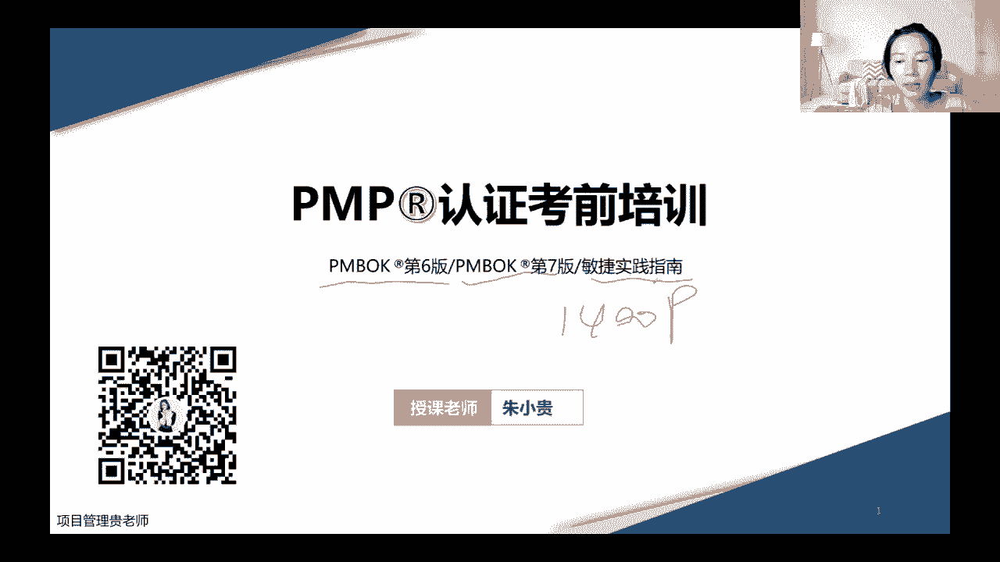

嗯整个我们教材的这个课件应该是800多页哈，800多页，然后模块呢分了五个大的模块，为什么是这样给大家分模块，因为大家如果说去事先咨询过不同的，PMP的培训机构的话，嗯如果你们有试听他们的课程的话。

就会发现嗯，目前呢市场上的机构哈，大概会分为这么几种情况，讲课的这个结构我跟大家说一下哈，第一种结构呢是因为我们原来考的，它的主要的教材是pm不一六版加上敏捷，是从去年啊，是从去年。

但是呢从去年6月份之后啊，有一些七版的内容啊增加进来，增加到我们的新的考纲之后，那么不同的机构呢，整体据我了解哈啊，不同的讲师他的课件的结构是没有变的，还是还是这两种啊，第一个是五大过程组。

第二个是指的十大知识领域，但是呢会在里面加入一点点，七版的一个内容在里边，那这是结构没有变，但是在今年上半年呢，当啊官方通知了，我们从8月份的考试要融入第七版的教材，从这个之后呢。

那么啊不同的讲师呢对课件有一些更新，但是呢大部分哈大部分仍然是沿用这两种结构，为什么呢，因为考纲去年变了之后，今年他只是教材参考教材更新了，但是考纲仍然是去年更新的这个教材，考纲没有变。

那我们说哈我们这样的培训课程，主要还是围绕我们的考纲哈，第一目标是为了让大家顺利的，拿到我们PMP的证书，所以呢大部分的机构，它的课程的结构是没有变的，还是没有变的，少部分呢它是变了啊。

比如说贵老师的这个课件，我给大家讲的课件是按照我们七版的这个模块，七版的结构来给大家去做这样的一个授课，但是呢七版的结构里边儿，仍然融入了我们，第六版和敏捷实践指南的内容哈，所以课件的结构更新了。

但是呢课程的内容哈包括了第六版，第七版和敏捷实践指南哈，这个是跟大家说明一下，因为上一期的小伙伴呢就有人问到，还说呃，我们学的龟老师讲的教的是第七版的内容，那我们考试的时候还要不要学第六版的内容呢。

啊我只能告诉大家哈，我的教材里面已经包含了第六版的内容，不用大家再单独的去学习第六版的内容哈，说清楚了哈，那为什么是以这样的一个结构呢，要跟大家解释一下，第一呢是官方他已经通知了哈。

我们要8月份的考试要启用第七版的一个教材，这是第一个原因，然后第二个原因呢是第七版的教材，它更偏重于我们的项目管理的原则指导方向，它的适用性会更强啊，会更强，为什么他更强呢，回头跟大家讲啊，讲他的原则。

讲他的绩效率的时候，大家都会明白哈，他是能够把第六版和敏捷时间指南的内容，把它高度融合在内的，但是哈我们不能只学第七版，为什么呢，因为它只是原则和方向上面的指导性的内容。

我们仍然要学习第六版的具体的工具呀，啊技术呀啊方法呀，包括我们敏捷实践指南的这具体的操作守则啊，OK那第七版的结构它是什么样子的呢，啊首先啊我给大家去，第一个模块是项目管理的概述，项目的管理的概述呢。

今天晚上的课程内容就会讲到，主要是教大家去正确的认识什么是项目啊，项目有哪些定义，那有人可能会觉得项目还不简单，我们公司里天天做了很多的项目，对不对啊，是没错，是这样子的。

这个项目呢它从理论上面是有它自己的定义，但是呢嗯一会讲到的时候啊，我会具体的讲，但是呢我也更希望大家能够自己去，给自己的生活和工作当中找一些项目哈，找一些项目项目是由我们自己来定义的哈。

那么第二个模块呢我会跟大家去啊，讲一讲项目管理的原则，项目管理的原则呢，是我们第七版里面新加的一些内容哈，这个内容为什么要跟大家讲，其实考试呢你说他会不会考哎呀，项目管理的12大原则是什么呀。

他不会这么考啊，他不会这么考，嗯因为我们PMP的考试题呢，它都是都是场景题哈，告诉你不同的项目遇到了什么样的场景，什么问题啊，那我们正确的处理方式应该是选择哪一个选项，都是这种类型哈，他不会说哎呀。

12大原则是具体哪12大原则啊，不会考的这么死板哈，但是为什么要讲呢，是因为这个对我们实际的项目有，非常啊强的一个方向性的指导意义哈，因为它是原则，知道了这些原则，我们就知道我们在做项目的时候。

我们应该遵循怎样的价值观的哈，那么第三个模块呢是项目的八大绩效域啊，在第七版的教材里面，他用八大绩效域的这样的啊，专业的术语，在解释我们项目所涉及到的这些专业的内容哈，这些聚效应里面呢。

会包括我们传统的这种项目的十大知识领域啊，啊就是刚刚提到的这些，也会包括我们敏捷当中的一些内容哈，这个呢嗯是跨的周期是最长的，涉及的内容也是最多的哈，也是我们考试的一个核心的一个内容之一哈。

那么第四个模块呢会告诉大家啊，不同的项目他怎么去裁剪，因为每一个项目它的嗯它有它的独特性，它的目标啊，设计的这个人员范围成本都是不一样的，类型也不是一样的行业，这些都不一样，对不对。

所以呢不同的项目它嗯用到的方法，涉及到的过程，那肯定也是不一样的，我们怎么去裁剪，怎么样去选择我们适合我们项目本身的，它的一些方法啊，这个是第四个模块，那第五个模块呢是帮大家在嗯总结提炼一下。

我们项目管理的整个知识领域当中涉及到的啊，一种通用的模型，涉及到的一些管理的方法，和具体的这种工具技术，以及项目管理的一些弓箭啊，弓箭就是一些啊，咱们可以简单理解成项目的文件啊。

这是怎样整个这样大的这五个模块啊，这样的话大家就对整个我们教材啊啊，这一期的这个课程有这么多次课，那么每次课哈大概它的结构逻辑是什么样子，心里面就有个底了哈，好进入到我们项目的管理概述哈。

他的一个目的就是让大家认识，正确的认识项目管理，所以今天晚上的课程内容呢。

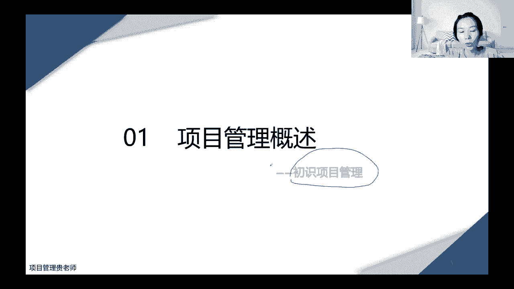

应该会比较轻松一点，比较轻松一点，首先讲一下项目管理的起源和发展哈，嗯我给大家列了四个比较通用的，项目管理的一些经典的一些案例哈，这个都是国际商品啊，被诟病的，也是我们整个嗯项目管理的这个领域啊。

一直拿来作为嗯歌颂的，这样的一个非常经典的一些案例哈，首先是吉萨金字塔啊，包括这个登陆月球哈，包括这个中国长城哈，包括喷气式的飞机，你看这些项目哈都是跨周期特别长，投资特别高，涉及的人员啊特别多。

然后呢他们都有一个共同点，他们的共同点是什么呢，他们发生的他们做这个项目的日期都比较早，很早很早早到，我们还没有我们早到还没有我们出生啊，那为什么这些能够成为经典呢，大家都知道。

因为在那个时候还没有系统的项目管理的，这一门学科，也就是说那个时候的人啊，嗯你你像比如说金字塔和那个登陆月球，可能大家觉得这是国外的案例不太熟悉，但是呢中国的万里长城啊，肯定大家都知道，对不对。

修建长城的时候，那都是人一个一个把石头背上去的哈，那么长啊，那么长那么高，涉及的人那么多，而且呢又是在那么早的啊，古代他们没有这么系统的学科，那这么庞大的复杂的项目是怎么完成的呢，啊可想而知。

第一个呢是人类肯定是有他的智慧的，第二个呢他的管理者哈，就是古代的管理者也是有他的一套逻辑啊，也是有他的一些系统性的一些思维在你的，要不然跨周期这么长，跨地域这么广啊，跨人员这么复杂。

他怎么能够把这个长城做到啊，美食里啊，一吨啊，每百米你什么啊，每每这个呃每万年一什么，他怎么能够做到这样的一个程度，对不对，他做不到的啊，那说明他也是有一种系统管理的思维在里边。

那系统管理的思维呢就是我们整个项目管理的，他的一个精髓哈，从那个时候也就是说从那个时候，虽然我们的学科发展还没有这么完全，但是呢它的根基啊，它的根源啊，它的基因它已经存在了哈，所以呢这个也是跟大家去啊。

这个觉得比较幸运的一点哈，幸运的是什么呢，幸运的是我们现在啊，如果说你比如说啊，你想系统的学习项目管理啊，啊没问题，对不对，我们有这么多的项目管理的一些教材呀，书籍呀，啊，还有嗯。

国内也有这么多的一些这个培训的机构啊，可以给大家提供系统性的一些辅导，对不对，那你要像在我们嗯上面所举的，这些案例的这个时代，那是没有这些系统性的指导的，那怎么办，没办法，对不对，凉拌啊。

只能靠自己去摸索，所以呢我们要珍惜哈，我们要珍惜我们现在所处的知识的获取，这么便捷啊，这么便捷的一个时代，大家交流也这么方便，这样的一个这样的一个机会哈，啊当然这个机会呢大家可能会说。

这机会是我花钱买来的，没错哈，但既然花钱了，那就牢牢记住，花了钱要让这个钱花的物有所值，对不对啊，要花了钱要学到真的东西，嗯管理的理论哈，既然提到项目管理，它是一门系统的学科哈。

你跟大家系统的说一说项目管理啊，它到底是属于我们管理的哪一个细分领域啊，它是怎么来的，这个要跟大家讲哈，因为这个呢，嗯一般可能，如果你们试听过其他机构的培训课哈，他可能讲P的时候。

他不会跟你讲这么系统的这个管理的一些企业，因为这个确实是属于管理的这个大的范畴了，但是呢我个人觉得哈，我个人觉得既然我们学的是项目管理，项目管理也是管理的一个啊细分领域之一，他跟管理是是脱不了干系的。

既然你在从事管理，对不对，你在做项目管理，那么我们对管理哈，就要有一个比较基本的一个认知，要知道它是从哪里来的啊，他是归位在哪里的，它的落脚点要是在哪里哈，呃首先呢啊最早的我们提到管理啊。

就是肯定是我们古典管理理论啊，古典管理理论与我们的这个亨利法约尔，以他为主，他当时呢就提到了我们管理的五个要素，计划组织指挥协调控制，也就是说管理要做什么事呢，管理要做计划，管理要组织人管。

你要指挥人干活，管理还要协调人跟人之间的管理，管理还要控制人跟我们的事件啊，跟我们的事情跟我们做的不同的内容，工种之间的一些控制的一些关系哈，这是最早的一些管理的一些思想，当然古典管理理论呢它更重要的。

它是为什么会有这样的一个起源呢，因为当时哈当时呢大家就会发现诶，他们这些科学家比较爱研究的人，就去工厂去发现发现这个工人哈，不同的工人他去生产出一个弓箭，他所花的时间那是不一样的。

诶他会觉得诶就比较有意思哈，我们这些大科学家，大管理学家，他们就会研究这些，就觉得诶那是不是比如说我生产一个螺丝钉啊，那十个工人每个人花的时间都不一样，不应该呀，对不对，为什么不应该呢。

因为我们生产一个螺丝钉，螺丝钉生产出来是一样的呀，那生产一个螺丝钉，它先干什么后干什么啊，他的这个在车间要完成的所有的工序，它应该是一样的呀，对不对，一样的东西一样的过程。

它才能够产生我们一样的型号的啊，一样大小的这样的一个螺丝钉啊，那为什么不同的人，他做出来他的动作啊有那么多，导致时间控制的也那么多呢，因为有了这样的一个思考之后呢，唉他们就发现啊。

确实我们可以去把一些把一些这个零件，它的一些生产工具去把它标准化啊，比如说你先做车工啊，先做他的这个车工，车工车几下啊，每一下几秒钟啊，他的这个定型定型多长时间精确到秒，然后呢跟他们的工人培训。

培训的时候告诉他们的工人啊，你们按照我们的标准的程序来，一个动作都不要多啊，不要按照你们原来的计件工资一样，你反正一天啊你能做100个，那就发100个的钱，你能做80个，那就方案80个的钱，不这样了。

你严格按照我标准的这种工序来啊，多余的动作，不要有多余的一秒钟，不要去花，不要去花这个时间，先从标准的这个工序上面，给大家去做了一些定义，这个是我们古典管理理论的一些精髓啊，精髓就是这样定事。

把事先标准化，那么古典的管理理论啊，慢慢的过渡过渡，用了很长时间，过渡到了行为的管理人呢，那什么是行为的管理人呢，啊我跟大家简化一下它的核心哈，它的核心是诶，这个时候我们的管理学渣啊。

他又去研究啊啊又去研究什么呢，又去研究同样的一个工具啊，生产不出来的时候，我的工序都已经标准化了呀，不同的人都按照我标准的工序去做了，那为什么还是有人做的多，有人做的少呢，甚至同一个人他今天做的多啊。

他明天他就做的少，这是为什么呢，他们就去研究哦，研究一发现，原来我们的这些弓箭生产还跟人的情绪，跟人的状态，跟人的身体条件，跟人和周围的这些环境都是有关系的，对不对，那嗯这个时候呢。

就过渡到了一些行为的一些管理员，也就是说我们的事儿标准化之后，也跟人的心理跟人的行为有关哈，这个时期呢啊就诞生了一些各种学派，是行为管理学派，那么再过渡过渡到一些现代管理的一些理，论的一些学派。

那么现代管理理论的一些学派呢，就是以我们的这个德鲁克为主哈，他强调的就是我们在管理一个项目，或者管理到具体的一个工作的过程当中，这个项目所涉及到的工序啊，事件和我们的人啊。

包括我们用到的一些系统和一些工具，他们是需要协调的，他们是需要共同的组成一个系统，然后来管理的啊，所以呢这是三大管理的一些这个啊，这个学派和或者说我们说三大管理的，这个理论哈。

它的一个过渡的一个周期和过渡，为什么会产生这样的过渡的一个原理哈，这个我用的非常嗯简单的一些案例啊，帮大家串了一下，这样的话大家都能够知道诶，我们这早说哎，有的时候可能没有什么管理呀，对不对。

没有什么管理，那为什么到现在的时候管理啊，他是一个这么涵盖领域这么广啊，甚至呢还有这么细分的项目管理，企业管理呀，经营管理经营管理啊，对不对，还有这么多细分的领域，为什么会有这样的一个发展啊。

这是整个这样的一个过程，OK那么不同的时期呢，他的管理学家啊，用一些代表合理法约尔啊，这个甘特发发明我们甘特图的，还有我们的这个泰勒，他就是具体我们管理要科学化，标准化，把所有的这个工具都要定时定量。

这是一些代表性的一些管理学家哈，那么到行为管理理论呢，既然我们说了啊，我们做一些事情，他还跟人的行为有关，那跟人的行为有关呢，那控制人的行为啊，又会有一些不同的一些代表的一些啊，这个管理学家啊。

比如说他们的代表啊，马斯洛需求啊，啊相信大家都听过哈马斯洛需求啊，双因素理论啊，XY理论呢，还有期望理论啊等等啊，这些管理学家呢，就是在我们行为管理的这个大的十级哈，诞生出来的。

当然我以我们的这个梅奥为核心哈，这些管理学家嗯，这个就是行为管理理论呢就比较重要哈，为因为什么呢，因为他啊我们在讲课的过程当中，后面讲团队绩效益的时候，也会一一的跟大家去讲这些不同的，这些经历的理论哈。

它都是一些经验的理论，为什么要讲经历的理论呢，因为我们管项目不是只管事啊，对不对，我们还非常重要的是要去管人啊，不能说管人，应该说领导人对不对，影响人，我们既然要影响人，那我们就要知道怎么去影响到他们。

愿意帮我们一起，或者愿意跟我们合作，做好眼前的事，做好这个项目，做好手头上的工作，对不对，那既然需要引导他们，需要引导他们，那必要的人的行为的一些啊，激励的理论我们就必须要去了解哈，必须要去了解。

那么这个在后续会讲到哈，今天只是先告诉大家啊。

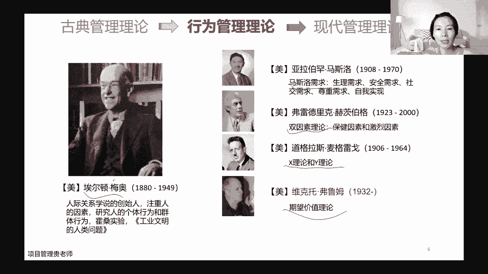

先告诉大家，行为管理理论里面会有哪些知识点哈，那么过渡到现代管理理论呢，唉刚刚说到了我们的代表就是德鲁克，德鲁克有一本书叫做卓有成效的管理者，嗯也许有人不知道德鲁克。

但是呢不允许有人不知道卓有成效的管理者哈，最有成效的管理者，这本书啊推荐大家都去看一看，都去看一看，那么以德鲁克为代表的呢，啊就是过渡到了我们这个现代管理人，还是以他为代表，他重视的就是整体。

就是系统的整体，哪些证据呢，我们的工具，我们的人要系统的去协调，那么在现代管理理论呢，又诞生了非常多的一些学派哈，经验主义喽，人际关系呀，社会系统呀啊管理科学呀，还有全面理论啊，决策理论啊，系统啊。

这个管理啊，还有经营管理啊等等之类，包括更细节的质量管理啊，战略管理啊，学习组织啊等等哈，那么管理理论啊，这个项目管理是处在哪呢，它是属于我们的科学管理啊，他在这个学派里面。

他是在这个学派里面的一个细分的一个分支哈，那么它注重的也是我们整个项目的系统啊，系统的协调工具和人哈，所以呢项目管理啊从小来说，它是针对我们具体项目的管理，从大而言，他啊可以把前面的项目打个引号哈。

为什么可以打个引号呢，也就是说你把它去掉，你把它去掉，你说你做的是管理也是OK的，也是认可的，为什么呢，因为生活工作当中处处都是项目，处处都是项目嗯，这个会跟大家去讲的哈。

虽然说项目会有一些标准的一些定义哈，定义呢等会儿今天晚上会跟大家讲到，但是呢我更希望大家自己去给自己，定义一些项目哈，自己根据自己对项目的理解去定义项目，并且呢去尝试用我们学到的这些理论的知识。

去运用在我们的实践当中哈，所以呢如果你现在没有在从事项目管理工作的，这些小伙伴啊，不要担心啊，不要觉得啊，郭老师，我现在没有做项目管理啊，啊或者我还不是项目经理啊，那我学这个。

我是不是就感觉就是脱离了实际在学呢，不是的，不是的，为什么呢，因为你可以找你出去旅行，你装修房子啊，你谈个恋爱啊，你或者说你请客户去吃个饭啊，这种小的都可以把它当做一个项目，或者你给领导写一个报告啊。

都是一个项目，所以千万不要有人告诉我说哎呀我没有，我没法联系实际，因为我没有做项目管理，千万不要出现这样的话，千万不要出现这样的话，那么既然我们做哈做的项目管理啊，做的是这样的一个这个岗位。

学的是项目管理这样的一个课程啊，对峙的一个目标呢，对此的一个期望的是成为一个优秀的管理者，那么啊这个桌游存在管理者，大家这个书去看看呗，虽然说教材不推荐大家现在去买了看啊，因为担心大家找不到重点。

耽误太多时间，影响到我们备考，但是呢卓有成效的管理者，这本书是推荐大家去看看的哈，这本书里面就系统的去跟大家去讲了，唉，自我管理他到底应该管哪些东西啊，应该怎么样对自己也有要求，怎么样做好时间管理啊。

怎么样去成为一个卓有成效的，这样的一个管理者，那你说项目经理，他是不是一个卓有成效的管理者呀，他不一定不一定现在是卓有成效，但是呢啊他一定是一个管理者，他一定是一个管理者，至于你是卓有成效啊。

还是尚没有成交，那就要看你自己的学习能力，悟性和实际的应用能力了哈。

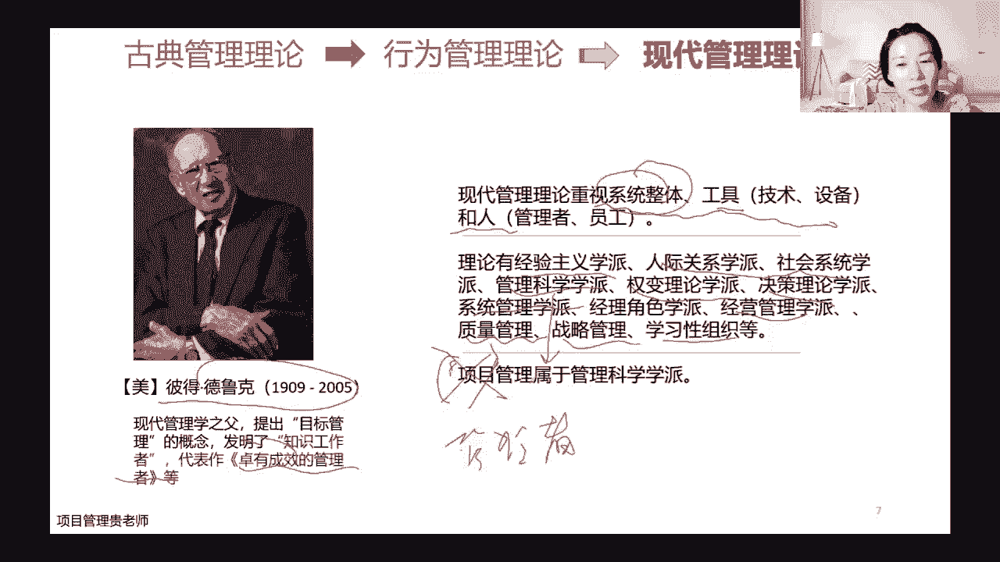

项目管理它的一个回归到它具体的哈，这个时候我们就不讲FN的项目管理，而是讲具体的这个项目管理这门学科哈，这个学科呢它也是有它的一个啊起源和发展的，任何学科都有它的一个起源。

发展不是说一开始最早好几百年前啊，甚至我们在这个中国古代都有项目管理，这门学科，刚刚讲过了，不是这样的，对不对，好不，那既然不是这样的，他就会得到他自己的一个发展啊，从什么时候开始呢。

从20世纪90年代开始，也就是从1910年开始，那个时候呢啊会有一些关键路径法，那会有一些干的图，那会有这样的一些简单的啊，非常简陋得这样的一些工具在用，这样的一些思维在用哈。

只不过我们现在回过头去看哦，原来那个时候他是有项目管理的一些啊，一些起源啊，一些雏形，但是在那个时候他们还不知道啊，在那个时候的人他们还不知道，这就叫项目管理，他们只是觉得诶，我干的图。

我用起来好像比较能够，便于我把手头上的这个事儿做好啊，他们只是有那样的一个基础的一个认知，到了30年代呢，唉美国的一些航空业啊，他开始他们在做一些非常大的一些项目啊，航空业坐飞机啊。

他们在做飞机的研制的时候，做一个飞机非常复杂非常复杂啊，那么需要专门安排一个部门啊，专门安排一个部门来配合，来配合飞机的研制的整个过程，那这个部门呢叫什么部门呢，哎他们就给它起了个名字。

模组出来一个名字哈，叫项目办公室，在项目管理办公室，也就是我们啊过渡到现代项目管理的办公室哈，那个时候项目管理项目办公室啊干什么的啊，就是专门来协调啊，来控制整个飞机它的一个研制的一个过程。

来帮助他们协调资源，来帮助他们啊，去协调人和人之间的沟通啊，事与事之间的一些安排，同时呢在那个时候啊，美国工程行业啊也出现了一个职位，这个职位啊，我们光有部这个部门不行啊，对不对，这个部门得有人来干呢。

谁来干呢，他们创造了一个词叫做项目工程师，他们用项目工程师呢来去协调和监控，需要做工程的这些各个部门，那这个工程师呢大家显而易见哈，工作到我们现在当然就是我们的项目经理了，当然现在就是我们项目经理。

但是那个时候啊，那个时候呢他们还不叫项目经理，还没有这个词，直到50年代哈，项目经理这个词，在哈佛商业评论里边才第一次出现哈，才第一次出现，所以呢大家知道哈，如果我们现在的伙伴有做。

你现在的职位就是项目经理的，你要知道你这个职位是从什么时候出现的哈，当然到了60年代呢啊，就开始国际上面就开始有一些，稍微系统一点的哈，系统一点的这种，专门去推广项目管理这个学科的一些组织，出现了。

以美国的项目管理协会PMI啊，这个欧洲的IPMA以这两个为核心，以这两个为主哈，在上个世纪60年代就已经出现了，这个协会干什么呢，这两个协会一个是在美国，美国宾州成立，另外一个呢是在瑞士成立哈。

这两个协会协会是干什么的，协会是负责去推广啊，去推广啊，去完善他们所推崇的这些项目管理的知识哈，当然在那个时候呢，我们中国啊你硬要纠结这个事有没有呢，也有也有一些雏形哈，没有那么完美，没有那么完善。

但是有一些雏形啊，以我们的著名的数学家华罗庚啊，以他为主，他引入了国外的网络计划，然后再开始传播，它传播的是什么呢，传播的是系统思维和统筹法，用统筹系统的思维去做我们的工程项目哈。

这个是上个世纪60年的状态，那到80年代的时候呢，哎就已经正式推出来了一个偏不OK的，偏不OK的这样的一个知识体系，这个知识体系呢是由美国的项目管理协会PMI，是由他们推出来的。

同时呢为了让这个知识体系更好的去发展，他们推行了一个认证的制度，也就是我们啊现在要考的PMP啊，这样的一个认证的制度，那到了90年代又过了十来年的发展哈，这个证书呢啊这个认证的这个制度呢。

PMP它本身啊他也做的特别好啊，他是全球第一个获得ISO9001认证的，这样的一个考试的一个体系，嗯那同时呢嗯这个中国也成立了，原来只是在传播，那么到了90年代，也正式成立了一个统筹法和经济数学研究会。

这样的一个组织啊，同时呢也有一些专业的一些项目管理的，研究的委员会，那么到我们现在呢有国家的这个相关委后面啊，相关委下面有一个具体的这种项目管理的啊，委员的这个协会哈是有这样的一个具体组织的，同时呢。

这两年嗯，我们国内也在推行自己的项目管理的体系哈，也在推进自己的项目管理体系呃，目前呢应该是也是在开始做啊，讲师的这个认证的一个培训啊，对小伙伴，对于我们这些广大从业者的一些培，训的一些体系呢也在推哈。

也在推，但是呢它的发展程度，跟我们的这个PMP来比的话，还是远远的不太够哈，远的不太够，你看包括到21世纪的时候，其实到啊2000多年的时候啊，两年两年15年的时候，其实我们啊这个人设哈。

他自己也有我们国内的项目管理的体系，叫CPMPOK哈，这是我们自己的叫做中国的项目管理，是CPMP这样的一个资格认证哈，但是呢这个资格认证说实话哈啊，发展的不是很好，发展的不是很好。

所以目前呢在国内流行的还是，主要他认的知识体系，还是PMP和IP mp这两套的知识体系哈，考试考的比较多的呢，可能就是嗯PMP比较多，当然啊有些伙伴对自己要求比较高的，也有这个啊。

pg mp和pf mp这样的一个认证的一个考试哈，但是我刚刚说的这两年啊，就是应该是从2022年开始，从2022年开始，是我们国家的这个项标委哈，自己在推再推，比较适合我们国情的这种项目管理的。

这个认证哈，嗯未来会发展的怎么样，这个我现在不好说哈，我现在不好说，所以呢无论怎么样哈，我们这个PMP他的这样的一个认证体系，在全球来说还是最有含金量的啊，至少在国内。

国内目前来说它也是非常非常有含金量的哈，所以大家不用担心哈，不用担心说哎我学了这个PMP，它是不是在国内嗯不太适用啊，或者说这个含金量是不是有所降低啊，啊因为别的这个体型也都在慢慢的成熟啊。

不要有这种担心哈，PMP他一直是都走在前沿的哈，啊这么说呢，不是说我这个崇洋媚外还没有这种想法，没有这个意思哈，是因为PMP啊，他的这一套体系呢，它之所以这么完善，是源于我们的这个美国项目管理协会。

他的啊，一些操作的一些思路和操作的一些办法哈，从我们的PMBOK这样的一个教材来说，他每4年他都必须要更新一版哈，为什么呢，因为时代在发展啊，对我们这个项目管理的这些细节的一些要求，方法工具啊。

都会有一些更新，所以呢他们的这个知识体系哈，这本教材知识体系也是每4年都会更新一版，都会更新一版，并且呢它更新的时候，它都会广泛地征集全球啊，项目管理的这样的一些比较优秀的，去融入他们那些案例啊。

去找他们比较经典的一些项目管理者，去找他们征求他们的一些意见哈，所以你看人家这个美国哈，人家确实在这套知识体系里面，他是一直抱着持续的学习，持续的成长，不断的改进，跟上需求，跟上时代。

他确确是他在这样做哈，他不仅有这样的想法，他也一直在这样做，所以呢也不怪人家这套体系发展的这么好，对不对，在全球有190多个国家都在推广p mp，都认可这套体系，对不对。

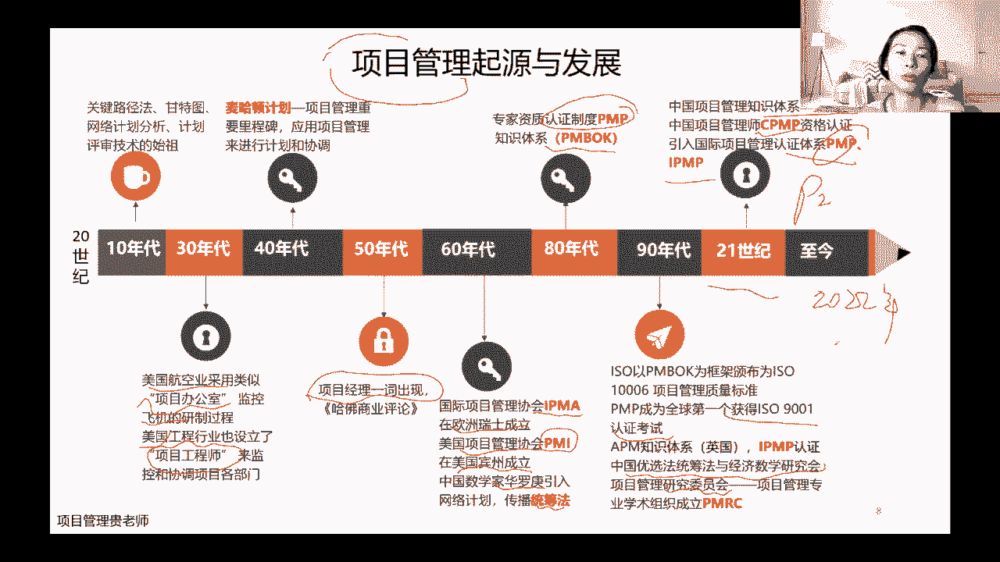

好跟大家讲一个这样的一个案例哈，这个案例呢是啊布鲁格的项目管理的一个冲击，这个冲击呢为什么会有这样的一个冲击哈，这个是我们嗯这个布鲁格项目管理，是我们国内的哈，这个三峡水利工程里边的一个项目。

为什么嗯国内啊是到这个80年代，90年代会有这样的一个意识啊，有这样的一个意识，要引入专业的系统的项目管理的体系呢，就是源于这样的一个项目，就是源于这样的一个项目带给他太大的冲击了。

这个项目呢大家感兴趣也可以自己在网上搜，在网上搜一搜哈，了解了解，那么这样的一个案例呢，它是什么意思呢，当时还是我们啊，是我们这个大的一个水利工程，它嗯要用世界银行的贷款啊。

去完成这样的一个基础的一个工程项目，其中有一个啊引水隧洞的一个工程，要进行国际招标啊，国内没有队伍，国内的这个水平不太够啊，要进行国际招标，那么进行国际招标呢啊就有一家公司就中标了。

这家公司是日本的一个公司，他中标的时候呢，大家如果说做过采购的，都知道，我们发布我们的招标文件之前都会有一个底价，对不对，自己会估算一下，对不对，估算完了之后，你大概心里就有数了，就有数了。

这个工程大概要花多少亿元啊，多少个亿，结果呢啊结果呢来了一波冲击哈，这个冲击呢是这个中标的公司，中标的公司他给的这个价格，它的投标文件当中的价格，是我们的标的的56%啊，你说一般我们做项目，他去投标。

他可能超过我们标的，可能会超过一点，对不对，但是人家不仅没有超过人家，甚至是我们自己给的这个标题的一半，当时我就惊呆了啊，当时我们这些工程的这些人啊，采购的这些人都惊呆了，只要一半的价格就能完成吗。

有这么神奇吗啊这是第一波价格的冲击，那第二波冲击是什么呢，第二波的冲击是人员的冲击，队员的冲击，签了合同之后啊，这个公司啊，这个公司叫大成公司，他要派人来都来做这个项目管理这个项目，对不对啊。

浩浩荡荡的派了多少人呢，派了30个人来，派了30个人来啊，当时又惊呆了，把我们这个工程项目组的人又惊呆了，你就30个人物，这么大的工程，你完成得了吗啊这是第二波人，第二波这个冲击，然后质疑啊，担忧啊。

结果质疑担忧当中来了，第三波冲击，第三波冲击的是这个项目的结果啊，这个什么结果呢，项目完成了，项目成功的完成了，成功的完成了，他这个造价到底多少呢，果然啊，身为标的的60%啊，跟中标价基本上哈没差太多。

工期还提前了，人家做得又快又好，而且质量还完全达到规定的要求，三波冲击一来啊，这个我们接受不引导，就发现了这个管理体系确实好，值得在我们国内推广，它是源于这样的一个冲击哈。

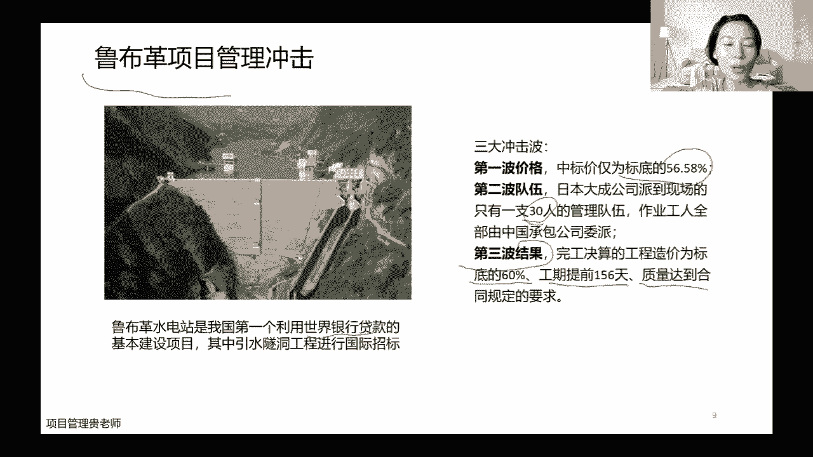

这个大家了解一下比较有意思哈，那么刚刚收到了资格认证，资格认证呢哎目前跟项目管理相关的哈，就是啊当然这个CPMP我们刚刚说了，他发展的不好，我们就不提他了哈，啊在中国反而比较有代表性的是软考。

但是软口呢它主要是这个it行业的哈，主要是软件行业里面的这个认证啊，但是呢，它不能是说我们通用的项目管理的一个认证哈，这个是这个嗯有一点区别有一点区别哈，所以呢有人问你说啊。

考了项目管理还要不要考软考啊，啊软考里面的核心啊，软考里面的这个内容，除了it领域的知识，它确实有很大一部分内容，跟我们这个PMP的这个体系里面的知识，是差不多的哈，但是呢它的适用性没有那么强哈。

它适用的更多的是我们的软件行业，it行业，那么社会性更广的呢还是我们的PMP，还是我们PMPPMP呢，啊，当然理所应当是目前全球项目管理领域，含金量最高的一个认证考试哈，这个考试呢每年有四次哈。

分别是5月份，3月份，5月份，8月份和11月份分别是这样四次考试哈，那么除了这两个之外呢，还有一个英国的项目管理的一个这个认证，它叫prince two p two。

同时呢还有啊这个国际上面还有一个IPMP，IPMP呢，它是按照我们的不同的项目管理的专业能力，给大家分一个等级哈啊用的比较多，考证考证，考的比较多的，还是这个美国的体系和这个英国的这两套体系。

这两套体系也有一些区别，PMP呢它更加的侧重于理论的知识体系，系统的知识体系的学习，而P2呢啊他更加的注重于是案例的实际，案例的实践哈，案例的实践，所以P2的考试呢他更多的是给你几个案例啊。

让你根据案例去啊实操啊，去选择不同的一些选项，不同的一些答案，而PMP呢所有的它也都是一些啊，这个他也是选择题哈，但是呢它是每个选项都有不同的一些场景，它两个有一些侧重啊，有一些不同的侧重点。

一个偏理论一点点，一个偏实操一点点，那当然我们说这个呢只能说只能这么说，为什么呢，因为他都是考试，对不对，既然是考试，那它一定都是整体而言都是偏理论的。

本身整体而言都是偏理论的，好这个认证啊，这个认证呢其实在国际上它跟这个NBA啊，MPA啊，其实是齐名的哈，被誉为全球的三大管理证书之一哈，嗯在国内呢，可能就是我不知道你们是抱着什么样的心态。

去考这样的一个认证哈，但这个认证呢其实在国外它是嗯含金量是，就是大家对他的认可度是更高的哈，啊你在美国的时候啊，你一个博士他会说我是一个PMP，然后我是一个多功能。

他会认为我是一个我首先是一个项目管理专家，然后我还是一个博士，他把项目管理的认证啊，是把这一套是放在博士的这个啊，学位学历的之前的，但是在国内，在国内，大家对PMP的这个认知度，可能没有国外啊这么高哈。

但在国外是非常的认可他的啊，那么在国内的这个片尾考了有什么用呢，刚刚说了，既然适用于这么多的行业，对不对啊，生这么多行业，你要转岗做，你要从做技术，要做转岗管理的啊，包括目前已经在做项目经理的啊。

你项目管理办公室的人员啊，或者是项目一般的参与项目的人员啊，或者是这个普通的这个管理岗位，或者是高层管理岗位啊，这些你都可以去学一学项目管理哈，那么这个项目管理呢，他的薪资哈跟大家截取的啊。

有网上给大家截取的，这个是截止到去年年底哈，杭州的项目管理的工资收入，平均每个月是20K到30K哈，每个月拿到3万块钱啊，那这个薪资高不高呢，这个薪资哈只是一个平均工资，有有比他高的。

当然也有比他低的哈，这个根据不同的行业啊，不同人的这个经验，不同人的他的一个项目的一个资历来看啊，他都会上上下下都会有浮动啊，这个很正常啊，高的56万的都有低，等于说现在才1万块钱的，也是当项目经理。

这个也有哈，比比皆是，没关系没关系，大家要知道哈，就是呃偏A呢他有一个报告哈，这个报告的这项目管理人才缺口报告，这个报告就提到了，说到2030年的时候呢，全球每年都需要230万名，项目管理的专业人员。

其中中国要超过一半哈，要超过一半，也就是说他至少中国他每年哈，这是每年伙伴们，这不是一共哈，这是每年每年需要至少需要120万人的，这样的一个专业的项目管理的，这样的一个从业者，那目前有多少呢。

目前持有证书，从证书的持有人员来看，目前国内持有PMP证书的人，应该只有46万，这还不是每年哦，伙伴们啊，这是一共一共目前持证的人员只有46万，也就是说项目管理哈，这个缺口它一定是大大的存在。

一定是大大的有的哈，一定是大大有的，所以啊伙伴们，你们啊就是学了项目管理要去用啊，要去用，为什么要去用，因为国家需要你们社会需要你们行业需要你们，对不对，缺不需要你们，你们的工资，也需要你们。

对你们的家人也需要你们，是不是，所以啊抱着一个良好的心态去学习，去认真地对待我们，接下来要学的这样一个系统的认证和，认证背后的这样一套的体系哈，这样一套体系，那前面说到了啊，这个数据还挺新的。

这个数据就是哦截止到今年2月份的，中国大陆超过了46万人，全球有多少人呢，全球有147万人啊，全球这个全球刚刚说了，还有190个国家，你看中国人口多旺盛，190个国家都在推广PMP的认证体系。

都在认可他这套体系啊，190个国家一共是147万人，中国大陆就承担了他的一个零头，一个国家承担他一个零头，所以哈国内虽然说有这么大的缺口，但是呢大家也不要洋洋得意，为什么呢。

因为因为中国大陆的人口太多了太多了，竞争也是有的哈，也是有的，不要掉以轻心，那目前呢从考证的人员来看，以北京上海深圳广州，包括我们这个啊南京啊，西部的成都，中部的武汉啊，以这些地方为主。

偏僻的报考人数是最多的，所以大家发现一个，就是从这些地域的分布上来看哈，有没有发现一个特点，这个特点是什么呢，PMP学PMP的人员嗯，他的对PV的一个热衷的程度。

是不是跟我们的经济程度基本上也是相关的哈，如果我跟他，我把前面这句话去掉啊，我不给大家看前面这句话，我跟大家说，哎呀这个现在这个人均GDP啊啊是是这样的，北京上海深圳广州杭州南京成都等等，我这样一排。

我说这是这个GDP，大家信不信，大家可能也觉得是对不对，所以这说明了什么数据说明什么数据说明啊，我们项目管理，他给我们的经济发展，根本的经济发展是挂钩的哈，我不能说成线性关系。

但是我能说他一定是挂钩的啊，一定是挂钩的，为什么一定是挂钩的哈，因为经济的发展来自于什么，来源于产业的发展，产业的话，产业的爆发，产业从哪里来啊，产业产值是企业提供的，对不对，企业的价值。

企业的利益从哪里实现，企业是从组织的战略，和项目啊，是从企业的组织的战略和项目当中来的，而项目啊你做项目管理做得好，你做管理做得好，那你的项目的目标啊，它自然项目成功的概率就大，项目目标完成的啊。

他的这个好又快又好的，这个程度就高，对不对，所以他是这样关联起来的哈，那教材哈嗯教材呢刚刚提到了，我们是几乎每4年更新一次，那每4年更新一次呢，他的每个教材哈，从第六版之前。

从第六版的之前的这些教材呢啊基本上好，基本上都是围绕我们的过程组和知识领域，来的啊，到第六版的时候呢，基本上哈它的这个知识领域呃。

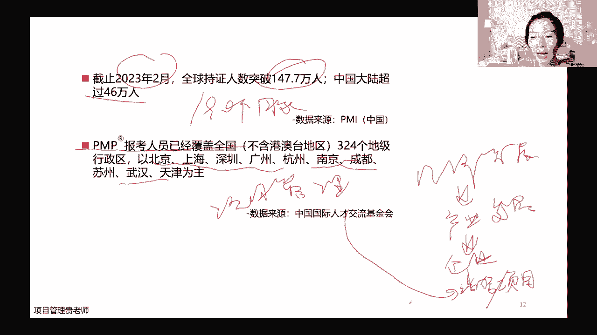

这个49个子过程啊，和十大知识领域已经非常完善了，已经非常完善了，到第七版更新的时候呢，啊他啊没有沿着我们过程组合知识领域，这样的一个模板和结构在更新哈，他把整个教材的体系，教材的结构完全颠覆了。

他那第六版呢它是由我们的这十大知识领域，和我们的项目的五个过程组，以这样的一个标准去做的知识体系，那么第七版呢它是从项目管理的12个原则，和我们项目管理的八大绩效域，以这样的一个这个分布。

那为什么做这样的一个变化呢，是因为是因为现在哈尤其是疫情后，尤其是疫情后，传统的这种项目都是啊，基本上是能够预测的啊，但是软件软件项目是例外哈，软件项目确实需求没法定啊，没法完全固定。

那只能用一些名字办法，但是呢啊一些通用型的一些项目。

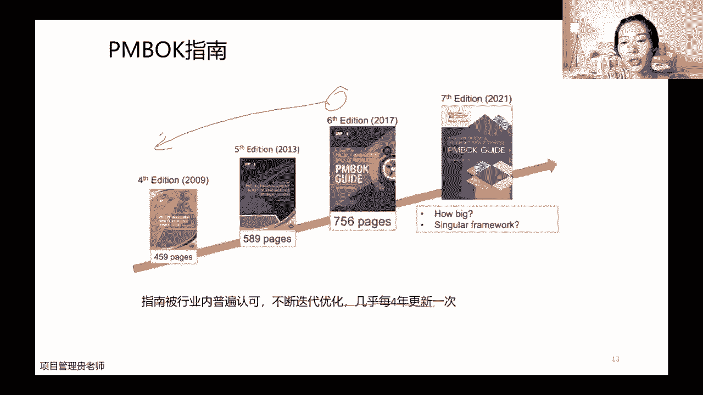

那它基本上是范围是能够去确定的，那么能够确定的这样的一些范围呢啊，能够确定的这样的一些范围呢，它是有固定的结构和程序的啊，所以呢原来这套体系它适用适用，但是呢在疫情后哈，环境外部的环境不可控啊。

有太多黑天鹅事件，技术也更新的很快，迭代的很快啊，需求也变化的很快，那么在这种情况之下呢，我们做我们做项目呢就要体现项目的价值哈，就要体现项目的价值，我们要以交付价值为主。

这个时候呢我们注重的是做项目要去适应环境，要去适应我们的目标价值啊，要注重以人为本啊，所以呢他就变成了以服务为主导的，这样的一个逻辑，所以它的固定的那种框架啊，不再那么的适用哈，不再那么的适用。

所以呢改版了啊，完全是颠覆式的改版啊，这个是啊跟大家去建立的，这样的一个这个认知哈，600~700的一个颠覆式的一个变化，这样的一个基本的认知，那么推荐的书目呢啊刚刚讲到了哈。

刚刚讲到了我们这次的教材啊，这次这个课件是三本教材都会含糊在内，那么备考的几点建议呢啊，首先啊肯定我们这个教材的内容啊，讲的内容肯定是要理解，同时呢要去实践啊，要去实践啊。

你哪怕现在没有从事啊这个项目的啊，甚至你是这个公司职能部门的人啊，职能部门的，那么你是职能部门的啊，你可能会说我没有在做项目呀，啊我每天做的事情，每天做的工作他都是重复性的呀，啊日复一日啊，那怎么办呢。

我学不学这个呀，学这个有没有用啊，有用啊，有用啊，为什么呢。

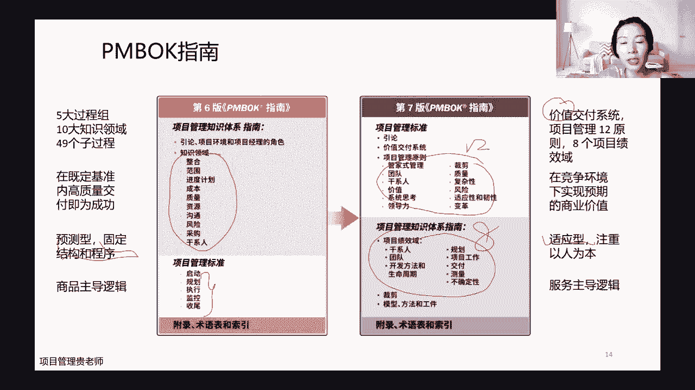

因为我们前面说到了呀，项目是你自己可以去定义的，哪怕你每天你每天做的啊都是写公众号啊，来运营啊，把这个公众号运营的很好啊，啊或者啊短视频啊啊你要去这个去推广啊，你拍一条短视频。

你能不能把拍一条短视频做一个项目啊，啊你写一个公众号的文章，能不能把这一篇文章当做一个项目，可以啊，可以没问题没问题，要去用，用的过程当中啊，从小到大慢慢的你就熟悉了，慢慢你就熟悉了。

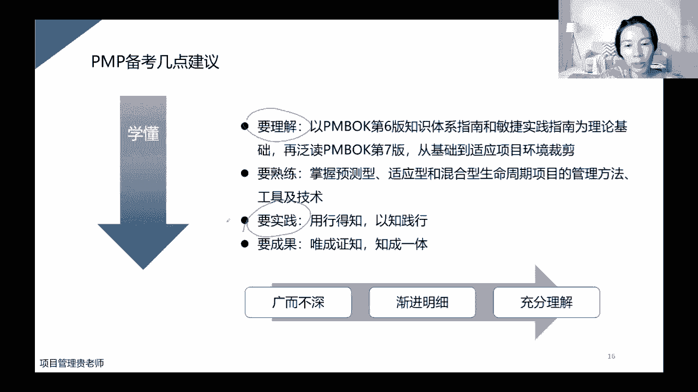

我是不是卡了。

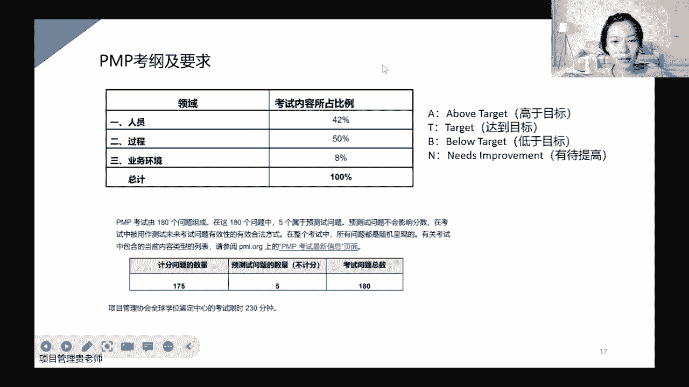

伙伴们，你们刚刚卡了吗，伙伴们，你们刚刚卡了吗，没卡我就继续讲哈，好没卡，我接着讲啊，我刚刚我我自己这显示卡了一下下，好考纲，考纲跟大家说一下呀。

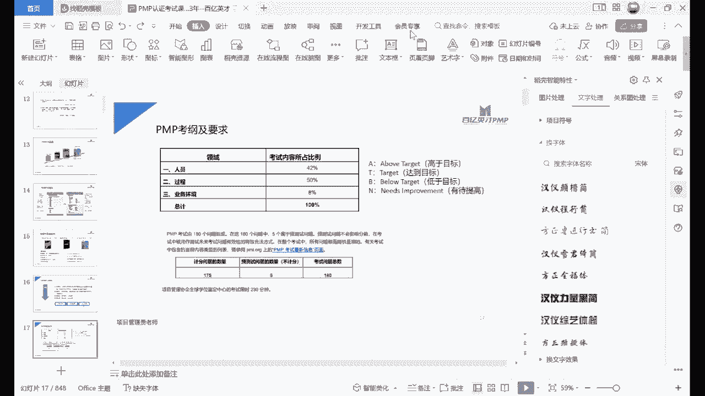

现在还卡吗，我关一下摄像头哈，OK考纲考纲是考我们三大三大领域，三大宁啊，首先是人员，因为我们做项目非常非常多的，非常非常难办的，就是人，对不对啊，你让我干活还好，你让我去跟人去协调。

去找甲方多扣点钱出来，太懒了太懒了哈，所以呢考纲第一大领域呢是我们的人员啊，这个人员呢就包含了我们跟项目相关的，所有的人员，团队也好，干系人也好，客户啊，领导啊都包括在内。

这一部分呢它占我们考试内容的42%，第二个呢第二个领域是过程啊，整个这个过程过程是什么过程呢，就是我们做项目的过程，启动过程，规划过程，执行过程，监控过程和收尾的过程，这些过程也考非常重要。

50%的比例，大家可以简单理解，一个是注重人啊，一个是注重事，所以项目经理很难啊，很难人也得管，事儿也得管，那还有呢是环境也得管啊，业务环境项目是不是合规啊，啊小的方面，人的方面啊，是不是合规呀等等啊。

是不是满足我们的商业条件的呀，商业环境时刻在变，我们怎么去应对呀，环境也得考8%啊，这是比重哈，这个比重呢三个领域哈，三个女她考试她怎么分呢，他不给你具体的分数啊，他不会告诉你打了啊，110分啊。

120分呢不会这样啊，它只会按照每个不同领域你达到的标准啊，是A啊，还是T是高于目标，还是达到目标，或者是低于目标，或者是直接是N啊，需要提高三个领域，如果都是高于目标啊，那当然你的成绩是最棒的。

他会给你显示3A啊，当然他是按照这三个你凭证的去分布哈，所以呢大家就会发现你不知道你的分数啊，有些人三黑三黑当然很好，但是呢有些人可能是一个A啊，两个T也是pass，也能过哈，也能过，当然也能过。

这个不影响大家，只要过了就行哈，那么考试呢它是一共是180个选择题，180个选择题里面呢，有170个单项和十来个多选，这180个题目多长时间呢，230分钟，230分钟让大家做啊。

也就是从九点啊要考到一点啊，要考到一点，要考的接近一点哈，那么这180题当中呢，考试当中每一个人的试卷哈会随机抽掉五个，不给你积分，积分的只有175个，每个人抽的是不一样的哈，每个人抽到的是不一样的。

这175个呢啊，你基本上你按照这三大领域，每个领域60%，也就是说你要做到100，差不多110题左右，差不多110题左右，才能够保证说这个考试他是基本过关才能考，才能保证你考试的时候基本过关好。

那讲讲什么是项目呢，项目啊，第六版的定义是为了创造独特的有东西出来啊，这个东西是什么东西呢，产品也好，服务也好，或者是成果也好，有这些服务产品或者成果出来啊，为了做这些成果而进行的一些工作。

这些工作呢它是由舌尖节点的哈，这个临时性不是说啊，我今天临时来给大家讲课，不是这个意思，而是说这个项目啊，给大家讲个这个项目，他又开始有结尾，哪怕这个时间是一年或者是一个小时，它也是哈，他也是有开始。

他也有结束这样的一个过程，所以项目的特点哈，临时性独特性，为什么做项目这么难呢，因为每一个项目它都是不一样的啊，它都是不一样的，所以呢项目它都是有独特性的，并且呢项目越做一些不确定性的。

一些条件和一些因素，他渐渐的他就明晰，这是项目它的不同的一些特点，那么可交付成果和产品呢啊这个定义啊，大家自己去看一看，可交付就是我们每一个阶段，它产生了一些可以交付的东西，这个东西呢是阶段性的。

哪怕是一个报告啊，啊哪怕是说哎我规定的，我今天啊我一个报告我要写一周，那么我今天我要把导论写出来，那OK我今天教授的是导论，那导论就是我的极端成果啊，这也是我的成果呃，这个定义呢大家去了解一下啊。

了解一下，那么第七版呢它对项目哈，它的定义有一些变化，他不是说爱，为了实现可交付成果而做的临时性的工作，他是怎么说的呢，他说项目是什么呢，什么是项目呢，项目是实现哈，项目是计划实现的啊。

一组可持续的商业价值，也就是说你能够实现商业价值的这个叫做项目，那有些问题就出来了哈，原来可能有人会说哎我做一个项目投资啊，我做一个公益活动啊，这又没有成果出来，对不对，那这项目这个项目呢。

甚至这项目投资我投那么多钱进去，可能很多的项目十个项目起，一个这个投资公司仍然活得很好，但是我其他几个项目没有承诺，他没有价值出现了，这个叫不做项目呢，叫不叫项目呢，从我们第六版的定义来说啊。

他没有可交付成果呀，还没有产品呀，啊有些人就觉得哎呀，这个从严格意义上来讲是不是就不奏效呢，但是有了我们第七版它的一个定义哈，那九个项目虽然说他打水漂了，钱打水漂了，但是它有没有价值啊，它有价值。

它的价值没有在你的投资回报上面，但它的价值在哪呢，它的价值给你的增加了经验，增加了风险啊，增加经验教训，对不对啊，你也许你有前面九个项目的投资失败，你才有其中那一个投资项目的一个成功，对不对。

投资本来就是一个概率事件呀，所以失败的项目它也是项目呀，对不对，这才合理嘛，对不对，它也有价值呀，啊你做公益活动，做公益活动看上去好像撒了不少钱啊，花了不少钱出去啊，这个反响一般般啊，对不对。

他也有项目，它也有它的价值出现啊，对不对，他的公益活动本身它的公益性质也有它的价值，同时呢做这样的一个公益活动啊，比如说有些明星啊，他要去做公益嗯，咱甭管啊，我们先甭管他是真心的还是还是这个假意的。

但是他至少他这个名声宣传出去了呀，这就是他要的价值呀，对不对，对不对，所以哈项目到底什么是项目啊，大家不要看书上怎么说，自己给自己定义哈，你认为你目前做的这个工作有没有价值啊，你做你哪怕是天天做一样的。

写一样的这个文件，天天写一样的文件，你如果说你想让它把它变成项目，那么OK可以的，怎么可怎么可以，你时间上面能不能提升一点呀，你的同一个这个这个一模一样的这个文字报告，你能不能把字写好一点啊，可以啊。

对不对，那你为了写好这个字，你练字哈，你也有一些提升啊，这个也做出项目，对不对，所以项目是我们自己给自己定义的哈，所以千万不要被啊，这个理论上的项目到底什么是项目给框住了，千万不要这样去框住了啊。

为什么会跟大家尤其提这个事儿呢，就是我们之前啊这个做训练营的时候，当时有另外一个老师哈，我们就是有一个做投资的一个伙伴啊，他在我们训练营里边，然后另外一个老师讨论的就说啊。

他做的这个根本就不是羡慕我呵呵，然后我当时就跟他有不同的意见，为什么这不是项目，对不对，项目一定是我们自己定义的，我们说他是项目，我们给他不同的标准不同定义它就叫项目，对不对，所以这个是思维哈。

所以思维他一定是超越了我们啊，这个框架本身的话，一定是超越了我们固定的框架本身的，大家首先要把这个思维啊，从思维上面去学它，那什么是运营呢啊什么是运营呢，运营也是自己给自己定义的。

你如果哪怕是你现在做的一个项目，但是呢你没有创新啊，你按部就班啊，或者说这个说不思进取不太好啊，但是呢你已经失去了这种做好，做创意的这种激情，那其实即使你做的事情不同，你是不是也做的是运营，对不对。

我这样说一点没过分，对不对，所以运营它的定义是什么呢，他是说在相对封闭和确定的环境下开展的，也做的重复性的呀，周而复始的呀，持续性的这些活动啊，这个叫运营，这叫运营。

那么运营跟我们的项目它之间有没有关系呢，它一定是有关系的，而且呢他们的临界点非常非常的微妙哈，你做运营的过程当中，你你只要哈你能够提升，你能够做一些改进，提升优化的这些建议和方案。

那么你的这个方案它就可以当做项目来做，同样的你做了项目之后，那会产生一些好的一些提升啊，服务啊，价值出来，那么这个价值呢你要把它投入到，要让它持续的去运转，让他发挥持续的发挥它的价值，对不对。

那这个过程叫做运营哈，叫做运营，所以呢运营跟项目他是有明显的界限，但是呢他也是没有那么明显的界限啊，大家要去体会，还要去体会，从定义上面，从理论的定义上，它是有明显的界限，但是从我们实际的操作过程当中。

它取决于我们，取决于我们怎么去对待我们啊，是头上的工作啊，和我们目前正在从事的项目哈，那么它的一些不同点呢，啊比如说项目啊，它是临时性的呀，独特性的呀，啊运营呢它是重复性的呀，经营性的很少创新呀。

它涉及到一些人员项目，就是我们的项目经理和项目团队，而运营呢就是比如说我们的职能经理啊，职能部门啊啊和运营的一些这个运营经理啊，和产品人啊等等，都是这样，那么我们做项目哈，既然说要创造价值啊。

价值呢就是它的作用重要性或者是一些实用性，那么有人就会说了，不同的项目啊，甚至是同一个项目，不同的人，他看的这个项目的价值它也是不一样的呀，对不对，那是一定的，对不对。

首先啊价值它的体现方面是在不同类的，如果说这个事情啊他做了之后，他能够满足我们客户或者是最终用户的，他的所需要啊，我们做出来的产品，做出来的服务，做出来的结果，这个叫不叫项目呢啊。

这个当然是给他创造价值的，这个当然是很好的项目啊，那同时第二类呢是没有具体标准的产品出来，但是呢我做这样的一个项目啊，它能够对社会产生一些积极的一些影响啊，能够给环境带来一些贡献啊。

这个也是啊这个项目发挥了它的价值，同时第三类呢是啊，这个项目它能够啊，能够帮助我们提升工作的效率，提升企业的生产力啊，能够产生更好的一些响应的一些能力，这个呢也叫做项目哈，你为了做这样的达成这样的效果。

也叫做它实际的价值，也叫做它很好的一个项目，那么第四类呢是他这个公司啊，这个比如说现在人工智能很火，人工智能很火，那我呢啊我们要去接轨啊，要去这个接待模型啊，创造一些新的一些产品出来啊。

为什么要做这样的产品呢，是因为未来啊，是因为我们觉得未来人工智能会是，会像当年的互联网一样啊，会席卷会席卷各行各业啊，所以我们必须要做这样的一个改革，哪怕呢诶他看起来了。

目前也没有一些诚信的一些东西出来，甚至要花很多钱，但是呢也叫做我们实现了它的价值，对不对，因为我们跟上了时代，我们在操作啊，在做研发，对不对，也是它的价值，那么还有第四类呢，哎有人会觉得我公司啊。

我之前是怎么样子的啊，我现在还是这样子的，我有没有价值呢，也可能有价值，为什么呢，因为可能我环境不好，对不对，就像疫情疫情期间倒了一大批企业异性钱啊，我公司年收是1000万，那疫情后呢或者疫情期间呢。

我做了很多事情啊，我为了维持我之前1000万的这样的一个营收，那我做的为了维持这样的之前的这个效益的，这个事情啊，这些动作它是不是也就实现了价值呢，它也叫实现的价值，对不对，因为我从不同的维度啊。

我虽然说不同的维度上面看，1000万原来是1000万，现在还是1000万，没有变，好像没有价值，但我的环境变了呀，对不对，我环境变坎坷了呀，变复杂了呀，变困难呀，对不对，所以呀不同的这个价值啊。

不同的这个价值，因为它本来价值本来就是一个虚的东西，对不对，它在不同的环境，不同的人啊，不同的时机面前，他本来他体现的点他就是不一样哈，所以我们在做项目的时候呢，啊，我们要跟不同的啊领导啊，或者是客户。

他们要的东西那一定不一样的啊，甚至不同的领导都是领导，对不对，不同的领导他要的东西还不一样呢，我们要去了解一下他们所需要的价值，最核心的价值到底是什么，这样呢能够帮助我们哈。

能够帮助我们更好地达到他们心中的期望，达到他们的期望，我们的项目当然能够得到的知识和资源，也就更多，任何一个公司哈，他为了实现他的项目价值，它都会依靠价值交付系统，那么这个价值交付系统呢。

那就是我们有不同的项目，项目组合，项目集啊，或者单个项目也好，这个项目呢都是产生不同的价值，这个统称为它的价值交付系统，那么它既然是一个系统，那就涉及到6月份的协调，它会有内部环境啊。

就是我们公司内部环境，还有外部环境啊，客户的竞争对手的行业的呀啊，市场的呀啊等等，会有内外部环境去给他做干扰哈，去给他做支撑啊，同时呢项目产生了一些成果，我们要找到运营去持续的发挥的价值。

这一套系统统称为一个企业的，它的一个价值的交付系统，那么围绕着价值交付系统呢，啊会有我们的项目当中的一些信息流，这个信息流它是怎么流动的呢，是因为他们决定了这个公司它的战略的方向，战略的目标，对不对。

那么为了实现这样的一些战略，我们要去做一些项目呀，对不对啊，要去专注做一些业务呀，业务当中有一些项目组合啊，项目组合啊，这个跟大家说一下什么是项目组合，项目组合呢就是为了实现价值。

把有限的资源投入到投入到最核心的，最重要的那些项目当中啊，为了实现这个战略目标做的这些组合，这些项目他们之间不一定有关联，但是呢他都是为了实现项目的啊，组织的战略啊，它会有一个优先级的顺序在里边。

那项目集哈，什么是项目级呢，也跟大家说一下，项目集呢是不同的项目之间他有一些关联啊，他有一些观点，那么为了更好的或者说节约资源，协同管理这些项目，我们可以把它叫做项目级的管理啊，那么单个的项目做项目哈。

这个不影响不影响，那么到项目组合这呢，哎我们期望产生怎样的，怎样的成果，怎样的收益，怎样的价值，唉我们又会专注做某些具体的项目，项目出来之后呢，为了维持，那为了支持，为了持续发挥价值，我们进入到了运营。

那么在运营的过程当中呢，我们发现了需要更新啊，需要修复或者调整那些点一些信息，那么为了调整他们，我们又发起了新的项目或者是项目集，然后呢有一些技巧去体现啊，和运营当中反馈出来的这些事件去调整。

去优化它的一些战略，进而呢能够让我们的战略更加的合理，走得更好更远啊，这是我们整个项目当中的信息流哈，那什么是项目管理呢，项目管理啊，理所应当，那就是我们要把我们所学的这些知识啊。

这些技能啊啊这些工具和方法呀，运用到我们的项目活动当中，来指导我们的项目工作啊，这个叫做项目管理啊，当然这个都是定义上的哈，啊那么有效的项目管理到底有什么用呢，啊当然更好的达成目标啦，满足客户的期望啊。

提高我们项目的可预测性啊，提高项目成功的概率啊，能够确保啊，或者说能够提高我们在正确的时间交付，正确的产品，能够帮助我们更好地解决，项目过程当中产生的一些问题和那些冲突，能够更好的帮助我们去啊。

管理一些制约的一些因素，去优化组织的一些资源的一些使用，那当然既然有这么多的好处，那如果说这些项目管理做的不好，那当然这些好处就没有，对不对没有，那就可能超支啊啊超时啊，质量不合格呀啊声音受损呐啊等等。

就有可能导致这样一些不好的事情影响，那么是不是学了项目管理，一定会把这些项目管理的好呢，也不一定哈，不一定啊，为什么呢，因为项目它的它的独特性太强了，他要控制其他的因素太多啊，它的不可确定性太强。

所以呢这是我们追求的目标啊，这是我们追求的目标啊，这是我们追求的目标，那是不是没有学项目管理，一定管不好项目管理呢，也不一定哈，也不一定，为什么呢，因为有的人他经验很好，他做的项目呢。

他确实他做的项目很多啊，啊他在协调当中，他有他自己的一套方法，他没有系统学过这套知识，他也能管得很好，也能管得很好啊，所以呢这个不绝对，但是呢从概率上来讲，你系统的学习过项目管理。

那你成功管好项目的这个概率啊，肯定是比你没有系统学习过的，这整体的概念而言要更强的哈，要更强的，所以大家不要去质疑哈，不要用特例去质疑学它到底有没有用好，项目集和项目组合，刚刚去讲了哈，项目组合。

项目组合是为了实现一组目标啊，去开展政策项目，把有限的钱，把有限的资源投入到有限的核心的资源里边，而项目集呢是更重要的是有关联啊，互相协调管理，这个大家了解一下就行哈，那产品的生命周期呢。

那我们讲项目有项目生命周期，那么产品呢也会有产品的生命周期，那产品的生命周期呢啊，最开始我们说要去策划一个产品，策划一个产品去推向市场，推向市场之后呢，开始积累一些用户，积累一些消费者呀。

在成长期进入成长期之后呢，哎慢慢的用户逐渐的去啊，逐渐稳定啊，老顾客也越来越多啊，进入到一个陈述的阶段，进入到一个成熟的阶段之后呢，但是顾客会变老的呀，对不对，变老了之后他的需求他变了呀。

你这个产品如果说没有更新的话，那么你没有办法再去留住那些老顾客啊，你慢慢的产品就会进入到一个衰退期哈，这个是我们产品的生命周期，但是呢产品的生命周期，是不是意味着这个企业的生命周期呢，啊不是哈。

这是因为每一个产品它都会从啊这个慢慢的啊，这个发起啊，成长成熟到衰退，既然产品每个产品它都会衰退，那企业为了为了让这个企业能够，一直可持续发展，它必须他必须要在它的产品成熟。

或者是已经要接近衰退的这个时间，要研发新的东西，他不研发新的东西，它就会面临着企业随着产品一起衰退，没办法，为什么呢，因为产品它一定会衰退，所以呢为了让产品啊，这个更好的让它的成熟期尽可能的长啊。

我们要做产品管理，产品管理什么意思啊，产品管理就是在整个生命周期任何时间点啊，我要启动一些新的项目，启动这些新的项目呢，能够帮助我的产品做更好的升级，做更好的优化，去增强它的一些功能也好啊。

啊增加它一些组件也好啊啊等等都OK，为什么要增加这些东西呢，而是为了我们能够持续提供价值啊，能够持续提供价值之后呢，能够啊去啊，有我们稳固的稳固的团队，稳固的消费者啊。

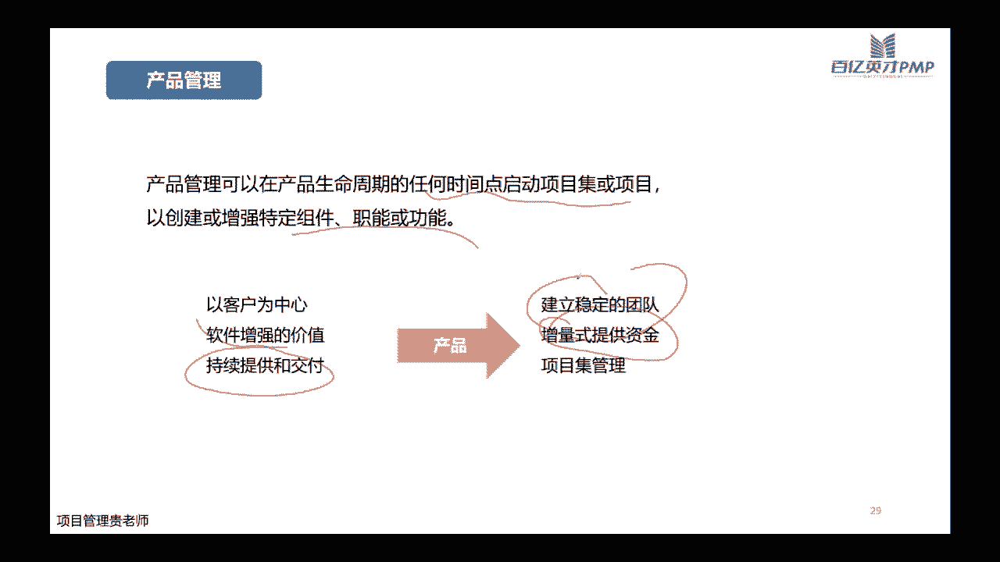

这个是我们做产品管理，产品管理呢是跟我们的这个项目管理，是有一些区别，还有一些区别，因为产品和项目，它本身它是有一些不同的一些区别哈，这儿呢给大家列了一张表啊，项目项目集和项目组合。

它到底有什么样的一些观点，包括产品哈，这个呢大家去看一看哈，去看一看就好了，自己看着这个课件哈。

然后跟项目有关的一些职能呢，首先也就是说我们做项目他到底应该做什么，项目经理到底应该做什么呢，首先，项目他有目标，对不对，目标来了之后，目标只有在实践的过程当中才能够去体现。

这个目标到底是合理还是不合理，对不对，所以我们在实践的过程当中，对目标有什么样的一些反馈啊，有什么样的一些意见是要提的啊，是要提的，所以呢啊我们做项目不是说啊钱到位了，我管着人把这项目推动着走就行了。

不是这么简单啊，不是这么简单啊，为什么呢，因为我们要带着老子干活，但是老子干活要想着为这个公司提供的价值，对不对，项目本身它的成果是价值，给项目团队啊提供一些引导知识，帮助他们去成长，这个是不是价值啊。

这个也也是价值，对不对，公司让你做项目管理，带团队，你有义务帮公司培养一批优秀的项目人员呢，对不对啊，这个也是价值，也是价值啊，所以呢开展工作啊去洞察，去带着脑子去思考，哪怕你提供的是客户那边的啊。

一些这个跟这个项目不太相关的一些线索啊，那对于公司来说它也是有价值的，也是有义务啊，所以我们也是有义务去观察，去提供的，竞争对手的消息也是啊有义务去提供的啊，去培养团队啊，去运用你所学的专业的知识。

把项目管得更好啊，去协调不同的一些资源啊，去维持公司的项目管理的治理体系，治理的办法，这个都是跟项目经理相关的一些职能啊，都是有义务去做的，所以呢千万不要觉得诶我管项目就是我带着人，让我做一个软件啊。

我按时按点的，我把这个软件做出来就OK啦，我项目就管成功了，不是这么简单哈，不是这么简单，这个呢只能说是一个啊，基本合格的一个项目经理，但是呢如果你只是说做好眼前的这个，手头上的这个项目啊。

你没有想着替公司做更多，争取到更多的价值，那么礼仪高级的项目经理，或者是你组织里面高层的项目管理人员啊，比如说项目总监呢，或者是项目管理办公室的负责人呐，你离这些职位就还远得很啊，就还远得很。

所以呢自己首先给自己提一些要求，提及要求之后，从哪里下手呢，从哪里开始做呢，从这些方面开始做，从这些方面开始下手做好，那什么是项目经理呢，当然管项目这个人是项目经理咯，PY呢对项目经理有一些能力要求啊。

这个能力要求呢首先从工作方式上面，你既然管项目要管事，要管过程，对不对，那OK你就有义务去掌握不同的多样性的，一些创造性的一些方法，来在不同的程序当中啊，管好管好这些事，这是从工作方式上面有一些要求。

同时呢啊从商业敏锐度上面也有一些要求，也就是说你不能说啊是一个陌陌啊，这个这个默默做事的一个人啊，光这样不够哈，所以说为什么有些技术人员他转岗项目经理啊，转岗做管理者觉得他很难啊，他觉得很难，为什么。

因为他的商业敏锐度太差了，他只会低头干活，他不会抬头看天，所以呢啊，作为一个你要想成为一个优秀的项目经理，那么你的商业敏锐度啊也是非常重要的，就是我们在面对啊，面对市场。

面对行业的这样的一些变化动态的时候，能不能迅速的做出一些适合我们项目，适合我们公司发展，适合团队成长的一些决策，那么第三个能力就是我们的影响力技能，为什么要有，为什么要提高影响力技能呢。

因为你做项目我们说了，做项目最不可控的就是我们的人，对不对，那我们需要啊领导需要去协调啊，客户需要去协调，团队成员需要去协调，供应商需要去协调，对不对，有这么多协调啊，你要去跟他们去沟通啊。

要去让他们去跟我们达成共识啊，要对项目啊有一些创新的思维啊，要根据我们市场的变化啊，酌情的去移动我们的一些小目标，改变我们的一些小目标啊，对不对，你要有这些影响技能啊，去影响环境，影响人啊。

所以要求还是挺高的。

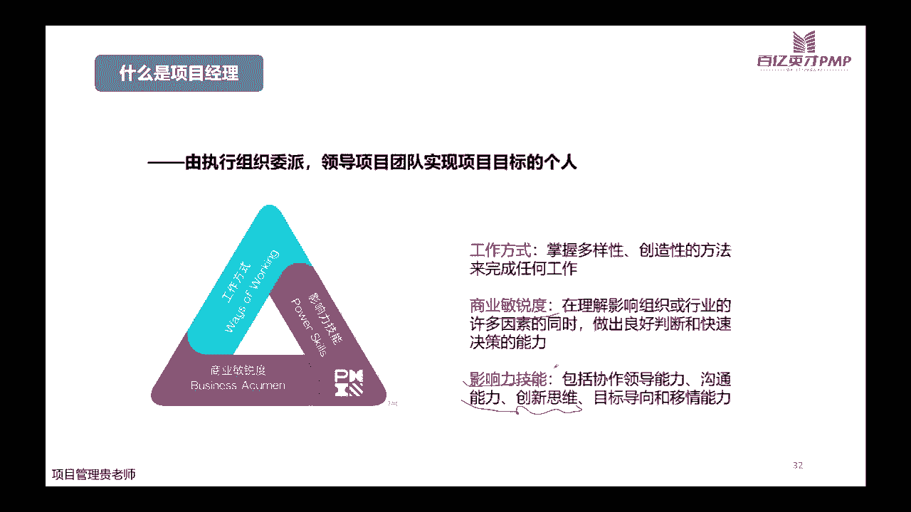

要求还是挺高的，那项目呢它嗯我们说不同的项目，它取决于不同的环境，对不对，环境对它的价值交付有不同的一些影响，环境又分了内部环境和外部环境，刚刚讲了价值交付系统，对不对，那么内部环境呢。

我们重点讲讲它的组织的，这个文化结构和治理啊，主要是组织的结构，重点讲讲，那么外部的环境呢重点讲讲监管的环境，那么制定系统呢啊制定系统呢是什么意思啊，制定系统它主要是整个公司的管理项目，它的一个框架啊。

它是不同的部门之间啊，不同的这个项目的决策流程之间啊，它是注重于这种系统的，那他跟管理哈，他跟管理有什么区别呢，管理是啊，它跟我们的项目管理，项目管理的，它主要是管项目内部哈，项目它是有边界的。

从启动到收尾，它是有边界的，它是从这个边界之类的项目管理，而项目治理系统呢，它是从整个项目啊，与外部与组织，外部其他的这个部门怎么去协调啊，怎么去上报啊，怎么信息怎么去传递程序，怎么去控制。

它讲的是一个是狭义的项目管理啊，一个是广义的项目的治理啊。

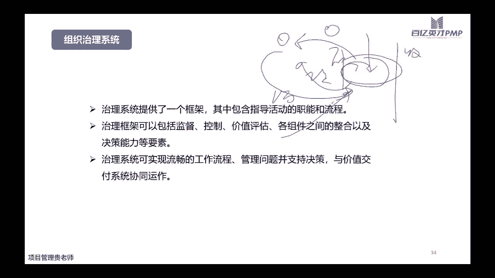

他的这个级别不一样，级别不一样，那么组织跟项目管理时间呢，当然为什么前面讲啊，这个北京上海，广州深圳这些地方学项目管理的人是最多的，那为什么呢，跟经济这么挂钩呢，是因为我们经济跟产业挂钩。

产业跟企业挂钩，企业跟项目挂钩，对不对，所以呢成功的项目管理，它对企业一定是至关重要的啊，一定是至关重要的，为什么呢，因为企业啊它首先它有它的使命愿景，他为了达到他的使命愿景，他有他的组织战略目标。

他为了达到他的战略目标啊，他要做不同的项目组合，项目结合项目管理，对不对啊，所以这是他的一个这个逻辑关系哈。

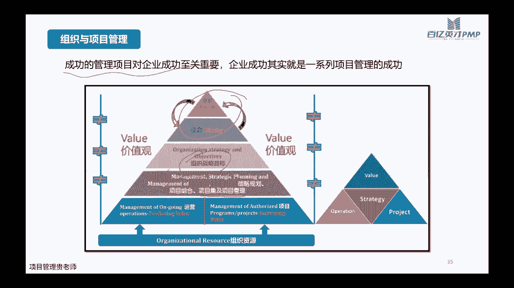

一个逻辑关系，那么组织文化是怎么去影响组织文化啊，有我们组织战略啊，不同的组织结构，项目型的呀，职能型的呀，不同的组织文化制度啊，包括不同的公司的人员啊，人员的风格啊，整体这个公司的技能啊。

整体公司的它的一个持有的公司的价值观，这些都会啊，这些文化都会影响到我们项目，都会影响到我们项目，那你可以说那做一个软件项目，但是呢如果你现在公司都是一些老顽固啊，老古董。

那你去做一个创新性非常高的一个项目，难不难呀，难呀，对不对，难为什么呢，因为他的价值观啊，他的这个这个人员啊，他的这个员工的风格，他他就是一些老顽固，你让他怎么去创新呢，他很难，对不对啊。

所以呢不同的组织文化啊，它对我们的项目的影响，它一定是影响非常大的。

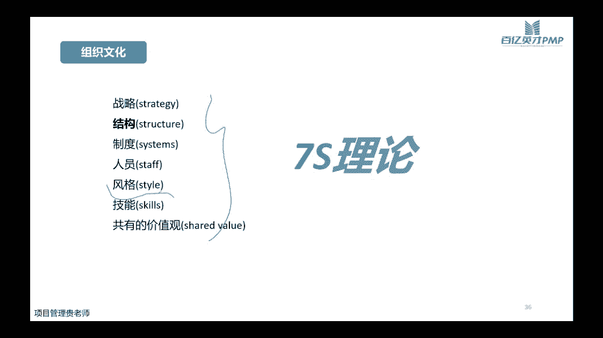

尤其是从不同的这个结构来说，结构呢分了这么多种哈，非常多，重点呢去了解一下直冷型的啊，和举证型的，然后还有我们项目型哈，重点去了解这三类，了解这三类项目它的组织结构，那职能型的呢，什么是职能型的啊。

职能型的，也就是说啊这公司要做项目，但是呢没有全职的项目经理要做这个项目，那OK啊，找一个职能经理啊，去负责去让他兼职，把这个项目管一管，那什么是矩阵型的呢，矩阵型的是这个项目呢。

这个公司啊他有职能部门呢，他有行政，人事，财务啊，啊有运营啊，有生产啊，啊有销售啊，他有这些部门，但是呢他也会有呀，一些项目部门专门做这些项目的，做好交接就好了啊，那什么是项目导向型的呢。

项目导向型的是这个公司他就没有人事，财务这些职能部门啊，他都是项目部，项目一部，项目二部，每个项目部呢他有自己的职能的这些岗位，他有自己的人事财务行政，这个是项目组合，项目导向型的结构哈。

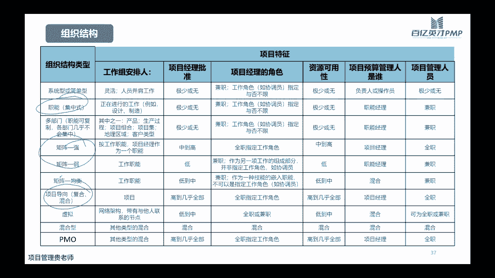

那不同的结构呢，当然对我们的项目也有不同的影响，它怎么影响呢，比如说你职能型的啊，老总啊，CO下面有几个不同的部门，不同的职能经理，每一个职能经理下面呢都有不同的人员，都有不同的职员，对不对。

那现在项目来了啊，要做项目了啊，要做项目了，谁来做呢啊安排一个人啊，安排一个人啊，让你来去，你负责负责吧，这个职能经理，职能经理管事的，他去联络这个项目啊，Ok，他去年报的时候就会发现什么了啊。

他就会发现他安排他的直属的下属去干活，很容易，但是呢他要安排隔壁的部门的下属区干活，容不容易呢，很难对不对，他得先跟他的领导说，然后由他的领导再去跟他沟通啊，这样，沟通的成本特别高啊。

部门的制约特别强啊，所以呢结论性的组织啊，他做项目啊，他肯定相对而言效率是比较低的，质地比较低的哈，那么矩阵型的呢，稍微弥补了一下职能型的一些缺点哈，因为他有专职的啊，有一些这个项目管理员啊。

会给他任命，还会给他任命，虽然说他有可能是兼职的，但是呢他至少有这样的一个职务在，但是呢这些职员他作为项目管理员，他也很难，为什么呢，他权力有限啊，他能叫隔壁的这个部门的人啊，虽然也是项目的团队成员。

他能直接让他干活吗，他权力有限啊，他去找小王说，小王你去你你来负责这个项目当中这个工作吧，小王说哎呀，我领导还给我安排了其他的活，你要不然先跟我领导沟通一下呗，啊你又去找他领导，领导再跟他沟通。

这样也很难，对不对，效率也很低啊，所以呢这样的弱矩阵的组织的这个组织里边呢，他有啊，他有项目管理员啊，但是项目管理员呢他基本上是一些兼职，他的权力有限啊，他的权力有限，项目经理的这个职位啊。

他的能力他是他的他的权利啊，他是没有职能经历高的，那强举证组织里面呢，他的项目经理啊，他就职权稍微高一点哈，他稍微高一点，因为他有他自己的项目管理的，项目经理的领导啊，同时呢职能部门啊。

他的项目经理的领导和职能经理的领导啊，这个都是评级，对不对，都是评级，那就不怕你了，是不是，那我管项目的时候，OK我让你干活，你能不干吗啊你不能不干，为什么呢，你不干啊，我们领导就跟领导去谈话去了啊。

所以呢他专职的项目经理啊，在强矩阵里边，他的职权哈，他的职权是高于我们的职能经理的啊，他可以直接去跟职能部门的这些人去安排活啊，所以强矩阵跟弱矩阵它的区别，一个啊是项目经理的权力比职能经理弱。

一个是项目经理的权利，比职能经理的权力要强哈，所以呢强举证是相对还比较好，做项目的管理的哈，比较好做项目管理协调的，那么最好的啊最利于项目的这个管理和协调呢。

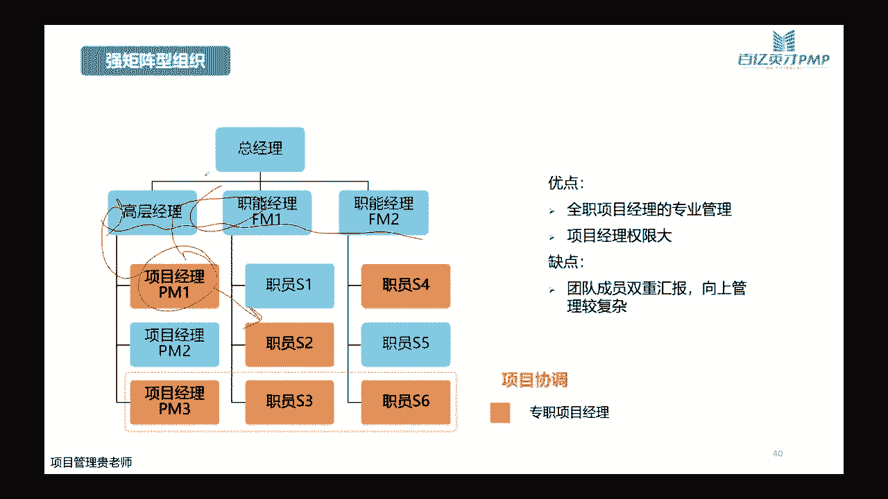

就是我们项目型的组织啊，直接说了项目一步二步三步，对不对，那OK我项目一部，我带领我自己的职员哎，又是我的项目团队成员，又是我部门的职员，我带领他干活，当然很好干，对不对，当然很好干。

那这种呢是最利于我们项目的管理和协调的，当然这种是不是啊，那有人会说，那所有的公司就用项目组，都用项目部呗，对不对，都是项目型组织呗，这样更好做项目了呀，啊实际上并不是这样啊，为什么不是这样。

那显然它是有一些弊端的，对不对，他有什么弊端呢，项目先组织哈，都是项目，那这项目做完了怎么办啊，项目转到运营去了，谁做运营，对不对啊，所以他的资源利用率是比较低的，这也是为什么。

目前哈目前大家去看到的绝大多数啊，可能还是一些矩阵型的比较多，当然也有很多甚至都是职能型的，职能型的这种显然做项目是比较难一些，还是比较难一些，所以大家在做项目当中难，那是一定的哈，不懒才奇怪。

不懒他才是不正常的，还有一种虚拟组织啊，虚拟组织这个在疫情之后哈，就是会用的比较多一点哈，就是大家就比如说有些公司，他现在推的各种合伙人呢，啊这些合伙人其实也是从组织的，首先来看它就是一些虚拟组织哈。

虚拟团队，虚拟组织的一些要点呢啊这个就不讲哈，这个考试不会考哈，这个大家了解一下就行，然后PO呢啊它是什么意思呢，它是我们的项目管理办公室哈，是我们的项目管理办公室。

那么项目管理办公室他一般他有什么职能的啊，他是干什么用的呢，他是对公司啊，是维持整个公司的项目治理结构的，那既然他维持治理，那么他就有义务去把整个治理过程啊，做标准化啊。

促进不同的部门之间进行资源啊得分享，进行工具和方法论和技术的一些共享，然后去帮公司培养项目管理的人才啊，去把一些好的一些经验，一些案例去总结，然后去复用啊，去提炼，这是我们项目管理办公室的一些职责哈。

嗯他的一些价值主张呢，其实嗯做好这个了，这第一提供好的一些指南啊，模板和视力培训，所以如果你去一个公司哈，他有项目管理办公室，然后呢你又是先去这个公司的，你不了解这个项目怎么去管啊，又是模板的时候。

没关系，你去找办公室哈，你去找PMO啊，去找他要指蓝牙模板，他有义务提供啊，他也有义务提供啊，他也有义务给你做培训哈，同时呢重要的一些项目啊，他要去协助项目组去做规划啊，去做一些风险管理，同时呢啊。

一些超越了项目经理本身权限的一些批准啊，一些决策好，一些资源的协调啊，这个是项目管理办公室哎呀要负责去做的，同时呢啊项目的管理办公室啊，还要去跟市场上面的这种良好的项目，管理办法啊，去学习人家的经验。

然后去到我们组织里面去复用，给我们组织提供更好的项目管理，他的意见，这个流程和一些价值的一些优化，流程的优化，这个是我们啊这个PMO的，它的一个核心的一些价值哈，所以你们去看啊。

如果你们不去公司啊去找一些工作，如果这公司连这个项目管理办公室都没有的话，那么他们这个公司哈，它的整个项目管理体系，一定是相对不太完善的哈，所以你做项目管理的过程呢，就相对会比较的被动一些哈。

因为整个公司他的项目管理体系如果不太完善，说明他们的项目管理文化不是特别好，如果他的项目管理文化不是特别好的话，那么啊你去做项目管理，可能很多沟通上面就不太能够同频，这个是跟大家提个醒哈。

当然啊你也可以把它当作你的机会，正是因为他没有啊，所以你可以去创造这样，当然你愿意接受这样的挑战，那当然也很好，好前面讲的是我们内部的环境，外部的环境也有，外部的环境也非常的这个重要。

以我们以这个监管条件啊，以合规性啊，以重点为假啊，这个是为什么以他为重点呢，它是我们七班里面加的一些新内容，同时也是我们去年考纲里面加的新内容，考试肯定会考合规的，当然他考的比较简单，为什么考核规呢。

因为啊我们也是从2022年开始，从去年开始哈，我们国内也是开始啊，从央企开始搞了一些央企合规之一，央企合规办法，开始抓央企的各种合规性的一些条件哈，那么合规是什么意思呢，合规也就是说我们公司的啊。

或者说我们做的这些项目，它是遵守相关的法律法规，和一些相关的一些制度的，所以呢合规的管理，务必务必要在我们做项目的过程当中，要把它重视起来啊，要把它重视起来。

那么合规要重视它要做什么东西呢啊，要注重哪方面的合规呢，首先法律方面的法律法规，那肯定是我们合规性呢，还有一些监管的一些要求，行业的一些准则和国际一些条约，公司的项目的一些章程制度。

和具体的一些规则规范啊，这些都是统称为我们的合规哈，六类合规啊，都是，那么我们为了要做好这些合规性的一些啊，这个管理要做哪些动作呢，首先要制定好啊，制定好这个项目它的一些合规性的一些制度。

要识别不合规的一些风险啊，同时呢在做项目的过程当中，还要时刻的去审查一些细节啊，一些动作它是不是合规的，如果说他发现不合规，那么如何去应对它有一些责任怎么去追究啊，怎么去考核啊，怎么给企业。

这怎么给这个公司的人和给项目组的团队成员，做一些合规性的一些培训。

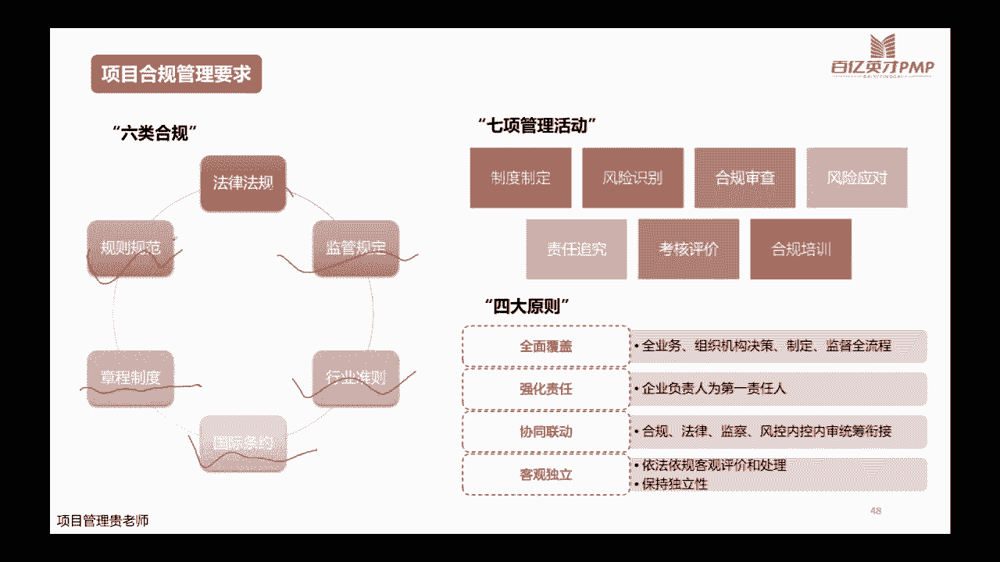

这个是我们围绕合规管理，都必须要做的一些内容嗯，重点领域呢去看看，比如说市场交易啊，安全环保呀啊产品质量啊，啊劳动用工啊，财务税收啊，知识产权和商业伙伴，这些都是我们啊，这是七大重点的知识。

重点的这个合规的领域哈，我们大家可能接触更多的就是劳务用工，劳动用工啊，举个最简单例子，比如说你去人家公司试用期不给你买社保，这就是不合规的，对不对啊，这触犯了法律法规，触犯了劳动法。

这就是不合规的哈哈对不对，当然还有更多哈，还有更多啊，考试如果考合规的话，他会告诉你啊，忽略那些合规性的要求，应该怎么办，所以他考的比较简单哈，考的会比较简单一些。

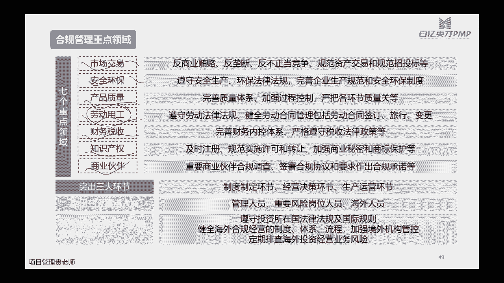

啊那不合规有什么影响啊，当然对企业要对政府，对社会合作伙伴啊啊都会有一些不好的影响，对员工啊，供应商啊，所以呢嗯既然哈，现在无论是从项目管理知识体系，还是从国家的政策开始啦，既然对合规性哈。

他有这么嗯重要性，有这么重大的一个提升哈，那么我们呢啊既然现在在学这个东西，也要从内心里面，物必把这个合规性把它重视起来哈，虽然有人会觉得哎呀啊，还是在实际当中，还是存在很多不合规的一些现象啊。

这个没办法，他需要一个过程啊，但是我们首先要从心里面把它重视起来哈，啊比如说啊你去医院看看医生啊，你要给他塞个红包啊，或者说这个老师去暗示你给他塞红包，这些都是不合规的，但是呢这种现象它仍然存在。

对不对，而存在它既是合理的啊，这个我们没办法，但是我们不要因为它存在就去质疑哈，就去质疑啊，说这个这个他也是合规的，不要这样去想哈，我们首先一定要从心里面去重视它，然后呢我们有义务哈。

有义务去正确的去引导我们身边的这些人啊，去重视合规，去参与合规，去合规哈。

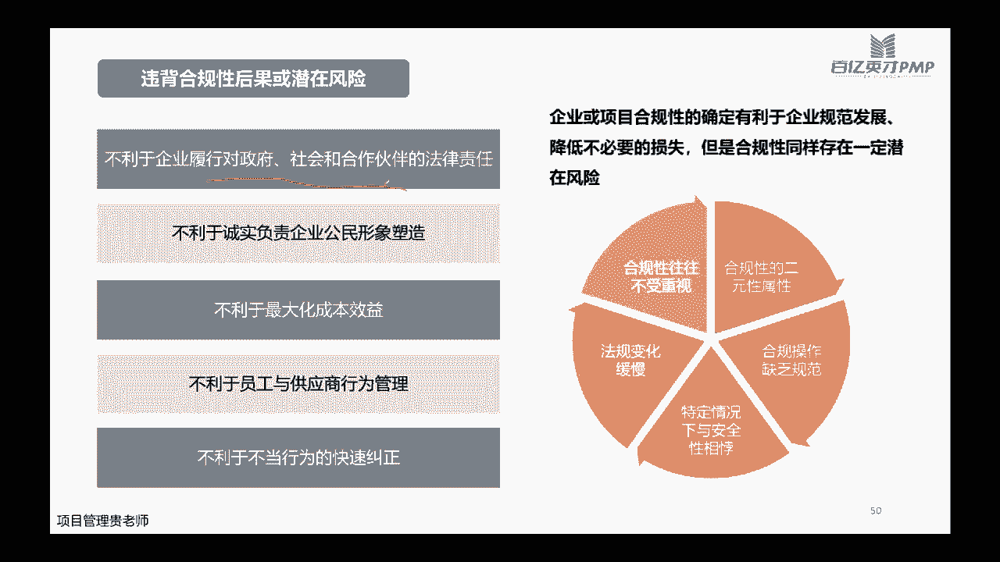

去做到合规，OK啊这一章节的内容给大家讲完了哈，几个例题跟大家过一下啊，第一题呢是说，公司之前的项目都由同一个供应商来提供服务，那作为项目经理应该把这个内容当做什么呢，由同一个供应商来提供服务啊。

那这个做我们项目之前，他是一个一个制约性的一个因素，也就是说你必须要考虑到，之前的服务都是由同一个供应商啊，你现在如果想选其他供应商，你是不是要突破一些条件啊，对不对，为什么你不选他的呢。

你要提供一系列的理由去说服你的领导，对不对，他是一个制约性的一个因素，那么第二个哈，第二题呢是说啊，你同时在管A也同时在管B，然后A呢是符合公司战略的，B呢是项目经理啊，直接领导啊。

是你的直属领导负责的，那现在两个项目有冲突啊，怎么办，你有权利解决吗，你没有权利解决啊，我们前面讲了，你没有权利解决，那你去找PO啊，对不对，找PO去协调PO也有这个义务。

对不同的项目对它的优先级进行排序，第三题呢是说经理，项目经理跟人力资源经理有不同意见，人力资源来负责啊，对对资源分配都可以提意见，那说明他是举证性的人力资源经理啊，真的经历他的权力更大，那我们说了。

他是一个弱级准啊，弱机制当中项目经理他的权利更小好第四题，第四题呢，他是说啊，这个项目不符合环境法规和细则，被严重的拖延了，这说明什么啊，他考的就是环境的法规，对不对，法律法规考的是我们合规性啊。

所以呢我们要确保他的合规性的要求，确保他的合规性的要求，然后呢做好合规性的一些义务。

所以你看他考其实考的比较简单哈，OK啊今天晚上的课程内容就讲到这了。

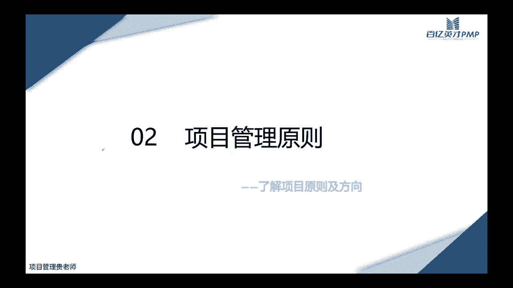

看看大家有没有对，今天晚上讲的内容有没有什么问题啊。

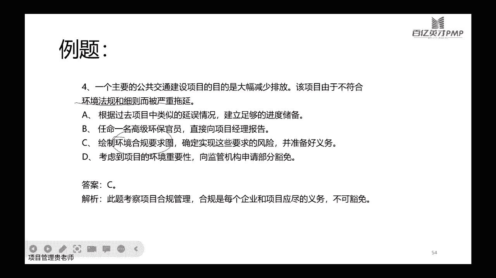

好，看看大家对今天晚上讲的课程有没有什么问题，给大家留2分钟的时间，这题讲的很快，哪题讲得很快，第四题吗，哦我明白了你，你不是说的第四题讲的很快，你就说我这四题都讲的很快，是不是，没关系哈。

嗯大家去看看讲义啊，看看这个教材里边，或者说你看回放的时候，你自己把题目读一下哈，你就知道了，嗯讲的是有点快，但是呢这个速度基本上是大家熟练之后，熟练它的题型之后，要确保的速度啊。

你想我们230分钟要做完180道题，你至少要留30分钟时间涂答题卡，剩下做题的时间只有200分钟，而且考试的题目他都很长很长，我这都是跟大家简化的题目啊，一两句话就写完了，但是考试的题目。

但是考试的试卷啊，他的这个题目它会很长很长啊，你这把读完题，然后还要抓住它的重点，抓住它的核心，然后呢还要把选项读完，再把你认为最正确的选项再把它选出来，至少你要保证一分钟做出一道题，这样的一个速度啊。

才有可能哈，才有可能保证你在200分钟之内，把180题全部都做完哈哈，所以呢嗯我下次哈，我下次争取跟大家，还是把题目稍微放慢一点点啊，但是呢慢不了太多哈，这个速度是要保证的。

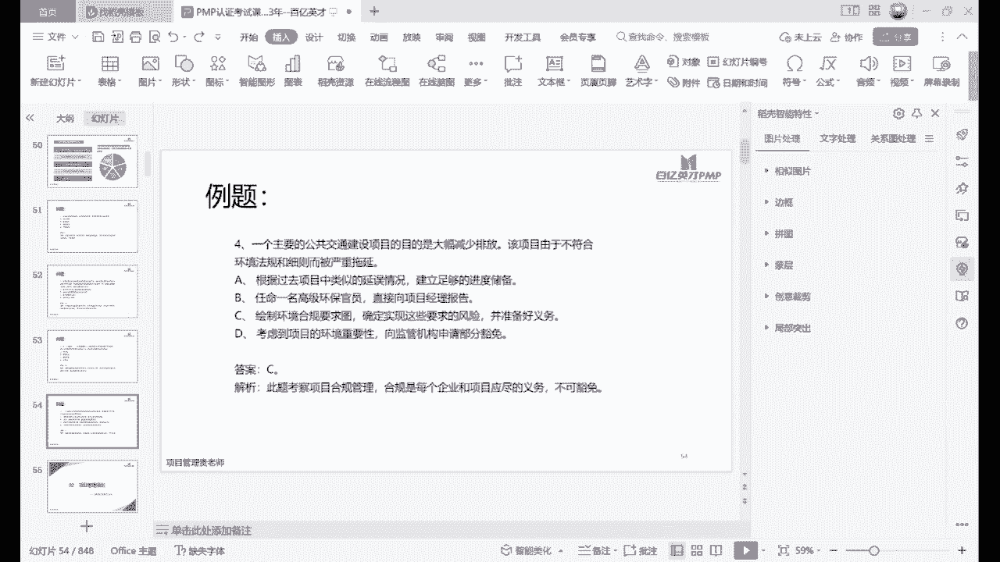