# 【直播精讲课】2023年11月班PMP项目管理认证考试培训课程第七版（更适合零基础） - P3：3.项目绩效域（开发方法和生命周期） - PMP专家 - BV1Jm4y1g7bE

那我们就直接开始吧，今天晚上我们讲的是，这是进入到我们的项目绩效域了，因为在一开始的时候，我跟大家说过，我们嗯这次的课程里面哈，项目绩效率占比他是最多的，为什么他其实他把我们的六版当中的工具啊。

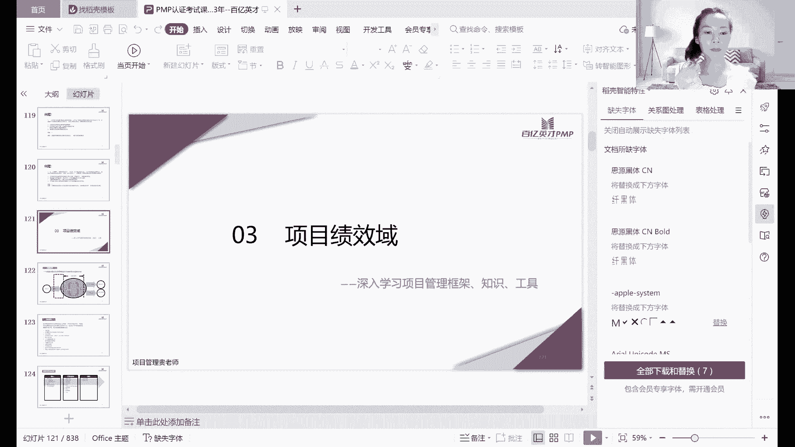

知识玉，还有我们七版当中的绩效率，还有我们敏捷实践指南当中的啊，运用于敏捷项目的具体的方法，工具和过程，其实都是打包融入在我们的项目的，绩效域里边的，所以呢绩效益，他虽然说诶看起来好像是第三个模块。

只是一个模块的内容，但是呢这个模块基本上占据了我们所有课件的，80%，也是我们的课程的时长，也是占了80%左右，当然跟我们考试呢，基本上80%的考试内容，也是来自于我们的项目绩效域这个部分的内容。

所以呢进入到项目绩效域之后呢，希望大家啊尽可能的能够跟上我们的直播，去听课哈，如果说实在因为有一些问题，直播没有听到啊，那么下去之后呢，第一个啊第一个及时的听一下回放，第二个呢是我们嗯助教老师。

在群里面有给大家发配套的一些练习题，这些练习题呢大家要去做，还要去做，就不要去这个阶段，不要大家去盲目的去啊，找一些很很多的一些这个小程序去刷题呀，怎么样，现在阶段不要做这个事情哈，当然以后备考的时候。

我也不希望大家去刷题哈，那个是后话了，到时候再说，但是现在呢先把我们配套的那些练习题，把它做好啊，做精通过做题再去回顾，再去巩固我们的知识点就OK了哈，OK那今天晚上我们讲的这个内容呢。

是我们的第一个绩效率哈，第一个绩效与开发方法和生命周期。

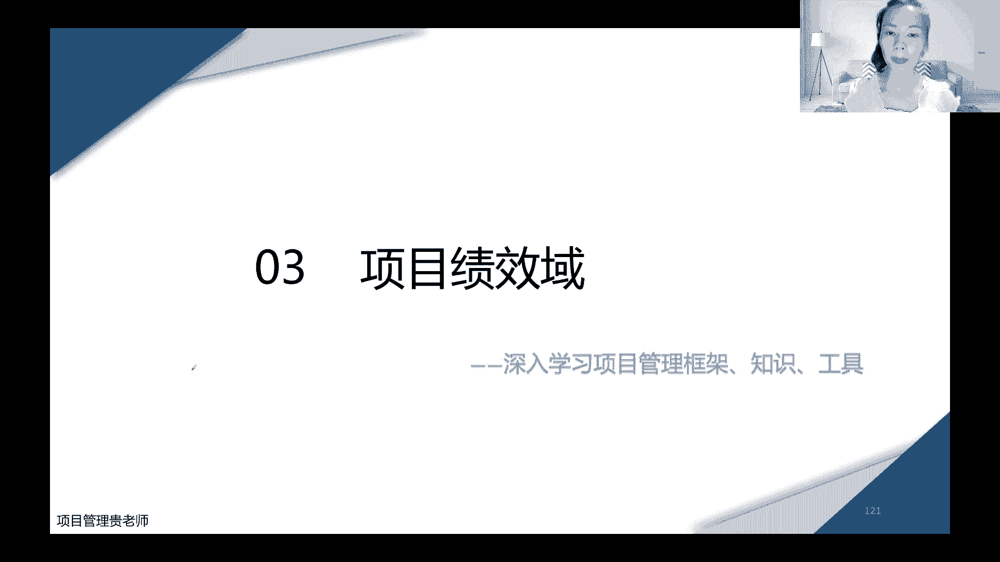

那么在讲开发方法和生命周期之前呢，先跟大家啊先过一下哈，既然我们说我们要做项目管理，对不对，那既然是项目管理管理，它一定是有一个边界的，是有一个边界的，那是因为我们项目本身啊，它是有一个边界的。

这个边界是从哪里开始呢，啊是从这里，是啊是是这一部分的内容，也就是说从项目正式启动，什么是正式启动呢，啊比如说你公司的授权啊，已经立项了，你已经被公司啊，被领导正式授权来管这个项目之后啊。

之后的这个动作之后的这些内容是归你管理，那么这是开始的边界，收尾的边界是什么呢，收尾的边界是你把这个项目他已经做出来了，可交付成果已经做出来了啊，做出来之后你可能是移交给你的，让他们去嗯，跟客户去沟通。

然后呢项目部或者是一些运维部可能是服务啊，可能是辅助辅助性的去跟客户做一些，进一步一些沟通，这是他传统的一些项目关系，那有些人可能就讲诶，那这样很简单呀，这样我只用在立项的框架之内。

把我的这些工作把它做好就OK是不是，但是如果说我们真的这样去想，真的在实际的项目当中这样去做的话，其实我们会会局限哈，会自己，把自己局限在狭义的项目管理的边界之内啊，虽然说理论上面讲项目的边界是这样子。

但是呢我们在实际做项目的过程当中，要尽可能的往前往后去延伸，什么意思呢，往前啊往这个地方去延伸，往后是往这个地方去延伸啊，什么意思呢，大家一看啊，我一讲大家就明白，往前医生。

你想往前医生是我们的商业文件啊，我们上节课讲过，商业在做项目之前要论证它的商业价值，要论证他的商业需要证明这个项目是可以做的，然后我们才去做它，对不对，那OK在公司里面，如果说你现在管项目哈。

如果你还没有接触到上项目的，商业论证的这个阶段，那说明什么呢啊说明至少在领导啊，在发起人的这个眼里，你还只是一个干活的啊，虽然说你觉得你做的是管理，但是呢人家领导或者老板认为你是他。

请来帮他管这个项目的，也是一个职业经理人，也是一个干活的，对不对，那你自己如果说主动的往我们前面的这个，商业论证这边去靠一靠啊，比如说你有很敏锐的市场的商机的发掘能力啊。

你能很敏锐的发觉到客户的一些新的一些需求，或者是销售部去跟他们配合啊，能够帮公司拿到更好的一些订单，或者说你能很敏锐地发现公司里面需要去变革，而需要去提升的一些点，从而呢能够去创造出来一些项目。

并且呢如果你还有能力去为这个项目找到啊，去外面找到一些资金，或者是找到一些有实力的人啊，来加盟啊，来入驻到我们的项目当中，那这个过程呢你其实是参与了哈，你其实是参与了从创造项目啊。

从创造项目到论证项目的这样的一个阶段，既然项目是你创造的，你当然是论证过他是值得做的，对不对，那如果说你能更多地去做好这一部分工作的话，那么显然公司的领导或者公司的老板，对于你而言啊。

你就慢慢地跨入到了从一个执行层，跨入到了一个决策层，或者说半个决策层这样的一个程度，那么既然你到了这样的一个程度，你想想我们是不是在我们的这个职位上面，会有所体现，在我们的回报上面也会有所体现。

对不对啊，这个是往前，那么往后是什么意思呢，啊往后你看看我们往后是什么，往后是要把我们的项目的可交付成果，交给客户啊，交给客户的过程当中，那你是不是就可以很好的去跟客户，更多的一些交流。

去得到他们更好的一些更多的一些反馈，得到反馈之后呢，我们能够知道诶，这个项目我们下一次还有可能做哪些改进，甚至呢我们在跟客户交流的过程当中啊，客户有一些新的需求啊，那通过我们的一些高情商的一些办法。

跟客户新签了一个合同，那你这个时候是不是又为公司创造价值了，是不是你如果说能够为公司创造价值啊，那你也是摆脱了原来老板对你的定位，就是干活的，摆脱了这样的一个角色，那项目进度呢。

如果说你能够通过这个项目很好的去复盘，你能够帮公司啊去创造更多的组织过程资产，能够去帮公司更好地去培养一批，从就像从黄埔军校出来的，一批能干的项目的团队成员，那么这个时候你对公司的价值也不再仅仅只是。

管好这样的一个项目的这样的一个执行者啊，所以我们在实践的过程当中，要尽可能的往前往后去拓展，去拓展自己的视野，去拓展自己的一些能力和经验哈。

那么对于项目的从前面启动的时候啊，我们说到要授权，那么什么叫授权，项目是通过什么文件来授权呢，是通过我们的项目的章程，项目的章程呢，可能大家在实际的啊工作当中，我不知道你们工作性质哈。

一般可能逆向逆向的程序一般都是有的，当然也有的公司哈，可能项目管理的他的整个程序特别不完善，特别不成熟，他连正式的立项程序也没有啊，就就领导一句话或者老板一句话啊，甚至发个邮件，发个微信给你克隆啊。

这个项目就开始了，也有这种哈，也有这种，但是呢这样肯定是风险是比较大的，出了问题没出问题都好，出了问题呢很多话说不清，但是呢大部分项目管理哈，这个程序管理的比较好啊，比较成熟一点的公司。

他至少都会有逆向哈，都会有逆向的，都会有逆向的这样的一个程序，那在我们项目管理的这一套知识体系里面呢，它叫做项目章程，是通过项目章程这样的一个文件，去启动逆向的这样的一个步骤哈，章程式文件，逆向式动作。

那么项目章程里面包含哪些东西呢，项目章程哈，他是我们启动者和发起人发布的，既然是我们启动者和发起人发布的发起人，也就是说发起做这个项目的人，对不对，那发起做项目的这样的一个角色哈，这个人记住哈。

这个人发起人他不是一个人哈，他有可能是一个人，他也有可能是一个部门，他也有可能是一个组织，一个公司都可以哈，既然项目是由他们发起的，那么他们肯定是有义务说清楚项目的框架，项目的框架是什么东西呢。

啊项目的框架首先做这个项目啊，是什么样的目的，这个总得有吧，对不对，要不然大家拿到项目章程，这项目干啥的都不知道，然后呢项目可以测量的项目的目标啊，或者是相关的成功的标准啊，那你肯定是有吧。

项目的一些高层次的一些需求啊，比如说你项目的啊，发起人你需要什么，然后你这个项目涉及到的啊，比如说你现在开发一个软件，你涉及到的用户啊，或者是你的这个客户，他的一些需求到底是什么啊。

同时呢项目的整体的描述，边界的定义和主要的可交付成果，交付一个可使用的软件呢，有没有服务器呀，有没有用户手册呀啊等等，你的可交付成果是什么项目，有没有一些大的一些风险，好比如说这个项目啊。

我们的服务器是租的啊，或者是你用的这个呃这个其他的一些存储，云存储什么的，你是用的其他公司的，那这个公司的稳稳不稳定啊，性能好不好，这个可能就是我们的项目，因为是我们没有办法控制的。

那可能是一个风险点之一，同时呢这个项目他的里程碑啊，进度计划是什么样子对吧，你做这个项目，比如说大家考这个PMP哈，我们备考三个月，对不对，备考三个月，那么啊每一个月或者说啊每一个阶段。

我们总得有一些里程碑的一些点，对不对啊，总不能说我现在啊我要开始备考片拼，人家问你打算什么时候拿到这个证书，不知道无所谓，什么时候考试，什么时候拿到，那你就完全没有计划，对不对。

所以我们做项目不能这样子，他有一个进度计划啊，同时呢还有一些预先批准的一些财务资源啊，比如说大家考批量批报名费，培训报名费，考试报名费，对不对，这就是显而易见的一些财务的一些成本啊，这个肯定是有的啊。

不能说人家问你，你打算花多少钱考个PMP啊啊无所谓，大家都知道我PMP争取要一次过哈，国内通过率还是比较高的，如果不过有什么不好的点呢，首先最大的不好的点就是你补考要交钱啊，补考一般是要交2500。

考试费是三千三千九，对不对啊，所以你首先啊比如说你现在资金有限啊，啊我预定了，我一定要在就是一次的培训费，加上一次的考试费，我一定要考过啊，我的预算只有这么点啊，那OK那就是你的一些可用的一些预算。

对不对，还有关键的相关方的一些名单啊，这个得有项目的审批的要求和，退出的标准也得有，同时呢非常重要的一点，我这个项目我安排谁安排谁承担我的项目经理，他的项目经理的职责和职权到底有哪些，同时呢啊。

发起人或者是其他能够批准，我们这个项目章程的人员，他们的姓名啊，职务啊啊或者职权啊，到底是哪些，这个项目章程就是这样的一个东西，这样的一个东西呢它叫做整体的项目的框架，整体的项目框架。

有了这个项目章程之后呢，啊章程签批了之后，我们就可以说这个项目他已经正式的批准了，正式的成立了哈。

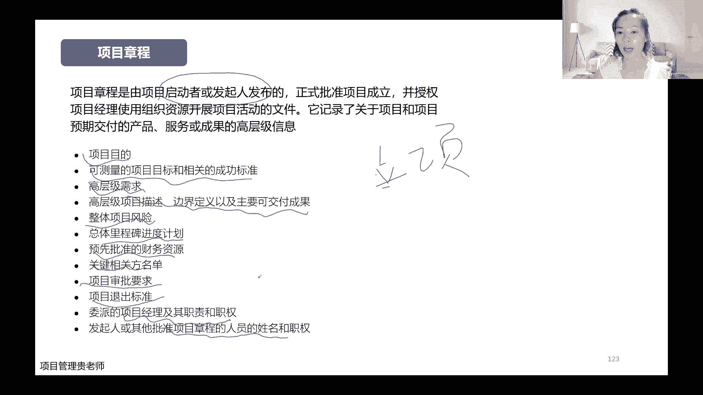

所以启动是从这里开始的，那么制定章程呢，它有它的一个输入和输出的一些过程啊，它的输入当然就是我们的商业文件了啊，证明了这个项目他是能够做的，对不对，同时呢还有一些协议，尤其是外部来的这些项目。

客户给我们的一些订单啊，我们为了做好客户的这个订单，有一些研发的一些性质啊，协议，那么工具呢啊这个首先说一下这个框架哈，就是大家在我们的课件里面会看到很多的输入，工具和技术和输出。

这个就是我们第六版的所有的精髓哈，所有的精髓I叫ITTO啊，输入in out输出，然后两个T1个是代表工具，一个是代表技术哈，ITT会建的非常多，他的意思就是我们输入什么样的文件。

通过什么样的工具和技术呢，这个完成这个动作之后，可以输出什么样的一些项目的一些工具好，可以接着说，那么制定项目章程，这里面呢它的工具和技术主要是用到一些啊，焦点小组啊，访谈啊，头脑风暴啊等等。

这些技术到底怎么用呢，在讲需求的时候跟大家具体讲到哈，那么它的输出核心呢，当然就是我们的项目章程和一些假设的日志。

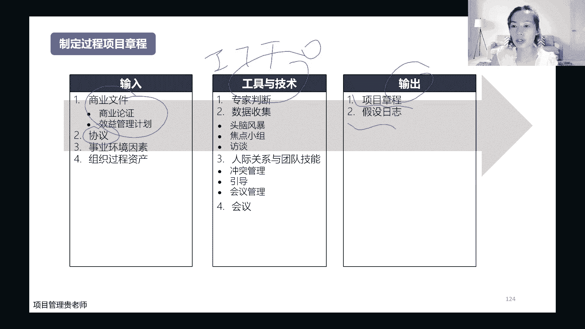

项目的章程刚刚跟大家说了哈，包含那么多高层次的一些东西，这给大家一个范例哈，一个事例啊，项目的名称，授权的日期，开始日期，结束日期，关键里程碑啊，比如说什么什么时间，几月几日完成第一期产品的开发。

几月几日完成第二批产品的开发，它的预算是多少啊，他的项目经理，项目标完成的标准方法，还有主要涉及到的一些项目的一些角色，和他的一些职责签署人，还有一些高层次的一些意见。

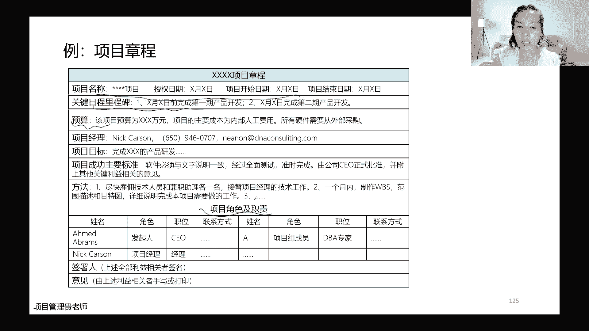

这个是我们项目章程里面，所要列明的一些核心的一些内容，那么假设日志是什么意思呢，我们刚刚说假设日志也是它的一个输出啊，假设日志呢它是用于记录整个生命周期当中的，所有一些假设的条件和制约的一些因素啊。

假设条件就是我们拟定啊，我们假设它成立的制约因素是现实客观存在的。

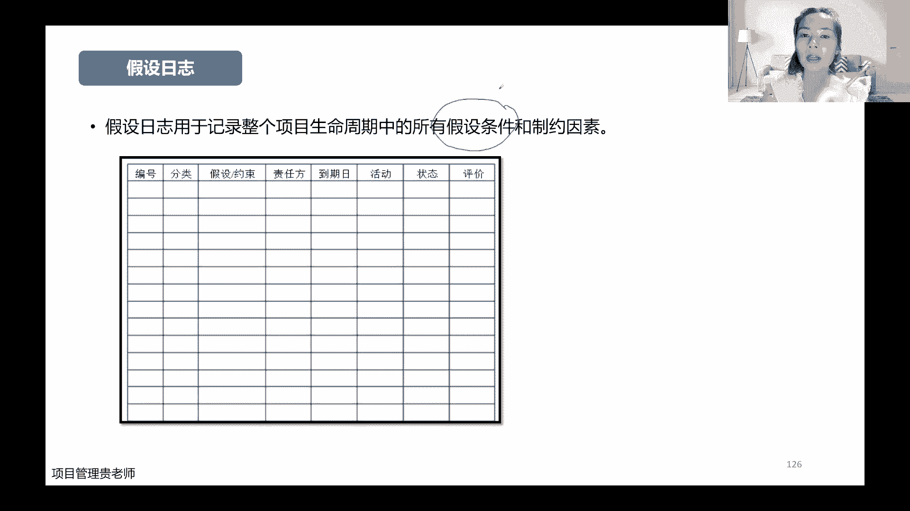

现实客观存在的一些条件，好啊，那么现在呢大家了解了哈，了解了我们项目的边界啊，了解了我们的项目的章程啊，了解到我们项目正式启动了哈，那我们现在启动之前啊，启动之后要干什么呢。

启动之后要首先要看一下这个项目的性质哈，因为我们通过看这个项目章程，我们可以分析出来，这个项目它更加适合哪一种开发方法，对不对，我们接下来马上要管理这个项目呀，对不对，那马上要管理这个项目。

我们当然要知道这个项目，它的生命周期是什么样的特点，不同的生命周期对应着啊，对应着不同的管理办法，对不对，那什么决定的项目的生命周期呢，是由我们的项目的开发方法决定的。

什么开发方法就对应着什么样的生命周期，什么样的生命周期，决定了我们要怎么去管理这个项目哈，所以他的第一个绩效率呢，是开发方法和生命周期绩效率，那这个绩效育里面呢我们会重点学哈。

会重点学跟项目的可交付相符的，它的开发方法有哪些，每一些开发方法，每一种开发方法，它分别对应的特点和应用的场景是什么样子的，同时呢，从项目开始到结束，各个阶段组成的这个项目生命周期。

它的特点是什么样子的，并且呢我们还会了解到一个新的概念，叫做交互的节奏啊，交付的节奏呢它又分了一次性的交互啊，持续性的交付啊，啊多次交付啊等等，那接下来我们就重点看一看哈。

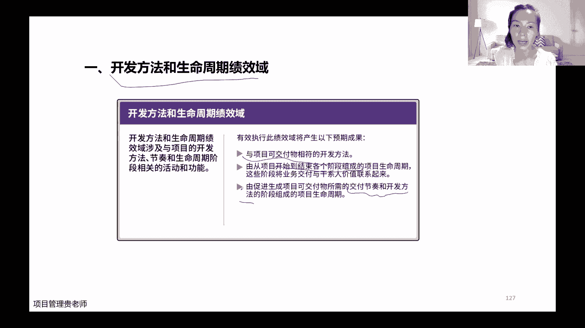

这个是里面涉及到的一些专业的一些术语哈，大家可以看一下可交付，因为我们讲的是开发方法，它是取决于我们的可交互和交互节奏哈，交付节奏，那我们要知道可交互呢，其实在第一节课的时候跟大家讲过。

讲项目的概述的时候讲过，他就是啊能够产生那些产品结果或者服务能力，开发方法呢是我为了哈，我为了去得到这样的可交付物，用的什么样的创建的一个过程的一个方法，一般情况下它会有预测性的项目啊。

预测性的开发方法，迭代性的开发方法，增量型的开发方法和敏捷型的开发方法哈，敏捷型的开发方法呢，我们又叫做适应性的开发方法，那么节奏节奏呢当然就是我们啊什么什么节奏，每次开展不同的项目的活动。

它的一些节律阶段是什么意思呢，阶段是我们啊以一个或者多个可交付的完成，为结束这样的一个阶段生命周期，当然就是讲我们从开始到所有的项目，最终结束所经历的所有的阶段，这个是称我们的项目生命周期哈。

这个简单过一下。

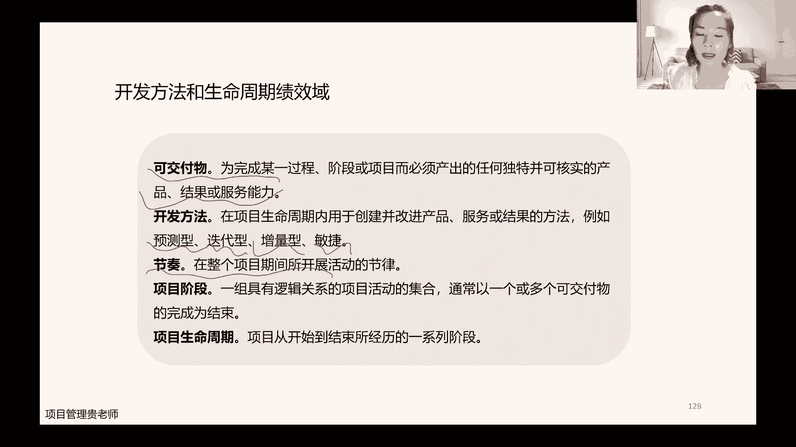

那么交付的节奏呢，定期的交付和多次的交付，一次性的交付很简单啊，这个所有的可交付它才能够整体的交付，比如说你去买辆车，对不对啊，你去吃你去车，你买车你肯定是在整车厂，整车厂。

他才能够把这个车的零部件都把它组装起来，才能够交给你，对不对，你能说你自己去买四个轮子吗，买方向盘买，买车身，你能这样去买吗，买不了，对不对，第一你买不了，第二你买了之后，你也很难去把它使用起来啊。

比如说你装修一个房子，你能说啊，我现在给你把墙，或者我给你把地，给你把地找平了，那水电还没做，你就先住进来吧，你边住进来，我边给你做水电行吗，不行对不对，我只有把所有的装修的工作都把它做完了之后。

我才能交给你，你才能入住呀，对不对，但这种项目典型的一次性的交付哈，所以大家也看到我刚举的例子哈，车也好啊，装修也好，这些项目它有个特点哈，同时呢这一类的项目它的框架啊。

我们前面讲项目章程决定了项目的框架，它的框架基本上是可以去预测好的哈，所以可以，所以我们可以推断出来预测性的项目啊，预测性的项目，它一般情况下都是一次性的交付哈，一次性的交付。

当然也不排除在某些情况下啊，它可以分阶段定期交付，当然这个定期它的时间周期也会相对更长哈，比如说我们还是一个装修，我们装修整栋楼，对不对，那我能不能先装修一二层啊，我全部都做完了，一二层，你先入住啊。

先交付，然后呢我在装修三四层啊，我再给你交付三四层行不行呢，行对不对，行哈也行，这种也是预测性项目，所以呢他这种也是定期的交付啊，这个不是绝对的，只能说绝大多数都是异性的交付哈。

那么多次交付呢是什么意思呢，多次交付，比如说我们的有时候项目啊它包含多个组件啊，比如说我现在我是一个啊，咱们是一个整车厂的一个项目经理，对不对，那么整车厂的项目经理。

你需要去啊负责这个车的它的整体的组装，那么你需要有各个不同的一些部件，对不对，那你需要有不同的各个部件啊，那么对于这些供应商，对于你而言，那他交付给你这些东西，交付给你这些部件，它就是多次性的一个交付。

而且在不同的时间对不对，那么什么是定期交付呢，其实定期交付啊，它也是多次交付的一种，只不过说呢它的周期，它的交付的周期是定期的啊，是按照固定的日期啊，比如说每两个月或者说每半年要交付一些东西。

那其实还有一种呢叫做持续性的交付，持续性的交付呢，一般就是我们一些小批量的，或者是一些自动化的啊，就一直在给你交付，一直在给你交付，你自己没有办法去约定他的一些期限啊，这个是交互节奏。

为什么要讲交互节奏呢，因为交互节奏它是跟我们的项目的生命周期啊，是跟我们的开发方法是严格挂钩的，那项目周期啊，刚刚讲从启动到项目结束的所有的这个阶段，叫做项目生命周期，对不对，那么讲到这儿。

大家还记不记得，我们上节课讲过长命的生命周期，产品的生命周期还包括哪些，还记得哦，包括产品啊，一个理论，也就是我们构建的一个阶段，到成长到成熟，到衰退，这是我们产品的生命周期。

为了让我们的产品而能够尽可能的能够，尽可能晚的经历他的衰退区，我们要不断的去变革，不断的去创新，对不对，那有了创新项目就出来了啊，有了项目，项目生命周期，项目生命周期呢是从我们项目的启动。

当我们开始准备做这个项目啊，到真正的开始做啊，最后到项目的成果出来之后，我们去结束整个项目的阶段。

这个呢叫做项目的生命周期哈，叫做项目的生命周期，那么对于我们传统的，或者对于我们目前pp用的最多的，这些软件行业来说呢，它的项目真命周期包含了不同的阶段哈，首先可行性研究阶段。

也就是说我们去做商业论证的这样的一个步骤，那么论证好这个项目是可以做的，我们要进入到设计的阶段啊，设计的阶段，通过设计啊，设计出来，我们将要做的这些可交付它的一些成果，他的一些标准，他的一些过程。

其次呢第三个呢是进入到了我们的构建阶段啊，也就是通过我们设计规划好的这些内容啊，去把我们想要的这些可交付成果，去把它做出来啊，去把它做出来，保质保量的做出来，最后呢到了测试阶段，哎我们说保质保量。

但是我们不能确保他一定是的，对不对，我们要进行测试啊，在它上线或者是在客户验收之前，我们要给他做最终的一些质量的审查，第五个阶段呢是到了部署阶段，审查过了之后，我们要去客户现场去给他部署。

去保证它能够在客户的现场去稳定啊，去稳定的实现它的一些功能，最后呢进入到了收尾的阶段，收尾的阶段啊，比如说我们要去给客户啊，交付完了之后要催客户回款呀，对不对，领导最关心这个了。

然后呢我们还要把这个项目当中，它发生的啊一些过程的一些经验要总结啊，啊，这些项目性的一些知识和一些工建，要把它去归档，同时呢我们的团队该结合的该解散的要解散啊，合同该关闭的要关闭啊，对不对。

这个是我们通用的软件项目的，它的一些生命的周期哈，那么前面讲生命周期有典型的有四种，对不对啊，开发方法典型的有四种，那么生命周期也是一样的哈，首先预测型的生命周期，预测性的生命周期呢啊。

你看它就是从我们不同阶段可行性，你只有做完了之后，你才能够进入到设计阶段，对不对，你设计好了之后，你才能够进入到构建阶段，构建完了之后，你才能够进入到测试，才能够进入到部署，然后才能收尾，对不对。

他每一个阶段是依附于前面一个阶段，完成之后，是依附于前面一个阶段产生的，阶段性的可交付成果，他才能够顺利的进入下一个阶段，所以呢他基本上哈，他的下一个阶段要产生什么样的必入的条件。

这个阶段要产生什么必出的，这些可交付的成果都是可以预测的，都是可以固定的哈，那么对于适应性的，对于我们敏捷的生命周期而言，它是不断的在去迭代啊，再去迭代，比如说我们最开始我们只有一个高层次的。

一个产品的一个定义啊，或者是一个项目的一个框架，那么我们现在不知道它的质量怎么样，不知道它的技术啊会迭代成什么样子啊，比如说现在我们做一个人工智能的一个，基于一切的GPT啊，要研发出一些新的一些产品。

那么研发出了一些新的产品，我们也不知道它最终这个产品会走向什么地方，对不对，我们只知道他第一步啊需要实现什么样的功能，比如说第一步我要实现它的啊很好的一些绘画，然后第二呢我要实现它的基本的问答。

并且问答最好是没有提示词的，那第三步呢，我还要去实现它能不能够没有什么障碍的啊，没有什么障碍的，直接去啊，更好的去问答会议题，没有什么次数的限制，成本更低啊，或者第四步呢我还能够让我让他画出来的话。

能够自动生成视频啊，能够动起来，对不对，所以呢我们这种项目呢，它要经过一次又一次的迭代去验证，去验证，最终能够把这个产品把它做得更好，那对于增量性的生命周期呢，它是我们这个项目的。

也是一个高层次的一个定义，高层的一些愿景呢出来之后，那OK我们要计划设计构建，构建完了之后呢，我们就可能会做一些小批量的一些交付，然后做完了之后呢，我们还要重复性的再做下一个部件。

下一个要教的这一部分功能，要计划要设计，要构建啊，这一部分功能完成了之后，到第三个功能呢，我还是要重新的去计划，去设计，去构建，它是增量生命周期的一个模型，那这四种生命周期的模型啊。

当然迭代和增量都在一块哈，都有的，它就叫做我们的敏捷型哈，那么四种生命周期的模型呢，再跟大家去总结一下它的一些特点哈，总结一下特点，预测性的生命周期呢，它既然是一步又一步啊，一步完成才能够决定下一步。

对不对，所以它的范围进度和成本，在我们的早期就是能够去确定的啊，能够去确定的，那既然能够确定了，我们对于这个项目它的可交付，对它的产品是有基本的认知的，还是有基本的认知的，所以对预测型生命周期而言呢。

项目的经验哈，项目的类似的项目的经验是非常重要的，是非常重要的，为什么呢，因为你的经验他就可以直接拿来用哈，直接拿来用在进度上面啊，进度的规划上面，在成本的预测上面，在风险的预估上面啊。

你的过往的经验就非常有价值哈，那么第二个呢我们刚刚讲迭代性的生命周期好，先讲到这吧，迭代性的周密周期啊，他刚刚大家可以看到我们那个图啊，它就是经过我们一系列重复的循环的活动，来开发出我们的一些产品。

那么对于迭代性的生命周期而言呢，它一般情况下哈，比如说我想做什么样的一个产品啊，最开始的时候我的愿景是相对比较明确的，但是呢为了达到我的这个愿景，我到底要做哪些工作内容呢。

其实我是啊工作内容在我们的项目当中，它叫做范围哈，它叫做范围范围呢是相对是不太明确的，我们只能随着我们一次又一次的迭代啊，它完成的功能迭代之后，每一个迭代它都会有一些增亮出来，那么这个增量啊。

这个产品的增量它到底能不能完成，我们心里面想要的那些需求，我们只有做出来之后再看，根据我们做出来的成果再去不断的去修改，那对于增量型的生命周期呢，它一般情况下啊，它一般情况下它是我们的需求啊。

是不太明确的，还是不太明确的，我们的需求不太明确，然后技术呢相对比较明确一点，但是因为我不知道我需要什么，我只能先做一部分啊，我需要了，但是我觉得还不够啊，我还吃不够，那么你再给我做第二部分。

那么最后一种呢是敏捷性的生命周期，敏捷性的生命周期呢，它一般是我们它一般是我们增量性的特点有啊，增量性的特点是我从部分到整体，一部分一部分的教，最后合成一个整体，迭代性的特点呢。

是我通过不断的循环去更新它的质量，去更新它的技术，敏捷的项目，它是增量性的特征，也有迭代性的特征也有，所以敏捷是相对而言是更加复杂的。

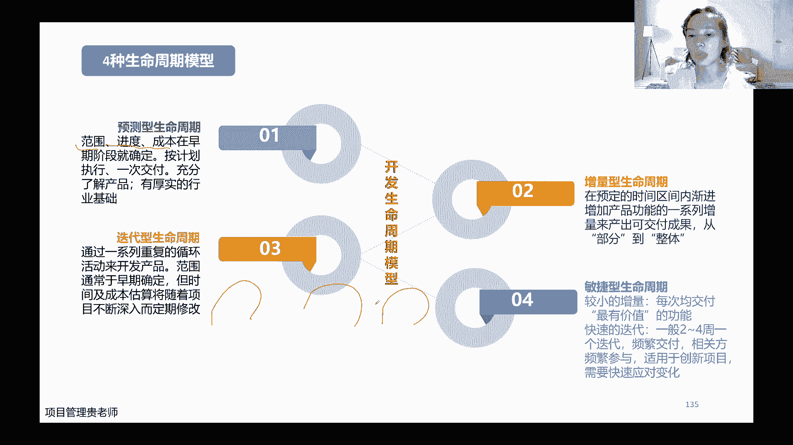

是更加复杂的，那么这种对比的模型呢，我又用这个表的形式哈，用这个表的形式再给大家去罗列了一下哈，预测型的需求在开发之前就已经确定了，需求，确定范围，确定进度和成本都有框架，迭代型和增量型的需求。

是交付期间定期的去细化，敏捷型呢它的需求是完全没有办法去固化啊，你只能在交付的期间，不断的去随着交付的内容去把它细化，预测性的项目呢对于变更而言哈，我们既然是范围，这些都是预先能够去确定的。

那既然能确定，我就希望哈，我就希望在做的过程当中尽可能少的变更，尽可能少的变更，但是呢迭代和增量型的是我定期啊，定期是允许变更的，尤其是我增量我交了一部分，那么下一部分需要有什么改进意见。

需要有什么新的一些点啊，那我可以定期的去把变更，融入到我的项目当中来，但是对于完全敏捷性的项目而言呢，对于这个变更哈，对这个变更我们是拥抱的，我们是拥抱的，我们随时欢迎我们的客户，随时欢迎我们的用户。

随时欢迎我们的团队成员，给我们提出一些好的一些点子啊，这些好的一些创意，好的一些意见可以帮助我们的价值最大化，那对于相关方的参与程度而言呢，对于预测性的项目啊，既然你这框架都是定好的。

那你相关方你只需要在我特定的里程碑，你觉得比较重要的，你特别关心的那个点，你来听听汇报就可以了哈，就可以了，平时不需要，为什么平时我们都是按照框架走的，你来或者不来，那个框架就在那个地方，对不对。

那对于迭代和增量型的是，我们希望相关方它能够定期的参与啊，比如说我迭代，我每一次迭代，我在做评审会的时候，我希望希望官方能够参加啊，能够看看我们这一期的啊，产品的成果满不满足需求，对增量型的也是啊。

我在交付这一部分组件的时候，我也希望你参与进来，你来帮我验收一下，对于敏捷性呢啊，我们是希望相关方持续性的参与啊，你只要有需要，你只要有意见，你随时可以来参与啊，那对于风险控制而言呢。

我们预测性的项目是通过编制详细的计划啊，通过我们的计划文档来控制我们的风险和成本，对迭代和增量型的呢，我们是通过新信息，随着项目的进展来一些信息不断的去建立明细，来不断的去细化。

那我们通过细化这些计划来控制，那对于敏捷型的适应性的项目呢，我们随着需求和这些因素逐渐去凸显啊。

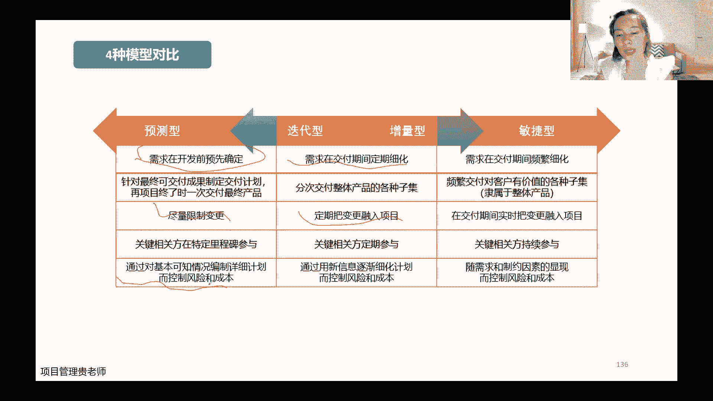

随机应变啊，去控制我们的风险和成本，当然这个随机应变不是说，大家想做什么就做什么，这个随机应变是基于我们对市场和对项目，综合的判断而言的，那既然有四种不同的生命周期哈，那么什么情况下面使用这四种呢。

什么情况下面怎么去选择呢，我们可以用到我们讲过的一个模型哈，这个模型呢啊不知道大家还记不记得哈，不记得的没有关系，我帮大家去回顾一下，我们在讲复杂性模型，在讲不确定性原则的时候。

讲过一个讲过一个复杂性模型啊，叫太息矩阵，这个太虚体质呢，就是根据我们项目它的需求的不确定性，和技术的不确定性，把项目分了不同的类型和不同的类型，我们讲过，首先第一种呢他的需求比较确定。

技术也比较确定的，作为项目就相对比较简单，相对比较简单呢，我们这种用预测性的开发方法，对应着预测性的生命周期，那对于他的需求啊，对于他的需求比较明确，但是呢技术不太明确啊，这种我们叫做复杂。

我们有迭代性的，那对于需求不太明确，但是技术呢相对明确的，我们只能说他因为技术比较明确，他不复杂啊，他有一定的复杂，但是他比较烧了，他为他的技术是明确，但是他的需求不明确哈，这种我们叫做啊。

这种我们用增量型的开发方法，对应着增量型的生命周期，那对于需求不太明确，技术也不太明确的呢，我们把它叫做特别模糊的这种项目，我们有敏捷性的，那最后一种呢是他的需求和技术，完全啊完全无序啊，完全无序。

我们称为这种状态叫做一种混乱的状态啊，混乱的状态用什么开发方法呢，混乱的状态，这个我只能说啊太混乱了，我们尽量的去观察，先不要去碰它，先不要去碰它，那么举个例子哈，以往很多学员都嗯很容易把我们的嗯。

增量型和迭代型啊，会把这两种去把它弄混啊，我给大家举一个简单的例子，大家就理解了哈啊举一个还是举做饭的例子，我觉得举做饭做饭的例子，大家都能够理解哈，比如说啊比如说你现在要去在家里哈。

要去请你的女朋友在家里来吃一顿饭啊，要去吃一顿饭，那么你现在呢嗯吃饭你要做好几个菜，对不对啊，你做了一盘凉拌西红柿啊，然后呢你端上桌了，这是凉拌西红柿，是你的第一个增量的成果。

那么你做了光做一个菜不够啊，你又做了一个做了一个红烧肉啊，做了一盘红烧肉，做了一盘红烧肉呢，你又觉得好像还不太够啊，缺少一点营养的搭配，就一混元素不太好啊，那你又烤了一个鸡翅，然后呢你还准备了一个红酒。

然后呢你还切了一盘水果啊，对不对，你一盘这每一盘菜哈，当然我们把水果当做菜了哈，这每一盘菜都是你在做饭的这样的一个，整体项目当中啊，你去实现的一些增量，对做饭做这些菜，做这五个菜而言。

你其实你最开始你也不确定啊，到底要做几个菜，你边做边想边做边想啊，你的需求在最开始是不太确定的，你只能在做的过程当中，你不断的去明晰，但是呢做每一道菜呢啊，你这你这些菜对于你而言，你都是轻车熟路了啊。

你很会做啊，所以他的技术是不存在什么问题的，只是说呢他的需求啊不太明确，或者说呢你甚至端上桌之后，你女朋友发现好像啊这个红酒还缺了一点，然后呢你又去整了一点红酒啊，饮料还缺了点，你又整了一点饮料啊。

这个是你在交付的过程当中，你女朋友给你提的意见，你通过他提的意见，然后呢你又去修订了你的整个项目，它的一些需求和一些范围啊，这个是我们增量级，那什么是迭代性的迭代性啊，还是这样子。

你现在呢你又把你女朋友叫到家里来吃饭，你说今天我要给你做一个大菜，我要给你做一个什么呢，我要给你做一个松鼠鱼啊，女朋友听很高兴哈，那你去做松鼠鱼呢，结果你花了一个下午的时间，因为你从来没有做过呀。

对不对，你很明确，你要做松鼠鱼啊，你需求很明确，为了做好松鼠鱼，你买的鱼啊，买了番茄酱啊，买了等等其他的一些这个配需要配的一些东西，但是你在做的时候呢，因为你没有做过，所以你第一次可能做的比较失败啊。

你可能做的比较失败，然后呢你做了好几次啊，做了好几次他才不断的A做的越来越好了，那这种呢很明显，我们因为最开始要知道要做番茄鱼啊，要做那个松鼠鱼，所以你的需求是相对比较明确的。

但是呢因为你的技术还不太成熟，你需要在一次又一次的过程当中，去不断的让你的技术去啊锻炼啊，去迭代，所以呢这样举一个例子哈，大家都知道了，迭代和增量它们本质哈还是有一些区别的，那对于敏捷型而言。

当然我们既然说了，它是啊迭代开发增量交付，那一直就不用举哈，举起我们的软件啊，随便列款列出来一款app啊，随便弄一个软件的项目出来，大家都知道这种软件项目，他肯定是我们敏捷型的，它的需求也不确定。

他的技术也不成熟，对不对，当然有些人非要抬杠说啊，老师我们的技术很成熟啊，我们有很多模块，可能我们都是做其他的一些这个公司，客户的一些项目，可能我们都是有些模块都是直接打包过来的，我这技术很成熟啊。

不要这样抬杠就没有意思了，对不对，好啊，那在我们考试当中哈，考试当中他嗯不同的这个项目呢考哪些啊，考第一考预测啊，第二考试应中间还会穿插着一种混合，大概是45%，45%和10%这样的一个比例。

那么随着我们从预测到适应啊，从左边到右边呢，它的项目当中的迭代和增量性的这种特性，是逐渐的增加的，但我们适应性呢它是完全的迭代，完全的增量，但我们预测性呢，它的迭代和增量的特性会非常非常的小哈。

这个混合型开发法因为是新提出来的哈，混合型的开发方法其实很简单，它就是既有敏捷的一些特点啊，既有我们适应性的特点，又有预测性的方法的特点，有些人觉得诶什么项目会具有适应性的特点，又有预测性的特点呢。

很简单，也给大家举一个例子就知道了哈，给大家举个例子，比如说啊，比如说现在嗯你去给别人做一个项目啊，沉积了甲方的一个项目，这个项目是做什么呢，嗯比作比如说是做一个啊做一个智慧楼宇啊。

这个例子这个例子最好了，比如说是给甲方做一个智慧楼宇的一个装修啊，那么你首先是不是要装楼，对不对，装楼我们刚刚讲了庄楼，你肯定要最开始设计好它的图纸啊，啊设计好图纸之后，然后还有他的施工图出来之后。

你才能去进厂啊，才能去动工，对不对，但是我们既然说你智慧楼宇，那你肯定要有一些啊物联网的一些设施啊，一些系统，对不对，那这些系统软件，我们要用一些敏捷性的一些方法，对不对。

这个就是典型的一些适应性的方法和敏捷性，敏捷性方法都有的一些结合体啊，至于下面的适应性方法和前面预测性方法，因为前面讲了很多他的一些特点啊，所以呢就不再继续讲了，那怎么去选择呢，除了我们刚刚讲的。

除了我们刚刚讲的那个太息矩阵啊，从他的需求和从他的一些技术的一些，不确定性去判断，那从我们项目的实际的他的一些要素来看呢，也有一些考虑一些办法哈，首先从产品服务和成果啊。

服务和结果从这些特点来考虑的话啊，比如说我们可以考虑这个产品啊，这个项目它的一些创新程度，如果说他的创新程度比较高，那我们显然因为创新比较高，所以他们的不确定性比较强。

那我们显然啊用预测性的方法就不太合适啊，因为它的创新程度太高了，从需求的不确定性刚刚讲了，从范围的稳定性而言，也是哈范围当然越稳定，我们就尽可能的选择一些预测性的，如果说它的范围不太稳定啊，不很不稳定。

我们当然是更加偏适应性的，从变更的难易程度而言呢，也是如果他很容易就变更了啊，那我们当然是选择一些适应性的，如果它很难变更，变更的程序非常非常的复杂啊，那我们还是尽可能的用一些预测性的办法。

尽可能减少这种变更，那从交付的选项方案呢啊我们也是可以看到，比如说交付它是让你一次性的就交付，那我们显然就用预测性能比较好，让你去频繁的持续的交付，那我们用适应性的比较好，从风险而言。

那如果说他的风险相对而言啊，相对而言比较小啊，一眼可见，那我们当然有预测性能比较好，如果说他的风险非常的不稳定，风险非常大，那我们当然用适应性的，随着风险的变化逐渐的去调整。

逐渐的去给我们的客家夫成果做一些漂移啊，从安全需求而言，从法规啊，我这两个我一块讲哈，因为这两个都是外部我们不可以控制的一些啊，一些这个外部环境哈，一些事业环境因素，那对于安全需求和和法规性要求而言。

如果说他们的要求非常非常的严，那不容突破，那我们当然是在这一期框架之下，尽可能的用预测性方法，把安全需求和法规要求把它列明，严格按照我们的框架走，当然如果说他的安全需求和法规需求，非常的弱哈。

没有什么需求，那我们当然用适应性比较好啊，对于项目啊本身而言，比如说它的干系人啊，比如说我们的干系人，他只能啊他一年才见到一回，对不对，他只能在定期的一些重要的节点参与。

那我们显然用预测性的方法啊比较合适，但如果说现在他的客户该性人呢，他很想，那他恨不得天天跟你的项目团队待在一块儿啊，那这个时候呢我们显然用适应性的啊，也是比较的合适，比较合适。

从进度的制约和资金的可用的情况而言呢，如果说资金和进度卡的比较死，卡的比较严，那当然我们也只能尽可能的他是卡的比较严嘛，我们当然尽可能的去靠预测，如果说如果说他的他的这个呃，允许去浮动的范围非常的广哈。

那我们当然它更浮桥的适应性的一些特点，那从组织方面去考虑呢，比如说组织的一些文化啊，或者是一些组织的结构，比如说这个组织，它就是完完全全的职能性的组织，连项目经理的这个专职都没有。

那你显然这种可能比较适合预测，对不对，适合预测条条框框比较多啊，包括文化也是的啊，比较老旧就比较多啊，那这种都是符合我们预测性的一些特点，那如果说是适应性的，比如说现在整个公司的啊。

他的管理就比较扁平化嗯，比较扁平化管理，非常鼓励大家有意见多说意见，有想法随时沟通你的想法，那这种我们显然也比较适合一些，适应性的一些特点哈，当然它对应的文化就是比较开放的，比较轻松的比较啊。

就是有点类似于这种互联网文化哈，那从团队的规模和所处的位置而言呢，如果说这个团队非常的小哈，那么并且大家都在一块，那显然它是比较符合我们适应性，项目的一些特点，那如果说这个项目的团队哈。

他非常非常的庞大，好几百个人啊，甚至好几个大几十人的这种项目，所处的位置呢也比较分散啊，这种不便于管理的，我们尽可能还是有一些条条框框把它框起来哈，用一些预测型的一些特点，那项目的可交付啊。

前面讲了可交付啊，讲了开发的交付的节奏啊，啊讲了生命周期，它们之间到底有什么关系啊，关系就在这，首先你的可交付成果的类型决定了你的交付，决定了交付，交付就决定了怎么去开发，怎么去开发。

所以它的开发和方法就决定了，开发方法会影响交付的次数，其实是项目的交付是决定了开发方法的，同时呢，反过来你的开发方法，你又会影响到你项目的一些交付哈，那你最后呢它的开发方法，决定了项目的生命周期。

所以哈大家会听到我们在讲的时候啊，我们在讲预测性的开发方法呀，唉后面就直接过渡到预测性的生命周期，增量型的开发方法呢，就直接过渡到了增量型的生命周期，迭代性的开发方法呢。

就直接过渡到了迭代性的生命周期哈，所以开发方法跟生命周期是对应的，是对应的，它们是两个不同的定义，是不同的定义是不同的定义，开发方法是开发方法，生命周期是生命周期，开发方法只是生命周期当中。

只是他执行阶段，只是他执行阶段的一个动作哈，只是他即执行阶段的一个动作，所以呢开发方法不等于生命周期哈，这个大家要清楚啊，不要做题的时候弄混了，不等于生命周期，只是说呢什么样的开发方法。

就对应着什么样的生命周期好，我们讲一下哈，讲一下适应性的这个生命周，他的12个原则啊，也就是我们敏捷实践指南当中的12个原则，这些原则呢也是不需要大家去背哈，大家只要把这12个原则去掌握，去理解。

做题遇到一些适应性的项目就知道怎么做了，就不会出现选择性的一些错误，这12个原则呢是哪12个原则哈，首先第一个呢敏捷性的项目，她最重要的目标是不是，给你搞出非常详细的文档呢，不是的，不是的。

它是通过你持续不断的啊，并且尽早的给客户交付一些有价值的软件，能够让他们去满意哈，那你为了你为了能够交付有价值的软件，让他们去满意，你在交付的前一天，你做了变更行不行呢，行欢迎啊，甚至你在交付的前一天。

客户突然给你提出来一个小的一个建议，你你需要加班加点的熬通宵的去改行不行呢，允不允许呢，允许允许啊，因为我们要欣然的面对需求的变化，即使在开发的后期也一样哈，后期也一样。

并且呢啊第三个呢是你要经常的交付，可工作的一些软件，相隔几个星期啊啊或者一两个月啊，总之是一些比较短的一些周期，同时呢业务人员和开发人员啊，要非常紧密的合作，为什么要紧密的合作。

因为我开发是在做实际的一些开发的一些工作，但是呢如果说我开发的过程当中，脱离了业务人员，业务业务人员，他最了解业务需求，对不对，脱离了他们，那么很有可能导致我们开发出来的。

等我们这个可交付成果出来的时候，他其实已经跟我们的业务需要已经脱轨了哈，已经脱轨了，第五个原则呢是要激发哈，要激发团队个体的，要激发团队个体的斗志哈，所以我们讲预测性的团队呢，它是每一个哈。

它是整体的团队共同的发挥价值，适应性的项目呢，也是整体的团队共同的发挥价值，但是呢我们更希望哈，我们更希望的是在适应性的这个团队当中，每个人他的主观能动性能够更强，它是它是不被我们的项目的框架牵制走。

而更重要的是为我们的项目的价值，主动地去发掘价值，主动地去贡献自己的一些意见哈，同时呢既然你要贡献意见，对不对，所以传递信息啊，传递信息的高效率就是我们追求的最好的方式，最好的沟通方式当然就是面对面。

所以我们适应性的项目当中呢，一般情况下还是让大家集中办公，是让大家一块一块，因为在一块面对面好交流，沟通效率高，沟通成本低，度量标准呢就是可以工作的软件啊，你弄得稀里糊啊。

这个花里胡哨的这些东西没用啊没用，你只有把你的软件，把你能够工作，能够实现功能的这些软件交付出来，这个才是最重要的度量的一个标准，并且呢他倡导的哈，倡导的是一个可持续发展的一个过程。

并且呢要坚持不懈地追求，卓越和良好的一些设计啊，以简洁为本啊，不要搞那些很复杂的一些东西，今天开会，明天开会，今天整报告，明天整报告，今天有会议讲，明天也会讲，多需要这些，因为有一些意见。

两句话一沟通就可以了就可以了，最好的架构来自于我们的团队本身啊，所以刚刚他跟这一点去呼应了哈，团队个体的斗志啊，个体的创新性被激发出来了，当然他们就能够产生出来一些，更好的一些创意啊。

不会像一些啊比较打打引号，他或者打叉叉的，比较像某一些文化特点的这些团队，不会像他们一样死气沉沉的，对不对，同时呢还要固定的让团队自己，去定期的去反思一下，怎么样去提升他们自己的一些啊高绩效啊。

提高他们自己的一些高成效，所以呢他这12个原则哈，这个12个原则是经典的12个原则，但其实呢大家如果说深挖啊，细细的去发掘，会发现，其实这12个原则也可以去优化，对不对啊，也可以去优化它。

无非就是讲的我们要注重价值啊，要拥抱变化啊，要适应变更拥抱变化，然后呢人员方面，人员方面啊要主动啊，要开放啊，要面对面，对不对，他其实说白了拆开来看，无非就是这几个哈，无非就是这几个，它是有价值驱动。

刚刚讲的非常多的啊，就是啊可以工作的软件是衡量的标准啊，多量的标准啊，啊这是在后期啊，我们也要拥抱变化来实现价值啊等等啊，为什么它的价值提的这么重哈，是因为我们适应项目，它是由价值来驱动的。

它跟我们预测性的项目呢，是完全啊是完全相反的，上面是预测哈，这个图大家应该一眼看得出来哈，上面预测，然后下面的是适应，他的预测性呢主要是由我们的啊，他既然这些东西都是固定的，对不对，用什么来固定的。

对不对，我们是用文档，是用文字白纸黑字签字把它盖章，签字盖章，把它确定下来的，所以预测性的项目呢，它更重要的是由这些文档驱动，而是由这些框架把它框定死的，框定死了之后呢。

我们在过程当中只需要按照这个框架去执行，做好监控就可以了，但是呢我们适应性的项目呢，因为需求和技术都是不太明确的，我们只有在做的过程当中啊，一步一步去搜寻啊，去搜寻，看看有没有实现它的价值啊。

它是由价值驱动的，你如果说没有时间价值，那么你第一次的这个迭代啊，有可能它的交付成果完全不可用啊，完全不可用啊，所以完全不可用，是不是都没有价值的，伙伴们完全不可用，是不是没有价值，不是的哈，不是的。

完全没有可用，是说明它的可交付成果没有用，但是呢这这一次的迭代他的工作是有用的，因为它给我们提供了经验，对不对，他给我们论证了一些啊。

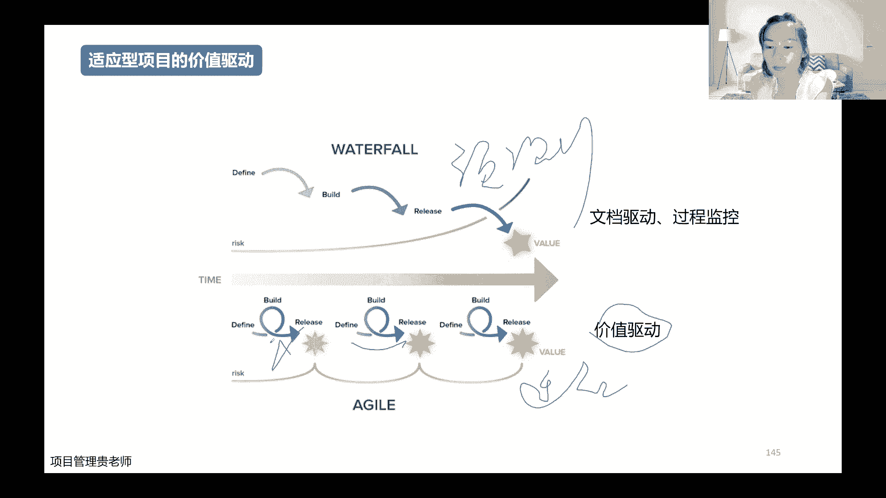

排除了一些不太能走的道路哈，价值驱动呢它有几个不同的一些点，一些点，这些呢就是它的不同点，也是一个层层递进的一些关系哈，啊第一层呢胸怀大志，从小做起啊，这个逆子旁边这个例子不用看就知道了。

这是最早的时候啊，一几年的时候，这个微信刚出来的时候，你看现在中国十几亿人口，有人没有微信吗，没有微信的非常非常少，极少对人这么强大的一款工具，这么强的一款工具，最开始的时候也被人吐槽啊，切面简陋。

功能差，对不对，比他们之前啊，比之前装的这个米聊米聊，不知道大家用过没有，最早的时候可能QQ用的比较多，飞机用的比较多，微信刚出来的时候装的人特别少，对不对，所以呢吐槽的也很少。

所以不是每一款产品它最开始出来的时候。

他都那么完美哈，他都那么完美，那么精益思想快速验证哈，这个也是经济思想快速验证呢，是我们在讲啊，我们在做适应性项目的时候啊，有非常非常多的一些功能都想去做，对不对，都想去做，但是我没有这么多的人。

我也没有这么多的时间啊，甚至这些功能都出来之后，有可能都把这些功能出来，有可能市场上面很多竞品它已经出来了，那怎么办啊，那怎么办，有办法哈，我们先做一个最小的可行性产品。

先做一个最小行性可行性产品推向市场，推销市场，他一定会被市场，一定会被用户骂的啊，当然用户骂也是给我们提供了好的一些意见，再去不断的去更改，所以呢最啊他的一切核心的思想就是，不要追求大而全啊。

这个是对于很多创业者非常重要啊，对于很多创业者非常重要，有很多创业者啊，尤其是非常年轻的啊，或者非常初级的一些创业者，一开始的时候想的非常美好啊，我要创造一个非常好的一个产品啊，这个产品会怎么怎么样好。

会让我们的用户实现什么什么样的功能啊，这功能也有，那功能也非常好啊，觉得自己把这个项目说出特牛逼，去找投资人，投资人问啊，你首先先实践，先做什么呀，一问把你问懵了，对不对，你这些功能如果说同事要实现。

你需要花很多人很多钱，还要花很多时间，但是市场不等你啊，市场和用户不会等你，有可能你花很多时间去追求的，这些大而全的功能，等你出来的时候早就落后了，早就落后了，人家根本就用不着了，对不对。

好比如说现在我还是讲人工智能，因为贵老师最近在做人工智能的一些项目哈，啊比如说我们还是讲现在国内的一些大模型啊，不知道大家有没有了解过人工智能这个行业，赛道哈，现在国内的大模型基本上已经定型了。

基本上已经定型了，百度的文心一言讯飞的星火啊，华为的盘古这些基本上已经定型了，然后你现在再出来一个新公司说啊，我要做人工智能，我要做大模型哈，那你基本上你想的很好啊，但是呢当你把大模型做出来的时候。

已经没有你的地位了啊，已经没有你的地位了啊，所以百度是不是一开始也做的那么好呢，啊也不是，对不对，人家也只能说最开始先推先发布出来啊，你看文心一言，最开始发布出来的时候也是被人骂的一逼，再往上各种调侃。

各种骂，各种跟ChatGPT相对比，对不对，但是人家在改进啊，啊人家也是推了一个MVP，推了一个最小可行性产品出来，人家至少可以用用的好不好，功能好不好，或者说搜索引啊，或者说他给出来的数据质量高不高。

这个是另外一个层次再说，对不对，我通过推出来之后，然后通过用户的一些反馈，我在不断的去调整，不断的去调整。

那么第三个城市呢，第三个层次呢，我既然我已经推向市场了啊，已经推向市场了，那么有这么多的人，不同的人，他的需求不一样，对不对啊，他的需求不一样，提出来的意见反馈也不一样，意见反馈也不一样。

我如果说所有的意见都采纳行不行啊，不行对不对，就像小米啊，就像这个小米最开始出来的时候，他做产品的时候他也是啊，对不对，他专门建了一个雷军，专门建了一个社群，他在这个社群里面也是不同的人。

都在去提他的一些意见，他有没有办法把这些意见都囊括进去呢，他没有办法，对不对，他没有办法，所以他有所为，有所不为，他只能选择他最核心的那一部分啊，比如说我们回心的满足老板的需求。

或者是满足后我们客户的需求，或者我们核心的去满足用户的需求，随便哈随便都可以根据你项目的特点，项目的要求来选择一些核心的去先啊。

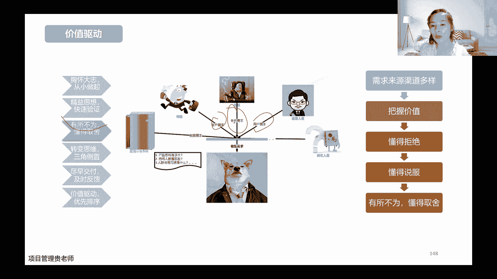

先去实现，先去迭代，那么到第四个层次呢啊我们要了解价值驱动，它是一个倒三角的哈，是一个倒三角的一个思维啊，什么意思呢，对于我们啊这个瀑布它就是我们预测性项目哈，预测项目它有啊，比如说我们说的传统项目。

它指的是预测预测性项目，他也说的是预测瀑布性项目，它也是我们的预测性项目哈，这个是不同的表达方式，不同的说法，妈妈那么对于瀑布型的，对于传统型的这种项目而言呢，它是啊它的范围，它的时间啊，它的成本。

包括它的质量是固定的，是框架的啊，是有这样的一个严格的一个框架的，但是对于我们适应性的项目而言呢，对于我们适应性项目而言啊，我们的时间啊，我们的成本啊，它相对而言呢它可能有一个大概的估算。

但是呢我们的范围是完完全全不确定的哈，瀑布形式范围确定了，来，根据范围呢，我们的时间和成本呢是有一个大概的估算，可能允许调整，但是呢在我们的敏捷当中，范围是完全不确定的。

我们的时间和成本我们要在一个月之内啊，通过100万要完成什么样什么样的一些功能，至于完为了完成这样的一些功能，我们需要做什么样的范围呢，这个范围是完全不确定的，它是就是两个刚好是一个相反的一个驱动。

那么到第五个层次呢是我们既然是价值交付了。

既然是价值驱动了，那我们当然要尽早的去交付啊，尽早的去交付，先交付一点，我先看看看看你的方向错了没有啊，所以这个又给大家提了一个啊点还有一个题，比如说我们前面讲你创新型的，你创新型的项目啊。

我们说创新型的项目，因为你的创新程度很高，对不对，创新程度很高，你更适合用一些适应性的项目，那假如说现在你接了一个活儿啊，领导给你安排的这个活儿，说啊小王啊，这个活就让你干吧，为什么让你干呢，因为好。

因为这个项目从前公司里没有人干过啊，没有人干过啊，他很复杂啊，他需要有非常多的一些融入，一些新的一些技术点，我相信你一定能干得好啊，除了你我不相信别人，那OK那对于你而言啊，它是适应性的特点比较强。

对不对，你会啊，你会三个月之后，你突然来跟老板说，老板这个项目做好了，你看看是不是你想要的，你会这样做吗，啊，不对不对，你不会因为这样风险太高了，万一做错了呢，对不对，你更好的办法是什么呢。

你更好的办法是你接到这个活之后啊，你一个星期哪一个反馈啊，把你一个星期做的这个成果先给领导看看，方向对了没有，第二个限定，你又得到了什么样的进展，进展，再拿个领导去看看，对不对，因为它的创新性都很高啊。

啊创新薪资很高，说明你在里面不断的去摸索，摸索出来的这些成果，当然要及时的去得到领导的反馈啊，得到他的认可或者是修改的意见，你才能够在下一次你才能够去改进，对不对，而不是直接闷着头做。

那么最后一个层次了，当然就是我们的价值驱动优先排序哈，价值驱动呢我们这个是我们在讲迭代的时候，会跟大家讲到这个表哈，这个表代表的是我们的产品代办事项列表哈，这个列表当中它就是每一个列表。

代表我们要做的一些事项，这每一个事项它是通过我们的价值的优先级哈，价值的高和低排了它的优先级的，那排了优先级的，我们当然要做优先级高的了，当然要做优先级高的，优先级高的，它说明它的价值越高，价值越高的。

我们先做出来啊，先做出来，这样能够尽可能的去降低我们的一些成本。

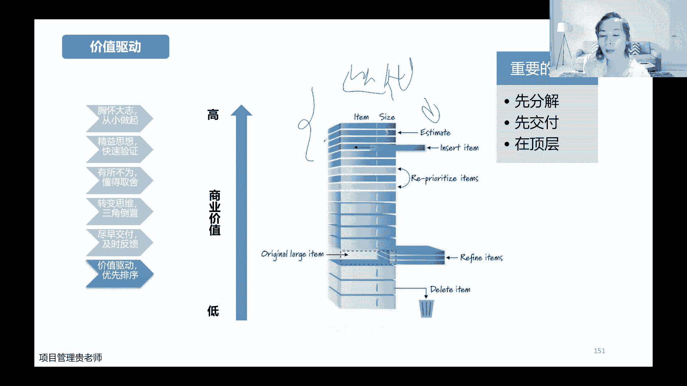

减少我们的一些项目失败的一些风险哈，那前面讲过了预测性，讲过了适应性项目，那对于我们预测性的项目，它的过程是什么样子的啊，它的过程啊，它的过程啊，首先它是有五个大的过程组哈。

这个是在我们第六版的这个教材里面，就直接按照五大过程组来讲哈，所以大家看到这儿也会发现，为什么我们pm要把我们的整个教材要更新哈，要更新，因为我们第六版以及第六版之前的偏book。

它都是以预测型的项目为框架，都是以预测性的项目为框架在讲，所以它有固定的过程组和固定的子过程，但是呢但是呢我们现在哈因为做项目项目，它的创新程度也越来越高啊，创新程度也越来越高。

技术的更新迭代也越来越快，市场的需求越来越摸不着头脑了，越来越不被我们预测了，那这个时候呢它诞生出来的一些项目哈，诞生出来的项目，它的不确定性程度也就高了，所以呢要求我们做项目的时候。

你还仅仅只有固定型的，传统的预测性的项目的思维行不行呢，不能够了哈，不能够了啊，不够用了不够用了，那既然不够用了，PMBOK这本书的它的参考价值，那对于整个项目，对于整个项目这个行业而言。

对整个项目管理这个行业而言，它的重要性就会被削弱，p mi会允许这样的事情发生吗，他不会啊，对不对，因为前面讲过了，p mi他的这套体系，他的这套体系在全世界，在全球用到的国家还是最多的。

认可的国家也是最多的，他既然能够认可，他每4年也都会更新，对不对，他当然也会，他当然也会啊，适时的去根据市场的变化，根据项目类型的变化去调整，所以才会有这样的一个更新啊，当然这是题外话了，在过程之下呢。

有五个大的过程和49个子过程哈，49个子过程，每一个子过程都有它的输入，都有它的工具和技术。

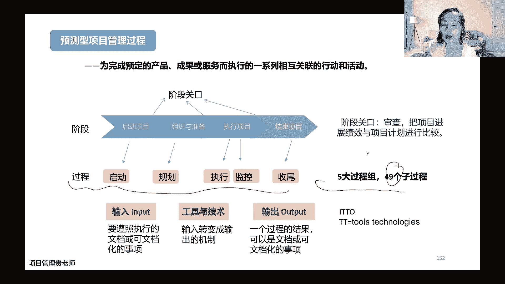

然后都有它的输出，都有它的输出，它的过程，这五个大的过程组啊，分别是什么意思呢，啊其实非常简单哈，嗯启动过程组当然就是定义一个新的项目，或者定义现有阶段的一个新的一个阶段啊，这个是启动。

那么的规划呢是我启动之后啊，我要根据我明确的啊，项目的需求去明确它的范围啊，明确它的目标，并且呢为了实现我们的项目标，制定的所有的行动方案，这样的一个过程啊，这样的一组过程，那执行过程组呢。

当然就是我们按照我们规划的这些内容去执行，监控呢，监控呢是指我们在执行的过程当中要去跟踪，要去审查，审查我们实际项目出来的这些可交付成果数据，跟我们的规划的内容是不是一致的，是不是需要调整呢。

那收尾的过程中呢，是我们正式的去完成，或者是结束我们整个项目啊，或者是阶段或者是合同啊。

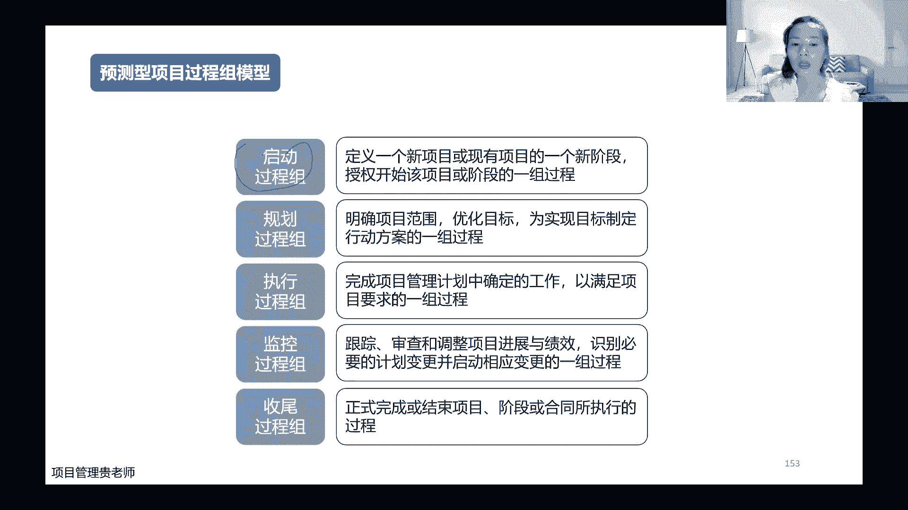

这样的过程，那详细下来呢，这49个子过程哈，这49个子过程呢啊给大家列了一个框架，这个框架这张图，这个汤，这张图十个知识领域，四个九四十九个子过程，这个也就是我们偏不偏不可的核心内容哈。

核心内容就是这张图，大家如果说有看我们群里面上传的，那些文件的话，有一个15至尊图，15至尊图呢就是按照这四个49个子过程，每一个子过程它的输入是什么，工具和技术是什么，然后输出是什么啊。

就是这些核心内容哈，这些核心内容，这些核心内容其实都是需要大家去掌握的哈，都是需要大家去掌握的啊，在我们的绩效域里边后面都会学到啊，我都给大家去嗯，分配在不同的绩效域里边，分配在不同的绩效域里边的哈。

那么这49个子过程呢，大家也可以先提前去了解了解哈，比如说我们讲项目整合管理啊，它就会包括制定章程，是计划指导管理项目工作啊，监控项目工作，实时控制，实施变更，控制结束，然后项目的范围呢又会因为规划。

我们项目怎么去管，收集需求，定义范围，创建WBS确认范围和控制范围，对于进度而言呢，啊它又会分为我们项目的规划，他的进度管理，定义每一个活动排列，每一个活动之间的顺序，估算活动的持续时间。

制定整体的进度计划，控制进度，规划成本管理呢，项目的成本管理呢，又包括了规划成本到底怎么去管啊，怎么去估算成本啊，怎么去制定预算，怎么样去控制成本啊等等啊。

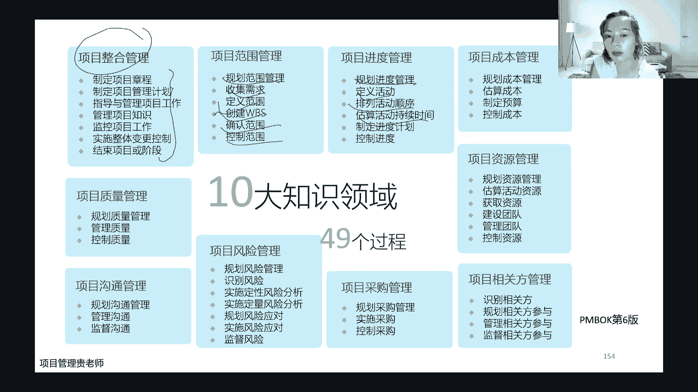

这些在我们的绩效语里面都会讲到哈，今天不讲那么细哈，今天不讲那么细，今天只是给大家展示一下，我们预测性的项目管理的啊，核心内容和框架，那对于我们敏捷型的，适应性的项目的管理框架呢，它是这样子的。

首先我们项目当然还需要逆向，对不对，那逆向是建立愿景和商业论证，这样的一个过程啊，商业论证通过了之后，项目章程批了之后，我们相等才能正式启动，启动之后呢，我们要去约定不同的人物角色啊。

比如说这个项目产品负责人是谁呀，项目经理是谁呀，这个敏捷或者敏捷敏捷教练是谁呀，有初步的啊，产品的一些列表，有高层次的一些估算啊，比如说这个项目我预计是一个月要发布，就发布一个功能啊，就发布一个。

而实现两个功能就可以了，产品路线图和用户故事的地图，这个是在我们启动阶段要做的，那对于发布计划呢，启动完了之后，我们要做一个发布计划，发布计划里面呢我们要定义它完成的标准啊，同时呢要发布我们的blog。

在迭代里面呢进入到每一个迭代，因为我们一个发布里面，它有可能有好几个不同的迭代哈，只有我们时间啊，只有我们迭代的时间是固定的，比如说每两周或者每四周或者每三周，每一周每两天都行哈，它是一个固定的时间箱。

但是发布就不一定哈，我们可能第一个阶段的发布，我们三个月发布一款啊，下一个阶段呢我有可能一年我才发布一次，也是可以的啊，发布的时间是不确定的，是不固定的，不固定的，但是迭代呢它是相对固定的。

那么在迭代之内呢，我们又有迭代的规划会议啊，啊每日的战会呀，评审会议啊，啊回顾会啊等等啊，这些会什么意思，什么内容怎么开，哪些人开啊，这个在后面都会讲到哈，都会讲到，那么到项目收尾的时候呢。

也是哦我们项目的还要怎么去啊，回款呢啊要怎么去嗯，总结经验呢啊要怎么去收尾啊，啊要怎么去归档啊，要怎么去给团队去解散啊，庆功宴啊等等啊，这是我们收尾的一个过程，所以大家可以看到。

我们比我们预测性的框架和适应性的框架啊，它其实是完全是不一样的啊，所掌握的内容也是不一样的，预测性的项目我们要掌握每一个子过程，它的输入和输出的条件，要掌握每一个啊不同的弓箭，它里面包含什么内容。

但是对于我们适应的项目而言呢，我们要了解它的过程啊，重点啊重点是把叠在里边儿啊，因为它落脚点都是落在每一个迭代里边，对不对，所以我们重点的是要把每一个叠在里面啊，这些会议怎么开啊，看板怎么弄。

团队速率怎么去跟进，团队成员怎么去激发啊。

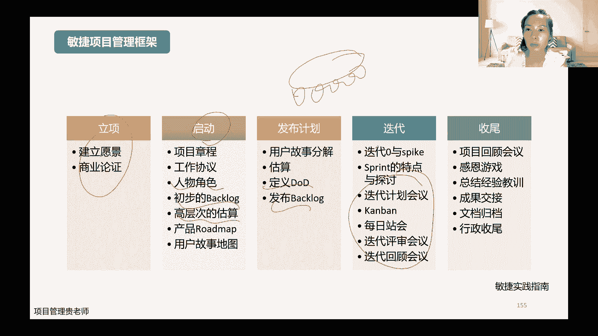

要把这些内容把它搞清楚啊，他的管理过程啊可以看到啊，因为前面讲了，我们每一个发布它有不同的迭代，对不对，每一个迭代里面啊有迭代规划，然后有这个这个是软件啊，以一个软件的为例，还有分析设计，编码测试。

然后呢要评审要回顾啊，然后完了进入到第二个迭代呢，它又是要迭代规划，然后又重复这个过程，然后两个迭代完了之后，发布一进入到发布，然后还要进入到发布二，就是他发布二的时候呢，又开始第三个迭代。

第四个迭代等等啊。

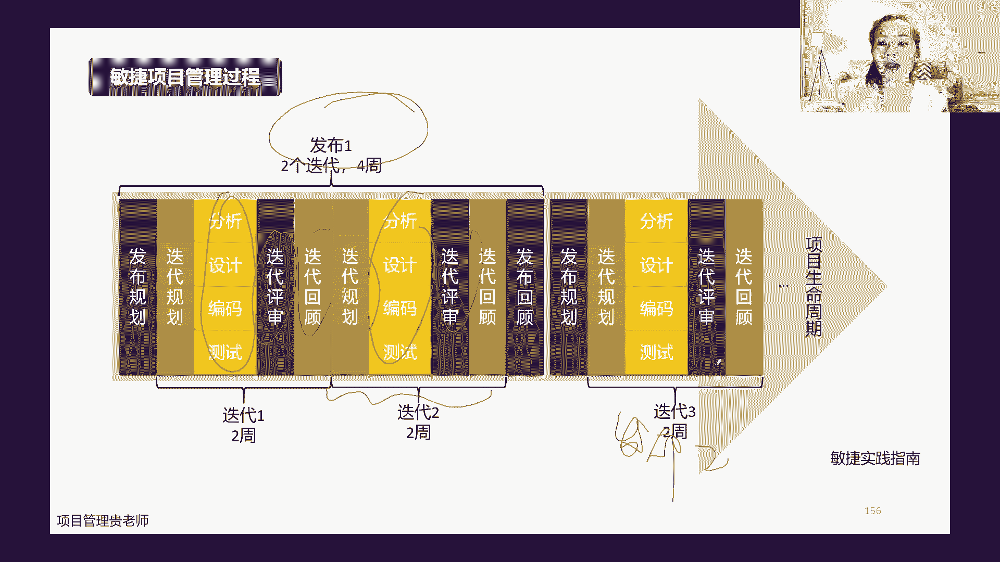

他是这样在循环的，那对于混合型的项目管理框架，前面我们讲过有混合型的管理方法，对不对，混合型的管理方法，它当然就有混合型的项目管理框架，这举个例子啊，这个例子非常好啊，这个例子非常好。

这个例子其实啊它是一个建一个社区中心哈，建一个社区中心，那建一个社区中心的这个社区中心，它不仅仅啊它不仅仅只是一个可见的，不仅仅只是一个肉眼可见的一个社区，而不是仅仅只是一座楼，他还会有非常多的一些啊。

老年人的社区的服务的一些网站，还有呢服务的一些产品，同时呢还会给这些老年人啊做一些培训啊，或者是一些活动，开展一些活动，它是一个社区的建设，加上运营啊，加上运营的这样的整体在内的。

这样的一个大的一个项目哈，那这些项目呢它包含的过程就比较多了，它包含哪些过程呢，好它首先有启动过程，启动完了之后呢，哎比如说我启动现在要做这样的一个社区，要做这样的一个社区，然后这个社区呢我规划了。

我规划了有2000平方啊，三层楼，2000平方三层楼啊，要开始做又开始做呢，啊OK啊，我找了一个比较厉害的一个设计院啊，来给我出设计图纸，来给我出施工图，然后呢除了施工图呢。

我一边我这个施工队伍要开始进场了，要开始做装修了，同时呢我这个我们讲了这个项目哈，这个项目它不仅仅是楼宇，对不对，它不仅仅是楼宇，它还需要包括比较符合老年人使用的一些网站，比较适合他们的一些特点。

那这些网站要实现什么样的一些功能呢，那我在这个时候，我在规划的阶段，我要开始设计，我要开始设计好啊，我一方面让设计院再帮我设计楼宇啊，这出他的施工图，我一方面呢还找了一个啊，非常有社区建设网站的。

比较经验丰富的这样的一个团队啊，一个软件团队，我再让他帮我设计这个系统啊，应该怎么去开发，设计完了之后呢，进入到开发，进入到开发啊，这边的软件是进入到了开发啊，那对于楼宇，诶这个软好像写错了。

对于楼宇而言呢，那他进入到了他的建设，进入他的这个装修的这个过程，那装修完了，然后系统也开发好了，OK我系统开始进入到一些测试，进入到测试完了之后呢，就到部署的阶段，到了部署的阶段之后呢。

啊这个时候我的楼宇也已经交付了，那么有一批量的老年人，他可能已经在啊入住了，当然这个入住了嗯，可能是我们的蝼蚁，肯定是已经练完了哈，所以这个甲醛什么问题啊，有人之前有小伙伴提到有甲醛。

我们的前提是这个甲田已经抽完了哈，那么有老年人有第一批老年人，他已经在这个设计中心来了啊，已经过来了，那么已经过来之后呢，我们要通过我们部署的这些系统啊，通过我们部署的这些软件，要给人家提供服务。

对不对，要给人家提供服务，为了做好这些服务，那我们社区的一些服务人员啊，一些服务人员是不是要给他们做一些培训，培训也是我们整个这个项目的一个部分，对不对啊，培训今天培训了这样的一个动作啊。

培训了这样的一个啊培训怎么给老年人，怎么给老年人使用这些系统啊，执行一个，第二天又要培训培训什么呢啊，培训这些老年人的他的饮食起居怎么去安排啊，第三天还得来培训啊，培训怎么样给老年人啊，丰富他的生活啊。

开展他的一些老年大学的，一些或者老年活动的啊，一些活动的一些策划啊等等这些培训哈，这些培训你想一次又一次的培训啊，培训内容都不一样，这个典型的我们的增量对不对，所以呢啊在我们系统的开发里面。

我们用的是适应啊，用的是敏捷，在我们楼宇的建设里面，我们用的是预测，在我们的培训的这些动作里边，我们用的是增量，它典型的是里面混合了多种不同的开发方法。

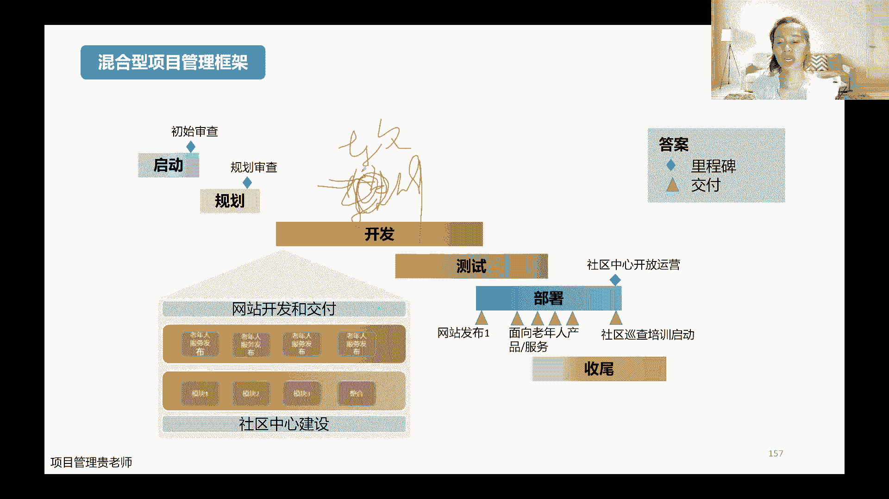

对不对啊，所以你看他还有建筑物啊，有设计的巡查，有培训，有老年人的服务和网站啊，对于社区的建筑物而言，它是一次性的啊，装好了，晾好了可以入住了，是我们预测型的交互节奏，对于老年人的服务而言啊。

对老年人服务而言，我们当时多次交付啊，对不对，第一次没把他服务好啊，这个社区新出来啊，招了一批新人，这批新人呢，虽然说在其他地方有服务过老年人的经验，但是呢他没有在这个社区，服务过这一批当地人啊。

所以他也可能第一次的时候，有哪些地方没有考虑周到，没关系啊，没关系啊，我们老年人提提意见就好了呀，下次我们可以改进，对不对啊，所以呢对于服务这一块而言啊，我们是用的迭代性的不断的在改进啊。

质量不断的在提高，那对于网站而言啊，他典型的是一个敏捷性的，对于培训而言啊，刚刚讲了，他也是一次培训，两次培训，三次培训，它是一个增量型的啊，他多次交付，所以举这样的一个例子，大家一下就明白了。

混合型的开发方法，其实我们在现实生活中哈，现实的工作当中，可能哈可能混合性的会非常多啊，可能会混混合性的非常多啊，纯敏捷的会比较少哈，纯敏捷的会比较少，有人会说不对呀，纯敏捷了不少啊。

因为我做了很多很多很多很多的系统，很多很多的软件开发的项目呀，这软件开发不都是适应性的吗，啊怎么会说怎么会说少呢，哈为什么呢，那我只问你一句哈，你开发的这些软件系统，它有没有你公司的条条框框去限制吧。

啊，或者说啊，尤其是比如说你做的是政府的一些，软件型的一些项目，政府的条条框框是非常多的啊，经常今天让你去汇报啊，明天也让你去汇报啊等等，那么这么多的条条框框给到你，它，它其实就已经有了预测性的项目的。

一些特征在里面哈，它的限制比较多啊，他甚至呢他规定的，你每周必须要去给他提交什么报告，对不对，他甚至或或者是公司呢啊，他要求你必须事先要把你所有的这个风险啊，或者是质量审查啊，把这些规划都把它做好。

这个是不是也是适应性的特点啊，啊也是这个预测性的特点啊，也是啊也是，所以为什么在国内其实纯敏捷，纯适应性的项目特别少呢，是因为啊是因为这个国内的一些文化不允许你，他不能完全相信你啊，不能完全给你放权。

不能完全给你放权，所以所以绝大部分哈，所以绝大部分，你看起来你做的是一个纯敏捷项目，但其实呢，你其实做的是一个混合型的一个项目哈，混合型的一些项目，因为他有预测性的这种特征在里边哈。

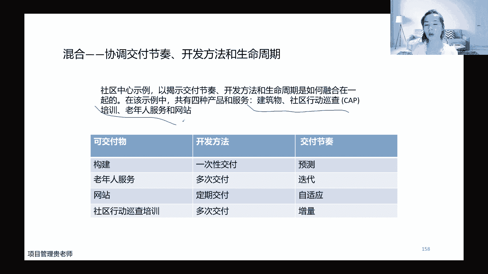

好，以上就是我们今天晚上的开发方法和生命周期，它的一些核心的一些内容点啊，这部分的内容点呢其实并不是特别多哈，并不是特别多，但是呢大家一定要把不同的生命周期，尤其是预测性和适应性这两类生命周期。

它的特点啊，要把它的特点掌握，要把它的特点掌握，因为呢我们在后面做题的时候，我们在后面做题的时候会遇到非常多需要，我们根据他的啊，尤其是适应性的需要，根据他的一些原则啊，比如说我们刚刚讲的12个原则。

需要根据他的原则去推断，去推断一些比较合适的合理的一些选项哈，OK那我们讲一讲这一章节对应的，它的一些例题哈，嗯首先我给他，我把你。

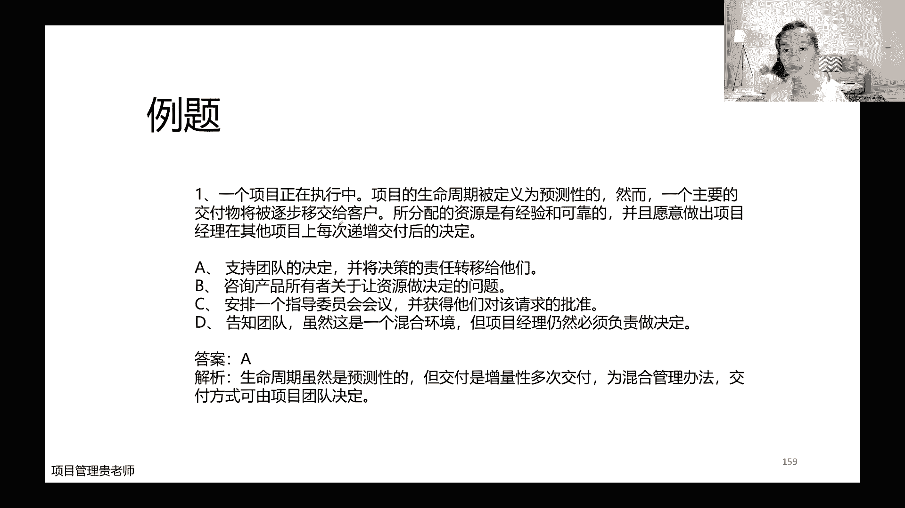

首先第一题哈，第一题呢是说，一个项目正在执行的过程当中，然后呢，这个生命周期被预测为被定义为预测性的，但是呢一个主要的可交付正在逐步的交给客户，逐步的交给客户，这个时候呢有人哈他愿意做出项目。

后面被大家的这个这个聊天屏挡住了，影响位置，Ok，所分的所分配的资源是经验的，也有可靠的，并且愿意做出项目的这个经理，在其他项目，哦愿意做出项目经理在其他项目上，每次递增交付后的决定啊。

这个这个有点这个有点绕哈，他的意思，因为这是翻译过来的，有点有点生硬哈，看不到题了吗，伙伴们，嗯稍等一下，看不到题了，我给大家弄一下，你看吧，我移了我，我只是移了一下大家的这个聊天的这个画板。

互动的面板，然后他可能又重新弄了一个，稍等一下哈，稍等一下下，呃现在呢，现在看得到吗，我重新弄了一下，重新共享了一下，OK不，现在可以看到吗，可以了哈，哎你看吧，这个我就是不敢给大家动这个屏幕。

我刚刚是因为我题目的右侧，被互动的面板挡住了，挡住了之后，我就移了一下大家的互动面板，我也稍微移了一下，果然他的题目就看不见了，OK现在好了，好嗯那我重新把这个题目给大家说一下吧。

他这个题目呢虽然说这个看中文看的比较绕哈，因为它所有的偏僻的题目，都是从英文翻译过来的，所以有的时候大家都知道这个中式英语哈，翻译过来是比较生硬，没关系哈没关系，他的意思呢是说。

这个项目生命周期最开始被定义了，定义呢是一个预测性的，但是呢现在可交付成果他要每次递增交付哈，每次递增交付啊，是这个意思非常简单，所以呢问你选的选项哈，A呢是说要支持团队的决定。

并将决策的责任转移给他们，嗯然后B呢是说嗯咨询产品所有者，让关于让资源做决定的问题，C呢是说安排一个指导委员会的会议，并获得他们对请求的批准，D呢是说告知团队，虽然这是一个混合的环境。

但是呢仍然必须要由项目经理来做出决定啊，那么这个其实是一个典型的一个啊，混合型的一个管理办法，对于混合型的管理办法而已呢，你现在主要的可交付物，它其实是在逐步地移交给客户，对不对，他在逐步的移交。

那么他既然有增量的特点呢，也就是说他并不是所有的决策权，都一定要有项目经理来决策啊，所以D肯定是不对，也不需要去每一个决定都去请示指导委员会，C也不对，也不需要像完全的敏捷那样。

去让产品所有者P来做决定哈，所以呢这个时候最好的办法啊，最好的办法是让做这些产品，做这个可主要的可交付物的这个团队成员啊，要把一部分的责任要转移给他们啊，要让他们来决定，要让他们来参与进来哈。

它表达的是这样的一个意思啊，第二题诶下去。

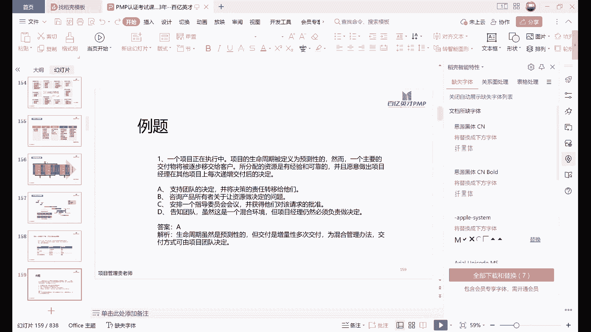

第二题。

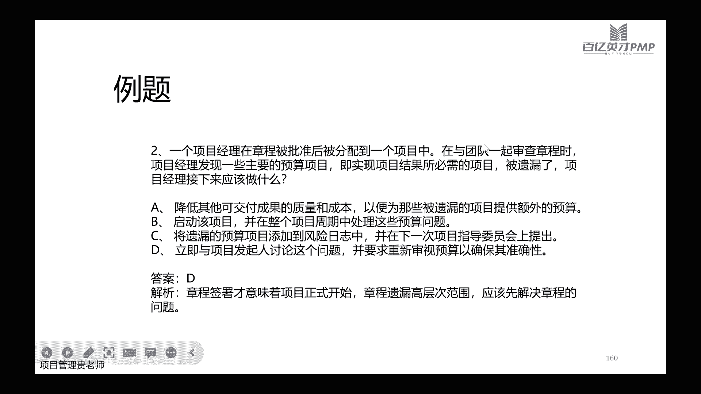

第二题，一个项目经理在章程被批准之后，分配到一个项目，但是呢他们在审查章程的时候，发现有一个所必须要的项目遗漏了，那怎么办，A呢是说降低其他的可交付的质量和成本，项目经理啊。

这是在章程当中遗漏了重要的东西，在章程当中遗漏了又看不到了，我再给大家弄一下，稍等好不着急，稍等我一下。

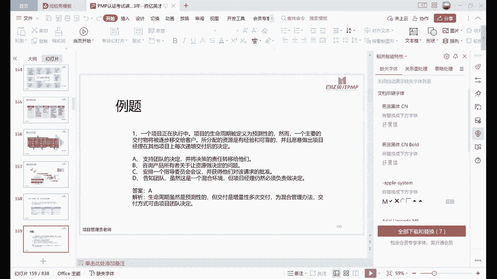

好了吗，好第二题哈，第二题是说，在章程当中遗漏了一个所必须要做的这个项目，那怎么办呢，而我们讲章程是谁来定的呀，章程是发起人来定的，那项目经理有权利去更改章程吗，项目经理没有权利，对不对。

所以A是说降低其他可交付成果的质量和成本，然后呢来腾出一点预算，来成都腾出一点预算之后来做这个遗漏的项目，你项目经理有这么大的权限吗，没有哈，B呢是说啊来启动啊，然后呢在风险在整个生命周期当中。

在整个项目周期当中，再来处理这些遗漏的这些项目的预算问题，直接启动也不对哈，也不对，因为万一你到最后你因为项目必须要的，他被遗漏了，你万一缺钱了，你找谁要去啊，对不对。

C呢是说将遗漏的预算添加到风险当中，然后呢在下一次指导委员会上提出，D呢是说立即跟项目发起人讨论这个问题啊，来重新审视预算，来确保其准确性，当然是要做D，对不对啊，当然是要做D啊。

这个如果说这个如果说你不选D啊，你所有的ABC选项都是在给自己埋雷哈，都是在给自己买的，因为你在审查章程的时候，相当于给你签，给你签，这个这个签是打引号的哈，因为既然章程任命了你为项目经理啊。

说明你要开始，你要开始领任务了，对不对，你要开始立啊，下这个军令状了，那你这个时候你要是不把这个问题，你把它弄清楚，不跟你的发起人核对好，那你最后出了问题算谁的，你不典型的背锅侠吗。

你这在源头上面就成了背锅侠，对不对，所以你一定要在最开始的时候啊，最开始的时候要先把章程的问题先把它确认好，确认好，确认它的准确无误性，第三题，第三题呢是说，公司之前都是由同一个供应商来提供服务的。

那么对于项目经理而言，这个是什么东西呢，什么东西呢，A制约因素，B假设条件，C项目说明D工作流程，职业因素和假设条件，我们说了，这是在我们假设日志当中要记录的，要记录对这个项目要影响会影响的一些啊内容。

对不对，那会影响的内容，它又分了有两种制约因素和假设条件，前面讲过假设条件是假设是预想的啊，是需要我们在项目的过程当中去证实的，它是不成立的，客观它它是不成立的，它不是客观的。

但是制约因素呢它是客观现实存在的，那我们看一下，现在呢是说啊，像啊，当然我们把C说C项目说明项目说明呢，它是对于项目的整体它的内容啊，或者是细节的内容或者整体内容做一些说明啊，所以做一些说明。

它是下面的文件工作的流程呢，它是具体的工作一步一步的流程啊，那现在题干说，公司之前项目都有同一个供应商提供服务，那这是一个工作流程吗，没有对不对，他没有说你供应商到底怎么去提供服务啊，服务的流程是什么。

他也说了，你这个项目的说明吗啊你知道项目做什么嘛，也不知道对不对，所以CD肯定不是，那么到底是A还是B呢，都有统一供应商提供服务，这是一个客观存在的事实啊，对不对，所以它是一个制约因素哈。

有人会问他怎么制约呀，他有同一个供应商来提供服务，他怎么制约呀，当然意味着我们这个项目啊，有可能有可能很有可能还是选择这个供应商，对不对，你想选择其他供应商行不行呢，啊不是不行，但是可能有困难啊。

可能有困难，第四题，第四题呢是说项目经理啊，现在在管理一个快速变化的项目范围，需求难以确定啊，难以确定，那么问你的是下面哪一个项目的生命周期模型，应该协助他定义较小的增量改进。

并为相关方提供最大的价值啊，你看需求范围难以提前确定啊，还要增量改进，那这显然是我们适应性的特点啊，对不对，显然是我们适应性的特点啊，还有人会说啊，老师为什么不是我们增量型的呀，为什么不是增量型的。

区分一下哎，区分一下我们的这个A哈，区分一下我们的A我们虽然说适应的生命周期，它是有迭代和增量的特点，但是呢它并不是说啊适应性的生命周期，它就是迭代性的生命周期，就是增强型的生命周期哈。

我们前面讲它的开发方法和生命周期，它虽然说是对应关系，但是呢它不是等号啊，他表达的不是一回事哈，所以之前有小伙伴问过这个题，为什么选B不选A哈，实在是这个意思哈，第五题，第五题呢是说。

发起人和项目经理正在为新的厂制定章程，你现在呢有多个场址可以考虑，那在你为了要选择合适的一个厂址，那你必须首先要开始执行哪一个工作呢，A商业需求，B放说明书，C商业论证D项目预算。

我们讲过任何一个项目开始之前啊，你是不是要做他的成本效益分析，是不是做成本交易分析，分析这个项目做商业论证，看看它是不是值得做，对不对，你到底选择哪个厂，它的投资产出比是最高的，所以你首先应该做什么呢。

你首先应该做的是商业论证哈，首先应该做的是商业论证啊，题目其实非常简单哈，题目非常简单，OK嗯今天晚上的内容哈，今天晚上内容例题也给大家讲完了，看看大家还有没有什么问题哈，大家如果说有问题的话。

可以问一下我们的，可以问一下我的问题哈，有什么不理解的，给大家留一点时间，没有问题吗，直接谢谢老师，辛苦了，我可以理解为你这句话的意思是没有什么问题，是不是，如果说没有什么问题的话。

那今天晚上的课程就先到这吧，大家也早点休息吧，嗯如果说做练习题的时候有什么问题，可以随时在群里问他，第一次听课还没有来得及反应，需要来得及反应什么呢，好大家遇到问题随时在群里面问哈，随时在群里面交流。

钉钉群和微信群都可以哈。

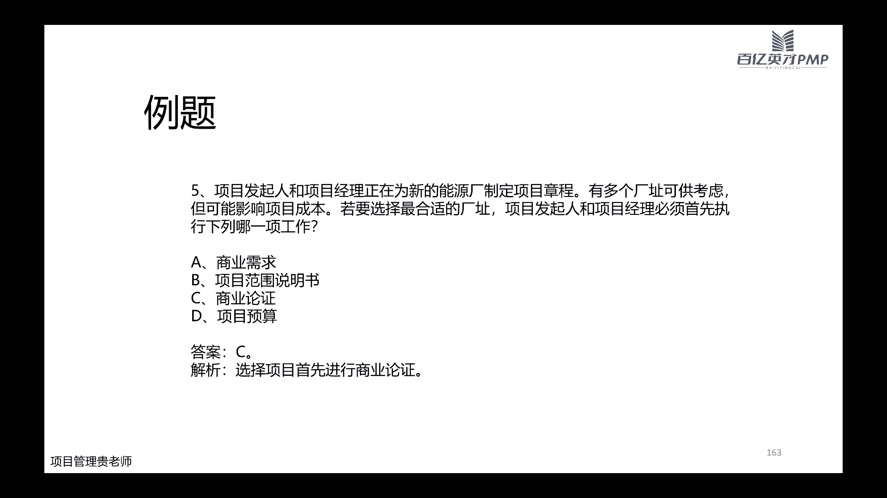