# 【精华版收藏】2024年CSPM-3级（中级项目管理专业人员）考试精华版视频课程合集丨核心考点！快速通关！ - P11：cspm-3 第8章 项目风险管理 - 希赛项目管理 - BV1vf42117Fq

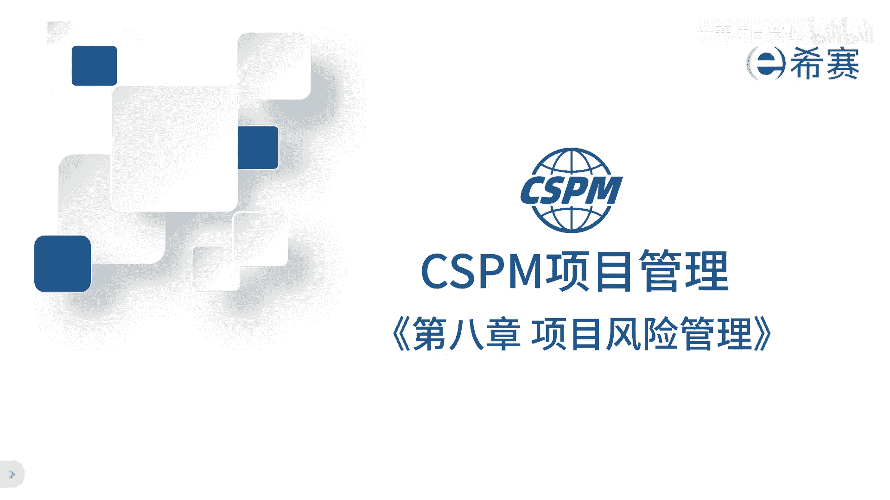

第八章风险管理，风险管理这门学问说起来不难，但是真正做起来就难了，它的难点在于风险还没发生，要预测出来就不容易了，更不要说你还要进行管理，要是发生了呢，那不叫风险，那叫问题。

风险管理其实是预测未来的发展规律，然后制定对应的策略来应对它，这个对于每个人的要求都挺高的，实际上能把现在的事情能想明白就不容易了，比如说复盘一下过去的事情，把规律理出来不容易吧。

那更不要说把还没有发生的事情，你还得想个倍儿清楚，但是呢这个又特别重要，因为古代的大师们都在努力锻炼自己，预测和推演的能力，这是非常聪明的一种工作方法，要提前预防，所以要做好风险管理，得不断的学习。

不断地实践才行，我们来看一下标准里面是怎么说的，风险管理的目的在于让目标更容易实现，确定风险和解决每个风险的方案，应成为项目计划的一个组成部分，识别风险是项目团队每个成员的职责。

这包括找出可能的风险来源和它的特点，如果真的发生了风险，可能会对项目的目标产生好的或者坏的影响，风险管理，包括在整个项目寿命周期内进行风险识别，评估处理，控制和应对，这就是风险管理的概述。

那既然在说风险管理，那什么叫风险呢，风险这个词定义有两个来源。

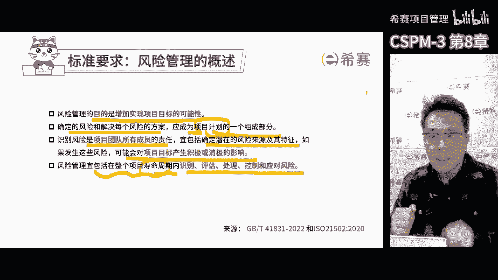

来自国标41245啊，另一个来自ISO21502，按照这些标准的内容，风险是具有潜在的正面和负面影响的不确定性，事件或者事件的集合，也就是说好的和不好的事情咱都叫风险，无论是单个还是一系列事件。

都称之为风险，通常好的事情被称之为机会，不好的事情称之为威胁，那另外风险是指潜在的还没有发生的事情，一旦这些潜在的事情发生了，我们称之为问题，这就是风险和问题的关系，那今天我想给大家分享一些经验啊。

在企业管理里面。

大家对于分享的态度呢其实都挺矛盾的，一方面都特别重视风险，觉得风险管理非常重要，另一方面呢又不重视风险，落实风险管理的过程中很不规范，我自己的经验是，项目风险管理没有效果，它的原因有三处。

第一呢原因就是漫无目的的识别风险，很多企业在项目里就这么干的，大家开会了，头脑风暴一下就想完了，这样识别风险太不系统了，项目的风险应该系统地排查，才能不遗漏任何重要的风险。

漫无目的的识别很容易漏掉非常重要的风险，一旦这个风险发生了，你项目没有可能就会黄了，比如说资金链断裂啊，或者说这个需求已经不存在了。

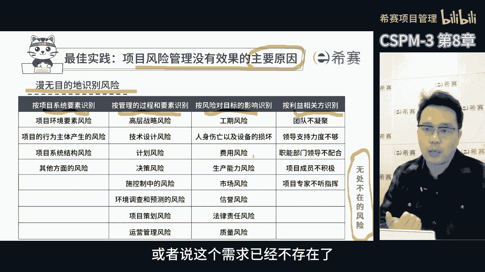

那第二呢，即使我们知道有风险，但如果说不清楚具体是什么风险，也没有办法采取有效的措施来应对，也没法引起别人的注意，比如说项目经常被汇报的风险是资源不足，时间不够，人员不配合客户需求来回变。

项目范围来回变，但实际上这些都不叫风险，而是需要项目经理去解决的问题，如果没有这些问题，根本就不需要项目经理了，那项目团队自个儿就能把事干好了，要你干啥来，所以作为项目经理。

我们不能把这些需求解决的问题说成项目风险，当我们遇到资源不足，时间不够，人员不匹配这些问题的时候，这说明我们需要学习项目管理了，说明我们还不懂如何有效地做项目管理，那项目管理的核心是解决问题。

相信大家都很认可这个观点，那如何在有限资源下实现目标，如何在有限的时间内实现项目目标，如何应对各种不配合的人，使项目形成合力，所以这些它只是原因啊，不能归到风险这个范畴内去。

如果我们想描述资源不足的风险，我们具体要问清楚是哪些资源不足，人不足，钱不足还是设备设施不足，资源不足是在哪个阶段展现出来的，哪个步骤才会出现，这样我们才能清晰地描述风险，只有把风险分解到具象化的场景。

我们才能说项目经理的风险管理描述做到位了，因为这样风险才能被有效地管理，咱们在学习PMP风险管理的时候，经常会提到一个工具叫RBS，就是风险分解结构，之所以会有这个工具。

是因为大家经常描绘非常宏观的风险，但这些宏观的风险是无解的，太大了，只有把宏观的风险分解成更具象化的场景，解决问题，他的思路才会出现。

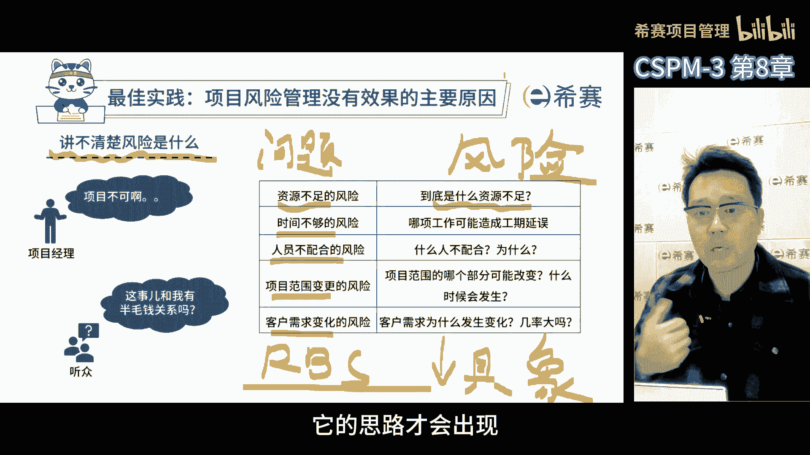

第三个原因是风险应对措施落实不到人，我们后面会专门讨论如何制定各种应对策略，风险应对有很多很多的方法，我们需要从不同的角度考虑它的优劣，然后决定用哪种，不用哪种啊，不管最后选择什么样的策略。

都需要明确责任人是谁，我建议是这样的，不要把风险应对策略的责任，落到跑不掉的项目经理身上，虽然在项目中对于那些没人负责的任务，责任都会归到项目经理身上，但项目经理他主要职责是把没人管的事啊。

这个活儿先管起来，然后在找到对应的人，或者比自己更合适的人，把任务分配下去，那项目中的风险和问题需要大家共同解决，也就是说每个人都需要参与进来，每个人都有自己的任务。

项目经理主要是确保风险应对措施能执行，落下去啊，同时在过程中进行监督，他不能亲自去落地啊，要是这样的话，他就没有办法去完成监督的过程了，那风险应对措施要落到项目团队中，除了项目经理之外的其他人身上。

还有风险应对措施不能让大家都来承担啊，就像三个和尚没水吃一样啊，大家的事往往都没人管，大家共同犯的错，那不叫错，只要大家的问题就不是问题，所以风险应对措施必须由特定的人来负责。

不能由几个人或者大家共同承担，共同负责，这样就没人重视，另外风险应对措施也不能落到，没有权利决定事项的团队成员身上去，你不能说好，开会了，谁最弱啊，谁最容易欺负，咱就把这个责任推给他。

因为他可能不想承担或者没有权利发表意见，结果他被认领了，被翻牌子了，但是关键是他被认领之后，措施又变成没人管了，还有责任也不能随便给那些没有参会的人，而不能因为谁今儿没来好。

大家特别高兴来责任让他承担吧，关键是人家没来，你就算把责任给他了，他心里也不服气啊，可能也不会认真去执行，到时候这个措施又掉地上了，还是没人管，所以在制定风险应对措施时，要找到合适的人。

这个人一定不是项目经理啊，也不能是大家，更不能是没有权利，那个人要在项目中开会，找到真正能承担这个责任的人，有能力承担的人，让他知道这个项目需要他，我们怎么找这个人呢，要证明这个事儿非他莫属。

没有人比他更合适了，而且这个人要有责任感，要么是造成风险的原因，要么是受风险影响最大的人，要不然就是事情发生的时候正好落他，那唉反正跑不掉，非他莫属，所以这就是风险没有很好落地的三个原因。

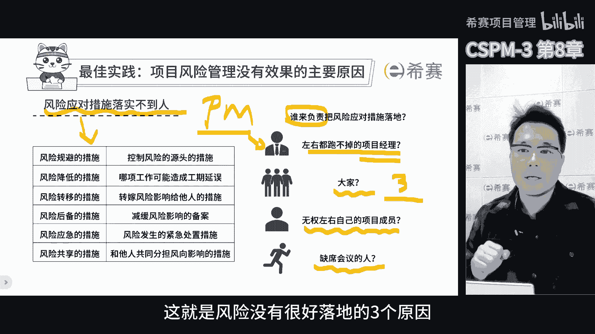

供大家参考，这也是最佳实践经验之谈，咱们继续，咱们描述风险得从三个方面来看原因，事件和结果，说白了就是描述风险的因果关系，咱不能只是说风险的事件是啥，更要说它的因果逻辑，我们要讲的是某个原因。

可能导致还没有发生的风险事件，这个事件可能是一个场景，包括时间地点，人物事件，虽然事件还没发生，但是一旦发生，一定会对项目的目标产生确定的影响，我们可以计算这个影响的大小，在描述风险的时候。

唯一不确定的就是风险事件是否发生，也就是它的概率，其他的都能确定，在项目风险管理中，为了统一大家对于风险的理解，在管理过程中更有效地沟通，描述风险时需要使用三段论，这个三段论包括三个东西。

原因事件和结果，原因呢就是导致风险发生的因素或者情况，在分析风险的时候把这个原因搞清楚，才能更好地应对风险，比如说供应商延迟交付关键材料，那项目就有可能面临风险，原因就是供应商延迟交付了事件。

是风险变成现实的时候，具体会发生什么事或者什么情况，还是拿刚才那个例子来说吧，如果真的发生了供应商延期交付的这个情况，那么项目关键阶段就有可能会被延迟，这就是分拣实践，那结果呢就是风险事件发生之后。

可能会带来的影响或者后果，比如上面说的那个风险事件，可能会导致的结果，就是项目总体进展会延误或者成本会增加，那通过这种方式把风险描述出来，项目管理者就能更加全面地分析风险了，制定有效的应对措施。

也就更有把握，那这种方法不仅能帮助我们去识别和评估风险，还能让团队对于风险有更深刻的理解，这样在应对风险的时候就更有把握一些，我们平时描述事件的时候，得带上可能发生的概率，它的大小是什么，什么时候发生。

还有威胁还是机会好，结果会有什么样的影响，对于项目的目标有哪些干扰，会达成什么样的指标啊，如果没有达成，会有什么样的损失，或者客户会有什么样的不满，成本会增加多少，这些方方面面都要考虑进去。

当我们描述风险管理的时候，其实有三个因素都得考虑进去，这样我们才能给别人讲明白风险推演的逻辑，但是在实际的风险管理过程中。

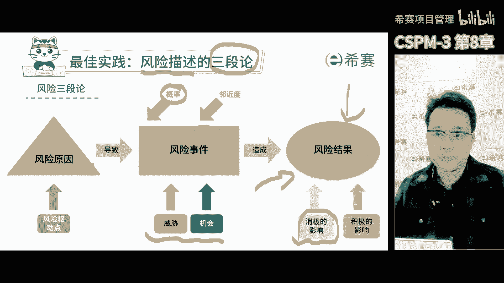

仅仅描述风险是不够的，风险管理它是一个闭环，包括风险的识别评估处置控制，更确切地说是控制和应对风险，按照ISO21502里面表述的风险管理，整个过程，它包括了在整个项目寿命周期中。

识别评估处置控制和应对风险，这是一个完整的闭环，那识别评估处置控制，这是我们所说的风险管理步骤，风险管理啊不能光有步骤，还得有原则，有政策，风险管理的方法，包括各种表达模板啊。

这样才能形成一整套完整的风险管理方法论，有了这么一个方法论，我们才能把整个风险管起来。

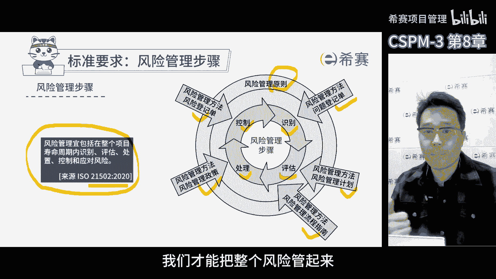

那么整个风险管理它有一个切入点，首先识别风险，然后评估风险带来的影响，评估它的概率之后，制定各种不同的应对措施，然后选择用哪个不用哪个，接下来就是实施了，在实施过程中要确保实施他控制的很好。

按照风险管理的步骤，识别风险又分成两个系的步骤，第一步叫识别环境，第二步叫识别风险，第一步识别环境，首先要了解我们正在进行的项目，以及他所处的环境，包括公司环境，客户环境，然后查看项目。

如果在自己的公司做项目，我们需要查看公司的风险管理政策和要求，小公司可能没有风险管理体系，而上市公司通常有自己的风险管理部门，有自己的风险管理体系，要求和政策，我们在项目中开展风险管理。

首先要依据公司的风险管理政策和要求，再结合我们项目自己的特点，对公司的风险管理政策进行调整，制定比较适合自己项目的，又符合公司要求的风险管理的，项目层级的政策和要求，并且要获得我们项目管理委员会。

和相关方面同意，如果大家达成共识了，它就成为咱们项目中需要遵循的一套，风险管理的具体要求依据，这就是识别环境，识别环境的核心，其实是希望依据组织的要求和项目的特点，制定出一套在项目过程中。

所有项目成员都可以依据的风险管理的要求，当然这个政策要求啊依然是临时的，项目是临时的，项目中出现的所有东西其实都是临时的，有开始和结束的时间节点，第二步识别风险，在第一步。

我们和我们的团队共同建立了项目中要遵守的，风险管理的依据和标准，接下来我们需要按照这个标准，去发现项目中可能存在的风险，识别风险可不是乱猜啊，要有规律的去找风险，最好的方法是把风险分解成不同的类别。

或者按照我们称之为风险识别清单啊，提示清单的指南去找，那这个清单通常是公司从过去的项目，经验教程里面总结出来的知识库，如果没有任何经验，可能就很难凭空想象出你会遇到什么风险，但是在很多有经验的人面前。

可能识别风险的能力就会变很强啊，主要是因为经历过，所以一看就知道了，不过人的精力总是有限的，所以我们希望公司能，把大家在项目中遇到的风险，解决过的问题都汇总起来，形成公司的组织工人资产啊知识库。

这样每个人在识别非典的时候都可以去参考，我们就能在别人的经验的基础之上，判断我们的项目是否会遇到类似的风险，借助这些过往的经验教训，而不是完全靠自己，每个人都有盲区，可能识别的没有那么完整，识别风险时。

我们要把风险的原因，事件结果都表述清楚，说到识别风险，我得分享一下我的个人习惯，我总是沿着三条主线来识别风险，那首先是沿着产品分解这条线，项目最后总是要交付的，当我们分解我们的产品组成部分的时候。

我们会考虑哪些是成熟的组成部分，能百分之百复用，哪些是全新开发的，哪些是部分开发的，哪些是外包开发的，还有哪些是采购的存储产品啊，全新开发的肯定技术比较难，我百分之百复用的肯定技术就容易了。

在这个过程中，我们就能够通过考虑各个组件，各个组成部分的技术难度来识别对应的风险，所以在产品分析的过程中，我们是识别分析非常好的一个机会，可以根据产品不同组成部分的基础成熟度。

或者复用程度和实现它的方式，来帮助我们去判断它的风险大小，唉这是第一条逻辑主线，第二条逻辑线是在制定项目计划的时候，特别是制定项目进度计划，如果按照传统的项目管理方法啊，就是基于最终的目标。

倒排工期去规划实现目标的路径，在过程中我们能判断出来，哪些部分是我们经验比较丰富的，哪些部分经验不丰富，通过对于活动本身的熟悉程度，可以去判断哪些部分有风险，哪些地方没风险。

换句话说我们熟悉的经验多的地方风险小，干的少的地方风险大啊，第一次干肯定容易犯错，失败乃成功之母啊，第三条主线就是按照项目管理过程中的相关方，以及组织结构啊，其实项目管理过程中。

仍是非常大的不确定性因素，前期讲组织结构的时候，也强调了对于项目经理的能力，素质模型里面有三个维度，技术能力，个人能力，环境能力，个人能力主要来帮助我们练怎么把人组织起来，在项目开始的这个阶段。

我们要先看看哪些人和组织是值得信赖的，哪些人不值得信赖，然后要把这些值得信赖的人和组织，拉到项目里来，建立以实现项目标为核心的项目的组织结构，在这过程中，我们还要重新定义每个人。

他在项目中的角色以及他们之间的关系，同时我们也要去判断哪些人能够胜任哪些工作，哪些人态度很好，哪些态度不好啊，哪些人值得信任，哪些人呢不值得信任，这个阶段非常重要，这是识别风险的关键时刻。

如果我们在识别风险的时候，能够把上述三条主线都照顾到，我个人认为，应该把绝大多数的项目风险都找出来了，风险识别出来之后呢，我们就要开始评估了。

这个评估啊不是那么特别简单的事情，首先我们要看看每个风险发生的可能性有多大，对于项目的影响有多大，然后我们才能决定哪些风险需要优先处理，哪些风险暂时可以不管，风险之间也有相互依赖关系啊。

特别是在一个项目中，有些风险产生的原因是相同的，或者解决方案也类似，这种时候，我们就可以考虑，把他们几个相关的风险合并一起解决掉，但同时也要考虑解决一个风险，会不会对其他的风险产生影响。

如果一个风险发生的可能性不大，但是它真发生的时候，其他的风险接踵而来，那么我们就要考虑要不要一起处理，另外我们还得看看每个风险发生的紧迫性，有的风险发生的可能性非常大，但他还要很久之后才会发生。

我们就不用那么着急去处理它，但是有些风险呢它发生的可能性不大，但是他马上可能就会发生，我们就得赶紧采取行动了，所以在风险管理的过程中，我们需要综合考虑每个风险的概率，影响和邻近度这三个因素。

这样我们才能更好地去判断风险的应对优先级，这些都是我们在评估风险过程中。

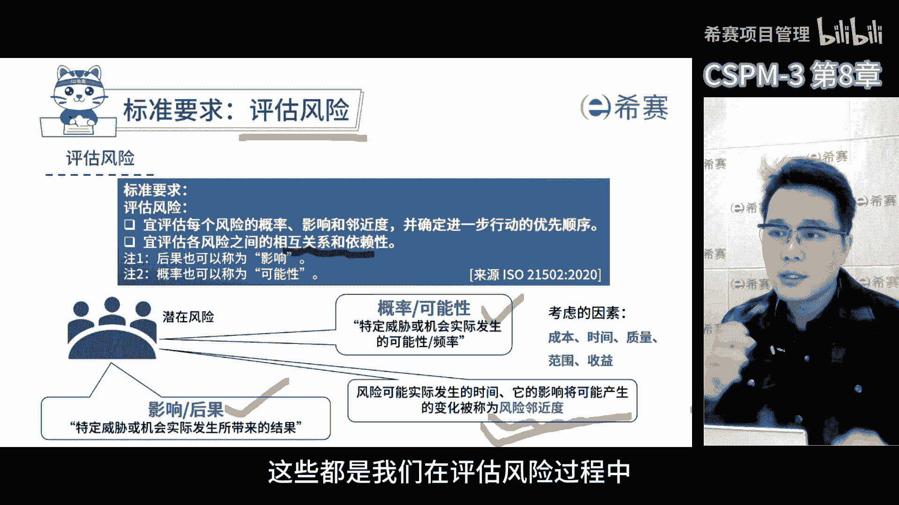

要考虑的问题和因素，我们做项目的时候会遇到很多的最佳实践啊，对于不同的影响程度，我们通常会进行分级，比如说影响概率会分成不同的等级，就拿风险的后果严重程度来说，它也分成不同的等级，不同的公司。

不同的行业唉，他们的分级标准那肯定是不一样的，所以我们在实际工作中，要根据具体的情况来进行分级，确定这个标准，这样才能更加合理，更加符合实际情况。

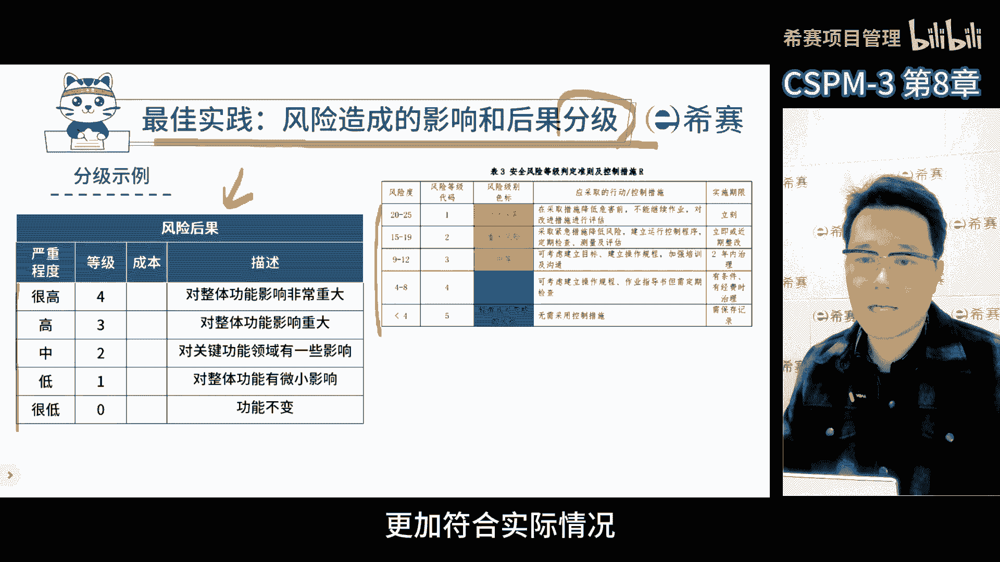

在风险的实践上，有一种叫做预期货币价值的分析方法啊，才是评估风险，我认为比较有效的方式，简单的说就是估算每个风险发生之后，会给项目带来是不是有经济损失，还是能挣多少钱啊，一个是威胁，一个是机会。

那如果能够准确的算出预期货币价值，那么在估算风险的时候就容易很多了，通常我们会将风险的价值乘以它发生的概率，得出的结果，就是考虑了概率和影响的综合数值啊，用这个数值来判断风险的等级。

但是很多公司啊并不能准确的去估算，所有风险的预期货币价值，也就是说不能确定风险发生之后，造成多大的损失啊，或者说能赚钱赚多少钱啊。

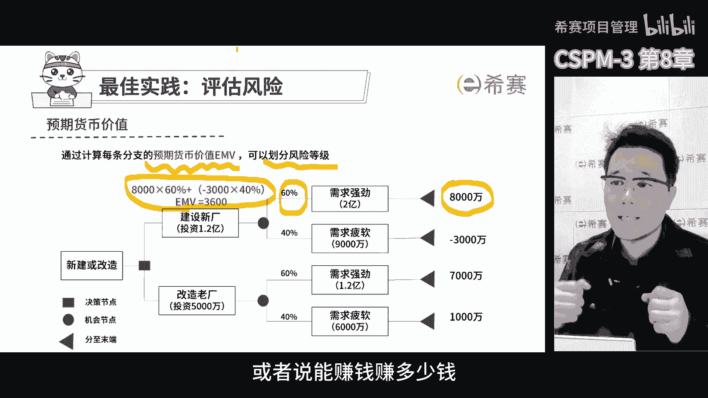

所以他们只能采用不同的方式来处理这些问题，比如说风险的影响分成五级，跟财务相关的，跟人员相关的，跟企业声誉和运营相关的，分成五级或者三级啊，这样就可以根据风险应对不同方面的影响。

把它化成不同的等级范围里面去，当项目经理或者团队识别出风险了，我们可以很快的去定位它是属于哪方面的风险，以及它带来的影响有多大，这样分级的办法蛮常用的。

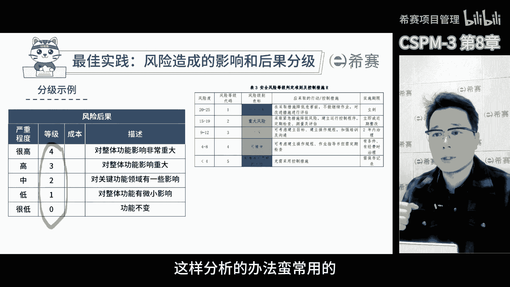

也很实用，还有一点和大家分享一下，关于风险的评价，其实也是分成两步的，第一步是评估风险发生的概率和带来的影响，第二步就是判断项目整体风险水平有多大，也就是说所有风险发生之后，它的整体影响。

一个具体的数字是正向的还是负向的，在那些对风险管理非常规范的公司里面，他们会对于风险的整体接收水平设置一个红线，如果项目整体风险水平达到这个红线，对我们来说，项目可能就会取消了。

因为如果所有的风险同时发生这种极端情况，虽然概率很小，但是会对公司带来巨大的影响，那单个风险咱们要平衡，整体项目的风险也要控制，这两个是不一样的，评估单个风险是为了判断风险管理，能不能管得过来。

而评估整体风险是判断项目值不值得做。

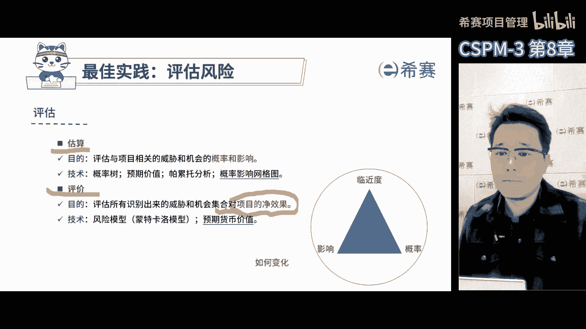

当我们识别和评估完分解之后，接下来就是要应对风险了，标准是这么要求的，针对风险要制定选项和行动，以抓住机会并减少对项目的威胁，应对风险的方法有很多，因为针对不同的风险，我们有不同的应对措施。

在标准里面一共有七种，常见的应对方法，包括接受规避，降低转移，应急计划，利用和强化啊，相信很多学习PMP的人，对于这些应对措施也都不陌生了，第一个对于威胁我们可以选择接受，也就是说当我们遇到威胁的时候。

我们可以选择不采取任何措施，顺其自然就好了，第二个规避就是针对风险原因采取的应对措施，因为风险有原因，事件结果规避，最好就是把原因给处理掉，比如说我们提前发现供应商交付能力不确定。

在没有充分了解供应商的情况下选择了合作，这就是造成风险的原因，那如果供应商不能按时交付，就会影响到我们项目的整体交付周期，对于项目的收益带来影响，从而加深风险，所以规避就是从原因上去除。

如果我们发现供应商不好，就选择其他的供应商，甚至不用供应商，从根本上把原因去除掉，这是规避，第三降低就是我们在用这个供应商的时候，想办法降低这种情况发生的概率，和发生之后的影响，那怎么做呢。

我们要加强对供应商的管理和监督，每天都要催催他们啊，时时刻刻关注进度，通过加强管控来降低供应商，不能按时交付的可能性，或者即便是真的出现问题了，它的影响会比原来小很多，第四转移也是一种常见的方式。

比如说合同转移，保险转移，就是如果出现了问题，责任由别人来承担啊，对我们来说就没有什么影响了，但如果跟供应商有关的事情出了问题，我们需要和供应商签补充协议，或者合同条款规定，如果供应商没有按时交付。

对我们造成的影响部分将由他们来承担，这是典型的转移，你早点交付，晚点交付，只要出了问题都由你来承担，咱们再往下说，第五就是应急计划，应急计划又叫做预案，事件还没发生呢，但是我们已经把提前的预案制定出来。

如果风险不发生，那咱就不用呗，如果一旦发生，我们就直接用现成的方案，这样就能大幅减少遇到风险时间后花费的时间，那如果真的等到发生了，你再组织大家去做，那有可能让这个风险他的影响越来越大。

还是以刚才的风险案例，假如供应商真的不能按时交上货，那我们的货从哪来，假如我们有库存，本来是给其他客户准备的，但如果因为我们的客户比较重要，而供应商，而供应商没有按时提供，那我们的应急计划就是。

先借别的客户的货去补一下这个客户，如果事情没发生，我们就不用应急计划，下面咱们来谈谈机会啊，机会啊就是把握住了，比如说还是供应商，他主动提出想让我们给他赋能，提高供货能力，分析评估之后呢。

可以对项目产生积极的影响，比如说能提前半个月完工，那我们的团队决定和供应商紧密合作，以优化订单和供应链的流程，确保供应商的交付能力提升，那这样就能保证项目能提前完工，这就是利用了机会，那再说说强化。

就是咱们对供应商提出了赋能的想法，帮助他们改善交付能力，可能对于项目的进展有利，但这并不能确定，那咱们就适当的参与，提高对方提前交付的概率，或者能增加一些对项目的正面影响，这就是加强在分享过程中。

这些都是非常有用的方法。

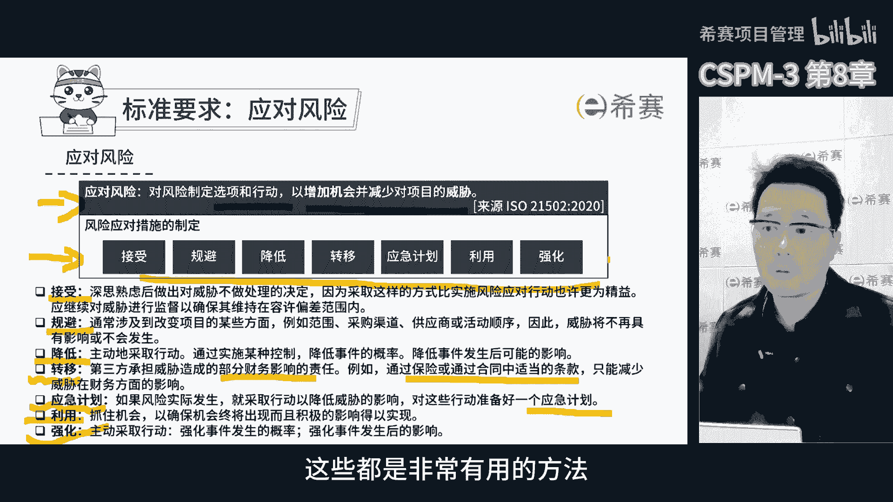

我们通常会建议在面对风险的时候，要组织团队成员一起来想出各种应对措施，从不同角度来制定方案，然后我们对于各种方案进行备选方案分析，比较它的优势和劣势，看看哪个投入少，回报多。

在这过程中还有哪些标准要考虑，比如说适应性，成本收益及时性等等，我们还要看这些措施，是不是符合公司的文化和方式，是否在公司设置的允许范围之内，能不能被责任人理解并执行到位啊，这些因素都要考虑进去。

才能选出一个最合适的方案。

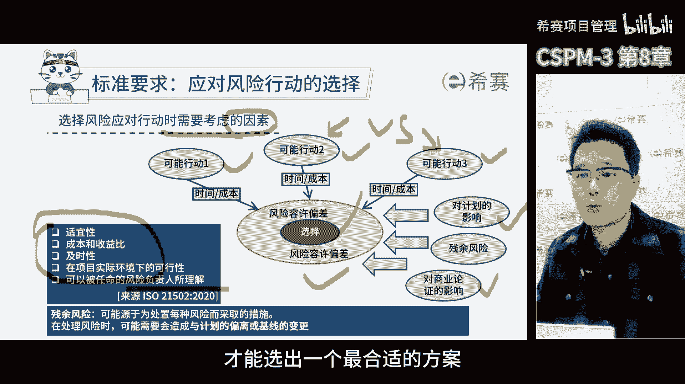

当我们把风险措施制定完成之后，接下来就是落实和控制了。

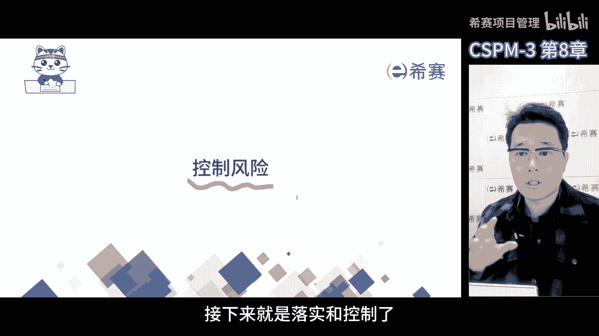

先落实才能控制标准也是有要求的，控制风险，一包括通过确定是否采取了风险应对措施，以及这些措施是否达到了预期效果，确保对负面风险的应对措施，尽量减少对项目的干扰，而对于正面风险应对措施。

则最大限度地发挥有益的影响，应对措施将对于项目的干扰降到最低，而正面风险应对措施则使收益最大化，在控制风险时，可以查看管理信息，包括分析的优先级进度数据，项目计划变更请求和纠正措施。

跟踪风险的发展以及跟踪风险处理有效性，应是控制风险的一部分，这是标准化的要求啊，来自于ISO21502啊，以后这个也会成为我们国家的标准，下面这个框是我对前面标志里的通俗的理解。

我们在实际的风险管理中有一些最佳实践，首先要想风险应对措施落实得好，领导一定是最好的责任人，最好是让领导来当风险责任人，然后把领导下面的人指派为风险执行人，这样有两个好处。

第一可以确保风险执行人有时间干活，第二他是听领导的，领导决定干什么，不干什么，过程受控，但是如果领导既是责任人，又是这些人，那就不好办了，因为太忙就容易忽略，我们通常把责任放到领导身上。

也就是所谓的领导责任制，然后再找一个有时间干活的人当执行人，如果执行人配合得不好，我们就找他们领导来拍板，这是我们通常的习惯做法，这么一来，无论是执行人，责任人都能各司其职。

风险应对措施也就能更好的去落地了，落实风险应对措施的时候呢，控制很关键，要使不监督就很难管控，很难让项目受控，首先要授权，要是没有授权，我们就不清楚要控制谁监督谁啊，所以别把风险责任全压到项目经理身上。

这样既没必要，最好让项目里其他人也参与进来，主要监督，包括之前大家提到的风险应对措施有没有执行，执行的效果怎么样，同时还要审查信息，看看风险医院措施在实施的过程中，哪些优先落地了。

资源不足的时候应该怎么落地，是否带来了新的变更，这样就能跟踪整个风险的进展情况，还能判断措施的有效性，如果效果不好，就需要组织大家项目团队一起决策，根据决策的结果来进行修正和调整。

这个过程就是所谓的控制风险管理啊。

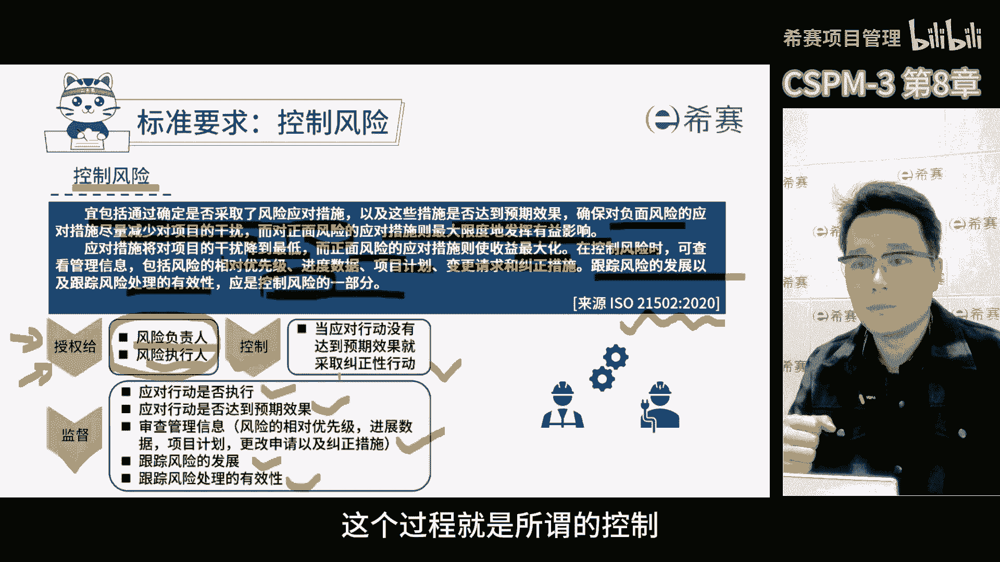

简单来说呢，就是记录和管理项目中的风险，大家都知道项目里面风险很多，什么可能都有，为了跟踪每个风险，我们通常会用表单来记录，大家觉得表单很枯燥，但其实在项目管控中非常关键，在项目真正落地的时候。

我们会用很多的表单，有些是记录风险的，有些是记录问题的，还有一些是记录其他的表达，比如说工作分解结构，财务预算等等，其实这些表单在项目中一个都少不了，在关键节点之前，我们通常会进行清单的检查。

比如说阶段交付前要检查，竣工前要检查，执行前要核对，这些清单都是为了确保每个阶段的任务，都能完成，在项目管理过程中，表单的模板用的还是蛮多的，以前在项目上被大家戏称表哥表姐啊。

因为每天都在用表单来计划来跟踪，来记录各种事情，通过这些表单，我们能够更好地开展各项管理工作，那在风险管理那边，我们需要记录风险的名称，原因事件，它的概率影响程度，根据这些信息。

我们可以决定风险的优先次序，哪些风险先发生，咱就先管，同时呢我们还要考虑应对措施，责任人和他的状态，这就是我们说的项目风险管理，风险管理呢真的挺重要，很多企业也都会专门来讲这个课。

而且风险管理也是项目经理必备的技能之一，说白了项目管理管的是什么，管的就是风险，这一页是思维导图，大家可以暂停回顾一下今天的课。

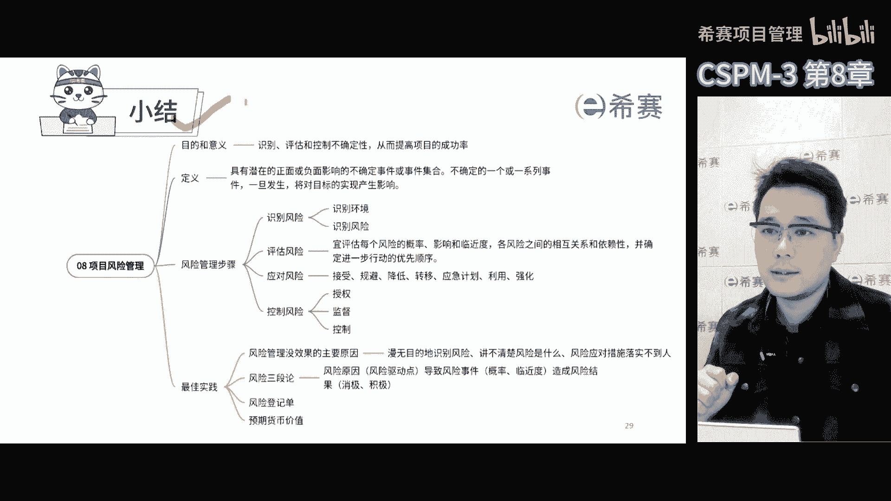