# 【精华版收藏】2024年CSPM-3级（中级项目管理专业人员）考试精华版视频课程合集丨核心考点！快速通关！ - P15：cspm-3 第12章 项目汇报 - 希赛项目管理 - BV1vf42117Fq

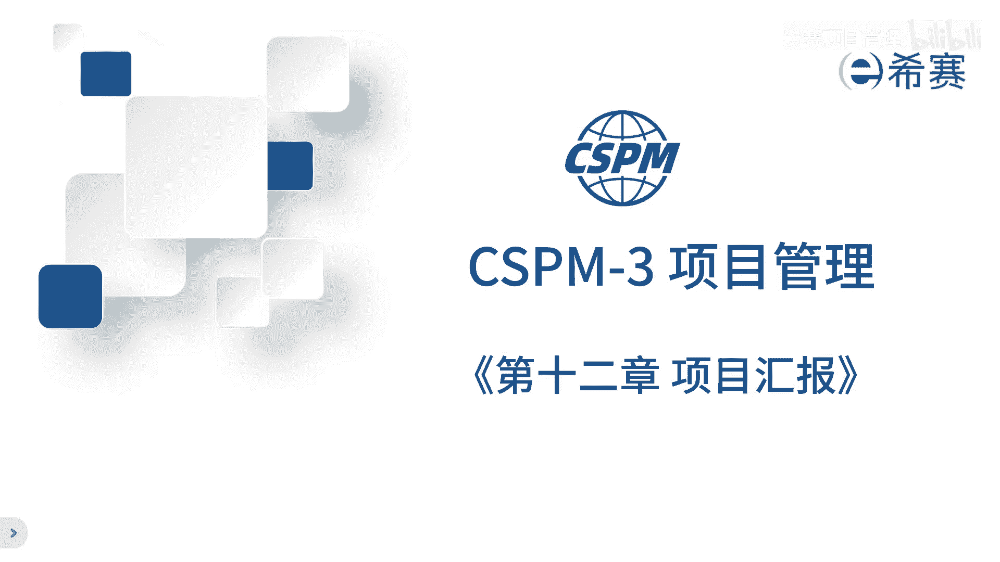

同学们，咱们今天来讲解第12章项目汇报，这一章节是项目管理中非常重要的环节，有可能是你的高光时刻，来一起来看。

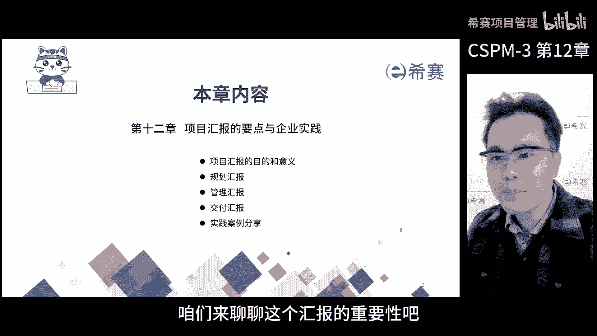

首先来看一下汇报的重要性，在咱们国家标准里面，汇报是一个重要的领域，连国际标准ISO都把它纳入进去了啊，这就可见它有多么的关键，为什么要汇报呢，那因为项目管理的本质就是通过向上管理。

来实现微权力下的向上管理，项目经理没有什么实权啊，只能借着领导的名义来推动项目项目的事情，先得向领导汇报一下啊，得到认可，这又成了领导的决策，然后咱们拿着领导的决策呢，去跟相关的人传达啊。

这就是让领导赋能支持管控嘛，好接着定期给领导汇报，让执行层不干不干活，那为什么汇报这么重要呢，因为汇报还有个名字叫做控制，就是有人得把执行的结果报告给决策层，决策层收到结果之后呢，要评审一下。

然后再给出新的决议或者指导项目，自己再去落实这些决议和指导，传达给相关的执行方，来调整自己的工作内容和方向，调整完之后再汇报项目经理，再报告执行情况，零合度再平移，接着再给出新的指示，再传达再调整。

再汇报，再决议，再传达，再执行再调整，你看这个过程中就一直在循环，这时候整个项目管理过程中呢，呃这个循环环节就是PDC那周而复始，那其中的汇报就是一个非常重要的环节，少不了的，处在第三级的项目经理面啊。

一定要明白这个道理，汇报是晋升中最重要的一个能力，想要往上爬，想尽快被提拔就好了，锻炼一下汇报能力啊，毋庸置疑，必修能力啊，大家要注意汇报不是错误的啊，有些人还感觉好像看不起汇报他是正确的事情。

咱们的国际标准和国家标准里面，都有明确的要求，向我们汇报，是为了提供项目的现状，从而进行分析和预测用的，那汇报的报告呢，要与当前咱们最新的项目文档保持一致，通过对项目管理信息的分析来确定。

应该在项目的早期进行规划和记录，汇报方式和方法，在项目期间呢要执行项目汇报，并对其进行监控和调整，确保与汇报对象的需求和要求要始终保持一致，他想要什么，你给他什么，你不要说差了好。

再来说说我自己的经验啊，那汇报能力其实它背后锻炼的是一种影响力，这个影响力呢，就像你把这个想法装到别人脑子里面，有人说啊，这世上最难的两件事情，那第一就是把别人的钱装到自己口袋里。

第二呢就是把自己的想法装到别人脑子里面去，那咱们的汇报是不是就这个事儿啊，哎把自己的想法装到一群领导的脑子里去啊，让他们把资源把钱都支持你去做你想干的事，这事呢难不难肯定难，所以啊汇报水平的高低。

可是直接关系到人家对你的这个，认可度和支持度嘛，而这种影响力本身就呈现了一种博弈，在这个过程中呢，哪方更胜一筹，影响力强的一定会胜出，所以汇报是非常重要的一个技能，得好好练好，说到汇报工作啊。

真是个反正是一个技术活吧，要知道哈啥该汇报，啥不该汇报，这可是需要自个儿拿主意的事了啊，别觉得事无巨细，你都汇报出去，有时候领导可能不爱听这些鸡毛蒜皮的小事，关键还得看领导想听啥啊。

这可是咱们这些下属得去呃，细细琢磨的，要看人下菜碟的本事，想当年我跟不同的客户呢汇报不同的方案，就是拿着一套PPT讲不同的内容，那其其他人都说我是变色龙啊，当时我还觉得诧异，什么叫变色龙啊。

就是说你同样的一个PPT一个字没改，但是你给领导讲的是一回事，跟团队讲的又是另外一个内容，跟客户讲的又是另外，其实这个点就是汇报的核心，你要见不同的人说不同的内容好，这事呢刚开始其实我也没在意啊。

后面其实慢慢的也就是练出来了，形成本能了好，所以说啊咱们汇报工作这事儿啊，得学会察言观色，你要观察别人，看看人家是不是爱听，你要说的啊，如果别人爱听呢啊，你就多说点，如果不爱听，赶紧换，别硬着头皮。

非得把那个准备的话全说完，那这种做法非常不好，汇报工作啊，重点关心的应该是人家对你的态度和反应啊，这个在虽然道理都懂哈，在实际的执行过程中，其实很多人他做不到啊，就一直巴拉巴拉在讲自己想说的。

最后自己觉得好像说的很好，别人根本就没听进去啊，根本就不关心，想把汇报这事做好啊，得提前做好规划才行，在规划的时候需要弄懂三件事情，第一呢汇报的好坏会对哪些方面产生影响，第二汇报与沟通的异同有哪些。

第三汇报的重点是什么，来咱们展开来讲，首先向我们汇报在工作中具有非常重要的作用，它不仅仅是向同事或者领导，展现工作成果和进度的机会，也是获取反馈啊，解决问题和调整策略的重要途径。

然而如果你的这个汇报效率很低，效果不佳，就会对决策效率产生负面影响啊，那从而就影响到了这么执行效率，向我们汇报的效果，往往取决于汇报者的能力和技巧，那一个擅长汇报的项目经验。

能够清晰准确地传达出项目的各种信息和数据，同时也能对项目中的问题挑战，深入的进行分析和讨论，这样的汇报呢，不仅能让领导和同事更好地了解项目的进展，和这个出现的问题啊。

那也能够为项目的决策提供有力的支持啊，要不然领导担责任的啊，所以他为什么不敢拍板，为什么不敢下资源啊，原因是你的汇报没有达到他的预期，或者没有他想要的东西好，相反的，如果汇报能力不足呢。

或者准备不充分呢，就会导致汇报效果不好，结果不好，那这样的汇报不仅浪费了你的时间，领导的时间，那很多资源也浪费掉了，还会让领导和同事对项目产生不准确的影响，从而影响决策效率，那因此呢汇报项目的工作啊。

需要在思想上和行动上都要重视啊，尤其是思想上的重视是非常重要的，那再者我们来看一下汇报和沟通的区别在哪里。

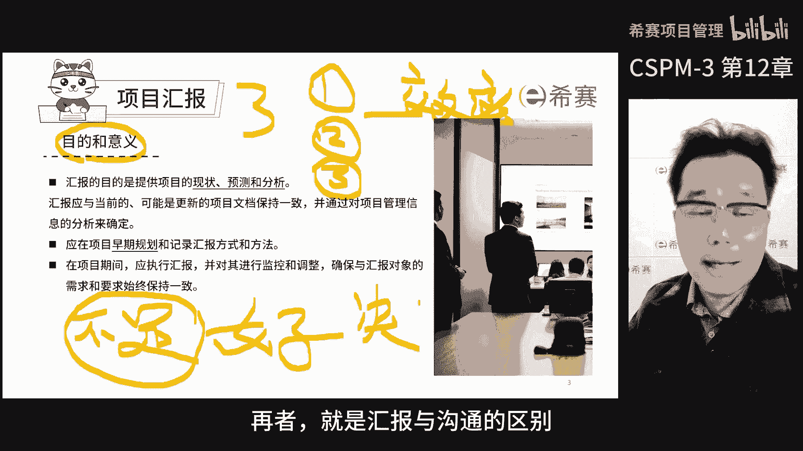

那汇报不同于沟通啊，首先目的不同，汇报主要是向上级或者相关方提供工作的进展，结果，问题的信息啊，以便他们了解情况并做出决策，而沟通的主要目的是促进双方理解和合作，解决问题啊，达成共识，那其次呢内容不同。

汇报通常包括了具体的数据，事实和结果，重点在于向他人展示自己的成果和问题，而沟通更加广泛一些啊，可能涉及各种主题啊，内容啊啊包括我们的意见交换啊，啊讨论啊等等，那再者呢是形式不同，汇报通常是单向的。

由报告人向听众提供信息，而沟通可能是双向的啊，涉及到了这个双方的这个交互式的沟通和交流，最后是频次不同，汇报是定期的，可有周报月报啊，这个年报好，关键节点呢也要需要汇报，而沟通更加灵活。

可能根据我们的项目情况好，随时来进行协调和解决问题，那相同点也很多，首先都需要我们的信息传递，都需要双向的互动好，都需要清晰明了，那这里面可以大体上清楚一下沟通更大，汇报是沟通中的一种。

要通过沟通进行汇报，好明确两者的区别，在规划汇报的时候就不会走错方向了，那最后就是要想清楚汇报的重点是什么啊，这是核心，就一句话，见什么人说什么话好观察对方，关心哪些，对方的状态是什么。

咱们就说他在乎的，千万不要只为了自己想说的那些东西啊，只有踩坑了，那来看看咱们标准里面是怎么要求的啊，得给汇报当做项目治理的一部分来计划，通常需要汇报，告知项目组织的不同层次上的这个工作人员。

他们所在的这个范围内的工作状态啊，传达出去，那首先前期做好计划，明确有几个层次，比如说高层我们要汇报这个内容，我们要汇报那个内容团队，我们要需要汇报这些内容，客户供应商，我们需要汇报对应的内容。

跟不同人咱们汇报内容是不一样的，原因是人家关心的事儿不一样，那咱们希望对对方带来的影响也不一样，在这个世界上，所有的管理和影响都是基于信息，不对称的，所以我们要充分考虑不同的人传递不同的信息，其次哈。

在规划汇报的时候，我们还得考虑一个重要的问题，两个方面，对方关心什么和我们想影响对方什么，那就是定义汇报的需求，包括咱们的内容给谁呀，频次是什么，保密性，还有什么格式，有哪些好，哪些对方非常关心。

咱们要多准备一些，这些都是标准里面要求的，得考虑周全，还有我们汇报的内容，希望对方有什么反应，如果汇报内容哪些可以让你知道，哪些不想让你知道啊，来影响你对这个事情的认知，从而获得我们想要的一个决策结果。

比如说多投钱还是多给一些资源，目的不同对象不同，说内容完全不一样，在前期规划的过程中，要把事情考虑周全，因为这个过程做得好与坏，在很大程度上会决定后续的这个结果。

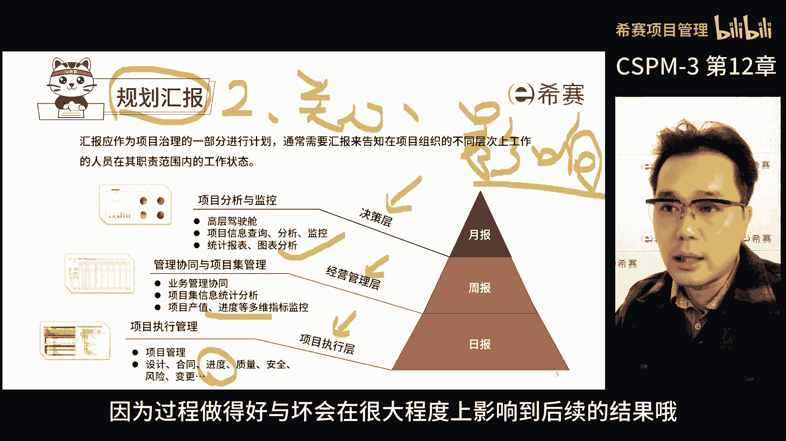

这里有个最佳时间的例子啊，来自麦肯锡公司，他们有一个女性顾问是芭芭拉，他写了一本书叫金字塔原理，那这本书其实主要是正在顾问的角度去表达，如何去影响这些企业家以及企业的高管。

他们的顾问呢也非常擅长影响别人，都是有套路的啊，好咨询顾问呢，这些套路呢最后把它总结汇总成了金字塔原理，之后，国内有些专家也写了一本书啊，类似叫结构思考力啊，推荐大家去看一下。

其实这两本书背后都想告诉我们，如何通过结构化的表达，更好地去影响别人，今天我们就来分享一下这个方式，对我们的汇报真的是非常有效有用，好结构化的表达和汇报呢要遵循四个原则。

这四个原则就像我们沟通的秘境时了，有了他们呢，我们就能够更好地表达自己的观点，第一个原则自上而下，结论先行，这个原则说的是开始的时候，你先把结论讲出来，把问题的全貌展示出来。

这样听众就能直接了解你的中心思想，第二个原则呢是层次清晰，要把相关的议题放到章节里面去讲，分清楚层次，分清楚结构，那第三呢就是结构要简单，这样听众就能更加容易理解，说话呢表达这个本来就是一门艺术。

除了以上的三个原则，那关键是精炼，否则别人就不知道你在说啥啊，特别是平铺直叙的时候啊，就每个字都知道，就是不知道你想表达什么重点，所以汇报的时候需要灵活的运用，这以上的四个原则。

那才能更好的去表达自己的想法，那接下来我们就详细的展开来讲一下，说到自上而下的表达方式啊，首先要了解一下两个流程，分析问题的过程和汇报的过程，他们可是不一样的，那首先分析问题的过程呢，有事实，有表象。

得分析具体的原因好，最后归纳出咱们的结论，这个推导的结果过程，最终是帮助我们得到下一步行动的依据，那当咱们把这些信息告诉别人的时候，就不能按照分析问题的过程来说了，此时重点应该是需要先把结论先说出来。

先讲你认为的结果是什么，接着去解释你怎么得到的结果，那最后你要讲一下下一步应该怎么做，要注意哪些东西，那这样才是一个高效的沟通过程，那对于汇报和演示来说啊。

在有限的时间内要去传递我们的信息，并影响到别人，特别需要把问题归纳的过程，和问题的阐述过程要分开，如果在汇报过程中，你是用的问题归纳的这种方式哈，没有用咱们产出问题的这种方式，那对方就没有耐心。

根本听不下去啊，容易打断你，我觉得你说的不是什么重点啊，能力不行，工作也没做好啊，所以记得一定要结论先行好，再慢慢展开，那说话表达这是个技术活，你想让别人听得明白，一定要自己结构清晰，就是自个儿想清楚。

你才能说得明白，那否则这个事情就很难办。

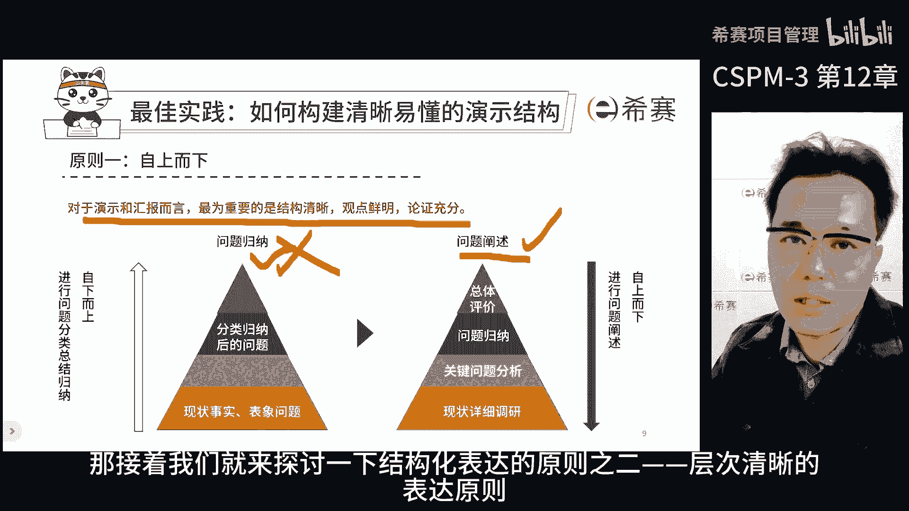

这就是第二条，咱们来看一下层次清晰的表达原则，这个原则里面有一个最佳时间啊，还是在咱们芭芭拉明托的这个书里面，写的叫me c m e c e的方法，那中文意思呢就是相互独立，完全穷尽。

VC法则是一个很有用的分析问题的思维方法，能够将一个重要的议题分成若干个分支，而这些分类之间，这些分支之间没有重叠，没有遗漏，并且能够捕捉到问题的核心啊，从而得出一个有效的解决问题的一个方法。

那也就是说在分析问题的时候，我们要把所有的可能性都考虑到啊，不遗漏不重叠，避免出现一个问题，好来看一个例子，比如说我们来把这个人怎么去进行分类好，应该先把人分成男人和女人吧，这样才全面好。

然后再把她男人和女人再往下分解，那如果你只分了男人和未婚女人，那就遗漏到了已婚男人这部分，那这就是未穷尽好，如果划分为男人和已婚人士，那这时候在已婚里面有已婚，男人和男人有重叠啊，这时候不独立好。

所以我们在做汇报的时候，也尽量去做到层次要清晰，不遗漏，不重叠啊，再举个例子啊，比如说我们要论证一个观点，就是我们应该把房子出售，那我们需要列出几个理由，需要更大的地方，房子已经很旧了。

好需要花费成本很高，厨房太小了，炉子坏了，好，屋顶有些漏雨，我们这条街道呢太繁忙了，好这些理由之间没有什么重叠啊，相互独立好，这样我们的理由才会充分，才有更强的说服力。

好再看一个成立新公司进入新市场的障碍很少，好理由是开业成本很低，也没有法规上的这个限制，不需要太多的专业经验和科技知识，已有符合条件的员工和现成的办公室，就可以使用好。

这样你就会发现这五个方面也是相互独立的，而且和解呢呃比较全面，那这是一个很好的表达方式，如果我把第四条改成员工人数不多，工资开销少啊，那就和第一条的成本重叠了啊，层次就不清楚了，好总之啊，层次清晰。

表达原则对于我们的工作和生活是非常重要的，希望大家掌握这个原则，在汇报的时候呢啊更有说服力啊，更能影响到我们的客户和相关方，第三个原则叫结构简单，那这条非常关键的地方就是表达之后，你要说三点，按三来讲。

因为这个表达呢足够简洁，容易记住，也不会显得少，还有一个特点之处呢，就是它特别符合我们国家的一些表达原则，那就是一分为三啊，我们国家呢自古以来就是喜欢用三的，你看啊领导讲话，他突然说三点哎。

大家听起来就很容易记住，如果讲多了就容易变成废话了，好还有就像咱们说的道，生一一生二，二生三，三生万物，所有的事情其实到了三基本上都穷尽了，好如果我们要讲四点，那证明我们没有讲清楚，没有分清楚。

唉没有讲得很极致，三这个数字比较容易让人记住，你看吧，我们国家有很多就以三为基础的啊，比如说三国演义，三口之家，好，企业的组织结构分为高层，中层，基层和利益相关方，又分为投资方，使用方和供应商。

你看都是以三来划分的，那我们在锻炼自己结构化的表达过程中，也要尽量以三为中心，在表达中心议题的时候，可以从三个方面来展开啊，这样不仅有清晰的逻辑关系，而且更能让人记住，这是我们在结构化表达时。

需要注意的一个重要原则啊。

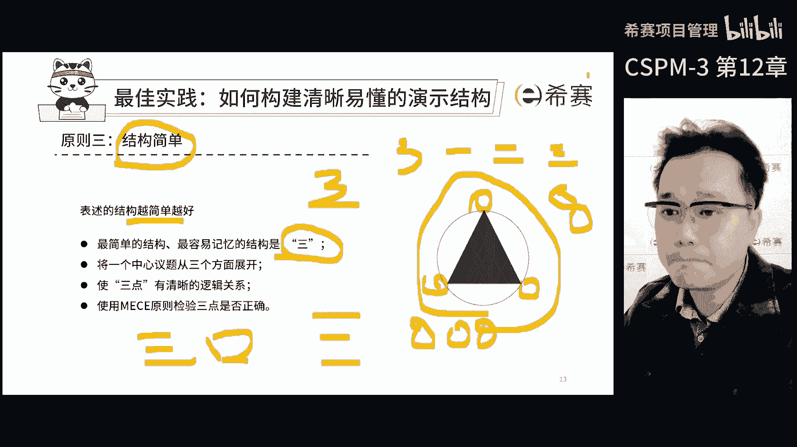

第四点是重点突出的原则，那这个原则呢就像我们熟悉的二八定律好，要抓住问题的关键，项目管理也是要抓住关键嘛，在汇报的时候一样要突出重点，不要面面俱到啊，这样更有价值。

汇报中最重要的让领导记住我们的工作成果，那在整个汇报材料中，我们一般要按照一分为三的方式进行，定义和检验才行啊，那通过MC的方式进行啊，检查确保相互独立，完全穷尽在结构层次上，逻辑没有什么问题好。

接着我们就要做最后一点了，叫亮点筛查，看整个汇报中有没有亮点，这个亮点呢就是汇报的重点板块，如果没有亮点，那我们就要总结提炼，怎么着也得找到亮点，让领导能够看到我们的成果。

相反的我们最怕就是流水账式的这种回放。

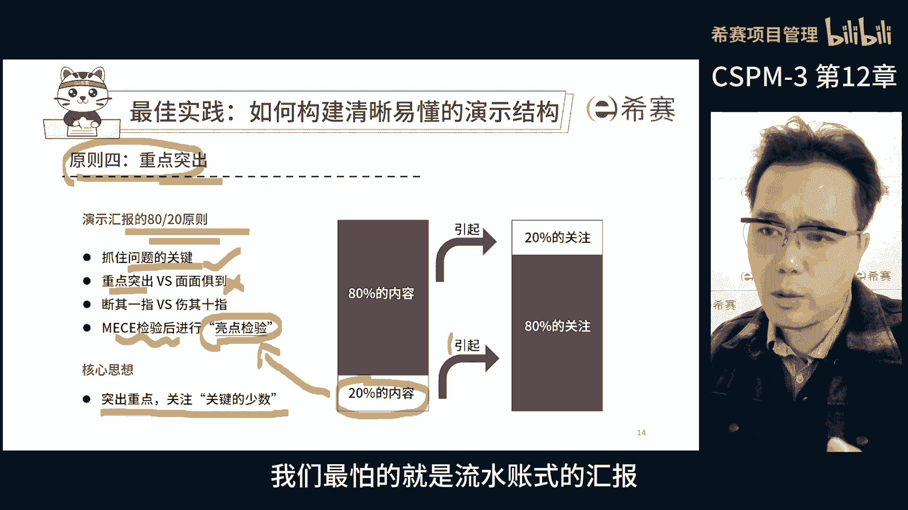

在项目管理过程中，我们主要汇报的是偏差，还有一些需要领导特别关注的地方，那这些关注点可能就是，我们取得了重大的成就和亮点，也可能是我们遇到了一些问题和困难障碍，我个人觉得啊，成果和亮点一定要汇报。

没有你也要总结出来，因为亮点表达了重点，突出了，领导才会更加支持你，更加信任你，那这就是核心了，这也是你升职加薪平步青云的关键节点啊，这是里程碑事件哦，在汇报的时候呢，也要善用各种管理产品。

其中之一就是工作绩效报告了，好这份报告可能包含了丰富的信息，总体进展问题，风险计划图，已完成的工作啊，未来计划的内容啊，这些都是它的核心，那不仅如此，他还关注技术的运营数据，项目的变更成本支出。

资源使用等等各个方面吧，有任何报告，我们就能对整个项目的一个情况，有一个全面的认识，对于这份报告说，偏差和对未来的预测是重中之重，就像医生给病人看病，我们需要把这个过程把把脉啊分析彻底，理论上来讲呢。

正常的进展呢一般不需要回报，因为这是理所当然的事情，但是项目汇报主要需要在这种反常的地方啊，问题呀，偏差呀，一些例外情况呀，那好的异常和不好的异常，都是我们需要特别关注的，通常不需要大篇幅的去汇报。

领导的时间都比较紧张，想听重点和关心的地方，那这里面不可或缺的就是风险板块了，那么对于风险汇报呢，它可是跟于风险管理息息相关的。

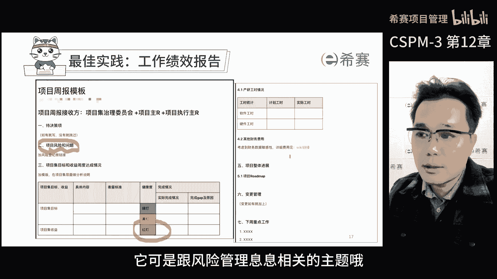

收到风险要编制风险报告，那里面需要包括大家看到的问题。

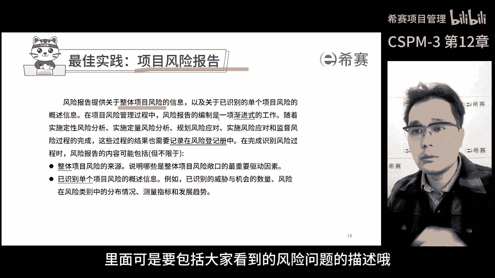

描述风险的原因，事件结果，还有对应的责任人啊，应对措施等等，那这些在风险汇报过程中可能都要说出来，那重点来了，风险描述必须要清晰明了，原因，事件结果都要讲清楚。

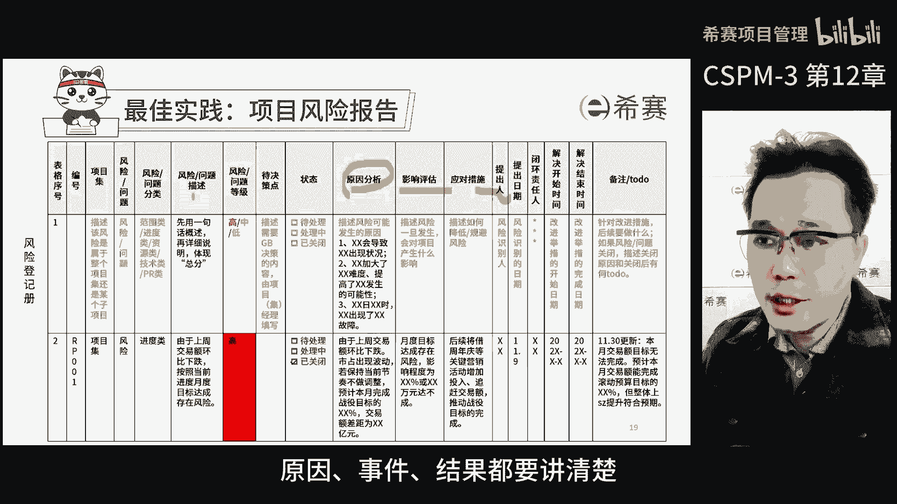

如果不讲清楚，汇报效果肯定不好，对于项目来说，立项和减二是大事，大家都明白，不过在项目的进行过程中，阶段性的汇报也很重要，为啥因为在项目整个生命过程中，我们都是按照阶段来进行划分的。

每个阶段都要进行考核，评价文件的总结和归档，很多个阶段的汇总就形成了最终的报告，项目，最终报告包含了对于整个项目或阶段的概述，比如说目标范围的评估标准，达到完工的我们的一些证据和质量的目标。

质量的评估对应的核实信息和实际里程碑，交付日期以及偏差的原因，成果方面呢是实现了项目的预期收益，没有收益实现的程度咋样，并且我们要预测未来的情况，最终产品是如何满足商业计划里面的，一些要求的。

那这些点都是客户啊，咱们的发起人领导关心的点啊，非常非常的核心都要写这份文件里面去。

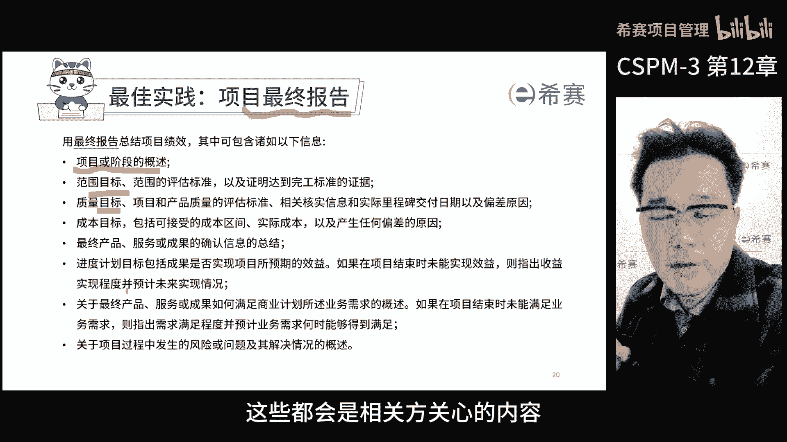

像我们竣工时会做一件事情，叫做复盘，现在越来越多的项目呢重视复盘了，复盘本身呢是一种方法和技巧，在项目管理过程中也少不了它，那项目的复盘也分为阶段复盘和，最后的军工复盘。

现在大部分的项目呢复盘方法的前身，都是起源于联想的复盘方法，那复盘这个词呢其实来源于围棋术语啊，每次围棋下完了，那大家都会重新摆一遍，模拟一下，分析一下整个过程中的得失好，因为在下棋过程中。

大家太投入了，整个跟着我们的这个下棋的过程走，那可能没想的那么明白，那下完之后呢，如果不重新把这个过程重复再来一遍，撸一遍，我们就搞不清楚哪些地方有问题，哪些地方做得很好，那不利于我们今年的沉淀。

那也不利于我们后续的成长和能力的提升，为了避免重新犯错啊啊就需要做复盘好，那咱们再来聊一下项目中，复盘的步骤是什么样子，你用四个步骤，第一步回顾目标，就像我们平时做事一样啊，首先得明确目标，明确方向。

第二步评估我们的结果，看看我们的实际做的事情跟计划是不是相符啊，是不是达到了预期目标，第三是分析原因，就像做题一样，我们要分析他的失败和成功的原因，找出问题的症结所在，第四是总结规律，通过分析原因。

我们可以总结出一些规律性的东西，来把它沉淀下来，为后续的工作进行指导，回顾这块呢非常重要啊，无论是在阶段复盘还是项目的整体复盘。

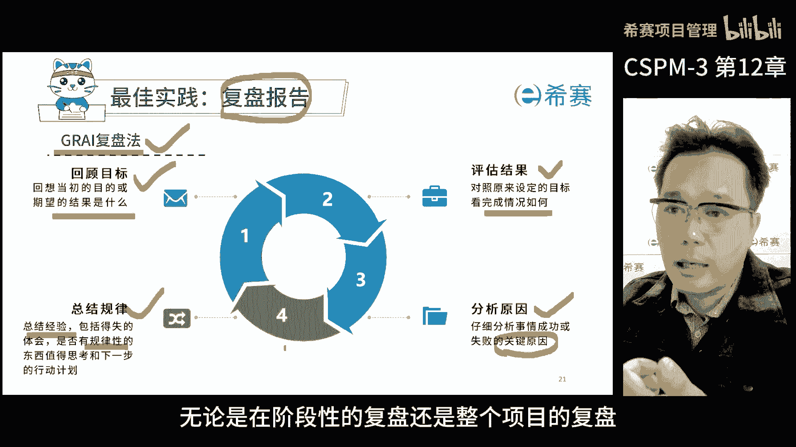

首先要做的就是把最初的目标找出来啊，就像咱们在大海里面找到一个灯塔，那方向你得走对当时我们定的目标是什么，希望答案是什么样的结果，这些都是我们需要重新梳理一遍，有了明确的目标和计划，才能有更好的。

下一步就是评估一下完成情况，找到差距和问题所在，那接着要做评估了，看一下实际的事情和计划是不是一致，有没有达到预期的目标，就像考试时候，我们要对一下答案啊，看看我们的分是多少。

那对比一下计划和实际完成的结果，看哪些地方做得好，哪些地方需要改进，这样我们才能更好地了解自己的优点和缺点，为下一步的改进做好一个数据的依据，接着要分析原因，深度挖掘一下。

造成计划和实际不一致的原因在哪里，这个过程就像我们的医生诊病啊，我们需要分析每一个细节，成功的原因，失败的原因，这些都需要我们认真的去思考和分析，成功的原因是体现出来的。

为以后的工作提供一些成功宝贵的经验，那失败的原因也要总结出来，找出根源在哪里，避免以后再犯同样的错误，最后一步是总结规律，我们要通过前面的分析，总结出一些规律性的东西，为以后的工作提供一些指导和借鉴。

那这些规律啊可以是自己需要改进的地方，也可以是组织需要调整的地方，对于自己可以改进的地方，我们可以立马行动，对于组织的呢，我们可以提出一些建议，而为组织提供参考。

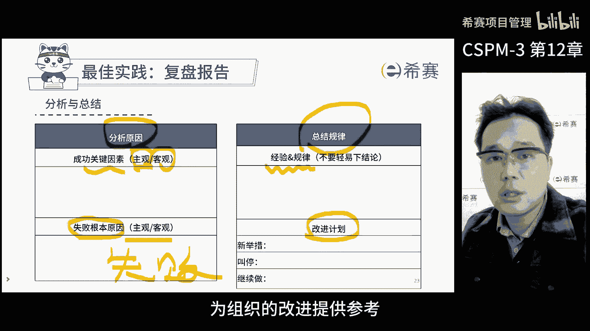

那总的来说，复盘是一项非常重要的工作啊，它不仅仅可以让我们更好地，了解自己的公共情况，还可以帮助我们发现问题，解决问题啊，提高我们的执行效率，所以大家在工作中，生活中都要多去用复盘这个方法。

把好的经验传承下去啊，提高自己后期的这个工作效率啊，学习本身也是一样的，我每天在学习的时候做好总结，就保证每日精进以后会越来越快，所以俗称一句话叫慢就是快，这个慢放到哪里。

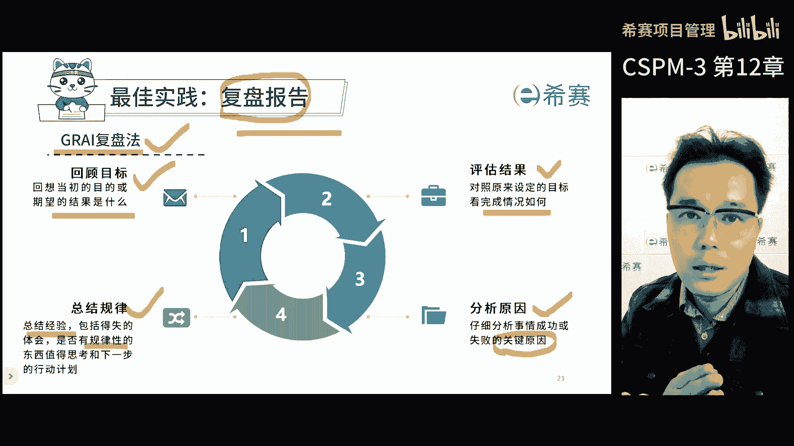

放在复盘上面去好，以上这些内容呢都是在规划汇报中做的。

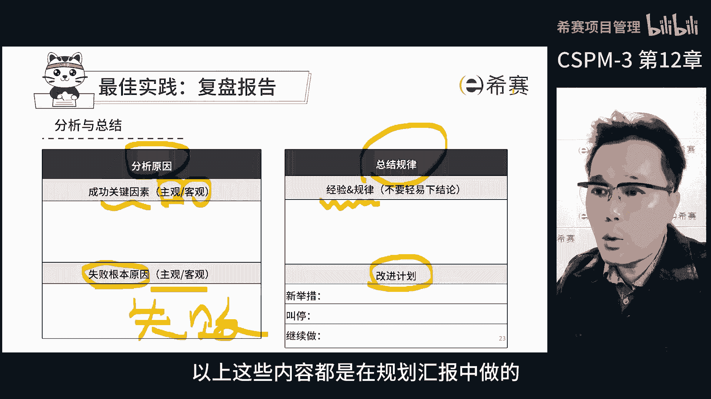

那提前做好了这些准备，接下来就是在项目的实施过程中，要做好管理汇报工作了，那首先我们回到标准里面，先看一下标准是怎么写的，管理汇报重点是确认准确可靠的信息，能够从项目组织的一个层级传递到另一个层级。

这里的层级需要自上而下的回报，好关键就在这里了，在项目的管理中，汇报要分层进行，比如说工作包的负责人和或者工作报告经理，他们得给项目经理进行汇报，通过了解信息，项目经理进行决策。

而项目经理呢要给项目的发起人，汇报项目的状态啊，风险和问题啊，好再往上汇报，发起人给到项目的利益相关方，他们关心的事情是什么，信息是什么啊，比如说我们的利益，我们的收益，我们的价值等等，那不同层级。

他们汇报的侧重点是完全不一样的啊，这么一来的话，整体的汇报这个信息的流动啊，就一层一层的去传递了，像一个金字塔一样，而每一层都有自己的职责和义务，这样才能够确保项目能有效地推动起来，那重点强调一下。

区分汇报的对象以及对应汇报的内容。

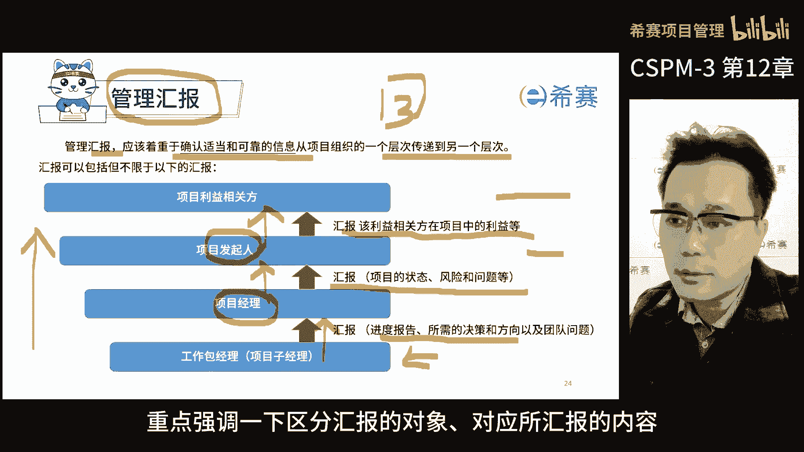

最典型的一个汇报啊，是咱们的项目启动会，优秀的项目启动会，会前准备很重要，那相信大家多端达成共识，会选准备包括什么呢啊，就是与客户高层商量一下一程是什么，参会人员的名单有哪些，还要选定主持人。

明确会议的议程，准备相关的演讲的PPT的资料，准备领导的演讲稿，主要领导都要讲话的，大家都是看在领导的份上来支持项目的，所以领导的位置越高越好，越大越好好，客户方准备好场地，做好场地的布置。

甲乙双方参会，还有会议要提前发出通知，给大家留出足够的时间来准备启动会议，召开启动会的过程中，首先客户方项目经理呢介绍项目的情况啊，准备的怎么样好，并宣布项目组成的成员以及他们对应的职责。

然后乙方的项目经理向企业，介绍乙方的成员以及他们对应的职责，并做好乙方实施方法的啊，主题的演讲，最后应该让客户高层做总结性的发言，以表达领导对项目的重视程度，给相关人员以职责和安排。

客户领导要说明项目的目标，向项目的经理，项目小组进行授权，那如果需要的话，可以在项目启动会上，针对客户的管理层，他的理念以及管理的一些要求进行培训，也可以介绍项目成功和失败的案例。

那重点说一下成功的条件和导致失败的原因，来让大家吸取经验教训，避免踩坑，那同时也需要注意项目启动会议不要太长，主要给出一些相关的核心信息，老总的决心把这些核心的点传达下去，给到相关的负责人。

能够引起他们的充分重视和理解，为下一步实施小组推动项目奠定基础，项目结束之后呢，最好白纸黑字的写下来，大家都签字，那这么一来板上钉钉了啊，以后反悔就非常困难了，支持项目的整个启动会员啊。

他过程呢都特别像咱们这个新人夫妇结婚，婚礼就是婚姻的起点，项目启动会也是项目的实施起点，那这个过程一定要双方的重要领导来参会啊，一定要有这种特别庄重的仪式感，项目的核心成员做出承诺的过程。

就像新人交换试验是一样重要的，他们的承诺就像不是项目经理，而是各自的领导和所有参会的人员，这个过程一定要被记录，可以是照片，视频啊，也可以是签字，而且这个记录一定要公开，让更多人看到，公开的范围越广。

大家的监督和制约的力量越大，这么一来，我们把项目的启动会议试成项目的一开始，好的开始是整个项目实施成功了一半，那成功的项目启动会呢，就可以减少项目实施过程中的很多的问题啊。

好另外还有交付报告也是非常重要的。

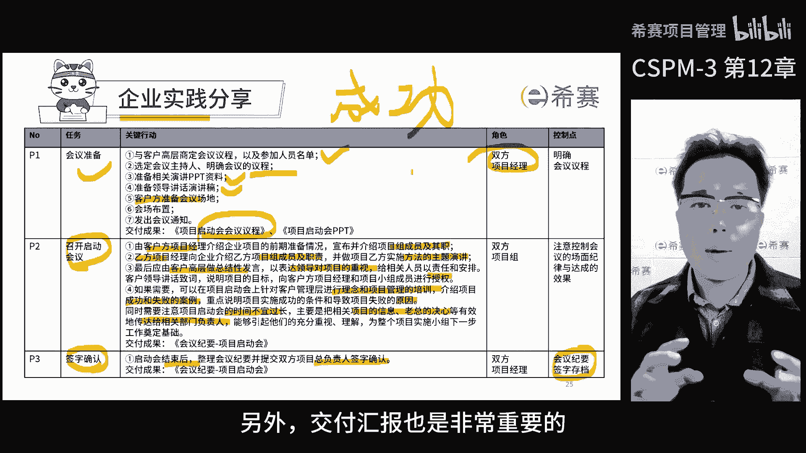

项目应该按照项目所要求，所确定的方法和时间提交啊，还要考虑保密啊，安全的问题，报告的形式可以是多样的，可以针对不同的相关方调整报告的层级，形式细节，那这些报告可以定期准备，也可以基于项目的情况临时调整。

包括我们项目的演示啊，咱们的网页更新不同的形式，而且这些报告应该提交给相关方，发布给更多的人，根据不同的利益，相关方报告的形式和关注点进行对应的调整啊，尽量避免让所有人都拿到完全一样的东西。

因为这样看起来就非常不友好，会影响到我们的汇报的效果，而从而影响到项目的执行，所以一定是看人下菜碟儿，以结果为导向好了。

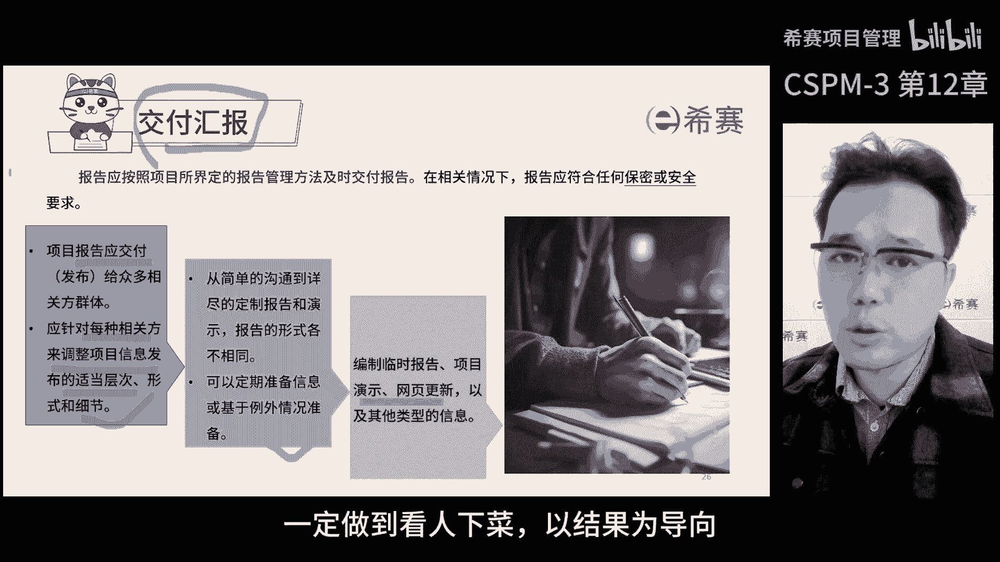

今天我们内容都说完了，我们简单的小结一下，我们提到项目汇报的重要性，汇报对于项目经理说是需要具备的核心能力，也是至关重要的任务，事实上我们重点理解了汇报和沟通的区别，在汇报中主要侧重于提供项目状态。

差异分析和对未来的预测，目的是促进有效决策，而沟通则是更注重大家对于信息的需求，确保双方有互动有效，以帮助项目成果成功交付，好汇报是为了促进共识行动决策，汇报在表达上有四个原则，自上而下，层次清晰。

结构简单以及重点突出，如果我们能充分利用好这四个原则，在汇报工作上至少咱们及格了，当然在汇报之前呢，我们需要完整的分析一下到底向谁汇报，人家关心什么啊，这些前期准备工作也是必不可少的。

汇报的形式有很多种，包括工作绩效报告，风险报告，总结报告，复盘汇报等等，无论是哪种形式呢，我们都需要考虑到汇报的过程中，针对不同的人，不同的信息，做好信息分层报告要及时提交，不能延迟。

那进展到该汇报的时候就要及时汇报，比如说周报，那该提交的时候就要提交该提供的信息，需要提供这些信息，及时性和准确性也是非常重要的，那总的来说，这些内容都是我们在活动过程中，对大家的一些基本要求啊。

当然啊在开展工作过程中，我们需要大量的去实践，找到适合自己的汇报方式，好这是我们今天整体上项目汇报的内容啊。

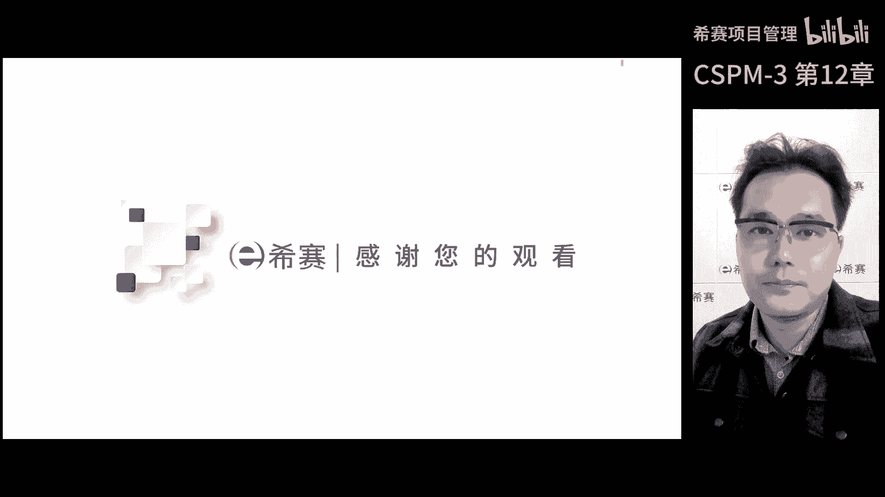