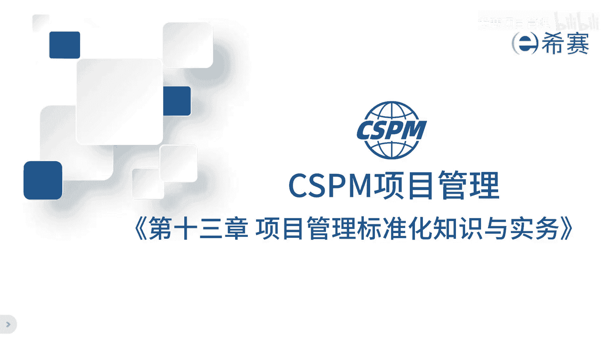
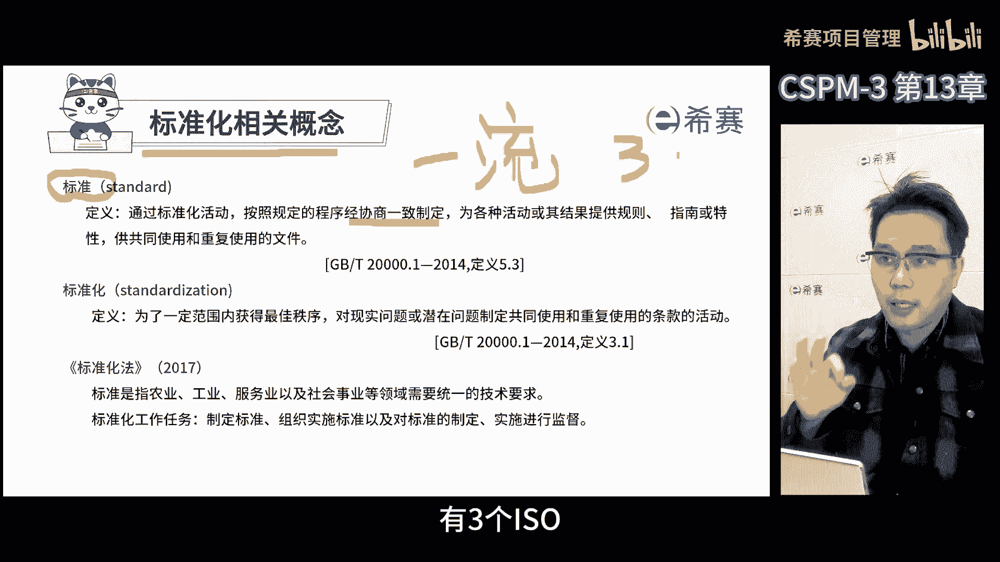
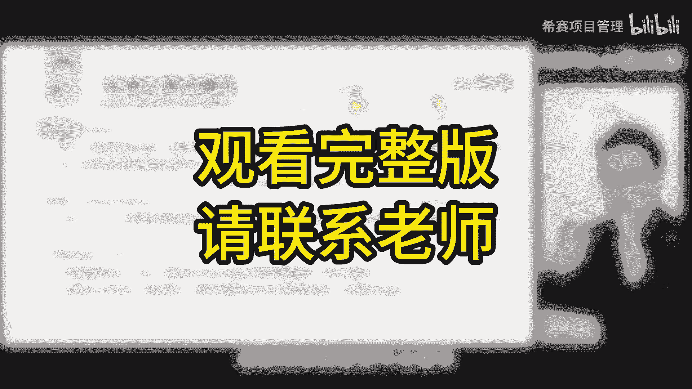

# 【精华版收藏】2024年CSPM-3级（中级项目管理专业人员）考试精华版视频课程合集丨核心考点！快速通关！ - P16：cspm-3 第13章 项目标准化知识和实务 遮挡 - 希赛项目管理 - BV1vf42117Fq

最后一章也就是第13章，讲的是关于项目管理标准化内容，这张之所以要放进来，是因为到这个层级就是第三级，这个阶段对于项目管理，专业人员的要求就更高了，所以这个层级的项目经理，他们不仅仅要参与到项目中的。

制度和流程的建设，还要引入外部的最佳实践工具，技术和标准方法，那目的是帮助公司提升组织级的项目管理能力，他甚至还要带一些资质，前一些的项目经理，从国家和行业的角度来说。

也希望第三季的项目经理能够积极地参与到，国家的项目管理，行业标准的制定中，那这样不仅仅可以普及相关知识，还能让大家了解已经发布的项目管理国家标准，因为从长期的发展方向来看。

我们肯定需要建立自己的项目管理标准，体系的，前提是掌握已经发布的项目管理的知，识和相关的东西，那这项工作呢就变得非常的重要，所以学习项目管理标准化是非常有用的，考试的占比也比较多。

那么为什么我们要建立这些标准呢，啊其实项目管理的标准啊，就像是我们行业的规则，了解了这些规则，对于我们了解整个行业非常有帮助，在我看来，项目管理啊已经成为一个行业了，那既然是行业，就需要有规则。

我们现在就是在制定这些规则，所以大家最好能熟悉这些规则，越早熟悉在这个行业里面就越有竞争优势，我相信学习这些标准，对于大家未来的职业发展一定会有帮助，好来讲讲标准化那些事啊，以前我做项目管理时候。

你都不爱学这个标准化，觉得这些跟项目关系两码事，我刚当项目经理那会儿也不懂标准化，但是在工作中我们都会参与到审核评审，在这个过程中呢，我们就需要了解不同的企业的管理模式，就更需要理解标准了。

那么什么是标准呢，那标准其实就是大家达成共识的东西，那最低的标准就是企业标准了，在这个范围内，大家都能对于事情有一个彻底的认知，企业标准之上是行业标准，再往上地方标准，国家标准甚至国际标准。

这些标准就像是统一了大家的认识一样，把大家的共识写下来，就形成了标准，所以在审核过程中，评审过程中发现标准是非常重要的，大家常说哈一流的企业定标准，但是实际上一流企业定标准是，因为如果我们定了行业标准。

就意味着把我们对事情的认知，变成了大家的共识，那这样就可以用我们对事情的认知来要求别人，按照我们的认知来做事儿，那这样是不是很厉害嘛，那因为我们要变成行业规则的制定者，如果标准对于我们不利。

我们就可以把它改呀，改成对我们自己有利的呀，那这样别人就会觉得你按照我们的要求去做事，是应该的，那么我们认知代表了整个行业的认知，如果我们的认知是定在了国家标准，那就意味着把我们对事情的理解变成了国家。

所有人的理解，那是不是更厉害了，在国际标准组织中有三个ISO。

还有一个IEC国际电工委员会。

