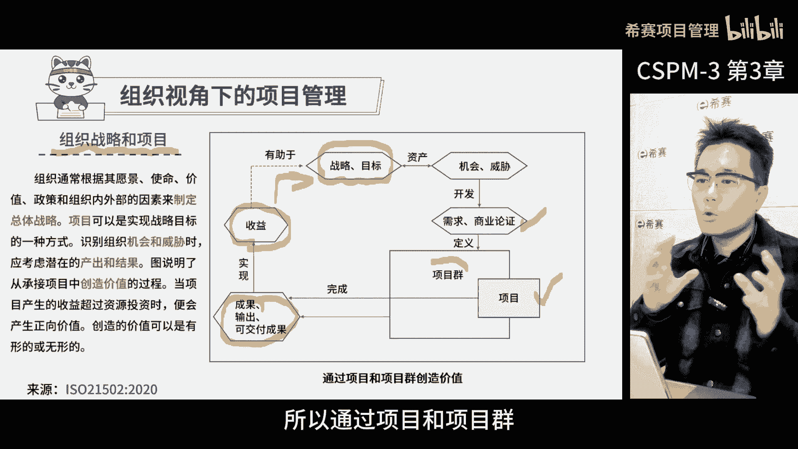
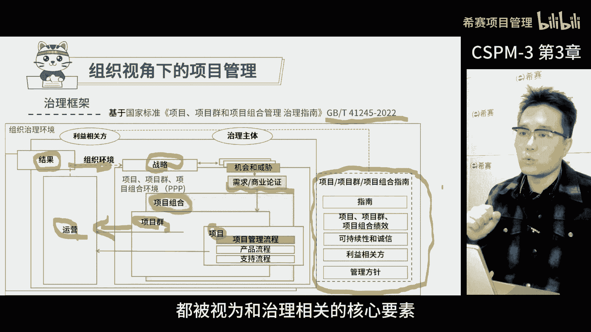
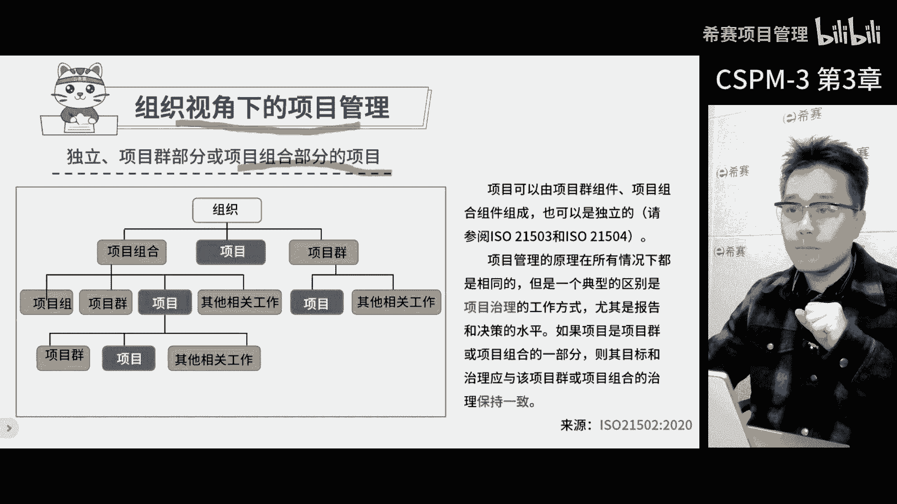

# 【精华版收藏】2024年CSPM-3级（中级项目管理专业人员）考试精华版视频课程合集丨核心考点！快速通关！ - P4：cspm-3 第3章 项目经理定位和受控环境 上 - 希赛项目管理 - BV1vf42117Fq

第三章项目经理定位和项目受控环境，首先我们得从企业的角度看一下项目管理，而不仅仅是项目和项目经理本身，这就好比咱们要入职一家公司，先看整个公司的业务，不能仅仅从某个员工或者某个部门去看。

接下来咱们得说说项目组织，成立一个项目组织，这里面有各种各样的角色，就像开公司一项由总经理，副总经理啊，市场部员工，销售部，员工研发等等，每一个角色都有自己的职责，在项目也是一样。

所以建立项目组织的时候，我们得考虑这些角色的关系职责，这样才能更好地去管理项目，那么明确了项目的定位和主要决策之后，我们就得考虑怎样建立一个可控的项目环境，这又涉及到了整个项目的生命周期。

不同的阶段要做哪些工作，我们要讲八大过程组，结合这些，咱们还得说说项目经理的能力素质要求，这样才能更好地完成项目，说到项目环境。

那可真是一个大话题啊，记得刚开始学项目管理那会儿，大家都觉得项目嘛就是项目经理的事，环境什么的都不重要，但后来在实际工作中，我们才发现，项目所说的组织环境，对于项目的成败影响有多大。

于是乎我们就开始越来越重视项目环境，在国家标准里面成立项目组的时候，首先要考虑的就是项目环境的影响，因为项目的环境，直接关系到了项目的绩效和成功的可能性，项目团队要考虑环境，包括组织的内部外部。

组织内部的因素，就包括战略技术，常规项目管理的成熟度，还有资源可用性以及组织文化和结构，那这些因素都可以对项目产生影响，所以在剪裁项目管理的方法，开发商业论证和执行可行性研究。

以及未过渡到运营和客户的设计的时候，应该考虑到项目与其环境之间存在的关系，解释一下这几个关键因素，首先战略，项目通常被看作是实现战略目标的工具，也就是说，项目的目标要和组织的战略方向保持一致。

这就好比盖房子，我们要先确定房子的整体规划，然后再去设计每一个房间，所以了解组织的战略目标非常重要啊，这样我们才知道项目到底是为了实现，哪个战略目标，接下来是技术。

不同的业务和技术会有不同的项目管理重点，比如说同样干工程的和做硬件研发的，软件研发的或者做管理咨询的，用到的技术可都是完全不一样的，这是要求我们在项目管理过程中，要充分的考虑业务和技术的特点。

因为不同的业务和技术，会给项目管理带来不同的挑战和机会，再来看看组织层面的常规的运营环境，和项目管理的成熟度，有些企业呢不仅项目的管理不成熟，整个企业管理也不成熟，可能会很混乱。

这样的环境下开展项目管理可不容易了，而有些企业虽然管理很成熟，但是主要是职能管理，项目管理方面呢就不太行了，那这些都会影响到我们开展项目工作，和建立项目管理制度的难度，最后还有资源文化和结构。

比如说获取资源难不难，有没有专门给项目的资源，还有公司的文化，组织的结构，这些都可能影响到项目的成功，因为这些都是决定了项目管理的方法，是否顺利落地，所以你看啊项目的成功并不是一件简单的事情。

要考虑很多的因素，那这个时候咱们就要考虑一个词叫剪裁，就是咱们虽然可以系统地学习这些，项目管理的方法，但在实际的应用过程中，就要根据实际情况来进行调整，只针对于公司有用的，合适的那些不合适的咱就不用了。

不能死板地去照搬，在剪裁的时候，咱们得考虑之前提到的这些因素啊，这样才能更好地去应用项目管理，别忘了啊，剪裁不是简单的选择，而是根据实际情况进行适当的调整，让项目管理的方法更好地适应公司和项目需求。

这是组织内部的环境，那接下来是组织外部的，主要是组织外部的环境，包括经济社会地理政治法规，包括这些技术的发展趋势，整个环境的生态，行业的生态，这些因素啊，可以通过施加需求和约束。

或者通过引入影响项目的风险，对项目产生了影响，尽管这些因素，通常超出了咱们项目发起人和项目经理，控制和影响的能力，但是指导验证启动计划，监控和关闭项目时，仍应考虑和计划这些因素啊。

其实说白了外部因素一直在变，这些变化对于我们项目来说是一种风险，虽然我们不清楚这些变化到底是怎么回事，但是我们得随时准备应对，这就是为什么项目管理少不了，风险管理和质量管理，还得定期的评审的原因。

我们要确保，不管外部环境怎么变，我们都能控制项目的节奏，不让麻烦找上门，所以啊组织外部的环境因素，这可是我们开展项目管理工作的重点，得一直盯着总结一下啊，本页说到做项目。

咱们得看的东西可不仅仅是项目本身那么简单，项目之外还有一大堆的东西要看，在这个逻辑下，咱们就得考虑三个环境啊，第一是项目环境，就是项目内部的关系啊，要求啊什么的，第二是组织环境。

就是项目在怎样的企业组织下进行，第三是商业环境，就是咱们借助企业所在的行业市场的力量，构建项目的环境，这样做的目的就是为了通过项目的环境，实现有挑战性的项目标，然后让这些目标。

帮助咱们企业更好地适应外部环境，获得成长，那背后的关系啊，其实就是这些了。

项目和战略之间的关系啊，是我们在分析完组织环境之后，接下来常常关注重点，一个项目在组织里不是孤立的，它和战略有着密切的联系，从组织角度来看，战略和项目趋向一个闭环的两部分，简单来说呢。

项目是承载战略落地的工具，而战略则是决定组织未来发展方向的关键因素，一个公司根据内外部的环境的分析，洞察外部环境，并分析内部的能力，挣出一个3年到5年的发展计划，这个计划就是我们所说的战略。

但是官网战略还不够，它需要落地实施，而实施战略的时候，通常是以项目为单位进行的，一个战略落地，可能会带来一堆项目，这时候就需要有人去策划，哪些项目应该优先，哪些可以缓一缓，哪些对于战略落地有帮助。

哪些没有，那项目管理办公室，也就是说，PO在这个时候就发挥了非常关键的作用，他们要根据战略调整，来确定项目的选择规则和，优先级排列顺序的规则，然后根据这些规则去识别，企业里面可以做的项目。

找出对战略支撑最大的最有价值的项目，这需要进行需求分析和商业论证，那确定每一个潜在机会，对于战略目标的贡献的大小，找到这些有价值的项目部呢，我们就要把它们，以项目或者项目群的形式派下去。

当项目和项目的目标完成了，产出的产品被用户或市场使用了，我们还要去测量收益的多少，然后把结果反馈给战略团队，那这样战略团队也就知道了哪些方向是对的啊，投资回报比较好，哪些是不行的。

那这个过程是一个闭环的过程，周而复始，在企业发展的过程中是持续进行的，所以通过项目和项目群去创造战略目标的价值。

是一个持续的过程，这个图啊我们可以进一步的细化，就得到了这张图，按照组织来治理项目，项目群和项目组合的标准要求，其实啊，这张图是来自国标GBT41245的治理指南，这个是去年发布的，在治理框架里面。

其实最关键的就是这个核心的部分，首先基于战略选机会，然后用商业论证来判断价值，如果项目有价值，那可能会以项目为单位，或者以项目群为单位，甚至以项目组合为单位进行，但项目组合更多的是统筹资源管理。

而项目和项目群就是组大家一起交付成果，那这个成果就是要按照预期的时，间和结果来交付，那交付之后就要转到运营中去，那运营的时候可以对于项目和项目群的成果，进行批量的复制，那这样就可以不断的扩大收益了。

然后呢就要去把这个运营结果再给到战略，这样就可以根据实际情况进行调整和优化，从这里看啊，战略也不是一成不变的，它都是滚动式的不断优化，那战略调整的时候，除了考虑外部因素，还要考虑项目的实际成果。

这就是为什么项目最终的结果，会反馈到战略的原因，再来看一下这张图的外侧部分，在组织治理环境中，无论是国际标准还是英国体系，都越来越重视项目自身的环境，企业环境和商业环境之间的联系，把这些考虑的清楚之后。

构建的项目组织才能更加科学，那形成一个合力，更好地支持战略落地，那最后啊我要补充一个小点，就是国标体系，其实呢是翻译了ISO的一个标准叫治理指南，在项目管理中，治理主要关注的是项目的绩效管理。

可持续性和诚信等等，包括相关方有哪些人啊，怎么统一战线，以及如何开展项目管理等基本的方针，那这些东西啊都被视为和治理相关的核心要素。

咱们之前聊了这么多，那现在来讲讲项目里面，客户和供应商的决策问题，也就是说在项目里面，客户和供应商这两个角色得分开，不能是一个部门，既是客户又是供应商，那啥是供应商呢，就是负责项目里面工作包的人啊。

帮助咱们去实现我们的产品的这些人，那这个标准里面也说了，客户和供应商不能是同一拨人，所以我们看这个标准，其实也是来源于ISO21502的，这里面有要求，可以从两个角度，第一个角度是客户或发起组织。

就是掌握需求的组织，他们可以自己承担全部工作，或者把部分甚至全部的工作给到供应商组织，那第二个角度就是供应商或者承包商，虽然客户和发育组织有共同的利益诉求，但是供应商或者承包商组织，他们有自己的关注点。

他们作为核心业务，给其他组织提供服务或者产品，所以拿到一个项目之后呢，咱们得把人分好角色，判断一下哪些人代表客户，哪些人代表项目的发起方，还有哪些人是供应商，然后把这三方分开，因为大家的利益诉求啊。

关注点都不一样，那这样分开目的是为了保证项目的顺利进行，大家各司其职，共同实现项目目标，在大多数情况下，供应商的项目范围都是客户项目范围的一部分，这就好像是一个包含和被包含的关系，那供应商的工作内容。

其实是客户项目范围中的一部分，而且当我们和供应商合作的时候，要特别注意他们的利益诉求，确保他们不会吃亏，我们得向供应商，觉得他们做完这个项目之后，也能达到自己的目标，这样才能确保项目成功。

客户和供应商的关系，有的时候可能会让人搞不清楚，因为有些项目里面这种关系可能是组织间的，也可能是组织内部的，比如说供应商决策，有时候会由外部承包商来承担，或者是同一组织内的其他部门。

那这个供应商和客户在项目中就是相对的抉择，可以是任何人来承担，可能是组织内部的，客户和供应商，也可能是组织外部的，其实对于我们来说，不管是哪里的客户或者供应商，最重要就要明确。

他们在项目中扮演的角色和职责，早期的时候把这事儿定清楚，免得事后闹矛盾，那就和两个人一起做事一样，客户有时只关心产品能不能帮自己解决问题，却忽视了供应商制作产品的难度，而供应商呢。

有时候只关注制作产品的难度和付出，却忽视了客户真正需要这个东西的原因，那所以为了避免这些矛盾，我们在项目刚开始的时候要达成共识，白纸黑字写下来，那如果怕自己记不住，还要找一个见证人，保证大家都遵守。

那这么一来，客户和供应商这对搭档才能更好的合作，共同把项目做好了，在项目早期，我们先得弄清楚项目中的每个角色，还得知道他们各自关心啥，就拿人力资源系统这个项目来说，这是给企业用的，但是企业里不同的人。

比如说老板，管理层，人力资源部门和普通员工，他们的需求是不一样的，老板呢关心的是整个企业的现状，发展的未来，想要快速做出决策，而管理层他们想看的数据特别多，想要系统地帮助他们监控管理，省去重复的工作。

那这样他们就能专心的做专业的管理，人力资源部门，他们希望系统能自动化流程，操作简单一点，提高他们的工作效率，普通员工呢他们都是被迫使用这个系统的，他们希望系统简单明了啊，能看到以前看不到的信息。

还有别让他们觉得这个系统很难用，所以啊虽然都是客户，但是他们的需求可是大相径庭，我们在做项目的时候得特别注意这些差异，这样才能做出大家都满意的东西，即使是同一个客户，同一个公司，不同的岗位，不同的层级。

他们对待同一件事情的看法和关注点都不一样，作为乙方的项目经理，我们得明白这一点，我们要根据每个人的决策和岗位去思考，他们的真正诉求是什么，如果我们的项目方案能满足他们的需求。

他们肯定会非常支持我们的项目，所以我们要考虑到每一个角色，在项目中应该做什么，以及他们的期望和需求是什么，那这样我们在做项目的时候就更好推动下去。

在项目中有一项特别重要的因素需要考虑，那就是约束，那以前可能没听过这个词啊，但是呢他在项目中扮演着非常重要的角色，简单来说约束就是项目中那些不能做的事情，必须在一定的限制条件下完成，如果没有约束。

项目就失去了挑战性，因为无论何时完成，如何完成都没问题的话，那项目没啥可干的了，所以约束让项目变得有价值，就像在各种限制下还能把事做成，那说明我们有很强的能力啊，以前的项目管理中的约束比较简单。

主要是时间成本质量，在项目管中有一个说法叫做三重约束，那意思是在做项目的时候，需要在规定的时间和成本预算内，完成明确的任务，而且任务的质量还有一定的要求，传统的管理方法在项目早期就确定了。

最终需要达成时间成本质量要求，然后倒排工期分解项目，产品识别项目的活动组织而去实现，但是一旦项目启动时间，成本质量就不能随便改变，因为他们之间是一个相互平衡的，比如说啊如果我们想缩短工期，其他条件不变。

那是不可能的，要么增加成本，要么减少任务，要么牺牲一点质量，因此我们在项目管理中要特别关注的是，约束决策的时候，需要不断做取舍，如果不能同时满足所有条件，我们就需要决定取哪个舍哪个。

这是我们为什么要关注约束的原因，那说到这里啊，我提一下以前我做项目管理的时候，主要考虑时间成本质量这三方面啊，咱们俗称项目管理铁三角，他提到啊，多快好省四个字，后来我就发现和咱们项目管理的三个方面。

简直是太匹配了，你看啊这多块耗时里面多，就是指交付的东西要多快，就是时间要快好，就是质量要好审，就是成本要低，这不就是项目管理的要求，那这些东西都一一对应上了啊，但他的思想可是和项目管理高度融合的。

所以大家以后看到多快好省，很多企业家都希望自己的项目能做到多快好事。

做项目的时候，咱们遇到的限制啊可不少，在我们国家标准里面有一条特别说明了，项目产出和成果都得在一定限制条件下完成，就像项目得在限定的时间内完成，或者目标日期前搞定，用的钱得控制在预算内。

项目的资源也得够用，员工的安全也得保证，风险水平也得能够接受，还得考虑项目对社会环境的影响，以及法律法规的限制等等，这些限制哪一项不满足啊，项目都本想成功，而且这些限制还相互关联，一个变了。

那其他的也得跟着变，所以呢得时时刻刻关注这些限制条件，项目的利益相关方，得先商量好项目的线条件和优先级，一开始做项目的时候，项目团队的领导就得搞清楚，咱们最关注哪些限制条件，这些条件有可能变成考核标准。

为什么得先定优先级呢，因为如果时间成本质量不能同时满足，那你先保哪个啊，你搞清楚啊，不能等问题出来了才来排优先级，所以一开始你就排好，这样遇到问题，项目经理说能带大家解决，团队按优先级调整就行了。

不用事事都请示决策，这种事先确定能帮助我们更好的做决策，为后续行动打一个很牢固的基础，从科学的项目管理角度来看，这是必须的，而且出台国家标准，也是希望借助国家和国际的力量，让企业领导们都能接受这个做法。

很多企业里面根本就没有项目分级的概念，更别说给项目的各个需求排优先级了，如果项目的限制条件总是变来变去，那真的是不利于大家共同决策协作，也不利于完成项目的目标，所以啊我们才把确定项目的线条件和优先级。

这个事看得这么重要，现在的项目呢真的是越来越难做了，当项目逐渐发展，开始进行大型的项目集群，或者适应性项目管理的时候，约束条件变得越来越多，唉大家都开玩笑啊，项目是什么呢，既要这样又要那样，还要这样。

那其实这些背后代表的是什么呢，就是在基本条件不变的情况下，我们有更多的需求，这真的很难做，但也不是不可能，我们项目管理人啊一直也在努力，那项目经理的职责呢，就是带领团队去实现别人认为不可能的事情。

这包括在多元的约束条件下，找出一个最佳解决方案，项目管理其实有很多层次啊，那每个层次的目标和要求都不一样，那首先单项目管理，这更多的是目标导向，咱们得确定项目目标，然后组织人员快速高效的去完成。

接着是项目群管理，它涉及到了一系列相关的子项目，目标是让这些一系列的项目综合效果达到最优，这需要对于多个项目进行统筹管理，确保每个项目都不可或缺，最后才能得到最好的结果，那再来说说项目组合管理。

这可是一个投资社会的多项目管理，因为手上资源有限，目标不再是单纯的项目成功了，而是思考哪些项目值得做，哪些项目不值得做，以及如何最优化的分配资源，这种管理呢更像一种投资管理，追求最大化的投资回报率。

那这里要说一下项目群和项目组合的三大区别，第一临时和永久有不同的性质，项目群是临时工作，他依然以成果交付为主，项目组合大多数是永久性工作，因为企业要持续的进步发展，所以项目组合的资源分配要求会一直存在。

他更关注的是投资管理，而不是具体的项目节点，第二子项目的相关性不同，按照项目群来管理，当我们管理多个项目的时候，得先看看他们真的依赖关系，如果发现有几个项目是相互依赖的，那他们就得像一个团队一样。

一个队伍一样齐心协力，一个都不能少，如果其中一个项目失败了，其他的项目就算成功了也白搭，这就是项目群和项目组的区别，所以项目群的管理的思路是，确保所有项目都成功协调，他们真的依赖关系，更有效地利用资源。

这样才能用更少的资源和时间，实现项目群原本的收益，简单说，项目群管理就是形象一系列有关联的项目，项目组合却不同，它有点像赛马，项目组合里的每一个子项目都像一匹马，大家争先恐后，都想得到更多的资源。

公司为了实现某个战略目标，通常同时投多个项目，这些项目虽然都是为了同一个目标，但他们需要的资源有限，这就好比给每一匹马分配的资料有多有少，还得相互抢，为了确保战略目标的实现，有些项目做得不好。

那风险大的就及时的停止，避免损失，这就是项目组合的思路，不是帮弱的，而是支持强的，所以这些项目之间没有必然的关联，那谁做得好就给谁更多的资源，第三对于子项目管理的接受程度不同，一个项目要进入到项目群。

那他就省事儿了，为啥呢，因为项目群管理团队啊会帮助项目团队管理，而且这个团队不止管一个项目，可能会管很多的项目，得把每个项目明确交付时间，交付目标，那很多项目群还会出统一的项目群。

里的子项目所需要的管理要求，比如说项目管理的阶段划分组织结构，决策职责阶段，评审需要提供的材料啊，还有计划做监控，以及开展各种工作所需要的模板表单，这些都是以项目群为单位统一处理的。

项目组合可不给这些东西，那项目组合喜欢干啥呢，他们最喜欢干的一件事就是绩效考核，项目或项目群，他们的特点就是对赌关系，简单的说啊，项目组合的人都觉得你们干这个项目啊，反正我没干过，但是我有资源啊。

你们想从我这拿资源，那得先证明这个事儿能够带来预期的收益，就算你证明了，我还不一定信，咱们得签个合约，我承诺给你资源，但前提是你必须达到我的预期收益目标，如果没达成就得接受惩罚，超额完成指标了。

那我可以给你奖励，但是活怎么干啊，作为投资人，那怎么会懂投资项目该怎么干呢，那肯定是谁当项目经理，谁懂啊，这些都是项目组和项目群，两种工作方式的差异啊，项目管理这事啊，讲的就是一个全面。

那三个层次缺一不可啊，这样才能真正的实现战略落地，这是我们的标准啊，简单明了，无论是国际还是国家标准都覆盖了这三个层次，所以我们有项目管理指南，项目群管理指南，项目组合管理指南。

这可是我们做好项目管理的三大法宝。

治理呀是一个大的话题，和单项目管理呢是完全不是一个级别的，这里是搭建一个项目的框架，那制定规则给大家指明一个方向，但具体干活的事儿不归他管，咱们国家的标准里面，治理可是有要求的，简单来说呢。

这里就是定原则，定政策，定框架，这些原则政策框架是用来指导和管理项目的，那注意啊，这里可没提具体活怎么干，那都是下面的事，治理的依据是什么，就是商定的商人证，也就是说，我们制定项目的治理框架的目的。

是为了让大家更好地实现商业目标，治理的内容包括三大块，第一块是定义活动和实践的政策过程和方法，那听起来有点复杂，其实简单说就是制定规则流程方法，让它有一个统计标准，那第二块是管理框架。

这其中就包括了生命周期的选择，每个项目有自己的生命周期，每一个生命周期选择也是治理的一部分，要遵循管理的政策和流程，那第三块是项目中的决策和职责，包括分层授权，简单的说。

就是每个人在项目中都有自己的职责和权利，那这些都是治理要考虑的问题，那么谁来负责维护项目的治理呢，通常是由发起组织来负责，这个发起组织就像是一个上级单位，他们授权项目启动。

并指定项目的发起人或者项目管理委员会，来负责治理，所以项目的发起人和项目管理委员会，他们就代表了发起项目这个组织，他们的权利也是来源于这个组织的，治理和管理的最大区别，简单来说就是治理确定谁该做决定。

而管理是去执行这些约定，这里更像一个框架，定义了哪些决策该做，以及哪些决策应该由谁来做，它更侧重于建立一个清晰的决策，权利和责任体系，而管理他是在已经确定的决策基础上去实施，这些决策，他的重点在执行。

确保决策得到贯彻和执行，所以治理更偏重于决策的决策职责的设定，而管理则是根据这些决策和职责去执行，虽然两者有所不同，但它们都是组织运行中不可或缺的部分，商业论证，它是咱们建立有效的项目治理的基础。

就像盖房子要先打地基一样的，没有商人证项目就站不住脚，那怎么进行商认证呢，首先得有个机制，帮咱们看这个项目能带来啥商业价值和结果啊，如果没有这个机制，大家就像一个无头苍蝇啊，不知道为什么要投钱。

而且得有人不断的证明这个商业的价值，不然大家都不愿意投钱了，那这个价值呢，其实决定了我们用啥框架去搞这个项目，在论证的时候要考虑啥，比如说项目要实现啥目标啊，这个项目和咱们的战略目标有啥关系啊。

能带来啥潜在的收益啊，有这些收益，咱们才能判断是不是咱们想要的战略预期，还有得定指标，看这个项目到底有多少收益和价值，咱们接受的风险有多大，因为项目总有一些不确定性，还得考虑预算进度质量要求。

看会不会对于其他组织运营有啥干扰，那最后呢还得看看项目里面有哪些利益相关方，他们之间的关系，在管理得投入哪些人力和物质资源，需要啥技能知识能力，那还得看看项目的目标范围有多大，背后的情景是啥。

那这些因素啊，在做项目论证的时候都要考进去，把这些都考虑清楚了，咱们才能论证出一个科学的，大家都认可的结果，所以商业论证真的是很重要的，大家一定要重视啊，好那咱们就先不深入啊聊商业论证了。

因为后面呢咱们还有个专门的章节讲这个的，现在我们得好好琢磨一下，这个商业论证，其实是为了建立项目治理框架打基础的，简单说就是根据商业论证的结果，咱们再来决定搭什么样的治理框架，有这个框架。

咱们做项目管理才能更加有条理，那说到项目的治理框架。

咱们得先弄明白一件事情，按照咱们国家的标准，这个框架里头最重要的就是项目生命周期了，来大家看一下这个框里面，项目的生命周期分成三个阶段，项目前项目中，项目后，每个阶段之间还有关口评审。

就像咱们平时做事情一样，有节点有检查，那接下来，项目管理里面有一套综合性的管理实践，以前咱们把它叫流程，那现在更专业的说法是实践，那这些实践就像是项目管理这个独门秘籍啊，一共是八个流程，包括项目前活动。

启动，项目监督项目，关闭项目，项目后活动等等，这些流程就像一个个小环节，串联起来了整个项目的生命周期，那更厉害的是，这八个流程里面有17个，项目管理的专业管理实践，也就是17个项目管理知识领域。

咱们再说这下面这个框架，这个框架里头有重要的东西，就是交付方法，比如说咱们用什么样的方式来交付项目啊，是敏捷的还是传统的线性方式，那这些方法呢没有一个统一的规定，考试也不会那么严格的去规定。

所以在这个框里头，咱们主要记住，第一要考虑项目的生命周期，这是项目治理的一部分，第二项目的八大流程和17个知识领域要落地，同时还得考虑用什么样的方式来交付项目，这些都要考虑啊。

这样咱们做项目才能做得更好。

我们讲一下综合管理，实践和项目管理时间的区别，我们得把这两个弄清楚啊，看看标准语是怎么写的啊，综合管理实践实现项目标在约束的范围内，定义和管理项目的范围，同时考虑风险资源需求。

从每一个参与和执行的组织中获取知识，包括资源的所有者，出资方，供应商，客户，用户和其他相关方的承诺。

就是这八大工程组，那接着下面呢是17个项目管理实践，所以我们这里的综合项目管理，和专业的项目管理实践，他们关系其实就像以前说的，五大工人组和十大知识领域之间的关系，只不过现在变成了八大国人组和17大。

这是零项目管理强调实践，所以过程也是实践，那重点强调落地啊，而不仅仅是获得知识。

