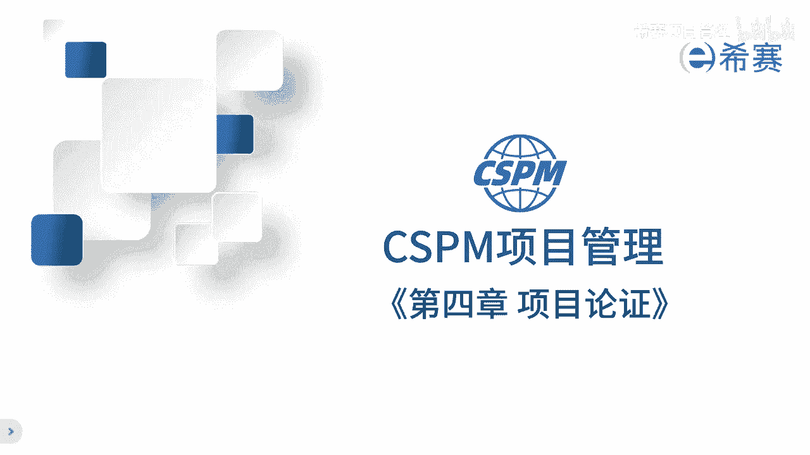
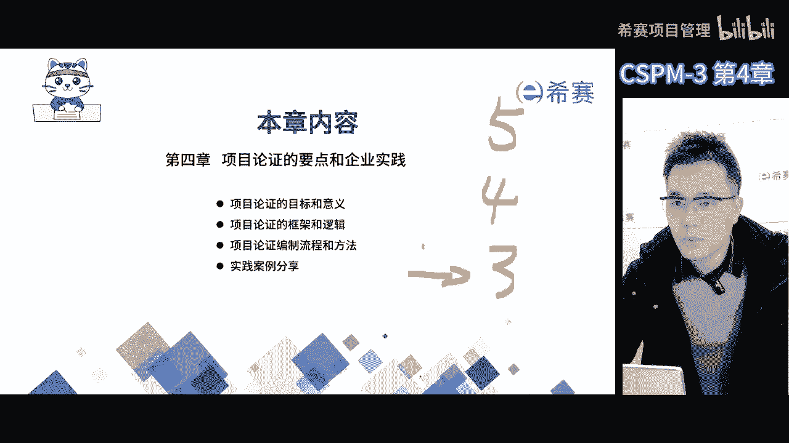
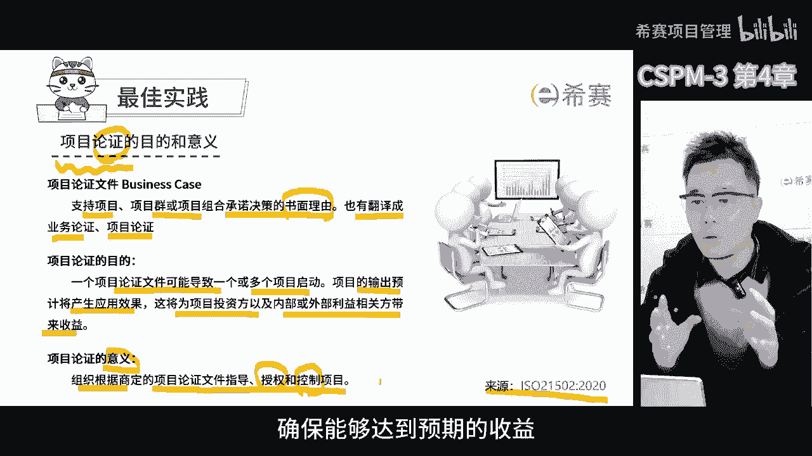
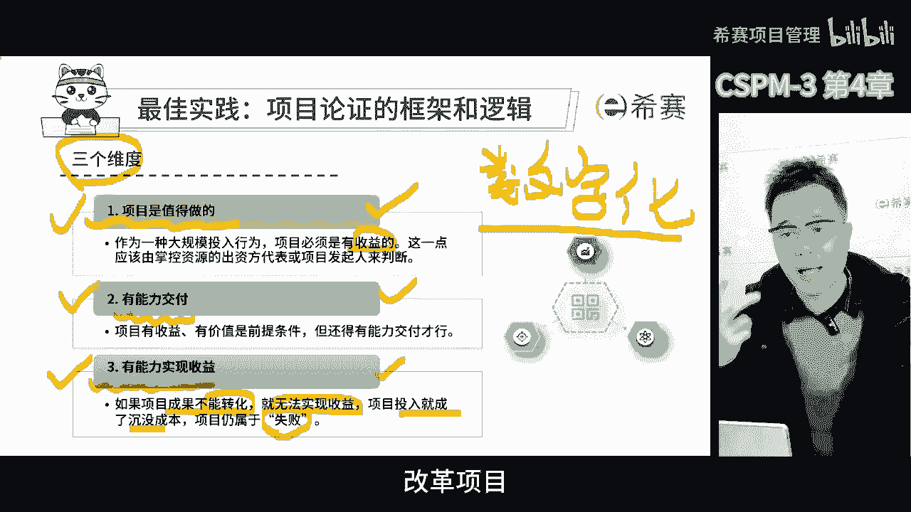
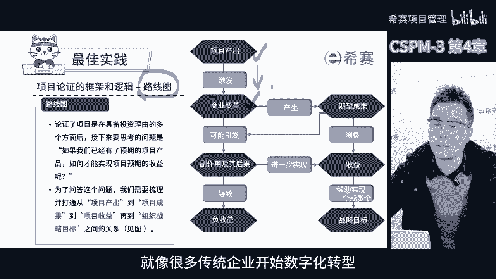
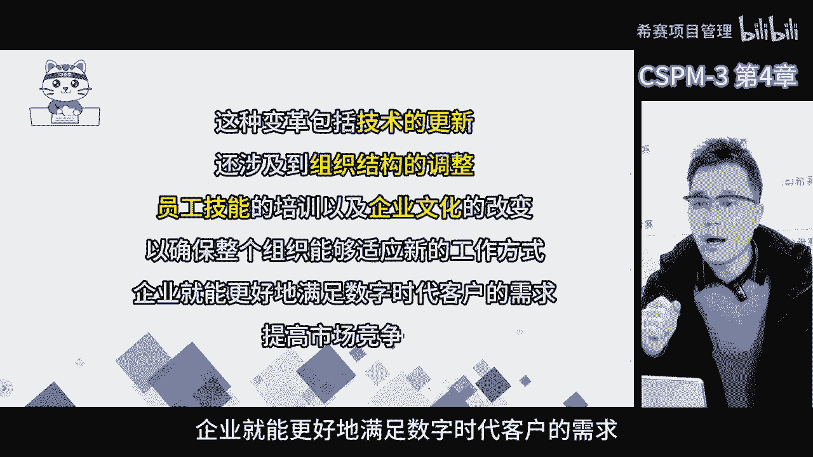
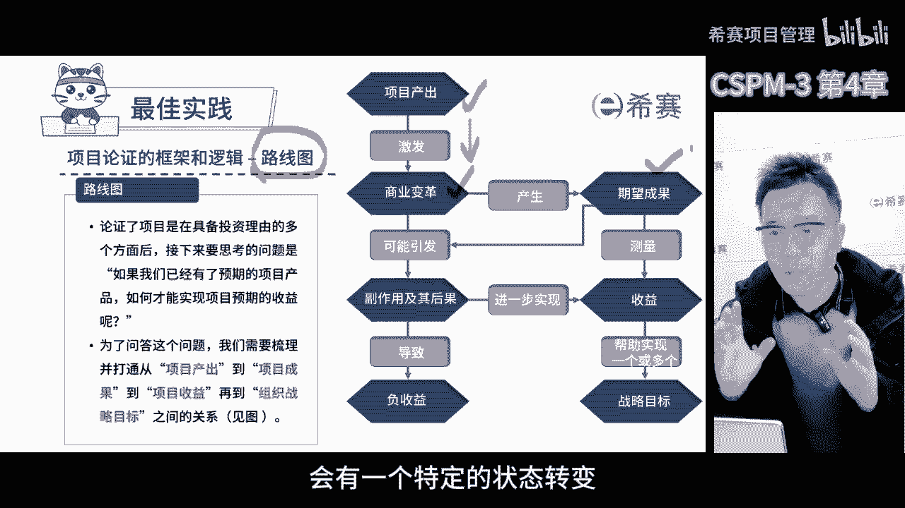
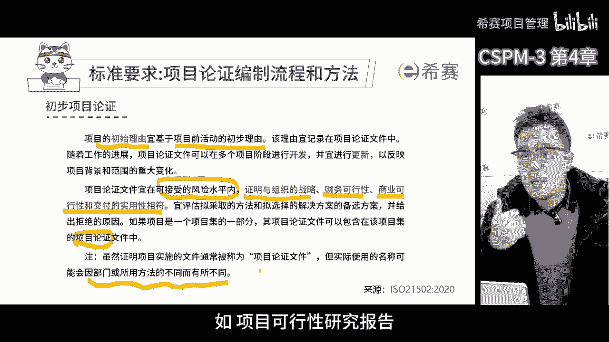
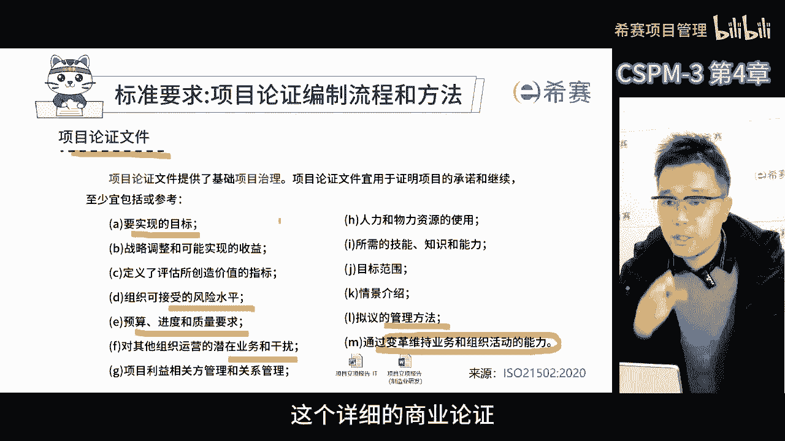
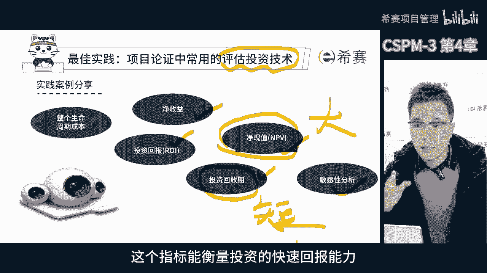

# 【精华版收藏】2024年CSPM-3级（中级项目管理专业人员）考试精华版视频课程合集丨核心考点！快速通关！ - P7：cspm-3 第4章 项目论证 - 希赛项目管理 - BV1vf42117Fq

第四章项目论证，项目论证也叫商业论证或者是项目价值论证，这个板块，其实对于初级的项目经理是没有要求的，但对于中高级的项目经理来说，就非常非常的重要了，这几年有一个明显的变化，就是越来越多的企业啊。

希望技术型的项目经理，转型为经营型的项目经理，说白了就是项目经理，不仅要考虑项目管理的科学性和专业性，更要像企业的经营者一样去思考问题，比如说像总经理CEO，首席运营官等等啊，站在他们的角度去看待项目。

现在很多企业把项目视为最小的经营单元，以项目为单位搞创新，搞变革，尤其是针对于客户市场的项目，他们将来可能要创造营收带来收益，因此项目经理不能只关注，规定的时间和验收标准，还要去思考为什么做这个项目。

以及站在公司的战略角度去看，这个项目能带来什么样的预期收益，项目的目标不仅是按时完成交付，更要通过项目的过程为企业带来价值，最好还能支撑项目的战略目标，这样项目经理就变成了成果和收益导向型，项目经理。

而不仅仅是按规定验收和交付的项目经理，在CSPM5级项目经理分层体系中，第三集是项目论证，明确提出重要要求的一个起点，在第四级时要求会越来越高，第五集则不仅仅要求，项目经理具备项目收益和价值实现的能力。

还要能够有力地支撑企业本身的经营结果，我们来看啊。

这是项目论证的定义，支持项目项目群或项目组合，承诺决策的书面理由，也有翻译成业务论证，项目论证的那，项目论证的目的是一个项目论证文件，可以导致一个或多个项目的启动，项目的输出，预计将产生应用的效果。

这将为项目投资方以及内部或外部利益相关方，带来收益，这是国际标准ISO21502中，对项目论证目的的说明，换句话说，我们在项目启动之前，就要把这个项目论证清楚，想明白，对企业来说。

项目其实就是一种投资行为，我们投入人钱资源还要花时间，目的就是我们觉得这个投入，未来会带来预期的成果和收益，那如果做一个项目没有带来预期的改变和收益，那对企业来说，这就是一个失败的投资，浪费成本资源。

所以选择项目时一定要通过系统的方法，这套方法就体现在商业论证中，这也是项目论证的目的，为了降低风险，确保项目能带来回报，项目论证的意义啊，就是看看这个项目能不能挣钱，能赚多少钱。

然后决定要不要做这个项目，如果要做就需要得到授权，然后对这个项目进行管理和控制，确保能够达到预期的收益。

我们讨论一个项目是否可行，通常会从三个角度来看，无论是在企业事业单位，非营利组织还是政府论证一个项目的时候，都会考虑这三方面，就是说这个项目能不能挣钱，有没有市场，能不能运营下去。

这是非常重要的三个角度，只有这三个角度都可行，才能证明业务的可行性，也就是项目才有可能成功，首先我们要判断一个项目是否值得做，这主要看它是否能够支撑组织，战略和业务的需求，带来我们想要的商业收益。

也就是说我们要先看看这个项目做完之后，未来能不能帮助组织提高收益，降低成本，增强品牌价值，如果这个项目做完之后，不能给我们带来想要的东西，也不符合组织战略目标与愿景也不一致，那么这个项目就不值得做。

其次我们要看看有没有能力去完成这个项目，有时候我们看别的企业做项目能挣钱，但我们不一定有同样的能力，所以我们要看看自己，有没有足够的资源和技术支持，有没有相对应的组织能力去创造项目的产品。

最后我们还要看看这个项目有没有能力，带来预期的收益，也就是说这个项目干完之后，项目产出能否符合市场成果，能否真正带来预期的收益，如果项目做完了，用户不愿意花钱购买你的产品，也不愿意使用。

那这个项目就没有能力实现预期，所以啊从三个视角判断一个项目是否值得做，要看它是否支撑组织战略的目标，我们有没有能力去完成它，以及它能不能实现预期的收益，我们打个比方，很多公司会投资建设信息化系统。

这就像一个投资行为，其实任何一个数字化转型或者信息化建设项目，都是提升企业能力的一个项目，对于这个项目来说，立项的时候，企业需要开展论证，很多信息化系统的投资是非常大的，这不仅仅是花钱的问题。

关键在一周过程中，还会占用大家很多时间，去配合信息化工作的建设，并且新系统将来落地后，还会改变大家的工作方式，所以前期准备一定要经过非常慎重的论证，这个企业为什么要上信息化系统，为什么要做数字化转型。

第一值得做，我们看到其他企业和组织因为上了信息系统，提升了原来的能力，起到了降本增效，增加企业竞争力的效果，这时候我们会发现，其他企业因为上了信息系统所获得的这个收益，也是我们所期望的。

所以这时候我们会考虑值得做，第二有能力，其他企业上了信息化系统，需要买软件，找实施公司，中间涉及到了一大笔的交付费用，而且还要花时间去适应这个事儿，这时候我们要判断，愿不愿意投入对应的资金和时间。

如果我们有这个实力，能够投入资金和时间，就说明我们有能力去做，第三实现收益，信息化系统建好之后，上线了，没有出现什么大的bug问题，能顺利运转，但是更关键的是，上线之后大家都要用起来。

机械化系统是通过改变我们员工和用户的行为，才能带来预期的收益，如果上了个系统，大家都不用，这时候就不会实现什么对员工的转变，对于用户的转变也就没有办法去实现了，我们之前预期的降本增效的结果。

这时候就没有实现这个收益，只有产出，但是成果没有转换过来，也就没有办法实现咱们的预期的这个收益了，可以看到在这里项目的投入就是沉没成本，属于失败的项目，所以不管是什么项目，比如说投资类项目，信息化项目。

工程项目改革项目管理创新项目或者研发项目。

我们前期都要考虑三个问题，第一个问题，这个项目能带来什么样的预期价值，第二个问题，我们有没有能力完成这个项目的产出，第三个问题，这个项目产出之后，这个成果有没有能力转换成咱们预期的收益。

就这三个问题都论证通过了，才说明这个项目是值得做的，是一个值得投入的项目，在这个路线图中，我们以三个维度为基础，构建了一个清晰可见的路线，大家可以看到啊，我们通常会选择这样的一个路线，论证其可行性。

我们不仅要论证这三个理由，还要找出这三个理由之间的关联，第一步，这个路线图的起点是项目产出出现了，要注意啊，这里的起点并不是我们准备开始做这个项目，而是假设我们的项目已经完成。

这时项目产出会激发商业变革，商业变革就是企业或组织为了应对市场的变化，提高效率，增强竞争力，或者适应新的技术趋势而进行了大的结构化的，策略性的，流程化的或者基础性的改变，那这种变革很麻烦，要长期规划。

要让企业更适应不断变化的商业环境，就像很多传统企业开始数字化转型。

举个例子啊，为了适应数字化时代的需求，一家消费的连锁企业可能决定改变它的业务，引入在线销售服务，移动应用和人工智能技术，来提高服务效率和客户体验，这种变革不仅仅包括技术的更新。

还可能涉及到组织结构的调整，员工技能的培训以及企业文化的改变，以确保整个组织能够适应新的工作方式，这样企业就能够更好地满足。

数字时代的客户需求，提高市场的竞争力，第二要明确我们期望的成果，这个成果就是项目的产出，被目标用户使用之后，用户转变后的状态，那无论是系统啊，文档呀，新产品啊，我们期望用户使用后会有一个特定的状态转变。

当这个状态转变实现后，我们要对其进行测量，看看这个转变给公司带来了什么样的预期收益，这个收益需要可测量，并且要符合公司的战略目标，只有符合公司专利目标的收益，才是对公司有价值的，所以我们要强调。

并不是所有项目的收益都会对公司有价值，站在组织级项目管理的角度，只有能够支撑组织战略目标的实现，这种收益才是对公司有价值的，在这个过程中，我们不仅要考虑项目收益是否为公司带来价值。

还要考虑这个价值是否符合公司战略目标，只有这两块都匹配了，才能确保投资是为公司带来真正的价值，咱们完成了这个项目，这个项目最终帮助到了我们的目标用户和客户，他们的工作和生活有了很大的改变。

而这种改变给我们带来了预期的收益，这种收益正是公司所需要的，然而每个项目都有它的缺点啊，有可能会带来副作用，这些副作用可能并不是我们想要的，甚至可能带来一些负面的后果，举个例子，如果要上一个信息系统。

我们希望这个系统顺利上线，并且能够承载新的业务标准和业务流程，我们期望的是，公司员工由销售和客服人员使用新的系统之后，工作行为会更加的规范，工作效率也会提高，以前呢员工使用的手工方式工作效率低。

查询信息也不方便，而新的系统可能很容易的去查询到了，需要的信息，很多事情系统都能自动完成，员工的工作效率自然就提高了，但是在适应新系统过程中可能会有副作用，有些员工可能不太擅长使用信息化系统。

以前的手工工作虽然麻烦，但是熟练了使用新系统之后呢，他们的初期的工作效率反而不如原来快，而且在这个过程中，如果使用不当，可能会导致系统出现问题，这种情况就是需要一个适应磨合期，如果这个磨合期过长。

就可能带来负收益，也就是说，虽然公司期望使用新系统提高效率，但是如果员工不熟悉新系统，反而导致服务客户的速度变慢了，客户满意度下降，所以在项目论证的过程中，我们一定要充分的考虑到项目的正负。

两个方面的结果，任何一个项目都有可能会带来，正向的和负向的结果，在期望正面的结果的同时，我们要考虑它可能会带来负面的影响，而且这个负面的影响，往往会在正面作用之前出现，另外呢任何一个项目的实现收益啊。

都不是一开始就直线上升的，而是先经历一个负收益的阶段，然后再逐渐的上升，如果我们没有正确预估这个负收益的大小，没有坚持到度过这个磨合期，那么这个项目很可能就会失败，因此项目的商业论证的早期啊。

我们一定要把负的作用和后果也要考虑清楚，并向决策层进行呈现，这样当项目上线之后出现负的后果，这是预料之中的事，大家才有信心度过这个阶段，我们最怕的是一开始只看到正向的结果了，没有考虑到负向的问题。

那结果负面问题出现，大家就开始怀疑了，最初这个项目决策是不是正确的，这样很容易因为动摇和犹豫而错过后续的收益，所以做项目的时候，我们要有充分的准备，才能确保项目的成功。

我们接下来看一下项目的论证的编制过程，按照这个标准，项目的初始理由，是基于项目的前活动的初步理由，在之前提到的八大过程组中，项目前活动应该包括了初步的项目论证之后呢，在初期论证阶段。

先任命一个项目总监和项目经理，他们可以收集更多的信息，然后组织大家进行详细的论证论证，主要关注的是组织的战略，财务的可能性，商业的可行性以及交付的实用性，通过这些方式，我们可以证明。

收益和能力是在可接受的风险水平之内的，这意味着实现的概率比较大，最后需要呈现这个论证的结果，承担这个结果的文件被称为项目论证，这个文件在不同的公司和行业中，会有不同的叫法，比如说项目可行性研究报告。

商业可行性分析报告等等，简单来说呢，这个详细的商业论证，里面就包括了很多具体的内容，比如说项目要实现什么目标啊，怎么才算项目结束了，项目未来收益如何，我们用什么标准来衡量项目需要哪些资源。

需要什么样的人员技能和知识能力，项目可以接受的风险水平是多少，还有一些预算进度质量等等相关的要求，在项目实施过程中，我们会采用哪些管理方法，可能会对其他的部门或公司产生什么样的影响，还有项目成功实施。

可能会涉及到哪些业务变革的活动，那这些内容都要写进去，所以这个详细的上证证。

是高层决定是否做了项目的核心文件，我们在这个项目论证的过程中，不是只论证一次，它需要持续的验证，在项目开始之前，我们会进行初步的项目论证，这叫做开发概要，商业论证，这时会考虑一些宏观层面的东西。

比如说可能的收益是否符合组织战略等等，到了项目的规划阶段，我们需要更详细的商业认证，这个时候我们要提供更准确的信息，在项目执行过程中，每隔一段时间，我们需要给项目管理委员会汇报，项目的商业论证情况。

来证明投资这个项目的理由一直有效，如果项目执行过程中，因为外部的环境变了，或者内部的战略调整了，或者项目的效果没有达到预期，就需要考虑这个项目是否还要继续了，如果发现这个项目可能无法获得。

预期的投资回报了，那我们就需要考虑一个项目叫停，所以项目论证在整个项目过程中是贯穿的，定期要汇报，这样项目管理委员会才能看到，这个项目继续投资下去的价值，才能决定给予下阶段的资源投入，补充一点啊。

按照项目管理的方法论证的过程，要遵循阶段划分的逻辑开展，项目的整个生命周期，会被划分成不同的管理阶段，虽然项目资源是一体化做预算的，但是要分阶段进行资源的投放，先干一第一阶段的活，干完之后评审一下。

看看得怎么样，另外也要判断一下这个项目继续干下去，有没有价值，如果没有价值了，就算前面干得再好，也不继续，因为项目已经是失败的一个投资了，所以项目的论证的过程啊，是贯穿项目的一个主线。

项目论证向项目管理委员会，跟我们的企业证明这个项目投资的价值，在做项目论证的时候，我们会用到很多评估投资的技术，比如说投资回报率，净收益，投资回收期敏感性分析等等，这些技术我们在之前的PP里面都学过了。

所以在这里就不重复讲了，但是啊有两点要记住，一个是净现值越大越好，基现值就是项目预期的现金流，折算到现在的价值和初期投资成本的差额，他告诉我们项目能给投资者说到多少净价值，另一个是投资回收期越短越好。

投资投机就是投资需要的资金，在未来能通过现金流回收的时间，这个指标能衡量投资的快速回报能力。

这是本章的思维导图，大家可以暂停回忆一下，那核心点就是商业论证。

