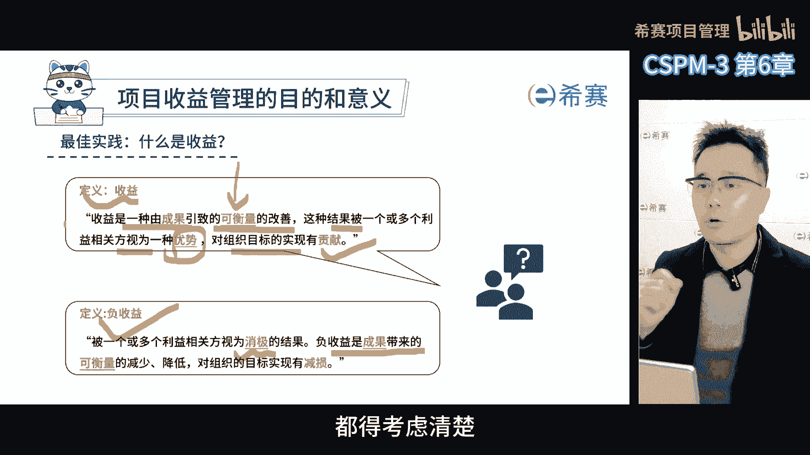
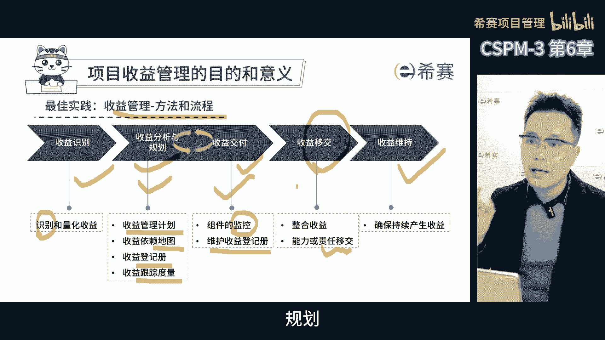
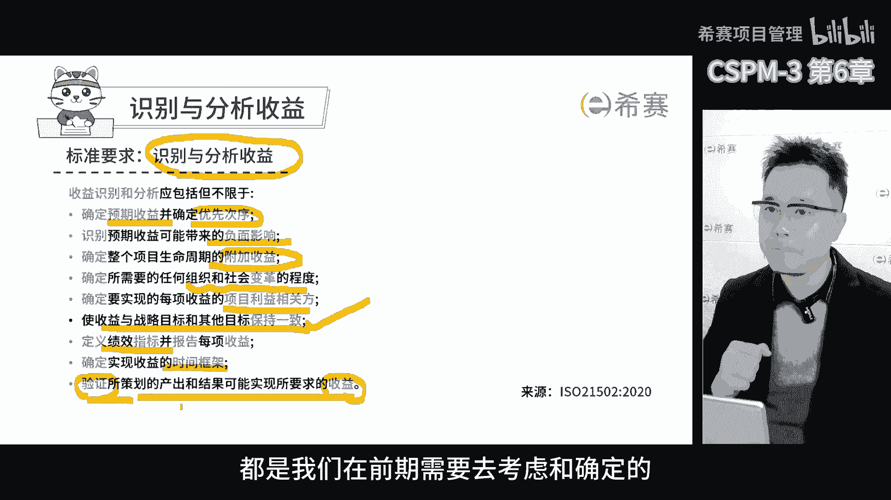
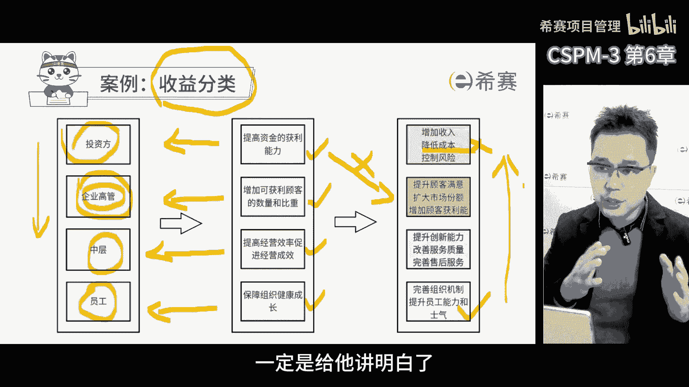
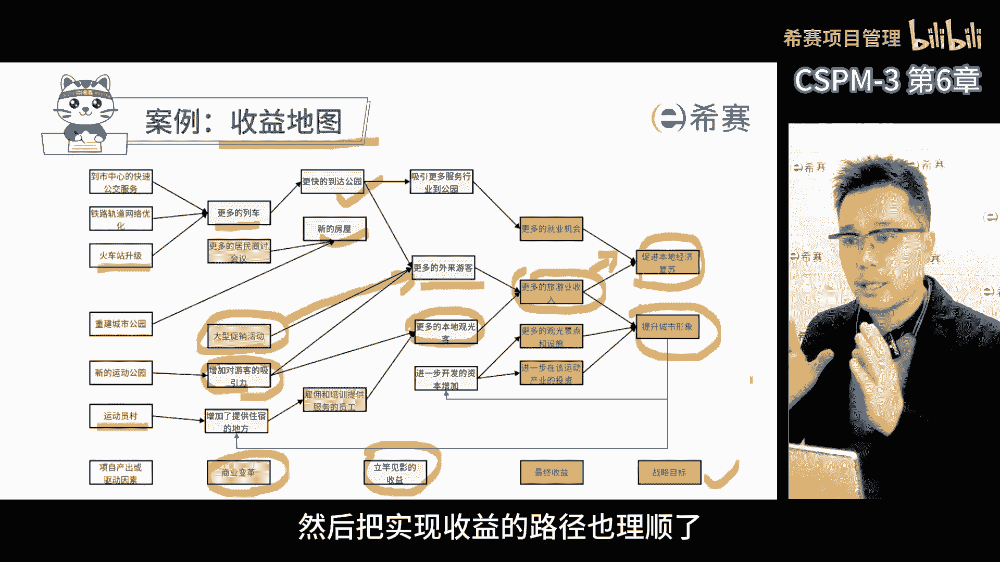
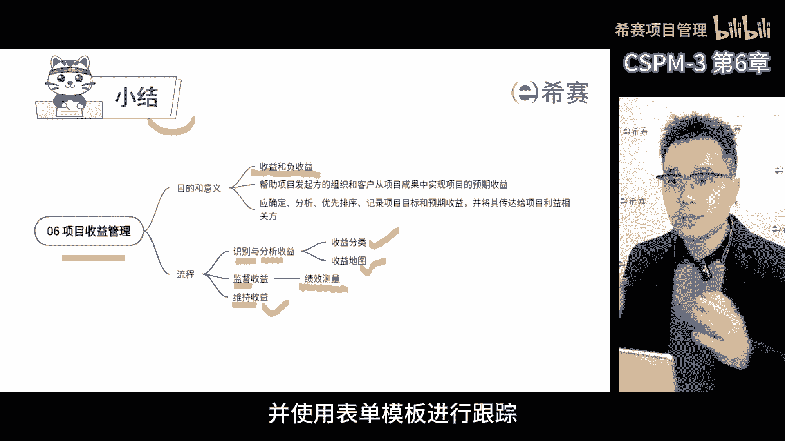

# 【精华版收藏】2024年CSPM-3级（中级项目管理专业人员）考试精华版视频课程合集丨核心考点！快速通关！ - P9：cspm-3 第6章 项目收益管理 - 希赛项目管理 - BV1vf42117Fq

第六章项目收益，前面讲了项目论证，今天要讲项目收益，顺便讲讲他俩真的关系，就像前面说的，收益其实是项目论证的一部分，项目论证有三个角度，这个项目有没有价值，能不能实现，能不能把项目产出转成收益。

这个收益是我们进行项目论证时，一个重要的因素，特别是到了第三集的时候，项目经理应该是收益导向的，而不只关心交付，那对于收益的定义，实现测量又会形成项目管理中的一个专业主题，这也是表示他非常重要。

那怕大家工作中不注意这个点，所以我把收益管理单独拉出来了，那我们收益管理的目的是什么呢，目的帮助项目发起方的组织和客户，从项目成果中实现项目的预期收益，如果收益的实现在项目范围内。

则收益管理应是项目计划的一个综合部分，意义因识别分析优先级排序，记录项目标和预期收益，并将其传达给项目利益相关方，因第一计划的活动，以促进对期望收益的监督和控制，意思就是，项目发起方和客户。

要实现项目的成果的预期收益，我们需要帮忙，如果这个收益能在项目范围内实现，那收益管理就是项目计划的一个重要部分，也就是说我们要弄清楚项目目标是什么，预期收益有哪些，然后告诉大家。

接着还要安排一些活动来监督和控制这个收益，让我们的期望能够实现，我们得明白干这事儿的目的啊，也就是收益，收益是一种由成果引导的可衡量的改善，这种结果被一个或多个利益相关方，视为一种优势。

对组织的目标实现有贡献，说白了就是干了这事之后，能得到可以量化的好处，这个好处可以看得见摸得着，比如说赚了钱啊，那也可以是看不见摸不着的，比如说提升了品牌的认知度，这个收益可以是正面的，也可以是负面的。

就像你干一件事，事情理顺了，逻辑清楚了，但是有可能会导致流程臃肿，那这个流程的臃肿就是负收益，对我们来说赚了钱就是收益，同时也会带来负收益，所以我们干任何事情都要考虑清楚。

这事儿是能赚多少钱，能带来哪些负面的影响，好嘞，让我们给你一个通俗易懂的方式，解释一下这个收益管理的过程，首先要先确定我们需要哪些收益，这就是收益的识别，接着我们要分析这些收益，了解他们是怎么来的。

这就是收益的分析和规划，在这个过程中，我们会绘制一个收益管理计划，里面会包括收益地图，收益登记单和收益跟踪度量的方式，然后呢在项目执行和交付的过程中，我们要时刻监督这些收益的实现情况。

并根据实际情况更新我们的收益登记单，当项目结束的时候，我们要将这个登记单和整个收益管理计划，移交给后续的运营组织，让他们来继续监督收益的实际情况，保证整个收益能够继续实现。

所以啊整个收益管理过程包括收益的识别分析，规划，交付移交和维持这几个不同的步骤。

我们来看识别和分析收益的过程，也有不同的要求，首先要确定预期收益，并确定次序，接着要考虑预期收益可能带来的负面影响，也就是负成果和负收益，此外还要确定整个项目生命周期的附加收益，同时为了确保收益实现。

还要考虑变革的程度，要保障每个利益相关方的收益都要识别，最重要的是这个收益要能支撑组织战略目标，制定收益的监控绩效指标，以便了解收益的实现情况，那还要确定收益实现的时间框架，通常需要制定收益评审计划。

同时验证实际项目产出的成果带来的收益，是不是符合我们最初计划的需求，那这些要求都是我们在前期需要去考虑，和确认的。

收益，有很多种类型啊，那这里举个例子就是企业里有不同的层面，高中低，大家关心的收益其实是不一样的，有一本书叫做平衡积分卡，是美国的卡普兰博士写的，他把整个项目分成了四个层次，那最上面是财务层。

就是资金和财务这块，然后下一层是客户层，再往下一层是运营层，最后一层是学习和成长层，那这样一共四个层次，这四个层次是为了对应到组织不同层级的员工，最上面一层是投资方，还有公司高层，比如说CEO董事长。

投资人，他们关心的不是怎么干，而是财务报表上的数字变化，就是经过一段时间对未来的预测，利润会越来越多，还是成本会越来越多，客户存呢是公司高管关心的，因为他们要为公司的营收和经营结果负责。

所以他们要通过扩大市场，增加客户来让财务报表更好看，运营层就关心我们的日常运营，就是质量成本胶漆这些啊，那简单来说呢，就是质量要高，成本要低，交期要短，日常运营能力越强，客户对我们的感受就越好。

财务报表就越好看啊，那最底层是学习和成长层，我们要关心人员能力的提升，基础设施的完善和信息化建设，那这些都做好了，咱们的日常运营能力就会提高，给客户的感受就会更好，客户就会更倾向于选择我们。

那这样的话我们的财务报表，那结果自然是好的，他讲这四层的原因是因为这四层不同的人，他们关心的点是不一样的，所以每个指标也不一样，那我们作为一个优秀的项目经理，见到哪一层就要讲人家关心的收益指标。

换句话说我们见到员工，我们要说服员工在我们这个项目里面投入时间，积极参与进来，给他讲一堆公司这个投资回报的大道理啊，对他来说没用，不关心啊，但是我们跟公司的投资方，如果讲一堆什么具体运营是什么。

效率怎么样啊，改善哪些呀，信息化建设啊，他根本就不明白，你这个信息系统，跟我关心的财务报表有啥关系啊，那如果说你要上这么一个系统，对财务报表来说，首先想到的一点就是影响到我的成本了，花太多钱了。

成本增加，但是你能承诺带来什么样的预期收益吗，你这个员工的能力的培养，信息系统建设，什么时候能体现在，我这个关心的财务报表上面去，所以啊如果我们想说服公司投钱建系统培养人，我们必须要给公司领导讲明白。

如果你支持我建这个系统，这个系统为什么能帮助我们提高运营能力，运营能力提升之后，到底哪些客户的满意度会提升，会增加客户来采购我们产品，然后多长时间才能带来财务上的变化。

我们得把这个整个收益的实现过程讲清楚，他关心这个事儿，所以就是要把收益进行分类，不同组织类型，不同层面的人关心的收益是不一样的，我们见到不同层面的人，我们要讲他关心的收益，并且给他讲明白。

你关心的收益跟我干的事儿，这中间有非常强的关联，这意味着你支持了我，我就能帮助你实现你预期的收益，再换句话说，我们说服任何人啊，对我们项目进行投入和支持的时候，一定是给他讲明白。

支持了我们就能给你带来收益，我们用一张图来梳理一下这个收益的关系，这张图呢叫收益地图，在一个项目里面可能会有很多的收益，有的是马上能看到的收益，有的是要过一段时间才能看到的收益，还有的是最终的收益。

这就跟种下一棵树一样，你要先种下它，然后天天浇水，过段时间它才能长大啊，开花是一个可交付成果，结果是咱们的最终的可交付成果，那这张收益地图，能帮助我们看到每一个收益之间的关系。

比如说伦敦奥运会的时候要建很多的东西，像奥运村快速公交，火车站升级等等，那这些东西建好了，马上就能看到收益，公交多了，城市漂亮了，那这些都是立竿见影的收益啊，那还有一些收益呢是过段时间才能看到的。

比如说因为城市漂亮了，吸引了更多的游客，就会带来更多的旅游收入，那这就是中期收益，然后最重要的是这个最终收益了，就是旅游收入，可以促进我们本地经济的复苏和提升城市形象，这就是战略目标。

在这个收益地图里面，我们可以看到每一个项目产出都和收益有关联，而且每一个收益都和战略目标有关联，这就是为什么我们要梳理这个过程，因为这样我们才能更加清晰地知道，哪些产出会带来哪些收益。

哪些收益是立竿见影的，哪些收益是中长期的，哪些是战略目标的，而且我们还要注意到，有的收益需要业务变革来促进，比如说我们要吸引更多的外来游客，就需要开展促销活动，否则即使东西建得再好，人家不知道也不会来。

所以这个收益地图呢，就帮我们理清了每个收益之间的关系和路径，这样我们就能更加清晰的知道我们该怎么去做，才能达到目标，这就是收益管理的整个过程，那我们先把收益实现的地图理清楚，再明确我们需要哪些收益。

然后再把这些实现收益的路径也给理顺了。

那这样在我们开展项目的过程中，就可以监督收益的实现情况，为了更好地了解收益情况，我们要建立整个收益的监测体系，并对这个收益进行测量，测量完之后我们还要汇报呢，回报的情况和结果。

项目收益往往在项目结束后才会显现，因此项目结束并不代表着收益也结束了，项目经理在最后的工作中需要进行交接，确保接手的团队能够继续实现项目的收益，并且有人来衡量这个实际情况，项目后评估的一项重要工作。

就是评估这个项目是否真的实现了预期的收益，因为当初立项的时候就是预期的收益大于投资，但是关键在于很多项目在结束之后，收益才逐渐的显现，那这种时候我们需要确保，即便是团队解散了，也有人跟进。

那否则我们就无法得知实际的收益情况，也没有办法去验证最初预期实现没实现，那这样的话我们就没有办法确保后续的项目中，哪些是投资回报好的项目，所以这个收益需要持续的监督监测和测量，为了更好地管理这些收益。

我们需要形成一个收益登记单，在项目过程中，我们需要跟踪各种收益指标，即使项目过程中没有出现收益，我们也要不断地进行预测，项目实现后，我们需要根据收益实现的时间表，来验证它是否按时出现，我们还要验证呢。

获得的收益是否与预期的期望值相符，因此收益管理既需要方法，也需要落实到表盘上，整个过程中都需要进行跟踪并落实责任，这就是整个收益管理的过程了好了，简单的总结一下收益管理的内容啊，收益管理非常重要。

因为如果我们不去管收益，可能实现不了预期的收益，而要想管理好收益，首先要知道什么是收益，并把正收益和负收益区分开，收益必须是可测量的，有指标的，它代表着项目产出后的改善。

在项目中从前期收益的识别分析规划，到收益过程的交付记录，再到收益移交给后续接收团队，这些步骤都是必须的，在识别收益的时候，要考虑各种因素，对收益进行分类，并注意到不同相关方关心的收益是什么。

在分析规划的时候，要定义好收益与收益之间的关系，考虑哪些收益是由哪些产出引起的，哪些需要业务变革推动，哪些立马就能得到，哪些是中长期的，而在项目执行过程中，要监督收益的实现情况，并不断地预测实际情况。

根据指标来指导项目团队的工作，最后在项目移交后，要把收益移交出去，并使用表单模板进行跟踪。

这就是整个收益的管理过程。