# 【视频教程】白漂！手把手叫你用Project做项目进度管理 - P1：1、课程目标 - 清晖Drina - BV12S411N7jp

我们来说一下我们今天的课程大纲，我们最终的目的应该是画出这张进度计划。那么这个进度计划主要的表现形式是我们在偏僻学习当中的呃甘特图啊，或者是逻辑甘特图啊，或者是里程碑图这样的一些表现形式。

那么它的原理是怎样的呢？那么今天我会使用偏僻的一个原理，也就是项目管理的原理来帮助大家一步一步一步来画出我们的进度计划。那么我们首先要做哪些事情呢？首先我们要建立WBS，也就是创建工作分解结构。

首先我们要了解进度是通过什么来进行决定的啊，进度是首先是范围，你的活，你的工作，你的工作多，那么进度肯定有工期就会长，你的活少，那么你的工期就会相对于短一些。所以首先是创建工作分解结构，也就是WBS。

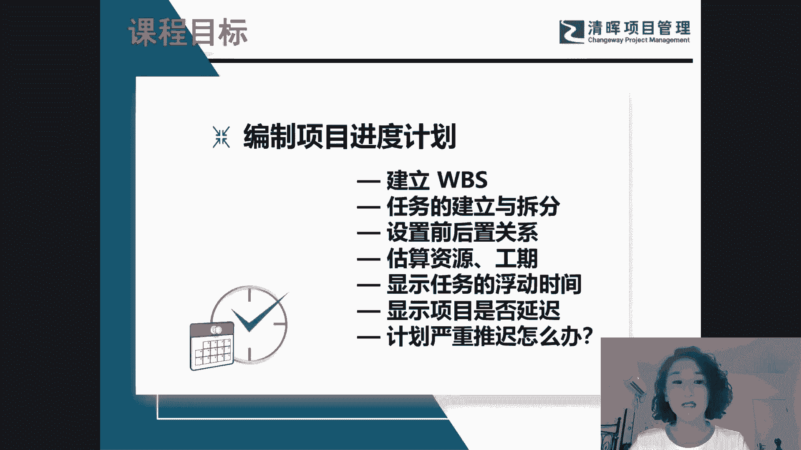

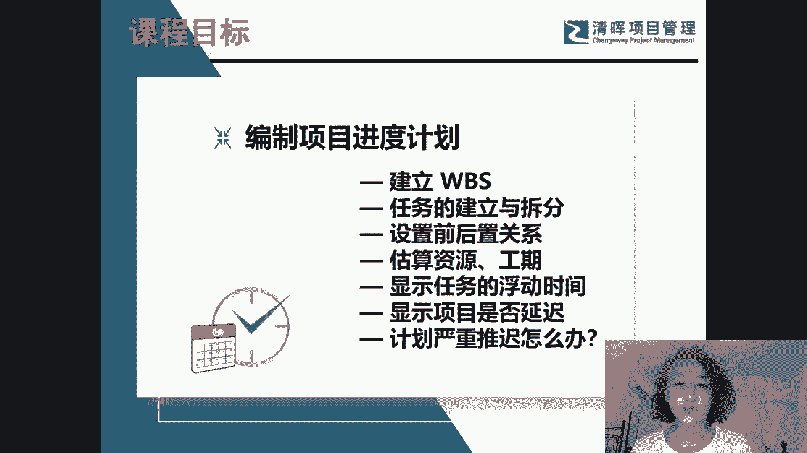

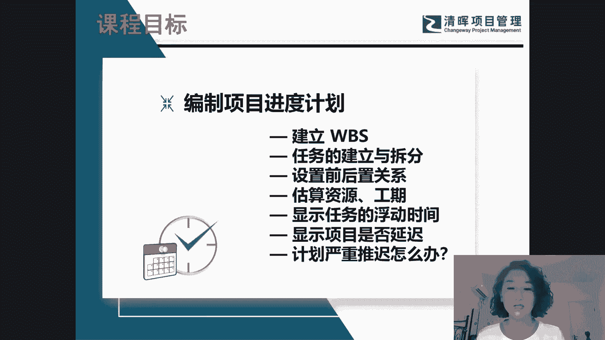

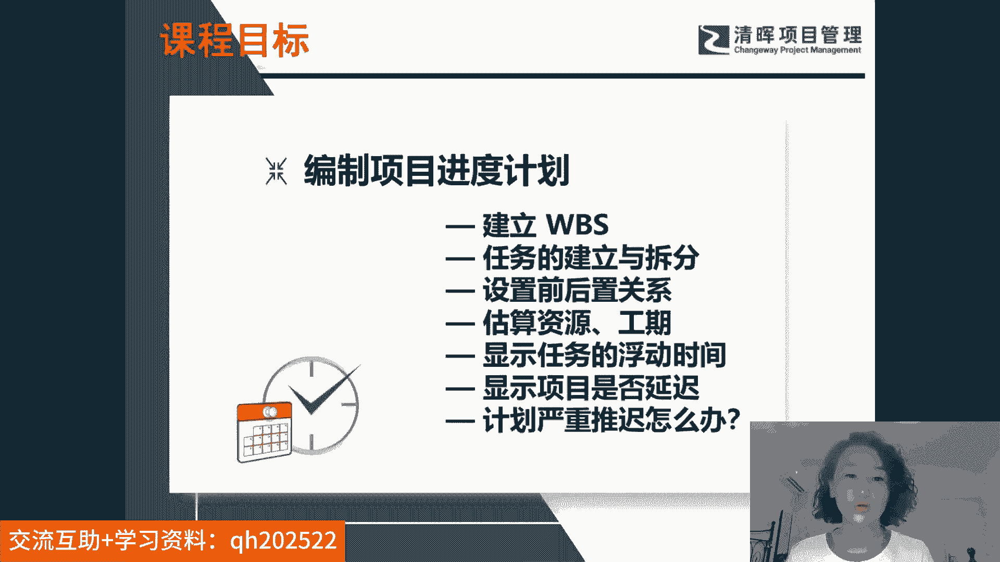

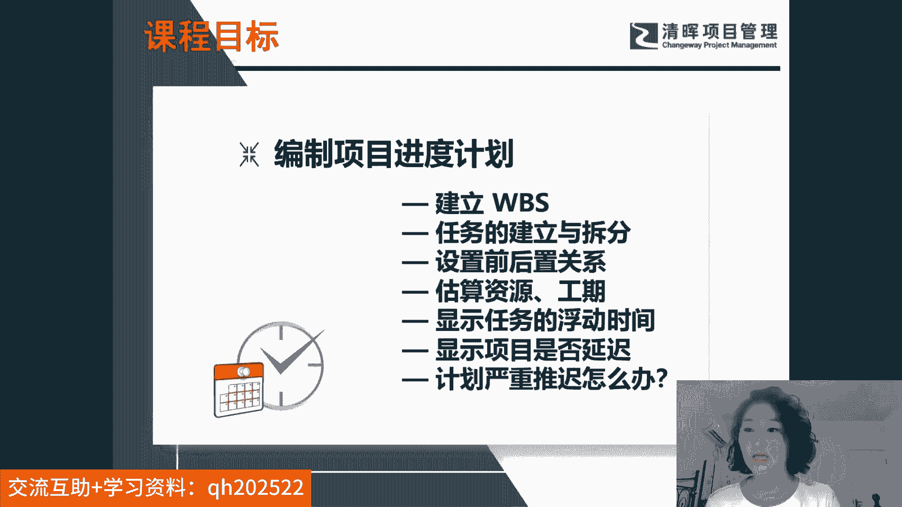

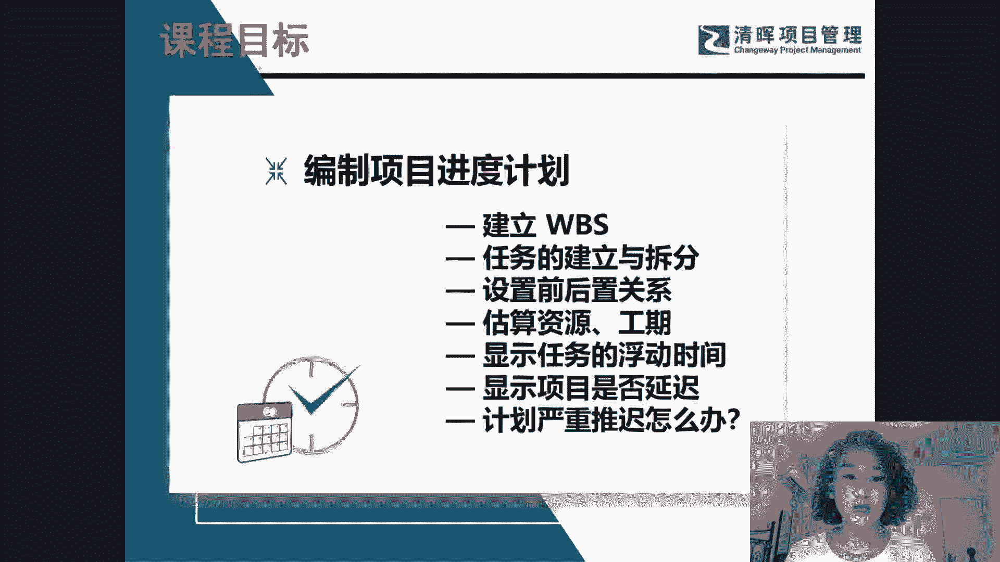

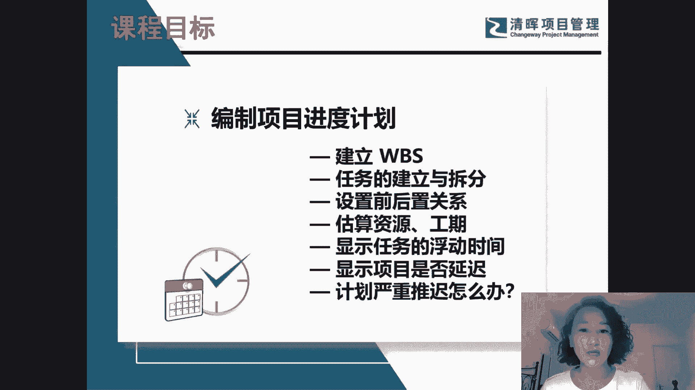

第二个呃还和我们的工作和我们的任务顺序有关系。呃，比方说你有10个任务，有一些任务呢是一个一个排着队来做的串联的。那么有一些这个任务呢？你是并行执行的，就10个活可以同时一起干。

所以和我们的任务顺序有关。那么还和什么有关呢？我们的进度还和资源有关。所以我们的任务取局取决于范围，取决于任务的顺序，取决于资源，也就是一个人干活和10个人干活不一样，或者是你的普通资源和你的高级资源。

你的活也是不一样的。所以取决于范围取决于任务顺序取决于资源。那么还取决于什么呢？啊啊还有我们划出了进度计划之后，可以了解我们的浮动时间。什么叫浮动时间呢？浮动时间也就意味着你项目的啊可宽延的时间。

有一些。

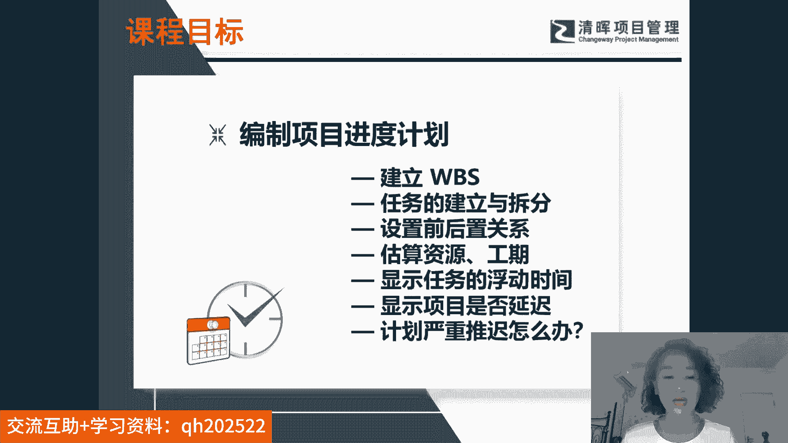

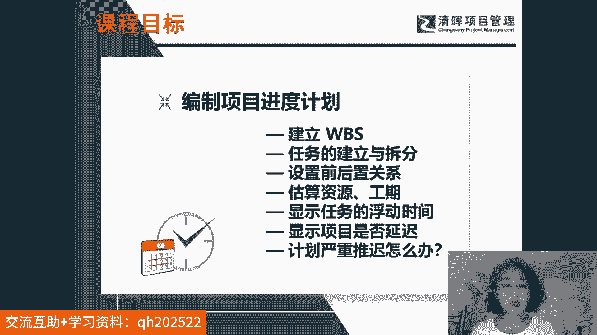

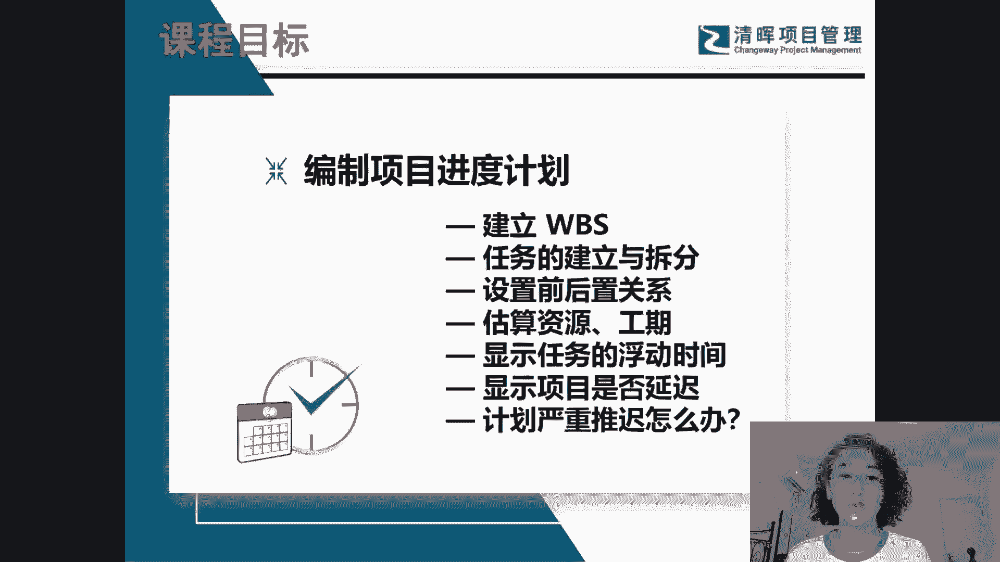

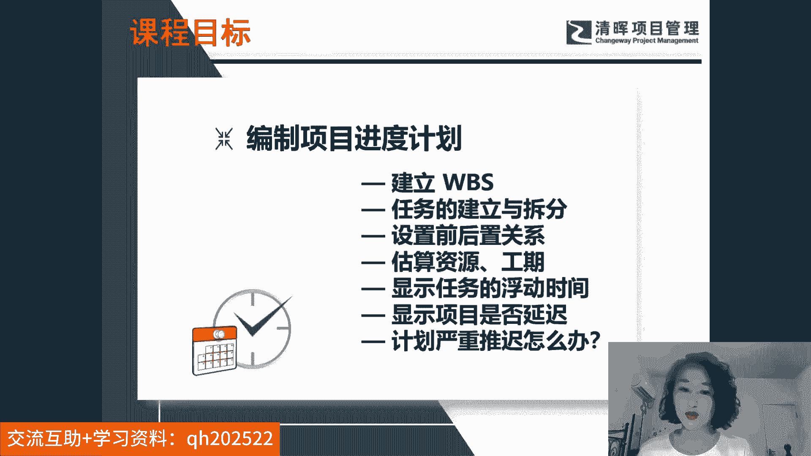

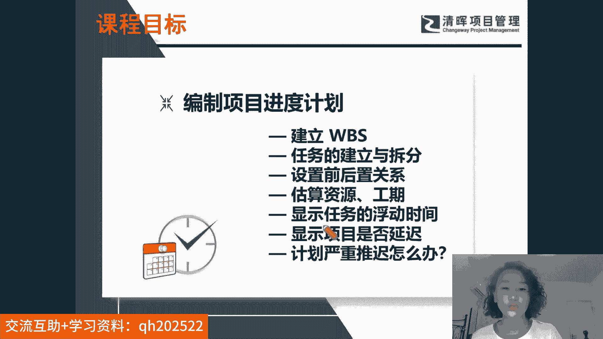

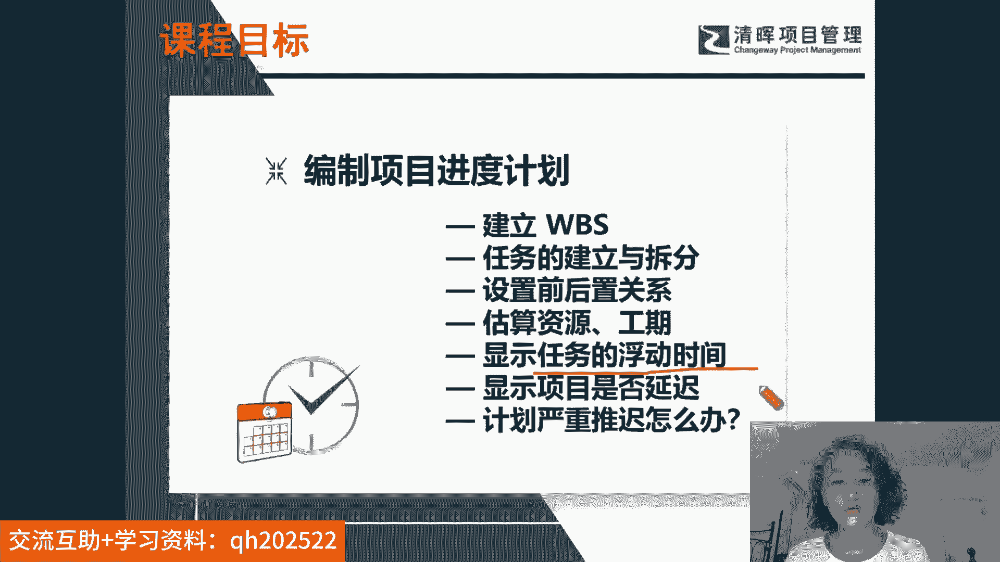

任务你拖延一会儿，不会影响我们整个项目的工期。有一些任务呢你拖延一会儿一定会影响工期。所以要了解每个任务的浮动时间。那么了解浮动时间之后做到心中有数。那么如果跟领导汇报的时候，你也要知道你项目的状态吧。

你的项目是不是延迟进度提前还是落后，要了解我们实际状态和我们的基准之间的差异。那么了解差异之后，如果你的呃项目严重延迟了，那么现在应该怎么办呢？所以我们在今天讲座都会解决这些问题。

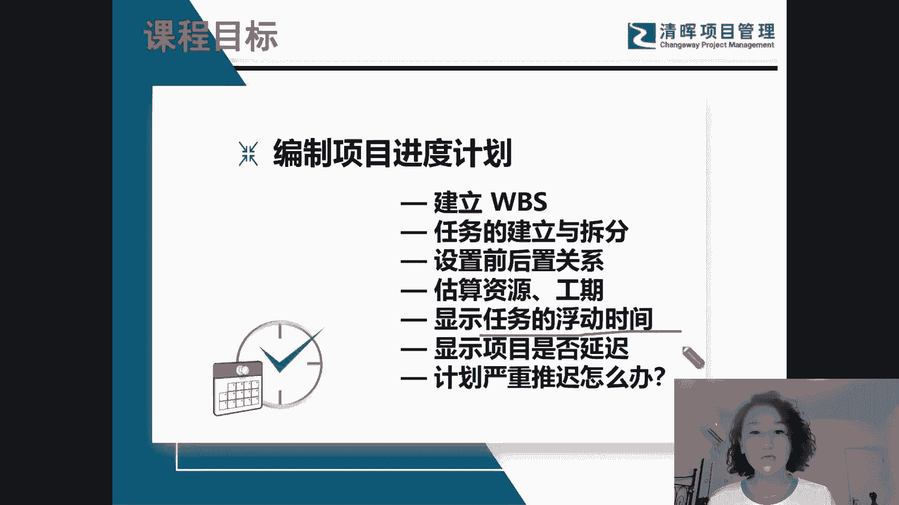

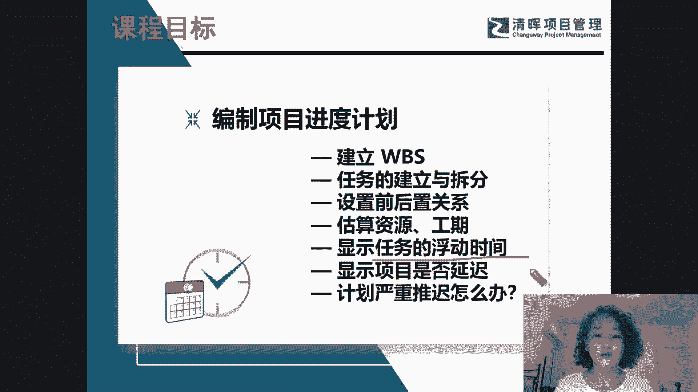

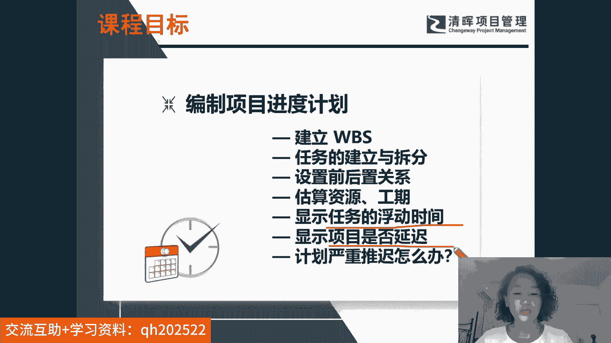

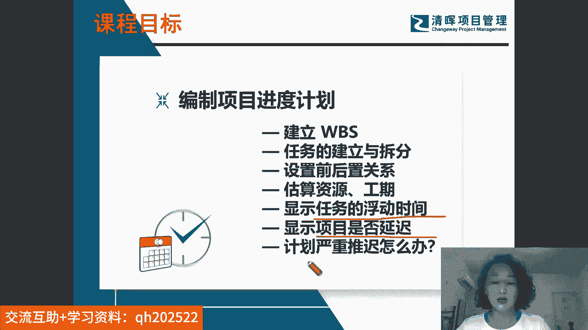

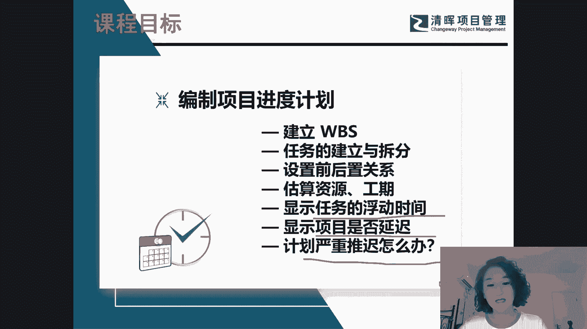