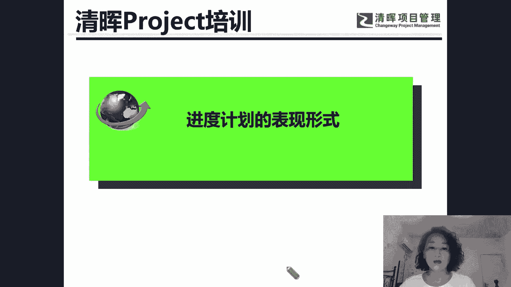
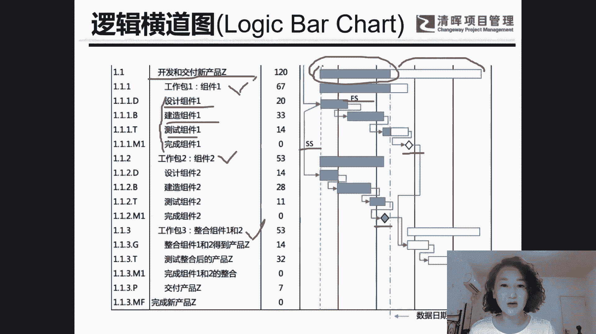

# 【视频教程】白漂！手把手叫你用Project做项目进度管理 - P2：2、进度计划的表现形式 - 清晖Drina - BV12S411N7jp

回顾一下我们的进度计划的表现形式。我们在P book，也就是我们的PMP的知识体系当中，有一张这种逻辑甘特图。那么这个逻辑甘特图呢呃也就是这样的一张图，我把它截图放在我们的讲义当中了。

那么这张逻辑甘特图，我就是我们今天的一个学习目标，也就是我们要通过软件画出这张逻辑甘特图，就是听完我们今天讲座之后，我们就可以画出这张图来。那么这张图我给大家来分析一下。那首先它这个是项目的名称。

然后呢，它会有三个工作包，这是第一个。

第一个工作包2，工作包3，然后每个工作包呢底下还会会有一些活动。那么工作包在我们的project当中叫做摘要任务，也就是母任务，摘要任务。摘要任务底下又会很多子任务。因此底下的这些呃设计也好，建造也好。

还有测试也好，都是。子任务。所以在pro软件当中和我们偏P知识体系当中还是会有一些差异的。那么所有底下设计建造测试完成都是这个子任务工作包，这些都是摘要任务啊，然后有三个工作包。

那么这些任务之间又会有逻辑关系，有的是SS的关系，就是开始到开始，有的是FS的关系，也就是完成到开始，那么还会有一些特殊的任务，就是这些菱形表示的菱形表示的是里程碑。也就是你阶段重要的结束时间点。

这个叫做里程碑。那么呃还有一些什么呢？还可以显示这个任务已经完成了多少。比如说我们会用这个深蓝色的表示这个任务已经完成了多少，那么还剩多少没完成呢？用这个白色的这种区域啊，来显示还有多少没有完成。

所以可以达到监控项目啊，这个进度和进展的一个这样的目的。嗯，不好意思，我的麦克风是内置的，我没有耳机，所以我是用这个电脑内置的一个麦克风啊，大家就将就听听吧，不好意思哦。好，那么我们再来继续啊。

大家主要看我的操作好不好？看我的操作，不用关注我的呃具体的声音啊，看操作操作的时候，我会我会稍微慢一些的。那么呃在今天来的一些同学呢，可能是有一些没有学学过偏僻，没有学过项目管理的。

有些已经学过项目管理的。那么我们就嗯没有学过项目管理的。我就简单说一下什么是项目，给大家有一个简单的概念。

