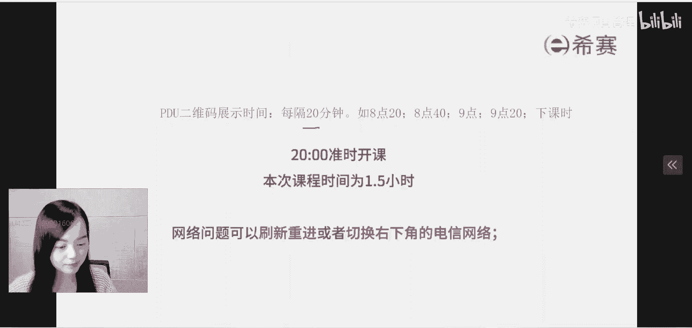
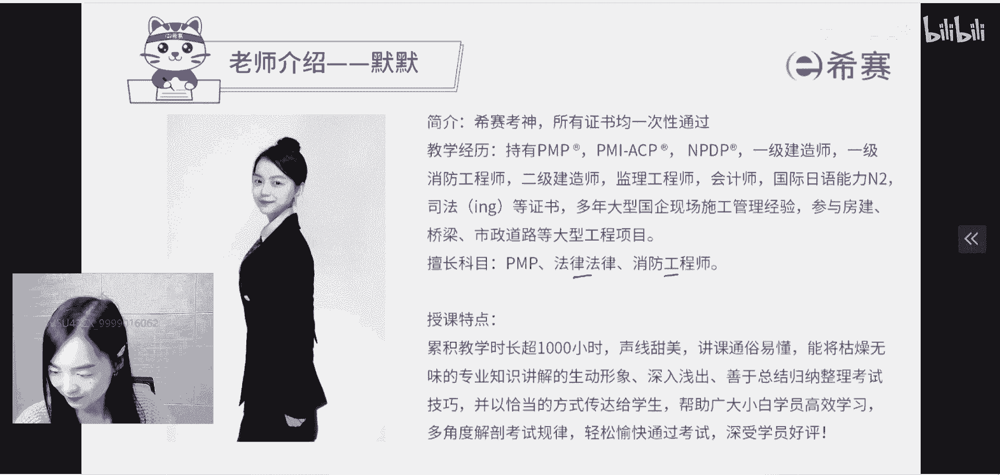
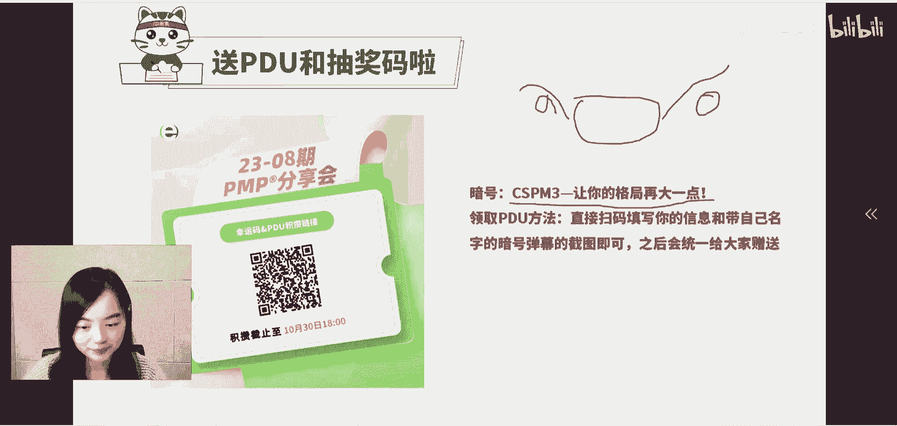
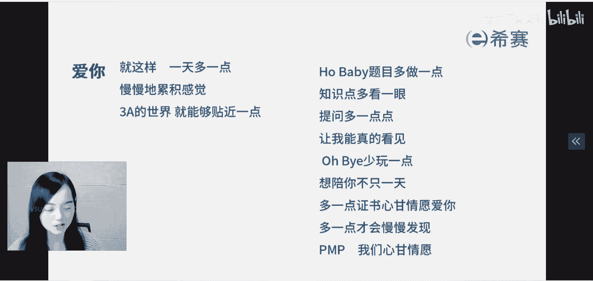

# 【重点推荐】2023年PMP项目管理职场晋级攻略系列公开课合集视频（附七月份+十月份公开课课件）！ - P4：项目管理CSPM-3级《中级项目管理专业人员公开课》 - 希赛项目管理 - BV1Hu4y157zC

好那我们就正式开课，首先要恭喜咱们刚刚出成绩的这一页，同学们，那咱们西塞有三个班参加考试，分别是我带的新时班，还有罗老师带的彭程班，还有佩奇老师带的夏秋班，三个班级我大概看了一下啊。

嗯通过率还是很不错的，大部分同学都是顺利的通过，3A率也是非常的高，所以我在最开始需要给大家鼓个掌，恭喜大家通过考试，那么你们就可以参加我们这次的毕业分享会了，有好多的活动，咱们首先会有分享会三天诶。

一个是10月31号，11月1号，12月2号三天，我们会邀请一些优秀的学员来做分享，那我是10月31号直播，第二天是星星老师，陈欣老师，第三天是紫霞仙子杨楠老师，到时候大家也可以来凑热闹啊。

然后呢嗯我们也会有这样的抽奖活动，就是大家现在啊，看我们助教老师给大家发的这些信，密码的积攒攻略，你只要参加，比如说你分享一些文章啊，参与我们的课程啊，就可以积攒信誉，积攒这个信誉码是干啥的呢。

其实就是一个码，就相当于池子里面的一个小球诶，你积攒的码越多，这个球啊中奖的几率就越大，而我们的奖品呢是有分为三个级别，第一个级别是二等奖，会给大家抽70名，很多啊啊有什么奖品呢，比如说什么蓝牙耳机啊。

还有西塞猫，就是那个蓝色的猫很可爱，二等奖呢有25个啊，送电饭煲或者是充电宝吸尘器，然后特等奖有一个免单啊，各位同学，你们有机会可以白嫖啊，白嫖MPDP产品经理CP也好，prince two也好。

等等等等，爽歪歪是吧，所以这个就是咱们的分享会，希望大家可以多积攒一点抽奖码。

然后就是我们这一次的职场晋升课程，一共是有123456，有六节课，应该是从我们考试成绩出来的第二天开始了，本周二各位同学大家好，各位同学大家好啊，本周二就开始了啊啊今天已经是第四天了。

我们今天是讲CSPM这门考试，然后下个礼拜呢我还会有一节还是我啊，又是我，10月27号呢，我也会有一个建筑行业的项目管理赋能，就是工程这个行业项目经理考建造师的公开课，诶又是我，所以如果在座的各位同学。

你对建造师感兴趣的话呢，你们也可以过来凑凑热闹。

0。2维码诶，凑凑抽奖码，那我们今天的主题就是中级项目管理，专业人员的公开课，代表等级就是CSPM3级，那么在正式上课之前。

我先给大家做一个简单的自我介绍吧，刚刚我同学说我太年轻了，是的我是很年轻，我今年18岁啊啊人称新赛考神，大家都叫我默默老师啊，我呢是双学位会计学家，建筑工程最大的优点就是会考证了。

所以你们第一次见到我的同学，其实我不是表面上看到的这么简单啊，所以我最大的优点就是会考试了呃，我原来是工程行业出身啊，简单来说你可以理解我是建房子，修路修桥的，我的建造师专业方向是建筑和市政。

OK除此之外呢，我还有好多的证书，以上给大家列出来的证书，通通都是一次性通过的，涉猎范围非常的广，所以一直以来我上课的风格就是重点比较突出，总结性比较强，所以一直以来我的班级通过率都是很高的啊。

大家听过点睛课的应该也是知道的哈，总结性非常的强啊，所以大家别看我看上去比较年轻啊，但实际上呢我是只要在到了年限就会去考试，所以考的证又多又快，我可以尽我最大的能力，在最短的时间去通过一门考试。

那我是希望可以把我考证的运气传染给大家，让大家都可以变成考生，逢考必过，OK这是我的简单自我介绍，当然还有一些别的东西，我主要是教三门科目，第一门科目就是咱们熟悉的偏僻。

第二门科目呢就是建造师的法律法规，还有一门科目呢是消防工程师一级啊，教人家灭火的，所以这个是我简单的自我介绍，大家认识我了吧。

好久不见，好久不见啊，各位同学，那么咱们进入主题前5分钟，通通都是给大家讲一下这些自我介绍啊，咱们的这些活动，那么咱们进入正题，今天大家来是专程来看我的吗，各位同学不是专程来看我的吧。

还是想要了解一下咱们cs p m这个证书，对不对，所以咱们今天的主要内容呢分为六个大的模块，第一个大的模块就是给大家简单介绍一下，咱们cs p m体系的一个简介，你既然要考这个证书。

那你肯定是要了解一下这个证书，是不是一个野鸡证书啊，哎是不是一个考了没啥用的证书，是不是一个没啥发展的证书，所以第一个部分给大家介绍一下，整个cs pm怎么来的，是哪儿出来的，所以了解他的背景。

这是很重要的，他背后的组织你也要知道，而第二个模块就是咱们考试的情况诶，我给大家介绍一下啥时候考考试报名费啊，考试的题型，题量这些基本的情况，这是第二个部分啊，还有第三个部分呢是也给大家介绍一下啊。

CSPM3的学习内容，咱们学些啥，跟咱们原来的PMP有什么样的区别，另外还有第四个模块呢，就是关于CSPM这本证书的人才评估要求，也就是整个这本证书其实是有分为五个级别，这个大家未来你就知道了啊。

五个级别我们不是一级级的往上跑，我们今天呢主要讲述的是三级，所以在这个模块呢，我会给大家简单介绍一下，每一个级别有什么样的区别，而下一个模块备考安排，其实就是我们西塞啊安排的课程。

哎下一次课是什么时候上课啊，哪个老师上啊，诸如此类，还有一些活动啥的，最后呢如果大家有一些疑问，也可以留点时间给大家答疑，跟大家好好的互动一下，好不好，这个就是咱们今天的主要内容了。

好我看到我们平台上的很多同学啊，因为你的名字是马赛克，但是我大概可以猜出来你是谁，比如说王阳同学，严佳琪同学虽然已经过了大半年了，但是我都记得你们每一位同学我都记得啊，那我们就开始进入第一个部分。

关于CPM体系的一个简介。

好那CSP全称是啥了，这英文我不给大家念了啊，中文名就叫做项目管理专业人员能力评价等级，证书，是由中国标准化协会，根据国际项目管理专业人员能力评价要求，看到没有国标，带国字开头的。

2023年开始组织开展，属于我们国家的项目管理能力认证证书，所以它的级别分为五个等级，但是关键在哪里，你会发现是谁组织的呀，中国标准化协会根据什么东西来组织的考试，国标推荐性标准。

所以你知道带国字头的东西往往是比较靠谱的，所以他的级别从高到低，一共是分为五个级别，诶，下面给大家讲了啊，12345，分别从辅助人员到初级项目管理专业人员，到中级项目管理专业人员，到高级到专家级。

而我们今天的主题就是三级，那大家大概知道啊，咱们这本证书啊，它是国字头的一个考试之后呢。

来他是怎么由来的，首先标准化工作，他其实是在国家标准化管，理委员会的指导下进行的，我问一下各位同学，你们知不知道标准分为哪几类，有国家标准，有行业标准，有地方标准，有企业标准，还有团体标准。

所以G开头的是国标，也就是国家标准，对全国范围内统一要求的一种技术要求，而且是由国家标准化行政主管部门制定出来，而且要在全国范围之内实施，所以国家标准化管理委员会，就是我们这一门课程，它的后台。

他以前的全称叫做中国国家标准化管理委员会，应该是那个时间节点，国家机构改革之后呢，国家标准化管理委员会的职责，就划入了国家市场监督管理总局，但是这个国家标准化管理委员会的牌子，还是保留的。

所以大家会知道这里写了一大堆，但是你需要知道的是什么，就是我们国家所有的标准，都是国家标准化管理委员会发布的，而这样的一个一个团体，它是什么呢，它是我们国家标准这个模块的最高组织，所以整个标准化的工作。

在我们国家是受到了很大的重视，你千万不要觉得咱们CPM证书，是一个什么野鸡组织啊，是一个什么民间组织啊，他不是他是政府组织，所以实际上他的职责是化物了，划入了国家市场监督管理总局。

这是第一个，他的后台是很硬的，好不好，而第二个就是我们已经知道了，国家标准化管理委员会，他就是CSPM的后台，然后它下面呢有设置很多的标准化技术委员会，其中一个标准化技术委员会就是全国项目管理。

标准化技术委员会，了解一下他的这个序列号是343，也就是第343个标准化技术委员会，当然啦，你知道，肯定还会有很多国别的标准化技术委员会，对不对，每一个不同的这个技术委员会。

他会负责出台不同的领域的标准，所以项目管理这个模块，它的牌号是34308年，由国家标准化管理委员会批准成立，你看就给大家念了吧，就是全国范围内，专门负责我们国家这些标准化的政策规划，制度的制定研究。

还包括国际交流与合作，人才培养与评价，所以你会发现它里面有人才培养与评价诶，我们就是按照这样的一个要求开展的。

CPM3的考试，所以它到底是一个什么证书呢，我们来看这样的一个组织结构图啊，这些年，其实我们国家有一群顶尖的项目管理专家，他一直都在打造我们自己的标准，因为大家知道项目管理引入中国有多少年了，知道吗。

30多年了，这个过程其实我们有很多企业的专家，包括学员已经在实践当中，逐渐地结合了我们国家的文化，形成了很多很适合我们国家的项目管理，思想方法，还有一些工具技术，所以整个这个机构的目标。

就是把大家的实践成果结合起来，形成我们国家自己的方法论和标准推向ISO，所以各位同学，如果你想了解CSPM它是什么呢，它其实是根据我们国家去年10月份发布的，项目管理专业人员的评价要求。

长这样长这样啊，PDU每20分钟发放一次，待会待会给大家讲那个暗号啊，就你们看这个啊，看所以你你看啊，我们的培训材料，咱们的参考书啊，通通都是国标开头的，长这样，而且项目管理专业人员的评价要求。

其实真的是目前在国际范围内，第一个把项目管理人员，你能力的这种评价变成国家的标准，现在世界上这么多国家，没有一个把项目管理能力评价的要求，变成国标的，我们是全球投一个ISO里面也没有这样的标准。

所以国家一定会推广这样的一个证书，其实就是推广中国人自己的项目管理，所以我们反过头来。

你看整个这张图的C位是什么，C位是这个全国项目管理标准化技术委员会，但实际上呢，它就是国家标准化管理委员会的一部分啊，所以围绕着这些事情啊，咱们开展了一系列的评价工作，还成立了一些专家库委员会。

成立了一系列的工作组，所以咱们这门考试啊，你不觉得他是一个很low的考试，任何事只要和国家沾上边，国字头就一定有自己的立足之地，所以大家可能多多少少也知道啊，就是有些事情我们在课上不好说。

就现在这种国际政局啊，大家都知道一点，FSTM相当于就是国货，好，TMT呢其实说白了也是外国的考试嘛，咱们要支持国货，未来这一套体系呢，它一定会发展壮大起来，大家一定不要对他失去信心啊。

而他的证书长啥样呢，长这样，它非常的规范，和大家可能手里面有的这些软考的证书也好啊，像我们建造师的证书也好，一脉相承，他盖的章呢目前是中国标准化协会的落款，所以现在我们是鼓励大家进行vs p m的认证。

其实从19年开始，我不知道大家有没有听说过嗯，我们国家出台了一个政策，叫放管服，有听说过吗，放管服务，简化政策，放管结合优化服务，因为原来啊政府发放的证书是比较多的，也比较乱，有一些证书啊，他既不科学。

也没有得到市场的认可，甚至有些证书他真的就是不太合理，打着政府的名义来发证，所以19年吧，19年的时候，就叫做放管服，分批次的把一些证书给废掉，取消了一些证书，留下来的就其实没有很多很多了啊。

所以那一年费了好多的证书之后呢，改为什么样的方式，改变的方式，就是国家出统一的人员能力评价标准，用于指导各个行业，各个社会团体出相应的任职资格，所以他的意思就是行业社会团体，他可以去组织一些考试诶。

出一些任职资格，但是你要证明它是符合国家标准的，就是我们各类的人员能力的评价要求，所以从那一年开始，国家嘛这个政策统一，就是要求按照这个方向去走，而我们这个证书完全就是符合这个逻辑的。

所以最早呢我们先出了这样的一套能力，评价标准国标，然后再就是这个标准出CPM的认证，再组织大家来考试，所以这条线路是真正符合国家未来发展方向的，正规路径好，所以这个是大家需要知道的。

未来一定是一个很好的发展方向。

所以这也是为什么你会发现你看到这个证书啊，就非常的正规，你是带国字头的吗，后期呢我们对于这些证书的维护也好，诶继续教育也好，统统都是跟咱们别的这些国家标准的证书，差不多。

所以这就是咱们这个证书的一个图样啊，12345分别是不同的颜色，我们如果通过了三级，那就是CSPM3，但是我们也有一些同学，你们考过的TNT，对不对，你可以直接去申请CSPM2的这个等级证书。

如果你还没有去申领呢，你可以去申请一下，它可以直接对标好，所以呢PMP以上让你格局放大一点点，哼更高级别的项目经理，而且是国货项目经理，就是cs p m3好不好，所以这个是关于这本证书啊。

然后这个就是我刚才给大家展示的，咱们是依据这样的一个标准，来给大家做相应的培训，课程，都是依据标准来的，所以它确实是符合我们国家的一个发展方向，一个路径，其实国外啊，现在发达的国家一直以来都是这么做的。

那我们国家没这么做，所以在这个过程当中呢，我们也是逐渐的走向了，所以到了这个时间节点，我先给大家嗯发下二维码好不好，我发完二维码再给大家解答一些疑问，就是我们很多同学就是一直在提问啊。

我给大家答一下疑，我先给大家放一下二维码，你们可以看一下，来我看一下大家的疑问啊，首先我问一下看一下啊，呃其实cs p m2你可以去认领，虚不虚症其实不重要嘛，你要考三级啊，你不能一直在二级蹦跶呀。

然后可以直接跳过CSPM3，考CSPM4吗，其实它是这样子的，呃这个标准去年才出台，到现在为止也就一年的时间，我们现在开放的是三级的考试，四级还没开始，所以我们现在能考的就是第三级好不好，这是第一个。

然后第二个就是我们有同学问，PGMP可以免考对标CSPM3吗，可以我待会给大家讲到，像这些证书啊，都是有一些对标的，政策的好不好，就比如说偏僻地方的是二级PGMP，对标的就是三级，所以你考CSPM3。

就相当于你拿到了pg mp，就是相机管理的这个认证一样的，好的，你们先刷暗号刷着，我还给大家答一下疑，我看一下啊，好两边的这个问答还是挺多的，还有同学可能会问哎呀，这个证书它到底和软考有什么区别。

它和我们啊建造师有什么区别，我跟大家简单的解释一下，你们先刷着，其实软考严格意义上他不算是项目管理，他算是信息化，下面出的是偏向于专业化的信息化领域，所以这个是软考。

而我们另外有同学可能提到的什么建造师啊，他是住建部，下面的是工程行业专业领域的项目经理，所以一个是信息化领域的项目经理软考，还有一个是工程行业的项目经理建造师，而现在的CPM3呢，它不是针对哪一个行业。

它是要把你的项目管理能力，变成一个行业技术通用的一个东西，它约束的是各行各业啊，所以这是他和软考建造师这些证书的区别，好大家都打了暗号了吗，后面来的同学，我们在座的各位同学。

热心的也可以告知他们怎么领取PDO啊，呃我们继续上课好吗，好我们有同学问能不能平局，称不着急，我马上就给大家讲到啊，我们先回来上课好吗。

待会再过20分钟，我再给大家展示这个东西好不好，所以我刚才其实已经给大家简单的介绍了一下，这样一门考试啊，所以它约束的是各行各业，其实未来不管是谁啊，只要是发项目管理的相关证书，除非它不叫项目管理诶。

只要他家项目管理，他都得按照国家标准来做，所以它是一个统一的要求，是底线，所以大家知道国标出来是一个非常重要的事情，它标志着什么呢，它标志着全国，不管谁出台和项目管理相关的这些东西。

它都得符合国家的标准啊，甚至是国外的东西，你要符合国家标准，否则你不可能引进的，所以整个这个事的方向就是对的啊，但有同学问到哎呀，这职称能不能平，到底可以做什么样的用，我跟大家说一下啊。

咱们要进行一个变革，推动一门新的考试，首先方向是对的，但它是需要时间的，就算是你在公司里，你在你家里推动一个变革，这都很难了，更不要说国家推的这些证书了啊，他一定是以年为单位的。

所以你看啊你们企业里面推动一个标准，企业标准让这么多部门来协调一致，也需要周期，是不是，所以啊它是一个逐步需要转变适应的过程，他不会说今天国标出来，明天考了试，后天我们就可以对标到中级职称了。

这都需要过程，但是你说他一定不能对标中级职称吗，我跟大家说，肯定未来会发布，我们这个标准正式发布是去年10月，去年10月到现在有一年的时间，虽然有些话呢说起来有画饼的嫌疑啊，有点早。

但是这个饼我一定得给大家画，10年之后你再听一下，我今天这堂课你会发现很多事啊，它是可以预见会发生的，这个证书不管是和职称挂钩还是人才引进，还是和你们各个企业的任职晋升，他都会挂钩起来。

只不过他需要一个过程，需要大家共同的努力好，所以你们会不会觉得我给你们画饼，不是画饼啊，是真的国字开头的吗，推广这些东西啊，国标啊它是需要周期的，要不然你推广不下去，所以说国家出台的标准它迟早会落地。

这是一个大势所趋的事情，只不过需要时间，所以各位同学有听过一句话吗，其实说的就是，任何一件事情你要做第一个吃螃蟹的人，有没有听过这句话，各位同学，你们现在啊如果真的是对这个东西有意向。

你们是有领先优势的，一定要明白，在我们国家任何事情，在任何一个国家，你跟着别人跑是没有前途的，一个赚钱的门路，如果在你刷抖音的时候，哎，刷百度的时候，刷小红书的时候被你刷到了，他还能赚钱吗，赚不到钱了。

所以说这是第一个，咱们是国字开头的啊，这很重要，也是很规范的，也是未来的一个发展趋势，所以这就是咱们项目管理专业能源呃，专业人员能力评价要求，对标的就是国标418312002，而这样的一个标准。

其实我不知道大家有没有读过一些标准，有读过吗，应该多多少少也看过一些标准吧，不管是国家标准还是一些行业标准，企业标准，其实你会发现这些标准都有一个特点，那就很干很少，很难看懂，是不是他都是高度提炼的。

为什么呢，其实就是因为这样的一个证书啊，他真的就是具有普适性的特点，尤其这种大标准，什么是普适性呢，给大家打一下字啊，普适性的特点就是说你要各行各业都适用啊，他会去掉很多的具体业务场景。

所以说如果你真的是里面有很多实践的例子，很多业务场景它就没有这种普适性了，所以大家知道我其实在2018年的时候，17年一八年的时候，我呢就教消防工程师这门考试诶，也是根据这种规范教学，学起来很乏味的。

我每天上课就是根据国家建筑设计防火规范，它的要求怎么怎么怎么样，根据自动喷水灭火系统设计规范，怎么怎么怎么样，它很精简，很干瘪，读起来难受，但是没有办法呀，因为国家标准这种东西，如果字很多。

很难让所有的人都达成共识，因为这个标准里的每一句话，我们都需要得到大部分人的认可，所以国标它代表的就是国家政府，军队，各行各业，我们都是要认可的呀，所以字越少就很容易达成共识，字越多就很难达成共识。

所有的标准都有这样的共性，所以大家可以尝试着去查一下这个标准啊，网上应该都能搜得到，这就是一个普适性的东西，而且你往往会发现啊，越是高级别的标准，它的字就会越少，越低级别的标准，它的字就会越多。

所以像这种标准，你读完了之后，你可以找一个标准读一下，你会觉得哎呀有道理啊，讲的很科学呀，但是它也会带来一个非常大的挑战，是什么呢，就是让你理解起来非常的费劲，那就需要有人去给你解读了。

所以你会发现像ISO就先等等这些标准呢，往往会有一堆专业的机构，他们去解释这些标准，因为你如果你不解释，看不懂，没有办法给我递，所以大家知道啊，这样的一个标准其实很干涩，很难读懂，是需要去理解。

需要人去给你引导方向的，当然从国标往下再往下可能会有行业标准诶，如果你刚刚好是一个行业的，那你会觉得行业标准的东西，你理解起来就会容易很多，而再往下走，如果呢咱们就着这套行业标准再出企业标准。

那你会更好理解了诶，这标准一出来，你一下就能明白，因为你会发现，这个企业标准，可能描述的就是某一些项目经理的人才，画像能力要求，那不说的就是你吗，所以放在你自己的身上，你就好理解，对不对。

但国标不一样啊，它覆盖所有的行业，要约束政府，军队，各企业各单位，所以对大家来说，咱们这个证书啊不仅是中国人自己的项目经理，而且是在开辟一个符合国家发展要求的新赛道，新路线，如果你对他感兴趣呢。

你就是第一批吃螃蟹的人，优势还是非常明显的啊，但是我跟大家说的是，诶画个饼，这绝对是一个正确的选择。

而我们刚才有很多同学啊有提了一个问题，这PMP和咱们这个cs p m3有什么区别，有什么联系，你们可以看一下眼前这一页PPT，就你会发现它是有一定的对标关系的，比如说最左边CSPM国家标准。

把人才分为五个等级，而中间就是我们非常熟悉的PMP，项目管理专业人员资格认证，如果你现在已经考过了pp，你可以直接对标到初级项目管理专业人员，但我说实话这个东西啊初级有同学有初级的吧。

其实真的作用不是特别的大，这个我不是嗯就不给大家吹牛了啊，这个是真的中级以上才有用，所以如果你在你考过了PMP之后，你可以去选择考PGMP，也就是项目集管理的专业人员资格认证，但这个证书首先它很贵。

其次它很难，再其次它还是国外的东西啊，是外国货，而他对标的就是咱们现在的第三级，中级项目管理专业人员，所以让你选一个性价比比较高的，你选哪一个呢，我跟大家说啊，PGMP有多贵，考试费就是7000。

培训费在咱们西塞就是8800，好像好像是8800啊，好像是8800，在国外的是不是在外面的这些机构，我大概看了一下行情啊，都是1万起步，这是光培训了，而且它的这个难度也挺大的。

因为我们之前有参加过一些PGM批讲师的培训，那些老师啊，我啊其实都有看到过，还有罗老师啊，一起看了一下他的这个培训体系的认证的，这些题目啊，还有这些知识，我说实话就比较抽象，也比较难理解。

所以说这个PGMP它的性价比其实不是很高，而CSPM3，它其实对标的就是PGMP一个级别，那你说哪一个更划算呢，我跟大家说一下整个cs p m3的费用情况，报考费呢只要1800。

PGMP的报考费7000，补考费啊，这个不多说，大家都不会补考，跟着我学，绝不补考，续费5年一次，每次300人民币人民币啊，不是这个好吧，美元，所以哪个划算呢，肯定是CSPM3划算，而且我跟大家说啊。

这个cs p m3它的题目相对而言是简单一些，简单一些啊，啊呃有多简单呢，我再为大家展示一下题目，它非常的适合中国人考试，当然如果你有别的一些证书，比如说右边这两列啊，华为体系的这种认证。

还有IPMA的认证，说实话这两个证书我不是特别的了解啊，所以大家可以看一下，同样是可以对标到相应级别的这些考试证书，你们横向看一同一横的，同一横轴的就是一个级别的好不好。

所以这个是他们之间的一个对标关系。

而咱们的这个CPM体系呢是有分为五级，刚才已经给大家简单的说了一下啊，12345分别最大的就是辅助者，初级中级高级专家级，而每一个级别它的区别，我后面有一个专门的小的模块给大家讲解。

我先简单给大家捋一下，后面再详述，比如说最底层的一级CSPM1辅助人员，简单来说就是要求你啊，可能刚刚开始技术转管理，你要适应这个岗位，你要懂一些项目管理的基础工具技术，你要能自己用起来。

你要懂这个东西诶，但是他没有对跟人打交道有一定的要求，好对高级面试啊，简单来说呢，一级这个辅助人员就是做好自己的能力，你自己要懂这些东西，你不能是一个小白，整个的体系你都要有一个认知，而第二个级别呢。

初级项目管理专业人员CSPM2，他其实在你自己懂的基础上还加上人，大家知道人这个模块，其实刚刚我们考过的同学，你肯定会知道啊，他是占比42%的，在我们整个PMP的体系当中。

我们原来考试的同学可能嗯去年考试的同学，还有原来5A的这个五个模块考试的同学，你没有会发现它有很大的这种区别啊，嗯但是现在不管是PMP这个体系，还是cs p m的体系。

它都要求对人这个模块有一个非常重要的要求，因为项目经理这个东西啊，他怎么说呢，他就是说他就是把各种各样的人组在一起，做一个整合协调的过程，所以这个能力会更加的重要，所以不仅仅要求你自己懂。

你还要和人打交道，确保项目受控，实现项目标，而再往上走呢，就是我们重点需要把握的，中级项目管理专业人员，CSTM32级和三级最大的区别是什么呢，其实我给大家讲一件事吧，就怎么说呢，我们有没有同学在外企。

你有没有同事待过外企和国企，你会发现哪一种公司做项目管理好做一些，如果你有经验的话，你肯定会发现你在外资做项目会好一些，因为公司的环境都在那了，各种项目管理的规章制度都摆在那儿。

项目的相关方对于项目管理的这些要求，其实也是很明白的，很多的管理制度底下的健全对，所以区别在哪里呢，区别就在于这些人呢，他其实是在于他熟悉什么制度，不熟悉什么制度，熟悉什么方法，不熟悉什么方法诶。

所以问题在这儿啊，如果你在外资企业做项目经理，那你可能就是做到什么样呢，用自己熟悉的项目管理工具和技术和方法，然后带着大家做项目就好了，这些人呐他不会对你做这个事的本身，包括这种文化产生一种质疑。

而三级他最大的挑战就是，我们往往是在一个没有这种项目管理文化的，公司里面去推动项目管理，这个大家可能有同学深受其害啊，呵呵有这种感受，所以这个时候你会发现一个小小项目经理，没有那些已经经过大家认可的。

这些项目管理的规则制度做支撑，很多参与到这样的人诶，他也不了解这个项目管理的方法，他不认同管理的一些行为，那在这种情况下，你想如果你要把大家组织在一起，用你希望的这种方法，用你熟悉的框架来干活。

这就很不容易了，所以你要做到什么样，如果你要在这样的环境下去搞项目，你要充分的利用大家对于这件事的诉求和动机，不要和人打好交道，你要让大家觉得这事是对大家有好处的，而不仅仅是因为在公司里面。

你要遵循公司的管理要求去配合，所以三级解决的问题，它是一个人plus，我这么认为啊，人pl不是因为权利，不是因为公司的要求配合你，你要让他真的是觉得做这个事对他有好处，所以二三级其实是一个分水岭啊。

是一个分水岭，三级呢就是一个管人plus，你要让人家发自内心的愿意跟着你干活诶，共同的用一些约束一些秩序来管理大家，这个是咱们对第三节项目管理的人能力要求啊，好我讲完这一页PPT，咱们就发二维码。

好不好好，所以你要在项目管理这个专业方向上往上走，三级是一个分水岭，也是一个必不可少的能力，越往上走越重要，而再往上走的第四级高级项目管理专业人员，你可以把它理解为不仅要自己懂，你还要把它实践起来。

你还要会落地，你还要和人打交道，你还要做一些复杂的项目，比如说项目集管理向上搞定各种领导，搞定各种投资人，搞定各种下面的高水平专家，搞定其他部门的人，慢慢慢慢做到专家级五级，项目管理专业人员。

嘿这个呢五级是什么概念，大家知道吗，国标里面推崇的就是如果你能做到5G，你在这个行业，只要人家报上你的大名，大家都知道，所以这是我们的一个发展方向，五级还是很难的，所以各位同学。

你是不是一定得从第一集开始考呢，不是基本上你一开始从第三级考，你就不用考前两级了，你可以345往上考，如果你呢呃一开始考的是哪一级，你就只能往上考，明白吗，你不要往下考了，是这个意思啊。

好所以这个是关于咱们五级的能力划分好，所以三个要求是我们CSPM他们的一个要求，要对这些专业的知识需要掌握，要有相应的实践经验，也会要有能力素质的要求，好这个就是咱们五级，基本上我们后期啊学习的内容。

都是参照国标标准里面发布的内容，OK然后呢又到了8。40了。

给大家放二维码，我们看看有同学好像是。

罗老师来了呀哈哈罗老师今天晚上有课都来了，就是你们还没有领取这个嗯，先不PDU的这个同学啊，可以截一下图啊，不是必须逐级逐级考试，但是现在我们暂时只开放了三级啊，好，的，对应该是我们常乐班都来了。

来嘿嘿，好看到了很多熟悉的同学啊，提醒我待会给大家介绍啊，不要着急，你们想了解的，我会一点一点给大家介绍，C s p m3，要写论文，不用写论文，不用写论文，只有问答题，培训费和考试费。

考试费是1800，我前面有一页PPT展示了啊，就是你们如果想要这个PPT啊，呃你后期可以找我们的运营小姐姐要啊，好你们都扫了二维码吗，有没有发弹幕，好，晚上好晚上好，很多好久不见的同学啊。

OK啊这其实就是我们讲的第一部分的内容，这本证书呢，它绝对是绝对是未来的一个发展方向，是我们国货项目经理，现在我们要支持国货，好弹幕就是写了啊，Cs pm3，让你的格局再大一点，你呢把这个字写在弹幕上。

然后截个屏，然后扫这个二维码上传就好了，好不好好，我们继续往下讲好吗，好。

我们继续往下讲啊，好，那我们第一个模块呢，其实就给大家介绍到这里了，然后九点钟的时候我再给大家放一次二维码，如果没有领到的同学，待会再来啊，好第二个部分呢就是考试情况了，就是刚才说的啊，考试的题型啊。

考什么考多久啊。

诸如此类诶，我看到了郭明华同学，虽然你打了马赛克，但是我认识你啊，应学班的超级学霸好，那么考这个试也不是说你随随便就可以报的啊，是有一定的报考条件的，你们可以看一下，这个呢是没有看不懂的。

如果你要报考三级呢，你要具备下列条件，比如说专科至少是从事项目管理工作满6年，本科至少5年啊，双学士那3年研究生呢啊3年啊，下面的这个就不多说了，你们自己去看，所以说你们有没有达到这个要求。

如果没有的话，也没有关系啊，其实我跟大家悄咪咪的说一下，悄悄的说一下啊，其实现在才刚刚开始，我们10月份会有一波考试啊，嗯现在的情况是，虽然他是有这样子的学历年限的要求。

但刚刚开始的考试他没有那么的严格，它是可以一点点操作的好不好，所以如果你没有达到这个要求也没关系啊，你可以找我们的老师诶去调解一下，调节一下啊，好这个是关于咱们的报考要求。

如果你感兴趣的话，问一下咱们的这个销售老师啊，而再往下走就是关于咱们的这个能力评价，考试的题型，题量其实它有分为三个维度啊，材料评审，笔试以及面试，这门考试呢原则上就是每个季度组织一次。

全国统一大纲统一命题，当然不是说所有的级别都要考这个论述题啊。

要面试的，我们看这个直接看这个，就你看这个能力评价的方式，首先如果你考的是1~4级的话呢，他就是材料评审加上笔试，就不需要面试了，只有到五级这个专家级才需要去面试，OK所以我们重点看一下三级，看这。

三级他的考试题型就是满分100分，选择题占比60%，论述题占比40%啊，有一些论述题啊，所以呢他还是不是那么简单的，像咱们PMP考试，你就只有选择题是吧，相对而言还就简单一点点。

有论述题相对他的要求就会高那么一些，而一二级呢就是就会选择题啊，就不多说，你们不要去考一二级的，这个没什么用，而且你如果考过了偏僻，直接就对标到二级，然后四级呢他的论述题的比例就增大了。

所以你会发现越往上走，他的这个考察方式都是不一样的，Ok，所以我们有些同学可能真的，就是听过一些职称哎，差不多差不多啊，只不过我们三级的要求呢不需要面试。

哦我们有同学问咋刚开始不让我们考这个咋，刚刚因为标准去年10月份才出台，今年10月份才组织第一次考试，慢慢的他会推广起来，那个时候可能还没有啊，所以现在是刚刚开始的一个阶段，而且是国家大力推广的好。

然后就是这个呃考试的时间，题型以及数量就跟大家简单的说一下啊，呃1~4级他的考试时间都是三个小时，100道单项选择题加上两道论述题，总分100分，而我们最近的这次考试是10月份10月底。

然后再往下的这次考试呢是1月份，明年的1月份啊，所以1月份这个时间肯定是够用的，OK现在是10月底吗，如果你想要去报考的话，这时间是够用的好，这个就是关于咱们考试的时间题型，还有这个考题的数量。

大概率是1月份还没有下具体的通知，但是基本上就是这个时间节点好。

这个是关于考试的一些相关情况，然后就是我给你们看一下咱们考题的一个实例，你看什么感觉，和PMP是不是有一个很大的区别，你感受一下，他真的就是真的很适合中国宝宝体质啊，题目的风格相对比较死板。

它不存在什么最佳实践，其实你会发现咱们中国的这些考试，都这个风格诶，唯一的答案标准答案选这个，那别的就一定是错的，好，我们PMP就完全不一样，你看最佳实践了，读完了题不知道他在说啥，四个答案好像都对诶。

你要选一个最好的，但是我们cs p m这个考试就不一样，它是唯一答案，而且是怎么说呢，需要你在理解的基础上做一点点的记忆，他就是适合中国宝宝体质的，这种出题风格也很明显的可以感受出来，对不对，各位同学。

所以你有考过国内的一些考试，你会发现大部分都是这种风格，比如说以下什么级别，不是项目管理专业人员的能力评价维度之一呢，啊诶让你选出来唯一答案没什么可说的，也没有什么争议，所以你们就不用担心哈。

我们助教老师去争啊，哦我觉得这个不对，我觉得那个不对，标准就是这么说的，你没有什么话可说好，这是关于第一个啊，像这样的题目啊，再比如说这道题也是一样啊，根据标准的要求，对于知识的要求。

哪一项要达到一个比较高级别的程度，资源管理，成本管理，资源管理，计划管理，这都是标准里面有原文的，就没有什么没有什么歧义，所以考起来相对而言也比较舒服，就不像我们TMP。

你们会觉得有多少同学觉得你当时考完你会挂，你会觉得我一点底都没有，我用蒙题大法去蒙，都是我蒙的，我没有一道题目可以确定，有没有多有多少同学有这种感觉，DMP考试就是这样啊，这是他自己的风格。

但是我们自己的考试国货项目经理，你就不是的唯一的东西，你考完你就知道你大概能不能过，就没有什么担心的，是不是，所以这个就是关于咱们的题目风格诶，就比较的说他死板吧，他也确实是有点死板，但是呢好考。

而且一般而言呢，任何一个考试最开始出来的时候都是最简单的，越往后走越南，所以这个是咱们的一个趋势啊，而下一个模块就是我们给大家简单的说一下。

针对于CSPM3它的一个学习内容，它的一个章节。

你看咱们的课程大纲一共有13张，比咱们PMP好像少了很多，但是又多了一些很很奇葩的东西。

你看这个没有敏捷诶，诶没有敏捷，所以说你会发现课程大纲里面分为13章，这13张里面呢。

第一章是中国项目标委和项目管理。

专业人员能力评价的工作介绍，啥意思啥意思。

其实第一章啊我们要学的就是哎呀，既然这个是项目为搞的一个证书，这个证书的来龙去脉出处你得了解一下吧。

所以这是第一章大体的介绍，而第二章呢就是咱们第三节，项目管理专业人员能力评价要求，这个肯定会重点介绍，因为我们是根据国标来培训大家，提升大学的能力，那肯定也是要讲一下这些能力要求的，而第三章。

项目经理的角色定位与项目受控环境的建立，所以第三章主要讲的是什么呢，就是在咱们的第三集之下，对于这个项目经理人员的角色定位，虽然都是项目管理的相关考试，但是12345，每一个等级的突破定位它都不一样。

所以这一章其实小小的说一下啊，第三章在我们考试当中是一个重点，哈哈也是考的比较多的点，他是一个什么样的感觉呢，从量变到质变的过程，就比如说第一集到第二集，第二集到第三级，三级到四级，一层一层的往上突破。

而一级到二级，他就是让你可能掌握了更多的知识，诶，但是从第三集开始，这个质的变化，其实就是可能会改变你的一些以前的认知，所以级别的变化，他也决定了项目经理的角色定位，也是不太一样的。

所以我今天的口号是什么，让你的格局再大一点，三级他其实对于项目经理的要求，就是你对自己的认知要有一个更加深刻的体会，你格局会更大，你会跳出你自己这个项目，让你去了解项目处于什么样的环境之下。

在你的公司项目是一个什么样的定位，在项目组合管理里面，你是什么样的定位，诶跟你项目相关的这些投资人也好，发起人也好，供应商也好，这些人呢跟你道有什么样的关系，他们都关心什么。

所以说他是一个量变到质变的一个突破，而再往下走，从第四章开始，一直到咱们第12章，有没有发现既熟悉又陌生，既熟悉又陌生的感觉，有没有，比如说你看啊，第四章他讲的是项目论证的要点与企业实践，啥意思。

项目论证就是我们原来学过的一个东西，叫做商业论证，还记得吗，各位同学，所以商业论证这个东西啊，在我们学PMP的时候，他真的就是点了一下，它也不是考试的重点，但是咱们三级他就会给你重点介绍啊。

它是我们三级需要重点掌握的点，删除了这个上论证还有什么呢，什么项目目标与计划，比如说我们熟知的项目管理计划诶，章程这些东西，还有项目的收益管理，资源风险变更问题，相关方管理汇报管理。

好像又比原来p mp学的多了，好像又是原来一样的东西，所以他其实没有在这个量上要求你学更多，更多的这些知识啊，他不太一样，任何一门证书呢，你会发现都有一个特点啊，不是说等级越高，你要学的东西就越多。

反过来等级越低，其实学的会更多，就像我们小时候我各位同学有没有看过，就小学的时候看那个什么10万个为什么哎，这种百科全书都看过吗，背新华字典，我特别喜欢看这些书啊，你会发现这些书里面啥都有。

你要学好多好多的东西，让你慢慢的长大，你会发现可能你上了大学，你就会学的越来越少，你再往上走，比如说你到了硕士，你学的会更少，因为他就越来越专业了，所以更多的时候无论你考任何一门证书啊。

它有一个这样子的一个趋势吧，就你入门的时候可能要学的更多一点，像我们TP项目管理体系，但是越往上走，他侧重点是不太一样的，所以不同级别的人，他需要关心的事儿是不太一样的，所以第四章啊商业论证。

怎么论证这个项目的价值，还包括项目章程，项目的目标和计划诶，都是我们要熟悉的重点，还包括收益管理，再往下走，你还会发现一个很熟悉但是又陌生的词，叫做汇报诶，你会发现里面没有沟通了，也就汇报了。

沟通在哪里没有，你看从第四章论证，第五章目标计划，第六章收益，然后第789资源风险变更问题，相关方沟通没看到去了，所以p mt里面，我们把中沟通管理作为一个重点学习的内容，对不对，但是三级啊。

它更多的是强调沟通当中的某一个模块，向上汇报，所以汇报他其实很多情况下就是向上管理，什么叫向上管理呢，就是面对你的领导，所以做项目本质上而言，就是通过借助领导的力量来管理下面的人。

所以汇报就显得尤为重要了，而我们原来在PMP当中学的太泛了，正确的人在正确的时间传达正确的信息，送到正确的地点，达到正确的效果，你们还记得吗，五个正确，所以沟通他真的是太泛了，包括向上向下。

向左向右横向任何人的沟通，他都有一个很泛的讲解，但咱们三级就不一样，主要就是和领导打交道，和上级怎么打交道，它是一个非常重要的东西，你可能会发现在你的公司里面，得到领导认可的人。

他大部分都是比较擅长做汇报的人，不认识你和客户汇报，你和领导汇报，他就是作为项目经理，他非常重要的一个能力，所以如果你汇报做得好，那么升职加薪少不了你，所以这个模块在咱们标准当中也是重点体现了。

它特别好，也是各位同学啊，你未来需要专项锻炼的一项能力，而最后一个呢就是第13章，标准化知识与实务哎，这章相对而言是最难的，法规这个模块的专业领域，项目管理是一个专业领域标准化，它也是专业领域。

我们国家专门有标准化法，所以我们也要了解一下，咱们的标准化相关的内容，学习一下标准是怎么来的诶，同时我们未来也会鼓励大家去制定一些标准，你了解一下，所以要慢慢的锻炼自己适应规则的能力。

了解这个标准的由来，OK所以标准标准我前面大家说什么企业标准，社会标准，团体标准，行业标准，国家标准，甚至是国际标准，他们区别在哪里，它的区别其实就在于约束的人不同。

你说企业标准它约束的是不是就是你们公司啊，这个企业行业标准，它约束的就是这个地区的人，团体标准它约束的是某一个团体国家标准，约束的是各行各业，全国所有人，所以如果你啊有这种标准化的相关知识诶。

你未来可以组织大家去制定一些标准啥的，来约束大家，这就是一个非常重要的能力了，所以到了第三集啊，咱们就会要求大家练这个知道标准是什么，有什么样的要求，这就是咱们整个cs p m3的体系，大概会学些什么。

但是你看了这些内容啊，你大概会发现，它更多的是锻炼一种向上管理的能力，所以12345它其实三级是一个分水岭啊，第一集第二集学会知识做好自己，第三集不仅要学会知识，做好自己，你还要和人打交道。

你还要好好的和领导打交道，锻炼你的能力，而第四季第五集他就更不用说了，你要会处理一些复杂的项目，协同一些大型的项目，处理更为复杂的人，更为复杂的事儿，而五级专家级诶，这个就相对比较遥远一点。

我就不多说了，所以对制定标准的人往往就是五级。

希望各位同学未来可以看到你们制定的标准好，这个就是咱们的所有内容，而会给大家怎么说呢，给大家支了一招，这是什么东西，这个东西关于咱们的备考策略，就是很多同学问啊，新出的考试难不难，难为给你把它变成简单。

你们知道点击课是怎么来的吗，我给大家支一个小招，教你来快速的通过一门考试，毕竟是考神吗，给大家分享一些东西，不只是p m p cs p m任何考试通用，你大概了解了咱们这门考试的大致框架。

怎么样才能迅速的通过呢，咱有句这样的话，考试不做题等于白复习，拿到题目之后，我第一时间做了一个对于题目的分类诶，你们可以看到这是一个word文档啊，我整理的他就是把每一类型的题目汇总在一起。

找到解决这类题目的样式，所以这就是我们PMP学过的聚类清河图，还记得吗，各位同学，清河图用亲和的方式把题目进行归纳会整，无论你考什么题啊，考什么试，都是一个做题的过程，考试不做题等于白复习啊。

把题目给梳理清楚，找到解答每一类题型的钥匙，这样你就不需要采用题海战术了，对不对诶，题海战术我一直不提倡啊，用一道题掌握一类题，找到这一类题的钥匙，所以点睛课是怎么来的。

点击课就是通过1000道题的会诊，找到某一类题它的钥匙，然后再一条一条的给大家分享，而咱们的CPM3呢，我也给大家简单的梳理了一下，比如说每一个章节有什么样的考法，这种考法下你怎么样去应对它。

到底是记忆类的题目还是理解类的题目，所以每一种考法呢，都会给大家进行一个汇总归类，无论是你考什么试，你都可以通过这样的方法来灵活的应对，做一道题，掌握一类题，掌握这一类解题的钥匙。

所以大家最早最早的时候呢，咱们的习题课就是我汇总整理的啊，有没有同学上过我的习题课，其实很早的时候上习题课的，但是后来讲正课了啊，呃对于题目的没有讲解了那么多了，但是我在讲课的过程中啊。

一定是会把这些思路带在带的这个课程里面，所以这个就是重点啊，哪个地方重要啊，这是我自己说的吗，我凭什么这么说啊，不是我自己说的啊，是出题的老师告诉我的，他通过什么告诉我的，他通过题目告诉我的。

所以现在九点了给大家展示pd pd啊，你们看没有领的同学，你继续发弹幕啊，我给大家分享，所以跟大家说的就是什么呢，就是题目嘛他总有他的由来，出题的老师呢，他总有这些风格，它是根据这些考点出对应的题目。

对不对，所以你考任何事，你都可以通过这样的方法去进行拆解分类，可以更快的去通过一门考试，所以你如果真的没有那么多的时间，你不妨通过这样的方式啊，不要去搞什么题海战术，题海战术我不推崇，好啊。

TTU在这里没领的同学呢，你们可以看一下啊，每隔20分钟我会放加维码，有同学问我讲cs片吗，讲我讲习题啊，我暂时先讲习题课，暂时先讲习题课啊，我们呃是罗老师，罗老师给大家上第一个班。

其实我们现在在座有好多同学嗯，你们要不要把你的名字给我共识一下，我看好，让我看到你们的身影好吗，听你一次啊，听你不要反复的领啊，好啊，10月份的考试你肯定赶不上了呀，肯定赶不上了啊，行者熟悉很熟悉。

还有彭程班，因为我我对别的班的同学可能不是很记得啊，但是我们新时班呢考神班啊啊应学班，还有荣耀班的同学，我是比较熟悉的，就算你们打了马赛克，我应该都能认出你，好啊好完了吗，完了我们再继续往下走好吗。

好啊，游客同学，你是游客，我真的认不出来啊，肯定不知道你，你是马赛克，我肯定是知不道啊，不知道你啊，花什么什么痕，我应该是在是不是点睛课的时候，你有发言过，那个时候好像还没有打马赛克，花开无痕。

呵呵我猜一猜啊，可能不是啊，可能是吧，我的记忆力还是比较好的，真的是花开无痕，天呐好吧，我还是记忆力蛮好的。

好我们继续往下上课了，我花销无痕是吧。

好，OK那我们刚才已经给大家介绍一下，咱们CPM3的学习内容，以及我给大家展示了啊，大家对这个题目进行了一个汇总整理，未来呢也会给大家进行一个讲解归纳，而下一个模块呢，就是关于咱们具体的CSPM体系的。

人才进阶评估里面的内容，那么这一块呢相对而言，讲起来就比较的怎么说呢，可以让你真的是格局再放大一点，可以让你明白你真的要在项目管理这个领域，这个职业发展方向上进阶，你需要掌握什么样的能力，你要怎么去走。

所以像人员能力进阶的五个层次。

我们前面其实有提到过了，它分为五个级别，五个层次，12345，而每一个级别，它所对应的这种能做的工作都不太一样，就比如说第一集，他就是能胜任一些专业性的辅助工作，二级呢交付一般的项目，三级复杂的项目。

四级呢，高级专业人员可能就是管理这些复杂的项目群，甚至是可以交付一些国际的项目，而五级这个是相对比较遥远的啊，我自认为10年之后可能可以达到这个极品，就是这个行业的专家，只要是提到这个行业就可以想到你。

他就是拿来建标准的哎，负责管理和交付国际项目，负责管理复杂项目组啊，项目及项目，还有项目组合，项目还可以提供公司的战略指引，这个就相对来说高大上，所以我们现在先不要把眼光放的太远，从三级开始，Ok。

那么其实这五个级别它到底有什么样的区别呢。

我给大家梳理一下，也可以让你知道，不仅是这五集，包括各位同学一点一点的在项目管理这个领域，你可以做到什么样的程度，怎么样算到头了，来一点点的说，首先第一个层次认知的改变。

就是第一个级别初级项目管理的人员，我们在座的各位同学，我相信你们都有学过PMP，对不对，学到了一套项目管理知识体系，但是可能你们也忘的差不多了吧，但是你潜意识里你会记得TMP啊，说的好像很有道理啊。

但其实它本身就是一个项目管理的百科全书，你学完了之后，你通过了考试，你最大的改变是什么，各位同学有什么改变，我相信绝对是改变了，你对于项目管理的基础认知，你对于开展这种任务型的工作。

你大概知道了APDCA循环，以终为始的一套标准的管理方法，你知道啊，哦原来呀有这么多的管理工具技术，他是这么叫的，感觉很专业，所以最开始啊，你学的PMP其实就是一个认知的改变，诶，你懂得这些东西。

但是你又得知道了，我们有同学说不知道怎么落地，确实是像我们小时候学的百科全书啊，这些10万个为什么，为什么你觉得接受起来容易呢，因为它仅仅是扩展了你的知识面的改变，你的认知是很容易的，你知道这回事。

但是最大的挑战就是不知道怎么落地，像我们花乡我和同学说的一样啊，因为书上并没有讲具体怎么干活诶，讲的更多的就是拓展你视野的问题，所以它就被视为咱们在项目管理专业，职业发展的道路上一个入门级的证书。

相当于你在考过了pp之后，哎，我们就认为你一只脚已经踏入了项目管理，这个行业，你踏入了项目经理的职业发展的道路，但这只是起点，当然也意味着你入了这个门诶，还会有漫长的进化过程，所以经常会有同学跟我说。

觉得PMP，我最大的收获就是我觉得这套东西好有道理啊，老师说的都对，但是我就是不知道怎么用，我不知道怎么干项目，我觉得哪个都有用，哪个都用不了，有没有这种感觉，这说明什么呢，其实说明的就是第一个级别。

改变了你不知道的状态，就是学完了之后，你突然发现哎呀你不知道的东西好多，虽然我知道了很多的知识，老师教了我很多看上去很有道理的东西，但你发现没有一样能用得了，所以在你考过了PP之后，你怎么去落地呢。

你可要花费很长的时间，以年为单位去消化你学的东西，你可能会去思考我当时学的这个东西啊，到底怎么去落地，你也会去想，为什么我好像又学了，好像又没学啥，这工具方法都很牛逼，很有道理，但为什么就是落不了地。

用不了呢，因为你只是在第一个级别认知的改变，就像我们说人认知有四个级别，首先解决的就是一开始是啥都不知道的，小白萌新，但你学过的PMP，你变成了知道自己不知道的人，诶，你知道了，你确实是有差距的。

你确实是缺少一些能力的，所以我们每个同学都会经历这个过程，否则你都不知道自己不知道什么，那就很容易陷入一个盲区，把自己关在黑盒子里面，那你就会遇到人生的瓶颈了，所以其实很多同学会有这样的感觉。

想躺平又躺不平，想去往上爬又爬不动，所以最难的是什么呢，其实真的就是不知道自己不知道，当我们不知道自己不知道的时候，你压根不知道我们自己朝什么样的方向去发展，去成长，对不对，但是当你知道了这个事情。

你知道了你有这么多不懂的东西之后，你就会发现哇还有这么多东西，不知道有这么多级别，有这么漫长的路要走，那你就会想躺平躺不平，因为每次你躺平的时候，你心里就会想哎呀，对不起，我学的知识。

我还是要把它用起来啊，我学了这么久，所以这就是这种感觉啊，卷又卷不动，躺又躺不平，很难受，所以咱们第一个级别嗯，认知的改变，解决的就是不知道自己不知道的问题，就是认知的最开始就是你啥都不知道。

你也不知道pp是什么，你也不知道这套相管理的体系，懵逼的状态，而你知道的这个体系你就会进入到第二个阶段，叫做什么呢，叫做知道自己不知道啥意思。

第二个层次其实就是经验的积累，你改变了自己的认知，诶，你知道自己不知道了啊，也知道了你有这么多东西需要学习，然后呢你需要在实践当中去成长，成为经验丰富的管理者，所以你需要把你学的这些知识大量的落地。

所以我们二级PMP其实也是属于典型的，真正有没有用，要看你有没有把你学的这些东西落地起来，所以怎么样来落地呢，并不是说你要一股脑地把它用在你的项目上，而是要一点一点的去用每一个工具。

每一个技术这套方法你觉得合适，你就去用，你挑一些好的东西，1。1点的去试，循序渐进，它就是让我们在实践当中去体会，你懂吗，知识诶，实践了解了为什么这个事情我用了，我又干不成这个事儿。

所以学习是一个系统化的过程，你了解的框架你不知道怎么用，其实就是你没有办法一个点一个点的落地，而当你到了第二个级别，你能够去一点一点的落地，大家记得吗，好多同学，我们很多很多的同学。

把这一套项目管理的方法论，尤其是敏捷纳入到实践当中，可能你发现这个东西真的是有用好，可以让我们共识信息，可以让我们不再摸鱼，然后呢这个东西你用熟了之后，你再去用下一个工具。

比如说你按照这套PDC循环的逻辑开规划会，开回顾，会让我们慢慢的不仅是懂了这个知识，你还能一点一点的把它落实到项目当中，诶所以它是慢慢试出来的，而且不是说你只要是他就会成功试错。

可能有的时候你用了之后发现诶做对了，那我以后做的更好呗，但如果我发现我做错了呢，总结经验教训，看一下我可不可以改进，可不可以做的更好，所以咱们第二个等级，就是在我们知识体系学完了之后去实践再实践。

OK所以他要求有一定的和人打交道的能力，也要有一些经验，还有应对环境的能力都很重要，而这几种能力在初级的时候，比如说一级对于专业技术能力就特别的高，哎一级二级，比如说我们现在很多同学技术转管理，有没有。

他就是可能对于管人做人的要求，情商这方面可能没有那么的高，但从三级开始诶，就特别高了，所以我们会说cs p m他这个东西啊，有专门一章讲汇报，还记得吗，专门开辟了一章，还包括管人管相关方。

这些东西其实是越来越强调的，所以三级的项目经理，资源管理管人特别的重视，包括领导力，解决冲突的能力，谈判的能力，情商等等，所以我们突破了第二集之后，就不能说，因为我光锻炼这里面的专业技术。

我知道这些工具技术我懂了，我也知道它能用吗，但是更重要的一点是什么，你要和人打交道，你要用什么样的方式来获得大家的认可，获得大家的支持，来组一帮人，让大家形成共识，一块来干活，所以这是第二集啊。

而到后面三级四级五级对于人的要求越来越高，因为项目经理他是一个管理者，他不是一个技术人员，要适应环境，要定位好项目的目标，带领一帮人干活，所以一个顶级的项目经理他是个什么样的人呢。

就他自己可能没有那么高超的能力，但他可以带着一拨人，带着一波很有能力的人干成一个项目，而不是说你自己非常的牛逼，然后你下面这些人可能一般般诶，你反而还带不成他们这样子，你再牛，你技术水平再高。

这也不叫优秀的项目经理，所以要有这种认知的改变，这就是一步一步来的啊，所以从初级到高级高级项目经理，他会有一个质的提升，但是说白了就是一种借力，初级借的是工具，借的是专业技术能力，你要懂。

你要把这套知识体系落地，但是从三级开始借的就是人的力量，所以你会发现项目不是你一个人做成的，你会涉及到不同的人，专家领导，投资人诶，越往上走，你就要搞定这些人，搞定领导，搞定相关方，见人说人话。

见鬼说鬼话。

所以借人的力越往上走，要求就越高，所以这个是关于第二个级别啊，在你了解的知识体系之后呢，你要把这些东西落地，但是对人的要求还没有那么的高，而到了第三个层次诶，第三集以德服人这句话有没有听过。

我看过一部电影啊，就有一个人好像是李连杰的电影，说他总是要以德服人，这是我们怎么说呢，就像我刚才说的是，大家需要思考的一个很重要的问题，我们大部分的项目经理都是技术转管理。

要转变你的观念其实是非常困难的，所以为什么第三个级别是行为的转变，也就是从专业走向管理，中间必须要经历一个过程，这个过程很难，我们主要思考的是什么呢，我们要思考的就是，怎么样把一堆人凑在一起干活干成活。

而不是说我自己去琢磨，从专业技术的层面怎么去实现这个事，这是一种质的改变，OK所以你要想清楚我们做项目的目的是什么，跟我项目有关的人是什么，我们要能应对复杂的项目环境，所以你会发现我这里标红的一个词啊。

复杂项目利益相关方达成共识的能力，这个是第三集中级的项目管理专业人员，他必须要有一个能力，所以整个在这个级别以德服人，成为富有激情的领导者，要有大局观，在偏僻的这个角度，你要有良好的大局观，啥意思呢。

说起来好像玄乎玄乎的啊，其实说白了就是，你要学会系统性的去思考问题啊，你看问题不能只看一个点，你要看一个面，看一个体系，你要站在公司整体的角度去看项目，而不是站在项目的角度去看公司。

你要想假如你是公司的领导，总经理，一把手CEO，你会站在公司的角度，怎么去看待你公司里面的一个小小的项目，你会有这种认知的改变啊，看人看的比较多，因为项目它不是孤立存在的吗，公司那么多事。

大领导小领导项目其实就是一个小事，相对而言啊，所以你要想要能站在他们的角度去思考，怎么看待我们自己的项目，如果你有这样的能力，你就可以去反过头来诶，反向思考，我知道了他是怎么看我们的项目。

那我是不是就可以通过我们这个项目，我们这个小事他怎么样成功，可以引起他的注意呀，我需要他帮助的时候，我怎么做才可以让他来帮助我，所以这就是第三集啊，和人处理处理关系更要求，所以呢啊又到点了啊。

我给大家展示一下PPU。

然后继续给大家讲，你们听着就好了，今天是公开课，讲的是一套体系啊，所以我刚才给大家讲的是什么呢，就是三级，它主要是和人打交道的能力，而且是对上的一个管理，你就会想项目当中出现了问题诶。

首先思考的是这个事儿啊，对公司的战略支撑是什么，领导为什么要发起这个项目啊，各个相关方呃，他对于这个事的诉求动机是什么，我到底要怎么干活才可以让大家都满意，所以你把这个问题想清楚了之后呢。

你就可以去和不同的相关方去交流，怎么样交流呢，其实说白了就是你要理解别人关心什么，对不对，你要跟他们说这个事儿啊，我们项目这个将来呀做好了，对他有什么样的好处，做完了可以帮你解决什么样的问题。

诶你来给我投资，你来给我人可以给你带来什么样的收益和价值，所以我们在这个阶段呢要谈人家关心的问题，用人家关心的问题去说服人家，让人家给我进行资源的投入，专业的支持，所以这是第三集的人啊。

要求真的是越来越高了，所以你会发现啊，项目它本身不是什么特别高大上的东西，它就是组一拨人来朝着一个目标干活，而我们原来的这个PMP啊，它其实更多的就是中间到底怎么干活，具体的PDC循环诶。

十大知识领域敏捷有敏捷的一套体系，但之前呢之后呢这个项目为什么要出来呢，项目出来之后怎么样来实现收益呢，这些东西啊可能CSPM3就可以让你来理解，我们要学会借力，借用这些人的能力好，我继续往下讲。

第三集，第四集，而我们走到第四集的时候，你要干啥，有没有发现一步一步的往上走。

第四集心态的调整，不断提升大局观，成为运筹帷幄的经营者，你要能站在投资和收益的角度，进行组织及项目管理的建设和协调，所以其实你呢在第三集有了这种了解人的能力，向上管理的能力，然后到了第四集。

你要去做更大的项目，做更大的局，比如说什么叫更大的局呢，项目集管理复杂的项目，一堆项目PGMP嘛，对战的也是这个级别或者是战略类的项目群组，所以第四级的人呢，简单来说他就是要能够对公司的一个战略目标。

具体的实现去负责，以收益为导向，搞定一堆复杂多变的项目及项目。

所以这个是第四集啊，大局观格局再往上放大一点，而第五集又是什么呢，这个说起来就比较玄乎了啊，他说的是一种使命感，就像我说的，第五集呢是一种觉悟的提升，唤醒自己的使命感，成为项目管理的布道者。

什么叫布道者，行业专家，换句话说就是在某一个领域，只要一提出来你的名字，人家都知道你诶，你的专业能力素质，专业水平，管理水平已经获得了大家的认可，这不光光是把这个项目干成了，要让大家觉得有你在就安心。

有你在，大家的问题都不是事儿都能解决，所以第五集说的是什么样的人呢，你看典型的植物首席专家领导，集团的组合管理总监，公司总经理，董事长总裁这个级别的人，所以说啊第五集相对而言。

我觉得吧嗯如果是在座的一些比较年轻的同学，还是比较遥远的，还是比较遥远的，慢慢来慢慢来，1。1点的来，所以我前面给大家讲了人的认知啊，其实有四个级别，第一个级别呢是啥，不知道自己不知道。

你不知道自己不知道什么，你就陷入一个洞穴里面，诶把自己封在一口井里面，有时候不知道也挺好的，你不知道这个世界这么卷，有这么多东西你不知道，而第二个级别是啥呢，好像是知道自己不知道。

就比如说在你学了这个PP的这个体系之后，诶，你知道了你确实有好多东西不懂，你认知确实有了改变，你也知道你应该学什么，而第三个级别是什么，第三个级别啊是叫做嗯知道自己知道是这样的。

于是大家想的就是那个那个哲学，有一个这样子的套路啊，反正知道自己知道应该是这样子啊，就是你知道自己有些事你懂了哎，有些事情你是不知道的，你心里有一个大致的认知，有一个明明白白的界限。

而最后一个级别是什么呢，是最好的一个级别，也是最高级的一个级别，就是不知道自己知道，就在你真正的从一级开始走到了第二集，到了第三集，第四集，第五集，你慢慢的你就会发现哎呀经过了学习的体系。

经过了实践的落地，经过了和人的这种管理能力的提升，自己的情商，降低和人打交道的能力，做人呐，在我们中国做项目经理，其实真的是做人很重要啊，呃和人处理关系也是一个非常怎么说呢，难的事情。

这和国外确实是有些区别啊，国外他没有在乎这种，就没有那么在乎这种人和人之间的，什么酒桌文化之类的，这个大家都懂，国内的环境和国外的环境确实是不太一样的，所以最高的级别就是你不知不觉你已经知道。

你已经学了这么多东西了，你懂了这么多东西了，你已经把这些东西落地了，但你还是一种懵的状态，这是最高级别也是最好的，就好像是张无忌打太极，大家知道吗，看过那个李连杰版本的那个倚天屠龙记吗。

一开始的时候他就只能照着这个张三丰，他怎么教李连杰就怎么打，哎慢慢的一点一点的他就忘了，一直到他所有的事情都忘了，他就成了一个可以随心所欲的，去发挥自己的这种内力，可以发型的嘛，就是很厉害。

就是啥都不知道了，反而是最高的一个境界，所以大家可以去搜一下人的认知的四个境界，应该是这样子的啊，脑子有点有点懵啊，反正最高的级别就是，不知不觉你已经知道了很多东西了，这是最好的一个状态。

就是张无忌打太极。

而最后这两个小小的模块呢，也给大家快速的过一遍啊，呃CSTM咱们下一个班呢是罗老师的班级，而我们罗老师和王老师，是大家可以到那个网上去查的啊，是已经经过认证的CPM的授权老师，像我和佩奇老师呢。

可能下一次会去参与这方面的一个考察考察，然后呢罗老师开的这个班名字叫做长空班，是11月10号开始上课，我会在这里给大家讲习题课，模考课啊，然后会赠送大家佩奇老师的课程，那佩奇老师的课程呢。

会开在11月的下一个月啊，11月的下一个月大概率是这个样子，所以各位同学如果感兴趣的话呢，可以去呃去咨询一下，可以去咨询一下。

我也不太喜欢给他打广告，所以你可以看一下罗老师大家都很熟悉了啊，是我的boss，我的领导，我的领导也是非常牛的，项目管理专家，实践经验也非常的丰富，一直以来也是一个非常会王老师不在吧。

反正就是情商特别的高啊，我都没见过他红过脸，就是也没见过他骂人啊，一直以来我们就是觉得整个组啊有他在嗯，就觉得很安心啊，就和谁打交道，好像都没有什么很大的困难之类的啊，就是情商很高，也没有对谁红过脸。

也没有真的去骂过一个人，我觉得有这样的领导是一个比较舒服的事情，好啊。

然后再往下走呢，就是咱们佩奇老师有佩奇老师的弟子吗，同学们白鹿班里有吗，下学班里有吗，如果有的话呢，你们也非常熟悉佩奇老师啊，佩奇老师是我们新才最帅的老师，应该是最帅的老师哦，不罗老师也帅啊。

罗老师和佩奇老师都是我们西夏最帅的老师，好项目管理的经验也是非常的丰富，那么大家呢未来也可以听到他的课程。

当然也有我的课程啊，到时候呢就再见。

然后最后有点时间呢，大家有什么问题可以说一下，可以说一下啊，然后没有领到二维码的同学也可以截图截图啊，好啊，然后，如果CSPM2的证书在第4年考出，CSPM3证书的有效期应该是重新计算。

应该是重新计算啊，好最后呢你们还记得我给大家唱首歌好吗，这是最后的一点点一点点福利吧，因为跟大家是这么久没见了，是不是，好久不见，应该是要给大家一个见面礼，好啊对跟我们罗老师学习的啊，哪有考场啊。

很多大城市都有考场啊，好最后一点时间呢，我就给大家唱一首歌，也是大家比较熟悉的，爱你好吗，可以吧。

对今天没有什么内容了，给大家唱首歌吧，好久没给大家唱歌了，希望大家还可以记得我的声音，这是我们给大家专门写了一首歌，应该是去年年底的那一波，同学们诶，写的也是我们西塞给学员专门写的。

一个专门写了一首歌啊，好我放一下这个伴奏，最后给大家就高歌一曲，希望大家未来能升职加薪，走上人生巅峰，也希望大家在未来的职业发展道路上面，可以怎么说，可以越飞越高越精彩啊，好我的班什么时候开课。

我的班呢我不确定啊，我不确定，这首歌我应该给每个班的同学都有唱过吧，可能有很多班没有唱过，我自己的班是有唱过，喝点水啊，嗓子有点累，听说有妹妹西红花草，诶，耶耶耶耶，白兔白没有，白白腿脚是个单啊。

是新版的，因为没有跟着这个节奏，我觉得我唱不好啊，如果你喜欢打开了试听，那一定是真数，在想你，如果半夜打开一百八零啊，那是因为爱学习，常常想提干的话，是不是别有用心，明明很想学习，却又忍不住放弃哦。

在你的心里却是否就是唯一爱，就是每天都想刷题，好嘞，你题目多做一点，就顺便多看一眼体温多一点点，让我能真的看见，Oh bye，少了一点想陪你，不只一天多一点，让我心甘情愿爱你，嗯这歌词写的还不错吧。

喜欢和你在课聊里胡闹，你的世界有一座城堡在班级群解出问号，贴在手机上，为你骄傲，常常想我说的话，你是否听得进去，明明很想学习，却又止不住逃避哦，在我的心里，你真的就是唯一爱，就是有我常烦着你。

Oh baby，不说，多听一点，可惜就多看一遍，体温多一点点，让我能真的看见，Oh bye，少了一点，想陪你过这一天，多一点成熟，心甘情愿爱你，慢慢地累积，感觉翻倍的时间就这样贴近一点，Oh yeah。

Oh baby，请我多说一点，这时间多看一眼，1万多一点一点，让我能真的看见爱花，稍微一点，想陪你，不只一天多一点，就说心甘情愿爱你多一点，才会慢慢发现，应该是换一句啊，国货项目经理我们心甘情愿好啊。

这是我之前点睛课，很多班级我都给大家唱了一个散伙歌，我是希望PMP的这个课堂上面，我不要再见到大家，但是我可没说在别的课堂上不要见到你们啊，我未来呢希望大家在比如说CSBM。

见到你们建造师的课堂上也想见到你们啊，毕竟呢我其实教法规教的是更早的更早的啊，好那么各位同学，今天的课程咱们就上到这里了，NPPP我暂时没有教，因为我专门科目确实是呃很辛苦了。

已经很辛苦了，不想上太多的课，好二维码在这里啊，好希望可以未来见到各位同学，比如说华强的风同学啊，周迪同学，张贺新同学啊，曹嵩同学，还有燕子红红星星，很多同学啊，我刚才没有一条的看这个看这个弹幕啊。

因为两个两个两个在直播平台，我有一点点顾不上来啊，如果你没有任何的问题，你们也可以去呃找咱们的销售老师啊，还有班主任小姐姐去咨询啊，这个就是我们CPM的大致的体系介绍，OK啥时候开演唱会呀。

嘿给你们专门开一场演唱会。

