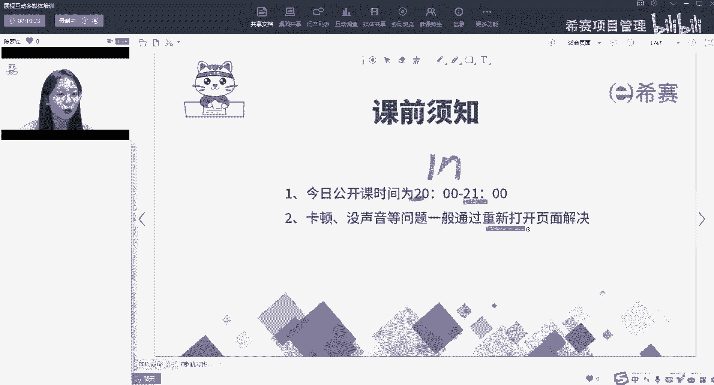

# 【重点推荐】2023年PMP项目管理职场晋级攻略系列公开课合集视频（附七月份+十月份公开课课件）！ - P5：01-NPDP考试介绍及开班典礼-01 - 希赛项目管理 - BV1Hu4y157zC

点钟了，那我们就正式开始今天的课程了啊，好今天的是我们一节公开课啊，这个公开课的时间是八点到九点啊，一个小时的时间好，那今天在座的各位有新同学也有老同学啊，这老同学都知道啊，新同学不知道。

我们再介绍一下啊，就说如果在这个整个直播课的过程中啊，我们遇到了卡顿或者没有声音的问题，一般呢可以通过重新打开页面解决。

或者说大家去切换一下线路，这是我们课前先了解一下，那今天的公开课的主题呢是哪一节，哪一个班的，是我们NPDP考前冲刺优想班的一个公开课，好主要是我们的刘伟老师啊，就这位很漂亮的麻辣女教师给大家上课。

那今天呢就欢迎一下，各位已经在冲刺优小班的开学典礼，和即将要在我们这个班的同学们了啊，好那我们首先呢先互相认识一下啊，先互相延迟一下，那有同学呢可能已经认识我了，有的同学呢可能是第一次见到我。

然后我呢叫佟湘玉啊，在西藏用的艺名叫做佟湘玉，然后本名叫做陈梦玉，诶，为什么会用老同香玉这个名字啊，因为我是一个陕西人，那佟湘玉呢他是比较典型的啊，这个陕西关中的代表人物。

所以我给自己起了个佟湘玉这个名字啊，他跟我的玉还挺押韵的，那大家呢如果说平常啊我去做大家助教，或者说加我的微信，都可以叫我香薰香玉老师或者佟掌柜啊，好那我呢会有一些以前的这些工作经验。

那目前呢是主要在西塞啊，从事这个课程建设和教学的工作，那主要是一个助教兼讲师的工作啊，讲师呢现在主要带的是各个直播班的习题课啊，都是由我来带的，那我授课的风格呢会比较活泼生动形象啊，思路比较清晰。

我希望呢大家后面可以跟我一起感受一下啊，好那我们首先第一个呢先来看一看啊，我们整节公开课的一个大纲是什么，那第一个呢，我先会跟大家做一个NTTP证书的介绍啊，只是刚才有同学问到了。

说NPTP到底是什么好啊，第一个他的介绍，第二个它能带给我们的一些相关的价值，这是第一个我们要了解的板块，第二个页面的板块呢，是关于NPDP考试的介绍啊，前面呢你一听价值啊，心花怒放，老师我想考这个试。

你给我再介绍一下考试啊，我就会给你介绍NPP考试，介绍它的一个趋势，他报考条件和考试安排，它题型和题量诶，和咱们这个PMT有什么不一样，以及说如果说想要考证啊，他考这种流程是什么样的。

那接下来呢会给大家介绍一下西塞冲刺优享班，介绍好，同学们可能没有听过这个直播班啊，这个直播班呢可能也比较少见啊，这个冲刺优享班他是说应对的是我们这一次啊，12月2号的考试，大家会发现啊。

今天是10月23号，距离12月2号的时间呢已经很短了，40几天，50几天啊，这个呢就是一专门用来冲刺考证的班级，所以我会介绍说我们的冲刺优选班啊，适合的人群，我们新赛课程的有什么样的优势。

以及啊今天会着重给大家介绍一下，如果大家进入到冲刺优选班之后，我会给大家安排的学习计划，咱们怎么学啊，是我们今天整堂课的内容分为三个部分，好那今天呢我了解到啊，大部分同学呢可能是想来领这个PDU。

PDH啊，今天是有的呃，什么时候发放呢，在课间休息的时候会给大家发放，如果说有后面进来的同学会问到这个问题啊，大家就帮我回答一下啊，课间的时候给大家发放啊，好，那我们首先第一个先来了解一下关于产品经理。

它的一个发展前景，那大家可以看到呢，这里是各地招聘产品经理的职位数量啊，数量还是比较多啊，尤其集中在北上广这些地区，那另外呢大家可以看到对于这个职位啊，它的增长速度是比较高的啊，一直在正增长。

这说明什么，说明其实产品经理这个岗位，它的需求量是非常大的，那如果说产品经理这个岗位啊，它的需求量很大，但是呢他的薪资呢很低，它的前景不太明朗啊，未来的增长潜力空间不大。

那我相信呢不会有越来越多的人想要去了解，这个产品经理，那相反呢我们所了解到的关于产品经理，这个岗位啊，它的起点呢其实并不是很高啊，起点是比较低的，另外呢他的薪资呢是比较可观的。

未来呢我们发展的潜力空间是比较大的，所以呢越来越多的人愿意在零基础的情况下，去了解我们产品经理啊，这样的一个岗位，第一个啊他需求量很大好，第二个嗯我今天了解了一下啊，在座的各位同学呢。

有很多同学啊都是已经考过p mp的，或者正在考的那PMP呢，就是我们俗称的项目经理，而NPPP就是我们俗称的产品经理，这里我们可以看到一个产品经理和项目经理，他们两个之间的岗位薪资代表好。

这里的数据呢量是非常大的，其实是能够为我们提供一定的，统计基础的依据啊，说到我们的产品经理呢，是19。6K的月平均工资，而项目经理是14。1K的月平均工资，好到这里，同学们，你先不要着急啊，先不要着急。

有同学就说了，说老师我现在就在做项目经理，我的工资为什么没有这么多，或者我现在做产品经理，我的工资为什么没有这么多啊，这里说的是一个平均工资啊，平均工资，那这个工资呢可能因为你现在所处的行业不同。

你所处的地区不同啊，有所涨价有所波动啊，都是有可能的，这里我们讨论一个平均工资，看到的就是其实产品经理呢比项目经理，他的月平均工资每个月可以多5K左右，那不要小瞧这5K啊。

这一个月5K1年下来好几万块钱是吧，所以说学习呢也能致富啊，书中自有黄金屋好，这是我们对一个对比岗位薪资的了解好，那我们接下来来正式了解一下，NPPP这个证书啊，那首先第一个mp DP它的全称是什么。

New product development professional，全称叫做产品经理国际资格认证，它是由美国PDMA协会发起的，嗯这里很重要，现在上面啊，国际上公认的唯一一个在产品开发这个层面的。

砖专业认证，嗯说明我们的含金量还是可以的啊，好在这里面我们学什么内容好，我们是学即理论方法和实践为议题的，关于产品经理或者产品开发，全方位的知识体系好，那有同学呢刚才听到啊。

前面这个产品经理和项目经理对比，还说哇老师唉，感觉这个产品经理很有前途啊，这个前打双引号说哎呀，我有点想转岗啊，或者换行业啊，想到产品经理这个行业，那我们首先啊你就是产品小白，那你第一步要干什么。

第一步肯定是先了解它的知识体系对吧，我们先要有理论，先了解相关的方法和实践啊，这是我们如果是产品小班，我们先要有这个知识体系，先要有这个知识框架啊，那如果说有同学呢，他本身就已经是产品竞争到了岗位了啊。

那可能会在日常的工作中会遇到一些问题啊，可能会遇到一些瓶颈，或者说知道某些方法，但是在实践过程中经常会碰墙，那这个时候怎么办呢，更多呢还是先学习一下这个全方知识体系，从他的战略开始到组合管理。

一直到产品开发流程，到他用到的工具，市场调研等等等等，全方位的用一个新的格局和视野，去看待这件事情好，这是关于我们NPPP啊，一个NPTP认证的介绍，那第二个呢就会讲到说NPDP它的一个价值好。

它价值呢我们总结为这三点啊，第一点呢说你个人解决问题的能力好，第二点说你想要晋升转型或者创业好，第三个点呢我们说你想要通过认证好，那今天呢在座的各位同学啊，如果说你来学习MDB你是会啊。

你是会想要去满足哪一个点，你觉得自己最关注的是哪一个点，几点送PDO，我们在课间休息的时候给大家送啊，可以扣一下这个序号就可以了啊，如果你来学习NPPP产品经理啊，你可能更加关注哪一个点。

啊我看到有同学说是啊，三有同学说二有同学说1+3，看来我们大部分同学，其实关注的还算比较务实啊，这个向前看是吧，要通过这个认证拿到这个证书是吧，好我们来一起一条一条看一下啊。

首先第一个个人解决问题的能力，和培养你的产品思维，就像我前面所说的，我们可能没有全方位的了解过这样的知识体系，那当我们去了解，去学习了一段时间之后，我们就会有相应的一个思维在这里。

那同样可以提升你自己在这个方面的，个人解决问题的能力，好以前我是项目经理啊，我做一个产品的时候，我只关注说这个产品我能不能把它做出来，也就是说我关注他研发能不能成功好。

现在呢我学了产品经理相关的知识之后，我可能会想得更多，我会想说嗯，为什么现在我们要做这个产品，这个产品能够满足客户的哪些需求，这产品做出来上市之后，他能否获得他的商业的成功，这就是把你的格局变得更大了。

有相应的产品思维这一方面，那另外一方面呢，是我看到同学们提到比较多的啊，我想要晋升，或者我想要赚钱啊，或者我想要进行创业，那当然了，我们都知道说创业它不是一件很简单的事情。

它需要我们全方位的啊去考虑这件事情，那比如说啊香玉老师呢会比较喜欢探店啊，比较喜欢探店啊，那有那么多美味的苍蝇馆子，这些苍蝇馆子他们为什么走不出来，不能成为连锁店呢，不能成为像海底捞这样的连锁店呢。

嗯这个呢其实就是有创业这一方面，我们可以引发的思考，那当然呢今天呢我先不给大家啊，给出这个问题的答案，我是希望大家思考一下，也希望在座各位同学啊，在学了我们的NPDP，1~7章的知识内容之后。

运用我们书上所讲到的知识，然后告诉我这个问题的答案，相遇呢是非常欢迎大家啊给到我答案之后，我也会给到大家相应的这个讲义啊，就我们留了一个问题在这好，那第三个呢就是通过认证啊，简单粗暴，有了这个证书啊。

有证磅书，那当然呢如果我们123都可以实现，那当然了，水涨船高啊，钱呢也就随之而来了，这是我们讲的NPDP的价值好，那我们分条分条来看啊，分条来看，那首先第一个呢在能力提升这部分前面，我们讲了。

说嗯啊这个产品经理这个薪资呢，他比我们项目经理薪资啊，平均要多5K多，到哪多到对你的能力要求是非常高的，他的要求会是这样的一个梯形的人才啊，他要求你在某一个方面有纵深，比如说在技术方面。

在设计方面有非常强的纵深，那么在知识层面上你要非常广，嗯那比如说啊你作为产品经理呢，你想要去开发一款新的产品啊，做这个产品的设计，但是你的设计师告诉你嗯这件事做不了，那这时候你要有相关的知识经验。

能和他battle这两项啊，这是第一个对于他能力模型，我们的要求是非常高的，要有纵深，知识面也比较广，当然这些内容呢，我们或多或少都在后面的课堂中会有学习到好，那第二个呢。

给大家展示的是我们腾讯产品经理的一个模型，我们可以了解一下啊，我们可以了解一下啊，那首先第一个呢在通用能力这个层面啊，这是我们必须要具备的一些基本的素养，那比如第一个方面啊，你要有一些学习的基本能力啊。

那在座的各位同学呢，我认为大家都有啊，因为大家都有通过这个PMP的考试啊，好第二个执行能力啊，这也是基本素质沟通能力啊，那毕竟产品经理他还是一个沟通，这样的相对来说比较多的一个岗位。

那我们还要有一定的沟通能力，有行业的融入感和主人翁的精神，那就说热爱你本身的这个行业，有一定的心态和情商，这是基本素质，我们在产品经理的课程中也会学到啊，相应的心态和情商这方面内容好。

那另外这个专业知识层面啊，这个呢就是我们在课堂中会学到的，相关的基础知识，相关的项目管理知识，相关的财务心理学，美学等等一些管理知识。

这是我们在课堂上都能够学到的，那当然呢还会要求说，你这个人要有一些专业的技能，比如说会产品的规划，专业设计，市场分析好这些专业技能啊，我们有一个相应的实操课程啊，有一个实操课会给大家进行讲解。

但是我想要说的是，今天我讲的这个冲刺优享班啊，他是不带这个实操课的，如果说有同学对于这个实操课感兴趣的话，可以找销售老师了解一下啊，这个是单独售卖的啊，这关于这个专业技能，那作为产品经理呢。

我们要两条腿走路啊，一方面呢要有自己的专业知识，另外一方面呢在专业技能上啊，也要去多多磨练好，那第最后一个层面呢，我们看到的是这个组织的影响力好，那组织影响力这个层面啊。

一般呢是公司高层他才会去考虑的啊，如果说各位啊在座的同学啊，想要做公司的高层，那大家呢可以看一下啊，从现在就开始啊，直接就培养一下，那首先第一个呢方法论的建设，我们可以在工作中呢主动帮助他人。

提升专业或者提供发展的机会，帮助他人学习或者进步好，第二个知识的传承啊，你要在工作中呢，你不断的去总结和提炼，形成一个普遍性的解决方案，能够给你后来的这些新人啊，有指示和示范性的一些应用好。

还有人才的培养，主动将自己掌握的一些知识信息资源，通过交流培训等形式的分享好，这三个方面呢，可以在平常多多去加强一下好，那这个呢我们就简单了解了一下关于腾讯啊。

产品经理模型的相关内容，那接下来我们来看到这个，晋升或者转型的这个层面，好，刚才呢其实有同学都有提到啊，说这个项目经理和产品经理是有区别的，那我想问一下今天在座的各位同学啊，大家觉得啊项目经理啊。

这个PMP和NPDP它的区别是什么，有没有同学了解过这个PP和NPPP，或者说你就凭自己的感觉啊，凭我刚才给大家介绍这么多的感觉，你觉得他们俩之间的区别是什么，好这个谭同学说一个规划一个执行很不错啊。

还有没有其他同学，人和物，人和物是怎么理解的，一个管结果，一个管过程，嗯谁管结果呢，产品经理管结果嗯非常棒啊，非常棒啊，我看了一下今天在座的各位同学啊，就通过我前面简简单单一个简短的介绍啊。

就有这么多的思考啊，说明大家都是这种学习能力非常强的啊，好其实大家可以通过这个图来看一下啊，我们的产品经理啊，NPTP就像大家所说的管结果，他最终呢管的是你这个产品，是否能够实现它商业上的成功。

而这个呃这个PMP呢，他只管说在这个过程中，我能不能把这个产品研发出来，把它开发成功，NBDP它管的更多啊，从最开始的来给目标，我要进行需求的挖掘分析，要进行产品的规划，而这个项目经理。

他可能只管这个过程中的开发和，测试和修正阶段，那这个产品开发完成之后呢，产品还要上市，会经历它的引入成长，成熟和衰退，那这个阶段也都是我们产品经理再去管，所以用一个通俗一点的举例跟大家讲一下啊。

就说嗯一个妈妈，一个母亲，如果她怀胎十个月啊，把这个小孩子生下来，生下来之后呢，可能要照顾她，说嗯小学中学，大学一直到他结婚生子可能才完成，而这个项目经理呢，可能就是其中的这个助产士这样的一个角色。

这样可以更容易地区分，那简单来说呢，其实就是我们的产品经理啊，他了解的知识，内容和管理的这个层面是比较多的，负责我们产品的商业成功，就是我们这些同学说的啊，管这样的结果，而这个项目经理呢。

他只关注这个过程的开发和测试修正阶段啊，只关注研发成功，其实呢通过这个图啊，可以侧面显示出，如果说后面我们来学习NPDP的课程，我们学到的内容是非常非常多的，不再是只专注这两个板块，我们专注的板块更多。

不光是这个新产品开发流程啊，从前端的需求一直到后端上市之后的产品管理，前面啊，关于你去如何开一个公司啊，他会讲到战略，讲到你这个公司的资源管理啊，组合管理等等啊，都会讲到好这个给大家拓展一下啊。

这是他们俩之间的不同，好那第三个呢通过认证啊，大家可以看到啊，这是某ping网站啊，某聘网站这里会讲到啊，如果说你去搜这个产品经理啊，他一定啊我我之前就有尝试过啊，你去这个上面，你去搜这个产品经理。

他第一个给你弹窗出来的这个界面呢，就是说你是否持有NPTP的证书，他会讲到说pp和NPDP证书优先，这个侧面说明啊，同等的这个竞争条件下，如果说你比别人持有这个证书，你就比别人的竞争优势更强一点。

那之前呢我也有了解过我的一些学员啊，我的一些相关学员呢，他们就说嗯之前呢是想要转岗啊，转到NPPP这样的一个岗位，但是呢呃呃查了相关的资料呢，结果发现呢，人家这个招聘需求都是需要有NPPP证书的。

所以呢他就在网上找找到了，我们心塞啊，学了这个政，学到了相关的课程，考到这个证书，最后拿到了自己心仪的岗位啊，这也是一件非常值得让人开心的事情，另外一个呢就是评职称啊，大家可以看到这里呢比较小啊。

就是项目管理，我们在这个产品经理呢，它是作为一种高级认证，高级认证好，这是关于NPDP的价值啊，就跟大家讲到这个了，相信大家心中都有所感触，好，那第二个呢，我们来讲一下关于NPDP的考试，的相关介绍啊。

这是大家想了解的吧，好那第一个呢关于NPDP的考试现状，这里讲了很多关于趋势的这个相关的分析，其实我想讲的就是嗯，我们可以和这个PMP同比对比一下，因为今天呢来p mp的同学比较多。

那偏僻呢在他引入中国第6年的时候，他的这个报考人数啊，考取证书的人数是没有超过2万的，但是同比NPPP，在引入了我们的中国6年之后，他的报考人数是有超过2万的，也就是说他会被越来越多的人所熟知啊。

就像我们现在这个TP的证书一样啊，这是第一个对他趋势的了解好，第二个我们来看一下它的考试趋势，那其实呢PNPDP呢，中间呢有一次啊是考到特别特别难啊，这个2019年11月考的非常非常难。

那一次考试呢通过率不是特别特别高，但是后面他们基金会发现这个问题之后，进行了相关的一些调整，那现在呢相对来说，他考试的难度都是会有所下降，而前面呢前一次考试啊，啊，这个2022年11月。

和2023年5月份的考试，都是用的是我们的新版教材啊，也就是说大家不要紧张啊，我知道pp有同学可能会紧张，因为有几次考试啊，我了解到有几次考试换了这个教材之后，突然难度一下增加了。

但是呢我们的NPTP平稳的考过了两次之后啊，难度都没有再增加，只是增加了一些新油的知识点啊，这一点是大家可以放心的好，那我们接下来来看一下，关于NPDP的题型和题量的概述，那它呢和这个偏僻不太一样啊。

它没有这个不计分的这个题目，它一共是200道单项选择题啊，注意每一道题是一分，所以满分应该是200分，那多少通过考试呢，正确率呢是75%，也就是说200分乘以75%，等于150分，当同学们啊。

正确答案达到了150分，以及150分以上，就算你通过考试，那他有没有这个类似于pp的这种3A呢，啊没有，但是呢它会有一个标准，就说我们一般认为，同学们如果考到180分以上啊，就同比这个PMP的3A啊。

都是我们的优秀学员，这第一个对于他考试的这个题型和题量的了解，它的时间呢是3。5个小时啊，跑去答题卡的半个小时，每道题的时间呢是非常少的，非常少，这时候我们要了解一下啊，又是题海好，再来看这个难度啊。

那接下来肯定就有同学关心了，说老师这个75%才通过，那我就会关心说哎呀这个难度会不会特别高，那首先第一个我想请同学们放心啊，难度不是特别高，往年每一次考试，我们西塞NPPP的通过率，都在90%以上啊。

甚至我之前有两个班级，这两个班级的通过率是百分之百啊，在这里小小骄傲一下啊，啊所以从侧面说明啊，其实难度并不是特别大，你看啊像这种记忆性啊，这个记忆型比较少，可能占35%和理解性占50%。

这两种类型的题目达到了85%，也就是说有少部分难的啊，比较分分析题啊，比较难的这个题，但是呢我们只要达到75%就能通过，所以只要掌握记忆和理解性的题目，通过呢是没有太大问题的。

好这是我们对于题型题量给大家的一个概述，好那这里呢会看一下这个NPDP的样题啊，和我们的PMP呢是有类似的地方啊，它是一个这个来自于海外的考试，所以它的这个题目呢也都是中英混考啊，上面是英文。

下面是中文的翻译，他的考试呢那个卷子厚厚的像一本书一样啊，200道单项选择题啊，是这样的，相对来说呢它的题干啊对比pp是比较少的，简单的知识定位就能够把题目做出来，好这是我们NPPP样题的一个了解。

几点到课件，马上啊，稍等啊，好那接下来我来给大家介绍一下，就是关于NPDP里面我们会学到什么内容，我们简单了解一下吧，好，首先呢，第一个我们会学到关于新产品开发的战略，好，讲到战略呢其实是一个很大的词。

可能同学第一次没有接触过啊，我们就想一想啊，战略呢它其实是从了一个大的格局这个层面啊，他会讲说你这个公司你整体的业务方向好，大家有没有曾经想过呢，就说这个小米啊，他的这个手机价格这么低。

而苹果它的手机价格这么高，他们两个到底是呢怎么样能够去获取利润，他们两个其实采用的是不同的战略啊，不同的方向好，你的业务方向啊，你的业务目标，整体的业务目标，你在这个过程中可能用到的一些创新战略。

比如说成本领先呀，比如说差异化，你是想要做这个探索者呢，还是想要做这样的跟随者呢等等等等，这都是我们在站里面学到的，我觉得它是一个很大的这样的内容，这是对于创业非常有帮助的部分，好第二个会讲到组合管理。

那组合管理它讲的是一个公司，它的资源是有限的啊，资源并不是无限的，那么如何在有限的资源里面实现价值最大化，对我们的产品组合进行分类进行配比，这个呢是组合管理里面，他会讲到很重要的一个内容啊。

资源的配置好，那第三章呢新产品流程啊，他会介绍到我们几种常见的产品开发的流程，比如说门禁啊，比如说IPD集成产品开发，比如说精益，还有现在比较火的经营创业，比如说敏捷户口流程等等等等，他都会介绍。

也会介绍每个流程的优缺点和，使用过程中应该怎么样去使用，另外他们应该是适用于哪种业务，都会接收到，那第四章产品设计和开发，他会讲到说你一个产品从创意开始，一直到啊变成可制造，可生产的这个产品过程中。

你都会用到哪一些的开发工具啊，讲到很多很实用的工具，是大家在实践生活中可以去运用到的好，第五章讲市场研究，那市场研究呢会讲到几大类市场研究的区分，以及说你做从0~1的这个过程中，每一个过程。

你应该去采用什么样的市场研究方法好，这些方法里面他们有什么优点，有什么缺点，有什么样的注意事项，应该怎么样去使用，也会给大家介绍到好，那第六章呢就会讲到文化组织和团队，他会讲到说一个公司里面。

不同层级的高级管理者，他们所管理的内容是什么，普通管理者所管理的内容是什么，以及团队啊，团队怎么去管理，以及你作为团队的领导，你讲领导力，讲情商这一部分，这是我们文化组织和团队都会讲到的。

最后一章呢讲产品创新管理啊，会讲到你的产品上市之后，你的整个产品的生命周期，每一个阶段特征和每个阶段的营销4P，我们应该怎么去管理，大家听完我的介绍，会觉得嗯确实我们的NPPP啊。

学的内容是会比较多一点的啊，好，那我们接下来看一下关于报考条件和报考安排，那这个呢其实就是咨询一下我们的消费老师，就可以，因为呃既然能够报考p mp，我相信对于NPDP有一定的，这个可以报考的能力啊。

好这个我就不多说了啊，好那我们接下来来看一下这个考试的安排，好这一次考试呢最近的一次考试是下半年，2023年的12月2号啊，12月2号考试的时间是九点到12：30，总共3。5小时，好。

我们讲这个冲刺优享班啊，就是从10月23号开始备考，12月2号的考试啊，这里要注意一下啊，特别注意我给大家强调了啊，好，那我们最后再来了解一下关于这个考证的流程。

那整个流程呢就是我们首先第一个参加培训啊，学习完相关的知识内容，第二个呢填写中文的报名资料好，我要提醒一下在座各位同学们啊，如果说大家想冲一把，拿到NPDP这个证书的话，现在我们就正在报名。

这个报名的截止时间是11月10号啊，这里一定要注意啊，尽早开始学习好，那审核通过之后就交费，交费完之后，我们会在考前一周可以打印准考证嗯，准考证上面会有我们考试的这个地点，那到了12月2号啊。

上午的九点按照这个地点，按照这个时间准时去参加考试，那一般呢4~6周就可以知道成绩好，知道成绩之后呢，一个月左右啊，可以拿到我们的电子证书好，纸质版的证书可能等的稍微有一点久啊。

半年左右能够拿到纸质版的证书好，那这个呢是我们一整个考证的流程好，那讲了这么多呢啊我看大家都想休息一下啊，那我们就课间休息10分钟啊。

