# 【重点推荐】2023年PMP项目管理职场晋级攻略系列公开课合集视频（附七月份+十月份公开课课件）！ - P6：02-NPDP考试介绍及开班典礼-02 - 希赛项目管理 - BV1Hu4y157zC

嗯欢迎大家回来啊，我们就继续了啊，如果说待会儿呢有同学讲到，说自己没有积攒这个PDU嗯，麻烦同学们帮我跟他讲一下啊。

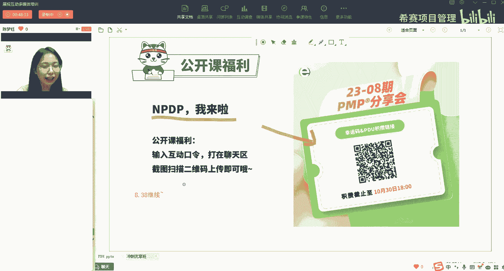

说课后呢再给他把大家把这个东西放出来，再继续积攒啊，好，那我接下来就为大家介绍到我们西塞的，NPDP冲刺优享班的介绍了。

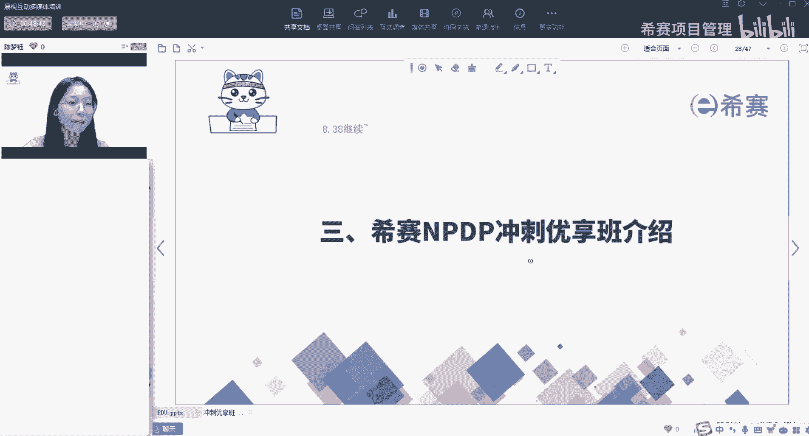

好，那首先第一个呢，是我们这个课程适合什么样的人群呢，那首先第一个我标红啊，就是我自己个人认为啊，这个课程非常适合一些，想短时间快速拿证的同学啊，他是非常适合的，因为现在10月23。

距离这个12月2号考试啊，它时间比较短了，40几天的时间可以帮助你快速拿到这个证书，好，第二个呢，你一定你自己呢本身已经有了说理论基础，但是说思路还不太清晰，重点不知道在哪里诶，这个呢我们的串讲直播课。

能够帮助你很好地解决这个问题，好你想要拿180家，但是呢又没有系统的方法，只能自问自答，或者说你对于考法解法不了解，一做题就不会，那这个呢我们在串讲课堂上也都会讲到好，你如果说你是其他的同学啊。

已经报考了，但是说不知道如何备战，这最后30天，那这个课程呢也是非常适合你的好。

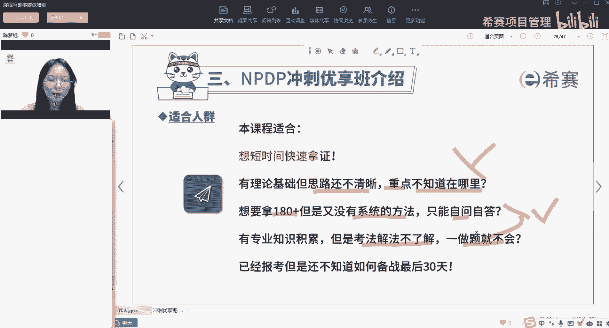

这是第一个适合人群的介绍，那第二个呢我们就来了解一下，关于我们NPDP冲刺优享班，他有什么样的课程优势呢，它会采用一种牵引式的学习，那首先第一个呢是强指导，在这个班上呢大家都以高分为目标。

我们都是精准答疑，那当然会包含说第一个课上讲师指导，我们的串讲课，会设置答疑的环节，老师专门给大家答疑，那课外呢助教指导嗯，我们有我们的步惊云和我啊，作为助教老师，给大家随时随地啊全天候的指导。

那报名呢，班主任指导用的阿壮老师来给大家报名，好，这里我再提一句，同学们11月10号就截止报名了，还没报名的同学赶紧赶紧找阿壮同学报名了啊，我们这个报名要趁早啊，好那强度学强都学。

这里讲的是我们这个班啊，时间本来就很紧张，所以对于这个督学情况，我们肯定是日督学，并且是一种诊断式的服务，作为助教老师呢经常会查看大家的学习情况啊，如果说你的学习情况不对劲，直接出警入学。

现在呢我们都是直接啊call大家夺命连环call啊，让大家来进行相关的学习，毕竟时间很紧张嘛，好那常规化即学家吉列啊，就是你根据我们每日的学习任务进行学习，我们会根据这个任务给你规划每天的做题练。

帮你梳理知识点，总结来说就是三强啊，强指导，强度学和强规划。

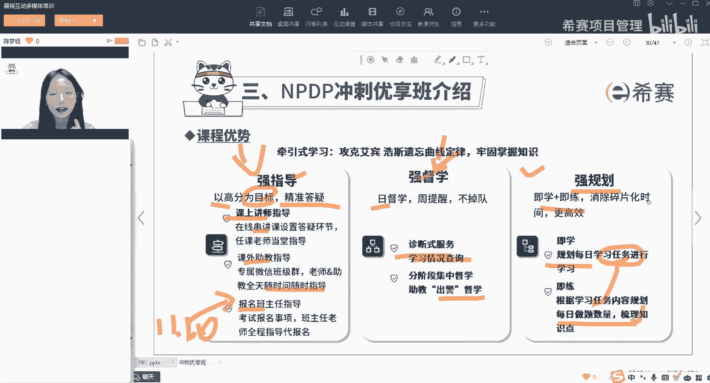

这是我们的第一个课程优势好，第二个在这个西塞NPTP的冲刺优享班，你都能够得到什么样的服务，那首先第一个是你的学习规划，我们会有这个助教老师啊，为每一个冲刺备考的学员，制定一个定制的学习计划。

我们会了解说你每天的学习时长有多长，你本身的学习基础到底怎么样，然后告诉你说这个过程中怎么样去学习啊，你专属的学习计划来提升你的效率，当然呢严格督学这个过程中呢，我们会在群内啊发每天的知识点。

加问题的一个问候，后台呢随时掌握大家情况，那当然了，我们也是希望大家可以每日打卡啊，在学习群内每日打卡，巩固碎片化时间啊，养成大家这个竞争的一个这样的感觉啊，好这是我们严格督学。

并且呢考前呢相关来说还会有一些疏导，那班群答疑呢是有多多位名师啊，包括我们的大家比较熟悉的这个罗老师啊，我们的刘老师啊，陈老师啊等等等等啊，都在这个群内，以及我们的助教都在群内，随时准备为大家答疑解惑。

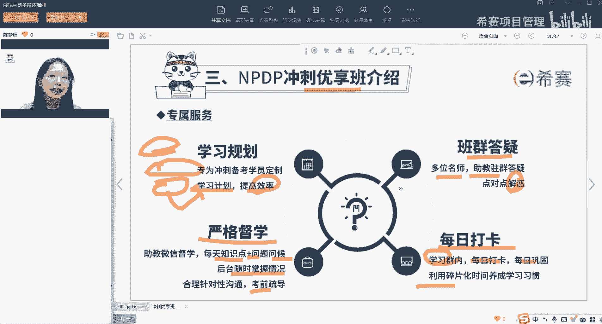

这是第一个大家能享受到的专享服务，好第二个我们就来了解一下关于西藏的平台啊，这个学过pp的同学非常了解，但我还是简单介绍一下啊，就是我们的平台呢分为电脑端和手机端，比如说你可以在电脑面前学习。

手机呢也可以随时随地学习，你可以合理安排你的学习时间。

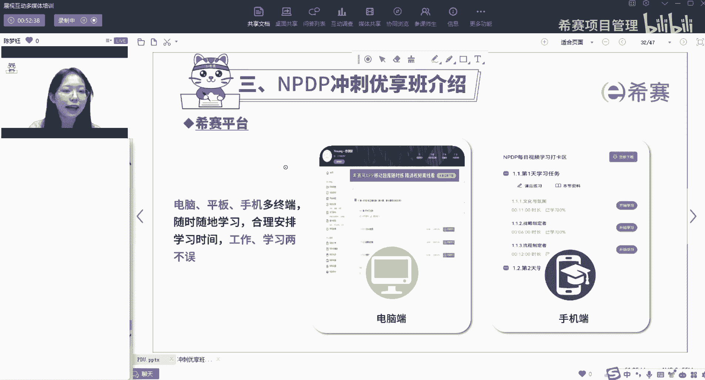

工作学习两不误，第一个是我们的两个端口啊，非常强大的一个平台，第二个呢就是我们的题库，那我们的总题库啊，就是NPDP的总题库是1800多道题啊，1800多道题，但它涵盖了不同的模式，比如说每日练习。

比如说章节练习，比如说模拟练习题都是有的好，这里我首先我想提醒一下同学们啊，就是我们的NPDP和PMP，不太一样的一个点，就是我们会更加关注大家在这个过程中的，知识点练习的这个栏目啊，并不是模拟试卷啊。

我们会建议大家说优先完成这个知识点练习，然后再去完成模拟试卷啊，这是做题的一个顺序的区分，那另外呢线下的题库是非常强大的啊，有人呢就是说想单独去购买，我们西塞的这个题库啊，从侧面反映出来啊。

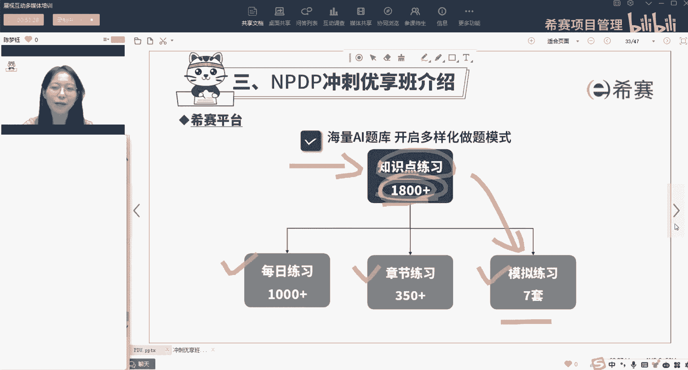

我们的题库很强大，好还有就是我们的西塞的平台，那我们可以在线的查看我们的测试机记录，即使你中断了也能够继续，还会有针对你个人的智能评估报告，查看你的薄弱点来针对性的补缺，那这当然了。

我们助教老师在后台看到的更多，也会针对性的给你更多的建议，那有问题呢可以及时反馈，这个说的是我们的平台答疑好。

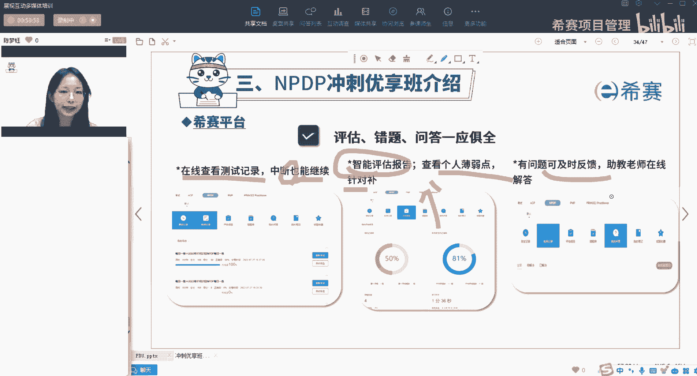

我们的评估错题问答，在平台上面是一应俱全的好，那接下来会有师资的介绍，那大家呢在这个过程中会接触到两位啊名师，首先第一位名声呢是我们的罗复兴罗老师，那我相信大家对罗老师啊都不陌生啊，他有很多外号啊。

人称罗帅，罗叔啊，这个等等等等很多外号，他呢是我们NPDP的认证讲师，高级项目经理，NPDPPMPACP信息系统，项目管理师啊等等等等，是中南大学的MBA的校外导师啊。

我们的罗老师呢有非常强的项目管理的经验，并且服务了很多很多客户啊。

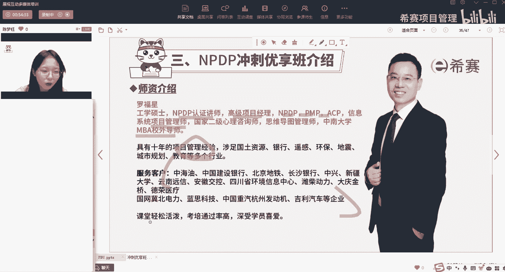

课堂呢轻松活泼，考培通过率高啊，相信大家对它都不陌生啊，在座的应该今天有罗老师的粉丝吧，好那第二位呢，我给大家介绍的是我们的西塞龙葵刘威老师好，这个刘伟老师呢，会负责后面我们这个冲刺班的串讲的课程啊。

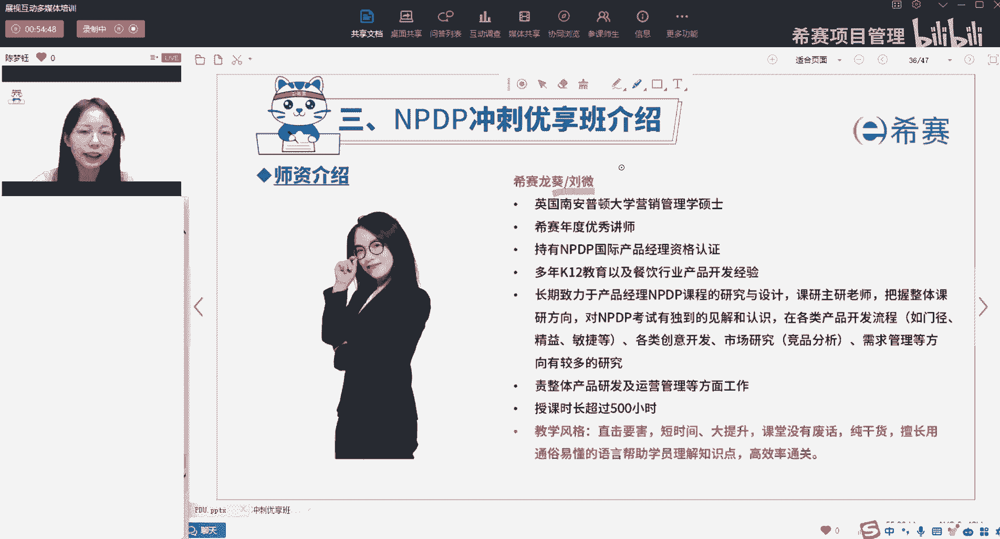

他负责我们的串讲课程，而罗老师呢是我们看到的认证的视频课程啊。

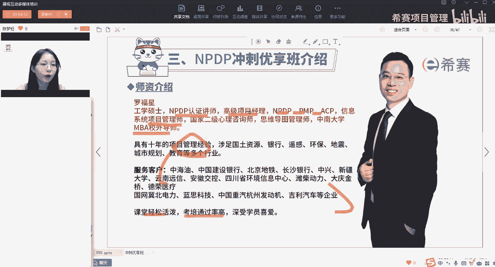

只是他们两个教的这个课不太一样，少一个好，有的有的啊，我们看到是罗老师的这个视频课程啊。

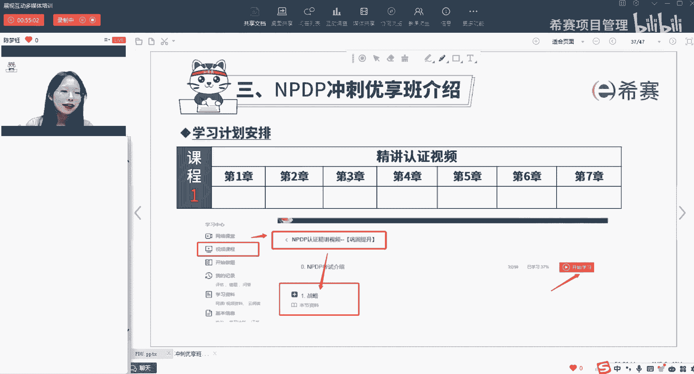

好那我们介绍一下我们的龙葵老师吧，好，我们的龙葵老师是英国南安普顿大学的，营销管理学硕士，是我们现在的年度优秀讲师，有多年的K12以及餐饮行业产品开发经验啊，前面呢了解到了很多同学都想创业。

那我们的龙葵老师呢，或者叫我们的刘伟老师啊，他有非常丰富的创业经验，他现在呢在餐饮行业啊，还有自己的这个相关的产品，并且呢这个产品是挺过了这疫情3年啊，一直在持续的盈利过程中。

如果说大家有想关于这个创业想法的，可以欢迎我们的龙葵和刘伟老师探讨啊，他就在我们的微信群里啊，大家去加他就可以了啊，好他呢长期致力于我们产品经理NPPP的课程，研究和设计，有非常独到的见解和认识。

比如说这个产品开发流程，创意开发，市场研究，需求管理方面啊，都有很多的研究，哪授课风格呢直击要害，短时间大提升课堂没有废话，大家在我们的串讲课啊，可以感受到他的课程好。

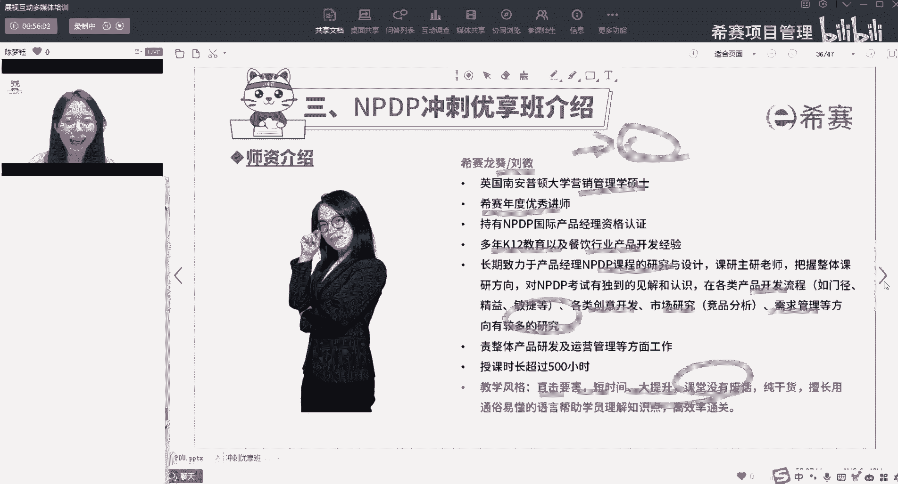

这是我们的刘伟老师好，那接下来我就隆重啊，隆重给大家介绍我们NPPP冲刺优选班，学习计划的安排啊，大家听好了听好了好，那首先第一个呢我们先了解一下啊，就是我们的这个直播课叫做冲刺串讲课。

它是什么时候开始呢，是11月7号开始好，我们什么时候正式考试，是12月2号，这两个时间点是我们要明确的好，那从今天开始啊，就从今天啊10月23号开始，同学们我们的任务是什么，首先第一个啊。

我们可以看到的是这个金奖认证的视频，好这里我给大家打了一下这个视频路径啊，给大家专门截图了，因为我怕大家找不到啊，我在这个课堂上就跟大家讲了，那当然同步也有手机端，手机端。

可能网络端的这个进入口差不多啊，好我们首先第一个在个人的中心啊，点击视频课程好，在视频这里可以看到一个NPDP认证精讲视频好，他第一节课呢是这个考试介绍啊，就是今天的这个课程。

那后面呢都是按照这个章节分布的，我们首先会学到第一章的战略好，那总体的NPDP啊，总共是七个章节，所以我希望大家在11月7号之前，先把1~7章的认证精讲视频全部打卡完成好，这个是有相关的一些学习计划的。

当你完成你可以在下面打对勾啊，这是会给到大家，大家打印出来可以贴在你这哪里啊，去打对勾的嗯，有同学可能就会觉得说老师啊，这个视频课程会不会太长了啊，我把这个东西全部完成啊，有点难度有点难度啊。

我要跟大家强调一下，这个视频课程其实并不是特别多啊，37个小时，总时长只有30几个小时，合理安排是可以完成的，好这是我们第一步要做的啊，第1~7章的精讲认证视频啊，全部打卡完成。

最好是在11月7号之前好。

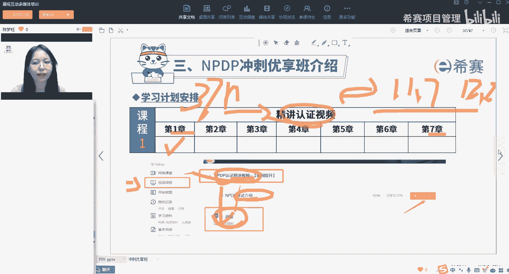

那第二个呢就讲到了我们的章节知识点练习好，他怎么去找呢，好还是一样的，点击个人中心之后会有一个开始做题，在开始做题里面找到这个知识点的评估，好这个知识点评估呢分为1~7章，还是一样的，从第一章开始做好。

这个要注意一下，我在前面给大家强调了，不要着急啊，不要着急，不要做章节练习，不要做每日一练，也不要先去做这样的模拟试卷，先做知识点评估的题目啊，先做知识点评估的题目，好这一块的题目呢稍微来说啊比较多。

大家我的建议呢就是前面啊，咱们这个认证的这个精讲视频，先看完第一章看完之后呢，抽时间把第一章的题目全做了好，再看第二章，看完第二章之后，再把第二章的这个题目抽时间去做了，好，这是我们第二步啊。

听清楚了啊。

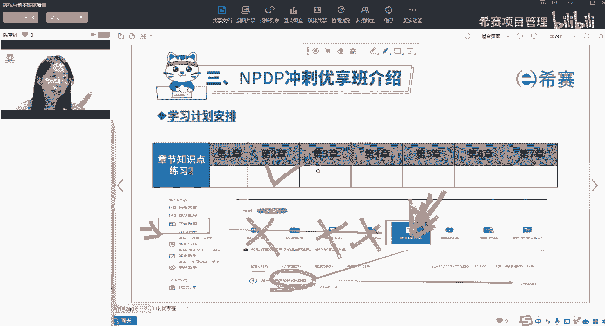

先看视频再做题好，那接下来呢就会讲到，说我们的一些会给大家的纸质资料啊，会有这个我们的一个讲义，会有一个备考知识点集锦啊，他长啥样，他长这样，这个是PMP的啊，这个是PMP的，NPDP的。

就是这里的名称不太一样，但是就是这样的一个很小的这个小册集，还有一个模拟题及啊，我们的三个纸质资料给到大家，那另外呢我们有这个模考试卷啊，当然有有B座12345678好，其实总体来说就只有七套。

因为有一套是关于这个词汇的，那在这个B座里面，我建议大家做题的这个顺序，应该是优先做二四和六好，我划重点了啊，246，但是你去做它的时候。

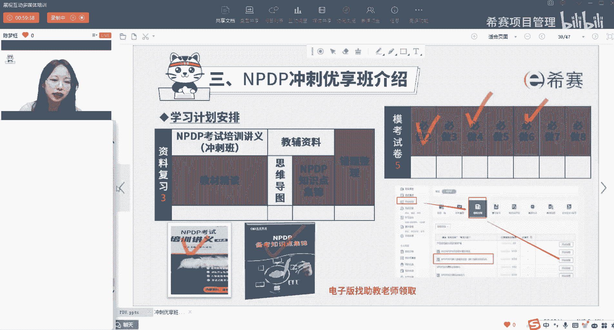

一定是我们先把这个知识点评估啊，和前面的这个视频课程全部学习完了。

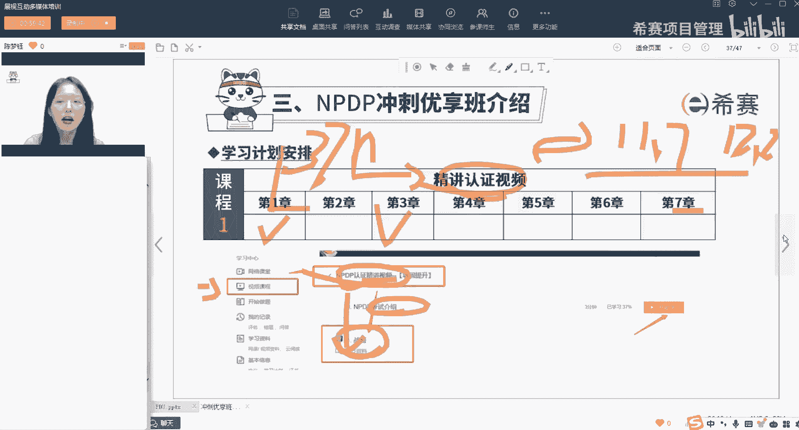

再去做这个模拟卷，最好是全部翻一遍，那么相关的其他的一些，比如说我们的教材呀等等一些讲义资料呢，都有电子版，直接找助教老师领取啊，助教老师不均匀，老师啊直接找他领取好。

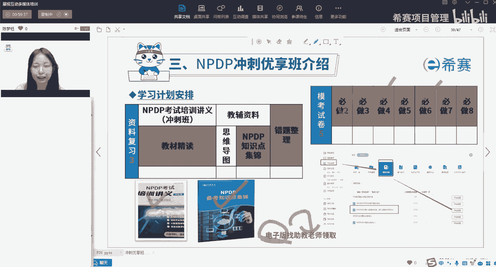

那接下来就到了我们这个直播课啊，串讲课是11月7号开始第一节课，那串讲课呢和前面的这个视频课，它不在一个栏目啊，我们注意看它是首先第一个，你在个人的学习中心点进网络课程好。

看到NPDP冲刺优享班在线课程，考前冲刺好，串讲课，11月7号晚上的七点到十点，刘威老师这里呢到时间了会有一个开正在直播，大家点进去就可以了，那串讲课呢总共是四节课，这里我对大家的要求是在上串讲课之前。

相应的章节的内容是必须必须要完成的好，那串讲课完了之后呢，会有一个模考讲解，那这个模考讲解呢讲解的是我们的必做六，第六套卷子，所以在模考讲解啊，学习之前啊，这个直播课开始之前先去把B做六全部做完好。

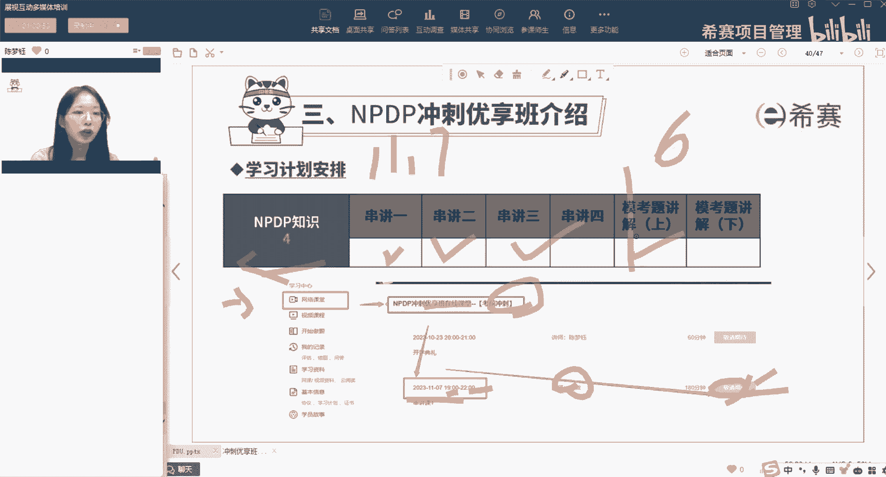

这是我们整体的一个学习计划安排，讲到这儿啊，应该是讲的很明确的，步骤在哪啊，这个视频课在哪看，都给大家讲到了，这里就给大家一点小小的学习建议的宾主，我们在整个冲刺的过程中要做好五件事啊。

第一件事首先呢要看完这个认证视频啊，就前面给大家讲到1~7章，我们的罗帅啊，罗叔叔讲的好，第二个知识点练习和模拟卷必须都刷完，尤其是知识点练习1~7章必须刷完，我们一般的强调呢。

都是说大家刷两到三遍是最好的，这个呢要看大家自己的时间来啊，好那把书看一遍，小册子看一遍啊，就是我们会给大家发的那个冲刺讲义，以及这个小册子啊，大家一定要看这小册子。

我都建议大家在这个冲刺期间呢随身携带啊，每天呢翻开看一看，今天学第一章，明天学第二章，后天学第三章啊，要反复的去记忆是最好的好，第四个我们的串讲直播视频课啊，必须要看完好，那你在做题过程中呢。

肯定会有相关的一些错题嘛，错题框多刷不懂就问啊，我现在同学们对我们的平台都非常熟悉啊，有一个后台提问的按钮啊，疯狂问疯狂问啊，可以在平台提问。

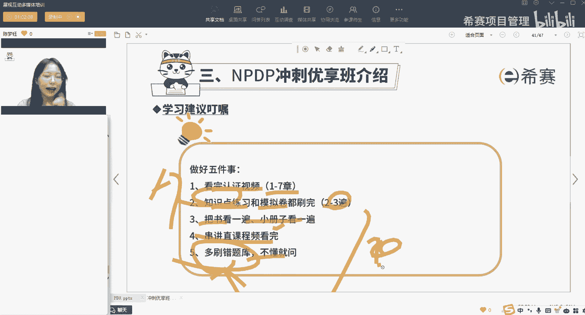

也可以在班群问啊，也可以私聊助教老师啊，都是欢迎的这三种方式好，那我们接下来来看一下，讲完了整体的学习计划啊，大家心中有数了啊，再来看一下我们的管家式服务，那目前呢我们的冲刺班呢，助教是我们的徐老师啊。

就这位小帅哥嗯啊，徐老师呢会负责大家的每日督学学习，答疑和学习内容不清楚等等问题，而我们的班主任是阿芳老师，负责大家的报名号，再次强调啊，11月10号就截止了。

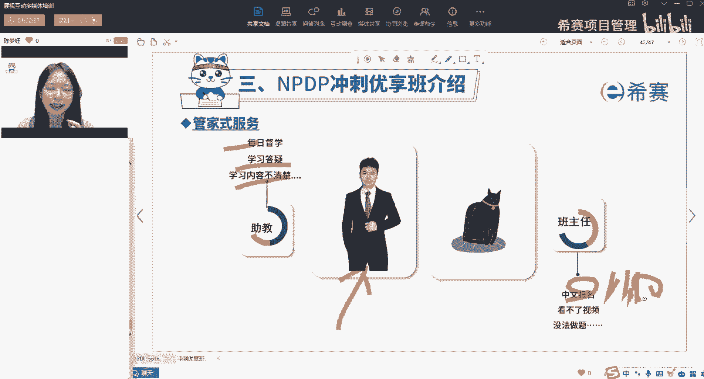

赶紧报名啊，赶紧报名好，那配备的是自己教务人员，阿壮呢是报名好，助教呢，由我和步惊云老师都负责具体的NPVP视频，那这个冲刺有想班呢，我也在群里啊，我在群里大家有问题也可以艾特，我直接来回答。

那老师呢有我们的罗帅和龙葵，老师也负责具体的NPPP视频，好这里呢有一条消息啊，就是工作日啊，一般呢我们的工作日指的是周一到周五啊，晚上六点之后我们就下班了，可能问题回复不太及时啊。

所以大家可以艾特值班小哥哥。

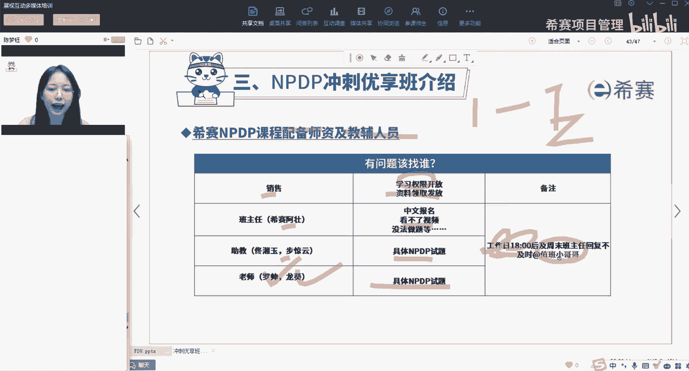

或者在后面的平台提问都是可以的，好那这个呢是我们的课后提问啊，前面讲到了，你可以在班级群啊，我们群里直接艾特我们的助教老师，步惊云或者佟湘玉啊，直接提问，或者说在我们的平台上做完每道题目之后，查看解析。

按提问按钮提问，那这里呢我们是24小时内，必答案都是会安排值班老师的，尤其是周末啊，周末呢可能这个助教老师都下班了，那你可能在群里或者私聊这个提问呢啊，不能及时的回应大家。

这时候就推荐大家最好在平台提问。

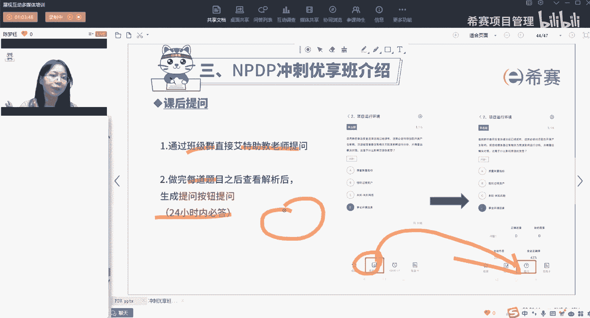

因为我们有值班老师给大家值班嘛，及时的回答下大家问题好，那我们接下来再讲一下啊，就是关于这个NPDP的资料总表，大家也可以核对一下，和自己拿到的资料一样吗，好首先第一个是精讲的这个讲义啊。

会有一个NPDP培训的冲刺讲义好，第二个呢嗯NPPP知识点仅仅就这一小本书，还有呢就是一个模拟题及好，这里我要讲一下啊，模拟题及啊，它其实就是我们线上的B座二和B座六啊，给大家做成线下的了啊。

这个纸质版了，为什么给大家做纸质版，因为我们考试是线下考试啊，考试线下考试就为的是，大家在考前呢可以去模拟一下这个掐个表是吧，搞这个210分钟，然后看自己能做多少道题目去模拟一下好。

这里呢有一个推荐阅读书，好，这里要注意这个是推荐阅读，不是给大家寄送的资料啊，新产品的开发流程，如何备考NPTP以及学习和知识体系指南，那还会有一些音频资料，嗯这个音频啊，喜马拉雅西塞MPDP。

上面会有罗帅老师的音频，这个是我特别推荐大家去听的啊，平常呢就磨一磨耳朵，毕竟我们时间很紧张啊，多去听啊，好那视频课呢NPTP考试的认证课程，直播课呢是冲刺串讲直播课，这个是罗老师给大家上。

这个是龙葵老师给大家上，那题库资源呢，其实刚才多多少都有讲了我们的知识点练习，那章节习题以及我们的成套模拟题啊，都会给到大家这资料的总表，那我们还会有一些电子版的资料啊，比如说这个思维导图啊。

纸质版的讲义啊等等，这些内容大家都可以私聊。

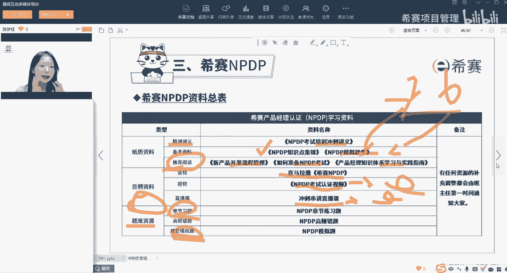

我们的助教老师，不仅仅去领取这些资料好，那这个呢是我们NPDP，使用产品开发和管理的工具，这个是我特意给大家放出的，大家可以简单的看一下，就说在第四章啊，这个整指的是第四章这个章节啊。

和其他章节我们都会学到什么样的工具，你看啊，创意的工具奔驰法呀，碰到风暴啊，战略规划的工具pet分析，所有的分析，商业化部竞品分析的工具，用户画像质量屋，用户故事地图概念生成的工具，概念工程卡通分析。

形态模型，项目管理，市场研究工具，消费者监测组啊，产品测试等等工具，那这个呢还是展示的其中一角，当然实际上我们学习到的内容更多，如果大家说想要更加详细的学习，我是推荐大家可以去了解一下我们的直播课。

因为学到的内容是更多，也给大家配有实操课程啊。

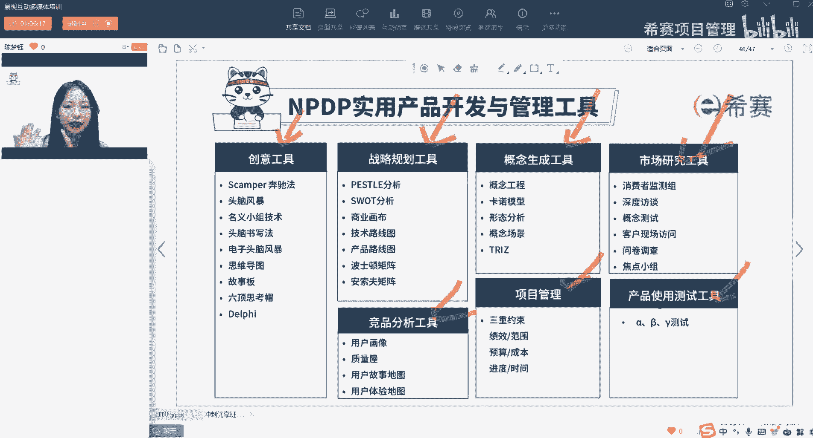

补齐我们的专业技能这方面好，那我们今天呢关于这个冲刺优选班的开学典礼，就到这结束啊，完结撒花，完结撒花好，那如果说有同学有问题的话，可以在聊天区提问，没有问题的同学可以先下课了，然后我给大家展示一下。

我们这个PDU和PDH的机载嗯。

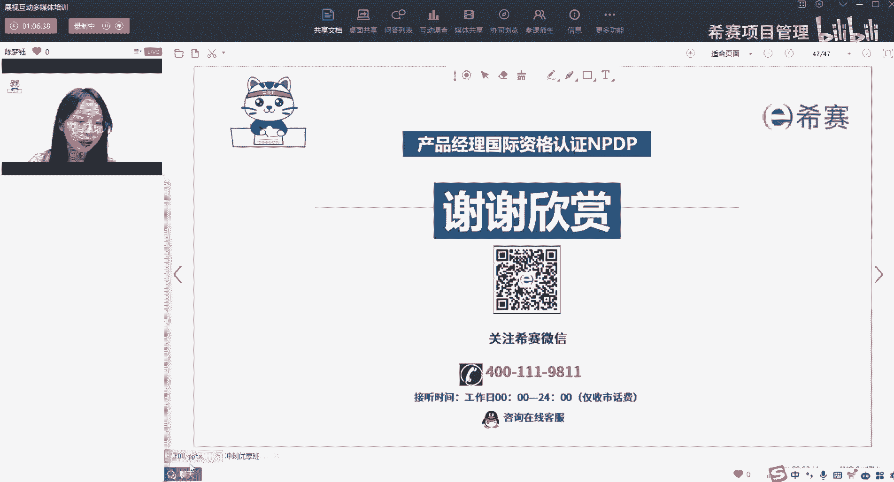

今天PDU和PH积攒呢是在聊天框输入NPTP，我来了，然后截图直接上传就可以了，好谢谢孙辉啊，好今天课程到这就下课了啊，如果说有问题的话。

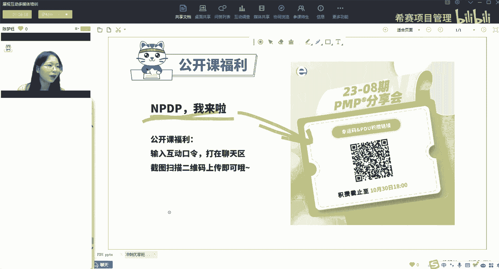