# 【重点推荐】2023年PMP项目管理职场晋级攻略系列公开课合集视频（附七月份+十月份公开课课件）！ - P8：PMP职场晋级攻略-竞品分析-宏观-01 - 希赛项目管理 - BV1Hu4y157zC

好那我们就正式开始今天的课程，大家好，欢迎来到西塞网专业的职业教育平台，我是湘玉好，那我们今天公开课的时间呢，是八点到09：30的这个时间啊，也就是1。5小时的时间，那如果在直播课的过程中呢。

大家遇到了卡顿或者没有声音等问题啊，大家可以通过重新打开页面解决，如果重新打开页面还是没有解决，你可以切换一下线路，在这里呢我也拜托一下，我们现在刚来的这些小伙伴们啊，刚跟大家也混了个脸熟。

后面要是有同学啊，他进来之后呢，他说老师你卡了，或者老师你没声音，但是你听到我是正常的话啊，麻烦如果我没有看到啊，就麻烦大家帮我在聊天区告诉一下，这个同学说重新打开或者切换线路就好了啊。

好谢谢各位同学了啊，我先在此谢过大家了啊。

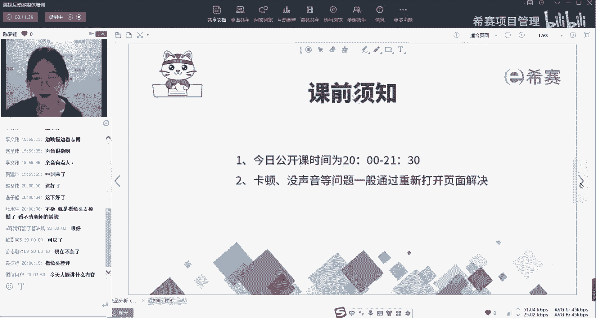

好那我们今天啊哎微信用户问的非常好哈，说今天讲什么课，今天讲产品经理的一门公开课，叫做竞品分析的，这个公开课，大致内容呢是会讲到竞品分析，宏观的这样的一个层面啊，这是我们今天的课程内容。

好讲课程内容呢很多同学啊，刚才有很多同学说没有见过我。

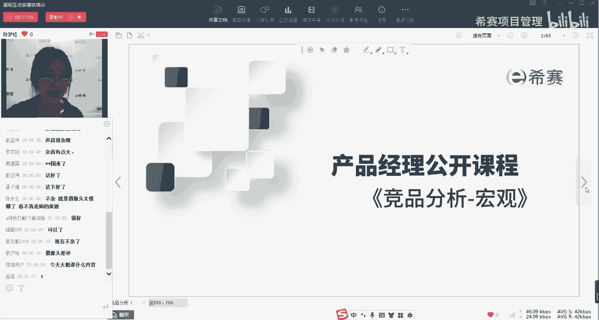

那我也自我介绍一下吧，好我的本名叫做陈梦玉啊，是大家在海报上看到的那个名字叫做陈梦玉，那么大家都知道啊，我们现在每个人都有这个艺名啊，每个人都有这个艺名，那我的艺名呢叫做佟湘玉啊，这艺名怎么来的呢。

因为我是陕西人哈哈因为我是陕西人，叫佟湘玉，那我的同学们喜欢叫我什么，叫我相遇或者叫我佟掌柜啊，这两个称号我都是接受的啊，今天呢大家都知道了啊，以后见到我就叫我相遇啊，好那后面呢都是一些我的工作经验。

那目前呢我是在NPDP啊，大家没有见过我，是因为我是目前在NPDP这个方向啊，主要在NPDP做一个助教兼讲师的一个工作，那么讲师的工作呢，主要是在讲直播课的这个习题课的课程啊。

直播课的习题课课程偶尔会串一下，偶尔会客串一下公开课啊，就是开学典礼，或者说这样的今天的竞品分析的公开课啊，是大家可以见到我，那我本人的授课风格啊，大家应该能感受到吧，比较活泼生动形象啊，我比较开朗啊。

然后善于联系生活实际啊，接下来待会呢大家跟我一起也来感受感受啊，这是我啊，介绍一下我自己好，那今天呢有同学会问说几点发PDU啊，pd u是中间休息的时间，会给大家发1。5个小时，差不多啊。

差不多中间的这个时间休息的时候，我会给大家发PDO和这个抽奖码，发PDO和抽奖码，大家要注意啊，今天如果你觉得啊有对你有帮助的地方。

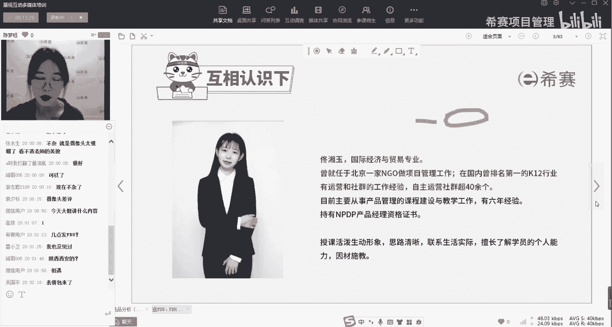

你可以截一张课程内容的截图啊，好好嘞好，那我们既然说这节课啊，讲的是产品经理系列的课程，那我们首先第一个啊，先来了解一下产品经理，他基本的一个工作流程是什么样呢，大致可以分为这几个阶段啊。

需求的分析阶段，产品的设计阶段，需求开发阶段和发布和上线阶段，那来自于这个项目管理PMP的同学，应该是对于后面这些内容啊不是特别陌生，但是对于前面啊这个需求分析阶段，可能会稍稍有点陌生，那需求分析阶段。

他就会讲到说我们的市场和竞品的分析，还是把它放到了很前的一个位置，还是方向层面的，从侧面说明啊，它很重要，好课件能不能下载课件。

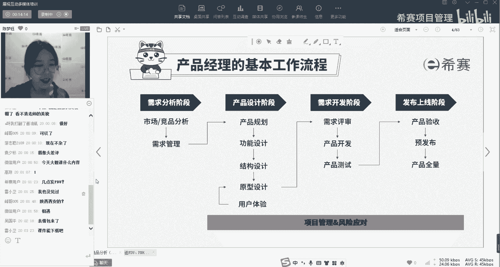

可以课后找自己的助教老师要一下啊，找助教老师要一下啊，好那我们就说到了今天的一个目录啊，今天我们会学到什么内容呢，第一个啊竞品分析啊，它是什么，为什么我们要做竞品分析，第二个我们怎么去做竞品分析。

那这个怎么去做啊，它其实包含的步骤非常多啊，今天因为课程这个时长的原因，我只会跟大家讲解到这个里面的宏观分析的，这样的一个层面啊，最后呢还会跟大家讲一下。

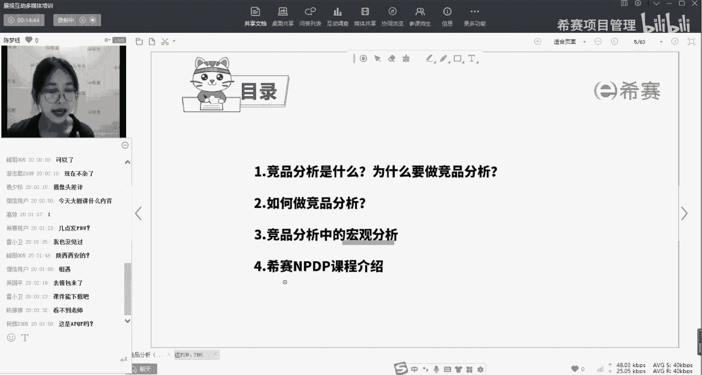

我们西塞NPDP课程的介绍，好，那首先第一个啊我们先来一个前菜啊，我来问一下在座各位同学们啊，有没有遇到这个面试惨遭淘汰的情况，或者发现啊说找工作这件事情特别难吗，有没有同学遇到过啊。

有同学可能不太好意思告诉我说，面试惨遭淘汰啊，那我就问一下大家有没有发现说，或者在身边的人啊，给你的感受啊，就发现说找工作这件事情特别难，啊李文刚同学，111赵胜伟同学，说多了是吧，这是直播吗。

是直播课啊，找工作太难了是吧，经常，我想啊现在这个疫情的这样的一个背景下啊，大家呢应该是多多少少都会遇到这样的情况，你看我们的峰哥说，想去的地方不要你要你的地方不想去啊，多多少少都遇到这样的情况。

但是没办法呀，生活还要继续是吧，车贷房贷还是要还，所以我们怎么样才能够在这茫茫的求职者，求职者中啊，去脱颖而出，那可以分为这四个小步骤啊，我们先通过一个前菜来了解说竞品，分析这个事情啊。

到底是什么样的事情，那首先呢第一步唉，我们应该先了解一下外部的环境，第二步摸清竞争者的情况，第三步明确这个公司它的需求是什么样，第四步制定计划啊，我不是光告诉大家这个步骤就行了啊，我们一步一步来看啊。

首先第一步啊了解外部的环境，其实呢了解外部的环境是非常重要的，大家呢有没有这样的感觉啊，就是工作了56年了是吧，我默认在座的同学们都工作56年了，那工作56年之后啊，从大学毕业到现在工作的一个时间。

有没有举行过同学聚会，有的吧，在同学聚会上面，是不是经常可以看到说有的人是吧，这个一直在生啊，有的人一直在生啊啊有的人呢是在原地踏步，有的人呢甚至在倒退啊，有没有这样的情况呢，啊我想啊应该是有的。

因为每个人的这个情况都是不一样，难道是大家的能力啊是有所差别的吗，其实不然啊，既然能跟大家成为这样的一个同学，在这个同学聚会里面，我相信啊这个大学啊，考入大学的这个能力水平啊，差距其实并不是很大。

那在哪里呢，可能是在刚开始啊，这个外部环境的选择上面出现了问题啊，这基本面选错了，那我们了解外部环境呢是要知道啊，现在啊你所处的这样的一个行业，它的增长情况或者增长态势是什么样的，它是在不断的增长呢。

还是在进行下降呢，如果它是在不断的增长，意味着你的机会比较多，你未来呢可能会遇到更多机会，如果它是在不断下降这个过程中呢，意味着你的路可能会越走越窄，甚至最后可能会被辞退啊，这是了解外部环境啊。

你所处这个行业它到底是在增长还是在下降啊，这是我们外部的环境好，第二步说要摸清这个竞争者的情况啊，那摸清竞争的情况啊，有同学就说老师这个怎么搞啊，我去跟别人面试，我根本不知道我的竞争者是什么样的情况。

那么通常呢很多公司啊他面试有很多轮啊，一般是3~4轮，有的大公司呢可能有五轮面试，我们一般可以默认啊通过了两轮面试，通过了第二轮面试，这样的人他可以作为你的竞争者，那你可以私下的跟他聊一聊嘛。

你观察一下他的能力，然后和你的能力进行一个对比，那么你就能够找到差距啊，了解你现在啊这些竞争者，他们是什么样的一个情况好，第三步啊，明确公司的需求，那有同学就说了，说老师这不简单吗，在简历上就看到了。

他简历就已经告诉我他有什么样的需求，其实不然啊，其实不然啊，如果你想让你的面试官对你眼前一亮啊，应该怎么做呢，首先第一个啊瞄准这个公司，然后看一下这个公司啊，未来三到5年他们的一个业务情况。

它的主营业务是什么，针对它的主营业务，你有哪些能力啊，是可以用上的，可以进行一个切合啊，可以进行一个切合，这是让你面试官眼前一亮的第一个点啊，主营业务上啊，你的能力可以用到上面好。

第二个点就是你还可以再去了解一下这个公司，它的文化啊，它的文化，把他的文化和你的性格特点结合到一起，这个很抽象了啊，怎么去理解呢，比如说我们西塞公司啊，我们西塞啊，我们的价值观啊，文化层面的价值观。

我们经常会讲到说简朴低调，艰苦奋斗，勤劳勇敢，那你是不是可以把这些价值观，内化到你的性格特点里面去，让面试官对你眼前一亮，这个叫做明确公司的需求啊，了解的要更多，摸清他的需求到底是什么好，你从宏观啊。

其实从宏观的外部情况，到微观的竞争者和公司的需求都了解了之后，再去制定这样的一个详细的计划啊，怎么样去打败我的竞争者，怎么样去得到我心仪的这样的一个岗位，这样呢才是一份完整的规划啊，同学们。

所以说竞品分析呢它很重要，它是我们项目如何取得成功的前提之一啊，今天到来的同学呢，很多是项目管理这个层面的同学，我也希望大家都去学习一下这样的一个思维啊，这样的一个方法可以用到方方面面啊。

你看面试层面上就可以用。

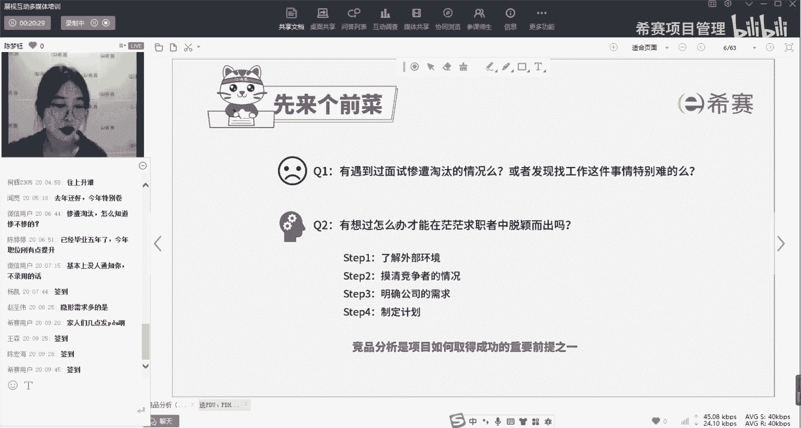

那么接下来呢方方面面也能够用到啊，它是一种思维的方式，好这是我们的前菜，那就进入到我们的主题了，叫做什么叫做竞品分析，以及啊这个竞品分析它有什么样的价值和意义。

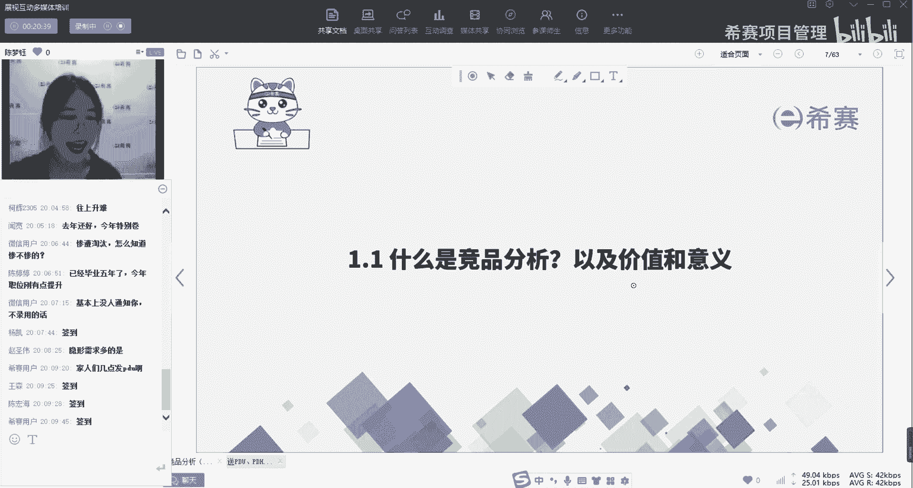

我们来一起看一下啊，那首先第一个是对竞品分析的定义，它定义呢其实就是说对竞争对手呢，要进行全面的分析，然后制定出来说有利于自身的竞争策略，那换句话来说就是分析一下现在竞争的格局，我有什么样的优势。

最终呢根据这个优势啊，拟定一个完整的方案，这个叫做竞品分析的定义啊。

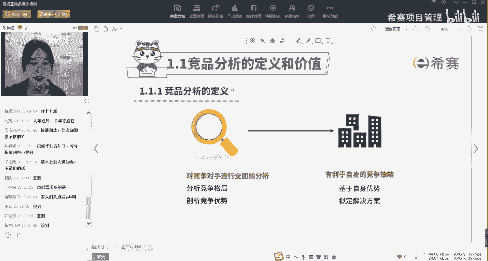

好那竞品分析呢有什么样的价值，它的价值可以体现在这三个方面啊，可以体现在这三个方面啊，我们在NPDP的课堂上面，会给大家拆分这个战略啊，就是一个公司他的公司战略，他的业务战略等等。

一个公司哈战略是它的一个长远的规划，是他公司愿意聚焦他的资源啊，到这个规划层面上，那这个战略啊应该要怎么去制定，会讲到两方面啊，一个方面是对外，一个方面是对内啊，在外部进行市场分析和竞争对手的分析。

找到一个业务的方向，你的业务方向的切入点，在内部对比自己的能力啊，是否能够达到这样的一个能力，对内和对外的分析这两个方面啊，如果有任何一个方面出现了差池，就说明你的战略啊确定的不怎么样啊，要去进行调整。

这是第一个方面，战略的选择，通过对竞品的分析，我们产品啊，我们也可以了解说我们的产品啊，和其他类的产品对比，我们产品的核心竞争力是什么样的，我们也可以通过啊和我们同行业啊，同类的这些竞品对比。

来看一下它的目标，在合理的制定我们预期的目标，这个是我们战略选择这样的一个层面好，那另外一个层面呢是关于我们产品优化的层面，本身竞品分析对于我们来说，就是我们的需求来源之一啊。

那我们可能在竞品分析的这个过程中呢，发现啊别人有做的非常好的地方，那对于我们来说是不是一个竞争的压力，而这种竞争压力可以迫使我们的产品做得更好，我们的产品优化啊，这是第二个方面好第三个方面啊。

个人成长的这个方面是大家经常会忽略的啊，是大家经常会忽略，是我前面也在讲了，希望大家学习这样的一个思维，在竞品分析啊，我们的宏观分析啊，就是行业分析的这个过程中呢，可能啊你要阅读很多份调研报告。

这个里面可能不止一份报告啊，甚至可能是十多份报告才能够提炼出来，你所想要的这个内容，那么在观看这个报告以及提炼的这个过程中，你自己的逻辑思维可以得到锻炼，你的书面表达能力啊。

你要最终把这个结论提取出来对吧，你的书面表达能力也能够有相应的一些加强好，不要去小看这个书面表达能力啊，毕竟这个书面表达能力是你还在每，是你和你自己啊，没有再看到其他人啊。

别人对你的第一印象也是你自己的一个脸面啊，如果你的表达能力比较好，让你的面试官或者让别人对你耳目一新，它其实也对你来说是一种优势啊，就是书面表达能力和逻辑思维的锻炼，在过程中呢是有的。

还有一个层面呢叫做行业理解力的提升，那这个呢是什么呢，其实我们在后面啊，收集到我们NPDP课堂同学们的作业的时候，会发现一个问题，有同学会问我们老师说，老师现在我处于什么样的行业。

也就是说其实你工作了几年了之后，你还不知道你的行业叫什么名字，你所处在什么样的行业啊，这个是一方面啊，还有另外一个方面啊，我不知道同学们啊身边有没有这样的人啊，或者朋友啊，或者有遇到这样的案例啊。

就是有一个人呢他可能经常会跳槽，他这个跳槽不是指的是同行业啊，我同行业的去跳槽，我是跨行跳槽啊，我今天呢觉得这个行业比较好跳到这个行业，明天呢我觉得那个啊产品经理那个行业比较好，跳到那个行业。

后天呢我可能觉得设计行业这个好，我又跳到这个行业，那这个呢其实就是一种三天打鱼，两天晒网的行为，它对于你个人的成长和发展来说是不太利的啊，不利的就算啊，我想告诉同学们一句话，就算你后面想要去跨行。

那你应该呀，首先用我们后面竞品分析给你介绍到这些内容，先去分析一下这些行业啊，先去看一下它到底是什么样的啊，然后呢，再根据这些内容去制定一些自己的职业规划啊，要有规划，不要到了5年之后啊。

你发现自己好像还是在原地踏步啊，要有规划，根据自己的行业理解啊，好用户导向概念呢也会更加深化，所以这个呢是我们界面分析的价值，对于我们战略选择有帮助，对于我们的产品优化是我们的需求来源。

也能够迫使我们更加优化，对我们个人层层长层面来说啊，逻辑思维能够得到锻炼，书面表达能力啊，也能够得到加强好，我看到已经有课代表了啊，我们的曾子璇同学啊，是我们的课代表啊。

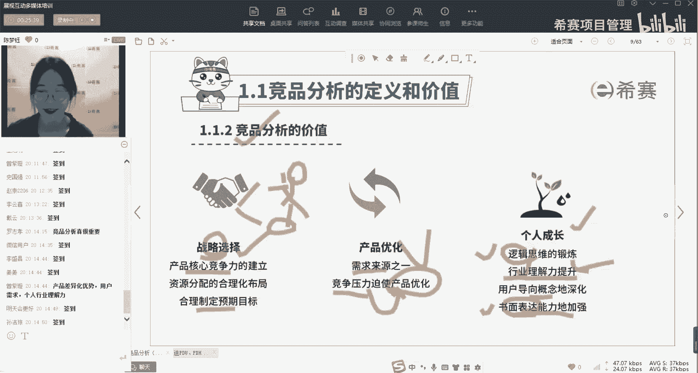

那这个呢就是我们竞品分析，它的定义和它的价值，总结来说就是两句话啊，经常会说的两句话，第一句话叫做知己知彼，百战不殆啊，百战不殆啊，这个字应该念带啊，就是了解他人啊，第二个呢叫做他人之石可以攻玉啊。

了解他人的长处和短处啊，取长安啊，我自己的短处啊，把我自己的优势啊提升上来。

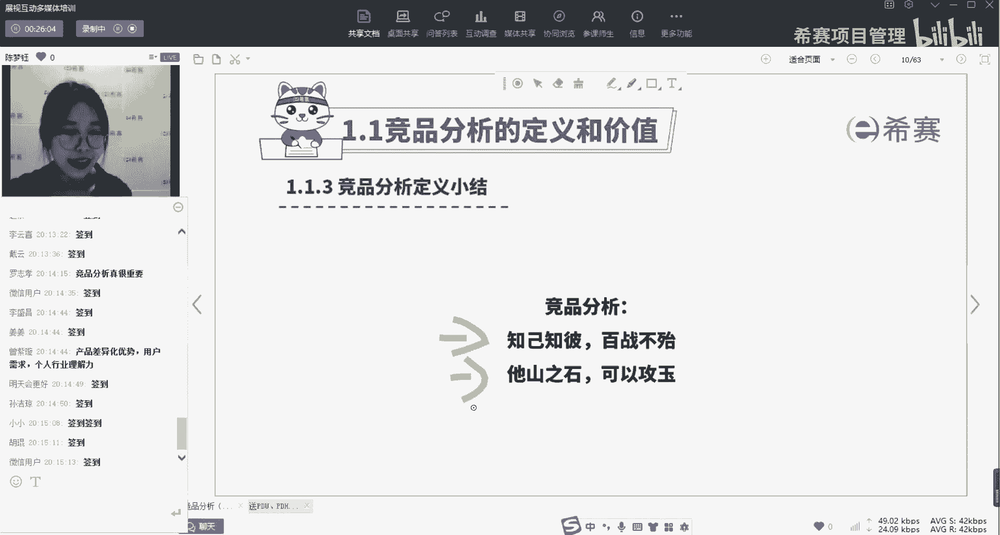

这是我们竞品分析定义的小结，两句话啊给到大家好，那我讲了那么多了啊，前面啊跟你说了那么多，说这个产品分析真的很好啊，想让大家去做一下。

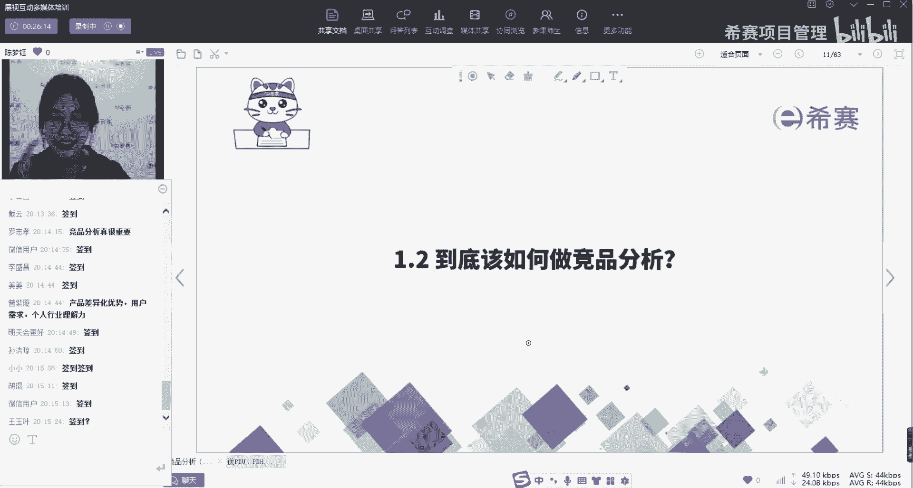

那到底这个竞品分析我们该如何去做呢，那进入到了正题，好现在呢我们这个心塞啊，邀请在座的各位同学啊，来当我们的教研产品经理，现在啊我们的王老板跟我们说啊，要开展一个新的科目方向啊，比如说按BA问。

你问你这个产品经理该怎么办，各位同学们怎么办呢，来说一说自己的想法啊，啊张扬同学说，先看行业标杆嗯，还有其他同学有想法吗，啊只有张扬同学一个一个同学吗，啊曾子璇同学说先可行性调研一下啊。

可以杨凯同学说先模仿再超越，罗志祥同学说销量更重要，付李玉同学说如何做到差异化，很不错啊，很不错，同学们，我从大家的这个回复啊，峰哥说市场的需求啊，很不错啊，同学们，我从大家这个回复中啊。

其实感觉到大家呢或多或少啊，对于这个竞品分析怎么去做，还是有自己一点的感知的，但是呢如果放到这个实际场景中啊，你的领导突然问你一句，说我现在要做NBA怎么办，刚开始呢肯定是感觉有点懵逼的啊。

所以我们来看一下做一个竞品分析。

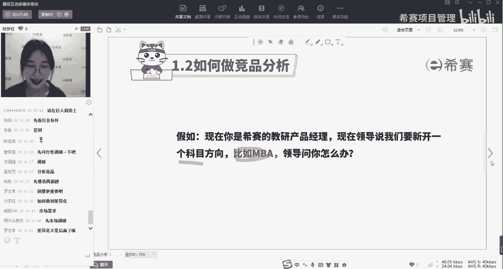

它的一个步骤应该是什么样的，那么首先第一步啊，我们有这样的关键六个步骤，待会会跟大家讲到啊，首先第一步呢我们应该要明确我们的目的啊，明确目的是非常重要的啊，你的目的会代表着你后面啊。

你的分析的方向是什么样的好，第二步啊要对你的行业市场进行分析，而这个分析呢就是我们今天所讲的重点内容啊，它的一个宏观分析，第三步呢分析完之后来确定你的竞品啊，你的竞品是什么，来搜集这个数据。

跟你的竞品进行对比分析输出这个结论啊，这个是六个关键的步骤，那么我们是不是每一次做竞品分析，这六个步骤都要走完呢，其实不然啊，要看你最开始的这个目的是什么，如果你是做一个从0~1。

也就是我们刚才那个情境啊，老板要开一个新业务，从0~1，那么你一定要走完这样的一个全程，那如果说我只是在这个过程中呢，想要做我产品交互设计这一个小部分，或者功能点的优化的这一个小部分。

那可以只做微观的这个部分，可以不做宏观的这一部分，好这个是我跟大家先讲的。

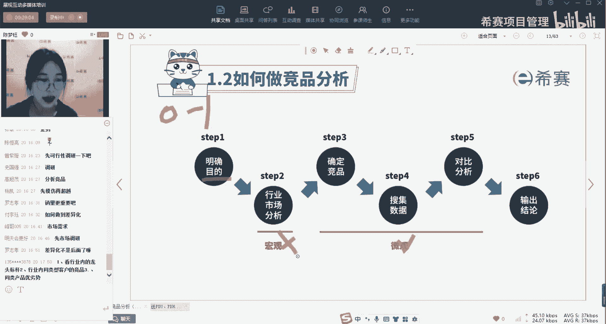

我们的一个前提，好我们来看到啊，第一步明确目的的这一步骤我讲了。

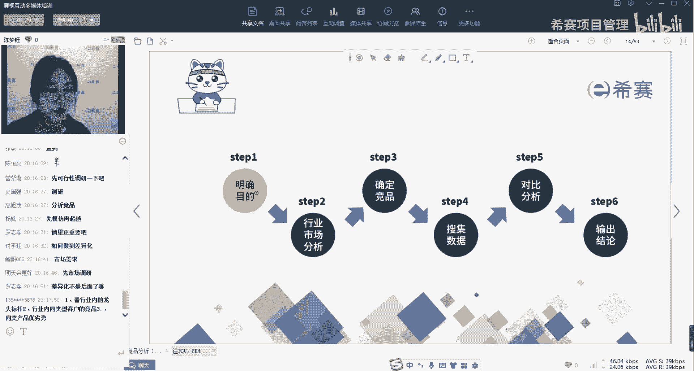

明确目的非常重要，为什么呢，因为你竞品分析的目的不同，你的分析的人不同，你所关注的维度是不同的啊，好我们来看一下它其实从业务层到产品层，到功能层是一个什么样呢，是一个从宏观到微观的这样的一个感觉。

好我刚才我们讲到的说，我现在要开展的是一个新的业务，那应该关注的是业务层，好关注的应该是业务层的市场分析，我想要确定方向，我想要了解市场，我想要知道这个到底能不能做，所以这个呢是我们确定的目的。

但是呢竞品分析，它是可以贯穿我们产品开发的全时钟的啊，你在这个过程中呢，你去做交互设计可不可以，你去啊。

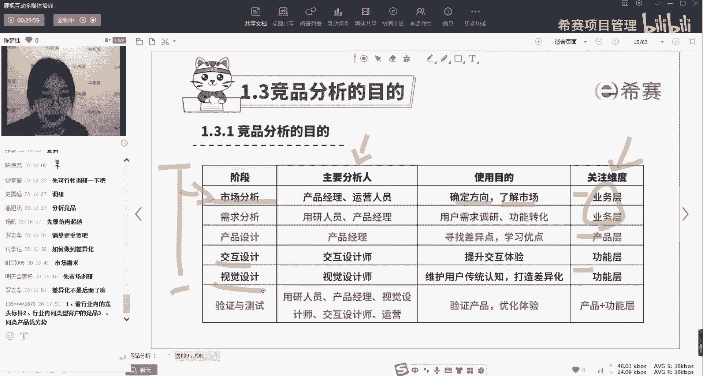

竞品分析我们的视觉设计可不可以都可以啊，都可以啊，这是我们前面要讲的那常见的维度呢，这里跟大家总结出来了啊，宏观到微观业务层呢一般会有一些市场背景呀，公司背景呀，产品信息，产品数据等等内容。

而产品层呢是我们的使用场景，核心流程，功能架构或者产品的一些迭代，功能层呢就是更加细化啊，更加微观的我们的一些功能点交互布局啊，那很多同学呢经常会吐槽我们的西塞，说这个西塞的交互布局做的不怎么样啊。

有些内容藏的太深了啊，这个呢就是其中的一个小点，这是我们竞品分析常见的维度。

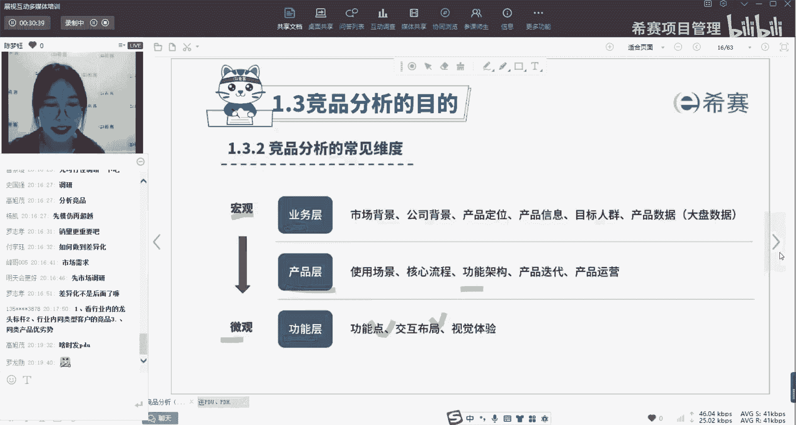

好现在呢我们明确的目的啊，我们是业务层要了解的是方向，那么宏观呢是一定要做的，那宏观呢是关于行业和市场上面的分析。

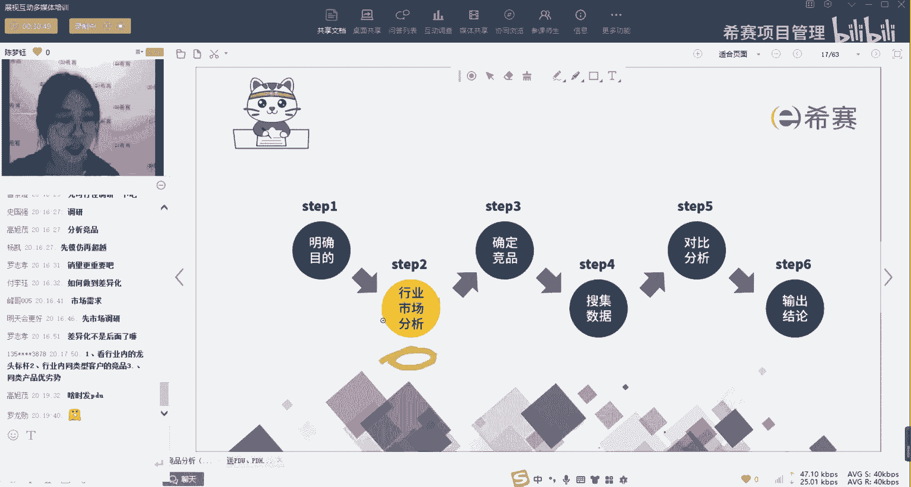

我们首先来看啊，怎么去做行业分析，第一个呢要通过了解我们行业的基本情况，熟悉行业的发展情况，了解行业内基本的竞争情况，好讲了这么多，他到底在说什么，也就是说我先要知道这个行业啊。

未来呢它增长的一个发展趋势是什么呀，是会增长还是会变小，这蛋糕呢未来会不会变大，海事呢会变缩小，好熟悉它的发展阶段，后面呢我们会给他介绍到不同的阶段，从哪一个阶段切入是最好的，了解行业内的竞争情况啊。

现在呢有多少人跟我在竞争，竞争激不激烈啊，强不强烈，那通过行业分析呢，就是先总结行业的基本特征，来给我们一个方向啊。

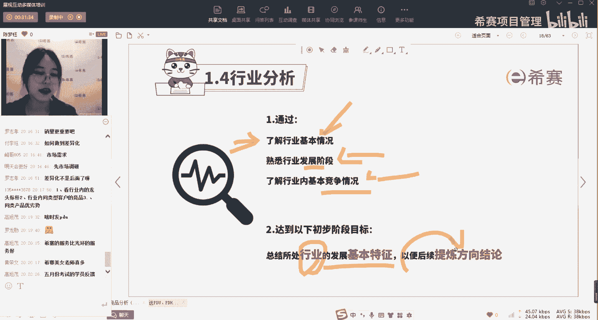

到底要不要去做啊，这是我们的行业分析的内容，好那第一个来到了，首先啊什么是行业，这里跟大家来了一个这个百度百科的内容，我觉得啊，大家啊心里应该是知道说有什么样的行业，比如说林业，汽车业，在线教育业。

那我问一下大家啊，我问一下大家，茶和咖啡大家认为是同一个行业吗，茶和咖啡大家认为是同一个行业吗，好赵胜伟同学说是，好那就不是沈欣妍，你来了好，有人说是，有人说不是啊，其实大家的判断呢没有错。

他从这个上面来说啊，如果你把茶和咖啡啊看作是饮品的话，他们是同一个行业，如果啊你把这个茶看作茶，然后茶饮的这个行业，把咖啡看成咖啡的这个行业，他们就不是啊，所以这个也是在提示我们，你对于行业的定位。

会影响到后续你搜集资料的相关的一些内容。

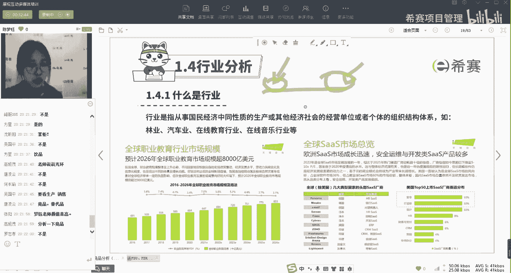

那比如说这里给大家举了个例子叫做小红书，你看啊，如果你把小红书啊定义到这个内容电商的时候，你选择的核心精品就不一样了，你定义它内容进商电商的时候，那你选择的竞品可能是抖音或者快手。

你把它定义为这个社交电商，那你可能选择的竞品是我们的拼夕夕啊，所以这个呢就是这个行业的选择，对我们后续的一个影响，好今天呢我们要调研的是什么MBA嘛，对不对，同学们好，我们把MMBA归为什么行业呢。

首先第一个我们前面啊我在讲那个slogan，说七下呢是专业的职业教育平台哈，既然我们是专业的职业教育平台，我们要做这个啊，我们先把它放到这个在线的职业教育的这样的，一个行业啊。

这是我们对定义呢是比较清晰的，那可能有同学就说了啊，因为这个在线教育行业它其实有很多，第一个在线教育你可以细分啊，向下是可以细分的，向下可以细分为K12，也可以细分为学历啊，也可以细分为职业教育。

而这个NBA呢你说他是学历教育，他也可以，你说他是职业教育，其实也可以，为什么呢，因为考取MBA的人，他需要用技年的工作经验啊，这是向下啊，向下在这个大的行业进行细分，那如果有同学就说啊。

有同学可能就说了，说老师我所处的这个行业太小众了啊，比如说老年人旅游的这个行业啊，找不到任何相关的一些信息，那这个时候怎么办呢，向上啊，向上兼容，向上兼容，同学们可以去找一下旅游业等相关信息。

可以找一下老年人啊，老龄化啊，相关的一些调研报告信息啊，这是一个向上一个向上，而我们定义的NBA是在线的职业教育。

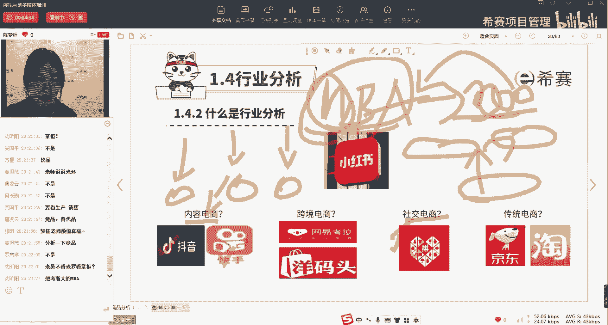

好，这里是把我们的行业定义清楚了，好，接下来说行业分析呢要怎么做啊，说起说起来很简单啊，就是收集我们的材料和分析，处理我们的材料啊，了解背景，了解相关的市场规模和用户情况啊。

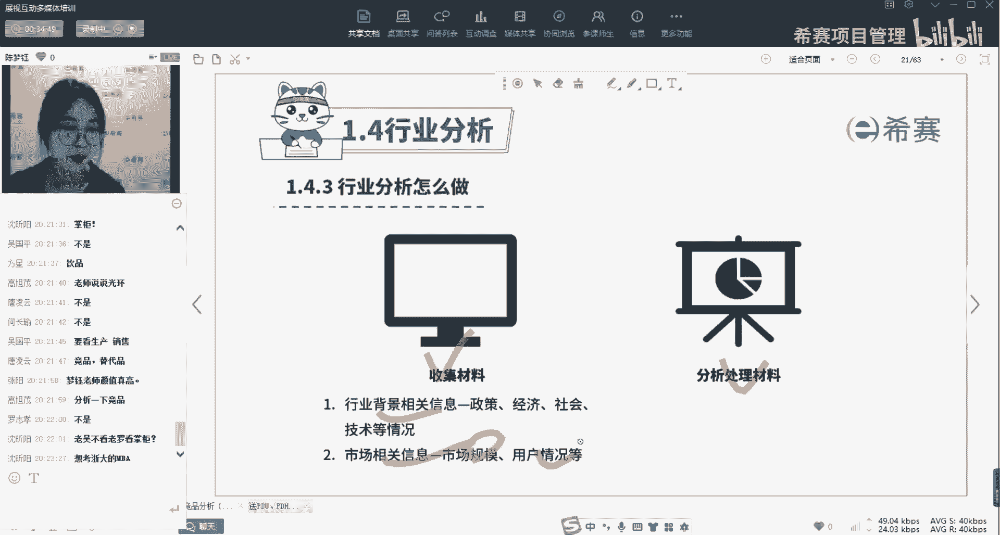

那我们接下来来看用什么方法可以去做啊，第一种方法呢叫做现成的资料啊，那这种现成的资料呢是比较少的啊，比较少的啊，如果你是这个K12行业的存量比较大，那可能呢能够找到一些现成的资料，但是这些现成的资料。

可能本身和你的切入点是不太一样的，那这个时候就需要我们其他的工具，比如说我们的test分析，比如说我们的竞争态势分析，比如说我们的产业地图好，那今天呢会跟大家聊一聊啊，这三个工具它们都怎么样去使用啊。

好那首先第一个就说到了啊，这个pastel分析呢，它其实也是要有一些相关的这些资料，而这些相关的资料或者这些数据怎么来呢，这就讲到我们的一个概念，叫做一级市场调研和次级市场调研这两个概念。

一级市场调研呢是指的是一手资料啊，就是你自己去研究得到的资料，而刺激市场调研呢指的是二手啊，二手的资料啊，也就是别人研究啊，你拿过来的，而对于这个行业分析啊，早期的这个行业分析。

我们推荐大家用的是二手资料啊，去寻找更多的资料来总结和提炼嗯，在后面的产品的设计阶段啊，用这个一手资料为什么呢，啊为什么不推荐大家在刚开始就用一手资料呢，可能你自己啊组建了一个团队。

哼哧哼哧搜索这个行业的半天得出一个结论，网上转头百度一搜，结果立马就搜出来了，这很没面子，也不是一个性价比很高的事情啊，所以呢最开始推荐大家二手资料好，那我跟大家讲二手资料，二手资料来源在哪呢。

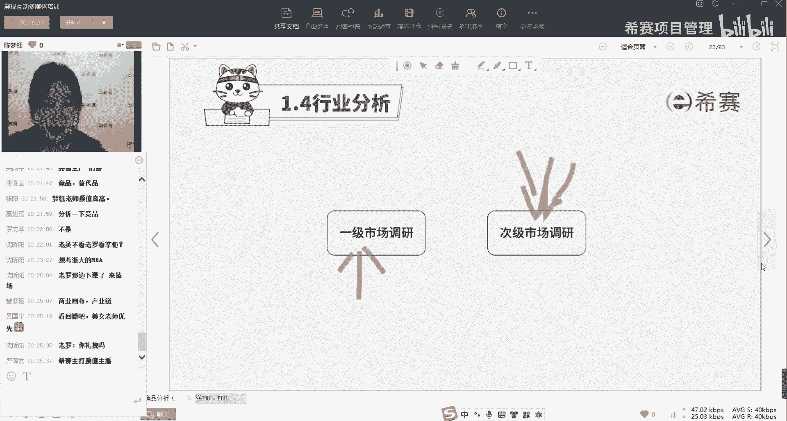

这里啊在这里同学们好，这是给大家推荐的一些数据来源啊。

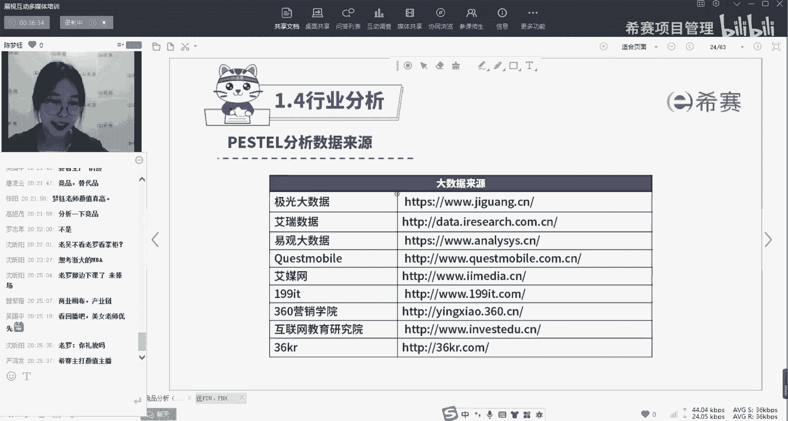

有一些艾瑞数据啊，爱美网等等其他数据来源，还有一些行业的信息，有官方统计行业协会，媒体网站上市公司年报啊。

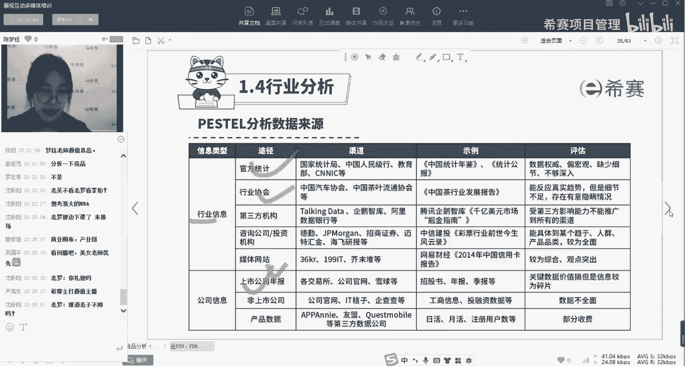

以及说我们的一些部分细分行业的数据来源好，大家不用着急啊，不用着急，我知道有人可能就想要这些数据来源，不着急啊，下课找我们的助教老师来领取一下今天的讲义，可以吧，同学们找助教老师领取一下讲义啊。

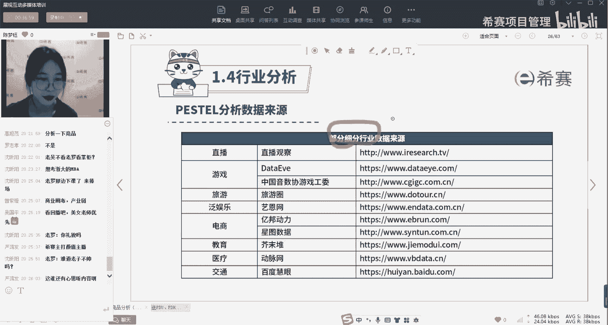

这些后面大家都实际去操作一下啊。

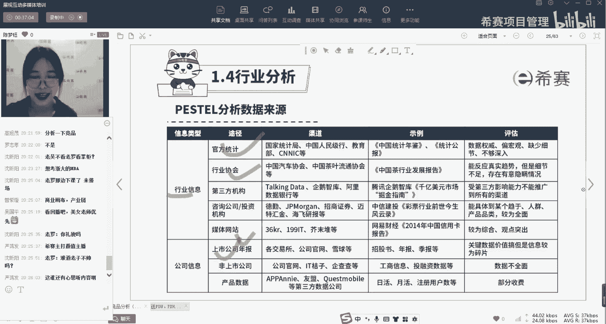

实际去操作一下啊，好那我们接下来就讲到我们的pest分析啊，第一个工具，Python分析呢指的是宏观环境下的一些分析，它一般用于什么样的情况呢，一般用于你现在做一个新的业务的时候，或者你现成的这个业务。

想要进入到一个新的市场的时候，我们可以采用test分析，那么pest分析呢呃也叫pastel啊，我们在NPTP的教材上面，是加了这个L和E的，L是法律层面啊，这个E呢是环境层面。

而今天呢我先跟大家聊一聊这个past啊，好那首先第一个呢P呢是我们的政治因素啊，什么叫做政治因素啊，其实呢就是和政府相关的，政府出台的一些政策啊，啊什么对外贸易政策啊等等一些政策。

而这个economic经济因素啊，什么叫做经济因素，凡是和钱有关的嘛，和钱有关的，其实都可以算，我们的经济因素，比如说这个经济增长啊，通货膨胀率啊，可支配收入啊等等啊，都和我们的钱有关，对吧好。

什么叫做social社会因素啊，好我们在这个上课啊，或者收到同学们的作业的过程中啊，会发现，同学们经常分不清这个政治和这个社会因素啊，他们两个之间的区别，政治因素它指的是一些主观的啊。

就是政府他主观出台的一些政府的政策啊，这些内容，而这个社会因素，它指的是现在社会上面有的一些客观的存在，那我给大家举几个例子啊，比如说现在的生育率啊是在逐步降低的，对吧好我们的九零后啊。

我们的受教育的程度是比较高的，这些呢都是一些客观的存在是吧，社会的因素，而这个呢是指的技术因素啊，现在的一个技术的趋势啊，现有的技术是什么样的，对我们有什么样的一些影响，这是我们的pest分析的内容。

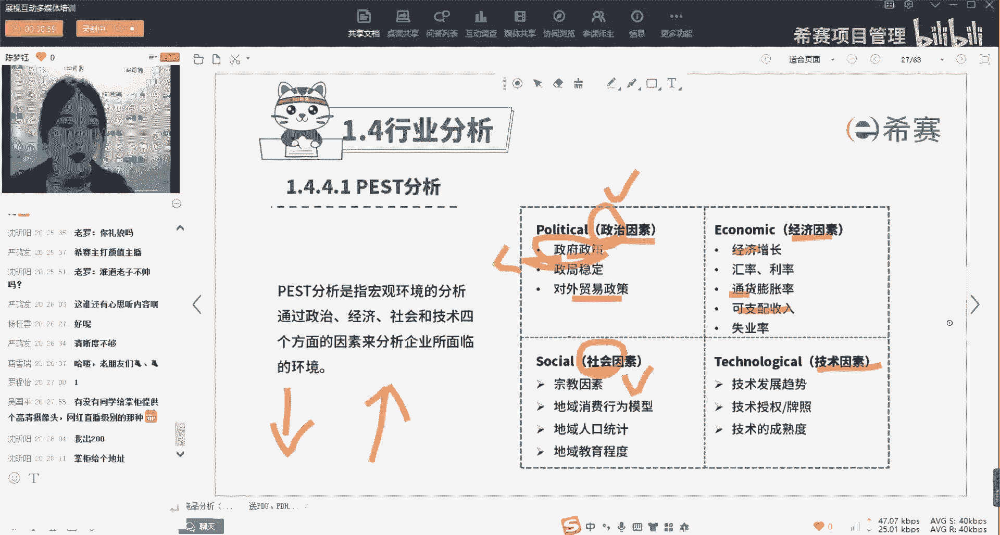

好讲了这么多呢，同学肯定迫不及待想知道老师，你说这么多到底怎么用啊，你还是没有告诉我，你只是告诉我们一个概念是什么，不着急啊，来了啊来了啊啊，首先呢第一个啊，大家可以看到这个是艾瑞咨询啊。

中国企业培训的一个行业研究报告，为什么给大家把这个资料放在这里呢，这还是我刚才所讲的啊，就是你不可能找到和你这个是完全一样的资料，那怎么办呢，可能在这个过程中呢，我们会阅阅读到十份甚至十份以上的资料。

我们需要有自己的一些能力啊，总结提炼呀，逻辑思维的能力，把这么十多份的报告啊，全部总结到一个点里面去啊，这是我所讲的，而我们也推荐啊，推荐现在的同学们，你既然要提升你对这个行业的理解力。

那么可以多去看一下相关的一些行业报告，这些相关的行业报告，他们的行文逻辑是非常清晰的啊，有结构的，有脉络的，对于你的这个后面的这个写作锻炼啊，也是有一定帮助的，好我们可以看到这个pest分析。

他会讲到啊，这个中国企业培训这个行业报告，会讲到政策上面的，经济上面的，社会上面的，技术上面的和资本上面的。

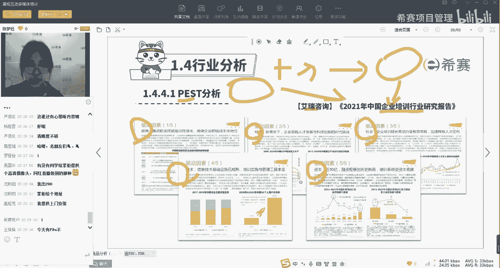

可能有一些信息可以帮助我们是可以提取的啊，这是企业培训好，我们再来看到这份资料，是洞见研报的，2022年中国在线职业教育诶，你看这个是不是更加贴合了啊，更加贴合了是在线职业教育的行业报告。

但是你会发现这一份资料上面，他讲的更多的是人才啊，需求啊，人才的供给，政策上面的和资本的这些职业教育啊，这些发力还是不太符合我们的这个past里面，内容也印证了说我们是要去整理啊。

要去提炼和要去总结的好。

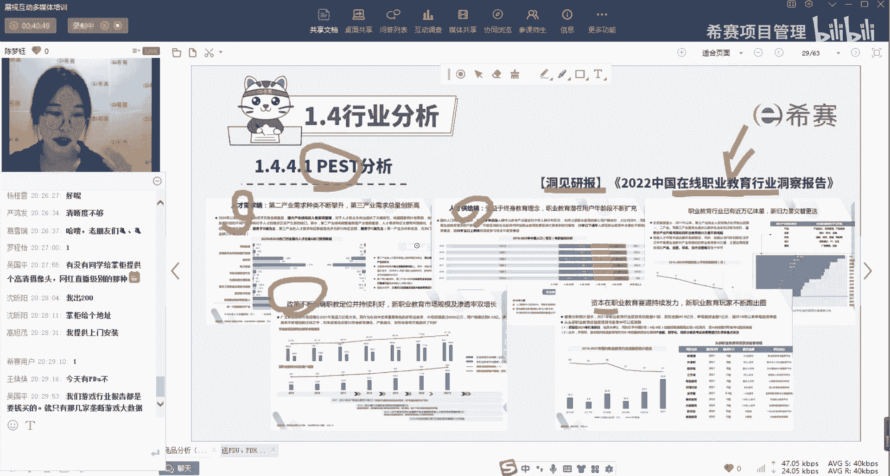

那么接下来我会带着大家啊，一步一步的来看一下啊，就是我们现成的已经有一个pest分析了，来带着大家一步一步的看，这些信息呢是怎么样提取出来的，那么首先啊第一个我们来看到这个政府，它所出台的政策啊。

2002年到2021年啊，他讲了很多政策，而这些政策呢我们大概的看一眼，其实都是关于在线的职业教育，他在推动在线的职业教育，也就是说在政策上面是支持的，甚至呢更加细化，细化到这个层面，他说国家啊。

职工经费从税前扣除的标准，2。5提升至8%，企业培训支出的动力更足，迎来了新机遇啊，也就是说同学们在座的同学们有考过PMP的，有考过NBA的，或者有考过NPDP的，有大部分的企业，80%的企业。

是愿意为你报销这个学费的啊，它既能削减自己的一些支出啊，又能提高自己员工的素质，何乐而不为呢，如果说啊这个这个国家不给他相应的一些支持，他会愿意报销你的费用吗，嗯这个很难说是吧。

所以呢他愿意报销你的费用。

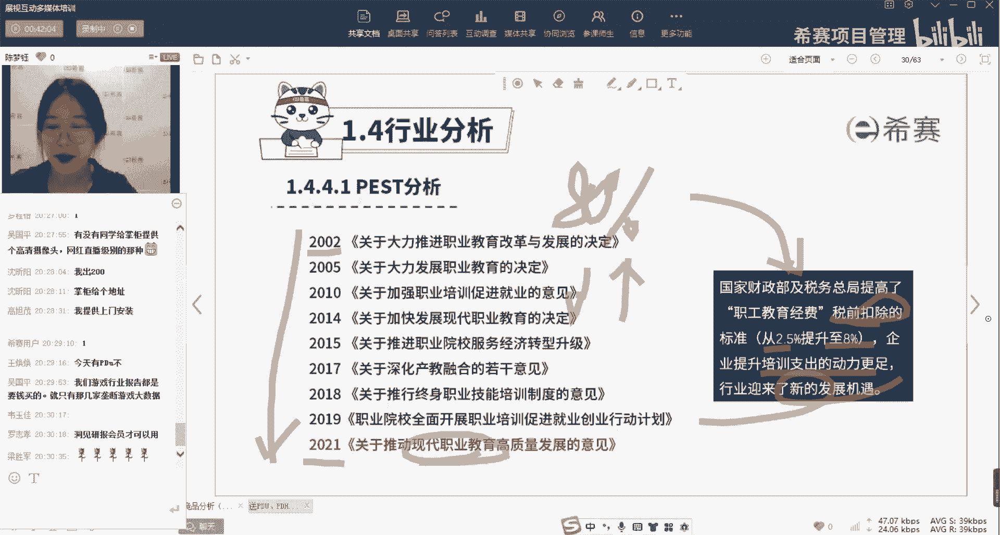

后面呢也有我们政策上面的一些支持在里面，所以这就来到了我们关于这个mda pest，分析这个政治的这个层面，可以看到啊，国家规定啊，增加教育和人才的占比，十四五推动现代职业教育发展啊。

当然所有的物料我没有放上来啊，所有物料我没有放上来，只是给大家展示其中的一个点啊，让大家去get去了解好，那如果说有眼尖的同学啊，可以看到咳咳可以看到啊，这里写了一个双减政策的影响。

如果有了解双减政策的同学啊，是应该知道的，双减政策呢它并对于这个K12行业来说，它其实并不是一件好啊，对于本行业的人来说并不是一件好事，但是对于我们在线职业教育啊，我们的西塞啊，这样来讲它是一件好事。

为什么是一件好事呢，嗯原来呢啊原来没有双减政策的时候啊，可能看到一个比较好的苗子是吧，刚准备培养一下他啊，被这个挖走了，被别人高薪挖走了，现在呢因为这个双减政策的影响有很多。

在K12行业本来就很优秀的人才，本来就有一些教育背景，本来就受过一些系统培训的，这些优秀的人才，是不是要寻求一些新的啊新的职位，那这个时候，我们是不是可以增加我们的人才储备啦，嗯这是双减政策的影响啊。

在政治层面好，这个在经济层面呢我们可以看到啊，说经济的稳步增长啊，其实我们中国在这方面做的是比较好的啊，就是这3年的疫情，对我们的经济的影响其实是比较好的。

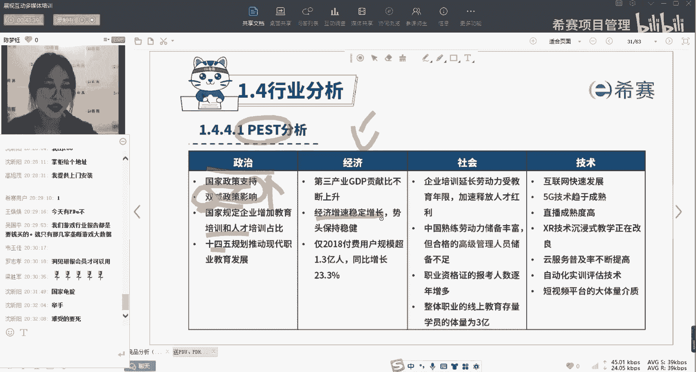

给大家还是提供了一个比较好的环境啊，好我们再来看到啊这个社会层面啊，再来分析一下啊，我们只看这个中国和美国好，这个绿色的说的是总劳动人口啊，我们的总劳动人口是8。2亿，美国呢只有1。7亿。

蓝色的这条折线呢说的是我们的受教育的年限，而我们的受教育年限呢是比美国低了很多的啊，这是一个劳动力是非常多的，但受教育年限比较低，而这个表呢他说的是中国高级人才，求人倍率的变化趋势。

也就是说我们其实是一直有需求在的，有这种高级人才的需求，在的劳动力这么多，有这么多的高级人才需求，中间呢是不是可以通过职业教育去补平它好。

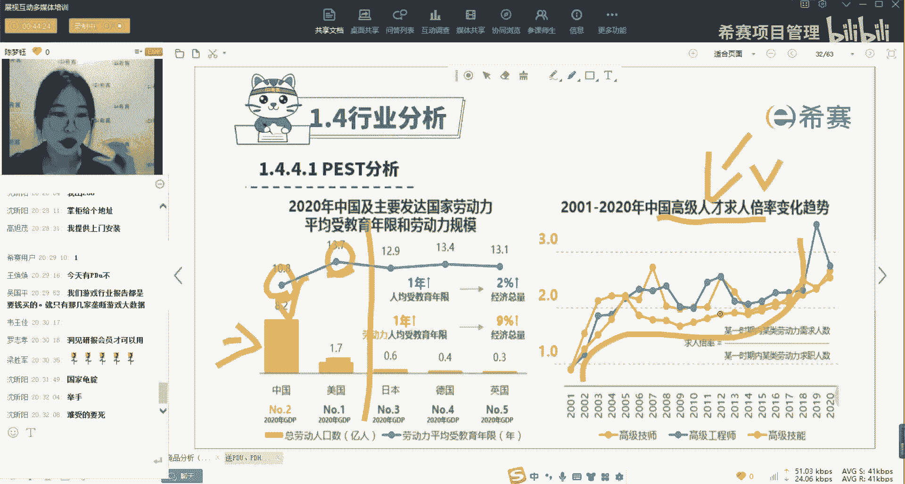

这是一方面啊，还有一个呢我们来看一下这个，这个其实说的差不多啊，说劳动力储备程度啊，蓝色的是中国，那中国呢是比较高的，美国呢是比较低的，但是中美合格的高级管理人员的储备对比，中国呢是比较低的。

而美国呢是比较高的，那中间呢还是说我们是有这样的需求啊，我们是有这么多的人的，而我们的这个高级管理人员却不多，那这个中间是不是可以通过职业教育。

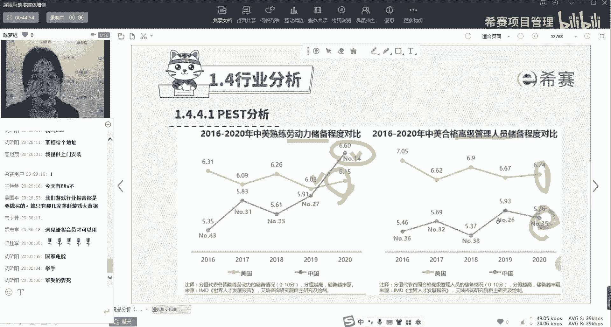

去进行培养啊，这是在社会层面，所以在社会层面我们可以看到，总结来说，就是中国啊，现在熟练劳动力的储备是非常丰富的，但是合格的高级管理人员的储备是不足的，嗯这个又分析到了这里的点，好。

我们接下来再看到这个技术层面啊。

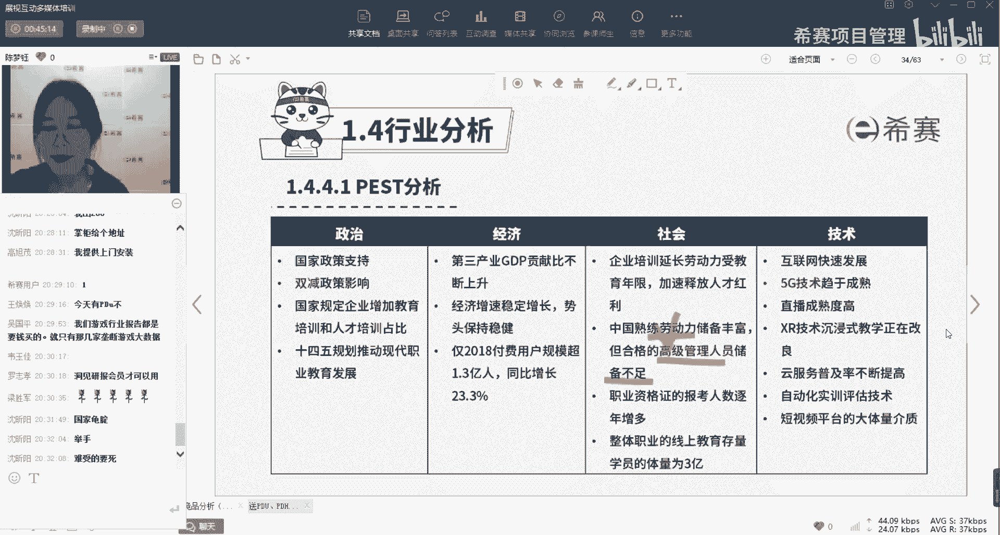

其实我想问一下大家啊，在没有这个在线教育之前，有没有大家有没有这个在线教育的需求，我想应该是有的在线教育它本身解决的是什么，它本身的解决是社会这个教育水平啊，这个教育的这个水平。

它分配不均的这样的一个问题，而职业教育，而在线的职业教育它解决的是什么问题，可能有同学啊去了解过一些线下的啊，有一些线下这种培训班，这种职业教育线下培训班啊，如果你去上，他可能会要求你做到以下几点啊。

你不要经常加班是吧，如果你一加班，你可能在路上耽误时间了，没有办法准时的去到这个地点，你不要经常去出差吧，如果你一出差，你又错过这个线下课程了是吧，钱又白花了，他对你的时间要求是比较高的。

那路上呢可能也会遇到交通堵塞啊，等等一些类似的情况，好现在呢有一个在线的职业教育了，好这个职业教育呢我们是以直播的形式，也就是大家现在所看到这个形式，大家既可以看直播，也可以看回放，如果没有赶上课程。

没有关系，还可以看回放，你如果去出差了，你在飞机上，你在火车上还可以看离线的视频，充分的利用你的时间，你去驾车过程中啊，你去地铁，坐地铁，这个过程中你还可以看成课程，对不对，好充分的利用我们的时间。

所以在线的职业教育需求这里是有的，但为什么近几年啊它才增长起来，是因为技术上面啊，是因为技术，现在我们的直播啊，技术的成熟度很高了吧，大家呢现在可以互动啊，和我互动啊，我看到大家就经常在这讨论啊。

聊天是不是可以互动，还有呢就是监测学琴的数据啊，那以前呢如果说没有我们现在这个督学系统啊，大家学成什么样，我的不太清楚啊，但是现在有了我们这样的一个督学系统啊，也是一项技术，有这个督学系统之后啊。

每一位同学他学习了多长时间的直播啊，他正确率怎么样，他这个做题的数量怎么样，我是全部可以看见，那我作为助教，这个端口，是不是也能给大家提供一些针对性的建议。

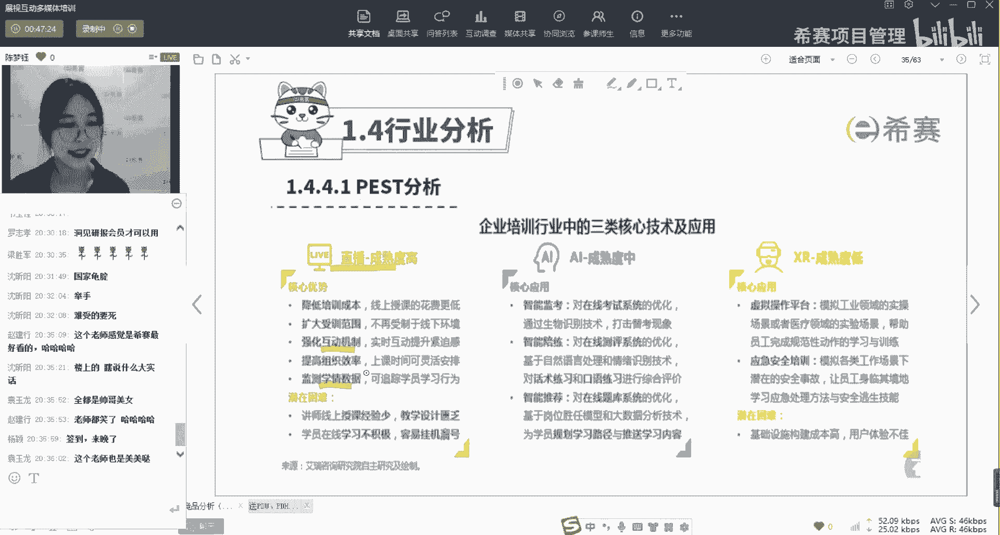

好这个是技术层面啊，直播的成熟度是比较高的，好那这个呢就在接触上面有所展示啊，我们的互联网发展快，5G技术趋于成熟，直播成熟度啊很高，那这个呢就是我们的pest分析啊，每一个层面啊，这个政治层面。

经济层面，社会层面和技术层面，我都是跟大家举了一个加搜索过程中的，一个小案例，然后告诉大家怎么样可以融合，填到我们的这个小格子里面去啊，填到这个小格子里面去啊，好那啊。

现在啊时间已经过了差不多40分钟了，差不多40分钟了，那就给大家送一下我们的PDU吧和抽奖码吧，应该是大家比较期待的小环节啊，好我们今天送这个PDU和抽奖码呢。

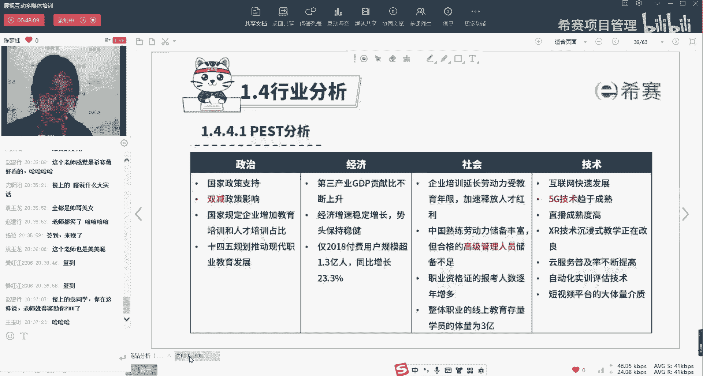

就是截图一下今天直播课的内容有内容，但是不要包括本页，把这个内容截图放到这个，这个我给大家展示的这个直播上面就可以了，展示的这个二维码上面就可以了啊，啊我们也休息一下啊，也休息一下，休息10分钟，8。

47继续啊，因为你蹭到今天是pd，今天没有pd u哦，哦今天是PDU，没有pd啊，好在大家休息的这个过程中呢，我给大家布置一个作业啊，这张这张都截图了吧，都结了没结的，给我扣个一啊，这张截了没截到。

扣个一啊，扣个一我就给大家换页面啊，行啊，那我给他换页面了啊。

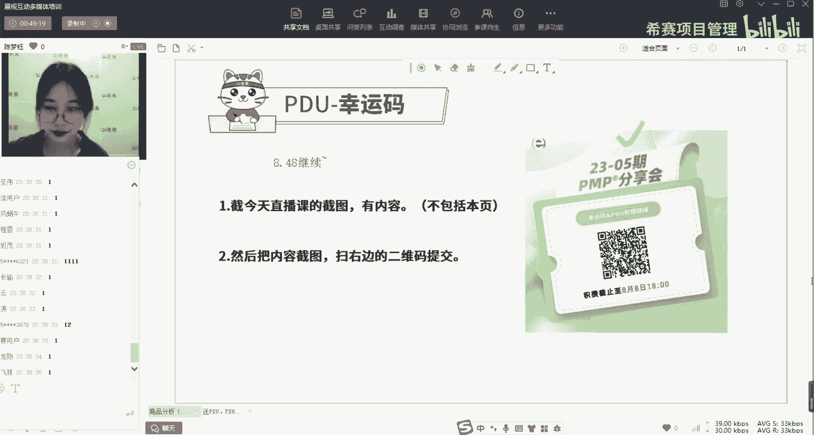

好我把页面给大家换到这一面啊，给大家换到这一面，好，我请大家在休息的过程中思考一个问题啊，请大家思考一个问题啊，今天刚都学了这么多内容，还在热乎的吧，抖音大家思考一下抖音啊，这个pest分析啊是什么。

来思考一下，今天既然这个知识刚学了，现学的这么热乎，来思考一下，今天涨得好的同学，我给她送一份小礼物啊，讲的好多同学，我送一个小礼物啊，用休息的时间，大家想一想啊。

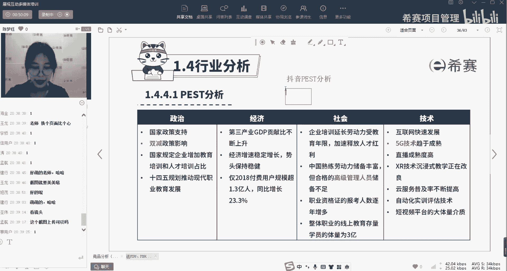