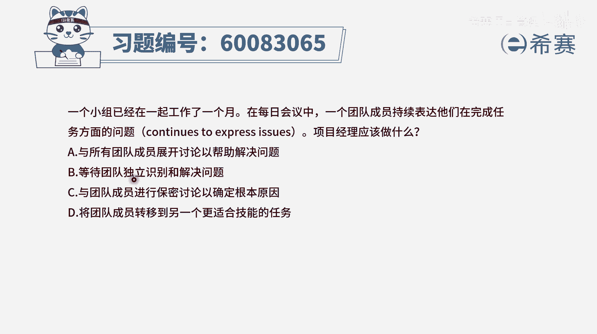
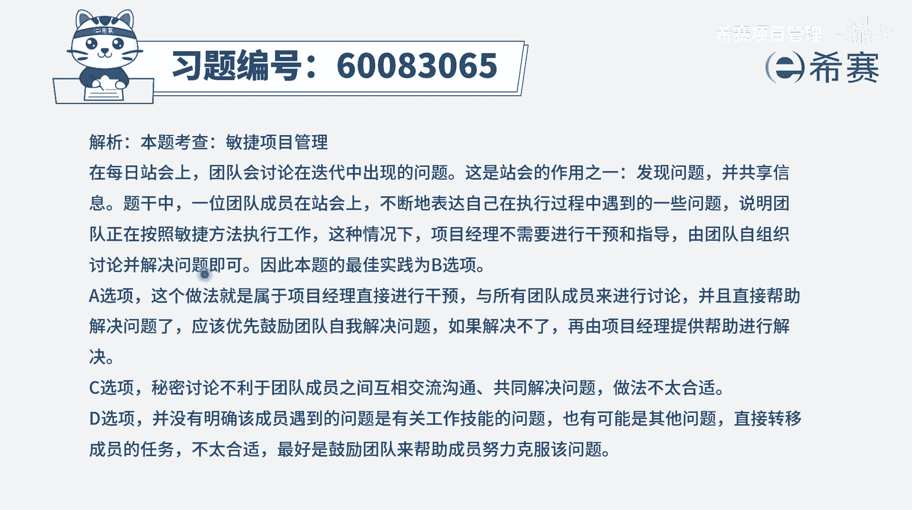

# 【重点推荐】2024年PMP项目管理 100道新版模拟题精讲视频教程、讲解冲刺（第14套）！ - P10：60083065 - 希赛项目管理 - BV1wz4y1q7Az

一个小组已经在一起工作了一个月，在每日会议中，一个团的成员持续表达，他们在完成任务方面的问题，那项目经理应该做什么，这个题目关于团队成员持续表达，他们在完成任务方面的问题。

这个点上面也因为理解会有一些歧义，所以呢我们特意把那个英文部分也亮出来，它叫continues to express issues，他证明给了一个，就是他其实表达是很多这样一些日常的小问题，是这个意思。

那么在这种情况下说，项目经理该怎么办呢，我们会看到说他这里有四个选项，a选项呢是与所有的团队成员来去展开讨论，以帮助解决问题，请注意这在什么时候，在每日会议中，首先每日会议呢我们是抛出问题。

而不是去直接解决问题，要解决问题，我们一般是建议会后再单独去召开会议去解决，其次呢这些个问题他也许没有说是到那种说啊，特别是非你出手不可的这样一个程度，所以更多的是鼓励团队一起来去解决，会更好一些。

好b选项等待团队独立的来识别和解决问题，也就是说这是他们在日常工作中所发现的问题，他们是一个自组织团队，他们可以去自行解决，这是会更好的，而你作为敏捷教练，是当他们解决不了的时候。

或者遇到一些挑战搞不定的时候，你来出手，这样会更好一些，所以b比a就会更合适，并且呢b它就是一个正确的答案，好c选项与团队成员进行保密讨论，以确定根本原因，你还要保密，在敏捷中更加提倡的是一种透明沟通。

透明沟通啊，同志第一选项，将团队成员转移到另一个更适合技能的任务，也就是说让他不要去做这个事情了，可是事实上我们只要是在做敏捷的话，讲三个问题对吧，每个人都回答三个问题，我昨天干了什么，我今天要干什么。

我干这个事情遇到什么样一些障碍问题，困难挑战，所以在做事情的时候遇到问题，这是一个很正常的一个行为，遇到了以后提出来，有可能我们合适，就有人帮你去给一些建议啊，意见啊，我们就可以去解决。

所以并不会因为他遇到问题，我们就不让他做这个事情了，这个方式是错误的，那这样看下来呢，c和d都是错误的，而a和b中我们说因为这些问题啊，所以没有必要说非得让你项目经理出手，可以让团队自行解决会更好一些。

也就是b比a会更好一些，所以答案是选第二个选项，让团队来去独立识别并解决问题，只有在他搞不定的时候，你再去出手会更好一些。

那文字版解析在这里。

