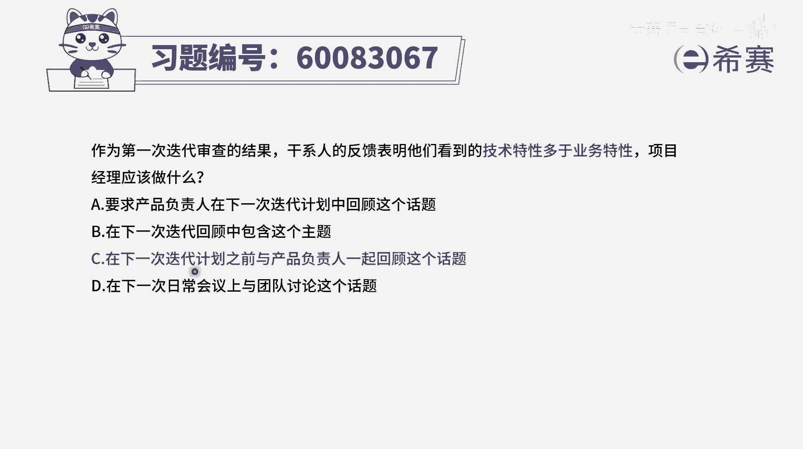
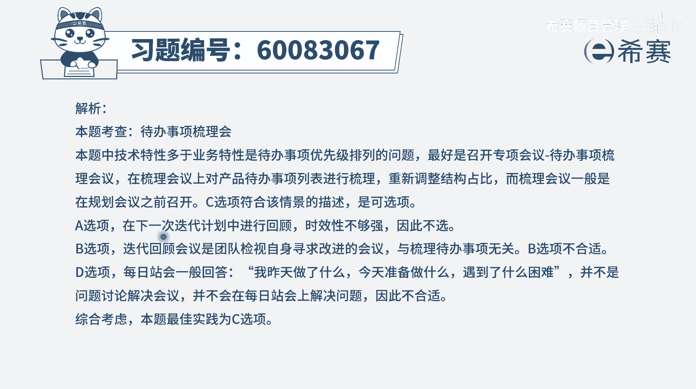

# 【重点推荐】2024年PMP项目管理 100道新版模拟题精讲视频教程、讲解冲刺（第14套）！ - P11：60083067 - 希赛项目管理 - BV1wz4y1q7Az

作为第一次迭代审查的结果，干系人的反馈表明，他们看到的技术特性多于业务特性，项目经理应该做什么，那首先我们得要认识两个词啊，首先什么叫技术特性，业务特性我们在讲敏捷项目管理的时候，讲过一个词特性。

还讲过一个词最小可受功能，但是那个最小可数功能，我们当时用了一个词叫什么叫feature，所以我也讲过说feature这个词，它的翻译有的时候会翻译成叫特性，但是我们可以把它简单理解为是功能。

它是一个比功能再大一些的，这样一个大功能集合，叫特性，那这里面给他说是技术特性更多，业务特性更少，其实也就是关于技术方面的功能点更多，要关于能够满足某些业务的需求的这种比较少，说的是这个意思。

那既然我们已经获得了干系人的这样一个反馈，我们肯定是需要去采纳他的反馈，去吸收它的反馈，来对下面的这样写个项目进行调整的，而这个意思里面表达的其实就是，关于这样一个待办事项列表。

它的优先级排序是有问题的，是没有很好的去满足客户需求的，那所以应该是产品负责人，来去完成这样一个事情，对于现在的呆板事项列表，来进行一个重新调整顺序，那可以用一种叫代办事项列表的梳理，会议来进行。

那我们来看一下看四个选项，选项a，要求产品负责人在下一次迭代计划中，来回顾这个话题，请注意这个回顾这个词用的很奇怪啊，通常来讲的话，回顾通常是已经做了个7788了以后，然后再去过一遍，是这个意思。

但是很显然，这里面的话就是可能要对某一些东西进行调整，要把更多的这些业务特性，业务的功能，这些啊business feature，把它往前去靠，应该是这个逻辑，第二个选项。

在下一次迭代回顾中来包含这个主题，那通常到下一次回顾时间，就过得有点太过于晚了，第三个选项在下一次迭代计划之前，与产品负责人一起来去回顾这一话题，那么也就说是，我们在还没有开始下一轮迭代之前。

我们就来去处理这个事情，来去聊这个事情，专门聊这个事情，诶这个是可以的，我们可以专门做一个主题研讨会，或者能做一个待办事项列表的梳理会议，也是可以的，好，最后一个选项。

在下一次日常会议上与团队来讨论这个话题，请注意这么样的一个事情，他不应该是跟团队来讨论，因为客户所反馈的是我要的东西，我觉得可能这个顺序有点不太对，那通常应该是po来去做拍板决定，其次在日常会议上。

更多的是去抛出在开发的过程中，所遇到的这些困难障碍和挑战，所以相比之下应该是c选项会更合适一点，就是我们在下一轮迭代之前，我们专门去开一个主题的会议，可以是某一个主题会议。

来去讨论关于这些代办事项列表的优先排序，或者呢是一个叫产品梳理会议都可以，所以答案是选c。

那文字版解析在这里。

