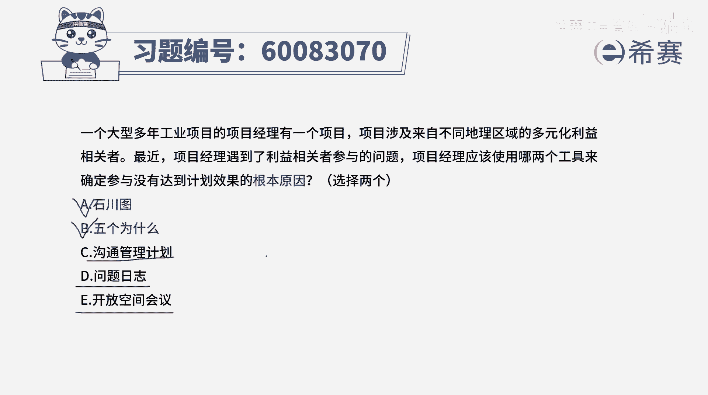
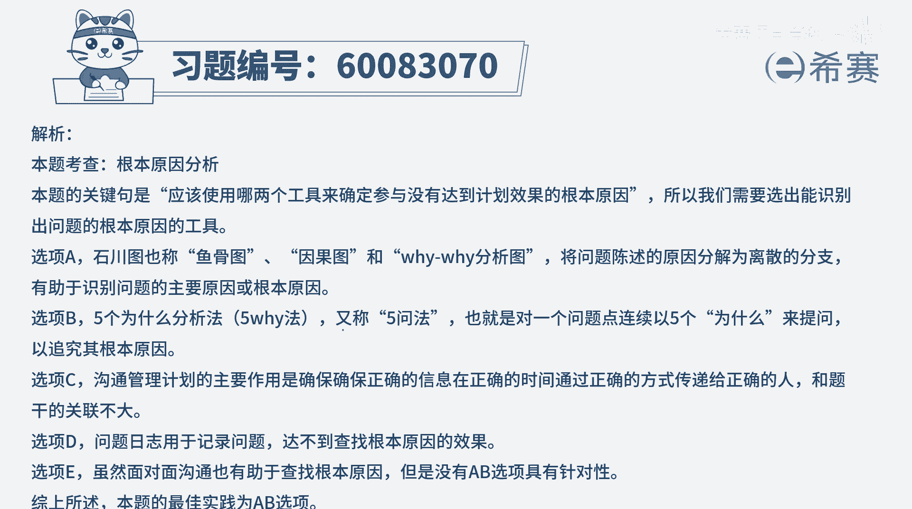

# 【重点推荐】2024年PMP项目管理 100道新版模拟题精讲视频教程、讲解冲刺（第14套）！ - P12：60083070 - 希赛项目管理 - BV1wz4y1q7Az

一个大型多年工业项目的项目经理，有一个项目项目，涉及到来自不同地理区域的多元化利益相关者，最近项目经理遇到了利益相关者参与的问题，项目经理应该使用哪两个工具来确定，参与没有达到计划效果的根本原因啊。

选两个，五选二，这个题目呢相对来讲就比较好选了，其实就是要去找寻某某某某事情的根本原因，我们在学习的那么多工具中，其中有一些工具可以帮我们找根本原因，一个就是根本原因分析，一个就是因果图，也叫鱼骨图。

也叫石川图对吧，也叫yy法，还有一个是5y法，所以呢是实穿图和无外法，这两个工具，刚好就是能够去帮助我们去找寻，根本原因的工具，这个你都是比较简单容易选的，这个题目特别一点，其他几个选项也稍微来提一下。

沟通管理计划呢，它会告知我们什么时候把什么信息，通过什么方式传递，一个什么人，达到什么样一个效果，这是关于沟通管理计划，他跟这样一个直接说沟通没有达到效果的原因，没有直接承认关系好，第一选项呢问题日志。

问题日志，它只是讲的说我们在做这个事情的过程中，嗯出现的问题，把它记录下来，比方说沟通没有达到效果，这是一个问题，把它记录下来，但他并不会涉及到去分析根本原因，好一选项说开放空间的会议。

那这个开放空间会议，其实他给的是说能够面对面的沟通的一种方式，面对面的沟通呢可能更有效于去信息传递呀，能够更好的去交流互动，能够更好的去了解一些原因，但它不是一个最直接的，最直接的。

就是用这个鱼骨图或者石川图或者叫yy法，它就是通过不断去问，为什么的这种方式来去找那答案，还有一个是无外法，无外法是刨根问底的方式，也就是说是这个事情通过问问题得到一个答案，然后基于答案再去问问题。

得到下一个答案，下一个答案再去继续基于下一个答案来问问题，不断跑的方式，所以这个题目的话呢，我相信你们都选对了啊。

