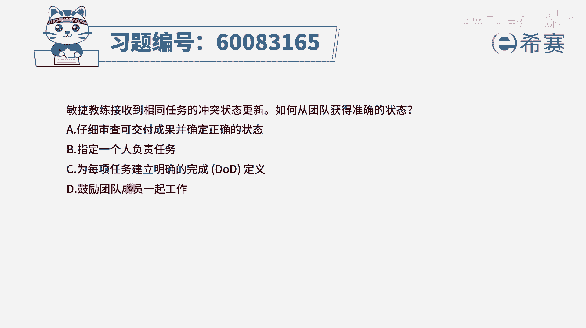
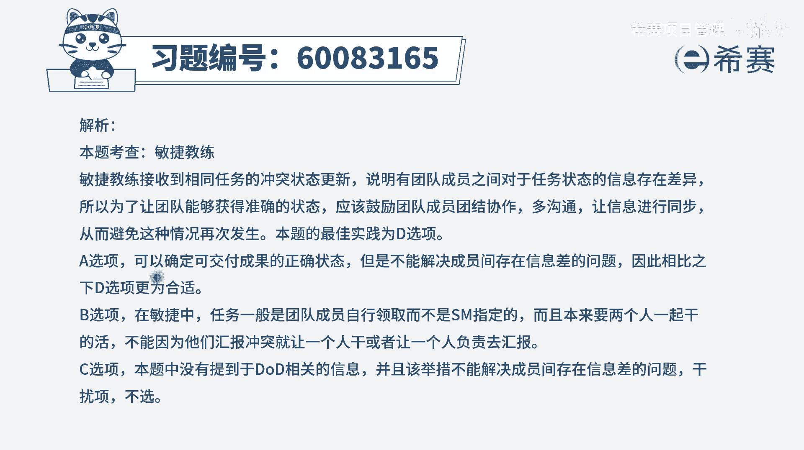

# 【重点推荐】2024年PMP项目管理 100道新版模拟题精讲视频教程、讲解冲刺（第14套）！ - P37：60083165 - 希赛项目管理 - BV1wz4y1q7Az

敏捷教练接受到相同任务的冲突状态更新，如何从团队来获得准确的状态，首先这个题感可能很多同学乍一看看不懂，但是我们要仔细慢慢的读啊，是收到了相同任务，他的冲突的状态更新。

也就是说同一个任务他目前是什么状态呢，张三说正在开发中，李四说已经开发完成，然后王五说呢已经部署了，所以这就是关于这个任务，他的状态的这种描述呢，相互之间有冲突，那怎么会出现这样一个冲突呢。

其实是团队成员，他没有信息同步，所以如何从团队来获得准确信息，那首先要做的事情就是让团队成员，他们能够信息同步，当他们能够信息同步的时候，你能够收到信息，就是一个明确和确定的一致的信息。

我们来看一下四个选项，选项a仔细审查可交付成果，并确定正确的状态，这就不是由团队来给你这样一个正确的状态，而是你自己亲自去获得，这肯定就不合适，你不可能所有的大事小情，都由你自己亲力亲为的去了解。

对不对，应该是按团队来给你汇报，并且汇报的是一个确切的是他们信息同步以后，再告诉你正确的信息好，第二个选项指定一个人去负责任务，那专门有安排一个人来去干这个事情，有点太扯淡了。

并且整个在敏捷中他会强调是自组织，团队是自我组织，自我管理，并且呢更多的是强调一种透明沟通好c选项，我们每一项任务建立明确的完成定义，d o d那完成定义它通常用在什么情况呢，就是这个东西你做完了。

可是po验收不通过，说不行，那么这个时候可能就是完全定义没有搞清楚，而题干中说的是说这个东西的状态，大家的理解是不一致的，有人说已经完成，有人说还没有完成，所以应该是信息同步的这个事情。

那最后一个选项鼓励团队成员一起工作，当我们能够一起工作，能够去携手共进的时候，就能够做到更好的信息透明，当有了信息透明以后呢，大家所汇报出来，这样一个任务的状态就应该是一致的，所以答案是选最后一个选项。

也就是说这个题干所问的问题，其实跟这个项目，它到底有没有清晰的一个完成定义，没有相关，重点是大家没有信息透明，我们需要在一起工作去做到信息透明，并且呢是你如何从团队来获得准确的状态。

而不是让你自己去亲力亲为去获取到呢，不是a选项，所以答案是选最后一个。

那文字版解析在这里。

