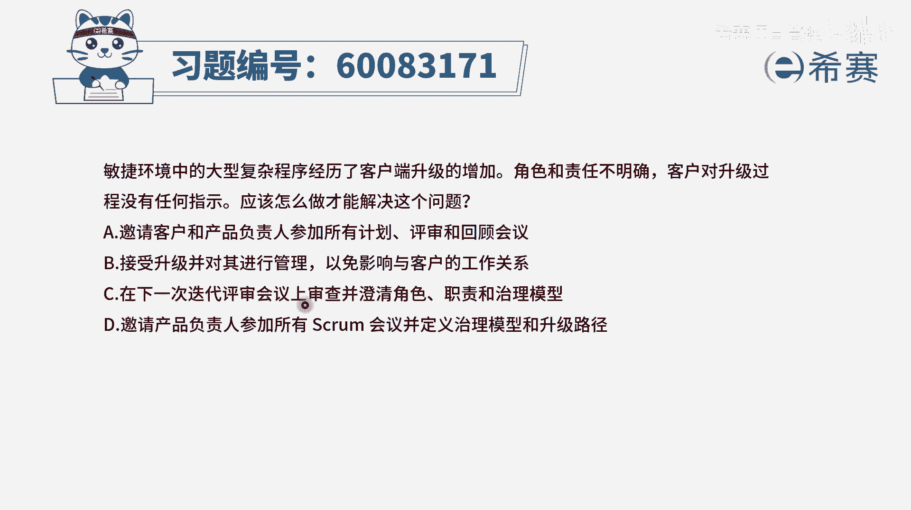
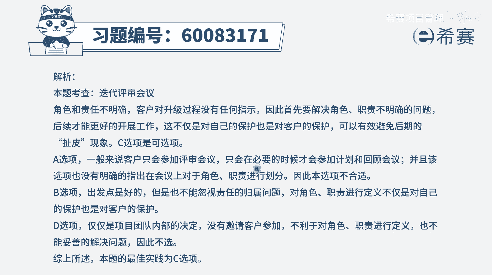

# 【重点推荐】2024年PMP项目管理 100道新版模拟题精讲视频教程、讲解冲刺（第14套）！ - P39：60083171 - 希赛项目管理 - BV1wz4y1q7Az

敏捷环境中的大型复杂程序，经历了客户端升级的增加，角色和职责不明确，客户对升级过程没有任何指示，应该怎么做才能够解决这样一个问题，这个题目呢坦白说他其实讲的不是很清晰，你不知道到底是在说什么鬼。

但你至少知道一个点，它明确给出的是角色和职责不明确不清晰，那我们肯定要想办法让它变得明确和清晰，嗯这个逻辑肯定是对的对吧，然后来看四个选项，选项a，邀请客户和产品负责人参加所有的计划，评审和回顾会议。

这一看就是一个错误选项，我们在spround这一个实践中有讲过，通常来讲呢，他们是要去参加评审会议，但是至于说迭代规划会议，那客户是不用参加的，迭代回顾会议客户不用参加po呢，也可以不参加。

所以这个a选项是错误选项，b选项接受升级并对其进行管理，以免影响与客户的关系，这一看就是一个错误选项，因为这种方式就不是一个规范的管理方式，就是为了能够去让跟客户之间处在，一个比较好的一个工作状态。

工作对接的状态，所以我们就对这些事情呃，就默默的承受了，这肯定不合适，因为既然职责不清晰不明确，那很容易出乱子，出了乱子以后，不只是对我们有影响，对客户的工作也有影响，不是什么好事，第三个选项。

在下一次迭代评审会议上，审查并澄清角色职责和治理模型，这个呢好像是对的，但是也不知道到底是不是，在这个迭代评审会议上，但是至少知道说要去澄清角色职责和治理模型，所以这里应该有可能是对的，打一个圈圈对吧。

做一个重要的候选项，最后一个选项，邀请产品负责人参加所有spring的会议，并定义治理模型和升级路径，这一看就不对，我们有讲过说产品负责p o呢，他是参加这个迭代评审会议是要参加的。

然后迭代的规划会议呢，他也是要参加的，但是迭代回顾会议他一般是不参加，他也是一般都不参加，所以这个表达肯定是有问题，那么正好在这个评审会议上，在这审查有c选项的这个审查会议上，既有p o来参加。

他也可以邀请客户来参加，那么在这个时候我们来去澄清这些角色和职责，这刚好是合适的，至于说后面的这个智力模型，它到底是什么鬼，你即便不理解他也没关系，他大概的意思说的是关于某一些事情，我们应该怎么办。

讲的是这么一回事儿，其实比方说啊，关于我们这一个啊什么产品升级的事情啊，客户端升级的事情，正常的路径应该是什么，先怎么样，然后再怎么样，哪个团队负责什么，然后又如何讲的是大概是这么一回事。

所以呢只有c选项刚好是合适，在迭代评审会议上呢，来去做这些个澄清角色和职责。

那文字版解析。

