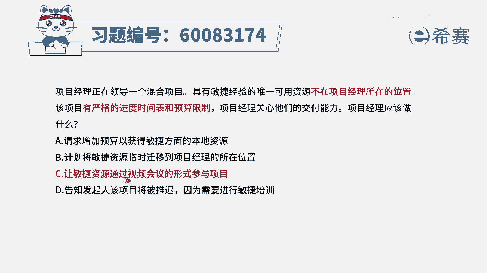
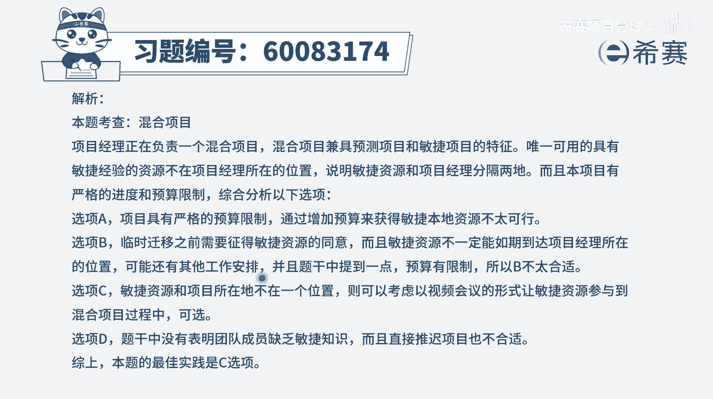

# 【重点推荐】2024年PMP项目管理 100道新版模拟题精讲视频教程、讲解冲刺（第14套）！ - P40：60083174 - 希赛项目管理 - BV1wz4y1q7Az

项目经理正在领导一个混合项目，具有敏捷经验的唯一可用资源，他不在项目经理所在的位置，该项目有严格的进度，时间表和预算限制，项目经理关心他们的交付能力，项目经理应该做什么。

这里面的话其实给到的就是一个有矛盾的场景，该如何解决这一矛盾啊，我们要用的这种混合的方式来去做项目，也就是既有预测的方式来管理，也有敏捷的方式来管理，但是敏捷呢具有敏捷经验的人不多，只有一个。

而这个人他又不跟项目经理不在同一个位置，不在一起，而这个项目它有明确的这个严格，时间表和预算限制的话，我们最好是能够如期的按照用预测，加敏捷的方式去管理它，应该能够去确保它完成，那有了这些认知以后。

我们再来看四个选项，选项a请求增加预算，那一看就不合适啊，一般来讲的话，项目其实不太允许你直接去加人呐，啊加钱呢的这种方式好，b选项计划，将敏捷资源临时迁移到项目经理所在的位置啊，这种方式可不可行呢。

不是不可行呃，但是在敏捷中它其实还有另外一种方式，如果说在一起可以集中办公，那最好如果不在一起，不能够集中办公，我们也可以通过这种线上互动的方式，也是可以的，通过这种视频会议的方式也是可以的。

那你看有没有更好的选项啊，第三个选项，让敏捷资源，通过视频会议的形式来参与到项目中来，哎这刚好也就是这种比较理想的一个状态，所以呢c就是它的一个正确答案，同时b选项它为什么不选呢。

因为我们只是简单的去考虑到迁移资源，可是你要真的迁移资源的话，你是不是要给这个员工安排住宿，还有一些生活方面的各种设施的东西，他一定要花钱的，还有就是别人也许他自己有他的一些生活呀。

有他的一些什么事情呢，那么方便吗对吧，差旅费用呢各方面都是有影响的，所以呢如果不在一起的时候，我们可以通过视频会议的方式，通过这种虚拟的团队的方式来进行，也是可以的，最后一个选项告知发起人。

该项目将会被推迟，你胆子也够肥的呀是吧，这个不可以啊，通常情况下领导都已经安排了，你尽量是去完成，除非说呃你通过论证以后发现是肯定完不成，肯定做不了，那就是你可以去反馈，但现在还没有告诉你。

说是肯定玩不了的这个状态，所以你直接说推迟这不合适啊，那么当不在一起的时候，我们用虚拟团队的方式来进行，通过视频会议的方式来进行答案。

选c文字版解析。

