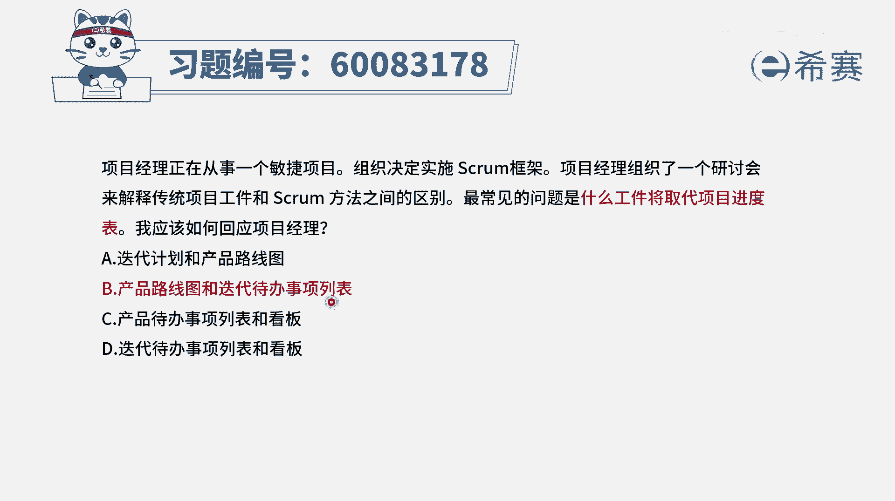
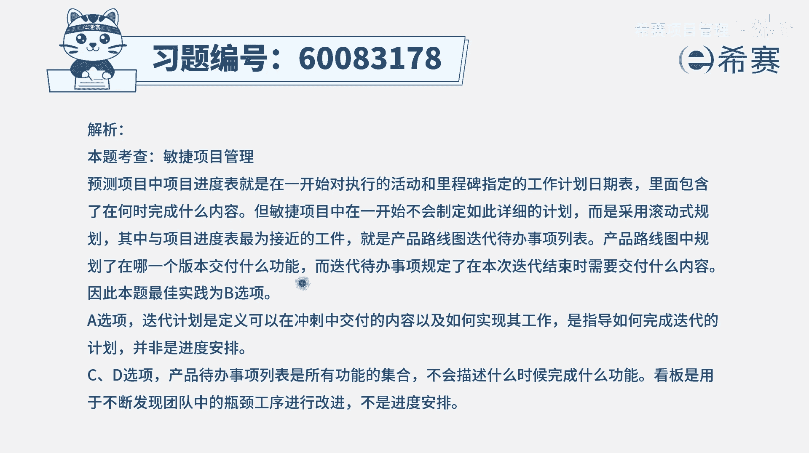

# 【重点推荐】2024年PMP项目管理 100道新版模拟题精讲视频教程、讲解冲刺（第14套）！ - P43：60083178 - 希赛项目管理 - BV1wz4y1q7Az

项目经理正在从事一个敏捷项目组织，决定实施rm的框架，项目经理组织了一个研讨会，来解释传统项目工件和scram方法之间的区别，最常见的问题是什么，弓箭将取代项目进度表，我应该怎么样去回应项目经理呢。

那其实他就是在做一个类比对吧，在敏捷中，在scrum中有什么弓箭，它能够去替代掉这一个项目进度表的位置，那我们得知道项目进度表它是干什么的，项目进度表中能够看到项目的一个进展情况。

也就是说它既包含了项目的进度计划，也包含了项目的进度跟进的这样一些情况，有了这个认知以后，我们再来看这四个选项选项，一种迭代计划和产品路线图，产品路线图它会列出我们整个这个大的产品，它的一个大致规划。

我可能什么版本中会包含什么功能，什么版本中包含什么功能啊，这样的话有个粗略的一个一个大致的时间表，但他没有给出具体的时间，而迭代计划呢是说这一轮迭代中，我们将要做什么的这样一个计划好。

第二个选项是产品路线图和迭代代办事项列表，那点产品路线图前面已经看过了，不再重复，那迭代代办事项列表，它就是列出来我们这一轮迭代要做的事情，并且呢会去展现他的这个完成的情况。

还有包括说这些各具体工作安排，都会列到这里面，也就是说它既包含了这个迭代办的事项，也包含了这个迭代计划以及跟执行的这些情况，都可以在这里有所展现好，第三个呢是产品待办事项列表和看板。

那看板呢是能够看到我们这一轮迭代，所要做的事情的一个进展情况，而叠产品代办事项列表示我们整个要做的事情，他只列了整个要做的事情，但是没有一个时间的概念好，最后一个迭代代办列表和看板。

那迭代代办列表是我们本轮迭代要干的事情，看板呢也只一般就是指我们本来要干的事情，所以这样看下来的话，它是重复的，就是这两个事其实讲的都是本轮迭代的事情，而这个呢他讲的这一轮迭代要干的事情。

是可以从这里看到，但是总体的项目的一个技能情况，这个并不能看到，它只是列出来事情，但是没有给出一个大致的一个时间，而这两个的差别就是产品路线图，它确实能够给出一个大概的一个时间。

就是我在什么版本中包含什么功能，同时呢而迭代代当列表里面的东西，它超过了迭代计划，它既包括迭代计划，也包括代做的列表，也包括它的这个进展情况，它在一定程度上能够去达到，这个所谓的叫进度表的这一个能力。

所以呢答案是选第二个，也就是用我们的这个产品路线图，来看到一个大方向的这些功能，它的一个节点，然后再有一个迭代加班列表，来看到这样一个具体的迭代。

它的这个计划，那文字版解析。

