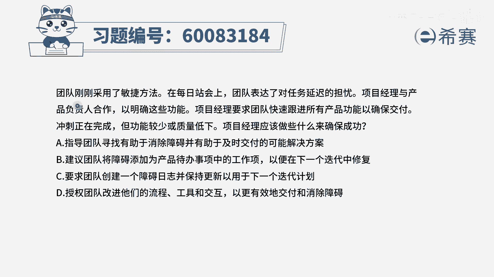
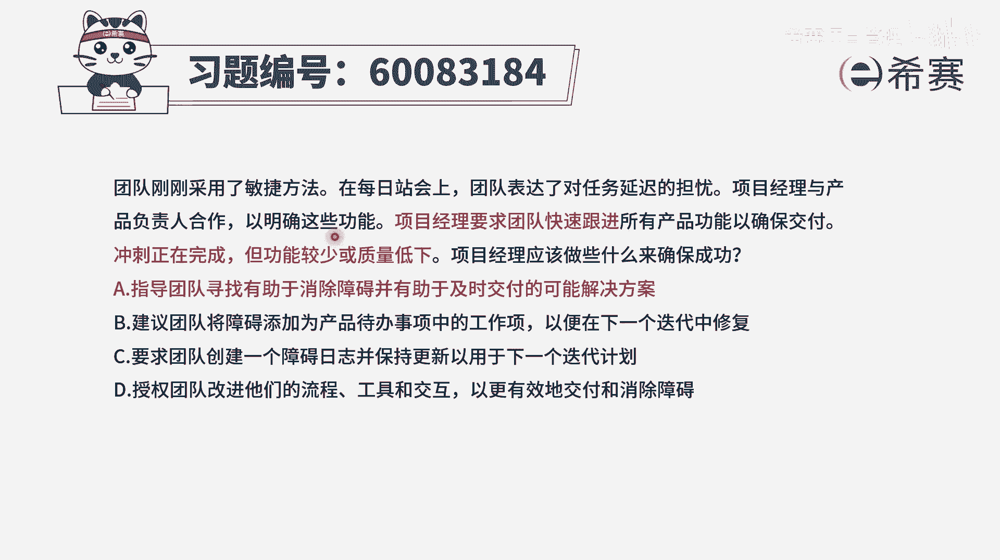
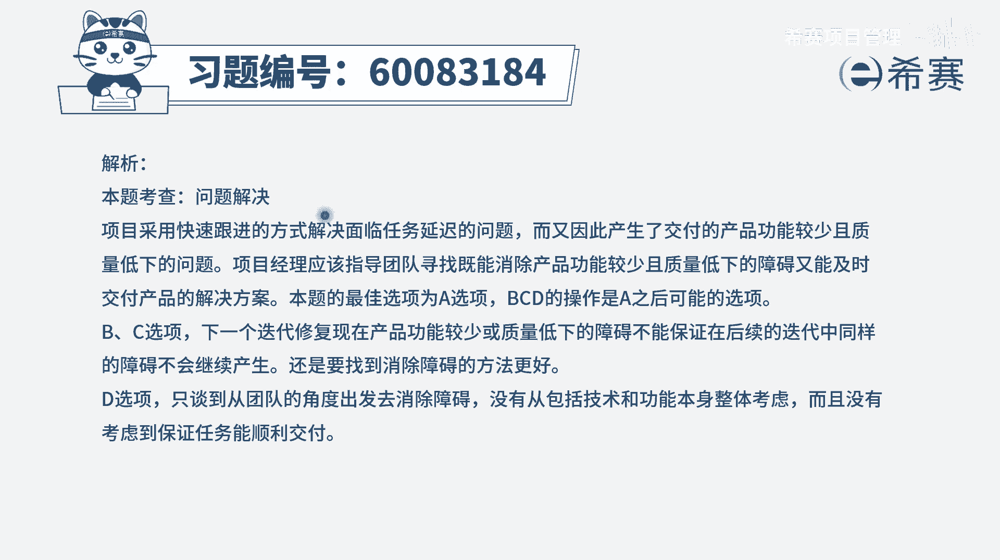

# 【重点推荐】2024年PMP项目管理 100道新版模拟题精讲视频教程、讲解冲刺（第14套）！ - P46：60083184 - 希赛项目管理 - BV1wz4y1q7Az

团队刚刚采用了敏捷方法，团队表达了对任务延迟的担忧，项目经理与产品负责人合作，已明确这些功能，项目经理要求团队快速跟进所有产品功能，以确保交付从事正在完成，但功能较少或质量低。

一项项目经理应该做些什么来确保成功，这个题目其实表达是有点问题的，就是项目经理在前面呢表达了一个错误的方式，用快速跟进的方式让大家快速地做更多的事情，结果做的也不多，并且呢质量又不好，那么这个时候。

项目经理应该做些什么来确保成功，其实告诉我们是说，应该用什么样的方式才是正确的方式，能够去更好地引导项目走向成功，我们看一下四个选项啊，选项a指导团队去寻找有助于消除障碍。

并且有助于及时交付的可能解决方案，现在没有告诉我们具体该怎么样去做，但是他指明了方向，而这个方向的绝对是正确的，所以它是一个正确的选项啊，找个记号是一个可选项好，b选项，建议团队将障碍添加为产品。

待办事项目中的工作项，以便于在下一个迭代中修复，那这种障碍作为一个待办事项，在下一个迭代中期修复呢，它相对来讲时间会更晚一些，第三个选项要求团队创建一个障碍日志，并保持更新，以用于在下一个迭代计划中。

这也是一种就相对来讲会比较靠后，才能够去解决的，而不是在当下马上想办法来解决，最后一个选项，授权团队改进他们的流程工具和交互，以更有效的去交付和消除障碍，首先敏捷团队本身是一个自组织团队。

那他如果有这个能力，能够去比较好的来交付的话，就不会产生题干中所列的这些问题，所以这个时候其实在一定程度上，是需要你这样一个敏捷教练来出手来帮助他们，所以a选项指导团队去做这样一些事情。

和d选项授权团队去做这个事情，那么肯定是a选项会更好一些，因为目前团队从题干所表现出来的，应该是能力不太强，还需要一些帮助他，那个又任务延迟，同时质量又低下，交付的功能又比较少对吧。

所以能力不足选a会比选d更合适，那至于说b和c呢，他都会是延误，到了后期就往后面延误了，没那么直接的去面对这个问题，去解决问题，答案是选a，那文字版解析在这里。

