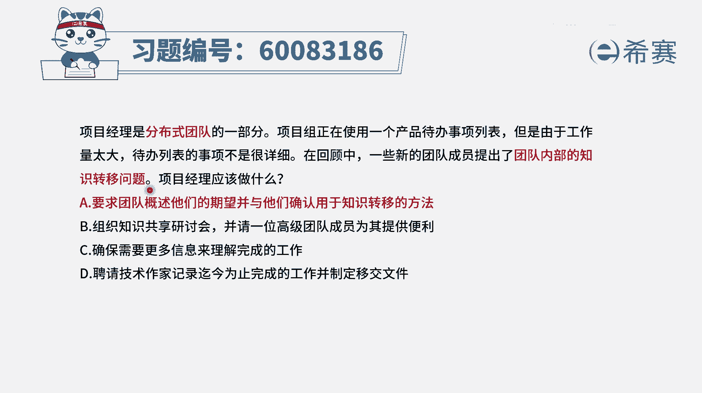
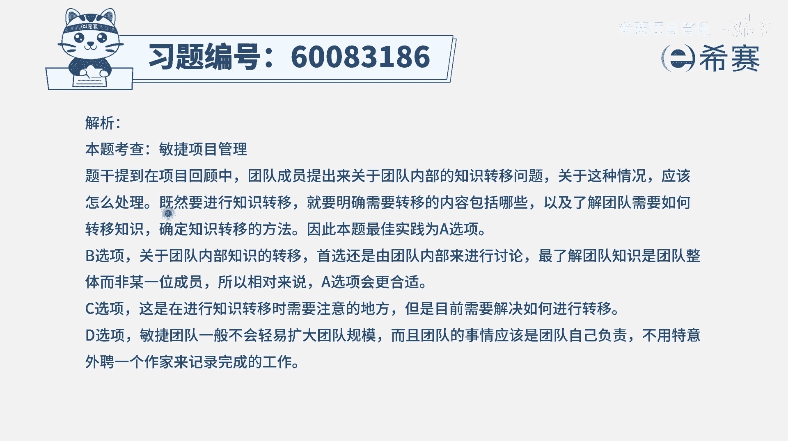

# 【重点推荐】2024年PMP项目管理 100道新版模拟题精讲视频教程、讲解冲刺（第14套）！ - P47：60083186 - 希赛项目管理 - BV1wz4y1q7Az

项目经理是分布式团队的一部分，项目组正在使用一个产品待办事项列表，但是由于工作量太大，代办事项列表不是很详细，在回顾中，一些新的团队成员提出，团队内部的知识转移问题，项目经理应该做什么。

那这个题干呢其实第一句话有点不通顺啊，什么叫项目经理是分布式团队的一部分，但它其实给到我们一个重要的信息，就是这个项目是一个分布式团队的项目，或者是一个虚拟团队来去做事情的这种情况，然后在回顾中。

也就是迭代回顾会议上，有成员去提出了关于团队内部的之间，一个知识转移的问题，那我们通常情况下是要深入的讨论这个问题，讨论他的这样一些前前后相关的，尤其是还可以去讨论出关于大家的这些想法呀，期望啊。

解决方案啊之类的会更好一些，因为涉及到自己内部做这些事情，所以优先是自己内部讨论，而不是去找那种外语言，当我们讨论清楚了以后，如果还找不到解决方案的时候，再去找外援是合适的，那我们来看一下四个选项。

选项a要求团队概述他们的期望，并与他们确认用于知识转移的方法，这就是我们去收集更多的信息，以及讨论一些解决方案的这一种方式，刚好是合适的选项，b组织知识共享研讨会，并请一位高级团队成员为其提供便利。

这其实讲的是说我们去寻求外部的支持，通常情况下，当我们团队内部搞不定这样一个事情的时候，我们可以去请求外部的支持，但是敏捷团队一般是优先自己内部先去完成，我们是一个自组织团队，是自我组织。

自我管理的这种方式，所以一定是把a完成以后再去做b，这种情况就是当a搞不定的时候，再去做b的这种情况，好答案c，确保需要更多的信息来理解完成的工作，这个肯定是有帮助，但是也不是焦点，焦点是我们先去。

既然有人提出来关于知识转移的问题，我们去把这个话题给聊清楚好，最后一个选项答案d，聘请技术作家记录迄今为止所完成的这些工作，并且制定这一个宜家的文件，这个就完全无视题干中所列出的问题。

题干列出是团队内部的这些知识转移该怎么弄，所以这道题目的答案是选a选项，既然有人提出关于知识转移的问题，我们去了解清楚关于这个问题，他们到底想法是什么，需求是什么，期望是什么。

以及我们可以用什么样的方式。

来去解决这样一个问题，这是合适的，那文字版解析在这里。

