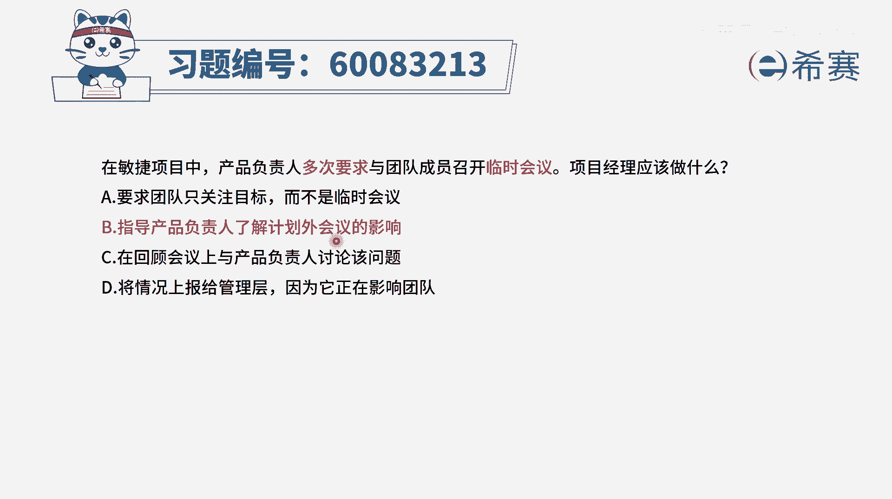
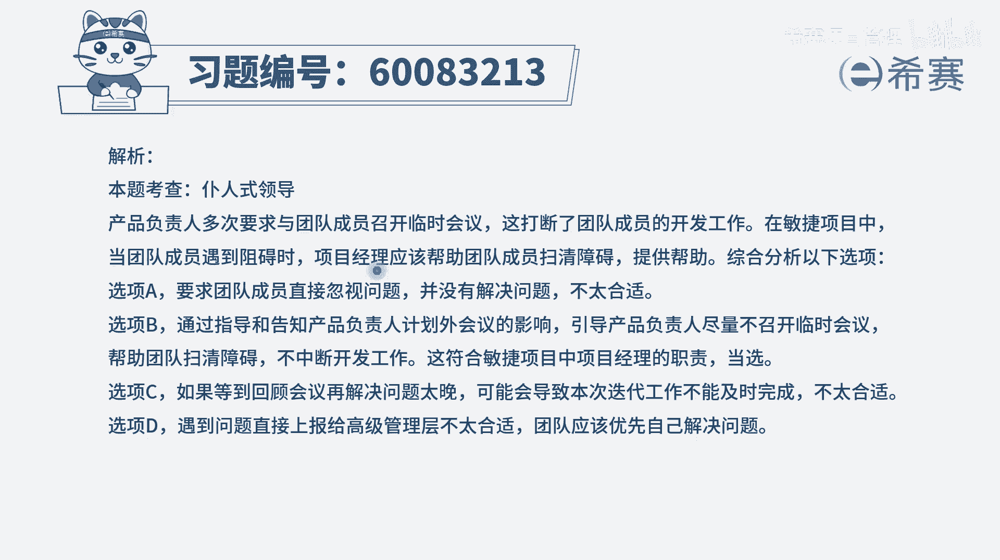

# 【重点推荐】2024年PMP项目管理 100道新版模拟题精讲视频教程、讲解冲刺（第14套）！ - P50：60083213 - 希赛项目管理 - BV1wz4y1q7Az

在敏捷项目中，产品负责人多次要求与团队成员召开临时会议，项目经理应该做什么，那很显然题干中所讲的这样一个事情呢，他不是什么好事对吧，不应该这样去做，这样可能会干扰到团队成员，而你作为项目经理。

你作为一个仆人式领导，你是要帮团队去清除障碍，去消除障碍，有了这样一个认识以后，我们再来看一下四个选项就会容易看很多，首先第一个要求团队只关注目标，而不是临时会议，这个事情是团队可以做决定的吗。

很显然是产品负责人来要求团队开会的，而不是团队，你想开就开，你想不开就不开，所以它不能够从根本上解决问题，我们如果要去解决一个问题，应该是从源头出发，所以这个肯定不是一个正确选项。

选项b指导产品负责人了解计划外会议的影响，也就是告诉他，你去做这些临时会议，对项目其实是会有一些影响的，那这个很显然是一个可选项，他虽然没有讲的那么明确切切，但是呢它是一个可选项，你作为候选项打个圈。

c选项在回顾会议上与产品负责人讨论该问题，那我们知道，一般回顾会议呢是在这一轮迭代将要完成的时，候，在迭代的后期，所以他时间上可能会有点晚，而我们要解决问题，尽量是在比较能够快一点去解决会更好一些。

所以不选他，他也不做一个正确选项啊，最后一个题目将情况上报给管理层，因为它正在影响团队，一般情况下只有什么事情才会上报给管理层呢，只有到那种什么啊，这个电子着火了呀，然后一些不得了的事情呢。

进度严重拖延呢，嗯就是发现很重大事故，我们才会去商贸管理层，一般大部分的这样一些事情，都应该是你项目经理可以去搞定的，而题干中说的开建一个临时会议，这个虽然对团队有一些影响。

但他不算什么严重的不得了的事情，都应该是你自己就可以解决的，所以这也是一个错误选项，那我们已经知道a不能选cd，也不能选a，b是一个可选项，那就只有b选项是这个题目的正确答案。

那么这些题目它考察的其实就是项目经理，你作为一个仆人式领导，当团队受到影响的时候，你要帮团队去清除障碍，而清除障碍呢应该是从源头出发，这个题目中的那个问题，源头是产品负责人，他没搞清楚情况。

总是召集团队来开临时会议，那你就需要去指导他，你需要去告诉他开建一些临时会议，开建一些计划外的会议是有一些不好影响的。

那文字版解析。

