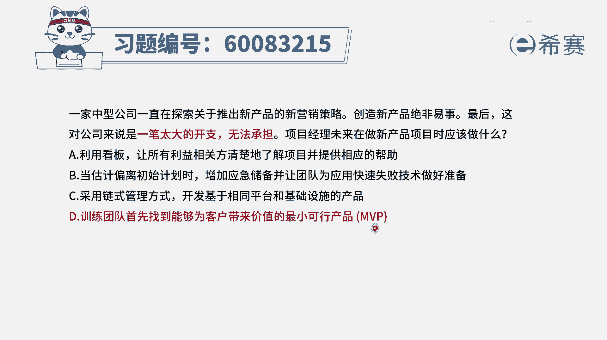
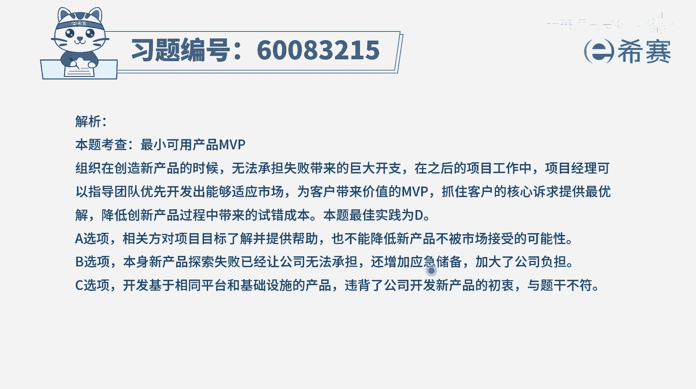

# 【重点推荐】2024年PMP项目管理 100道新版模拟题精讲视频教程、讲解冲刺（第14套）！ - P51：60083215 - 希赛项目管理 - BV1wz4y1q7Az

一家中型公司，一直在探索关于推出新产品的新营销策略，创造新产品绝非易事，最后这对公司来说是一笔太大的开支，无法承担，项目经理，未来在做新产品项目的时候应该做什么，你光是看到这个点。

其实你可能会有点像和尚，摸不着头脑，不知道他要干什么东西对吧，我们先看一看四个选项，选项a说是利用看板的方式，让所有的利益相关方能够清楚的去了解到项目，并且去提供帮助，可是题干中并不是说的大家没有了解。

而是说创造新产品绝非易事，需要花太多的钱好第二个选项，当估算偏离初始的计划的时候，增加应急储备，病人团队能够为应用快速失败技术来做好准备，请注意提高中重点，也不是说估算偏离初始计划。

题干能说的就是这个东西太难了，要花钱太多了，第三个，采用链式管理方式，开发基于相同平台和基础设施的产品，呃虽然不知道链式管理方式是什么意思，但是后面做了一个解释，也就是开发基于相同平台和基础设施的产品。

而这句话跟题干中，要推出新产品的新的营销策略是刚好反过来的，所以也不合适，最后一个选项，训练团队，首先找到能够为客户带来价值的最小可行产品，诶，这就能够刚好在一定程度上解决，说我们要去做一个新产品创新。

结果开支太大，就是你要去完整的把这个新产品全部都做出来，它是一个很有挑战性的事情，但是我们可以先去做一个mvp，这个呢花的钱可能只有他的1/10，甚至1/20，只要花一些些的钱。

他对于这样一个中型公司来讲，应该说是那压力就是小很多对吧，并且如果说是这样一个最小可行产品，是客户所能够接受的，也是客户所期望的是他们所需要的，我们再往里面去砸钱，他就避免了这种说呃。

要花很多的钱去做一个事情，又不知道未来是能成还是不能成的这个风险，所以这个题目的答案就是选d选项，就是当建一个项目太大了，让我没有办法去下手的时候呢，我们可以考虑来，先去做一个很小的东西来试一试水。

我们先去试探一下，先去做一个最小的mvp来去试一试。

那文字版解析在这里。

