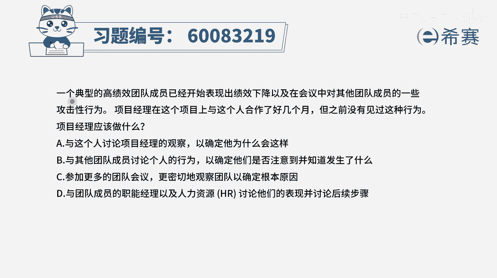
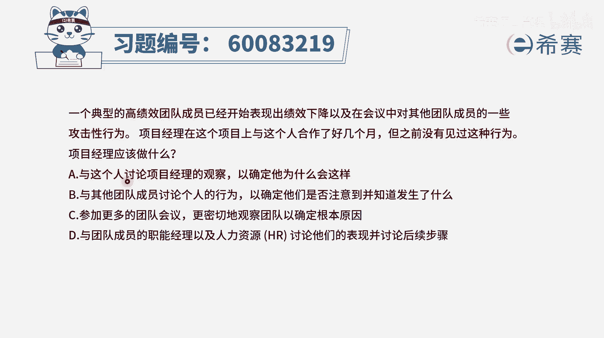
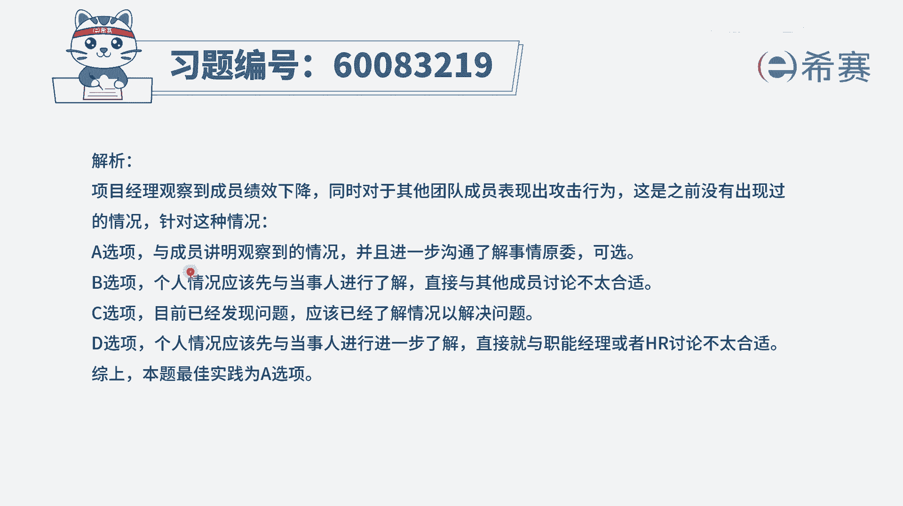

# 【重点推荐】2024年PMP项目管理 100道新版模拟题精讲视频教程、讲解冲刺（第14套）！ - P52：60083219 - 希赛项目管理 - BV1wz4y1q7Az

一个典型的高绩效团的成员，已经开始表现出绩效下降，以及在会议中会对其他的团队成员的一些攻，击性行为，项目经理在这个项目上呢，与这个人合作了好几个月，但之前没有见过这种行为，那项目经理应该做什么。

首先我们要了解一下，这个人之前是高绩效团的成员，而现在呢他的绩效下降了，并且他还会有一些对其他人的攻击性行为，那既然这种行为是之前没有过的，好几个月都没有出现过，现在突然出现了，那你肯定得要去了解情况。

分析原因，然后再找到解决方案，这个思路一定是这样的一个思路，对不对，那我们就来看一下四个选项，选项a与这个人讨论我自己所观察到的，来确定他为什么会这样，就是这个题目这个选项有点怪啊。

说讨论项目经理观察到的，其实也就是说是这个项目经理自己所观察到的，对不对，你作为项目经理，你都要去跟他讨论一下你所看到的这个行为，然后问询他诶这是怎么了，是发生了什么事情吗之类的。

那这肯定就是一个很好的一个选项了啊，这是一个好选项，而b选项与其他的团队成员讨论这个人的行为，来确定他们是否注意到了，便知道发生了什么，这个就是隔了一层去了解，你隔一层去了解，会让大家引起很多的误解。

会觉得是不是你对这个人有什么样一些，大的意见啊，想法呀之类的，对不对，所以一般不会这样去做，并且很多时候我们说如果有问题，尽量是从源头出发，既然是某一个员工，他从高绩效变成一个低绩效。

那是他发生了什么事情，你直接去找他，而不是去找旁的人，所以这个b选项永远都不会作为一个好选项，好c选项参加更多的团队会议，更加密切的去观察团队，以确定根本原因，首先是你以前跟他已经跟他合作过好几个月。

之前没有这种行为，你现在已经是识别到这种行为，你既然已经识别到了，你再观察，只是继续去识别的更深入一点，而现在要做的是，你要去分析一下原因到底是什么，了解情况到底是什么导致的。

所以已经识别到这个问题以后，更好的方式是去问询原因，找寻解决方案，而不是继续去观察好最后一个选项，与团队成员的职能经理以及人力资源，来去讨论他的表现，并讨论后续的步骤，请注意哦。

一般情况下我们说这种矩阵型的团队，他能成为有一些事情呢，啊我们是可以去找他的职能经理的，但是这个题目会有一些不一样的，是什么呢，是项目经理在这个项目上，跟这个人都合作了好几个月。

并且这个人他之前是高绩效的团队成员，他之前从来没有过对别人的一些攻击性的行为，说明他的能力非常好，同时呢他的这些待人接物，他的这样一些行为处事也是比较职场的，比较职业化，比较成熟的，那么这种情形下。

其实职能经理给你的这个人，已经是一个非常棒的一个人，而在这种时候，他出现了某一些特殊的问题，你更多的应该是自己来去了解，而不是再去找这些职能经理，所以呢这样看下来直只有a选项是可以选。

就是你自己亲自来跟这个人讨论讨论交流交流，来了解到底是发生了什么事情，导致他有这样的一个情况的发生。

那文字版的解析呢。

