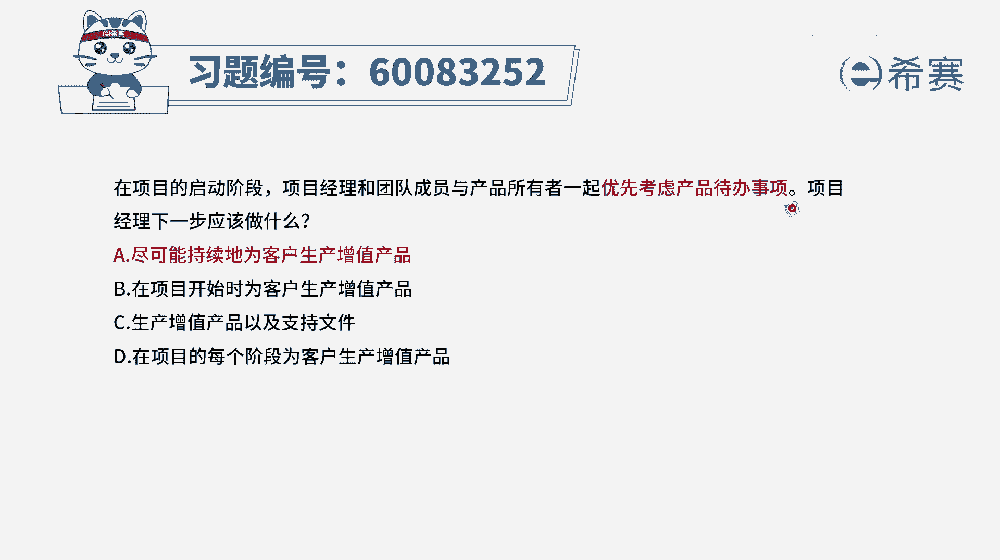

# 【重点推荐】2024年PMP项目管理 100道新版模拟题精讲视频教程、讲解冲刺（第14套）！ - P62：60083252 - 希赛项目管理 - BV1wz4y1q7Az

在项目的启动阶段，项目经理和团队成员与项目的所有者一起，优先考虑与产品待办事项，项目经理下一步应该做什么，你光是看到这个题干问题，其实不太知道说下一步到底该做什么，但是你看完四个选项以后。

你就能够快速的选择出来，为什么呢，因为四个选项他都是讲的为客户生产增值产品，只是a选项，也是尽可能持续的为客户生产增值产品，而b选项的是在开始的时候，来为客户生产增值产品。

而c选项是生产增值产品以及支持性的文件，而d选项的是在项目的每一个阶段，为客户来生产增值产品，那么通常情况下我们需要有这样一个思路，或者说是有这样一个逻辑，就是为客户提供这些增值产品，它不应该是某一段。

它应该是一个持续的过程，所以答案是a选项，就是我们应该要持续的来为客户生产增值产品，并且呢在整个敏捷中，他也是提倡的去增量交付，那交付的都是有用的东西，也就是所谓的增值产品能够为客户产生价值。

并且在敏捷的原则中有第一条，就是尽早的持续的交付，对客户来讲是有价值的，软件，所以答案是选a，但是你怎么样就知道他是一个敏捷项目呢，因为体育干中会特别讲到产品所有者，其实就是product owner。

就是p o这样一个角色，还有呢就是产品代办事项，通常我们在预测型项目管理中不会这样去叫，在敏捷中才会专门去找到这个产品待办事项，所以在敏捷里面的话。

我们是持续的为客户创造价值来选项，那文字版解析。

