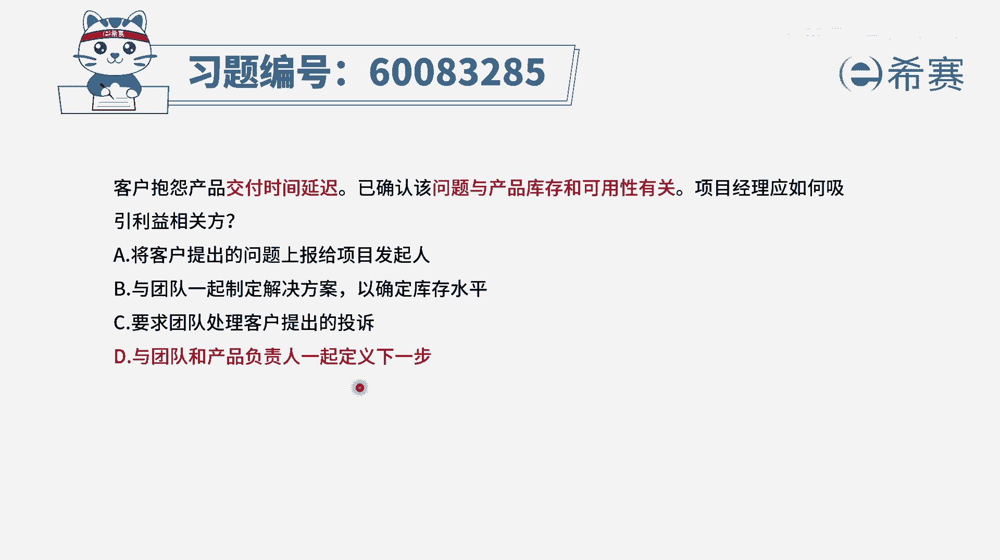
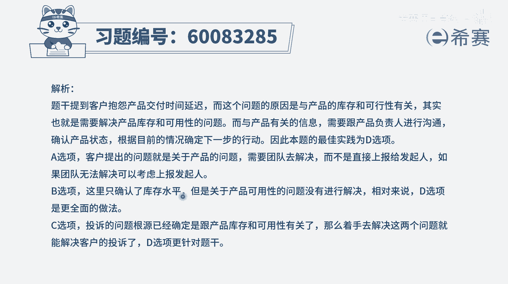

# 【重点推荐】2024年PMP项目管理 100道新版模拟题精讲视频教程、讲解冲刺（第14套）！ - P69：60083285 - 希赛项目管理 - BV1wz4y1q7Az

客户抱怨产品交付时间延迟，已经确定该问题与产品库存和可用性有关，项目经理应该如何吸引利益相关方呃，这里面呢其实有一些词汇我们不太懂不太懂，他也不影响你做出正确的选项，有一些敏捷的题目就是这么神奇啊。

我们来看一下他说项目延迟的问题是什么，是因为呃与产品的库存和可用性有关，我们来简单解释一下什么叫跟产品的库存，应该是说待开发的这些功能的数量，而可用性呢通常我们说一个产品的可用性，其实不是说它能不能用。

而是说它易不易用，就是是不是很容易用，是不是比较容易上手，然后用起来会不会觉得很顺手啊，很丝滑呀，然后它的这种耐用性怎么样呢，一些容错性呢之类的，所以它其实你可以把它理解为，说是一种验收的要求啊。

所以就是目前的这样一个东西啊，就一个是说要做的东西可能太多，还有一个呢，就是可能没有达到它所对应的这一个需求，那么在这种情况下，谁来负责去跟利益相关方去对接会更好一点呢。

一般是po产品负责人这样一个角色，他来跟客户去对接会更好一些，那我们来看一下这四个选项，选项a将客户提出的问题上报给项目的发起人，那么这点事情你就专门给发起人，让你干什么对吧，不合适啊，永远都不合适好。

第二个选项与团队一起来去制定解决方案呃，已确定库存水平，你看他这边也只说的是已确定库存水平，他也没有讲到关于产品的可用性的问题，那肯定没有完全解决，并且很多事情呢谈的是负责去落实去实施。

但是我们更多的是先要去拿出一个方案出来，然后这个方案拿出来以后呢，还需要去跟客户去确定，那么这个事情的话，一般是由p o来去参与会更好一些，因为他是这个项目的代言人，客户代言人。

他同时也是这个项目的掌舵者，就整体的做事情走向掌舵者，还包括说最后做完了，结果他到底验收通过不通过，那他也是一个验收者，所以一般有po来讲会更好一些，第三个选项要求团队处理客户提出的投诉。

这个呢其实不能说有问题，但是通常情况团队更多是负责去做为主，他虽然有一定的自主权，我们说团队是一个自组织团队，但是他的这样一个自组织，更多的是说哎我们已有的这些事情里面，哪一些怎么做。

以及谁来去做他的一个自由裁量权，但是到底该做什么，哪些东西更重要，这应该是p o来去做最终的拍板和决定，我们来看一下最后一个选项，与团队和产品负责人一起来定义下一步，那这很显然有了产品负责人参与进来。

这个事情会变得更加顺利一些，因为他就是一个拍板做决策的人，做决定的人，所以这道题目的答案呢是选最后一个选项，虽然c你不能说他错，但是呢他肯定不及d选项那么好，d选项就是有这个重要的角色，产品夫人在这里。

并且通常情况下，我们整个在做项目的时候，到底该做哪些不该做哪些，哪些优先哪一些，其次然后做到什么程度才算是ok，这都应该是p o来去做拍板决定，也就是产品负责人。

答案就选d，那文字版解析在这里。

