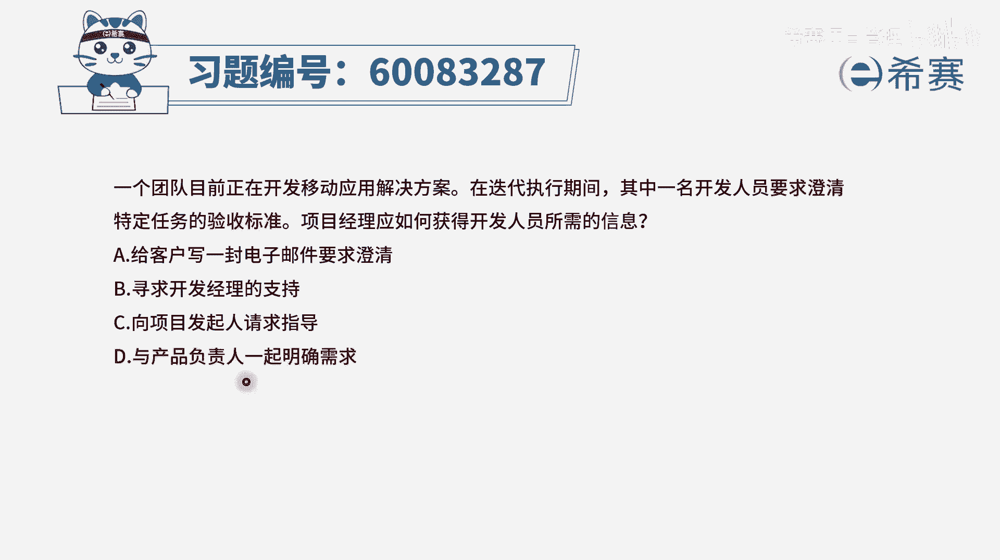
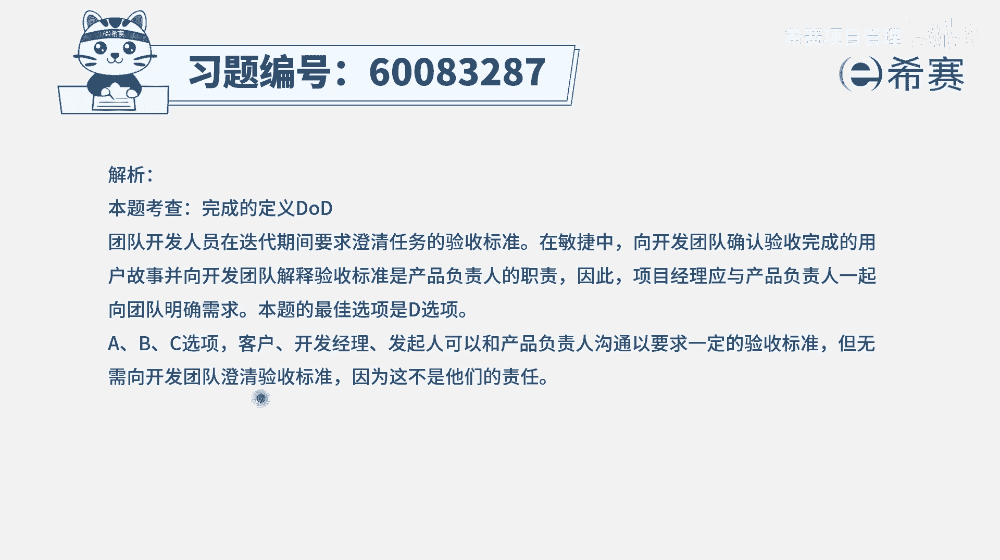

# 【重点推荐】2024年PMP项目管理 100道新版模拟题精讲视频教程、讲解冲刺（第14套）！ - P70：60083287 - 希赛项目管理 - BV1wz4y1q7Az

一个团队目前正在开发移动应用解决方案，在迭代执行期间，其中一名开发人员，要求澄清特定任务的验收标准，项目经理应该如何获得开发人员所需要的信息，那么首先第一个就是在迭代期间。

其实它在告诉我们是用敏捷的方式来做项目，然后呢，题干中所谓的是，要澄清这些特定任务的验收标准，也就是我们经常会有一个词，叫d o d完成的定义，那完成定义通常是谁来定呢，一般是产品负责人。

他带着团队一起来定，并且是以产品负责人为主，有了这个认识以后，我们再来看四个选项，选项a给客户来写一封电子邮件来要求澄清，也就是说让客户来澄清对吧，通常情况下我们说有一个更好的角色叫po。

他来负责会更合适，第二个呢是寻求开发经理的支持，那开发经理它是会负责，把你的需求去转变为代码的这样一个角色，而你现在要做的事情是把这个需求给搞搞清楚，所以不是开发经理干的，第三个选项。

向项目发起人来请求指导，那这些具体项目上的事情不应该是找发起人，而最后一个选项刚好就是正确答案了，你看到与产品负责人一起来明确需求，因为关于需求的事情呢，一般是产品负责他来去定义。

他作为客户的代言人来做这样一些事情，所以这个题目的答案是选最后一个选项，如果说关于某一个需求，它的验收标准不清晰，他的完整定义不清晰，应该是po产品负责，他来一起参与，那文字版解析。

