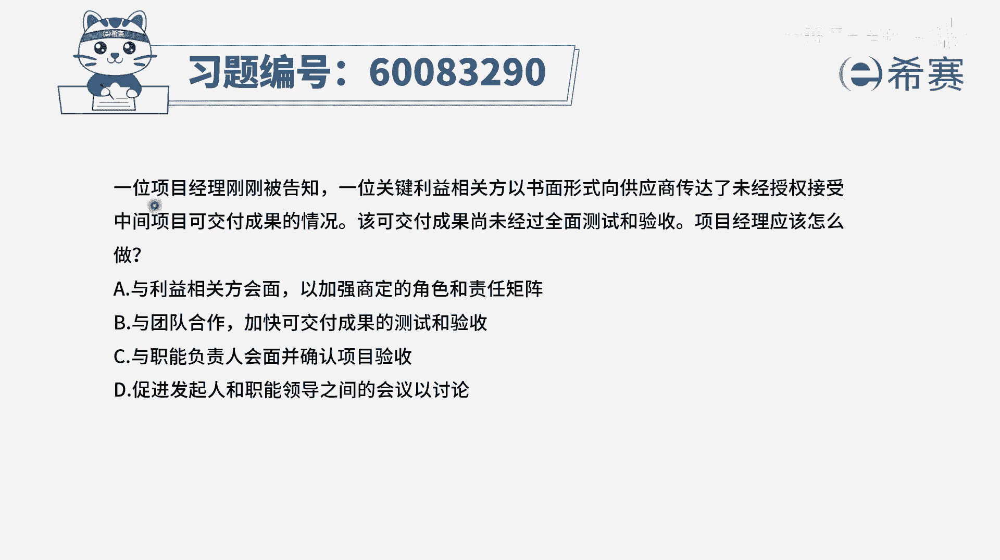
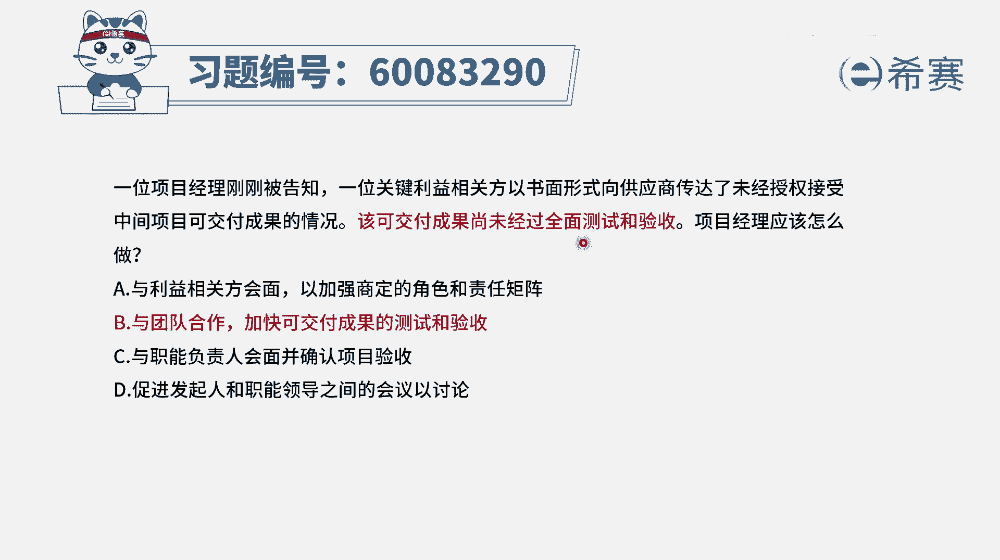
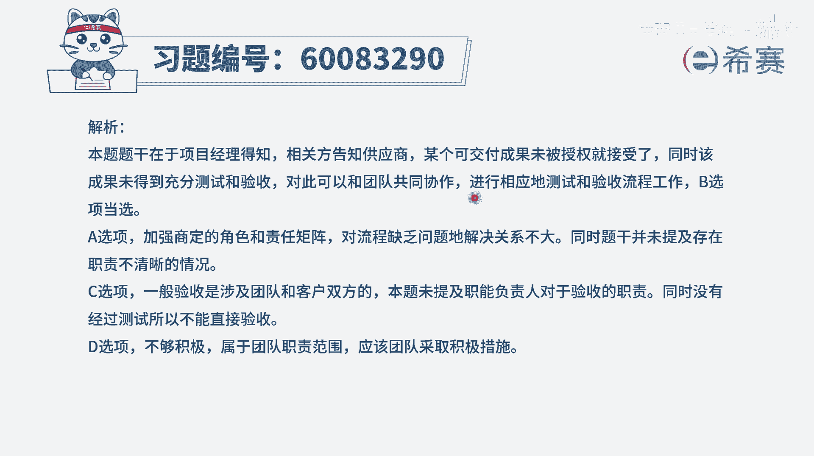

# 【重点推荐】2024年PMP项目管理 100道新版模拟题精讲视频教程、讲解冲刺（第14套）！ - P72：60083290 - 希赛项目管理 - BV1wz4y1q7Az

一位项目经理刚刚被告知，一位关键利益相关方，以书面形式向供应商传达了未经授权，接受中间项目可交付成果的情况，该可交付成果尚未经过全面的测试和验收，项目经理应该怎么做这个题目呢，其实说实在的。

中间这一句话呀，你可以觉得可能会看不懂，而什么叫以书面的形式向供应商传达了，未经授权接受中间项目可交付成果的情况，到底是什么意思，它有多种奇异的理解，但是这个题目它有一句关键词，就是见一个可交付成果呀。

目前还没有经过全面的验收，没有经过全面的测试，那既然还没有经过全面测试和验收，现在又已经是好像要去啊分享给别人，那我们应该要抓紧时间来，去完成这样一个测试和验收，这这就是这个逻辑好。

有了这样一个逻辑以后，我们再来看四个选项，选项a与利益相关方会面，以加强商定的角色和责任举证，那这个角色责任举证这个事情，通常情况下我们确实是需要去清晰，谁负责做什么，谁负责做什么，但是题干的焦点。

其实不是说他做了不该做的事情，而是这样一个事情，他没有经过测试和验收，这个是焦点，所以a选项跟题干完全不匹配好，第二个选项与团队合作，加快可交付成果的测试和验收，这刚好就是跟题干的这个内容完美的去匹配。

去解决，所以呢它其实就是这个题目的正确答案的啊，是绝对式的，第三个选项与职能负责人会面，并确认项目的验收，通常情况下，我们在验收之前先要做内部的测试，我们在结构化项目管理中其实也有学过。

先进行这样一些个内部的测试，或者说是内部的控制质量，然后再进行有客户参与的这些验收，或叫做有客户参与的这样一个确认范围，所以是有先和后的顺序，那一定是要先经过内部的测试，然后再做验收的事情。

而c选项是跳过来测试好最后一个选项，促进发起人和职能经理之间的会议讨论诶，这完全没有去面对题干中的问题，题干中是没有进行测试和验收啊，所以这个题目只有b选项，刚好是完美的匹配题干中的问题。

那文字版解析在这里。

