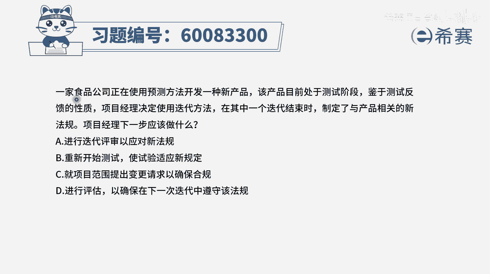
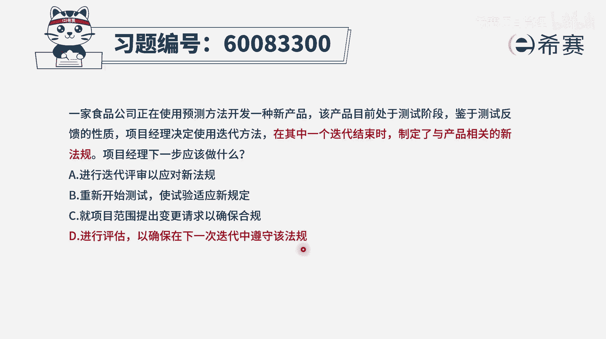
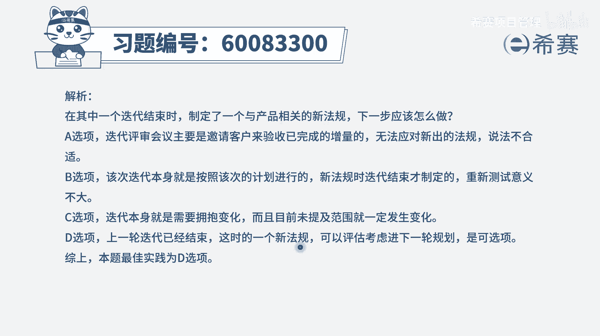

# 【重点推荐】2024年PMP项目管理 100道新版模拟题精讲视频教程、讲解冲刺（第14套）！ - P76：60083300 - 希赛项目管理 - BV1wz4y1q7Az

一家食品公司正在使用测试方法，来开发一种新产品，该产品目前是处于测试的阶段，鉴于测试反馈的性质，项目经理决定使用迭代方法，在其中一个迭代结束时，制定了与产品相关的新法规，项目经理下一步应该做什么。

其实这个题目呢它有一个地方不清晰，就是到底谁制定了，这样一个与产品相关的新法规，但是不管是谁制定了这个与产品相关的新法规，我们都要去接受，都要去遵守，我们要有这样一个合规性，有了这个认知以后。

我们再来看a选项进行迭代评审，以应对新法规，我现在在这个迭代快要结束的时候，才制定了新的法规，而我这个能迭代做的事情，是按照我上一轮计划所干的，所以他能够去满足这个新法规吗，估计概率不大。

所以你省不省也没什么用，所以这个不合适，b选项重新开始测试，是试验适应新规定，这很显然就不合适，因为这是在这一轮迭代的时候，你才确定了一个新的规则，你在开始之前又没有定位则。

所以这一轮他都没有办法说是完全响应它，所以你测不测基本上概率都不大，好第三个选项就项目范围提出变更请求，以确保合规性，现在没有讲到范围的变化，他讲了一个新的法规，可能就是某一些事情该如何去做。

或者说是质量标准要求是什么，所以这个不合适啊，而最后一个选项进行评估，以确保在下一次迭代中遵守该法规诶，这是可以的，因为本身我们就是在一个迭代结束的时候，定了新的法规，我们在下一个迭代开始的时候。

我们尽量去遵守这样一个新的法规，这是合情合理的，所以呢答案是选d选项，那文字版解析在这里。

