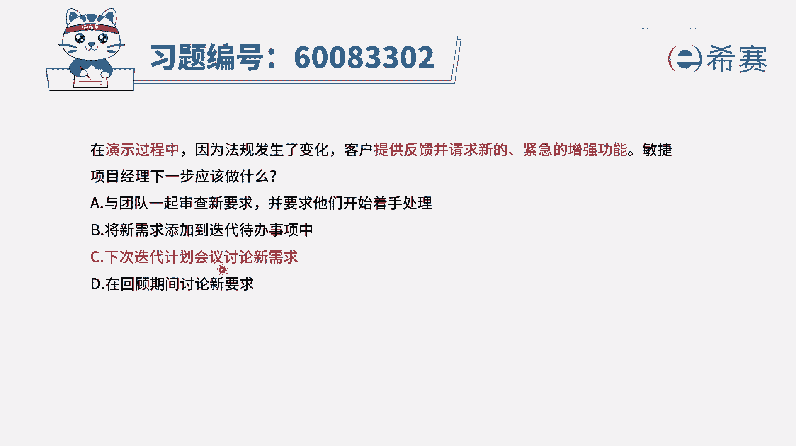
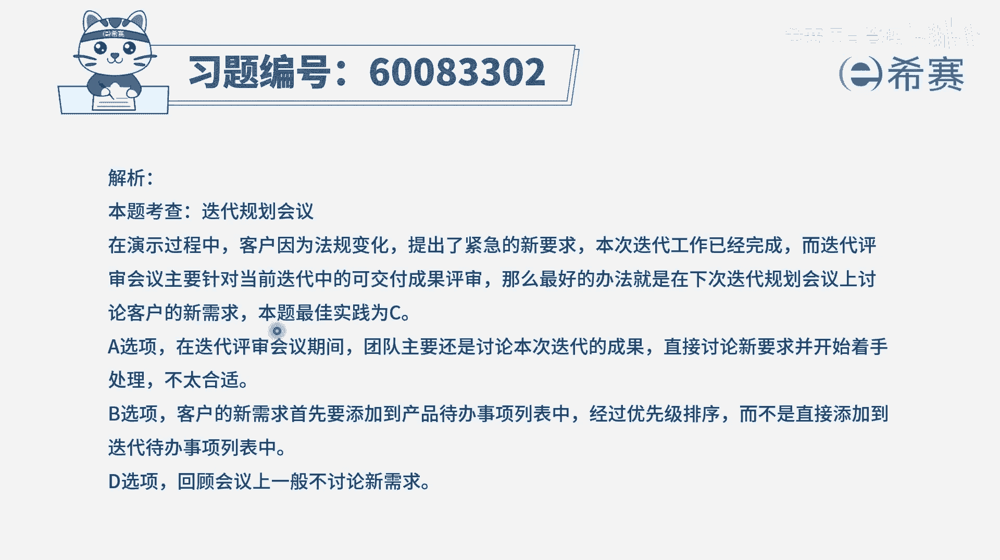

# 【重点推荐】2024年PMP项目管理 100道新版模拟题精讲视频教程、讲解冲刺（第14套）！ - P77：60083302 - 希赛项目管理 - BV1wz4y1q7Az

在演示过程中，因为法规发生了变化，客户提供反馈，并请求新的紧急的增强功能，敏捷项目经理下一步应该做什么，那这种情况首先你一定要知道场景啊，他的时间是在演示过程中，其实也就是迭代评审会议期间。

在迭代评审会议期间，客户提出了一些新的功能需求，而我们敏捷是拥抱变化，并且会特别重视客户的反馈，所以呢他所提的反馈，并且他觉得格外重要的事情，我们肯定是需要去做的，那我们什么时候开始着手去做呢。

来看一下这四个选项，选项a与团队一起审查新的要求，并要求他们开始着手处理，而目前还处在这一轮迭代收尾的时候，这一轮你带我们做完评审以后呢，还要进行一个回顾会议，所以这个时候就马上开始做，肯定是不合适。

第二个将新需求添加到迭代代办事项中，那迭代代办事项，也就是说这一轮迭代要做的事情，而这个时候都已经是在迭代快要结束的时候，应该是放到下一轮迭代中会更合适，第三个选项，下次迭代计划会议上来讨论性的需求诶。

这刚好是一个很好的契机，目前在上一轮迭代快要结束的时候，大家提了新的需求，我们收集起来，在下一轮迭代开始的时候，我们去讨论它，把它放进来，这是完全ok完全符合的，最后一个选项，在回顾期间来讨论新的要求。

通常我们做完迭代评审会议以后呢，还会有一个迭代回顾会议，而这个迭代回顾会议，他主要干的事情是去回顾这一轮迭代中，做的好的和做的不好的，以及对于做的不够好的地方，我们在下一轮有什么样的一些改进措施。

改进计划并不会去讨论性的需求，所以在这里面不合适，这样看起来只有c选项，在下一次迭代计划会议上来讨论要求，这是刚刚好，所以答案是选c。

那文字版解析在这里。

