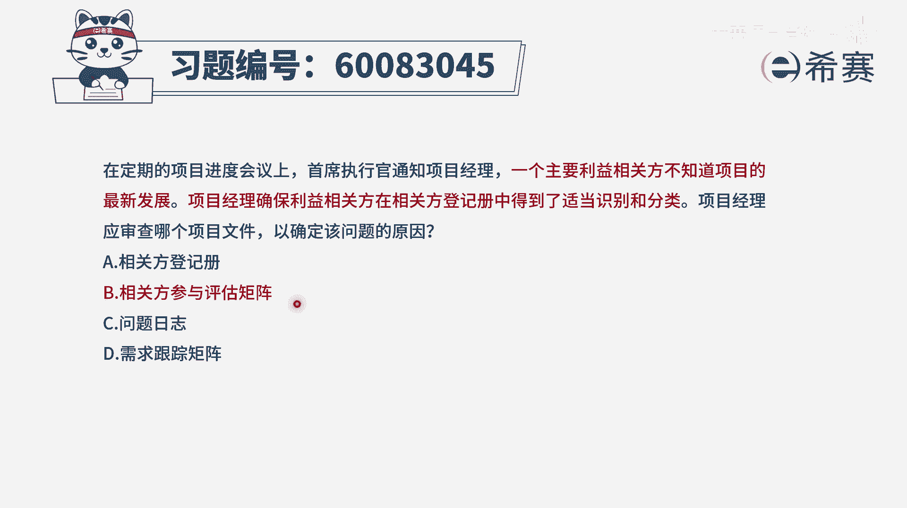
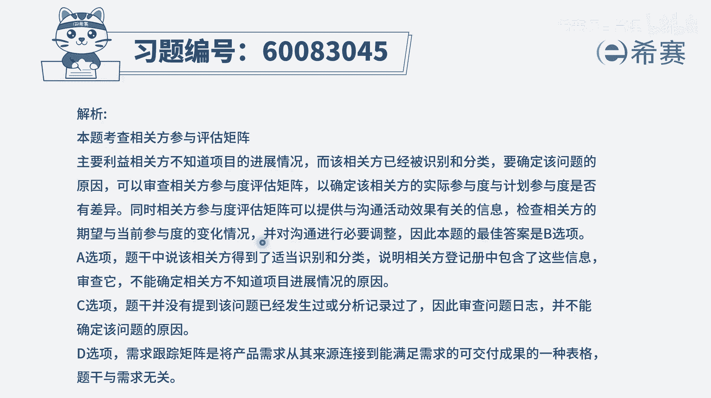

# 【重点推荐】2024年PMP项目管理 100道新版模拟题精讲视频教程、讲解冲刺（第14套）！ - P7：60083045 - 希赛项目管理 - BV1wz4y1q7Az

在定期的项目进度会议上，首席执行官通知项目经理，一个主要利益相关方不知道项目的最新发展，项目经理，确保利益相关方，在相关方登记册中得到了适当的识别和分类，项目经理应该审查哪个项目文件。

以确定该问题的原因呃，我们这个题目呢，你可以通过这种排除的方式来选出正确答案，你直接去选，其实我觉得还是有一点难度的啊，首先这个相关方我有没有识别到，已经识别到了，有没有列到这个相关方登记册中。

已经列出来了，在相关方登记册中，只是会列出这个相关方的一些基本信息呀，诉求啊，需求啊之类的，但是从这样一份文件中，你并不能够知道这个相关方，他对于项目的这些诉求有没有满足到。

所以光从这个相关方登记册里面，是没有办法知道他有没有去，他的需求有没有满足的好，c选项问题日志，那通常是出现问题以后才会列问题日志，才会去跟进这样一个问题的发展，所以呢这个事情之前没有出现，你并不知道。

所以你看见一个问题日志没有用好，最后一个选项d需求跟踪矩阵，它是指我们去跟踪这个需求，从最开始客户提出需求，带我们去梳理它呀，到去做设计呀，去开发实施啊，去测试完成了，去集成呢，去部署啊。

整个需求从开始到最终结束的这一个跟踪矩阵，他跟某个具体相关方它的这样一个参与情况，他了解项目进展是完全没有关系，所以呢他也不选，那么剩下的就只有b选项，叫相关方参与度评估矩阵，相关翻唱阅读评估矩阵中。

我们会列出它对于这个项目的一些，参与情况的期望，如果说从这里面能看到我们对他的期望，和他实际上参与这个项目的一个情况有差异，我们就知道啊，可能出了问题，然后就再去找寻根本原因，所以这个选项。

它其实并没有真正的去对应到这个问题，说找寻它的根本原因，你只能说是通过这个文件去得到哦，原来这个人他没有跟我们所希望这个东西，是一致的，那我可能需要采取一些措施来跟他有沟通啊，互动啊。

去引导他来更好的去参与项目，至于说真正要去找寻到他为什么的，这样一个原因，你其实应该是跟这个人去互动，去沟通，去交流，去探讨，去获取信息，所以这个题目，我的建议呢是从排除法的方式来选会更好一些。

因为其他几个选项是更加不靠谱，而这个相关方参与度评估矩阵，至少在一定程度上，你能够看到它，所你所期望它的参与情况和他实际差异的情况，有这一差异，然后你就知道了，有问题。

