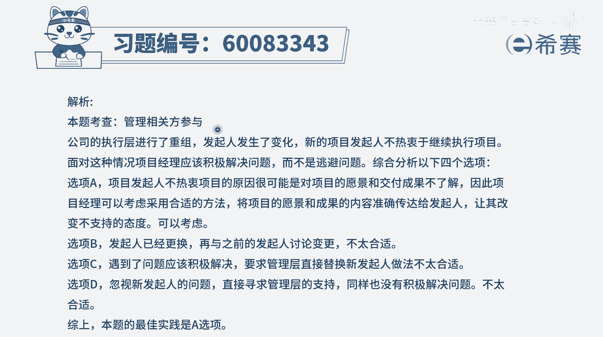

# 【重点推荐】2024年PMP项目管理 100道新版模拟题精讲视频教程、讲解冲刺（第14套）！ - P80：60083343 - 希赛项目管理 - BV1wz4y1q7Az

在执行成重组之后，新的项目发起人并不热衷于继续该项目，项目经理应该怎么做，哎哟这是遇到了一个棘手的事情啊，就是你的老板都已经换人了，那么这个时候呢，新的老板他觉得你这个项目呀，呃他们有太多的兴趣。

甚至有可能会想要停掉这样一个项目，那你应该怎么做呢，一般情况下你作为项目经理，你肯定是希望这个项目可以达成，对不对，最开始公司之所以任命你作为项目经理，就是他赋予你一定的职权，还有给你带动一些资源。

让你能够去达成目标，去完成这个项目，这个新的发起人他对这个项目不热衷，很有可能是他没有看到这个项目，可以给他带来什么好处，那么你可以给他讲一讲，这个项目能够为咱们公司带来什么好处，能够为他带来什么好处。

有可能还能够让他心动一下，对吧好，我们来看一下这个题目，其实即便你没有学过偏僻，我相信你能够选对，你用排除法也可以选出来，我们来看a选项，探索与新发起人分享项目的愿景和成果的方法，也就是说我们去试一试。

来去跟他讲一讲这个项目的愿景，未来做好以后有多么多么好呀，然后做完以后有什么什么结果呀，唉这种方式讲的好，有可能会让他感兴趣，这是有可能是一个可选项，但是你看完以后，你会发现别的都不可选。

只有他可以选啊，好第二个选项，要求之前的发起人与项目团队来讨论变更，老板都已经换人了，原来的那个老板，他可能都不在负责这个公司的业务了，甚至有可能不在这个公司了，你这种方式合适吗，肯定不合适的啊。

选项c，要求管理层用之前的发起人来替换新的发型，你作为一个打工仔，你要求换老板，那你只能是换公司，还差不多，你直接是在同业公司里面要求把老板给换掉，你胆子也够肥的啊，肯定不合适，完全不符合逻辑啊。

最后一个选项想办法绕过新的发起人，并寻求管理层的支持，这种越级的行为是不合适的啊，在职场上，这是要杜绝的一种行为，我们可以去越位思考，但是你不能够直接去呃，通过这种方式来去预备操作，你可以替他来想办法。

但是你不是跨越过它来去做事情，所以你会发现b cd这三个选项都是错误选项，那就只有a了，那我们再来重新回顾一下a担心的项目发起人，他不热衷这个项目的时候，我们可以跟他去讨论一下。

聊一下这个项目的愿景和成果，看一看它能够给我们带来什么好处，给他带来什么好处。

他有可能会心动，所以是这样来选的，选a文字版解析。

