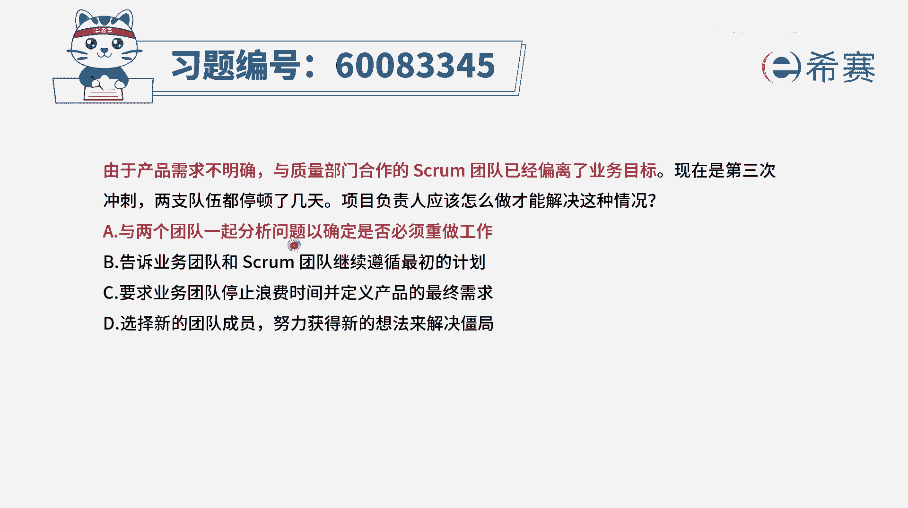
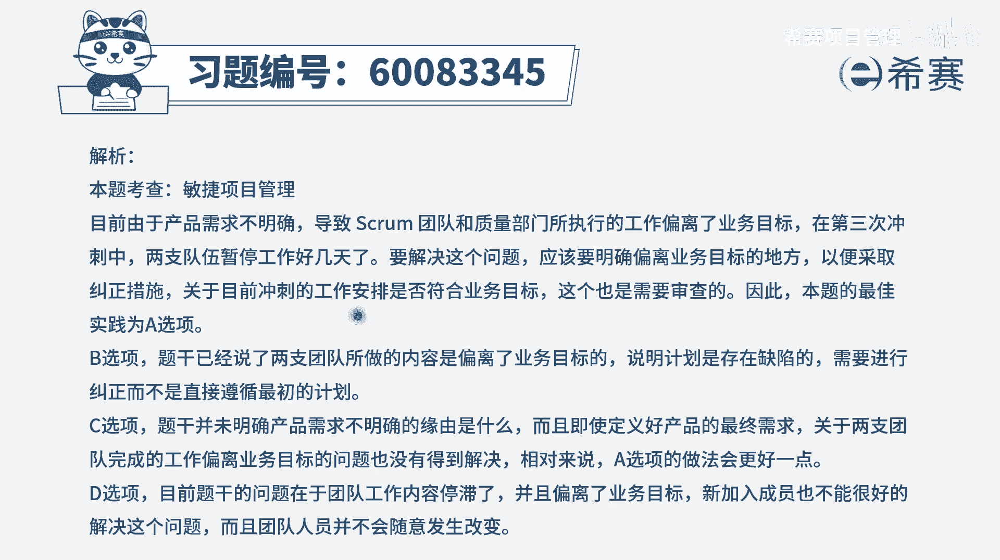

# 【重点推荐】2024年PMP项目管理 100道新版模拟题精讲视频教程、讲解冲刺（第14套）！ - P81：60083345 - 希赛项目管理 - BV1wz4y1q7Az

由于产品需求不明确，与质量部门合作的spring团队已经偏离了业务目标，现在是第三次冲刺，两支队伍都停顿了几天，项目负责人应该怎么做才能够解决这种情况，那这个题目呢它其实很有意思。

首先第一个是产品需求不明确，那既然产品需求不明确，我们应该是要想办法让产品需求变得明确，这肯定是要做的一个内容好，第二个说与质量部门合作的这一scrm团队，他已经偏离了业务目标。

那你如果说已经偏离了业务目标，那么你做的事情是有用还是没用的啊，这是有待商榷的，可能是要打一个问号的，那么这种情况下，我们其实要去评审一下，看做的这些东西有没有用，如果没有用的话呢，可能还要去返工重做。

而至于说两支队伍都停顿了几天，他其实是因为需求不明确，然后做的内容又偏离任务目标所导致的，那如果我们能够解决这个需求不明确的事情，这个停顿呢它就能够得到有效解决好，有了这些认知以后。

我们再来看这几个选项，选项a与两个团队一起分析问题，已确定是否必须要重做工作，诶这个是有必要的，因为他现在目前做的东西呢，已经偏离了业务目标，那要不要反攻啊，要不要重做啊，唉这是一个很重要的可选项。

好第二个选择，告诉业务团队和时光团队继续遵循最初的计划，那肯定不合适呀，都已经告诉你需求不明确了，然后你做的东西可能也不匹配了，你还按照计划来进行，可能不合适，这是错误选项。

第三个选项要求业务团队停止浪费时间，并定义产品的最终需求，如果他能够定义出最终需求，那肯定是极好的，关键现在是产品需求不明确，那可能因素有很多，不是说他想定义清楚，他就能够定义清楚的。

他也许在努力的去定义清楚，但依然有很多的客观因素导致他没有办法，所以这种表达方式呢只能说是一个方向，但是它不一定能够真正的去使用，确实我们是要努力的去得到这样一些，清晰的产品需求定义。

但是呢未必就能够直接去解决这个问题，最后一个选项选择新的团队成员，努力获得新的想法来解决僵局，那这个解决僵局的方式，还不如a选项直接去解决对吧，并且呢一般在敏捷中也不会轻易的去加人，不会轻易的去捡人。

不合适，所以这样看下来可能c还稍微有一点点可选，但是呢c的这种方式它并不能够很好解决问题，而只有a选项它是可以做的事情，既然有偏离，那我们来去审核一下，看现在做的这个事情是不是要返工，是不是要重新去做。

并且呢我们通过分析才能够找到问题，你找到了问题才能够去想解决办法，才能够想解决方案，所以答案是选a，那文字版解析在这里。

