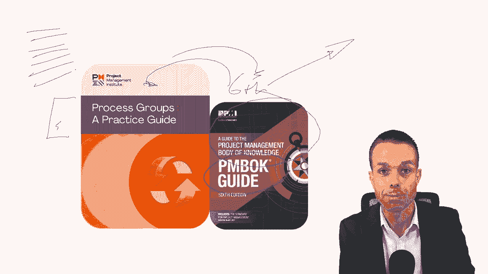
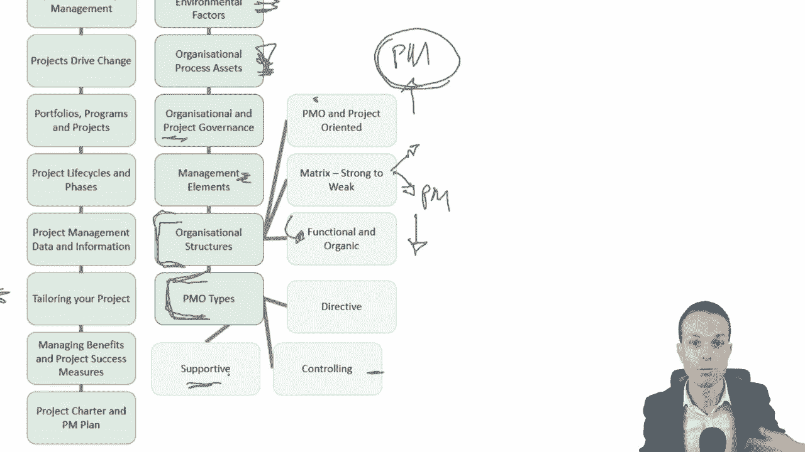
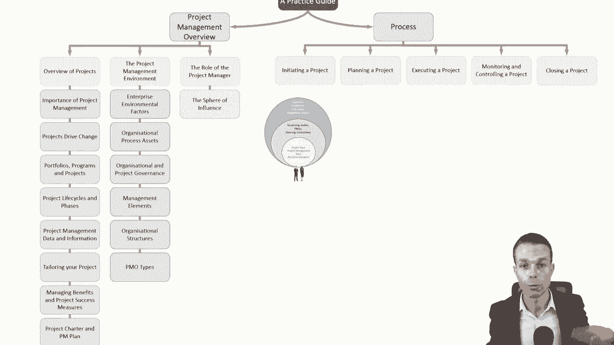
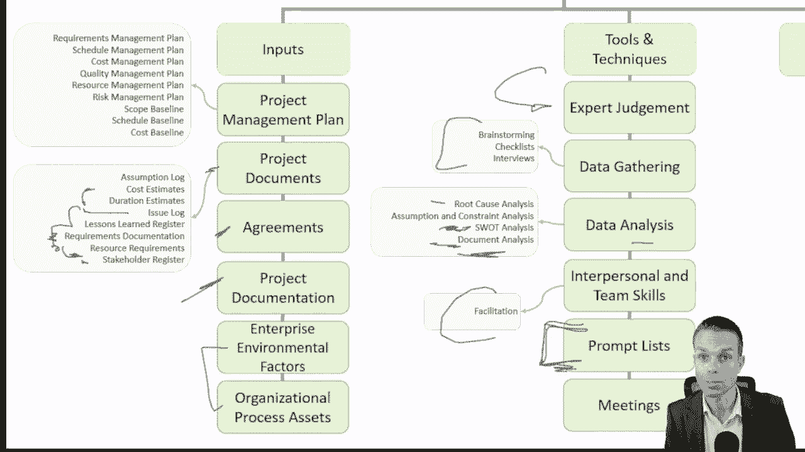
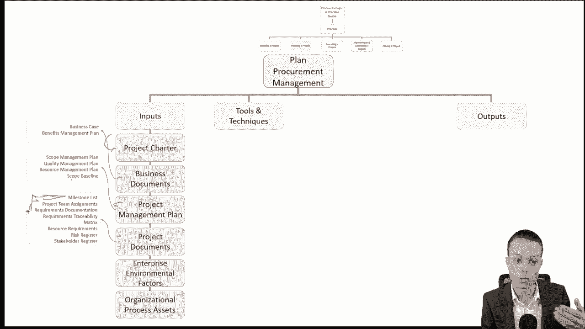
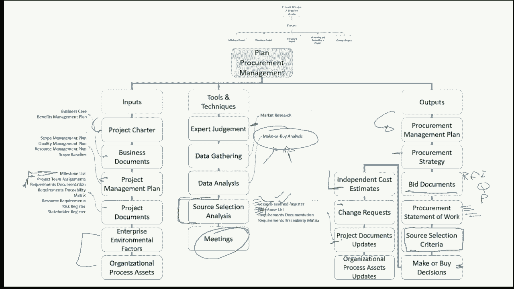
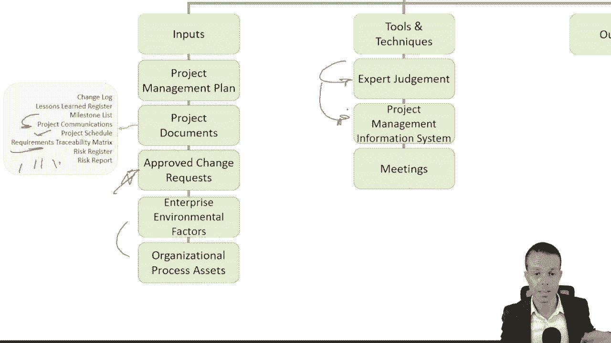

# 一条视频讲清PMP过程组 (PMBOK 6th；纯英文） - P1 - 顶顶顶天立地 - BV1Ay421B7GR

对于任何学习PMP或项目管理新手的人，或者只是想温习一下他们的项目管理技能，你可能会看到项目管理协会的过程组实践指南，它实际上是项目管理知识体的更新版本，第六版现在有第七版了。

已经走向了一个完全不同的方向，但他们已经把它变成了过程小组的实践指南，这是你作为项目经理所拥有的最有价值的东西之一，因为它是一系列的步骤和过程步骤，从开始到结束。

如何运行项目，还有什么更好的方法来学习一本书和浏览一本书，创造思维导图，或者是这本书内部运作的工作分解结构，这就是我们现在要做的，它真的会帮助你，吸收过程小组的实践指南。

把你的项目管理提升到一个新的水平，就像任何好的思维导图或工作分解结构一样，我们将从一个非常高的水平开始，高水平思想，然后我们会越来越详细，然后再详细一点。

这是一种很好的学习方式，让我们开始吧，你首先会注意到有两个部分。

项目管理概述，只是为了让我们了解情况，然后是项目管理概述的过程本身，那就是我们要开始的地方，我们从项目景观的概述开始，项目管理环境，以及项目经理本身的角色，为了这个过程，我们从发起，规划项目，执行项目。

监视和控制项目。

然后结束一个项目，让我们从头开始项目概述，我们从项目管理的重要性开始，现在呢，这很重要因为没有项目经理来组织所有的细节，然后它们经常散开，东西分崩离析，项目本身推动变革，我们从一个州到下一个州。

希望增加业务价值，当我们走的时候，一个项目也是一个暂时的努力，它有开始和结束，它驱动业务价值，所以它推动了这种变化，我们也有项目计划，和投资组合，运营层面是我们的一切照旧，或者B A U项目做出改变。

然后多个项目形成一个程序，然后多个程序形成一个投资组合，这也包括我们的操作，当我们归结到它时。

项目生命周期和阶段，这就是我们得到预测的地方，迭代，增量和适应性，所以敏捷和瀑布基本上，你有你的瀑布，那就是你一步一步的需求分析，设计，编码，测试，把所有这些都投入到BAU或运营中。

所以我们选择生命周期和项目，最适合我们项目的生命周期，当我们继续我们的项目管理之旅时，我们收集数据，我们改进了这一点，把它变成有意义的信息，我们可以与高管和其他项目涉众分享。

我们想量身定制我们的项目，裁剪项目是非常重要的，因为每个项目都会有一点不同，管理效益和项目成功措施--我们希望从目的开始，所以我们真的想知道这个项目的进展，我们提供的价值。

我们有一个项目章程来启动我们的项目，和项目管理计划来管理项目，当我们现在前进的时候，在项目管理环境中，有两件事你会经常遇到。

那就是企业环境因素或fs和组织过程资产或opas，这些是组织内的流程资产，所以流程治理模板，像这样的事情，我们工作的环境，包括完成工作的方式，所以政治，也许不同的产品只是有不同的工作方式，例如。

您可以一步一步地创建一辆车，但是一个软件产品，您可能需要做一个迭代的方法，这就是我们工作的环境，是身体上的吗，是软件吗，或者诸如此类的事情，这些都是不同的，这就是为什么我们量身定制我们的项目。

组织和项目管理，因此，我们确实需要了解组织治理以及工作是如何完成的。

以及项目治理和如何在项目中完成工作，这包括管理元素，所以我们作为组织内的管理者和管理者，但也有组织结构这里有不同的，所以这些从高水平的影响，项目经理有很高的影响力到很低的影响力。

我们有一个项目管理办公室或项目导向的组织结构，我们，项目经理在这些方面有很高的影响力，因为这一切都是关于项目管理和项目，我们就得到了一个由强到弱的矩阵组织，如此坚强，我们仍然有很高的影响力。

但当它变弱时，那我们的影响力就很低了，我们不是真的做预算，也许预算是外部的人给我们的，可能职能经理，当我们深入到功能性和有机性，然后职能经理通常在主持节目，他们可能在他们的团队中做一个小的过程改进。

所以他们通常会有一个临时的项目经理。

或者他们团队中的某个人在做这件事，有不同的PMO类型，项目管理组织或办事处，对不起，它们可能是指令控制或支持指令控制了整个事情，控制给出了框架、想法和工作方式，并说，在这些框架内操作，支持只提供模板。

说这里有一些想法，你可以用这些，如果你真的想。

我们现在是来支持你的，项目经理的角色在所有这些事情中扮演什么角色。

我们有自己的势力范围，所以我们可以影响我们自己的项目团队，但还有管理机构，项目管理办公室在那里，指导委员会，这有点超出了我们的势力范围，但仍然在里面，然后我们有我们的行业供应商，客户。

这往往超出了我们的势力范围，但我们仍然需要用自己的个人力量谈判和影响他们，我们需要的项目经理能力是权力技能，所以软技能，商业头脑，我们需要了解我们所从事的业务，和工作方式，就是这个特殊的过程。

和项目管理过程组，我们还需要领导者的素质和技能，有不同的领导类型，从仆人式领导到指令式领导再到放任式领导，把手从各种不同的方式上拿开，执行集成是我们采取所有这些过程步骤的地方，我们把它们整合在一起。

我们成为我们项目的粘合剂，作为项目经理。

现在我们要进入这个过程，我们将在这里给出一个高水平的概述，就像我用工作分解结构方法承诺的那样，我们将深入了解每一个问题的本质。

所以首先我们制定一个项目章程来启动我们的项目，我们确定了我们需要与之合作的所有利益相关者，然后我们创建我们的项目管理计划，这是让一切保持在一起的计划的一部分，在这个计划中，我们要规划我们的范围。

所以我们收集了这个范围，收集需求，定义范围，然后创建我们的工作分解结构，我们从客户那里获得的所有范围。

一旦我们有了这些，我们就可以开始计划我们的时间表了。

我们从我们发现的范围定义活动，安排这些活动的顺序，把它们排成一个很好的顺序，使用计划网络图使用它，然后我们估计活动持续时间，那么每一个需要多长时间。

一旦我们有了所有这些信息，我们可以制定时间表，并把它们放在一个漂亮的甘特图上，一旦我们有了我们的范围和时间表，然后我们可以看看成本，所以计划成本管理，在我们的项目上，我们将如何处理成本。

然后我们估计所有这些不同活动和范围不同部分的成本，然后我们用它来确定预算，现在还有更多的事情要做，但我们稍后会讨论这个问题，然后我们可以计划质量，那么我们是如何做质量保证或测试计划资源管理的呢。

我们怎么找人，找谁，我们需要估计我们需要的资源，规划通信管理，我们如何与我们的客户和利益相关者沟通。

规划风险管理，我们需要识别风险，进行定性风险分析。

数据重得多的定量风险分析，然后计划风险应对，我们将如何应对我们发现的可能影响我们项目的风险，规划，采购管理是我们与供应商合作和规划利益相关者参与的方式，我们如何让我们的利益相关者参与进来，现在。

这些过程的其余部分在高层次上只是相同的知识组。

所以范围进度计划成本，优质资源，通信，风险采购和利益攸关方，但现在我们只是执行和执行这些任务，我们在指导和管理项目工作，我们在管理质量，我们正在获得发展和管理我们的团队所需的资源，我们正在管理沟通。

以确保沟通是有效的，在风险出现时实施风险应对措施，进行采购，让这些供应商参与进来，并管理我们的利益相关者的参与，以保持我们的利益相关者的参与，然后我们需要控制我们的项目，把一切都控制在控制之下。

同样的交易，这里的主要区别是我们有变更控制，它是一个变更管理过程，那么我们如何确保如果范围发生变化，呃，它被批准了，它不会影响我们的项目进度，或者不影响我们的项目成本，或者如果有，那就批准了。

另一件事是验证范围是一旦我们有一次，我们已经创建并完成了这些交付品，然后他们需要由客户通常是项目发起人的人签字，或者谁收到了那个特定的交付物，剩下的我们只是监控和控制风险，优质资源。

采购和利益攸关方参与，当我们打烊的时候，我们可以结束一个项目，也可能只是一个项目阶段，然后我们在下一阶段再次做所有这些。

如果我们用迭代法，还是迭代的工作方式，现在这一切，大家可以看到，我们已经得到了第一个一路回来，一开始，制定项目章程，这又下了一个层次，所以在制定项目章程的过程中，小组实践指南。

我们可能对那个特定的过程有投入，我们用于特定过程的工具，然后输出，那么我们通过开发项目宪章试图得到什么，而这才是真正的黄金所在，所以说，如果你在这一点上已经看够了，那就不要看了赶紧走吧。

但如果你想进入细节，所有这些输入的坚韧，每个流程的工具和输出，然后继续看，在剩下的过程中真正得到货物，让我们看看我们得到了什么，发展，项目章程，输入，我们需要商业文件，所以我们需要一个商业案例。

那么一开始做这个项目真的值得吗，我们还需要一个福利管理计划，因为我们需要知道这个项目的好处是什么，以及我们将如何管理它们，我们可能已经在生意上有协议了，然后是企业环境因素，我们的工作环境是怎样的？

和组织流程资产，有没有一种工具或技术，或者我们的项目章程已经存在的模板，我们可以在组织中使用，我们将使用的工具是专家的判断，我们可能需要了解产品的业内人士，所以我们需要他们的专业知识，数据收集。

和他们一起集思广益，焦点小组访谈，确保我们收集了所有的数据，关于该项目的利弊，人际关系和团队技能，冲突管理，也许人们有相互竞争的想法，便利化，为这些人群和会议管理提供便利，然后会议本身。

我们寻找的产出是项目章程本身，所以我们正在创建项目章程，与项目发起人签署，我们一路上所做的任何假设，让我们现在也包括这些，下一个当我们开始一个项目时，确定我们将与之合作的所有利益相关者。

所以要做到这一点，我们需要项目章程，这将对涉众和业务文档有一个高层次的概念，商业案例和效益管理计划也会有一个很好的想法，当我们开始创建项目管理计划时，项目管理计划，我们会有利益相关者在那里。

所以我们可以参考我们可能需要通信管理计划，利益攸关方参与计划，所有这些都将有与我们合作的利益相关者的想法，和项目文档更改日志问题，日志需求文档，所有这些都将为我们利益相关者提供想法。

组织内先前的任何协议，然后呢，当然啦，环境，以及任何已经存在的模板，一如既往，我们需要业内人士的专业判断，谁知道是谁，也许我们需要他们给我们一个利益相关者的想法，我们的项目所需要的。

我们需要通过问卷和调查收集数据，以确定利益相关者，利益相关者分析、文件分析和数据表示，我们需要利益相关者在表示中的映射，现在我不能对此进行详细的讨论，你得看看我的PP课程。

也会给你3-5个小时的接触时间，这真的真的很棒，但要知道这是它下降到的水平，在这个过程中，我们实际上进入并展示了这些特定的项目是什么，我们需要开会，识别利益相关者的输出是我们的利益相关者登记册。

我们所有的利益相关者都参与其中，我们可能需要更改请求和项目管理计划更新，当我们使用新的涉众和项目文档进行更新时，像假设这样的更新，有新利益攸关方参与的问题或风险登记册，现在我们要开始计划一个项目。

这是过程组的最大部分，制定项目管理计划的实践指南，我们需要项目章程，现在这需要项目发起人的签字，所以可以继续，我们有足够的资源，我们对这个项目有高水平的想法吗，涉及到什么，其他进程的任何输出。

所以范围计划所有这些东西的成本，这将进入我们的项目管理计划，当然，我们在这个行业或组织中工作的环境，以及我们可能拥有的任何过程模板或过程资产，这将为我们提供如何创建项目管理计划的线索。

我们需要的工具和技术需要组织内人员的专家判断，谁知道这个项目和我们项目管理计划可能需要的东西，数据收集，焦点小组，核对表，面试及人际和团队技能冲突管理，当我们创建项目管理计划和会议时。

为了促进所有这些事情，产出是项目管理计划本身，随着项目的进展，我们会更新这个，现在当我们通过计划，我们有计划范围管理，我们需要什么来规划，范围管理是项目章程，那里的高层范围，和项目管理计划，然后呢。

当然我们的环境和歌剧，我们用于管理范围的过程资产，专家判断，一如既往的数据分析，当然还有会议把这些联系在一起，输出是我们的范围管理计划，这就是我们如何管理范围的过程，我有一大堆模板，呃。

范围管理计划和整个项目管理计划，计划过程实际上是预先为过程组准备的所有这些小提示，以及如何一步一步地做到这一点，所以那些真的真的很棒，如果你想准备好这些，请查看描述，这将节省你自己做这件事的几十个小时。

需求管理计划是我们管理需求的方式，一旦我们建立了程序，我们想自己收集需求，我们需要项目章程，那么高水平的要求是什么呢，项目管理计划，项目文件，所以利益相关者和假设，业务文件，业务案例已经有了很高的要求。

即我们可以在业务中使用任何协议，当然我们的事业，任何模板和我们工作的环境的环境因素和OPAS。

工具和技术，人民的专家判断一如既往，数据收集，数据分析，决策，数据收集，数据表示，人际和团队技能，从我们的利益相关者那里引出所有这些需求并收集它们，我们可以使用上下文图来将这些放在一起，并将原型。

所以模拟或故事板或模型，所有这些事情，再说一遍，我不能在这个层面上讨论所有这些细节。

但在PMP课程中，我当然有，挺酷的，如果你想去看看，所以输出是，是每个项目的验收标准，我们想要满足的要求，然后是一个需求可追溯性矩阵，我们如何，我们是怎么得到要求的，直至交付品，到他们的测试用例。

通过批准和签署。

我们从头到尾都在追踪，一旦我们得到了要求。

我们可以开始定义我们要在项目中交付的范围，看起来我们从我们的项目章程开始，项目管理计划和项目文件。

对于任何假设，当然，我们的环境和任何过程资产将帮助我们前进的道路，工具和技术，来自业内人士的专家判断，一如既往，数据分析，所以我们范围内的任何替代方案，决策，多标准决策，顺便说一句。

这是我最喜欢的做决定的方式，我有很好的模板，如果你想去看看，我们将需要促进所有这些事情，并将其结合在一起，这样我们就可以为我们的项目把范围放在一起，然后产品分析，我们想分析我们的产品。

弄清楚它需要往哪个方向发展。

输出是我们的项目范围声明，所以这只是一个高级范围声明和项目文档，包括需求文件，所以我们正在更新这些东西，按照我们的计划更新涉众并更新需求可追溯性矩阵，我们现在正在创建工作分解结构。

类似于我们为过程组所做的，实践指南，但为了这个，这是一个项目，我们需要的输入范围，管理层计划弄清楚我们做得如何的过程，我们对范围、项目文档和需求文档所做的工作，当然啦。

我们将需要我们的环境和任何过程资产来帮助我们，工具和技术，哦惊喜惊喜，这是业内人士的专家判断，所以我们需要，当然还有分解，把这些东西分解成更详细的层次，类似于我们正在做的这个特殊的练习，这真的真的很棒。

范围基线是我们的输出和项目文档，更新，规划时间表，这是另一个很棒的，现在我们有了范围，我们可以继续计划我们的日程安排，我们需要的投入是项目章程，如此高水平的里程碑，以至于我们可能超出了项目管理计划。

当然还有我们工作的环境，以及我们在业务中拥有的任何资产或流程资产。

这可能有助于我们计划我们的日程安排，所以我们可能从企业内部的人那里得到专家判断的系统或工具，惊喜惊喜，我们可能会经常看到这种情况，从外表上看，分析数据和会议将其联系在一起。

我们正在寻找的输出是创建我们的时间表管理计划。

这就是我们如何管理我们的时间表的过程。

一旦我们做到了，我们有我们的程序，我们现在可以开始定义活动了，你能猜出我们需要什么作为输入吗，嗯，首先是项目管理计划，所以进度管理计划和范围基线，这是最重要的一个，因为我们将采用范围基线和工作分解结构。

还有工作包，我们需要把这些转化为活动，所以我们要用专家的判断，我们将使用分解，因为我们将把这些工作包进一步分解为活动，滚波规划是我们可以使用的，那是一种敏捷的技术，还有更多，但是你知道。

这是一个想法会议把它联系在一起。

我们想要的输出是项目活动本身的列表，活动属性，所以资源成本，所有这些我们要添加的东西，随着我们的项目计划越来越深入，里程碑列表，只是一个高水平的里程碑清单，我们将坚持，在我们的项目上。

随着项目管理计划的更新，我们可能会有更改请求，因此，当我们定义活动并更改这些活动时，时间表基线将被更新。

一旦我们有了活动清单，我们想把它们放在正确的顺序完全正确，所以要做到这一点，我们需要什么项目管理计划，我们想要时间表管理，计划，我们的过程，范围基线，所有这些活动列表和属性，当然还有环境。

所以我们是在创造软件，或者我们是在创造一辆汽车或一把椅子或其他任何东西，或者吸尘器，所有这些事情，当然还有过程资产，我们已经有办法对组织中的活动进行排序了吗，我们已经可以使用工具和技术，优先图解法。

依赖，确定与整合，哪些活动相互依赖领先和滞后，当然，我们还需要项目管理信息系统，所以它保存了我们将要使用的所有项目数据。

项目进度网络图就像节点一样，所以如果这些是，我们需要按照什么顺序来做这些，然后项目更新，活动属性。

一旦我们有了活动列表，我们可能需要在前进的过程中更新这些，我们已经把它们按顺序排列好了，我们需要估计它们的持续时间，那么这些活动需要多长时间，知道这一点对我们很重要，即使这只是目前的估计。

所以我们需要项目管理计划，项目文件，所以所有这些事情。

活动列表，现在呢，工具和技术，我们将一如既往地需要组织中人员的专家判断，但这里有一些估计技术，这些绝对是我的最爱，所以类似的估计，它类似于另一个功能或另一个项目，这是一个类比，参数估计。

每米一美元或每小时十美元，它是它是一个参数，三点估计乐观，悲观且极有可能，我们把这三个人聚在一起，我们就把它除以3，这只是一个平均数，基本上一次又一次，我们详细地讨论了这一点，在项目管理专业课程中。

但这只是一种方法，自下而上的评估是收集所有的工作包，然后把它们聚集到下一个层次，然后这些水平上升到下一个水平，直到我们有一个整体的项目预算。

我们需要数据分析，一如既往地做所有的决策和会议。

把一切联系在一起，现在我们要得到的输出是持续时间估计，估计的基础，那么我们如何做出这些估计决定，并更新任何活动属性，以及我们一路走来所做的假设，现在我们已经估计了这些活动的持续时间。

我们想制定总体时间表，所以我们需要的是我们的项目管理计划，项目文件协议，当然还有环境和歌剧，我们需要的工具和技术是我们的时间表网络分析，所以这就是我们的一切，的顺序，一切都合身的地方，临界路径法。

所以这就是我们确定关键路径的地方，所以我们可以在最短的时间内完成我们的项目资源优化，数据分析，如果情景分析又领先又滞后呢，带来带领他们前进的项目，或滞后于工期压缩。

所以这是快速跟踪或计划崩溃的项目管理信息系统，在那里我们存放了所有的数据和敏捷的发布计划。

我们正在计划敏捷项目的下一个小增量，我们将要得到的输出是计划基线本身，项目时间表，计划数据和项目日历，今后的变更请求，如果我们需要做任何改变，项目管理计划更新我们的时间表，管理计划和项目文件更新。

既然我们有了时间表，我们可以开始计划成本，因为我们知道我们的，我们的范围是什么，要花多长时间，现在我们可以知道多少钱了，要花多少钱，这方面的投入是我们的项目章程，所以最初的高水平成本，我们心目中的。

项目管理计划，然后呢，当然我们的FS和OPP也是如此，所以我们总是会看到那些，我觉得很多很多，我们看到的每一个过程，专家的判断是我们会看到的另一件事，以及我们工具和技术的数据分析，所以备选方案分析。

我们是否有不同的管理成本和会议的方法来将其联系在一起，一如既往，这一个的输出是我们的成本管理计划，我们如何管理项目成本的过程，现在我们可以估计成本和投入，那么我们如何从估计我们的成本开始。

我们需要我们的项目管理计划，项目文件，经验教训，项目进度和惊喜惊喜，它是f和opas，哇塞，在那里看到他们真是个惊喜，还有另一个令人惊讶的专家判断，来自组织中与成本或预算有关的人，然后不同的估算方法。

当然啦，类似物，参数化，自下而上，三点估计数据分析将所有这些联系在一起，据我们估计，现在的质量成本，这是一个非常好的一个和再一次，我没时间详谈那件事，但质量成本是一个很好理解的问题。

防止质量问题的成本是多少，或者在他们到达顾客面前之前抓住他们，所有这些事情，我们所在的项目管理信息系统，所有这些数据和信息都用于我们的项目和决策。

我们可能会投票决定要花多少钱才能得到最好的结果。

我们想要的产出是我们的成本估计本身，这些估计的依据，那么我们现在是根据什么进行这些估计和项目文档更新的呢。

当然我们想确定预算本身。

所以我们需要的投入是我们的项目管理计划，项目文件，业务文件。

组织中已有的任何协议，还有S和OPAS，专家判断，所以所有这些都来自企业或组织中合适的人，或者聚合的项目成本，我们要把所有这些，工作包的费用，把它们聚合成更大的，较大的项目，特性或可交付成果。

并将这些汇总成一个整体项目预算，然后我们需要分析管理储备和应急储备，那将成为我们预算的一部分，在pp课程中，我们会更详细地讨论这个问题，历史信息回顾，所以任何关于过去项目的历史信息，对于类似的，估算。

资金限额调节，我们显然想调节预算。

借方和贷方，然后为预算本身融资，我们想要的产出的钱是从哪里来的，这是成本基线，核定预算，项目资金需求，也许有里程碑，他们在某些时候被释放。

和项目文档更新，现在我们有了我们的范围，时间表和费用。

我们可以开始看质量，那么我们如何规划项目的质量呢？

我们需要我们的项目章程，项目管理计划，项目文件，FS和OPAS。

工具和技术，惊喜惊喜，这是来自业务数据收集人员的专家判断，我们可以对其他团队或组织进行基准测试，诸如此类的事情，真的是好东西，数据分析，决策，这就是多标准决策分析。

这是我最喜欢的在敏捷项目中确定特性优先级的好方法，也是，思维导图，我们已经很熟悉了，通过做这个特定的过程测试和检查计划。

因此，针对需求和测试用例本身的验收标准。

当然还有会议把这一切联系在一起，我们想要的输出是我们的质量管理计划，我们的质量测量过程，质量指标，我们怎么知道我们什么时候成功，项目管理计划和项目文件更新，当然，更新需求可追溯性矩阵。

既然我们已经把质量控制住了，我们可以开始计划我们项目的资源，那么我们怎样才能做好呢。

我们需要我们的项目章程，我们可能对我们承诺给我们的项目资源有一个高水平的想法，一开始，当项目开始时，项目管理计划，用于质量管理计划，和范围基线，项目文档、FS和OPAS，一如既往，看到了很多这样的情况。

并再次为正确的人做出了专家的判断，在正确的时间计划，资源，听取他们的意见和想法，数据表示，分层图表，我们可能需要一个资源，击穿结构，组织理论，哦现在，太神奇了，我喜欢这个，一次又一次。

在PP课程里有很多这样的东西，但这就是我们如何发展我们的团队，我们如何让我们的团队在心理上发挥出最好的水平，确保每个人都快乐和参与，就像赫茨伯格的动机理论，例如阿欧对美国人的Z或Z理论。

精彩精彩的会议一如既往，把一切联系在一起，输出是我们的资源管理计划，哪一个是我们的资源管理过程完全正确，团队章程，那么我们的团队将如何合作呢？项目文件更新，这些是我无意中添加的额外内容。

但我们希望一如既往地更新假设和风险，既然我们已经计划了资源管理。

我们可以开始估计项目所需的资源，你会记得我们的估算技术，但首先我们需要我们的项目管理计划。

项目文件，FS和OPAS，以及工具和技术，来自正确人士的专家判断，再从下往上估算，类比估计，参数估计，所有这些都可以帮助我们估计这些资源数据分析，分析我们需要的替代方案。

然后所有关于我们项目的信息都在我们的项目管理信息系统中，这可能是一个像sharepoint或jira这样的系统，也可能是微软项目。

很多不同的事情，不管那个系统是什么，每次都是不同的会议，像往常一样把它绑在一起，产出是我们所需的资源，我们现在得到了这些估计的基础，资源细目结构，就像我们说的，就是那个层次图，我们将更新活动属性，假设。

我们在这过程中学到的任何教训，既然我们已经做到了，我们想为所有这些利益相关者计划我们项目的沟通，交流事情的进展，项目章程，项目管理计划，项目文件，FS和OPAS都将在这里形成输入。

我们将使用我们的专家判断通信需求分析的工具，那么人们更喜欢如何与通信技术交流呢，可能是电话，可能是在网上，也许它的消息传递工具，通信模型，现在这真的是一件好事，许多不同的交流方式，当我们交流时。

有许多不同的事情需要注意，所以关于这一点有一大堆很好的信息，通信方法，人际关系和团队技能，数据表示，当然还有会议把这一切联系在一起。

我们想要的输出是我们的通信管理计划，项目管理计划更新和项目文件更新，因为我们可能会更新，我们的利益相关者参与计划，以及他们希望如何与。

现在我们可以计划风险管理，所以规划风险管理，我们需要什么作为输入。

任何高风险的项目章程，项目管理计划，项目文件和OPAS。

一如既往，工具和技术的惊喜惊喜，我们需要专家的判断，利益攸关方数据分析，他们可能会冒的风险和开会把这一切联系在一起。

产出是风险管理计划或风险管理流程，这就是我们得到的，然后我们就可以识别所有的风险，我们通过和我们的团队集思广益来做到这一点，因此，我们需要我们的项目管理计划来实现我们的风险管理方法，例如。

任何问题或费用估计的项目文件，或者可能给我们的项目带来风险的事情，我们在生意上达成的任何协议，项目文档，FS和OPAS帮助我们识别风险。

我们需要从正确的人那里得到正确的专家判断，也许那是行业内对产品很了解的人，或者这个地区，也许是数据工程师或软件工程师，可以帮助我们识别风险的信息，数据收集，和那些人集思广益，数据分析，做根本原因分析。

并促进快速列表，所以我们可能会有一些风险类别来帮助我们，或者他们提示我们可能有的风险。

然后呢，当然啦，把一切联系在一起的会议，我们的输出是，风险登记册本身，风险清单及其分类风险报告，我们定期发送给利益相关者，只是为了确保它们是最新的，关于任何项目风险，和项目文件，更新。

一路上出现的任何假设或问题，进行定性风险分析是主观方法。

所以这就是我们通常通过影响和可能性来看待我们的风险的地方。

然后我们确定这些风险会有多严重，我们需要我们的项目管理计划。

项目文件，EAFS和OPAS作为专家判断的一部分，来自正确的人数据收集，数据分析，人际和团队技能风险分类，这就是我们在这里说的，影响和可能性数据表示，我们将其放入概率和影响矩阵中。

并开会将所有这些联系在一起。

一如既往，我们想要的输出是项目文档，立即更新，定量风险分析，我们收集了大量的数据来提供更多的信息，对正在发生的风险，可能是财务数据，可能是天气数据，例如，我在一些以全球变暖为基础的保险公司看到过。

大型模拟和蒙特卡洛分析，我们需要我们的项目管理计划。

项目文件，专家判断，数据收集，人际关系和团队技能，和数据分析，所有这些都是为了我们的工具和技术，不确定性的表示，可能是直方图之类的东西。

所以现在我们看到了这个领域的大多数风险来自哪里。

就像一个例子输出，项目文件，更新，我们需要更新我们的风险报告，当我们定期将其发送给我们的利益相关者时，一旦我们得到了所有关于风险的信息，我们可以计划风险应对，我们将如何应对，我们需要我们的项目管理计划。

项目文件和OPAS，一如既往，工具和技术，惊喜惊喜，这是我们的专家判断，来自正确的人，数据收集，人际关系和团队技能，应对威胁的策略，机遇战略，应急战略，所以任何剩余的风险或替代风险策略。

总体项目风险数据分析的策略可能包括对我们的反应和决策的成本效益分析，我最喜欢的多标准决策分析，我们想要的输出，当我们管理风险和它们的响应时，我们可能会有一些更改请求，项目管理计划更新和项目文件，更新。

所有这些都可以更新，时间表，当我们应对风险时，成本范围可能会改变，它们改变了我们现在处理项目的方式，最后在规划中，我们可以计划采购管理。

这就是我们需要一个供应商加入的地方。

我们可以从我们的项目章程开始，因为我们可能已经分配了一个供应商，或者有一个项目需要的供应商的想法，业务文件，项目管理计划，项目文件，就像我们需要项目团队分配的任何里程碑一样。

如果我们已经为供应商分配了需求文档，这样供应商就可以看到他们需要交付什么。

和S和OPAS专家判断，我打赌你没想到，嗯，数据收集，数据分析，源选择分析，我们如何批准供应商，所以我们有了我们的标准。

然后供应商只需要满足这个标准，为了获得批准和会议把所有这些联系在一起。

产出是我们的采购管理计划，我们的采购管理流程，采购投标文件的确切策略，所以请求提供信息，询价，征求建议书，采购，工作说明，这就是我们要运送的物品清单，来源选择标准，那么我们是如何批准供应商的呢？

我们的货源选择标准是什么，做出或购买决定，独立费用估计数，所以我们知道，所以我们知道某样东西是否值得，更改请求，我们可能遇到的项目文档更新和组织流程资产更新。

哎呦，最后呢，我们需要计划利益相关者的参与，我们需要为任何初始利益相关者制定项目章程的地方，项目管理计划，项目文件，任何已经存在的组织协议，FS和O作为工具和技术是专家判断。

数据收集，数据分析，决策。

数据表示和会议，一如既往，产出是利益攸关方参与计划本身。

也就是我们的利益相关者参与，所以现在我们可以继续执行一个项目。

所以实际上做工作，指导和管理我们的项目工作，我们需要的是我们的项目管理计划，因为这是我们计划好的，项目文件，就像我们的零钱日志，项目通讯，以及批准的更改请求。

FS和OPAS，在执行我们的项目时，我们需要专家的判断，我们还需要项目管理信息系统中的所有信息，可能是汇流，SharePoint可以是任何东西，吉拉可能是，呃。

星期一点，com可以是体式，可以是你公司正在使用的任何东西，可能是卓越的，甚至开会把一切都联系在一起，我们想要的产出--交付品本身，这是我们交付项目的地方，工作，工作绩效数据，那么一切是如何跟踪的。

原始数据，出现的任何问题的问题日志，更改需要进行的任何更改的请求，更新项目管理计划，项目文件更新和组织流程资产更新，当我们执行这个项目的时候，我们将管理项目知识，所以项目管理计划。

项目文档和可交付成果本身都将成为管理我们项目知识的输入，因为当我们学习的时候，我们需要确保这是捕获的工具和技术。

专家判断一如既往，知识管理，那么我们是如何管理项目信息管理的知识的呢？我们是如何管理信息的，我们在哪里捕捉到所有这些东西以及人际交往和团队技能。

因此，促进和领导收集和提取所有这些教训。

我们在这里想要的输出是我们的经验教训登记册，更新项目管理计划，和组织流程资产更新，质量管理，所以要管理质量，当我们执行我们的项目时，我们需要的投入是我们的项目管理计划，所以再一次。

这是我们的质量管理过程，我们已经计划好了项目文件，经验教训或质量指标，出现的风险，和模板或工具的组织过程资产，管理质量的工具是检查表，数据分析，替代品分析，决策，多标准决策分析，数据表示，再一次。

在关于PP的完整课程中有更多信息，你绝对可以单独进入或找到关于这些事情的信息，以及如何使用这些工具和模板，审计，为X设计，它是为一个特定的想法而设计的，比如易用性，例如，或易于组装。

解决问题的质量改进方法，那么我们能否改进我们的质量流程和产品本身的质量呢？我们想要的输出是高质量的报告，测试和评估文件，所以我们测试的输出更改请求，如果我们需要，如果我们有缺陷需要重新检查。

并再次被工作，项目管理计划更新和项目文件更新。

现在我们正在执行我们的项目，我们可以获得资源。

我们需要的投入是我们的项目管理计划，我们的资源管理计划，如果你能猜到项目文档，FS和OPAS，我们可以使用的工具和技术是决策，人际关系和团队技能，所以多标准决策或谈判，当我们谈判的时候。

与我们的业务或与我们合作的业务一起收集资源，派任前，如果人员已经被分配到项目和虚拟团队，如果我们在全国各地工作，在不同的地区有许多不同的团队。

我们可以虚拟或在线工作，我们的输出是物理资源分配，这就是材料和，项目团队的任务，这就是人们，资源日历，什么时候有人，更改请求，项目管理更新，项目文件更新，EEF和OPA更新。

因为我们已经获得了我们的团队，我们可以发展团队，我们想要的输入是我们的项目管理计划，项目文件，FS和OPAS，所以资源管理计划是我们如何做到这一点的过程，我们现在可以参考这一过程。

我们一路走来学到的教训，以及我们如何与团队合作的团队章程，我们将要使用的工具和技术，包括共同定位我们的团队，所以把大家聚集在同一个空间，这样我们就可以快速方便地交流，如果我们在地理上分散，虚拟团队。

通信技术，消息传递工具，电话工具，视频会议工具，冲突管理，影响，激励，谈判和团队建设，所有这些都需要管理我们团队内部的冲突，当我们开发它们的时候，对正确事情的认可和奖励，培训我们的团队帮助他们成长。

个人和团队评估，看看他们是如何旅行的。

当然还有，作为我们的项目经理，开会把所有这些事情联系在一起，从表面上看，我们花了很多时间开会，关于所有这些工具和技术的大量会议，我们得到的结果是团队绩效评估，那么我们如何评估我们的团队。

如果我们需要改变，他们将如何改变请求，项目管理计划对任何资源的更新，项目文件更新，一旦我们开始开发我们的团队，我们可能需要的企业环境因素和OPA更新，我们可以在完成项目的同时管理团队，与项目管理计划。

项目文件，工作业绩报告，我们收集了fs和opas的性能评估团队，当然，这个过程来自我们的资源管理计划。

我们将需要像人际关系和团队技巧这样的工具来管理冲突。

产出包括变更请求，更新项目管理计划，项目文件更新，以及环境因素更新，所以我们可能会更新我们的流程，资源管理计划，出现的任何问题，和项目团队分配，如果人们需要不同的分配或重新分配。

在我们执行项目时管理项目上的通信，我们的项目将包括需要我们的项目管理计划为我们的沟通过程，问题或更改的项目文件，质量报告，风险报告，工作业绩报告，我们的项目进行得怎么样了。

我们需要向我们的利益相关者和OPAS传达这一点。

工具和技术将需要通信技术，所以发信息，电子邮件报告，我们实际上是如何交流沟通方法的，所以面对面，或者我们使用的不同沟通技巧，嗯，所以它可以是非语言的或陈述的，我们如何得到反馈，项目管理信息系统。

我们收集所有的项目信息，项目报告，我们可以用它来报告，为以后的通信收集信息。

人际关系和团队技能，然后呢，当然啦，把所有这些联系在一起的会议，项目通讯，更新项目管理计划，项目文件更新，组织流程资产更新都是产出的一部分，当我们管理项目上的沟通时。

实施我们需要查看项目管理计划的风险响应，所以我们的风险管理计划，或者我们的风险管理流程，项目文件，经验教训，我们可能需要的学习风险和风险报告，当我们实施这些风险响应和组织流程资产时。

用于管理的任何现有模板，风险应对措施，专家判断，影响和来自项目管理信息系统的数据都是工具，我们可以使用更改请求来进行任何更改，当我们实施这些风险响应和项目文档更新时，所以问题日志记录了问题。

风险登记册和风险报告。

执行项目，我们将为任何第三方供应商进行采购。

我们需要把采购管理计划作为项目管理计划的一部分，项目文件，项目文件，采购文件，所以这可能是我们的建议，我们的征求建议书，我们的工作声明，来源选择标准，所有这些事情，卖方建议，我们从卖家那里收集回来。

然后我们就可以决定和谁一起进行，还有FS和OPAS。

工具和技术，我们需要广告组织内合适的人做出专家的判断，那么我们能不能让更多的卖家给我们提供信息，或征求建议书，更好的会议，我们能同时让每个人都站在同一页上吗，数据分析及人际和团队技能。

我们要寻找的输出是选定的卖家本身，我们已经或将需要提出更改请求的任何协议，如果我们要改变供应商或时间，更新项目管理计划，项目文件更新。

组织流程资产在执行项目的最后进行更新。

我们在管理利益相关者的参与，所以我们需要利益相关者参与计划，项目文件，EAFS和OPAS，工具和技术包括专家判断，沟通技巧，以确保我们以正确的方式参与，人际关系和团队技能，我们项目和会议的基本规则。

一如既往，更改请求，如果我们需要改变我们与利益相关者管理的方式，更新项目管理计划，项目文档更新都是管理利益相关者参与的产出的一部分，现在我们可以开始监测和控制。

所以现在我们只是在最后关闭项目之前控制项目工作，所以我们需要的投入是我们的项目管理计划，一如既往，不同方面，项目文件，项目工作，我们收集的性能信息，随着我们项目的推进。

看看我们是在轨道上还是偏离轨道的协议，企业，环境因素，和组织流程资产，工具和技术，我们需要从正确的人那里得到专家的判断，数据分析，决策和会议将其联系在一起，产出，工作业绩报告，因此。

我们将这些信息转化为报告，提交给高管或利益相关者，在我们的项目更改请求中，项目管理计划更新和项目文件更新，所以对于任何需要更新的问题或成本预测，我们还希望执行集成的变更控制，也就是我们的变更控制过程。

我们需要我们的项目管理计划，项目文件，工作业绩报告，更改请求，E，S，S，和o，P，作为工具和技术，我们需要惊喜，专家判断，变更控制工具，数据分析，决策，我们想要的会议输出是经过批准的更改请求本身。

项目管理计划更新和项目文件更新，因此，我们可以用这些更改请求的输出更新更改日志，监视和控制的一部分是验证该范围，记住，如果你还记得，那是与我们的项目赞助商或客户，接收范围和已完成交付品的人。

我们需要我们的项目管理计划，项目文件，经核实的可交付成果，这意味着它们已经通过我们的质量保证程序进行了验证，关于我们项目的工作绩效数据，这包括质量过程数据检查，所以我们检验了产品，我们对此很满意。

决定我们这里的输出，一旦签字，我们接受的交付品，工作绩效信息变更请求，如果我们有任何缺陷需要回去重新处理，项目文件更新。

我们想控制范围，因为我们在做任何改变，当然我们还需要我们的项目管理计划。

项目文件，来自我们所有项目工作和组织过程资产的工作绩效数据，我们需要的工具和技术是数据分析，用于趋势或方差分析，输出将包括工作绩效信息，记住数据变成信息，这将进入报告，原来是这么回事。

任何更改的更改请求，更新项目管理计划，如果我们需要更新我们的范围基线或范围管理计划，和项目文件更新，以获得任何经验教训，当然，我们的需求可追溯矩阵控制时间表，随着时间的推移，如果变更控制有任何更改。

其中输入是进度管理计划的项目管理计划，而我们的过程，项目文件，工作绩效数据和OPAS，工具和技术，关键路径方法如果改变，或者我们需要调整我们的时间表，项目管理信息系统是我们获取所有项目信息的地方。

来自资源优化，如果我们需要改变或洗牌资源，为了获得最佳结果，将事情向前推进或向后移动的领先和滞后，和进度压缩，快速追踪，或者时间表崩溃，在时间表上投入资源和金钱，以使它进行得更快。

工作绩效信息是从这个时间表预测中产生的，所以我们要看看事情是否进展顺利，如果需要更改，请更改请求，项目管理计划更新到我们的时间表基线或成本基线，和项目文档更新，控制成本是我们需要做的另一件事，然后呢。

当然啦，这方面的投入将包括我们的项目管理计划和项目文件，一如既往，我们在计划中所说的项目资金要求，我们如何跟踪的工作绩效数据，所以我们要，我们将把这两件事放在一起比较，看看是否需要做出改变。

组织流程资产以及任何模板，对我们需要谈论的组织中的人的专家判断，控制成本，数据分析完成绩效指标，这是我们方差分析和挣值管理的一部分，我们将在项目管理的完整课程中更详细地介绍这一点，项目管理信息系统。

我们收集所有的项目信息，工作绩效信息是一种输出，作为产出的成本预测，更改请求可以是输出，更新我们的项目管理计划，项目文档也可以是特定过程的输出。

质量控制，这就是我们经过质量过程的地方。

也许我们需要控制质量，那么我们如何做项目管理计划将需要作为输入，项目文件批准的测试用例，所以我们运行不同的测试用例，看看质量是否存在，它可以是批准的交付品，所以我们需要这些可交付成果来测试工作表现。

数据和操作，工具和技术包括数据收集和嘿，我们这里没有专家的判断，太神奇了，所以我想这是第一个数据分析检查，所以我们在检查那些交付品，测试和产品评估，评估产品数据表示形式，所以当我们得到信息时。

我们想展示它，以我们的利益相关者会理解的方式，也许是直方图。

也许分散图表和会议，通常是为了展示这些信息。

如果我们需要或得到决定，质量控制测量，这就是我们在质量方面的目标，是90%的通过率还是任何经过验证的交付品，所以现在我们正在验证它们，以便项目发起人能够验证它们并批准它们，并签署这些可交付成果。

就像我们在工作绩效信息更改请求之前看到的那样，项目管理更新和项目文件更新是控制和质量的所有输出，控制我们的资源，并控制输入，你能猜到项目管理计划吗，项目文件，从我们的项目中获得工作绩效数据。

看看我们是在轨道上还是偏离了轨道，我们与资源达成的任何协议以及从业务中获得这些资源，组织流程资产，对于任何模板和工作方式，我们将使用数据分析的工具和技术，所以成本效益分析，例如，趋势分析。

对我们人员的业绩审查，解决问题，人际关系和团队技能。

我们可能需要谈判和影响来获得正确的资源，项目管理信息系统是我们所有项目信息的来源和投入工作的地方，性能信息是一种输出，那么我们的资源是如何执行更改请求的呢，如果我们偏离了轨道。

项目管理计划更新和项目文档更新都可以是控制资源的输出。

监测，通信是监视和控制项目的一部分。

输入你能准确地猜出项目管理计划吗。

项目文件，关于我们的项目如何跟踪的工作性能数据，FS和OPAS，我们一如既往地需要专家的判断，项目管理信息系统，以获取我们的项目如何跟踪的信息，数据表示，人际和团队技能及会议。

其中之一它们在我们的工具和技术中无处不在，我们想要的输出和往常一样，当我们控制一个项目，我们可能有更改请求，我们可以在报告中向其他人展示的工作绩效信息，以及项目管理计划更新和问题的预计文档更新。

风险利益攸关方变更。

现在我们要监控项目的风险，并将其控制在可控范围内。

如果可以，输入将是我们的风险管理计划，所以我们的项目管理计划，任何风险登记册或风险报告的项目文件，关于我们旅行方式的工作表现数据，以及我们发送给利益相关者的以前报告的工作绩效报告，数据分析。

审计和会议都是我们监控这些风险的方式。

一定要把他们控制住，我们得到的输出是工作性能信息，因此，将这些数据转化为信息，我们可以用来做出决定，更改请求，更新项目管理计划，项目文件更新和组织流程资产更新，现在，当我们控制和监控我们的项目时。

我们希望控制采购，你能猜到我们需要我们的采购管理计划吗？作为我们项目管理计划的投入，项目文件任何采购的协议，采购文件，这是我们的工作声明，任何征求建议书，我们有供应商选择标准。

在我们前进的过程中批准了更改请求，工作绩效数据。

FS和OPAS，工具和技术，惊喜惊喜，这是专家的判断，索赔管理是如果供应商正在做某事，我们不喜欢这样，或者我们不同意它是正确的，但他们不同意这是错误的，然后它会去索赔，数据分析，检查和审计。

因为我们需要检查和审计。

供应商所做的事情，并确保它是正确的，产出将关闭，采购，工作性能信息，看看它是否在轨道上，他们所传递的，采购文件更新，如果偏离轨道，请更改请求，更新项目管理计划。

项目文件更新，以及组织流程资产更新和监视。

利益相关者的参与仍然是监测和控制项目的一部分。

所以我们的利益相关者参与计划，项目文件，工作业绩数据，企业，环境因素和组织流程资产一如既往，数据分析将成为决策的工具和技术，数据表示，以表示关于我们利益相关者的数据，利益攸关方参与评估，矩阵。

反馈或演示的沟通技巧，人际关系和团队技能，与利益相关者的会议，监测利益相关者参与的产出将是我们的工作绩效信息更改请求，项目管理计划更新和项目文件更新，最后，你让它结束了那个项目或结束了那个项目阶段。

我们怎么做，我们需要我们的项目章程，我们说好了什么，我们一开始就达成了协议吗？项目管理计划，项目文件，所以所有这些估计的基础，假设记录，我们达到了我们所说的吗我们要自己完成公认的交付品，业务文件。

今后的任何协议，已结束采购的采购文件和任何工作方式的OPAS，专家判断，数据分析和会议，将帮助我们在我们的工具和技术结束一个散文项目或阶段，输出将是项目文件更新，经验教训，最终服务或结果或过渡。

所以我们的项目或阶段就结束了，最后的报告只是让每个人都知道进展如何，以及结果和组织流程资产的更新。

任何需要回到生意中的事情，这就是所有这些过程，真正的问题是，实践指南中那些特定过程组的详细信息，我希望你喜欢，这是一次奇妙的旅行。

