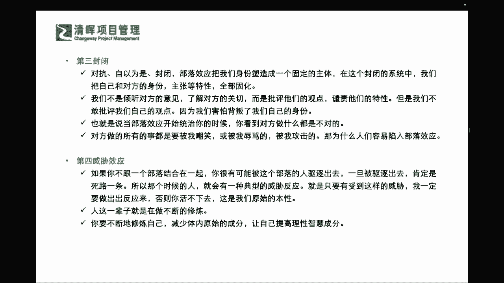

# 不妥协的谈判 - P4：4、部落效应带来的五大诱惑 - 清晖Amy - BV1HVHXehEwP

在这本书里面他提到一个术语，就说我们对自己身份的一个认知啊，这么多的一些这个这个呃五大五大这个因素啊，甚至还有这个情感经历，但是在这里面我怎么去辨识出来，我有哪些情感经历。

可能会影响我的这个身份的一些认知呢，来去帮助我这个呃深度来剖，析出我的这种矛盾呢，其实第一个词啊就叫做这个啊部落效应是吧，一听部落大家都清楚啊，部落就是大家聚在一起啊，就有酋长啊。

你这个就像我们这个呃以前这个这个华夏是吧，还有这个这个炎帝是吧，还有蚩尤还要去打仗呢是吧，那我们现在更是有各种战争，我们不叫部落了，叫国与国是吧，那其实这种都叫做什么一个。

他们的一个这种固定约定俗成的一个群体是吧，来去对抗另外一个这样的一个群体，那我们来看部落效应，可能会导致我们什么样的一个问题呢，第一就是要陷入对抗了，部落效应导致我们从对抗的角度，就是不是今天不是你死。

就是我活是吧，从对抗的角度来看待我们与另一方的关系，比如我们和这个某美丽国的关系是吧，唉你说我们大家和平来共荣多好呀，就一定要想成你比我强了，你肯定会欺负我是吧，我就不能让你比我强是吧。

所以可能在这个里面的时候，这个就容易放大了双方之间的一个差异性，却把这个共通点和相似度降到最低，即使我们感觉与对方看起来很亲近，但是部落效应，也会让人们患上这种关系的健忘症。

把人际关系当中好的一面全部抛到脑后，想起来都是坏的一面，在这个里面我们不得不去说，我们在之前啊，前面3年疫情阶段，可能在某一个区域其实放到最大化了，是不是啊，哪一个区域啊。

比如说我们的啊香港行政特区是吧，啊我们这个封官呐，或者是互相有这样的一个这个这个互相对立的，一些这种这种政策啊，是不是啊啊同志们，所以可能你看到的，其实他其实我们感觉都是大家都是中国人，都讲中国话。

都写中国字是吧，但是其实在这样的一种部落效应之下，你可能会有看到的东西都是不好的一面，因为你是对抗的视角，非此即彼的视角是吧，没有把大家想成一个利益共同体是吧，那么第二个呢就是这个自以为是了是吧。

它其实助长了一种，就是我们讲特别明显的一个例子是什么，我们以前在清政府的时候，唯我独尊是吧，也就是说我们这个整个的这个观念上，就会认为只要我把它围圈儿围起来啊，我就我自己就是还我自己。

我就是我就是老大是吧啊，我也不需要去跟各国这个有，产生一些这种所谓的什么通史啊，或者是一些交流啊是吧，你就会很自以为是是吧，也就是不，这个通常有时候甚至还会感觉我泱泱大国是吧，呃处于为什么叫中国啊。

我们就认为我们在什么世界的中心吗是吧，我们道德上和我们情感上也会高人一等是吧，所以可能在这个这个地方，我们其实是非常非常就是，理直气壮的去来筑起这样的城墙，我们的固步自封，我们的自以为是是正确的。

但其实它就是部落效应的一个体现，他其实会把一些矛盾激化，不是会解决是吧啊，所以这个这个里面大家能看到啊，可能我们还是返回到哲学上的一个观念是什么，人们往往这个群人们往往意识里啊。

都能够去针对自己已经意识到的一些问题，进行一些什么学习和改善，但是最难的是什么，最难的不是针对现有的困难进行解决和改善，而是你自己压根就没有意识到，你有什么样的问题，我自己不知道我自己有这样的问题。

其实这个部落效应就是这样的一种问题，也许你自己不知道你有这样的问题，你再反思回到你的工作岗位，你是不是也有小群体呀是吧，你的部门是不是也有小小暗礁啊是吧，所以可能在整个这样的一种情况之下。

大家会发现其实无所不在啊，心理学非常的这个奇妙，如果感兴趣的话啊，严老师也专门讲过心理学的几本书，在前面的这个读书会也可以，咱们社区的同学就可以翻回去免费看是吧，还有一些新加入的同学。

你可能要购买严老师这个读书会，或者是加入社区去看，那么严老师在一些沙龙里面也讲过，这个管理心理学，和咱们的这个心理学的一些应用的工具，也非常的有趣啊，其实你会看到。

我们可能连自己对自己的认知都还搞不清楚呢，是吧，但是又觉得对方有好多问题哦，你要先改好了是吧，都是把手指头往外指了是吧啊。

那这是部落效令的第二个，那第三个是什么，就是封闭呀，刚才提到就是固步自封啊是吧，我们不听对方的意见，我们也不想让对方来这个关怀自己是吧，你如果出现了部落效应的时候，往往就是其他即便是友好访问。

你都会觉得是是干什么，是在针对你，是来挑衅你是吧，甚至我们在建国初期，建国早期，其实用这个什么乒乓球外交来打通了什么，和美国的一些联系是吧，之前也这个这个互互相之间的这种什么壁垒，非常非常的高是吧。

然后也有很深的误解是吧，所以可能在这个里面我们大家要搞清楚啊，我们可能在这个整体的这个过程当中，我们需要请大家非常非常明确啊，你自己啊返回到我们自己的团队，返回到我们自己的公司部门。

我们是不是存在这样的问题，那第四个就是威胁效应，这个呢危险效应是啥，也就是说如果大家其实非常非常明确的一个点，就是说你如果今天你不选择站队是吧，有同学说哎我就是不站队，我自己要坚持我正确的东西。

我自成一派，但是事实往往是骨感的是吧，现实很骨感，如果你今天不跟其他人站在一起，你有可能被每个部落都不接受，不包容的时候，你其实就会变成一个什么死路一条，为什么，就是说明我们讲的今天。

如果你是一个孤岛的时候，但你自己又没有那么强的一个能量，去不断的让你自己能够去凝聚出这样的一个，新的一个所谓的部落效应的时候，你其实可能就会变成一个被部落驱逐出去的，一个什么流浪者是吧。

这样其实可能就会有这样一个典型的威胁反应，你就害怕变成这样子啊，你就必须不得已的去趋炎附势是吧，因为这也是一个原始的本性，为了生存嘛对吧，所以你这一辈子就在不断的修炼，我们讲过最硬气的一句话，同志们。

今天我不用去拍任何人的马屁，我不用去当那个这个这个百万富翁啊，亿万富翁，我自己就要做这个最最厉害的这个，福布斯的number one是吧，那你自己就要不断的修炼啊，这是前提啊，你自己得非常厉害。

但如果你还没有变成那样子，你又被各个部落去驱逐出去的时候，你自己也没有去啊，有这样的一个这个所谓大树底下好乘凉的，这样一种情况的时候，你有可能就会陷入更深的一种矛盾，所以反其言而止。

就是我们要不断的修炼自己，而且要减少体内原始的部分，啥意思，就是自己又想偷懒，自己又不想前进，又不想去升级，但是啊又要去这个想要去抱大腿是吧，我们现在讲的这个啊，我们在这个当中。

我们要不断的去减少这种原始的成分，让自己提高理性智慧的成分啊。

