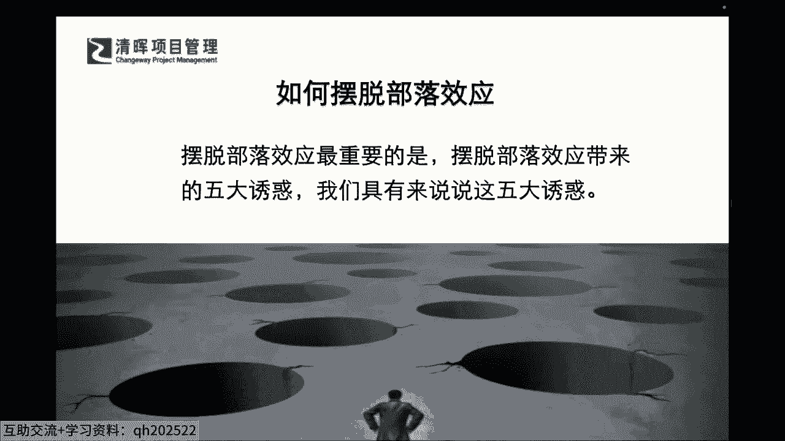
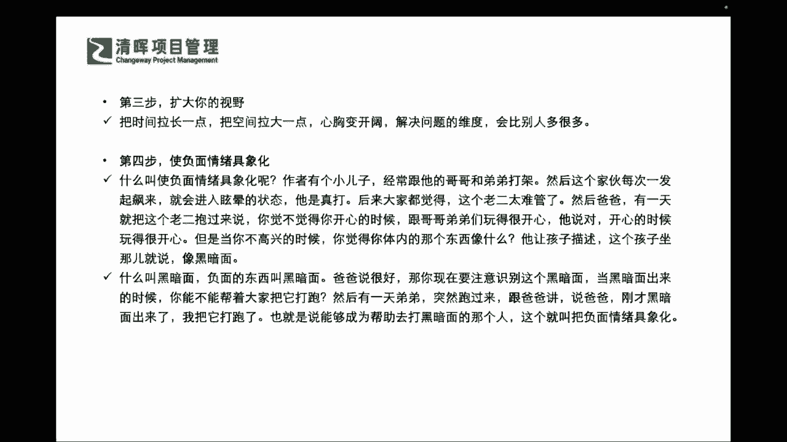
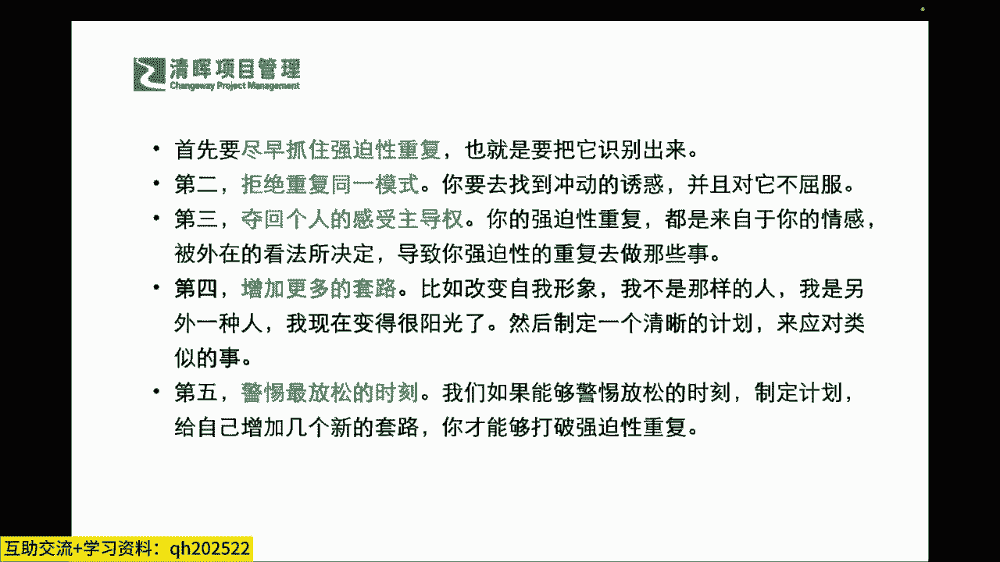

# 不妥协的谈判 - P5：5、如何摆脱部落效应 - 清晖Amy - BV1HVHXehEwP

那我们清晰地认识到了这种部落效应，那我们就来讲讲我们到底要怎么样去摆脱它，怎么样去摆脱它，同志们，你们怎么来理解这个事呢，怎么来理解这个事儿，如果今天你要去摆脱这个部落效应。

你认为最有利的几个因素是什么，那我们来看看，如果你已经潜意识里面有了这样的一些理念，我们就需要在书里面要讲到，我们就需要去摆脱五大诱惑啊，那什么样的五大诱惑呢，同志们，你们先来想想看啊。

在评论区也抠出来，如果你认为你也发现，你自己有这种部落效应的时候，你想出什么样的一些办法，来去做这样的一个摆脱的动作呢，同志们，来让我知道你的一些idea啊，一些想法，你自己如果遇到这样的情况。

你也认知到了，你认为你应该怎么样去摆脱呢，同志们，你怎么摆脱这个部落效应啊，你发现你这个很多个这个小山头都起来了，可能在这个小山头里面，而且呢可能各自也有各自不同的主张。

所以你在推行一些工作的工作的时候，会有很大的难度，并且呢可能还会啊产生很多很多的冲突，需要去多方的协调，谈判协商等等是吧，那你怎么样摆脱这种啊，有这个堂堂同学说要重新定位是吧啊，重新定位的意思。

我相信你，你讲的是想要去重新认知，搞清楚啊，这种背景来去采取不同的策措施和策略是吗，嗯那我们还其他同学，你自己现在应该是在工作岗位当中，肯定会或多或少遇到这样的情况，你怎么来摆脱这个部落效应呢。

那么在我们这里面，这这个这本书里面，我们跟大家来讲讲这五大诱惑是吧，几大诱惑啊，我们挑几个这个经典的跟大家分享啊，来怎么样，第一个第一个你要已经产生了不对的东西了，你要怎么办，就俩字儿止损呐，同志们。

你已经跑错了方向，你难道还要说好，我再跑跑再看看吧，看到底有多少损失会这样子吗，不会你要干什么，立即停下来，但是你先不着急，说下一个方向往哪里跑，但是你知道你现在是跑错了方向，你就需要干什么。

立即停下来是吧，及时的停止眩晕，在这本书里面它叫眩晕啊，也就是说你要止损，那这个眩晕值是什么，就是你不要再去继续，陷入到这种部落效应里面去了，你要让自己保持理性，不要再往错误的方向继续去跑了是吧。

这就是站下来停止对吧，那么第二个要在著作者的这样的一个理念当中，他要要求我们要学会当头棒喝是吧，首先要牢记谈话的目的，也就是说你在整个的谈判解决矛盾的时候，你要搞清楚，不要被部落部落效应给带跑偏了。

你先去理解说哎呀，A和B之间矛盾很深呀，C部门和D部门又是互相不对付是吧，结果在跟ABCD部门谈谈一件事情的时候，各自有各自的小九九是吧，其实这些都不是最关键的，你首先要牢记的就是。

你要跟ABCD要达成一个什么样的一个什么，协商目的是吧，你的一个谈判目的是什么，那么你在这样的一个冲突当中，那你到底应该找到什么样的一个方法来去，打破现在的这种我们所谓的眩晕。

所以通常我们要学会说出一些出其不意的话，那么出其不意的话就是你需要say NO去停止是吧，停止，同时要请出什么合法权威和这种专家推荐是吧，同时就我们讲的这种合法权威专家推荐，就是我们通常来讲。

如果ABCD都各自有说法的时候，好今天那我们来请出第三方的专家，而且第三方的资质认证，是得到过这个更广泛范围的一个，认可的一个部分，所以可能在这个里面大家要非常非常明确，清晰的一点。

就是是否合理善用了这个专家判断，这也是为什么现在我们有这么多的一个专家，第三方专业的机构的存在是吧，也就是说如果今天啊，就像我们可能啊呃这个严老师所呃，服务过的一些企业的这样的一些内训和咨询。

一些业务一样啊，也就是说大家如果都能通过内部的一些解决，就已经能够充分的自我吸收，自我成长的话，我相信大家都不太会找第三方，但是我们往往遇到的和服务的一些企业呢，大家其实素质和整体员工。

这个整个的背景都是非常非常强的，反而在这样的一种情况之下，他们更需要具有权威和专业度的第三方，来去给出来这样的一个什么，平息矛盾和抓出主要方向，进行客观这种什么引导的一个作用是吧，所以可能在这个里面。

我们就引入了这种什么理性是吧，引入了理性，所以这是一个专家喊停，然后说出say NO，然后再请出专家判断，所以这样就可以至少先把这个眩晕先停止步，那有了这样的喊停，Say no，请出专家之外。

也需要继续扩大我们的视野是吧，扩大我们的视野来去，把时间拉得更长，把空间拉的更大，心胸变得更开阔，那我们解决问题的维度可能会比别人多的更多，也就是说我们今天到底是蹲着啊，我们举一个比较鲜活的例子。

就是我们很多的一些这个排雷兵啊，大家都是低着头闷着头，一直在什么啊，拿着那个仪器在扫来扫去，但其实我们很多时候只需要大家站起来是吧，站立起来，然后能看到俯视到我们整整个的地容地貌，你就能够判断。

大概我们的这些地雷都可能会被埋在哪里，更有重点重心的去解决问题是吧，就是因为我们可能只顾埋头干活，埋头的去赶路，甚至有一些点对点的沟通，而没有把我们的整个这个视野和范围格局，把它放大。

让我们能够有更多的一些什么路径，也就是说我们今天要么就是你赢，要么就是我赢，但是我们也提出来一个什么双赢嘛，既然都能满足，那为什么不去满足呢是吗，所以可能在这一点上，大家要非常非常清楚的一点。

我们就需要请大家啊特别特别啊熟记的一点，就是我们在整个的贯穿的过程当中，也需要请大家能够融入你个人认知的一个提升，扩大你的一个视野，你就会发现其实道路千万条啊，这个其实不是一个夸大的说法。

因为我们讲的地球是圆的，你不管是陆运海运空运啊，还是有其他的这种不行，你总之呢你肯定是方法多多样的，你可以去解决同一个问题，只是取决于你有多少时间，多少成本啊，你还能承担多大的风险是吧，所以同志们。

你一定要打开你的视野是吧，不要拘泥于牛角尖，那第四个呢就是要来使负面的情绪具象化，那什么叫做这个这个具象化呢，比如说这个作者就提到了，他有个小儿子，经常跟他的这个这个哥哥和弟弟就打架嘛。

然后这个呃这个小儿子每次这个一一发起怒来，就开始进入到这种什么眩晕，就是极度高度情绪化的状态，那后来大家都觉得这个这个老二，这个小孩太难管了，但有一天呢这个爸爸啊，就这个著作者有一天把这个老二抱过来说。

你觉得觉不觉得你开心的时候，跟哥哥弟弟们玩得很开心，那他说是的，那么开心的时候玩的是挺开心的，但是当你不高兴的时候，你觉得你体内的那个东西像什么，他让孩子来描述，那个孩子坐在那儿就说像阴黑暗面是吧。

还有的说像什么像一团火，那我相信咱们大多数这个国内的家长啊，咱们现在很多的家长，随着咱们的这个受教育的素质啊，我们学习这种父母的一些这个教育理念，也都越来越多，大家也有可能会有这样的一个意识。

就是你需要去跟你的这个孩子来，去了解他的一个真实想法，那在我们的职场也是一样啊，发生一些这种矛盾冲突的时候，你一定要去有方式方法了解到你的矛盾，冲突的双方，到底他的一些真实的想法是什么是吧。

再去加以引导，那么他所这个小儿子所讲的阴暗面呢，其实就是他负面的一些情绪，那这个著作者就说了好，那既然你已经注意到你有这个阴暗面了是吧，你有这个黑黑暗一面的，你是吧，那你能不能把这个黑暗一面的你打跑呢。

然后有一天突然跑过来，这个跟跟这个著作者跟这个爸爸说，刚才那个那个黑暗阴暗面又跑出来了，我把他打跑了，也就是说他会非常具体的把这个负面情绪，就定量放在那，也就是说这个东西它不会成为一个阻碍。

而是一个正常会出现的一个这个因素，但是我们可以去什么控制它啊，可以去控制他，那这个是他通过他孩子的一个例子来去举例，那么其实在我们的这个成年人，管理自己的情绪的时候，我们其实啊其实反而有时候啊，同志们。

你不要觉得难啊，我要讲句实话，实说的就是我们通常成年了之后，都会对自己宽以待己是吧，严以待人啥意思，说反了是吧啊，我们通常要严以律己，宽以待人是吧，但是我们通常会宽以待己，严以这个待人什么意思。

就是对自己太包容了啊，自己想去发泄情绪，想去讲一些乱七八糟的话啊，自己觉得哦那是我太直了啊，那是我这个不高兴了，但是别人如果跟你讲一些这种很直接的话，伤害性的话，甚至一些这种情绪化的话。

你就坚决不能接受啊，这肯定是这个有问题的哈，所以我们也是需要成年人，也是需要对自己的这个负面情绪要去具体化，具象化，来去让自己有一个正确的认知啊，我的情绪的负面因素，我也可以把它具象化。

并且来管理理起来啊，这是可以做到的啊，同志们，所以还是那句话，我们把它正位啊，纠偏啊，正位过来要严于律己。

宽以待人是吧，我们还有第二个这个问题是什么呢，就是一个非常非常重要的一个，除了这个及时制止眩晕之外，还有一个叫做强迫性重复，提到这个这个点的时候，大家一下就想起来了什么摩登时代是吧。

大家都看过这个黑白默片吧，啊，摩登摩登时代里面会出现什么样的一个，一个状况，大家还记得那个卓别林还在那不停的干什么，不停的拧钉子啊，拧钉子是吧，不停的重复是吧，不停的重复，所以可能在这个当中啊。

我们需要请大家有一个非常这个呃，这个正确的一个认知理解，就是我们怎么样，怎么样能够避免这种强迫性重复，因为这种强迫性重复它的价值高不高啊，不高是吧，所以可能在这个当中你会发现。

你即便是不停地重复这样一个东西，就是也解决不了他，你比如说你最为家常见的这种，就是每当孩子考不好的时候，你就会跟他说，你只要继续努力，一定会好的，你会好，只要认真听课，你一定会更好的。

结果发现他后期他还是没有考好，你要一直不停的去重复，这样的话，你觉得对他会有帮助吗，那如果今天你的一个下属，你的一个同事，你们一起合作做一个项目啊，他也需要输出一个报告，他的报告一直做的不够好。

一直不达标，一直没办法去交付的时候，你还会不停地跟他说，你只要努力认真，你一定会这个达成结果的，只要你认真去做啊，你再仔细去看，一定会完成的，你这样强迫性的这种重复，这种低价值的事情有用吗。

能不能解决矛盾啊，解决不了，是不是啊，因为你毕竟没有深入啊，你不知道what happened，你不知道发生了什么啊，所以你要避免这种效应，我们讲的这是避免部落效应的东西啊。

所以你必须长着脑子来去做干活的，也就是说你做的每一步是不是真的有用，你要不断的去什么去去验证校正纠偏的，也就是说你在整个这个沟通谈判里面，你在整个这样的一些这种与人的一个交，这个项目合作合作里面。

你也会去看到有一些这样的一个问题，那你就不要去出现这样的问题嘛对吧，所以这是强迫性重复，那么遇到这样的强迫性重复咋整啊，也是五个点啊，第一个你要尽早把它识别出来，就像我们刚才提到的，就是不停的去啊。

说你一定会变得更好的，喊这样的口号是没有用的是吧，你要抓住关键的本质，一些根因才能去解决它是吧，尽早识别出来，你要发现你在工作当中，是否也有这样的一些强迫性重复，你在与别人沟通和谈判当中。

是不是也有这样的一些问题，你不停的说一些东西，别人也不爱听，也没有用啊，你看起来就是在不停的重复你的一些观点是吧，所以这是一个第二个拒绝重复同一模式，也就是说今今天我跟他这样讲过了，看起来效果不大。

明天你再去找他的时候，你就不能用今天的这种说法来去跟他讲了是吧，不要去重复同一模式，因为你会发现如果有用，他早有用了是吧，所以不要去重复那个无效的模式，你要去开拓新的模式。

第三个就是你要夺回个人的一个感受主导权，也就是说你的强迫性重复都是来自于你的情感，被外在的看法所决定的，导致你强迫性的重复去做那些事儿，所以你不要去带着别人的包袱去做，你的这个就是无价值的事情。

就别人认为你还要找找他再去谈，再去沟通，的确这是一个重复性的动作，因为问题没有解决，但是你要知道你要避免把这个再去找他谈，再去沟通，变成一个强迫性的重复了，就是无效低低效的一种这种重复动作。

你一定要抓回你个人的一个主导权，来去做正确有效的事情是吧，第四个就是增加一些套路是吧，也就是说你今天不要让别人把你的人设是吧，我们通常讲讲的比较通俗的一点，就是我们现在讲的人设吗是吧。

我们不要给自己有太强和固化的人设啦，也就是说你要让自己啊，要让自己可以变得更加的正能量阳光，并且能够有决心，有这样的一个这个方向和坚定的态度，来去带着大家解决这样的一个矛盾是吧，所以你要有更多的软技能。

这就是领导力技能是吧，让大家觉得不是翻来覆去，都是你来找我，反正你跟我谈，我也跟你谈不出个什么结果，这样是不行的啊，你要反套路行之，其实所谓的更多的套路其实就是一种反套路。

你要有更多提升自己的一些资本拿出来是吧，那么第五个点呢，其实就是我们的警惕最放松的一个时刻，那么我们如果能够警惕放松的时刻，制定计划，给自己增加几个新的套路，你能够打破强迫性的一个重复。

也就是说自己对自己要有高标准严要求是吧。

