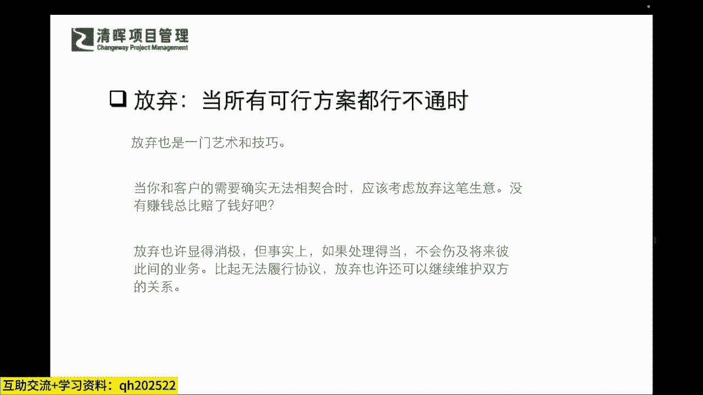

# 不妥协的谈判 - P6：6、5种实践工具解决分歧 - 清晖Amy - BV1HVHXehEwP

是跟大家介绍几种啊，非常有用的一个实践工具，啥工具呢，就是怎么样解决你实打实的分歧，有五种特别有用的一个方法啊，这个五种有用的方法咋有用法呢，比如说第一种叫做条件交换啊，它是代表什么呢。

一听这名字就明白了啊，这个我的跟你换一点，你的跟我换一点，然后效果呢双方都往前走了一步，这个是双赢的，一个是非常好的一个选择是吧，那么第二个这个方法叫做什么附加利益是吧，附加利益。

那等一下也会跟大家去讲是吧，它带来什么样的效果呢，它其实就是让客户从心理上感觉赢了，同志们心理上和实际上其实是两种情况是吧哈，今天我们就要让我们的客户这个满意度非常好。

但有可能啊你的项目交付的时并不成功是吧，但是可能你的你的这个干系人。

还是对你这工作非常满意的，大家都经历过是吧，有些项目经理他最终带项目是带没带出来。

但是其他人都对他反馈口碑特别好是吧，这是心理上他赢了嘛是吧，那么它其实就是来弹性，符合一些顾客的需要是吧，那么我们再看第三个可行方案叫什么，折中双方分歧点一听折中就是你让点，我让点呗对吧。

它其实就是双方各退一步，但整体都往前走了一点，但是你你再退一点，说我再退一点，就双方无法往前走的情况之下，就是想办法折折中呗对吧，你退点我退点啊对吧，那么第四步就是做让步是吧。

这个让步主要指的是单方面的一个让步，单方面的让步，可能会为以后带来一些不良的先例啊，单方面要么你通常什么情况之下，你说哎我就这样子，我就我就答应了你的一些条件吧，说明什么，说明人家掐住了你的七寸了是吧。

有可能你的这个让步，就让人家找到一些弱点了是吧，但是你可能在当时这种情况之下，又并没有其他更好的选择了是吧，所以你不得不去做这样的一个这个让步是吧，那么第五个呢就是放弃give up。

就是但是give up也有，只有give up的一个战略是什么，我们通俗点说就是生意不成情义在啊，什么意思啊，就是我们今天即便这个事没谈拢，也不能拍案而起，这个决绝的拂袖离开是吧。

导致后面压根这个人都见不得是吧，所以可能我们在这个里面我们也要搞清楚啊，我们不要再去制造更大影响的一些恶劣的，这样的一个这个这个这个矛盾了，我们反而要收敛来去维系住，我们现有的一些成果是吧。

虽然我们不能进一步达成一致，但是我们还是与保持友好的这样的，一种联系的是吧。

那这是五种方法，那我们来举个例子吧是吧，那怎么样去来做呢，我们刚才其实也讲了啊，我们快速看一下这个关键词，条件交换，就是你换点儿，我换点儿是吧啊，答初步达成一致，We w，那什么时候做条件的交换呢。

你往往就是什么，你双方是有这种什么有等值的一些价值的东西，在手上，你也知道他兜里有，他也知道你兜里有是吧，所以你们首选就是双赢嘛对吧，你的你有的是他想要的，他有的是你想要的是吧。

所以可能在这个当中，你们能就互相找到一个平衡点，那么附加价值呢其实就是啊本来他想要这个，但是你告诉他说，哎我可给可能给你附加一个别的东西，让他也觉得他没亏对吧，哎不直接对他的一个原本的需要做更改。

但是给他附加了一个其他的价值，但是也让他心理上感觉到诶还挺满足的是吧啊，所以促成了双方达成协议，那么理想的一些附加价值，就是对客户有明显的一些价值，比如说啊有些公司他可能在卖产品的时候说。

你看我这个产品是这个都是啊这个高价值交付，我们没有办法再去打折了，但您看这样行不行啊，我们整个案例落地之后，我们会把咱们公司整个应用的一个状况，当做一个样板宣传。

放在我们整个的这样的一个企业的一个宣传的，这个这个啊这个呃整个网站当中，让大家都能看到我们的行业代表，就是您公司的一个隐形的前沿的一个技术价值，那这个对于他来讲，唉哟还有免费的广告是吧啊哈。

所以可能这个当中他就认为诶也行，因为我自己去投广告，我自己去宣传，我也是要需要花费很多的，这样的一个精力的是吧，所以可能在这个呃当中大家要呃了解啊。

那么这个利益附加的在哪里，你可能会放在你们并没有分歧的，那个条款里面啊，有分歧的你不能去附加是吧，那么什么时候去使用这个附加呢，实在实在谈到最后一步，又没有办法去完全改变这个方案啊。

但是你又不想去表现的没有灵活性的时候，你就可以想想这个招啦，当然啊这位同学说的也是，你要尽量了解，这当然啦啊我们讲知己知彼百战不殆嘛，我们现在讲了这个商业当中，就是讲究信息的一个什么均等性吗，同志们。

如果你们连这个提前的功课，你去了解对方的功课都不做，这个肯定是有问题的，所以可能在整个谈判过程中，甚至可能今天我们讲升职加薪，你跟你老板的之间这个谈话也属于谈判，你是不是要也要去了解一下你老板的风格啊。

今年整体运营状况怎么样啊，有多少奖金池啊，今年有几大概几个名额啊，啊我的这个绩效大概被考评在什么水准了，你多少得去了解了解是吧，你清楚了这些之后，你再跟你聊，老板去聊的时候。

你更加有这个方向和策略啊，那么折中双方的一个分歧点啊，这个折中刚才已经提到，就是各让一步是吧，反正这个呃，呃这个这个提案和这个客户的这个需求之间啊，我们找一个点，让大家可能都没达成自己原有的目标。

但是也不差啊对吧，我们可以去有这样的一个折中，那什么时候呢，就是局部性的让步，这一定不是大让步啊，局部性的让步虽然不是100分，但是也有个80分90分啊，所以不能说虽然没有100分，但是不及格不行啊。

就是局部性的小让步啊。

那么单方面让步，其实就是一个什么不要求同等回报的做法啦，也就是说你和什么时候去做让步，这就是一个非常大的，就是可能会伤及到你的一些什么公司的利益，声誉啊，还有一些这种可能会有一些这种法律法规是吧。

这种情况之下，你一定要做一些单方面的让步啊。

那么我们在这个当中啊，在最后提到的这个give up是吧啊，这个我们买卖不成情义，在当所有的这个可行方案都行不通的时候，give up也是一个做法，那give up我们也要积极的去放弃。

