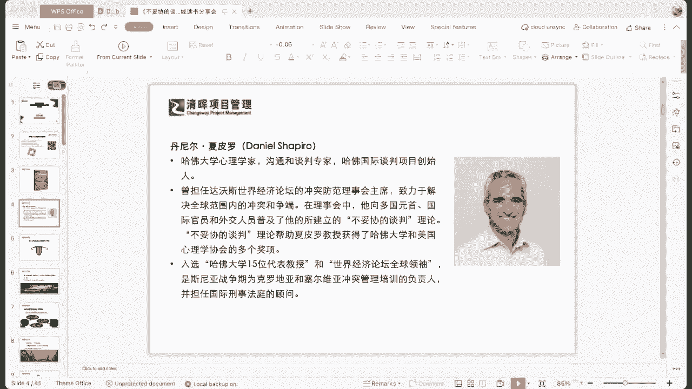
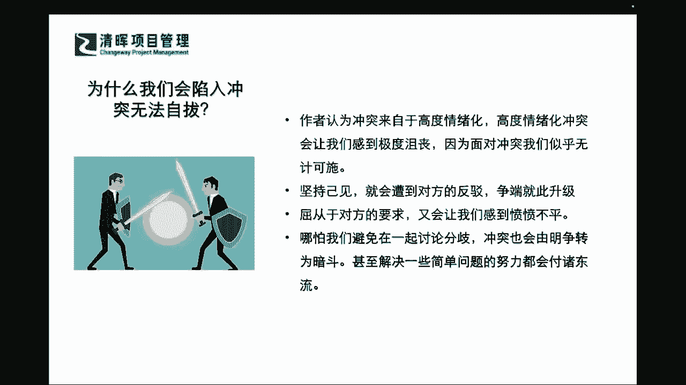

# 不妥协的谈判 - P1：1、我们为什么会陷入冲突无法自拔 - 清晖Amy - BV1HVHXehEwP

讲讲这本特别有趣的一本书叫做不妥协的谈判。

这本书里面的一个核心内容是啥嘞，我们先从一个非常好好的一个问题开始啊，首先这本书里面提到的第一个问题就是，为什么我们会陷入冲突无法自拔，他问的很直接啊，所以在这本书里面，作者会认为冲突来自于什么。

大家来回想一下，你自己在什么情况之下会发生这种冲突，你什么时情况之下就控制不住自己，会跟别人去吵架啊，会闹一些这种团队的矛盾，这就是来自于什么高度的情绪化是吧，那高度的情绪化。

这个是用的比较文绉绉的一个总结啊，那高度情绪化说明什么，自己控制不住自己了是吗，所以很多时候就属于那种就是什么，一点就着醒的，大家来想想看啊，有多少同志们，你们是属于那种一点就着醒的啊。

大家还有有时候啊，我要在这里特别去纠正大家的一个观点，有时候啊大家会误解，这种一点就着的是一种真性情是吧，很多同志们会觉得你看他有什么，说什么多直接呀是吧，但是同志们，我刚才为啥放了哈佛的教授。

放了他的一些观点，还要再放个中国的智慧的几句格言啊，同志们，we are in china是吧，我们在中国，我们在什么啊，我们国学的文化之下，也就是说在这个里面。

有时候你的这种too much direct是一定有问题的，是吗啊，你也就是说你不能特别去急于去表达，你的一些极端的情绪，是不是啊，所以可能在这个里面我们要特别清楚一点，那么你所认为的高度情绪化。

可能会有什么样的一些这种啊症状呢，同志们啊，在评论区扣一下，当你出现这种高度情绪化的时候，你会做出什么样的行为，同志们，你先想想看啊，不要着急啊，不要着急去去去看作者的idea。

你自己先来消化消化会有什么样的行为，拍桌子非常好啊，这个尾号5225的同学，非常的这个这个认真积极的都听进去了，还有什么样的行为，同志们，当你你自己啊，我们就专注的看你自己啊。

因为在这里大家都没有什么包袱是吧，没有显示大家的真实姓名是吧，啊只是你的一些这个这个网名是吧，大家也不太清楚哈，互相之间没有这个包袱啊，会提高音量，非常好啊，同学还讲这个有这个怒发冲冠啊，讲脏话是吧。

还有什么样的情绪，还有什么样的症状，同志们，你来想想看，当你啊今天作为一个客观的第三者啊，脸红脖子粗是吧，当你作为一个客观的第三者，比如说你是一个刚刚进入会议室的人，你来想想看，你看到了一个人。

且不论啊之前他们谈论了什么问题啊，你看到一个人非常好啊，这个嗯这个艾斯tor同学说的情绪激动啊，面红耳赤，恶言相向是吧，你看到这么一个人，你会认为这个人对你会有说服力吗，你看看到一个人怒发冲冠。

拍着桌子满口脏话是吧啊，袁喜同学说的不冷静啊，这个不理性，你看到他什么非常不理性的一面，你一般会对这个人肃然起敬，还是会产生其他的情绪，我告诉大家啊，这个不简简单单是一个正能量负能量的问题，同志们。

你知道leadership是什么吗，大家听过leadership，今天我们就讲过一个，严老师在讲leadership的这个这个沙龙的时候，其实讲过我们领导者为什么，今天你放过去十几个人是吧。

然后往那儿一站，你一进那个会议室，他们一言不发，你全部站立一排，或者是全部坐在那个会议室里面，你一眼望过去就能知道哪一位是大boss，为啥为什么，同志们，你想过这个问题没有，不是因为他长得长得很帅气。

长得很亮是吧，不是这样子，是通过什么，我们讲leadership，他会有一些什么个人的一些魅力和气场是吗，同志们对吗，你自己来回想一下啊，气质啊，对没错，你回想一下是不是啊，我们不讲那些高大上的术语。

就这么回事嘛，你今天走进会议室，你一见就像你去拜见拜访客户，你一走进对方的会议室，你还没有一个初判吗，哪一个是大boss，是不是啊啊当然我们今天不完全以貌取人是吧。

所以可能在这个里面我们需要跟大家要讲清楚，为啥leadership就是一个什么，就是一种情绪化的展现，emotional的展现，你说什么气场气质，你难道是从他语言get来的吗，不是你是从他长相盖了吗。

不是那是什么呢，对吧，这是一种说不清道不明的，那其实就是源自于他的表现，对你情绪的波动影响，get到了吗，也就是说可能在这个里面你就需要搞搞清楚，如果今天你进到一个会议室，你的高度情绪化。

刚才大家所提到的这些表现，其实都会造成别人情绪的浮动是吗，那别人情绪浮动了会怎么样，今天你来看看啊，你就在一个一片湖面上，你两片波纹全部打在一起的时候，会干嘛乱嘛对吧，就开始乱了嘛对吧。

所以可能在这个时候就会有冲突啦，那比你造成别人的什么不舒适了，对不对，所以可能在这个里面，为什么中国人讲究静水深流啊，就是波澜不惊啊是吧，我们喜怒不形于色呀是吧，所以可能在这个里面。

我们来看到在这个高度情绪化之前，我们有这么多的症状，那么如果你在这种这种情绪之下，你可能会一直通过这种脸红，脖子粗来坚持你自己的idea，那你你这种高度情绪化的这种情绪表达。

又会遭到对方的一个什么情绪波纹的一个影响，你也会什么受到反驳，你们俩之间的这种什么矛盾就会升级是吧，所以可能在这个里面，大家能够看到的就是我们整体的这样的一种啊，互相的一种矛盾。

陷入越来越不可这个开交的一个局面，所以哪怕啊哪怕你今天就是说选择，你已经跟人家拍完桌子，扔完凳子啊，还有这个特别喊喊过，吼过，甚至爆过一些粗口之后，你说好吧，就先听你的，我看看你能做成什么样。

你即便是屈从于对方的一些要求的时候，你又会感到什么愤愤不平，而且对方也会感到什么非常气愤是吧，而且你这个不叫真正解决矛盾，你不要觉得你自己好像这个委屈了啊，你去你去那个什么先去成全对方。

但是这种成全是完全没有解决矛盾的是吧，你的冲突也会由明争变成暗斗，甚至在之前一些这种共同团结的一种，这种努力方向，也会什么付诸东流是吧，付诸东流，所以可能在这个里面，我们也需要非常非常清楚的一点。

就是我们要怎样能够在这样里面。

